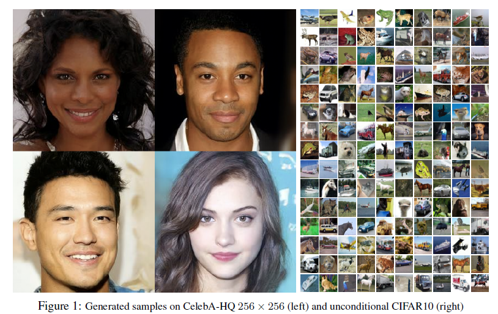
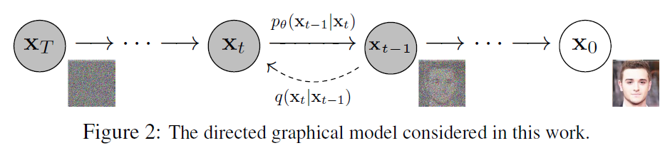
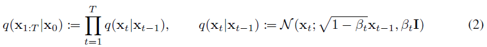
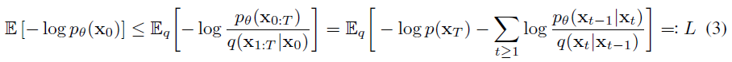
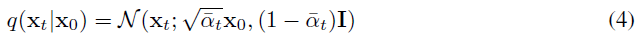

# Denoising Diffusion Probabilistic Models

- [论文链接](https://arxiv.org/pdf/2006.11239.pdf)

# 摘要
&nbsp;&nbsp;&nbsp;&nbsp;&nbsp;&nbsp;&nbsp;&nbsp;我们使用扩散概率模型得到了高质量的图像合成结果，这是一类受非平衡热力学考虑启发的潜变量(latent variable)模型。我们通过根据扩散概率模型和带朗之万动力学(Langevin dynamics)的去噪得分(denoise score)匹配之间的新颖联系设计的加权变分上界(weighted variational bound)进行训练，获得了最佳结果，并且我们的模型自然地支持一种渐进的有损解压缩方案，可以解释为自回归解码的一种推广。在无条件的CIFAR10数据集上，我们获得了9.46的Inception分数和3.17的最先进的FID分数。在256x256的LSUN数据集上，我们获得了与ProgressiveGAN相似的样本质量。我们的实现可在https://github.com/hojonathanho/diffusion 上找到。 

# 1 引言
&nbsp;&nbsp;&nbsp;&nbsp;&nbsp;&nbsp;&nbsp;&nbsp;最近，各种类型的深度生成模型在各种数据模态中展示出了高质量的样本。生成对抗网络（GANs）、自回归模型、流模型和变分自编码器（VAEs）已经合成了引人注目的图像和音频样本[14, 27, 3, 58, 38, 25, 10, 32, 44, 57, 26, 33, 45]，在基于能量的建模和得分匹配方面也取得了显著进展，产生了与GANs相媲美的图像[11, 55]。

&nbsp;&nbsp;&nbsp;&nbsp;&nbsp;&nbsp;&nbsp;&nbsp;本文介绍了扩散概率模型[53]的进展。扩散概率模型（简称“扩散模型”）是通过变分推断(variational inference)训练的参数化马尔可夫链，用于在有限时间内生成与数据匹配的样本。该链的转移(Transitions)是通过学习来反转扩散过程(reverse diffusion process)实现的，**扩散过程是一个逐渐向数据添加噪声的马尔可夫链**，噪声的添加方向与采样相反，直到信号被破坏。当扩散过程由小量的**高斯噪声**组成时，将采样链的转移设置为条件高斯分布就足够了，从而实现了特别简单的神经网络参数化。 

&nbsp;&nbsp;&nbsp;&nbsp;&nbsp;&nbsp;&nbsp;&nbsp;据我们所知，扩散模型在定义上很直观且训练效率高，但迄今为止尚未证明它们能够生成高质量的样本。我们展示了扩散模型实际上能够生成高质量的样本，有时甚至比其他类型的生成模型的已发表结果更好（第4节）。此外，我们还展示了扩散模型的某种参数化在训练过程中揭示了与多个噪声水平下的去噪得分匹配以及采样过程中的退火朗之万动力学的等价性（第3.2节）[55, 61]。我们使用这种参数化获得了最佳的样本质量结果（第4.2节），因此我们认为**这种等价性是我们的主要贡献之一**。 

&nbsp;&nbsp;&nbsp;&nbsp;&nbsp;&nbsp;&nbsp;&nbsp;尽管我们的模型在样本质量方面表现出色，但与其他基于似然的模型相比，我们的模型的对数似然并不具有竞争力（然而，我们的模型的对数似然比起已报道的基于能量模型和得分匹配使用的大估计要好[11, 55]）。我们发现，我们模型的大部分无损编码长度被用于描述人眼无法察觉的图像细节（第4.3节）。我们在有损压缩(lossy compression)的语境下进行了更精细的分析，并展示了扩散模型的采样过程是一种类似于渐进解码(progressive decoding)的过程，它类似于沿着比特顺序进行自回归解码，这在通常情况下是自回归模型无法实现的广义化。 

# 2 背景
&nbsp;&nbsp;&nbsp;&nbsp;&nbsp;&nbsp;&nbsp;&nbsp;扩散模型[53]是一种潜变量模型，其形式为 $p_{θ}(x_{0}) := ∫p_{θ}(x_{0:T}) dx_{1:T}$ ，其中 $x_{1}, \dots, x_{T}$ 是与数据 $x_{0}$ 具有相同维度的潜变量，满足 $x_{0} ∼ q(x_{0})$ 。联合分布 $p_{θ}(x_{0:T})$ 被称为**逆向过程**，它被定义为一个马尔科夫链，其中具有学习得到的高斯转移，起点为 $p(x_{T}) = N(x_{T}; 0, I)$ 。 

&nbsp;&nbsp;&nbsp;&nbsp;&nbsp;&nbsp;&nbsp;&nbsp;扩散模型与其他类型的潜变量(latent variable)模型的不同之处在于，近似后验分布 $q(x_{1:T} | x_{0})$ ，称为正向过程或扩散过程，被固定为一个马尔科夫链，根据方差调度 $β_{1}, \dots, β_{T}$ ，逐渐向数据**添加高斯噪声**。 

&nbsp;&nbsp;&nbsp;&nbsp;&nbsp;&nbsp;&nbsp;&nbsp;训练是通过优化负对数似然的常规变分下界进行的： 

&nbsp;&nbsp;&nbsp;&nbsp;&nbsp;&nbsp;&nbsp;&nbsp;正向过程中的方差 $β_{t}$ 可以通过参数重参数化[33]进行学习，**也可以作为超参数保持不变**，而逆向过程的表达能力部分由 $p_{θ}(x_{t−1} | x_{t})$ 中高斯条件概率的选择来保证，因为当 $β_{t}$ 很小时，两个过程具有相同的函数形式[53]。正向过程的一个显著特性是，它可以以闭合形式在任意时间步长t进行采样：使用符号 $α_{t} := 1 − β_{t}$ 和 $\bar \alpha_{t} := \prod^{t} _{s=1} \alpha_{s}$ 我们有以下关系式： 

