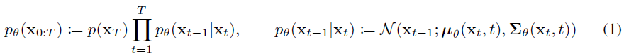

# Denoising Diffusion Probabilistic Models

- [论文链接](https://arxiv.org/pdf/2006.11239.pdf)

# 摘要
&nbsp;&nbsp;&nbsp;&nbsp;&nbsp;&nbsp;&nbsp;&nbsp;我们使用扩散概率模型得到了高质量的图像合成结果，这是一类受非平衡热力学考虑启发的潜变量(latent variable)模型。我们通过根据扩散概率模型和带朗之万动力学(Langevin dynamics)的去噪得分(denoise score)匹配之间的新颖联系设计的加权变分上界(weighted variational bound)进行训练，获得了最佳结果，并且我们的模型自然地支持一种渐进的有损解压缩方案，可以解释为自回归解码的一种推广。在无条件的CIFAR10数据集上，我们获得了9.46的Inception分数和3.17的最先进的FID分数。在256x256的LSUN数据集上，我们获得了与ProgressiveGAN相似的样本质量。我们的实现可在https://github.com/hojonathanho/diffusion 上找到。 

# 1 引言
&nbsp;&nbsp;&nbsp;&nbsp;&nbsp;&nbsp;&nbsp;&nbsp;最近，各种类型的深度生成模型在各种数据模态中展示出了高质量的样本。生成对抗网络（GANs）、自回归模型、流模型和变分自编码器（VAEs）已经合成了引人注目的图像和音频样本[14, 27, 3, 58, 38, 25, 10, 32, 44, 57, 26, 33, 45]，在基于能量的建模和得分匹配方面也取得了显著进展，产生了与GANs相媲美的图像[11, 55]。

&nbsp;&nbsp;&nbsp;&nbsp;&nbsp;&nbsp;&nbsp;&nbsp;本文介绍了扩散概率模型[53]的进展。扩散概率模型（简称“扩散模型”）是通过变分推断(variational inference)训练的参数化马尔可夫链，用于在有限时间内生成与数据匹配的样本。该链的转移(Transitions)是通过学习来反转扩散过程(reverse diffusion process)实现的，**扩散过程是一个逐渐向数据添加噪声的马尔可夫链**，噪声的添加方向与采样相反，直到信号被破坏。当扩散过程由小量的**高斯噪声**组成时，将采样链的转移设置为条件高斯分布就足够了，从而实现了特别简单的神经网络参数化。 

&nbsp;&nbsp;&nbsp;&nbsp;&nbsp;&nbsp;&nbsp;&nbsp;据我们所知，扩散模型在定义上很直观且训练效率高，但迄今为止尚未证明它们能够生成高质量的样本。我们展示了扩散模型实际上能够生成高质量的样本，有时甚至比其他类型的生成模型的已发表结果更好（第4节）。此外，我们还展示了扩散模型的某种参数化在训练过程中揭示了与多个噪声水平下的去噪得分匹配以及采样过程中的退火朗之万动力学的等价性（第3.2节）[55, 61]。我们使用这种参数化获得了最佳的样本质量结果（第4.2节），因此我们认为**这种等价性是我们的主要贡献之一**。 

&nbsp;&nbsp;&nbsp;&nbsp;&nbsp;&nbsp;&nbsp;&nbsp;尽管我们的模型在样本质量方面表现出色，但与其他基于似然的模型相比，我们的模型的对数似然并不具有竞争力（然而，我们的模型的对数似然比起已报道的基于能量模型和得分匹配使用的大估计要好[11, 55]）。我们发现，我们模型的大部分无损编码长度被用于描述人眼无法察觉的图像细节（第4.3节）。我们在有损压缩(lossy compression)的语境下进行了更精细的分析，并展示了扩散模型的采样过程是一种类似于渐进解码(progressive decoding)的过程，它类似于沿着比特顺序进行自回归解码，这在通常情况下是自回归模型无法实现的广义化。 

# 2 背景
&nbsp;&nbsp;&nbsp;&nbsp;&nbsp;&nbsp;&nbsp;&nbsp;扩散模型[53]是一种潜变量模型，其形式为 $p_{θ}(x_{0}) := ∫p_{θ}(x_{0:T}) dx_{1:T}$ ，其中 $x_{1}, \dots, x_{T}$ 是与数据 $x_{0}$ 具有相同维度的潜变量，满足 $x_{0} ∼ q(x_{0})$ 。联合分布 $p_{θ}(x_{0:T})$ 被称为**逆向过程**，它被定义为一个马尔科夫链，其中具有学习得到的高斯转移，起点为 $p(x_{T}) = N(x_{T}; 0, I)$ 。 

&nbsp;&nbsp;&nbsp;&nbsp;&nbsp;&nbsp;&nbsp;&nbsp;扩散模型与其他类型的潜变量(latent variable)模型的不同之处在于，近似后验分布 $q(x_{1:T} | x_{0})$ ，称为正向过程或扩散过程，被固定为一个马尔科夫链，根据方差调度 $β_{1}, \dots, β_{T}$ ，逐渐向数据**添加高斯噪声**。 

&nbsp;&nbsp;&nbsp;&nbsp;&nbsp;&nbsp;&nbsp;&nbsp;训练是通过优化负对数似然的常规变分下界进行的： 

&nbsp;&nbsp;&nbsp;&nbsp;&nbsp;&nbsp;&nbsp;&nbsp;正向过程中的方差 $β_{t}$ 可以通过参数重参数化[33]进行学习，**也可以作为超参数保持不变**，而逆向过程的表达能力部分由 $p_{θ}(x_{t−1} | x_{t})$ 中高斯条件概率的选择来保证，因为当 $β_{t}$ 很小时，两个过程具有相同的函数形式[53]。正向过程的一个显著特性是，它可以以闭合形式在任意时间步长t进行采样：使用符号 $α_{t} := 1 − β_{t}$ 和 $\bar \alpha_{t} := \prod_{s=1}  \alpha_{s}$ 我们有以下关系式： 

&nbsp;&nbsp;&nbsp;&nbsp;&nbsp;&nbsp;&nbsp;&nbsp;因此，通过使用随机梯度下降优化L的随机项，可以实现高效的训练。进一步的改进可以通过将L（3）重新编写为减少方差的形式来实现： 

&nbsp;&nbsp;&nbsp;&nbsp;&nbsp;&nbsp;&nbsp;&nbsp;（有关详细信息，请参见附录A。标签用于第3节。）方程式（5）使用KL散度直接比较 $p_{θ}(x_{t−1} | x_{t})$ 与正向过程的后验分布，在给定 $x_{0}$ 的条件下是可处理的。 

&nbsp;&nbsp;&nbsp;&nbsp;&nbsp;&nbsp;&nbsp;&nbsp;因此，方程（5）中的所有KL散度都是高斯之间的比较，因此可以使用闭合形式的表达式以Rao-Blackwellized的方式计算，而不是使用高方差的蒙特卡罗估计。 

# 3 扩散模型和去噪自编码器
&nbsp;&nbsp;&nbsp;&nbsp;&nbsp;&nbsp;&nbsp;&nbsp;扩散模型可能看起来是一类**受限的**潜变量模型，但在实现中它们允许**大量的自由度**。我们必须选择正向过程的方差 $β_{t}$ 、**逆向过程的模型架构**和**高斯分布参数化**。为了指导我们的选择，我们在扩散模型和去噪分数匹配之间建立了一个新的明确连接（第3.2节），从而为扩散模型提供了简化的**加权变分下界目标（第3.4节）** 。最终，我们的模型设计通过简洁性和实证结果（第4节）得到了证明。我们的讨论按照方程（5）的项进行分类。 

*(注释：高斯分布参数化指的是对高斯分布的参数进行选择和定义的过程。高斯分布是一种常见的概率分布，由其均值（μ）和方差（σ^2）两个参数来描述。在高斯分布参数化中，我们需要确定这些参数的具体取值或计算方式。)*  

## 3.1 正向过程和 $L_{T}$
&nbsp;&nbsp;&nbsp;&nbsp;&nbsp;&nbsp;&nbsp;&nbsp;我们忽略了正向过程方差 $β_{t}$ 可以通过参数重参数化来学习的事实，而是将它们**固定为常数**（详见第4节）。因此，在我们的实现中，近似后验q没有可学习的参数，因此在训练过程中 $L_{T}$ 是一个常数，可以被忽略。 

## 3.2 逆向过程和 $L_{1:T −1}$
&nbsp;&nbsp;&nbsp;&nbsp;&nbsp;&nbsp;&nbsp;&nbsp;现在我们讨论在1 < t ≤ T时, $p_{θ}(x_{t−1} | x_{t}) = N (x_{t−1}; µ_{θ}(x_{t}, t), Σθ(x_{t}, t))$ 中的选择。首先，我们将 $Σθ(x_{t}, t)$ 设置为未训练的时间相关常数，即 $Σθ(x_{t}, t) = σ^2_{t}I$ 。在实验中, $σ^2_{t} = β_{t}$ 或 $σ^2_{t} = \tilde β_{t} = \frac{1-\bar\alpha_{t-1}}{1-\bar\alpha_{t}} \beta_{t}$ 都会得到类似的结果。第一种选择对于 $x_{0} ∼ N (0, I)$ 最优，而第二种选择则对于将 $x_{0}$ 确定性地设置为一个点最优。这两种极端的选择对应于具有逐坐标单位方差的数据的逆向过程熵的上界和下界[53]。 

&nbsp;&nbsp;&nbsp;&nbsp;&nbsp;&nbsp;&nbsp;&nbsp;其次，为了表示均值 $µ_{θ}(x_{t}, t)$ ，我们提出了一种具体的参数化方法，其灵感来自对 $L_{t}$ 的以下分析。当 $p_{θ}(x_{t−1} | x_{t}) = N (x_{t−1}; µ_{θ}(x_{t}, t),  σ^2_{t}I)$ 时，我们可以写作如下:  

&nbsp;&nbsp;&nbsp;&nbsp;&nbsp;&nbsp;&nbsp;&nbsp;其中C是与θ无关的常数。因此，我们可以看到 $µ_{θ}$ 的最直接的参数化方式是一个预测 $\tilde µ_{t}$（正向过程后验均值）的模型。然而，我们可以通过重新参数化方程（8）进一步展开。然而，我们可以通过将方程（4）重新参数化为 $x_{t}(x_{0}, \epsilon)=\sqrt{\bar\alpha_{t}} x_{0} + \sqrt{1-\bar \alpha_{t}} \epsilon$ ，其中 $ε ∼ N(0, I)$ ，并应用正向过程的后验公式（7），进一步展开方程（8）。 

&nbsp;&nbsp;&nbsp;&nbsp;&nbsp;&nbsp;&nbsp;&nbsp;方程（10）揭示了 $µ_{θ}$ 必须预测给定 $x_{t}$ 时的 $\frac{1}{\sqrt{\alpha_{t}}}(x_{t}-\frac{\beta_{t}}{\sqrt{1-\bar\alpha_{t}}} \epsilon)$ ，其中 $x_{t}$ 作为模型的输入可用。因此，我们可以选择以下参数化方式： 

&nbsp;&nbsp;&nbsp;&nbsp;&nbsp;&nbsp;&nbsp;&nbsp;其中 $ε_{θ}$ 是一个函数逼近器，用于从 $x_{t}$ 预测ε。采样 $x_{t−1} ∼ p_{θ}(x_{t−1} | x_{t})$ 的过程是计算 $x_{t-1}=\frac{1}{\sqrt{\alpha_{t}}}(x_{t}-\frac{β_{t}}{\sqrt{1-\bar\alpha_{t}}} \epsilon_{θ}(x_{t}, t))+\sigma_{t} z$ ，其中 $z ∼ N(0, I)$ 。完整的采样过程，即算法2，类似于将 $\epsilon_{θ}$ 作为数据密度的学习梯度的朗日万动力学。此外，使用参数化（11），方程（10）简化为： 

&nbsp;&nbsp;&nbsp;&nbsp;&nbsp;&nbsp;&nbsp;&nbsp;这类似于根据t索引的多个噪声尺度上的去噪分数匹配[55]。由于方程（12）等于（Langevin-like逆向过程（11）的一个项的）变分下界，我们可以看到，优化类似于去噪分数匹配的目标等效于使用变分推断来拟合类似于朗之万动力学的采样链的有限时间边缘分布。 

&nbsp;&nbsp;&nbsp;&nbsp;&nbsp;&nbsp;&nbsp;&nbsp;总结一下，我们可以训练逆向过程均值函数逼近器 $µ_{θ}$ 来预测 $\tilde µ_{t}$ ，或者通过修改其参数化方式，训练它来预测ε（还可以预测 $x_{0}$ ，但在我们的实验中发现这会导致早期采样质量较差）。我们已经证明了预测ε的参数化方式既类似于Langevin动力学，又**将扩散模型的变分下界简化为类似于去噪分数匹配的目标** 。然而，它只是 $p_{θ}(x_{t−1} | x_{t})$ 的另一种参数化方式，因此我们在第4节中通过对比预测ε和预测 $\tilde µ_{t}$ 来验证其有效性。 

## 3.3 数据缩放、逆向过程解码器和 $L_{0}$
&nbsp;&nbsp;&nbsp;&nbsp;&nbsp;&nbsp;&nbsp;&nbsp;我们假设图像数据由取值在{0, 1, ..., 255}之间的整数线性缩放到[-1, 1]。这确保了神经网络逆向过程在从标准正态先验 $p(x_{T})$ 开始的一致缩放输入上进行操作。为了获得离散对数似然，我们将逆向过程的最后一项设置为独立的离散解码器，该解码器由高斯分布 $N(x_{0} ; \mu_{\theta}(x_{1}, 1), \sigma_{1}^{2} \mathbf{I})$ 导出： 

&nbsp;&nbsp;&nbsp;&nbsp;&nbsp;&nbsp;&nbsp;&nbsp;其中**D是数据的维度**，上标**i表示提取一个坐标**。（当然，我们可以使用更强大的解码器，如条件自回归模型，但这留给未来的工作。）与VAE解码器和自回归模型中使用的离散连续分布类似[34, 52]，我们的选择确保变分下界是离散数据的无损压缩码长，无需向数据添加噪声或将缩放操作的雅可比矩阵纳入对数似然中。在采样结束时，我们无噪地显示 $µ_{θ}(x_{1}, 1)$ 。 

## 3.4 简化的训练目标
&nbsp;&nbsp;&nbsp;&nbsp;&nbsp;&nbsp;&nbsp;&nbsp;使用上述定义的逆向过程和解码器，由方程（12）和（13）导出的变分下界对θ是明显可微的，可以用于训练。然而，我们发现对以下变种的变分下界进行训练有益于采样质量（并且更容易实现）： 

&nbsp;&nbsp;&nbsp;&nbsp;&nbsp;&nbsp;&nbsp;&nbsp;其中t在1和T之间均匀分布。当t = 1时，对应于 $L_{0}$ ，其中离散解码器定义（13）中的积分近似为高斯概率密度函数乘以区间宽度，忽略了 $σ^2_{1}$ 和边缘效应。当t > 1时，对应于Eq. (12)的无权重版本，类似于NCSN去噪分数匹配模型[55]中使用的损失权重。（由于正向过程的方差 $β_{t}$ 是固定的，因此 $L_{T}$ 不出现。）算法1显示了使用这种简化目标的完整训练过程。 

&nbsp;&nbsp;&nbsp;&nbsp;&nbsp;&nbsp;&nbsp;&nbsp;由于我们的简化目标（14）舍弃了方程（12）中的加权，它是一个加权变分下界，与标准的变分下界[18, 22]相比，强调了重建的不同方面。特别是，在第4节中我们设置的扩散过程导致简化目标降低了与较小t对应的损失项的权重。这些项训练网络对带有非常小噪声的数据进行去噪，因此降低它们的权重是有益的，这样网络可以专注于更困难的去噪任务，即较大t的项。在我们的实验中，我们将看到这种重新加权方法可以提供更好的采样质量。 

# 4 实验
&nbsp;&nbsp;&nbsp;&nbsp;&nbsp;&nbsp;&nbsp;&nbsp;我们将T设为1000，以便在采样过程中所需的神经网络评估数量与之前的工作[53, 55]相匹配。我们**将正向过程的方差设置为常数**，从 $β_{1} = 10^{-4}$ 逐渐增加到 $β_{T} = 0.02$ 。选择这些常数是为了相对于数据缩放到[-1, 1]而言，**确保逆向和正向过程具有大致相同的函数形式**，同时尽可能将 $x_{T}$ 的信噪比保持小（在我们的实验中, $L_{T} = D_{KL}(q(x_{T} |x_{0}) ||  N (0, I)) ≈ 10^{-5}$ 比特/维）。 

&nbsp;&nbsp;&nbsp;&nbsp;&nbsp;&nbsp;&nbsp;&nbsp;为了表示逆向过程，我们使用类似于未屏蔽的PixelCNN++ [52, 48]的U-Net主干结构，并在整个过程中使用group normalization[66]。参数在时间上共享，并使用Transformer正弦位置嵌入[60]将时间信息输入网络。我们在16×16的特征图分辨率上使用自注意力机制[63, 60]。详细信息请参见附录B。 

## 4.1 采样质量
&nbsp;&nbsp;&nbsp;&nbsp;&nbsp;&nbsp;&nbsp;&nbsp;表1显示了在CIFAR10数据集上的Inception分数、FID分数和负对数似然（无损码长）。我们的无条件模型在FID得分方面达到了3.17，比大多数文献中的模型（包括类别条件模型）都具有更好的采样质量。我们的FID分数是针对训练集计算的，这是标准做法；当我们针对测试集计算时，得分为5.24，这仍然比文献中许多训练集的FID分数要好。 

&nbsp;&nbsp;&nbsp;&nbsp;&nbsp;&nbsp;&nbsp;&nbsp;我们发现，按照真实变分界限训练我们的模型比按照简化目标训练能够获得更好的编码长度，这是符合预期的，但后者提供了最佳的样本质量。请参见图1，展示了CIFAR10和CelebA-HQ 256×256的样本，图3和图4展示了LSUN 256×256的样本[71]，附录D中还有更多内容。 

