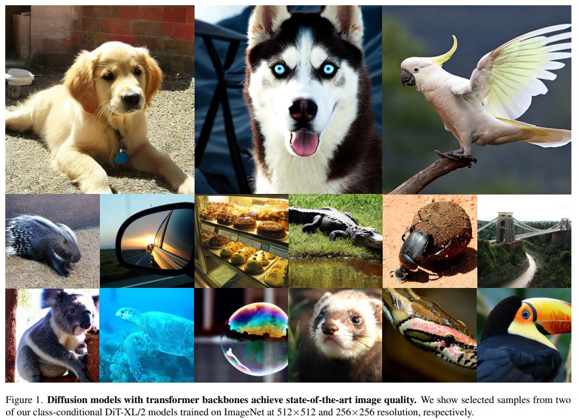
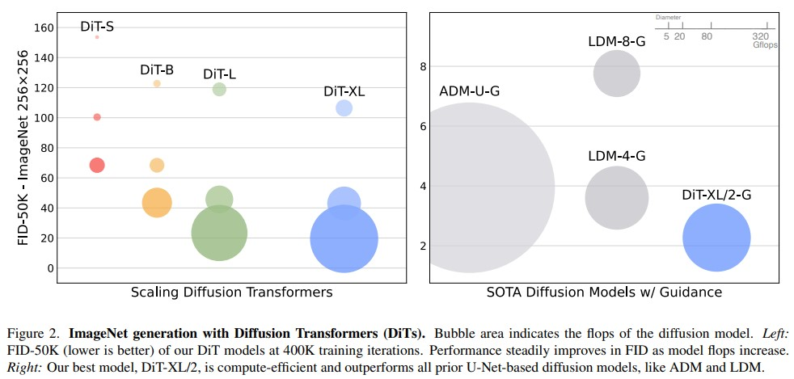
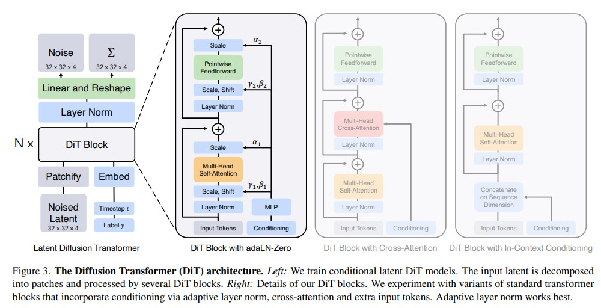
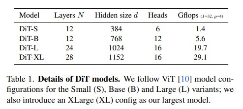
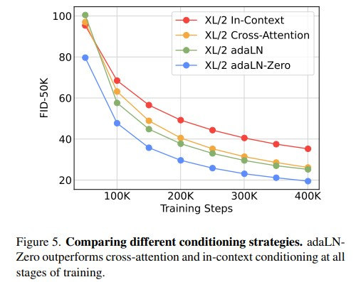
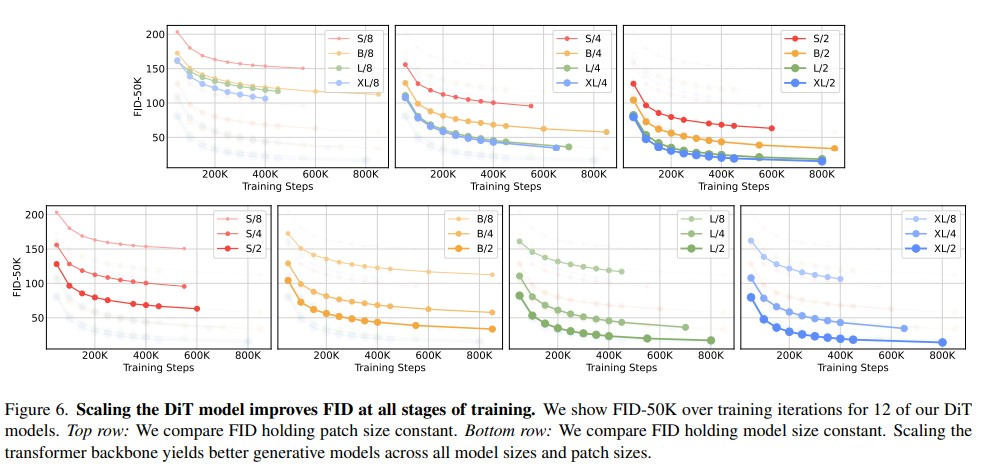
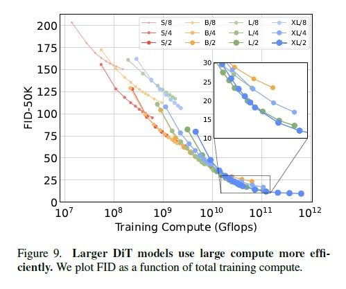
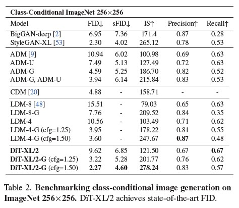
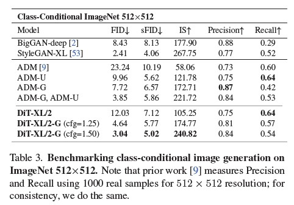

# Scalable Diffusion Models with Transformers

# 摘要
&nbsp;&nbsp;&nbsp;&nbsp;&nbsp;&nbsp;&nbsp;&nbsp;我们探索了一种基于Transformer架构的新型扩散模型(diffusion model)。我们训练了图像的潜在扩散模型，将常用的U-Net骨干网络替换为在潜在patch上操作的Transformer。我们通过Gflops衡量前向传递复杂度，分析了我们的Diffusion Transformers (DiTs)的可扩展性。我们发现，具有更高Gflops的DiTs（通过增加Transformer的深度/宽度或增加输入令牌的数量）始终具有较低的FID。除了具有良好的可扩展性属性外，我们最大的DiT-XL/2模型在基于类条件的ImageNet 512×512和256×256基准测试中胜过了所有以前的扩散模型，后者在256×256基准测试上达到了2.27的最新FID。  

# 1 引言
&nbsp;&nbsp;&nbsp;&nbsp;&nbsp;&nbsp;&nbsp;&nbsp;机器学习正在经历由Transformer驱动的复兴。在过去的五年中，用于自然语言处理 [8, 42]、视觉 [10]和其他几个领域的神经网络架构主要被Transformer所取代 [60]。然而，许多种类的图像级生成模型仍然没有采用这一趋势。尽管Transformer在自回归模型 [3,6,43,47]中得到广泛应用，但在其他生成建模框架中的应用较少。例如，扩散模型(diffusion models)一直是图像级生成模型最新进展的前沿 [9,46]，然而它们都采用了卷积U-Net架构作为事实上的骨干选择。 

*注释：扩散模型是一种生成模型，用于生成高质量的图像。它通过在一系列迭代的步骤中逐渐将图像从一个噪声图像转变为目标图像。在每个步骤中，模型通过引入噪声来模糊图像，然后尝试通过迭代过程逐渐减小噪声并还原图像的细节。这种逐渐减小噪声的过程被称为扩散，因此这种模型被称为扩散模型。*  

&nbsp;&nbsp;&nbsp;&nbsp;&nbsp;&nbsp;&nbsp;&nbsp;Ho等人的开创性工作 [DDPM](https://arxiv.org/pdf/2006.11239.pdf) 首次引入了U-Net骨干网络用于扩散模型。最初在像素级自回归模型和条件生成对抗网络（GAN）[23]中取得成功后，U-Net从PixelCNN++ [52, 58] 中继承并进行了一些修改。该模型是卷积模型，主要由ResNet [15] 块组成。与标准的U-Net [49] 相比，额外的**空间自注意力块（在Transformer中是重要组件）被插入到较低分辨率的位置**。Dhariwal和Nichol [9] 对UNet的几个架构选择进行了剖析，例如使用自适应归一化层 [40] 注入条件信息和卷积层的通道数。然而，Ho等人提出的U-Net的高层设计在很大程度上保持不变。 

&nbsp;&nbsp;&nbsp;&nbsp;&nbsp;&nbsp;&nbsp;&nbsp;通过这项工作，我们旨在揭示扩散模型中架构选择的重要性，并为未来的生成建模研究提供经验基准。我们展示了U-Net的**归纳偏差**对于扩散模型的性能并不关键，可以轻松地用标准设计(如Transformer)进行替换。因此，扩散模型有望从最近的**架构统一趋势**中受益，例如通过继承其他领域的最佳实践和训练方法，同时保留可扩展性、稳健性和效率等有利属性。标准化的架构还将为跨领域研究开辟新的可能性。 

*注释：归纳偏差是指机器学习模型在学习过程中对数据的归纳和推理的偏好或倾向。它反映了模型在没有足够数据的情况下对数据的预先假设或先验知识的影响。*  

&nbsp;&nbsp;&nbsp;&nbsp;&nbsp;&nbsp;&nbsp;&nbsp;在本文中，我们专注于一种基于Transformer的新型扩散模型。我们将其称为Diffusion Transformers，简称为DiTs。DiTs遵循了(adhere)视觉Transformer([ViTs](https://arxiv.org/pdf/2010.11929.pdf) )[10]的最佳实践，已经证明在视觉识别方面比传统的卷积网络（例如ResNet [15]）具有更好的可扩展性。 

&nbsp;&nbsp;&nbsp;&nbsp;&nbsp;&nbsp;&nbsp;&nbsp;具体而言，我们研究了Transformer在网络复杂度与样本质量之间的规模化行为。我们展示了通过在Latent Diffusion Models(LDMs : [stable-diffusion paper](https://arxiv.org/pdf/2112.10752.pdf))[48]框架下构建和评估DiT设计空间的方式，即在VAE的潜在空间中训练扩散模型，我们可以成功地用Transformer替代U-Net骨干网络。我们进一步展示了**DiT是适用于扩散模型的可扩展架构**：网络复杂度（以Gflops衡量）与样本质量（以FID衡量）之间存在着很强的相关性。通过简单地扩大DiT的规模并使用高容量骨干网络（118.6 Gflops）训练LDM，我们能够在条件为类别的256×256 ImageNet生成基准测试中实现2.27的FID，达到了最先进的结果。 

# 2 相关工作
&nbsp;&nbsp;&nbsp;&nbsp;&nbsp;&nbsp;&nbsp;&nbsp;Transformer。Transformer [60] 已经在语言、视觉 [10]、强化学习(reinforcement learning) [5, 25] 和元学习 [39] 等领域取代了特定领域的架构。它们在**增加模型大小、训练计算资源和语言领域的数据方面展现出了显著的扩展性属性 [26]**，可以作为通用的自回归模型 [17] 和 ViTs [63]。除了语言领域，Transformer 已经被训练用于自回归地预测像素 [6, 7, 38]。它们还被用于discrete codebooks(离散的 编程书籍) [59] 的训练，既作为自回归模型 [11, 47]，也作为掩码生成模型 [4, 14]；前者在参数规模达到了200亿规模时展示出了出色的扩展行为 [62]。最后，Transformer 在 DDPMs 中被探索用于合成非空间数据，例如在 DALL·E 2 中生成 CLIP 图像嵌入 [41, 46]。**在本文中，我们研究了将 Transformer 作为图像扩散模型的骨干网络时的扩展性质。**  

&nbsp;&nbsp;&nbsp;&nbsp;&nbsp;&nbsp;&nbsp;&nbsp;**去噪扩散概率模型 (DDPMs)。** 扩散模型 [19, 54] 和基于分数的生成模型 [22, 56] 在图像生成方面取得了特别成功的结果 [35, 46, 48, 50]，在许多情况下超过了此前的最先进技术生成对抗网络 (GANs) [12]。过去两年中，DDPMs 的改进主要是通过改进的**采样技术** [19, 27, 55] 驱动的，尤其是**无分类器指导 [21]、重新定义扩散模型以预测噪声而不是像素 [19]，以及使用级联的 DDPM 管道**，其中低分辨率的基础扩散模型与上采样器并行训练 [9, 20]。对于上述所有扩散模型，**Conv U-Net [49] 是事实上的骨干架构选择**。同时进行的研究 [24] 提出了一种基于注意力机制的高效架构用于 DDPMs；**我们探索纯 Transformer 模型**。  

&nbsp;&nbsp;&nbsp;&nbsp;&nbsp;&nbsp;&nbsp;&nbsp;**架构复杂度。** 在图像生成领域评估架构复杂度时，**通常使用参数数量**作为常见做法。一般来说，参数数量可能不足以准确反映图像模型的复杂性，因为它们未考虑到例如图像分辨率对性能的显著影响 [44, 45]。相反，本文中的大部分模型复杂性分析是通过理论上的Gflops进行的。这使我们与架构设计文献保持一致，其中**广泛使用Gflops来衡量复杂性**。在实践中，作为复杂性的黄金指标仍存在争议，因为它通常取决于具体的应用场景。Nichol和Dhariwal关于改进扩散模型的开创性工作 [9, 36] 与我们最相关，在那里，他们分析了U-Net架构类的可扩展性和Gflop特性。本文中，我们专注于Transformer类。 

*注释：Model Gflops = (模型浮点运算数 / 模型执行时间) x 10^9*  

# 3 扩散 Transformer
## 3.1 准备工作
&nbsp;&nbsp;&nbsp;&nbsp;&nbsp;&nbsp;&nbsp;&nbsp;**扩散公式。** 在介绍我们的架构之前，我们简要回顾一些基本概念，以便了解扩散模型 (DDPMs) [19, 54]。高斯扩散模型假设存在一个前向加噪过程，逐渐将噪声应用于真实数据 $x_{0}: q(x_{t} \mid x_{0})= \mathcal{N} (x_{t} ; \sqrt{ \bar \alpha_{t}} x_{0}, (1-\bar \alpha_{t}) \mathbf{I})$ , 这里 $\bar \alpha_{t}$ 是超参数。通过应用重参数化技巧，我们可以进行采样 $x_{t}=\sqrt{\bar \alpha_{t}} x_{0}+\sqrt{1-\bar \alpha_{t}} \epsilon_{t}$ , 这里  $\epsilon_{t} \sim \mathcal{N}(0, \mathbf{I})$ 。 

&nbsp;&nbsp;&nbsp;&nbsp;&nbsp;&nbsp;&nbsp;&nbsp;扩散模型通过训练来学习逆前向过程的噪音： $p_{θ}(x_{t−1} | x_{t}) = \mathcal{N}(µ_{θ}(x_{t}), Σθ(x_{t}))$ ，其中神经网络用于预测 $p_{θ}$ 的统计信息。逆处理模型是使用 $P(x_{0})$ 的变分下界[30]训练的，该下界可简化为 $\mathcal L(θ) = -p(x0|x1) + Σ_{t} \mathcal D_{K L}(q*(x_{t−1} | x_{t}, x_{0}) || p_{θ}(x_{t−1} | x_{t}))$ ，其中排除了训练无关的额外项。 由于 $q*$ 和 $p_{θ}$ 都是高斯分布，可以使用两个分布的均值和协方差来评估 $\mathcal D_{KL}$ 。通过将 $µ_{θ}$ 重新参数化为噪声预测网络 $\varepsilon_{θ}$ ，可以使用预测的噪声 $\varepsilon_{θ}(x_{t})$ 和采样的高斯噪声 $\varepsilon_{t}$ 之间的简单均方误差来训练模型： $\mathcal L_{simple}(\theta)=||\epsilon_{\theta} (x_{t}) - \epsilon_{t}||_{2}^{2}$ 。为了使用学习的反向过程协方差 $\Sigma _{\theta}$ 来训练扩散模型，需要优化完整的 $\mathcal D _{KL}$ 项。我们遵循Nichol和Dhariwal的方法[36]：使用 $\mathcal L _{simple}$ 训练 $\epsilon _{\theta}$ ,使用完整的 $\mathcal L$ 训练Σθ。一旦 $p _{θ}$ 训练完成，可以通过初始化 $x _{t _{max}} ∼ N(0, I)$ 并使用重参数化技巧从 $p _{θ}(x _{t−1} | x _{t})$ 中采样 $x _{t−1}$来生成新的图像。  

&nbsp;&nbsp;&nbsp;&nbsp;&nbsp;&nbsp;&nbsp;&nbsp;无分类器指导。条件扩散模型将额外的信息作为输入，例如类别标签c。在这种情况下，反向过程变为 $pθ(x_{t−1} |x_{t}, c)$ ，其中 $\epsilon_{θ}$ 和 $Σ_{θ}$ 以c为条件。在这种设置下，可以使用无分类器指导来鼓励采样过程找到 $log p(c|x)$ 较高的x。根据贝叶斯法则: $\log p(c \mid x) \propto \log p(x \mid c)-\log p(x)$ , 因此 $\nabla_{x} \log p(c \mid x) \propto \nabla_{x} \log p(x \mid c)-\nabla_{x} \log p(x)$ . 通过将扩散模型的输出解释为得分函数，可以通过以下方式来引导DDPM采样过程以高概率p(x|c)采样x: $\hat \epsilon_{θ} (x_{t}, c) = \epsilon_{\theta}(x_{t}, \emptyset) + s \cdot \nabla_{x} \log p(x \mid c) \propto \epsilon_{\theta}(x_{t}, \emptyset) + s \cdot(\epsilon_{\theta}(x_{t}, c)-\epsilon_{\theta}(x_{t}, \emptyset))$ , 其中s > 1表示指导的尺度(注意，s = 1表示恢复标准采样)。 在评估扩散模型时，使用c = ∅表示在训练过程中随机丢弃c，并用学习到的“null”嵌入∅替代它。无分类器指导已被广泛认为比通用采样技术产生更好的样本[21, 35, 46]，在我们的扩散 Transformer 模型中也是如此。  

&nbsp;&nbsp;&nbsp;&nbsp;&nbsp;&nbsp;&nbsp;&nbsp;**潜在扩散模型。** 在高分辨率像素空间中直接训练扩散模型可能会**在计算上造成困难**。潜在扩散模型 (LDMs: [Latent diffusion models](https://arxiv.org/pdf/2112.10752.pdf)) [48] 采用了两阶段的方法来解决这个问题：(1) 使用学习编码器 E 学习将图像压缩为较小的空间表示的自编码器；(2) 训练一个基于表示 z = E(x) 而不是图像 x 的扩散模型 (E 固定)。然后，可以通过从扩散模型中采样一个表示 z，并使用学习的解码器将其解码为图像 x = D(z) 来生成新的图像。 

&nbsp;&nbsp;&nbsp;&nbsp;&nbsp;&nbsp;&nbsp;&nbsp;如图2所示，潜在扩散模型在使用像ADM这样的像素空间扩散模型的计算量的一小部分的情况下实现了良好的性能(**latent 模型计算量是像素模型的一小部分**)。考虑到计算效率，这使它们成为架构探索的有吸引力的起点。在本文中，我们将扩散 Transformer 应用于潜在空间(latent space)，尽管它们也可以无需修改地应用于像素空间。这使得我们的图像生成流程成为一种混合方法；**我们使用现成的卷积变分自编码器和基于 Transformer 的扩散模型**。 

## 3.2. Diffusion Transformer 设计空间
&nbsp;&nbsp;&nbsp;&nbsp;&nbsp;&nbsp;&nbsp;&nbsp;我们引入了扩散 Transformer（DiT），这是一种用于扩散模型的新架构。我们的目标是尽可能忠实于标准的 Transformer 架构，**以保留其可扩展性**。由于我们的重点是训练图像的扩散概率密度模型（具体而言，是图像的空间表示），DiT基于 Vision Transformer（ViT）架构，该架构在sequences of patches上操作[10](https://arxiv.org/pdf/2010.11929.pdf)。DiT保留了许多ViT的最佳实践。图3显示了完整的DiT架构概述。在本节中，我们将描述DiT的前向传递过程，以及DiT类的设计空间组件。 

&nbsp;&nbsp;&nbsp;&nbsp;&nbsp;&nbsp;&nbsp;&nbsp;**图块化(Patchify)。** DiT的输入是一个空间表示 z（对于256×256×3的图像，z的形状为32×32×4）。DiT的第一层是“图块化”（patchify），它将空间输入转换为由线性嵌入每个图块得到的维度为d的T个token序列。在图块化之后，我们对所有输入token应用标准的ViT 基于频率的位置嵌入(正弦-余弦版本)。 patchify 产生的token数量T 由图块大小超参数p确定。如图4所示，将p减半会使T增加四倍，因此至少会使Transformer的总Gflops增加四倍。尽管它对Gflops有显著影响，但请注意改变p对下游参数数量没有实质性影响。我们将p = 2、4、8添加到DiT的设计空间中。 

&nbsp;&nbsp;&nbsp;&nbsp;&nbsp;&nbsp;&nbsp;&nbsp;**DiT块设计。** 在Patchify之后，输入token被一系列的Transformer块处理。除了带有噪声的图像输入之外，扩散模型有时还会处理额外的**条件信息(例如噪声时间步长t、类别标签c、自然语言等)**。 我们探索了四种不同处理条件输入的Transformer块变体。这些设计对标准的ViT块设计进行了小而重要的修改。所有块的设计如图3所示。 

- **上下文条件(In-context conditioning)。** 我们只需将t和c的向量嵌入作为两个额外的token 追加到输入序列中，对待它们与图像 token 没有任何区别。这类似于ViTs中的cls token，它允许我们在不进行修改的情况下使用标准的ViT块。在**最后一个块之后，我们从序列中删除条件token**。这种方法对模型的新增Gflops非常小。 

- **交叉注意力块(corss-attention block)。** 我们将t和c的嵌入连接成一个长度为2的序列，与图像token序列分开。Transformer块被修改为在multi-head attention之后添加一个额外的multi-head cross attention，类似于Vaswani等人的原始设计[60]，也类似于LDM用于对类别标签进行条件处理的设计。交叉注意力对模型的增加Gflops最多，**大约增加了15%的Gflops开销**。 

- **自适应层归一化 (adaLN) 块。** 在生成对抗网络 (GANs) [2, 28] 和具有 UNet 骨干网络的扩散模型 [9] 中广泛使用自适应归一化层 [40](https://arxiv.org/pdf/1709.07871.pdf) 后，我们尝试将 Transformer 块中的标准层归一化层替换为自适应层归一化 (adaLN)。与直接学习维度上的缩放和偏移参数 γ 和 β 不同，我们从 t 和 c 的嵌入向量之和中回归它们。在我们探索的三种块设计中，adaLN 增加的 Gflops 最少，因此**它是计算效率最高的**。它也是**唯一一种将相同函数应用于所有token的条件机制**。 

- **adaLN-Zero 块。** 在 ResNet 上的先前工作发现，将每个残差块**初始化**为恒等函数是有益的。例如，Goyal 等人发现，在监督学习环境中，将每个块中的最终批归一化缩放因子 γ 初始化为零可以加速大规模训练 [13]。扩散 U-Net 模型使用类似的初始化策略，在任何残差连接之前，将每个块中的最终卷积层初始化为零。我们对 adaLN DiT 块进行了一种相同的修改。除了回归 γ 和 β，我们**还回归了应用于 DiT 块内部任何残差连接之前的维度缩放参数 α**。 

&nbsp;&nbsp;&nbsp;&nbsp;&nbsp;&nbsp;&nbsp;&nbsp; **模型大小。** 我们连续应用了的N个DiT块，每个块在隐藏维度大小d上运算。遵循ViT的做法，我们使用同时缩放N、d和注意力头的标准Transformer配置[10, 63]。具体而言，我们使用四个配置：DiT-S、DiT-B、DiT-L和DiT-XL。它们覆盖了广泛的模型大小和FLOP分配范围，从0.3到118.6 Gflops，使我们能够评估扩展性能。表1提供了配置的详细信息。 

&nbsp;&nbsp;&nbsp;&nbsp;&nbsp;&nbsp;&nbsp;&nbsp;我们将B、S、L和XL配置添加到DiT的设计空间中。 

&nbsp;&nbsp;&nbsp;&nbsp;&nbsp;&nbsp;&nbsp;&nbsp;**Transformer解码器。** 在最后一个DiT块之后，我们需要将图像令牌序列解码为输出的**噪声预测**和输出的**对角协方差预测**。这两个输出的形状与原始的空间输入相同。我们使用标准的线性解码器来完成这个过程；我们应用最后的层归一化（如果使用adaLN，则为自适应层归一化）并将每个令牌线性解码成一个**p×p×2C**的张量，其中C是DiT空间**输入中的通道数**。最后，我们将解码的令牌重新排列(reshape)成其原始的空间布局，以获得预测的噪声和协方差。 

&nbsp;&nbsp;&nbsp;&nbsp;&nbsp;&nbsp;&nbsp;&nbsp;我们探索的完整DiT设计空间包括图块大小、Transformer块架构和模型大小。 

# 4 实验设置
&nbsp;&nbsp;&nbsp;&nbsp;&nbsp;&nbsp;&nbsp;&nbsp;我们探索DiT的设计空间，并研究我们的模型类的**扩展性质**。我们的模型根据它们的配置和潜在图块大小p进行命名；例如，DiT-XL/2指的是XLarge配置和p = 2。 

&nbsp;&nbsp;&nbsp;&nbsp;&nbsp;&nbsp;&nbsp;&nbsp;**训练。** 我们在ImageNet数据集 [31] 上以256×256和512×512的图像分辨率训练条件潜在的DiT模型，这是一个高度竞争的生成建模基准。我们将最后的线性层初始化为零，并使用ViT的标准权重初始化技术。我们使用AdamW [29, 33]对所有模型进行训练。 

&nbsp;&nbsp;&nbsp;&nbsp;&nbsp;&nbsp;&nbsp;&nbsp;我们使用固定的学习率为1e-4，没有权重衰减，并使用批量大小为256。我们唯一使用的数据增强是水平翻转。与许多先前使用ViTs进行的工作不同[57, 61]，我们发现对于训练DiTs达到高性能，**学习率预热和正则化并不是必需的**。即使没有这些技术，训练在所有模型配置上都非常稳定，我们没有观察到训练transformers时常见的损失峰值。遵循生成建模文献中的通用做法，我们在训练过程中使用**指数移动平均（EMA）来维护DiT权重**，衰减率为0.9999。所有报告的结果都使用EMA模型。我们在所有DiT模型大小和图块大小上使用相同的训练超参数。我们的训练超参数几乎完全来自[ADM](https://arxiv.org/pdf/2105.05233.pdf)。我们没有调整学习率、衰减/预热计划、Adam的β1/β2或权重衰减。 

&nbsp;&nbsp;&nbsp;&nbsp;&nbsp;&nbsp;&nbsp;&nbsp;**扩散。** 我们使用了来自"Stable Diffusion"的现成预训练变分自编码器（VAE）模型[30](https://arxiv.org/pdf/1312.6114.pdf)。VAE编码器的降采样因子为 **8** ，给定形状为256×256×3的RGB图像x，其编码z=E(x)的形状为32×32×4。在本节的所有实验中，我们的扩散模型在这个Z空间中运行。从我们的扩散模型中**采样出**一个新的潜在变量后，我们使用VAE解码器将其解码为像素x=D(z)。我们保留了ADM [9](https://arxiv.org/pdf/2105.05233.pdf)中的扩散超参数；具体而言，我们使用 $t_{max} = 1000$ 的线性方差调度，范围从1e-4到2e-2，ADM的协方差参数化以及他们的方法来嵌入输入的时间步和标签。 

&nbsp;&nbsp;&nbsp;&nbsp;&nbsp;&nbsp;&nbsp;&nbsp;**评估指标。** 我们使用Frechet Inception Distance (FID) [18]来衡量扩展性能，这是评估图像生成模型的标准指标。 

&nbsp;&nbsp;&nbsp;&nbsp;&nbsp;&nbsp;&nbsp;&nbsp;在与先前的工作进行比较时，我们遵循惯例，并报告使用250个DDPM采样步骤的FID-50K(50,000个样本)。已知FID对于小的实现细节非常敏感[37]；为了确保准确比较，本文中报告的所有数值都是通过导出样本并使用ADM的TensorFlow评估套件[9]获得的。本节中报告的FID数值除非另有说明，否则不使用无分类器的指导。此外，我们还报告Inception Score [51]、sFID [34]和Precision/Recall [32]作为辅助指标。 

&nbsp;&nbsp;&nbsp;&nbsp;&nbsp;&nbsp;&nbsp;&nbsp;计算。我们使用JAX [1]实现所有模型，并使用TPU-v3 pod进行训练。DiT-XL/2是我们计算密集型最高的模型，在具有全局批量大小为256的TPU v3-256 pod上以大约5.7个迭代/秒的速度进行训练。 

# 5 实验
&nbsp;&nbsp;&nbsp;&nbsp;&nbsp;&nbsp;&nbsp;&nbsp;**DiT块设计。** 我们训练了四个最高Gflop的DiT-XL/2模型，每个模型使用不同的块设计: in-context（119.4 Gflops）、cross-attention（137.6 Gflops）、自适应层归一化（adaLN，118.6 Gflops）或adaLN-zero（118.6 Gflops）。我们在训练过程中测量FID。图5显示了结果。adaLN-Zero块产生的FID比交叉注意力和in-context条件下的FID更低，同时计算效率最高。在训练迭代次数达到400K时，adaLN-Zero模型的FID几乎是in-context模型的一半，表明**条件机制对模型质量起到关键作用**。初始化也很重要，adaLN-Zero通过将每个DiT块初始化为恒等函数，在性能上明显优于普通的adaLN。在接下来的论文中，**所有模型将使用adaLN-Zero的DiT块**。 

&nbsp;&nbsp;&nbsp;&nbsp;&nbsp;&nbsp;&nbsp;&nbsp;扩展模型大小和图块大小。我们训练了12个DiT模型，涵盖了模型配置（S、B、L、XL）和图块大小（8、4、2）的范围(4 x 3 = 12)。需要注意的是，相对于其他配置，DiT-L和DiT-XL在相对Gflops方面更接近。图2（左侧）提供了每个模型的Gflops概览以及它们在训练迭代次数达到400K时的FID。在所有情况下，我们发现**增加模型大小和减小图块大小可以显著改善扩散模型的性能。**  

&nbsp;&nbsp;&nbsp;&nbsp;&nbsp;&nbsp;&nbsp;&nbsp;图6（顶部）展示了随着模型大小的增加和图块大小保持不变时FID的变化情况。在所有四个配置中，通过使Transformer更深更宽，在训练的所有阶段都获得了显著的FID改进。同样，图6（底部）展示了当图块大小减小而模型大小保持不变时的FID变化情况。我们再次观察到，**通过简单地扩展DiT处理的token数量(patch 减小)**，保持参数大致固定，在整个训练过程中可以获得相当大的FID改进。 

&nbsp;&nbsp;&nbsp;&nbsp;&nbsp;&nbsp;&nbsp;&nbsp;**DiT的Gflops对于改善性能至关重要。** 图6的结果表明，**参数数量并不能唯一确定DiT模型的质量**。当模型大小保持不变且图块大小减小时，Transformer的总参数实际上保持不变（实际上，总参数略微减少），只有Gflops增加。这些结果表明，扩展模型的Gflops实际上是提高性能的关键。为了进一步研究这一点，在图8中，我们将训练步骤达到400K时的FID-50K与模型的Gflops进行了绘制。结果显示，当不同的DiT配置的总Gflops相似时（例如，DiT-S/2和DiT-B/4），它们获得了类似的FID值。我们发现模型的Gflops与FID-50K之间存在强烈的负相关关系，这表明**额外的模型计算是改进DiT模型的关键因素**。在附录的图12中，我们发现这一趋势在其他指标（如Inception Score）上也是成立的。 

&nbsp;&nbsp;&nbsp;&nbsp;&nbsp;&nbsp;&nbsp;&nbsp;**较大的DiT模型具有更高的计算效率。** 在图9中，我们绘制了所有DiT模型的FID与总训练计算量的关系。我们估计**训练计算量为模型的Gflops乘以批量大小乘以训练步骤乘以3**，其中3的因子大致近似地将反向传播的计算量视为正向传播的两倍。我们发现，即使经过更长时间的训练，小型DiT模型最终相对于经过较少步骤训练的较大DiT模型而言，计算效率也变低。同样地，我们发现，除了图块大小不同之外完全相同的模型，即使控制训练的Gflops，其性能表现也不同。例如，经过大约1010 Gflops后，XL/4的性能被XL/2超越。 

&nbsp;&nbsp;&nbsp;&nbsp;&nbsp;&nbsp;&nbsp;&nbsp;**可视化扩展效果。** 我们在图7中可视化了扩展对样本质量的影响。在训练步骤达到400K时，我们使用相同的起始噪声xtmax、采样噪声和类别标签从我们的12个DiT模型中分别采样一幅图像。这使我们可以从视觉上解释扩展如何影响DiT样本的质量。实际上，**扩展模型大小和标记数量都显著改善了视觉质量**。 

## 5.1. 最先进的扩散模型
&nbsp;&nbsp;&nbsp;&nbsp;&nbsp;&nbsp;&nbsp;&nbsp;**256×256 ImageNet。** 在进行了扩展分析后，我们继续对最高Gflop模型DiT-XL/2进行700万步的训练。我们在图1中展示了该模型的样本，并与最先进的条件生成模型进行比较。我们在表2中报告了结果。当使用无分类器引导时，DiT-XL/2的表现优于所有先前的扩散模型，将先前最佳的FID-50K（3.60，由LDM实现）降低到2.27。图2（右侧）显示，相对于像LDM-4（103.6 Gflops）这样的潜空间U-Net模型，DiT-XL/2（118.6 Gflops）具有**高计算效率**，并且比像ADM（1120 Gflops）或ADM-U（742 Gflops）这样的像素空间U-Net模型更加高效。 

&nbsp;&nbsp;&nbsp;&nbsp;&nbsp;&nbsp;&nbsp;&nbsp;我们的方法实现了所有先前生成模型中最低的FID，包括先前的最先进模型StyleGANXL [53]。最后，我们还观察到，与LDM-4和LDM-8相比，DiT-XL/2在所有经过测试的无分类器引导尺度上实现了更高的召回率。当仅训练了2.35M步（类似于ADM）时，XL/2仍然优于所有先前的扩散模型，其FID为2.55。 

&nbsp;&nbsp;&nbsp;&nbsp;&nbsp;&nbsp;&nbsp;&nbsp;**512×512 ImageNet。** 我们使用与256×256模型相同的(identity)超参数，在512×512分辨率下对新的DiT-XL/2模型进行了3M次迭代的ImageNet训练。在使用图块大小为2的情况下，这个XL/2模型在对64×64×4输入潜空间进行图块处理后，共处理了1024个token（524.6 Gflops）。表3显示了与最先进方法的比较。在这个分辨率下，XL/2再次优于所有先前的扩散模型，将先前ADM实现的最佳FID（3.85）降低到3.04。即使标记数量增加，XL/2仍然具有高计算效率。例如，ADM使用1983 Gflops，ADM-U使用2813 Gflops；而XL/2只使用524.6 Gflops。我们在图1和附录中展示了高分辨率XL/2模型的样本。 

## 5.2. 模型扩展与采样计算量比较
&nbsp;&nbsp;&nbsp;&nbsp;&nbsp;&nbsp;&nbsp;&nbsp;扩散模型的独特之处在于，在生成图像时可以通过**增加采样步骤**来利用训练后的额外计算资源。鉴于模型的Gflops对样本质量的影响，本节中我们研究了通过使用更多的采样计算资源，较小的模型计算量的DiT是否能够胜过较大的模型。我们在400K个训练步骤后，为我们的12个DiT模型计算FID，每个图像使用[16, 32, 64, 128, 256, 1000]个采样步骤。主要结果如图10所示。以使用1000个采样步骤的DiT-L/2和使用128个步骤的DiT-XL/2为例。在这种情况下，L/2使用80.7 Tflops来对每个图像进行采样；而XL/2使用更少的计算资源，即15.2 Tflops来对每个图像进行采样。尽管如此，**XL/2具有更好的FID-10K值（23.7对比25.9）**。总体而言，**增加采样计算量不能弥补模型计算量不足的问题**。 

# 结论
&nbsp;&nbsp;&nbsp;&nbsp;&nbsp;&nbsp;&nbsp;&nbsp;我们引入了扩散变换器（DiTs），这是一种简单的基于Transformer的扩散模型骨干，**优于先前的U-Net模型**，并继承了Transformer模型类的出色扩展性能。鉴于本文中有希望的扩展结果，未来的工作应该继续将DiTs扩展到更大的模型和标记数量。DiT还可以作为文本到图像模型（如DALL·E 2和稳定扩散）的可替换骨干进行探索。 

# reference

