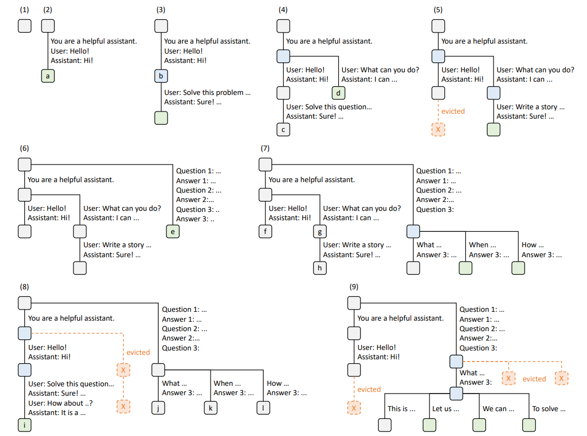

# SGLang: Efficient Execution of Structured Language Model Programs
- [论文链接](https://arxiv.org/pdf/2312.07104)

# 3 使用 RadixAttention 实现高效的 KV 缓存重用
&nbsp;&nbsp;&nbsp;&nbsp;&nbsp;&nbsp;&nbsp;&nbsp;SGLang 程序可以通过 "fork" 原语链接多个生成调用并创建并行副本。此外，不同的程序实例通常共享一些公共部分（例如系统提示）。在执行过程中，这些情况会导致许多共享的提示前缀，从而为重用 KV Cache创造了许多机会。在 LLM 推理过程中，KV Cache存储来自前向传递的中间张量，用于解码未来的token。它们以自注意力机制中的键值对命名 [51]。KV Cache的计算仅取决于前缀token。因此，具有相同提示前缀的请求可以重用 KV Cache，减少冗余计算和内存使用。附录 A 中提供了更多背景信息和一些示例。 

&nbsp;&nbsp;&nbsp;&nbsp;&nbsp;&nbsp;&nbsp;&nbsp;鉴于 KV 缓存重用的机会，优化 SGLang 程序的一个关键挑战是在多个调用和实例之间重复使用 KV 缓存。虽然一些系统探索了某些 KV 缓存重用案例 [23, 58, 18, 12]，但它们通常需要手动配置，并且无法处理所有的重用模式（例如，动态树结构）。因此，大多数最先进的推理系统为每个请求重新计算 KV 缓存。我们将在第 7 节中讨论它们的局限性以及我们的差异。 

&nbsp;&nbsp;&nbsp;&nbsp;&nbsp;&nbsp;&nbsp;&nbsp;本节介绍了 RadixAttention，一种在运行时自动和系统化地重复使用 KV 缓存的新技术。与**现有系统在生成请求完成后丢弃 KV Cache**不同，我们的系统将Cache保留在radix tree中，用于存储提示和生成结果，从而实现了高效的前缀搜索、重用、插入和驱逐(eviction)。我们实现了一种LRU驱逐策略(policy)和一种缓存感知调度策略，以提高缓存命中率。RadixAttention与连续批处理[60](https://www.usenix.org/system/files/osdi22-yu.pdf) 、paged attention[23]和张量并行[44]等技术兼容。此外，在没有缓存命中时，它仅引入了可忽略的(negligible)内存和时间开销。 

&nbsp;&nbsp;&nbsp;&nbsp;&nbsp;&nbsp;&nbsp;&nbsp;**RadixAttention**。A radix tree是一种数据结构，作为传统前缀树（trie）的一种占用空间更有效的替代方案。与典型树不同，radix tree的边不仅可以标记单个元素，**还可以标记长度不同的元素序列**，从而显著提高效率。在我们的系统中，我们利用radix tree来管理token序列与它们对应的 KV 缓存张量之间的映射关系。这些 KV 缓存张量以非连续的分页布局存储，其中每页的大小等同于一个token。由于 GPU 内存很快会被 KV Cache填满，我们引入了一个简单的 LRU eviction policy(驱逐策略)，**优先驱逐最近未使用的叶子节点**。通过首先驱逐叶子节点，我们使它们的共同祖先(ancestors)可以重复使用，直到这些祖先成为叶子节点并被驱逐(evicted)。 

&nbsp;&nbsp;&nbsp;&nbsp;&nbsp;&nbsp;&nbsp;&nbsp;在连续批处理设置(continuous batching setting)中，我们不能驱逐(evicted)当前运行批次使用的节点。因此，每个节点都保持一个引用计数器，指示有多少正在运行的请求在使用它。如果节点的引用计数器为零，则该节点可以被驱逐(evicted)。请注意，我们并未预先分配固定大小的内存池作为缓存。相反，**我们让缓存的token和当前运行的请求共享相同的内存池**。因此，系统动态为cache和运行请求分配内存。当有足够多的等待请求运行时，系统将优先驱逐(evicted)所有缓存的标记以获得更大的批处理大小。图 3 显示了radix tree是如何为多个传入请求进行维护的。前端解释器(frontend interpreter)将完整提示发送到运行时(runtime)，运行时执行前缀匹配和重用。树结构存储在 CPU 上，维护开销极低(negligible)。在执行 "fork" 原语时，前端(frontend)首先将**前缀(prefix)作为提示(hint)发送**，确保前缀被正确插入到树中。然后发送其余提示。这种“前端提示(frontend hint)”简化了运行时调度和匹配，展示了前端-运行时协同设计的优势。 

*图 3：通过九个时间点展示了使用LRU驱逐策略的RadixAttention操作示例。图展示了radix tree对各种请求的动态演变。这些请求包括两个聊天会话、一批少样本(few-shot)学习查询和自一致性抽样。每个树边携带一个标签，表示子串或标记序列。节点以颜色编码以反映不同状态：绿色表示新添加的节点，蓝色表示在该时间点访问的缓存节点，红色表示已被驱逐的节点。在第（1）步，radix tree最初为空。在第（2）步，服务器处理传入用户消息“Hello”，并回复LLM输出“Hi”。系统提示“您是一个乐于助人的助手”，用户消息“Hello！”和LLM回复“Hi！”被合并为一个边连接到一个新节点。在第（3）步，新提示到达，服务器在radix tree中找到提示的前缀（即第一轮堆化）并重用其KV cache。新一轮turn被附加到树中作为一个新节点。在第（4）步，开始一个新的聊天会话(new chat session)。从第（3）步的节点“b”被拆分为两个节点，以允许两个聊天会话共享系统提示。在第（5）步，第二个聊天会话继续。然而，由于内存限制，必须驱逐第（4）步的节点“c”。新的对话被附加到第（4）步的节点“d”之后。在第（6）步，服务器收到一次少样本学习查询（few-shot learning query），对其进行处理，并将其插入树中。根节点被拆分，因为新查询与现有节点没有共享的前缀。在第（7）步，服务器收到一批额外的少样本学习查询。这些查询共享相同的少样本示例集，因此我们从第（6）步拆分节点“e”以实现共享。在第（8）步，服务器收到来自第一个聊天会话的新消息。它驱逐第二个聊天会话的所有节点（节点“g”和“h”），因为它们是最近最少被使用的。在第（9）步，服务器收到请求，为第（8）步的节点“j”的问题抽取更多答案，很可能是为了自一致性提示。为这些请求腾出空间，我们从第（8）步驱逐节点“i”、“k”和“l”。*  

&nbsp;&nbsp;&nbsp;&nbsp;&nbsp;&nbsp;&nbsp;&nbsp;**缓存感知调度**。我们定义缓存命中率为 $\frac{number of cached prompt tokens}{number of prompt tokens}$ 。当等待队列中有许多请求时，它们执行的顺序可以显著影响缓存命中率。例如，如果请求调度程序频繁在不同且无关的请求之间切换，可能导致缓存抖动和低命中率。我们设计了一种缓存感知调度算法以提高缓存命中率。在批处理设置中，我们按匹配前缀长度对请求进行排序，并**优先处理具有较长匹配前缀的请求**，而**不是使用先到先服务的调度**。算法1（附录）展示了具有连续分批的缓存感知调度的伪代码。该算法使用最长共享前缀优先顺序。在更加延迟敏感的设置中，我们仍然可以容忍有限的批处理重新排序以提高缓存重用。此外，我们为离线情况下的最佳调度证明了以下定理。 

&nbsp;&nbsp;&nbsp;&nbsp;&nbsp;&nbsp;&nbsp;&nbsp;定理 3.1. 对于一批请求，通过按照深度优先搜索顺序访问请求的radix tree，且缓存大小 ≥ 最大请求长度，我们可以实现最佳的缓存命中率。最长共享前缀优先顺序等同于深度优先搜索顺序。 

&nbsp;&nbsp;&nbsp;&nbsp;&nbsp;&nbsp;&nbsp;&nbsp;证明见第A.3节（附录）。在在线情况下，DFS顺序将被打乱，但我们的调度仍然在完整基数树的扩展部分上近似DFS行为，如第A.3节所述。虽然贪婪的缓存感知调度可以实现高吞吐量，但可能导致饥饿。我们将其与其他公平调度方法[42]的整合作为未来的工作。 
&nbsp;&nbsp;&nbsp;&nbsp;&nbsp;&nbsp;&nbsp;&nbsp;分布式情况。RadixAttention可以扩展到多个GPU。对于张量并行性(TP)，每个GPU维护一个分片的KV缓存。由于树操作相同，因此无需额外的同步。多个worker的数据并行性在第A.4节（附录）中讨论。 
