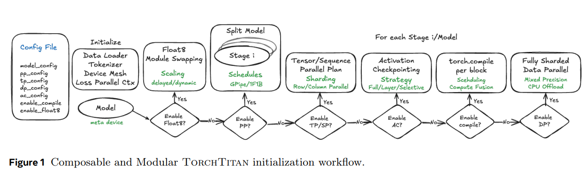
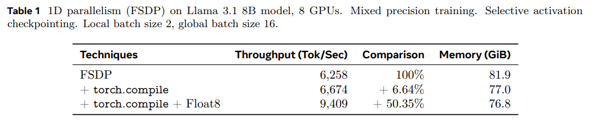
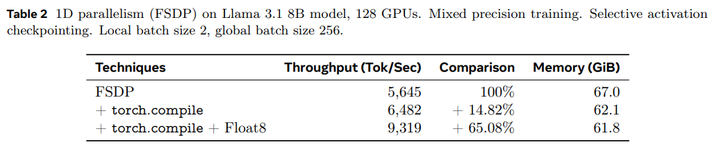
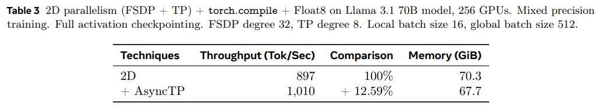
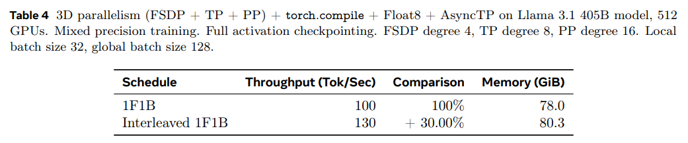
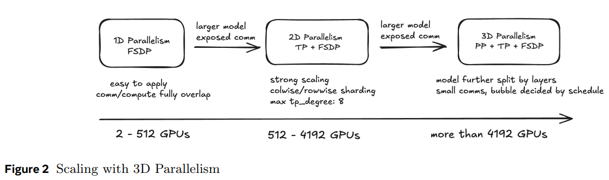
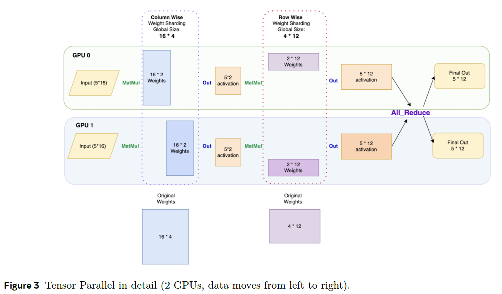
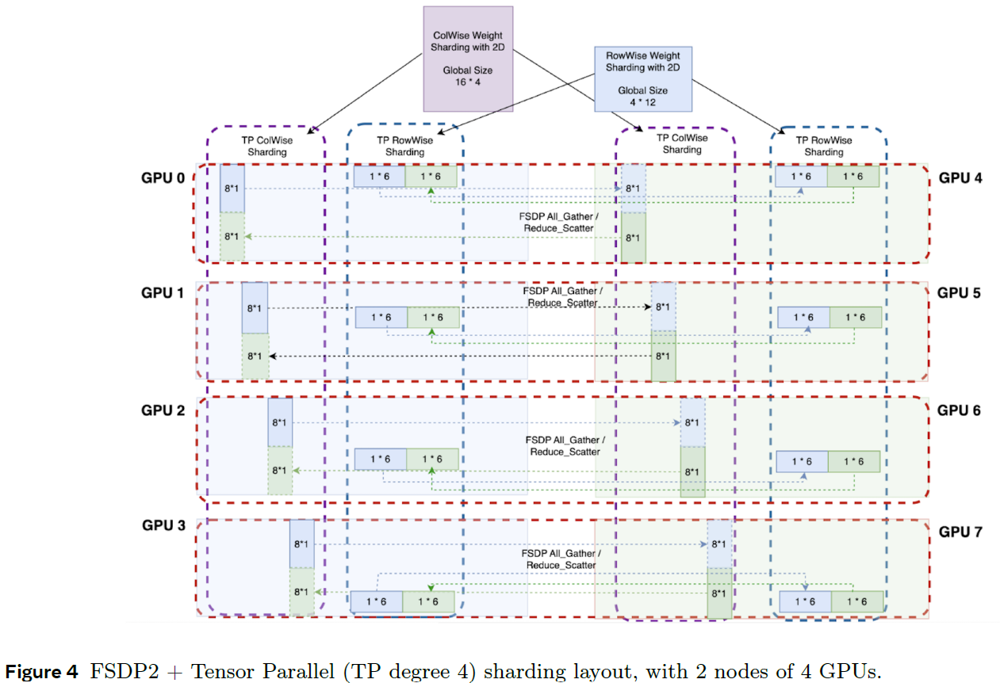

# TorchTitan: One-stop PyTorch native solution for production ready LLM pre-training
- [github](https://github.com/pytorch/torchtitan)
- [论文地址](https://arxiv.org/pdf/2410.06511)
  
# 0 摘要
&nbsp;&nbsp;&nbsp;&nbsp;&nbsp;&nbsp;&nbsp;&nbsp;大型语言模型（LLM）的开发对于推动最先进的自然语言处理(sota)应用的发展起到了至关重要的作用。训练拥有数十亿参数(billons)和数万亿(trillons)标记的大型语言模型需要**复杂的分布式系统**，这些系统能够组合和比较多种最先进的技术，以便**在数千个加速器上实现高效扩展**。然而，**现有的解决方案复杂且分散在多个库/存储库中，缺乏互操作性，且维护起来非常繁琐**。因此，整理和实证比较训练方案需要相当大的工程投入。<br>

&nbsp;&nbsp;&nbsp;&nbsp;&nbsp;&nbsp;&nbsp;&nbsp;本文介绍了TorchTitan，这是一个开源的、基于PyTorch的原生分布式训练系统，它**统一并推进了最先进的技术，简化了集成过程并降低了工程开销**。TorchTitan以模块化和可组合的方式实现了**3D并行性的无缝应用**，同时具备**弹性扩展能力(elastic scaling)**，以适应不断变化的计算需求。该系统提供了全面的日志记录、高效的检查点保存和调试工具，确保训练过程具备生产就绪性。此外，TorchTitan还融入了创新的**软硬件协同设计方案，利用诸如Float8训练和SymmetricMemory等尖端特性**，以最大限度地提高硬件利用率。作为一个灵活的实验测试平台(flexible experimental test bed)，TorchTitan促进(facilitates)了针对不同训练场景的自定义训练方案的整理和比较。通过利用TorchTitan，我们为Llama 3.1系列开发了优化的训练方案，并基于我们的实践经验，就如何选择和结合分布式训练技术以最大化训练效率提供了可行的指导。<br>

&nbsp;&nbsp;&nbsp;&nbsp;&nbsp;&nbsp;&nbsp;&nbsp;我们在包含80亿(8B)至4050亿(405B)参数的Llama 3.1系列大型语言模型（LLM）上对TorchTitan进行了全面评估，并展示了其卓越的性能、模块化组合能力和弹性扩展性(elastic scalability)。通过叠加训练优化技术，我们在NVIDIA H100 GPU上相对于优化后的基线实现了显著加速：在128个GPU规模下（Llama 3.1 8B）使用1D并行性获得了65.08%的加速，在256个GPU规模下（Llama 3.1 70B）额外使用2D并行性获得了12.59%的加速，以及在512个GPU规模下（Llama 3.1 405B）再额外使用3D并行性获得了30%的加速。<br>

# 1 介绍
&nbsp;&nbsp;&nbsp;&nbsp;&nbsp;&nbsp;&nbsp;&nbsp;大型语言模型（LLM）（Devlin, 2018; Liu et al., 2019; Radford et al., 2019; Chowdhery et al., 2023; Anil et al., 2023; Achiam et al., 2023; Dubey et al., 2024; Jiang et al., 2024; Abdin et al., 2024）处于自然语言处理（NLP）发展的前沿。它们是推动语言翻译、内容/代码生成、对话式人工智能、文本数据分析、创意写作与艺术、教育与研究等众多NLP应用发展的核心力量。<br>

&nbsp;&nbsp;&nbsp;&nbsp;&nbsp;&nbsp;&nbsp;&nbsp;为了达到最先进的性能，大型语言模型（LLM）需要数十亿个参数并训练超过万亿个标记。实现最先进的LLM性能需要庞大的规模，例如表现顶尖的模型Llama 3.1（4050亿参数，15万亿标记，3084万GPU小时，**1.6万个H100 GPU**）（Dubey等，2024）和谷歌的PaLM（5400亿参数，0.8万亿标记，940万TPU小时，6144个TPUv4芯片）（Chowdhery等，2023）。这些模型展现出了卓越的自然语言理解和生成能力，但需要大量的计算资源、内存和时间来训练，这凸显了推进自然语言处理所需的巨大投入。<br>

&nbsp;&nbsp;&nbsp;&nbsp;&nbsp;&nbsp;&nbsp;&nbsp;大型语言模型（LLM）的训练挑战正在从各个方面得到解决。在大规模上训练大型语言模型是一项艰巨的任务，它需要在**并行性、计算和通信之间取得微妙的平衡**，同时还要处理好复杂的内存和计算之间的权衡。训练所需的大量资源使得其容易受到GPU故障的影响，这强调了**需要高效的恢复机制和检查点策略来最大限度地减少停机时间**（Eisenman等，2022；Wang等，2023；Gupta等，2024；Maurya等，2024；Wan等，2024）。为了优化资源利用率并实现弹性扩展，关键在于结合多种并行技术，包括数据并行（Li等，2020；Rajbhandari等，2020；Zhang等，2022；Zhao等，2023）、张量并行（Narayanan等，2021；Wang等，2022；Korthikanti等，2023）、上下文并行（Liu等，2023；Liu和Abbeel，2024；NVIDIA，2023；Fang和Zhao，2024）以及流水线并行（Huang等，2019；Narayanan等，2019, 2021；Qi等，2023）。通过将这些并行技术与内存和计算优化技术相结合(stacking)，如激活重计算（Chen等，2016；Korthikanti等，2023；He和Yu，2023）、混合精度训练（Micikevicius等，2018, 2022）以及深度学习编译器（Bradbury等，2018；Yu等，2023；Li等，2024；Ansel等，2024），可以最大限度地提高硬件利用率。<br>

**采用最先进技术的现有系统的局限性**虽然最先进的分布式训练技术已经显著推动了该领域的发展，但采用这些技术的现有系统在解决阻碍研究者和行业从业者使用、采纳和有效应用的关键挑战方面仍存在不足。<br>

1.不可组合性：现有系统难以结合和叠加各种并行技术，限制了多维并行性的探索。进一步将它们与内存和计算优化相结合也充满挑战，从而阻碍了训练效率的提升。<br>
2.架构僵硬且单一：当前系统不具备模块化或可扩展性，导致难以集成和比较新技术、优化方法和硬件，也限制了它们对不断发展的机器学习环境的适应能力。<br>
3.硬件利用率低下：现有系统**未能充分利用高级硬件功能**，导致GPU效率不佳(MFU)，并且缺乏**可定制的激活检查点策略(checkpoint)** 来平衡内存和计算之间的权衡。<br>
4.对生产级训练的支持不足：现有系统缺乏可扩展且高效的分布式检查点功能，使得**故障恢复和模型保存变得繁琐**，并且通常没有提供足够的**调试工具和日志指标**，导致问题识别和修复变得困难，特别是对于那些没有丰富专业知识的人来说。<br>
5.未能充分利用PyTorch等框架的潜力：现有系统未能充分利用PyTorch等框架的全部潜力，错过了**错误修复、优化内核、新功能和编译器支持**。它们还依赖于外部依赖项，这些依赖项往往缺乏彻底测试，并且可能由于维护不足而变得过时或不兼容。<br>

**根本原因: 缺乏表达力强的张量抽象**。分布式系统不可组合性和不灵活性的根本原因在于没有将表达力强的张量和设备抽象作为核心组件来使用，而所有的分布式并行性、检查点以及效率优化都应该建立在这个基础之上。<br>

**设计原则：统一的分布式张量和设备抽象作为构建模块**。统一的设备抽象**将分布式系统表示为多维数组**，其中**每个维度对应一种并行技术**，负责管理设备间的通信和处理集体进程组(collective process groups)。一个互补的(complementary)张量抽象使得张量能够在这个数组上进行分片，保持分片规范(maintaining sharding specification)并支持自动分片传播。这些抽象共同实现了并行技术的无缝组合，确保了正确的语义，并促进了分布式操作中集体的调度。<br>

&nbsp;&nbsp;&nbsp;&nbsp;&nbsp;&nbsp;&nbsp;&nbsp;我们通过采用PyTorch的分布式张量(DTensor)和设备网格(DeviceMesh)[Wanchao Liang, 2023](https://github.com/pytorch/pytorch/issues/88838.)作为TorchTitan的基础组件，解决了(address)统一张量抽象的技术挑战。在与DTensor和DeviecMesh的合作中，我们发现了关键限制并进行了解决。通过**使用和扩展DTensor，我们开发了TorchTitan**，这是一个生产就绪(production-ready)的系统，能够在分布式训练中实现可组合性(composability)、模块化(modularity)、灵活性(flexibility)和可扩展性(extensibility)。TorchTitan支持3D并行性的组合(composition)、训练优化、可扩展的分布式检查点，并充分利用(harnesses)了PyTorch生态系统的全部优势。<br>

&nbsp;&nbsp;&nbsp;&nbsp;&nbsp;&nbsp;&nbsp;&nbsp;为了开发和评估TorchTitan的能力，我们采取了几个关键步骤，这些步骤代表了本工作的核心贡献，总结如下：<br>
1. 我们通过扩展DTensor的分片(sharding)功能以支持n维并行性，增加了与torch.compile的兼容性以实现编译器优化，并通过状态字典支持实现了n维模型的高效检查点功能，从而推进了DTensor的发展。我们还解决了关键错误，以增强DTensor的生产就绪性。
2. 我们展示了如何组合和堆叠(stack)各种并行技术，从而便于在大型语言模型训练中探索(facilitatating)多维并行性（第2.1节）。<br>
3. 我们实现了创新(novel)的软硬件协同设计方案，利用高级硬件特性提高GPU效率，提供**可定制的激活检查点策略**以平衡内存与计算之间的权衡，并利用**torch.compile进一步优化内存、计算和通信**（第2.2节）。<br>
4. 我们通过引入可扩展且高效的**分布式检查点功能**来支持快速故障恢复，集成如Flight Recorder等调试工具来调试崩溃或卡住的work，并提供广泛的日志指标，从而提供了生产级别的训练环境（第2.3节）。<br>
5. 我们在Llama 3.1系列模型（分别为8B、70B和405B，采用1D、2D和3D并行性）上，对TorchTitan进行了广泛的评估，评估规模从8个到512个GPU不等，以展示其在确保效率、收敛性和准确性的同时所具备的弹性扩展能力。总的来说，在最新NVIDIA H100 GPU上，与优化后的基线相比，我们在128个GPU规模下（Llama 3.1 8B）使用1D并行性实现了65.08%的训练加速，在256个GPU规模下（Llama 3.1 70B）使用2D并行性实现了额外的12.59%加速，在512个GPU规模下（Llama 3.1 405B）使用3D并行性实现了额外的30%加速（第3.2节）。<br>
6. 我们提供了系统的训练配方和指南，帮助用户应对分布式训练的复杂性，助力他们为各种模型大小和集群配置优化训练效率（第3.3节）。<br>
7. 我们展示了我们的模块化和可扩展架构如何允许新技术、优化和硬件的无缝集成和比较，从而确保对不断发展的机器学习领域的适应性（第4节）。<br>

&nbsp;&nbsp;&nbsp;&nbsp;&nbsp;&nbsp;&nbsp;&nbsp;通过提供一个易用且可扩展的平台，TorchTitan使大型语言模型（LLM）的预训练更加普及，使更广泛的研究人员和开发人员能够挖掘LLM的潜力，并加速该领域的创新。<br>

# 2 通过可组合性实现弹性(Elastic through Composability)
&nbsp;&nbsp;&nbsp;&nbsp;&nbsp;&nbsp;&nbsp;&nbsp;TorchTitan以模块化的方式融入了多种并行技术，使用户能够轻松选择多维并行性的组合。这种可组合性通过提高前沿探索的便捷性，解决了复杂的扩展挑战，从而优化了大规模训练的效率。<br>

&nbsp;&nbsp;&nbsp;&nbsp;&nbsp;&nbsp;&nbsp;&nbsp;TorchTitan的代码库组织得很有目的性，以实现可组合性和可扩展性。我们有意将三个主要组件分开，并尽可能使它们相互独立：
1. 模型定义，它与并行性无关，且设计易于阅读；
2. 并行辅助工具(parallelism helpers)，它将数据并行、张量并行和流水线并行应用于特定模型；
3. 一个通用的训练循环(training loop)。所有这些组件都可以通过TOML文件进行配置，并允许通过命令行进行覆盖，而且基于现有的代码库，很容易添加新的模型和并行技术。<br>



## 2.1 可组合N维并行训练
&nbsp;&nbsp;&nbsp;&nbsp;&nbsp;&nbsp;&nbsp;&nbsp;在本节中，我们将逐步介绍在大型集群上扩展模型训练的整个过程(entire regime)，包括元设备初始化和核心的可组合多维并行性，以展示在TorchTitan中如何组合这些技术来高效地训练规模不断增大(increasing scale)的大型语言模型（LLM）。TorchTitan中相应的实际代码片段可以在附录A中找到。<br>

### 2.1.1 使用元设备进行大规模模型初始化
&nbsp;&nbsp;&nbsp;&nbsp;&nbsp;&nbsp;&nbsp;&nbsp;鉴于大型语言模型（LLM）的尺寸呈指数级增长，实际训练开始之前就出现了第一个扩展问题。这就是需要在集群中分片部署一个大型模型，同时又不溢出(overflowing)CPU或GPU内存的需求。<br>

&nbsp;&nbsp;&nbsp;&nbsp;&nbsp;&nbsp;&nbsp;&nbsp;为了解决(tackle)这一问题，我们在TorchTitan中为模型启用了元设备初始化(meta device initialization)功能，即模型首先在一个“meta”设备类型上进行初始化。meta device tensor仅持有元数据信息，而非实际数据，这使得初始化过程极快。之后，我们执行模型分片，并将模型参数转换为分布式张量（DTensors），其中每个参数都持有一个位于元设备上的本地分片。最后，我们根据用户定义的初始化函数来初始化参数。_我们利用(leverage)分布式张量(Distributed Tensor)来正确同步随机数生成器(RNG)的种子，并根据参数的分片布局(sharding layouts)来初始化它们_。这**确保了参数在开始时具有与在整个模型在一个设备上初始化后分片前相同的值**，从而便于比较不同并行配置下的收敛情况。

### 2.1.2 完全分片数据并行
&nbsp;&nbsp;&nbsp;&nbsp;&nbsp;&nbsp;&nbsp;&nbsp;原始的完全分片数据并行([Fully Sharded Data Parallel，FSDP](https://dl.acm.org/doi/10.14778/3611540.3611569))（Zhao等人，2023）是ZeRO的一种有效实现，它提供了在PyTorch中进行大型模型训练的能力。然而，由于其在PyTorch中的FlatParameter实现（详见附录B.1），原始实现（FSDP1）存在诸多限制。<br>

&nbsp;&nbsp;&nbsp;&nbsp;&nbsp;&nbsp;&nbsp;&nbsp;鉴于这些限制，TorchTitan集成了完全分片数据并行的新版本（FSDP2）。FSDP2采用per-parameter的分布式张量分片表示，因此**与模型并行技术(model parallelism)和其他需要操作单个(individual)参数的功能具有更好的可组合性**。TorchTitan集成了FSDP2并将其作为默认的1D并行性加以利用，从而受益于改进的内存管理（与FSDP1相比，每个GPU的内存需求通常降低7%）和轻微的性能提升（与FSDP1相比，平均提升1.5%）。关于FSDP2的更多细节和使用示例，请参见附录B.1。TorchTitan通过嵌入适当的默认设置(包括根据您的world size自动进行分片(auto-sharding))来简化与FSDP2的运行。<br>

&nbsp;&nbsp;&nbsp;&nbsp;&nbsp;&nbsp;&nbsp;&nbsp;为了扩展(scaling)到更大的world sizes，TorchTitan还集成了**混合分片数据并行(Hybrid Sharded Data Parallel，HSDP)**, 它通过 _创建分片组_ 来扩展FSDP2。详细信息请参见附录B.2。<br>

### 2.1.3 张量并行
&nbsp;&nbsp;&nbsp;&nbsp;&nbsp;&nbsp;&nbsp;&nbsp;张量并行([Tensor Parallel，TP](https://dl.acm.org/doi/10.1145/3458817.3476209))（Narayanan等人，2021）与序列并行（[Sequence Parallel，SP](https://proceedings.mlsys.org/paper_files/paper/2023/file/80083951326cf5b35e5100260d64ed81-Paper-mlsys2023.pdf)）（Korthikanti等人，2023）是实现大规模大型模型训练的关键模型并行技术。<br>

&nbsp;&nbsp;&nbsp;&nbsp;&nbsp;&nbsp;&nbsp;&nbsp;在TorchTitan中，张量并行（TP）是通过PyTorch的 _RowwiseParallel_ 和 _ColwiseParallel_ API实现的，其中模型参数被分割为DTensors，并与其进行sharded computation。通过利用(leveraging) DTensor，TP的实现**无需修改模型代码**，这使得 _在不同模型上能够更快地启用_ ，并且与本文中提到的其他功能具有更好的组合性(composability)。<br>

&nbsp;&nbsp;&nbsp;&nbsp;&nbsp;&nbsp;&nbsp;&nbsp;张量并行（TP）与序列并行（SP）：张量并行负责将计算量最大的部分进行分割，而序列并行（SP）则在序列维度上对归一化或dropout layers执行分片计算。如果不进行分片，这些层会生成大量重复的激活张量，从而可能超出每个GPU的内存限制。有关TP和FSDP+TP的更多详细信息、图示及用法，请参阅附录B.3。<br>

&nbsp;&nbsp;&nbsp;&nbsp;&nbsp;&nbsp;&nbsp;&nbsp;由于张量并行（TP）和序列并行（SP）之间的协同关系，TorchTitan原生地将这两者结合在一起，并且它们共同由TP度数设置来控制。<br>

&nbsp;&nbsp;&nbsp;&nbsp;&nbsp;&nbsp;&nbsp;&nbsp;当计算损失函数时，模型的输出通常非常大。由于来自TP（Transformer Parallel，即变换器并行）/SP（Sequence Parallel，即序列并行）的模型输出在（通常很大的）词汇表维度上是分片（sharded）的，直接计算交叉熵损失需要沿着TP维度收集所有的分片来使输出被复制，这会导致大量的内存使用。<br>

&nbsp;&nbsp;&nbsp;&nbsp;&nbsp;&nbsp;&nbsp;&nbsp;通过损失并行（Loss Parallel）技术，交叉熵损失可以高效地计算，而无需将所有模型输出分片聚集到每一个单独的GPU上。这不仅显著降低了内存消耗，还通过减少通信开销和并行进行分片计算来提高了训练速度。鉴于这些改进，TorchTitan默认实现了损失并行。<br>

### 2.1.4 流水线并行
&nbsp;&nbsp;&nbsp;&nbsp;&nbsp;&nbsp;&nbsp;&nbsp;为了在最大规模上进行预训练，TorchTitan提供了流水线并行性，这种并行性由于具有最轻的通信开销和利用了点对点（P2P）通信，因此变得至关重要(essential)。<br>

&nbsp;&nbsp;&nbsp;&nbsp;&nbsp;&nbsp;&nbsp;&nbsp;流水线并行（PP）将模型视为一系列 operations，将这些oprations（以及它们所使用的参数）分割成S个阶段(stage)，这些stage在不同的设备组上运行。在典型情况下，一个stage代表一个单独的模型层或N个相邻模型层的组合，但理论上它甚至可以是一个部分层。在前向传播过程中，一个stage接收输入激活（第0阶段除外），执行本地计算，并发送输出激活（第S-1阶段除外）。最后一个阶段执行损失计算，并开始反向传播，以相反的顺序通过流水线发送梯度。为了提高效率，输入批次被拆分成微批次(micro batch)，并且流水线调度使一个微批次(microbatches)的计算与其他微批次(microbatches)的通信重叠进行。TorchTitan支持多种流水线调度方式，这些调度方式在之前的工作中已有描述（Narayanan等人，2019；Huang等人，2019；Narayanan等人，2021；Qi等人，2023）。<br>

&nbsp;&nbsp;&nbsp;&nbsp;&nbsp;&nbsp;&nbsp;&nbsp;训练循环还必须考虑流水线stages的创建，并执行流水线调度，而不是直接调用(invoking) model.forward()。由于调度是按微批次(microbatch)计算损失的，因此必须为流水线并行（PP）更新损失计算和任何日志记录代码。在TorchTitan中，我们建议使用一个共享的loss_fn，以便流水线和非流水线代码路径都可以使用，从而最大程度地减少训练循环中的差异。<br>

&nbsp;&nbsp;&nbsp;&nbsp;&nbsp;&nbsp;&nbsp;&nbsp;与数据并行性的交互(Interactions)，例如确保**数据并行reduction仅在调度中的最后一个微批次之后才发生**，以及在使用Zero-3时调度分片（shard）和合并（unshard）操作，也在流水线调度执行器内部透明地处理，从而简化了TorchTitan中的训练器实现。有关其在TorchTitan中的使用，请参阅附录B.4。<br>

## 2.2 优化训练效率

### 2.2.1 使用激活检查点技术平衡计算与内存
&nbsp;&nbsp;&nbsp;&nbsp;&nbsp;&nbsp;&nbsp;&nbsp;激活检查点（Activation Checkpointing，AC）（Chen等，2016）和选择性激活检查点（Selective Activation Checkpointing，SAC）（Korthikanti等，2023）是标准的训练技术，它们通过在反向传播过程中重新计算激活来节省内存，从而降低GPU内存使用的峰值。即使在应用了多维并行性之后，这些技术也通常是必需的。<br>

&nbsp;&nbsp;&nbsp;&nbsp;&nbsp;&nbsp;&nbsp;&nbsp;TorchTitan提供了灵活的激活检查点（**AC**）和选择性激活检查点（**SAC**）选项，利用torch.utils.checkpoint在TransformerBlock级别上应用。AC策略包括“完全”AC、op-level的SAC和layer-level的SAC。<br>

&nbsp;&nbsp;&nbsp;&nbsp;&nbsp;&nbsp;&nbsp;&nbsp;在TransformerBlock内部，完全AC通过重新计算反向传播过程中所需的所有激活张量来工作，而op-level的SAC则保存计算密集型PyTorch op的结果，并仅重新计算其他op。 layer-level级别的SAC与完全AC的工作方式相似，但包装应用于每个x个TransformerBlock（其中x由用户指定），以实现内存和重新计算之间的可配置权衡。（详细信息见附录B.5。）<br>

### 2.2.2 利用torch.compile优化的区域编译

&nbsp;&nbsp;&nbsp;&nbsp;&nbsp;&nbsp;&nbsp;&nbsp;PyTorch 2（[Ansel等，2024](https://dl.acm.org/doi/pdf/10.1145/3620665.3640366)）发布了torch.compile，其中TorchDynamo作为前端，用于将PyTorch操作提取到FX图中，而TorchInductor则作为后端，用于将FX图编译成融合的Triton代码，以提高性能。<br>

&nbsp;&nbsp;&nbsp;&nbsp;&nbsp;&nbsp;&nbsp;&nbsp;在TorchTitan中，我们使用了区域编译技术(regional compilation)，该技术将torch.compile应用于Transformer模型中的每个单独的TransformerBlock。这带来了两个主要好处：<br>
1. 我们为每个区域获得了一个完整的图（没有图中断），这与FSDP2和TP（以及更广泛的torch.Tensor子类，如DTensor）以及其他PyTorch分布式训练技术兼容；<br>
2. 由于Llama模型将相同的TransformerBlock层一个接一个地堆叠起来，torch.compile能够识别出正在重复编译的相同结构，并且只编译一次，从而大大减少了编译时间。<br>

&nbsp;&nbsp;&nbsp;&nbsp;&nbsp;&nbsp;&nbsp;&nbsp;torch.compile 通过计算融合和计算-通信重新排序，在不影响模型特性的情况下，以简单的用户界面带来了吞吐量和内存方面的效率提升（见第3.2节）。下面我们将进一步阐述 torch.compile 的可组合性如何帮助 TorchTitan 通过集成异步TP（Tensor Parallelism）和Float8等高级功能，以简单的用户界面解锁硬件优化的性能增益。<br>

### 2.2.3 异步张量并行以最大程度地重叠通信

&nbsp;&nbsp;&nbsp;&nbsp;&nbsp;&nbsp;&nbsp;&nbsp;默认情况下，张量并行（Tensor Parallelism, TP）在分片计算之前/之后会产生阻塞通信，导致计算资源无法得到有效利用。异步张量并行（Asynchronous Tensor Parallel, AsyncTP）（Wang等，2022）通过将注意力（attention）和前馈（feed-forward）模块中的TP矩阵乘法**分割成更小的块**，并在每个部分之间重叠通信集体操作，实现了计算与通信的重叠。这种重叠是通过**微流水线优化实现的**，即在计算矩阵乘法的其他块的同时，正在通信结果。<br>

&nbsp;&nbsp;&nbsp;&nbsp;&nbsp;&nbsp;&nbsp;&nbsp;PyTorch的AsyncTP基于SymmetricMemory抽象，它通过在每个GPU上分配**共享内存缓冲区**以提供直接的P2P访问，从而创建了更快的通信集体操作（Wang等人，2024）。<br>

&nbsp;&nbsp;&nbsp;&nbsp;&nbsp;&nbsp;&nbsp;&nbsp;通过TorchTitan对torch.compile的集成，可以轻松地在TorchTitan中配置AsyncTP，以在新硬件（H100或更新的、节点内带有NVSwitch的GPU）上实现有意义的端到端加速（详见第3.2节）。使用详情请参阅附录B.6。<br>

### 2.2.4 通过混合精度训练和Float8支持提升吞吐量
&nbsp;&nbsp;&nbsp;&nbsp;&nbsp;&nbsp;&nbsp;&nbsp;混合精度训练（Micikevicius等人，2018）既能节省内存又能节省计算资源，同时确保训练的稳定性。FSDP2（Fully Sharded Data Parallel 2，完全分片数据并行2）内置了对基于基本torch.dtype的混合精度训练的支持。这涵盖了在低精度（例如torch.bfloat16）下执行FSDP全聚集（all-gather）和计算，以及在高精度（例如torch.float32）下执行无损FSDP归约散射（reduce-scatter，即梯度）以获得更好的数值结果的常见用法。有关使用详情，请参阅附录B.7。<br>

&nbsp;&nbsp;&nbsp;&nbsp;&nbsp;&nbsp;&nbsp;&nbsp;TorchTitan还支持在新硬件（如H100）上使用**Float8（一种派生数据类型）进行更高级的混合精度训练**，并能带来显著的性能提升（详见第3.2节）。torchao.float8中的Float8功能支持多种每张量缩放策略，包括动态、延迟和静态策略（详见Micikevicius等人（2022年）；Vasiliy Kuznetsov（2024年），第4.3节），同时可与PyTorch原生的其他关键系统（如autograd、torch.compile、FSDP2和TP（具有Float8全聚集能力（Feng等人，2024年）））组合使用。<br>

## 2.3 生产就绪训练(Production ready training)
&nbsp;&nbsp;&nbsp;&nbsp;&nbsp;&nbsp;&nbsp;&nbsp;为了实现生产级的训练，TorchTitan提供了开箱即用(out of the box)的关键功能无缝集成。这些功能包括：<br>
1. 使用PyTorch分布式检查点（Distributed Checkpointing，DCP）进行高效检查点设置;
2. 以及, 通过与Flight Recorder的集成来调试卡住或崩溃的作业。

### 2.3.1 可扩展且高效的分布式检查点技术
&nbsp;&nbsp;&nbsp;&nbsp;&nbsp;&nbsp;&nbsp;&nbsp;在训练大型语言模型时，检查点至关重要，原因有两点：它们便于在推理和评估等应用中重复使用模型，同时为故障情况提供了恢复机制。一个优化的检查点工作流程应确保**在不同并行性下易于重复使用，同时保持高性能而不减慢训练速度**。存在两种典型的检查点方法:<br>
1. 第一种方法将状态（模型参数和优化器状态）聚合(gather)为一个未分片版本，该版本与并行性无关，从而便于重复使用，但需要高昂的通信成本。<br>
2. 第二种方法则是**让每个训练器保存其本地分片状态**，这虽然加快了进程，但由于嵌入了并行性信息，使得重复使用变得复杂。<br>

&nbsp;&nbsp;&nbsp;&nbsp;&nbsp;&nbsp;&nbsp;&nbsp;**DCP（分布式检查点技术）利用DTensor解决了这些挑战**，DTensor能够**独立于并行性封装全局和局部张量信息**。DCP将这些信息转换为内部格式进行存储。在加载时，DCP将存储的分片与当前基于DTensor的模型参数和优化器状态进行匹配，并从存储中获取所需的分片。TorchTitan充分利用了PyTorch的所有原生并行性，并有效地使用DCP来平衡效率和可用性。此外，DCP通过**异步检查点技术提高了效率**，它在单独的线程中处理存储持久性，使这一操作能够与后续(subsequent)的训练iterations重叠进行。对于Llama 3.1 8B模型，TorchTitan利用DCP的异步检查点技术，相比同步分布式检查点技术，将检查点开销降低了5-15倍([Zhang et al., 2024](https://pytorch.org/blog/performant-distributed-checkpointing/); [Huang et al., 2024](https://discuss.pytorch.org/t/distributed-w-torchtitan-optimizing-checkpointing-efficiency-with-pytorch-dcp/211250))。<br>

### 2.3.2 Flight Recorder(飞行记录器)用于调试job crashes
&nbsp;&nbsp;&nbsp;&nbsp;&nbsp;&nbsp;&nbsp;&nbsp;在开发并行代码或进行大规模运行时，一个常见的故障模式是观察到NCCL collective操作超时，随后需要找出根本原因。由于通信kernels通常从CPU的角度来看是异步的，因此当某个操作超时时，很难准确确定(pinpoint)是哪个操作失败以及失败的具体原因。为了解决这个难题(dilemma)，PyTorch为NCCL collective操作提供了一个Flight Recorder工具。该工具记录了每个collective或点对点（p2p）操作的开始和结束时间（在GPU上）以及排队时间（在CPU上）。此外，它还记录了元数据，如使用了哪个进程组、源节点（以及对于p2p操作的目的节点）、张量大小和堆栈跟踪。<br>

&nbsp;&nbsp;&nbsp;&nbsp;&nbsp;&nbsp;&nbsp;&nbsp;我们发现Flight Recorder中包含的数据有助于调试由并行代码中的错误引起的collective operation挂起和点对点（p2p）operation挂起问题。在并行处理（PP）中，可能存在由于缺少或send/receive操作顺序不当而导致的调度错误，从而引hang。基于Flight Recorder数据的分析可以精确指出在GPU上已完成的最新发送或接收操作。对于全分片数据并行（FSDP）或张量并行（TP），可以确定是否有一个或多个节点没有调用collective operation，这可能是由于PP调度中的错误或TP中的逻辑故障导致的。<br>

# 3 实验(experimentation)
&nbsp;&nbsp;&nbsp;&nbsp;&nbsp;&nbsp;&nbsp;&nbsp;在本节中，我们通过实验展示了使用TorchTitan进行弹性分布式训练的有效性。实验对象包括Llama 3.1的8B、70B和405B模型，分别应用了从1D并行到3D并行的技术，并且实验规模从8个GPU扩展到512个GPU。我们还分享了通过TorchTitan实验获得的知识和经验。关于我们如何应用（最多）3D并行的代码库详细步骤，请参见附录A。<br>

## 3.1 实验设置
&nbsp;&nbsp;&nbsp;&nbsp;&nbsp;&nbsp;&nbsp;&nbsp;实验在配备95 GiB内存的NVIDIA H100 GPU上进行，**每个主机装有8个GPU和NVSwitch。两个主机组成一个机架，连接到TOR交换机。TOR交换机之间通过后端RDMA网络相连。** 在TorchTitan中，我们集成了可检查点的数据加载器，并为C4数据集（一个变体）提供了内置支持，该数据集是Common Crawl网络爬虫语料库的一个庞大且经过清理的版本（Raffel等人，2020）。本节中的所有实验均使用了相同的数据集。对于分词器，我们使用了与Llama 3.1一起发布的官方分词器（tiktoken）。<br>

## 3.2 性能
&nbsp;&nbsp;&nbsp;&nbsp;&nbsp;&nbsp;&nbsp;&nbsp;为了展示TorchTitan的弹性和可扩展性，我们在广泛的GPU规模（从8个到512个）上进行了实验，同时随着底层模型规模（8B、70B和405B）的增加，我们变化了并行维度的数量（分别为1D、2D和3D）。为了证明第2.2节中引入的优化技术的有效性，我们展示了在适当的基准上添加每种单独技术时训练吞吐量如何提高。特别地，当使用新功能在更高维度的并行性上进行训练时，基准总是更新为包含所有之前的技术。<br>

&nbsp;&nbsp;&nbsp;&nbsp;&nbsp;&nbsp;&nbsp;&nbsp;在我们整个实验过程中，我们注意到内存读数在整个训练过程中保持稳定，而吞吐量数字（每秒每个GPU处理的标记数）则是每10次迭代计算并记录一次，并且总是在（任意确定的）第90次迭代时读取。我们没有报告**模型浮点运算利用率（MFU）**（[Chowdhery等人，2023]()），因为在TorchTitan中启用Float8时，BFLOAT16张量核心和FP8张量核心都会参与模型训练，但它们具有不同的峰值浮点运算数，并且在这种场景下MFU的定义并不明确。我们注意到，在没有启用Float8的情况下，在8个或128个H100 GPU上对Llama 3.1 8B模型进行1D训练的MFU达到了33%至42%。<br>









## 3.3 使用TorchTitan 3D并行性的扩展
&nbsp;&nbsp;&nbsp;&nbsp;&nbsp;&nbsp;&nbsp;&nbsp;由于模型规模日益增大以及数据量庞大，大型语言模型（LLM）的扩展规律带来了挑战，这需要在大量GPU上应用并行策略。TorchTitan提供了组合不同并行性的能力，以有效地将模型训练扩展到数千个GPU。本节讨论了在大规模训练LLM时应用TorchTitan 3D并行性的观察和动机。请注意，可能存在许多3D并行性的组合，但本文仅选择讨论其中一种组合，其可以概括为以下图示：<br>



## 3.3.1 使用FSDP进行扩展(scaling)
&nbsp;&nbsp;&nbsp;&nbsp;&nbsp;&nbsp;&nbsp;&nbsp;FSDP（ZeRO）是一种通用技术，可以应用于任何模型架构，因此**它是作为第一或唯一并行度的良好选择**。只要FSDP的通信速度快于相应的计算速度（对于在多达数百个，比如512个GPU上训练的大型语言模型来说，情况确实如此），并且没有必要将（有效的）每个GPU的批处理大小降低到1以下（原因将在下面的TP部分提及），那么1D FSDP就应该是足够的。<br>

&nbsp;&nbsp;&nbsp;&nbsp;&nbsp;&nbsp;&nbsp;&nbsp;现有的ring-based的NCCL collective operation(如allgather、reduce-scatter)会产生延迟开销，这种**开销在大规模（例如512个GPU）时变得尤为严重**。随着集群规模线性增加，collective operation的延迟也会线性增加，导致FSDP的collective operation无法再被计算所隐藏，因此仅使用FSDP的效率会降低。为了进一步扩大规模，**需要考虑结合模型并行性解决方案**，如TP（张量并行性）和PP（管道并行性）。<br>

## 3.3.2 二维并行性：将张量并行（TP）与完全分片数据并行（FSDP）结合应用

&nbsp;&nbsp;&nbsp;&nbsp;&nbsp;&nbsp;&nbsp;&nbsp;模型并行性（张量并行TP和管道并行PP）可以帮助避免单独扩展完全分片数据并行（FSDP）时所面临的**集体通信延迟增加的问题**。<br>

&nbsp;&nbsp;&nbsp;&nbsp;&nbsp;&nbsp;&nbsp;&nbsp;当local batch size设置为1时，张量并行（TP）可以进一步降低有效本地批处理大小(最低降至 $\frac{1}{TP degree}$ ), 因为**在多个GPU上张量分片的模型会协同处理同一个批次**。这对于**降低峰值内存使用量至关重要**，使得训练能够在GPU内存中完成（例如，由于模型规模庞大或序列长度较长），或者对于在固定所需全局批处理大小的情况下进行强扩展（例如，出于训练效率考虑）也是至关重要的。<br>

&nbsp;&nbsp;&nbsp;&nbsp;&nbsp;&nbsp;&nbsp;&nbsp;此外，张量并行（TP）执行特征维度分片(embedding 那个维度)。这可以带来更优化的矩阵乘法形状，从而提高浮点运算（FLOP）的利用率。<br>

&nbsp;&nbsp;&nbsp;&nbsp;&nbsp;&nbsp;&nbsp;&nbsp;由于张量并行（TP）引入了额外的阻塞集体通信(blocking collectives)，在实际应用中，TP通常仅应用于具有快速互连（如NVLink）的**节点内部**。异步张量并行（AsyncTP）可以通过**完全重叠通信来提高性能**，但不易扩展到多节点，因此**张量并行的度数通常限制为8**。这意味着，如果要扩展到超大数量的GPU(例如超过4192个GPU)，我们需要结合管道并行(PP)来实现三维并行性。<br>

### 3.3.3 三维并行性：将管道并行（PP）与二维并行性结合应用
&nbsp;&nbsp;&nbsp;&nbsp;&nbsp;&nbsp;&nbsp;&nbsp;与其他模型并行性相比，管道并行（PP）仅需在stage之间以点对点(P2P)的方式传输激活和梯度，因此所需的通信带宽更少。这在以下两种情况下尤其有用：（1）当FSDP（完全分片数据并行）的world size再次变大，以至于FSDP+TP(张量并行)仍然暴露出FSDP的集体通信时，可以进一步降低FSDP的通信延迟；（2）**在使用带宽受限的集群进行训练时**。<br>

&nbsp;&nbsp;&nbsp;&nbsp;&nbsp;&nbsp;&nbsp;&nbsp;我们注意到，PP的性能，特别是"bubble"大小, 可能会因所使用的管道调度和microbatch size而有所不同，这是在假定全局批处理大小和world size固定的情况下。<br>

# 4 适应性和可扩展性展示
&nbsp;&nbsp;&nbsp;&nbsp;&nbsp;&nbsp;&nbsp;&nbsp;在本节中，我们通过强调正在进行的工作和外部贡献来展示TorchTitan的适应性和可扩展性，这些工作和贡献展示了其无缝集成和比较新技术、优化方法和模型的能力。<br>

## 4.1 正在进行的工作：四维并行性和零气泡管道调度
&nbsp;&nbsp;&nbsp;&nbsp;&nbsp;&nbsp;&nbsp;&nbsp;TorchTitan的模块化和可扩展架构使得新技术和优化方法能够无缝集成。例如，正在进行的工作包括整合上下文并行（Context Parallel）([Liu等，2023](https://arxiv.org/pdf/2310.01889)；[Liu和Abbeel，2024](https://arxiv.org/pdf/2310.01889)；[NVIDIA，2023](https://docs.nvidia.com/megatron-core/developer-guide/latest/api-guide/context_parallel.html))以实现四维并行性，并利用torch.distributed.pipelining包来支持零气泡调度（[Qi等，2023](https://arxiv.org/pdf/2401.10241)）。这展示了TorchTitan适应不断发展的机器学习领域的能力。<br>

## 4.2 外部贡献：构建和评估自定义创新
&nbsp;&nbsp;&nbsp;&nbsp;&nbsp;&nbsp;&nbsp;&nbsp;TorchTitan的灵活架构还使用户能够轻松集成和compare新的创新。通过提供一个模块化和高效的测试平台，TorchTitan使用户能够快速评估新技术、优化方法和硬件在训练性能上的表现。这已经引导了一个新的生产级数据加载器的完善、一个新的ZeRO实现的改进、一个基于Adam的优化器的advancements，以及一个顶级扩散模型的训练。<br>

# 5 相关工作
&nbsp;&nbsp;&nbsp;&nbsp;&nbsp;&nbsp;&nbsp;&nbsp;随着大型语言模型（LLMs）（[The Llama3 Herd of Models : Dubey等，2024](https://arxiv.org/pdf/2407.21783)；[GPT4 technical report : Achiam等，2023](https://arxiv.org/pdf/2303.08774)）的重要性日益增长，业界和研究界都在密切关注如何改进用于训练各种规模LLMs的基础设施(infrastructure)。鉴于这些模型本身的庞大规模，分布式训练支持变得不可或缺。像Megatron（Narayanan等，2021）、DeepSpeed（Rasley等，2020）和PyTorch分布式（PyTorch原生）（Paszke等，2019；Meta Platforms, Inc.，2024a）这样的库提供了构建分布式训练工作流的API。基于Megatron-LM构建的NVIDIA NeMo（NVIDIA Corporation，2024）为从数据整理到模型部署的复杂端到端模型生命周期提供了一个打包解决方案。而像torchtune（Meta Platforms, Inc.，2024b）这样的PyTorch原生解决方案则专注于在简化工作流中对LLMs进行微调。<br>

&nbsp;&nbsp;&nbsp;&nbsp;&nbsp;&nbsp;&nbsp;&nbsp;TorchTitan与这些解决方案的不同之处在于，它专注于使用PyTorch原生API进行生产级的预训练。该库设计时考虑了弹性组合性，以适应预训练LLMs所需规模，同时最小化外部依赖。这降低了理解和扩展预训练的门槛，同时提供了如异步分布式检查点等功能，用于构建端到端的生产工作流。<br>

# 6 结论
&nbsp;&nbsp;&nbsp;&nbsp;&nbsp;&nbsp;&nbsp;&nbsp;TorchTitan是一个强大且灵活的大型语言模型（LLM）训练框架。它提供了组合性，允许用户结合使用各种并行技术（如FSDP、TP和PP）、内存优化方法（如Float8和激活检查点），以及与torch.compile的集成，以优化训练效率。TorchTitan高度灵活，能够适应不断发展的模型架构和硬件进步，并采用模块化设计，配备多轴指标，促进(foster)创新和实验。此外，TorchTitan还优先考虑了可解释性(interpretability)、生产级训练和PyTorch原生功能。它还提供了高性能训练，具有弹性可扩展性、全面的(comprehensive)训练配方(recipes)和指南，以及关于选择和结合分布式训练技术的专家指导。如实验部分所示，与优化的基线相比，TorchTitan在128个GPU规模下（Llama 3.1 8B）使用1D并行性提供了65.08%的训练加速，在256个GPU规模下（Llama 3.1 70B）使用2D并行性额外提供了12.59%的加速，在512个GPU规模下（Llama 3.1 405B）使用3D并行性再额外提供了30%的加速。凭借其强大的功能和高效性，TorchTitan是应对具有挑战性的LLM训练任务的理想一站式解决方案。<br>

# 7 附录
## A TorchTitan中的3D并行性分步指南
&nbsp;&nbsp;&nbsp;&nbsp;&nbsp;&nbsp;&nbsp;&nbsp;我们之前已经讨论了使用TorchTitan 3D并行性进行扩展的动机，以及为什么应用不同的并行性来将训练扩展到数千个GPU上。在本节中，我们将逐步介绍TorchTitan中的**3D并行性代码**。<br>

&nbsp;&nbsp;&nbsp;&nbsp;&nbsp;&nbsp;&nbsp;&nbsp;第一步是在meta-device上创建一个模型实例（例如，用于Llama模型的Transformer）。然后，我们根据**pipeline_parallel_split_points**配置，通过PP（流水线并行）将模型分割成多个PP stage。请注意，对于使用循环调度的PP，我们可能会从PP分割中获得多个model_parts，其中model_parts中的每个项都是一个stage-model-block。接下来，我们对每个模型部分应用SPMD（单程序多数据）风格的分布式训练技术，包括TP（张量并行）、激活检查点、torch.compile、FSDP（完全分片数据并行）以及混合精度训练，然后在实际在GPU上**初始化分片模型之前进行这些操作**。<br>

```python
# meta init
with torch.device("meta"):
    model = model_cls.from_model_args(model_config)

# apply PP
pp_schedule, model_parts = models_pipelining_fns[model_name](
    model, pp_mesh, parallel_dims, job_config, device, model_config, loss_fn
)

# For PP with looped schedules, each item in model_parts is one stage-model-chunk.
# We need to iterate through model_parts to apply SPMD parallelisms, compilation,
# optimizer, and checkpointing
for m in model_parts:
    # apply SPMD-style distributed training techniques
    models_parallelize_fns[model_name](m, world_mesh, parallel_dims, job_config)
    # move sharded model to GPU and initialize weights via DTensor
    m.to_empty(device=init_device)
    m.init_weights(buffer_device=buffer_device)
    m.train()
```

&nbsp;&nbsp;&nbsp;&nbsp;&nbsp;&nbsp;&nbsp;&nbsp;为了将PP（流水线并行）应用于模型，我们在高层运行下述代码. **pipeline_llama_manual_split**根据手动给定的**pipeline_parallel_split_points**配置，通过从完整模型（在元设备上）中移除未使用的模型组件，将模型分割成多个stage。然后，build_pipeline_schedule根据torch.distributed.pipelining中的各种选项构建流水线调度，包括1F1B（Narayanan等人，2019）、GPipe（Huang等人，2019）、Interleaved 1F1B（Narayanan等人，2021）等，这些选项由pipeline_parallel_schedule config指定。<br>

```python
def pipeline_llama(
    model: nn.Module,
    pp_mesh: DeviceMesh,
    parallel_dims: ParallelDims,
    job_config: JobConfig,
    device: DeviceType,
    model_config: ModelArgs,
    loss_fn: Callable[..., torch.Tensor],
):
    stages, models = pipeline_llama_manual_split(
        model, pp_mesh, parallel_dims, job_config, device, model_config
    )

    pp_schedule = build_pipeline_schedule(job_config, stages, loss_fn)

    return pp_schedule, models
```

&nbsp;&nbsp;&nbsp;&nbsp;&nbsp;&nbsp;&nbsp;&nbsp;TP（张量并行）和FSDP（完全分片数据并行）是在SPMD（单程序多数据）风格的**models_parallelize_fns**函数中应用的。为了应用TP，我们使用DTensor的**parallelize_module API**，并提供一个TP “plan”作为指导，说明模型参数应该如何被分片。在下面的示例中，我们展示了（不完整的）代码，用于对重复的TransformerBlock进行分片。<br>

```python
    # Apply tensor + sequence parallelism to every transformer block
    # NOTE: At the cost of model code change, we can accelerate Sequence Parallel
    #       by folding (and unfolding) the batch dimension and the sequence dimension.
    #       Examples can be found at https://github.com/pytorch/torchtitan/pull/437
    for layer_id, transformer_block in model.layers.items():
        layer_plan = {
            "attention_norm": SequenceParallel(),
            "attention": prepare_module_input(
                input_layouts=(Shard(1), None),
                desired_input_layouts=(Replicate(), None),
            ),
            "attention.wq": colwise_parallel(),
            "attention.wk": colwise_parallel(),
            "attention.wv": colwise_parallel(),
            "attention.wo": rowwise_parallel(output_layouts=Shard(1)),
            "ffn_norm": SequenceParallel(),
            "feed_forward": prepare_module_input(
                input_layouts=(Shard(1),),
                desired_input_layouts=(Replicate(),),
            ),
            "feed_forward.w1": colwise_parallel(),
            "feed_forward.w2": rowwise_parallel(output_layouts=Shard(1)),
            "feed_forward.w3": colwise_parallel(),
        }

        parallelize_module(
            module=transformer_block,
            device_mesh=tp_mesh,
            parallelize_plan=layer_plan,
        )
```

&nbsp;&nbsp;&nbsp;&nbsp;&nbsp;&nbsp;&nbsp;&nbsp;最后，我们通过**包装每个单独的TransformerBlock**以及**整个模型**来应用FSDP（完全分片数据并行）。请注意，PyTorch中的FSDP2实现支持混合精度训练。默认情况下，我们**在参数全收集（all-gather）和激活计算上使用torch.bfloat16**，而**在梯度归约散射（reduce-scatter）通信和优化器更新上使用torch.float32**。<br>

```python
def apply_fsdp(
    model: nn.Module,
    dp_mesh: DeviceMesh,
    param_dtype: torch.dtype,
    reduce_dtype: torch.dtype,
    tp_enabled: bool,
    pp_enabled: bool,
    cpu_offload: bool = False,
):
    """
    Apply data parallelism to the model. FSDP2 is used here.
    """
    mp_policy = MixedPrecisionPolicy(param_dtype=param_dtype, reduce_dtype=reduce_dtype)
    fsdp_config = {"mesh": dp_mesh, "mp_policy": mp_policy}
    if cpu_offload:
        fsdp_config["offload_policy"] = CPUOffloadPolicy()

    for layer_id, transformer_block in model.layers.items():
        if pp_enabled:
            # For PP, do not reshard after forward to avoid per-microbatch
            # all-gathers, which can be expensive and non-overlapped
            reshard_after_forward = False
        else:
            # As an optimization, do not reshard after forward for the last
            # transformer block since FSDP would prefetch it immediately
            reshard_after_forward = int(layer_id) < len(model.layers) - 1
        fully_shard(
            transformer_block,
            **fsdp_config,
            reshard_after_forward=reshard_after_forward,
        )
    fully_shard(model, **fsdp_config, reshard_after_forward=not pp_enabled)
```

## B 补充材料
### B.1 完全分片数据并行（FSDP2）
&nbsp;&nbsp;&nbsp;&nbsp;&nbsp;&nbsp;&nbsp;&nbsp;FSDP2对原始的FSDP1 FlatParameter分组进行了改进。具体来说，现在参数被表示为在张量维度0上分片的DTensor。这提供了与模型并行技术和其他**需要操作单个参数**的功能更好的组合性，允许分片状态字典(sharded state dict)由DTensor表示而无需任何通信，并通过DTensor提供了更简单的**元设备初始化流程**。例如，**FSDP2解锁了更细粒度的张量级量化**，特别是Float8张量量化，我们将在结果部分展示这一点。<br>

&nbsp;&nbsp;&nbsp;&nbsp;&nbsp;&nbsp;&nbsp;&nbsp;作为从FSDP1重写到FSDP2的一部分，FSDP2通过避免使用记录流(record stream)来实现了一个**改进的内存管理系统**。这使得**内存释放变得确定**，并因此相对于FSDP1降低了每个GPU的内存需求。例如，在Llama 2 7B上，与FSDP1相比，FSDP2记录的**GPU内存平均降低了7%**。<br>

&nbsp;&nbsp;&nbsp;&nbsp;&nbsp;&nbsp;&nbsp;&nbsp;此外，通过**编写高效的kernels来执行多张量的全收集（allgather）和归约散射（reduce scatter）操作**，FSDP2展现出了与FSDP1相当的性能，并且FSDP2还带来了轻微的性能提升。以Llama 2 7B为例，FSDP2的平均吞吐量比FSDP1快1.5%。<br>

&nbsp;&nbsp;&nbsp;&nbsp;&nbsp;&nbsp;&nbsp;&nbsp;性能的提升得益于采用了两项小的性能改进。首先，对于FP32的reduce scatter操作，只运行了一个单独的除法内核（在本地FP32 reduce-scatter梯度上直接除以world size，而不是分两步在通信前后均除以world size的平方根）。其次，在TorchTitan中，FSDP2默认在正向传播过程中不对transformer层的最后一个block进行分片，因为它在反向传播的开始时会立即被re-gathered。因此，我们可以省去一轮通信延迟。<br>

**用法(Usage)：** TorchTitan已完全集成FSDP2作为默认的并行方式，data_parallel_shard_degree是命令行或TOML文件中的控制维度。为方便使用，请注意，将data_parallel_shard_degree设置为-1（这是默认值）意味着将简单地使用所有可用的GPU（即无需指定实际的world size大小）。<br>

### B.2 混合分片数据并行
&nbsp;&nbsp;&nbsp;&nbsp;&nbsp;&nbsp;&nbsp;&nbsp;混合切片数据并行（Hybrid Sharded Data Parallel, HSDP）是切片数据并行（FSDP）（Zhang等，2022）的扩展，它支持使用更大的total world size。在FSDP中，所有设备都是单个全局组的一部分，该组内启用所有通信。然而，在某个点上，增加更多计算会被由于添加更多需要平等参与通信的参与者而产生的**不断增加的通信开销**所抵消。这是因为**集体通信的延迟(collective communication)与参与者的总数直接相关**。在这个饱和点上，即使增加了更多计算，FSDP的吞吐量也会趋于稳定。<br>

&nbsp;&nbsp;&nbsp;&nbsp;&nbsp;&nbsp;&nbsp;&nbsp;HSDP通过在**原始全局组（称为“ocean”）** 内创建较小的**分片组（称为“islands”）** 来在一定程度上避免了(obviates)这个问题。每个分片组在其**内部运行FSDP**，并且在反向传播过程中**以设定的频率在分片组之间同步梯度**，以确保维护全局梯度。这确保了通信的快速进行，因为现在总参与者通信量只是原始world size的一部分，并且**唯一的全局通信是分片组之间的梯度全归约（all-reduce）**。通过使用分片组，我们发现HSDP相对于FSDP的通信饱和点可以将总world size扩展3-6倍（这取决于网络互连的速度）。<br>

&nbsp;&nbsp;&nbsp;&nbsp;&nbsp;&nbsp;&nbsp;&nbsp;TorchTitan 使得通过命令行或 TOML 文件运行 HSDP 变得简单，用户可配置分片组大小和复制组大小这两个设置。<br>

**使用方法(Usage)：** 在TorchTitan中，通过修改前面提到的**data_parallel_shard_degree** knob数据来启用HSDP，以控制分片组的大小。这实际上是将在其对应组成员之间运行FSDP的GPU组数。接下来，我们必须指定**data_parallel_replicate_degree**，它控制着我们要**创建多少个分片组**。复制度(replicate degree)和分片度(shard degree)的乘积必须等于总的world size(即总的GPU数量)。例如，在一个有128个GPU的集群上，我们可能会发现对模型大小来说，在16个GPU上进行分片就足够了。因此，我们将data_parallel_shard_degree设置为16，并相应地将data_parallel_replicate_degree设置为8，这意味着我们将有8个由16个GPU组成的组来填满总共128个GPU的world size。<br>

### B.3 张量并行
&nbsp;&nbsp;&nbsp;&nbsp;&nbsp;&nbsp;&nbsp;&nbsp;张量并行（Tensor Parallel，TP）将Transformer层中的注意力（attention）和前馈网络（MLP，即多层感知机）模块跨多个设备进行分区，其中使用的设备数量即为TP度(TP degree)。这样，多个GPU可以协同处理一个原本会超出单个GPU处理能力的Transformer层，但代价是需要增加全归约(all-reduce)、全收集(all-gather)和归约散射(reduce-scatter)等操作来同步中间结果。<br>

&nbsp;&nbsp;&nbsp;&nbsp;&nbsp;&nbsp;&nbsp;&nbsp;由于张量并行（TP）引入了额外的集体通信操作(all-reduce)，因此它需要在快速网络(如NVLink)上进行。在训练大型语言模型（LLMs）时，TP通常与完全分片数据并行（FSDP）结合使用，其中**TP在节点内部进行分片，而FSDP在节点之间进行分片**，从而在不同设备网格维度上创建二维层次分片。<br>

&nbsp;&nbsp;&nbsp;&nbsp;&nbsp;&nbsp;&nbsp;&nbsp;用法：由于张量并行（TP）和序列并行（SP）之间的协同关系，TorchTitan原生地将这两者结合在一起，并且它们共同受命令行或TOML文件中的tensor_parallel_degree设置的控制。例如，将此设置为2意味着节点内的2个GPU将通过TP分担每个Transformer层的注意力机制和多层感知机（MLP）模块的计算负载，而**通过序列并行分担归一化/丢弃层（normalization/dropout layers）的计算负载**。损失并行（Loss Parallel）是通过上下文管理器实现的，因为它需要控制模型前向计算之外的损失计算。可以通过enable_loss_parallel来启用它。<br>





### B.4 管道并行（Pipeline Parallelism）
&nbsp;&nbsp;&nbsp;&nbsp;&nbsp;&nbsp;&nbsp;&nbsp;我们提供了几个参数来配置管道并行（Pipeline Parallelism，简称PP）。这些参数包括：<br>
- pipeline_parallel_degree：控制参与管道并行的rank数量。Rank在这里指的是参与分布式计算的不同节点或进程。<br>
- pipeline_parallel_split_points：接受一个字符串列表，这些字符串表示在进行分割之前的层的完全限定名称。因此，管道阶段的总数V将由这个列表的长度决定。每个字符串代表模型中的一个特定层，在这个层之前，数据将被分割到不同的管道阶段进行处理。<br>
- pipeline_parallel_schedule：接受要使用的调度策略的名称。如果调度是多阶段的，则每个管道rank应被分配V > 1个阶段，否则V == 1（即没有实际的管道并行）。调度策略决定了数据如何在不同的管道阶段之间流动和处理。<br>
- pipeline_parallel_microbatches：控制将一个数据批次分割成的微批次数量。微批次是一种将大数据批次分割成更小、更易于管理的部分进行处理的技术，有助于减少内存使用和提高并行效率。<br>
&nbsp;&nbsp;&nbsp;&nbsp;&nbsp;&nbsp;&nbsp;&nbsp;通过这些参数，用户可以灵活地配置管道并行，以适应不同的模型架构、数据大小和硬件资源。这种灵活性使得管道并行成为一种强大的工具，可以显著提高大规模深度学习模型的训练效率。<br>

### B.5 激活检查点
&nbsp;&nbsp;&nbsp;&nbsp;&nbsp;&nbsp;&nbsp;&nbsp;TorchTitan提供了两种选择性激活检查点，它们能够**在内存和重新计算之间实现更细致的权衡**。具体来说，我们提供了选择性地对“per layer”或“per op”设置检查点的选项。对per op设置检查点的目标是释放那些重新计算速度较快的op所占用的内存，并为那些重新计算速度较慢的op节省中间数据（内存），从而在实现吞吐量与内存之间更有效的权衡。<br>

**使用方法Usage：** 激活检查点（AC）可通过命令行或TOML文件中的两行设置来启用。具体来说，模式可以是none（无）、selective（选择性）或full（完全）。当设置为selective时，将使用下一个配置**selective_ac_type**，它可以是正整数以启用选择性layer检查点，或者是op以启用选择性op检查点。对于每层检查点，需要输入一个整数来指导检查点策略，其中1 = 每层都设置检查点（与full相同），2 = 每隔一层设置检查点，3 = 每隔两层设置检查点，以此类推。对于per op（operation）检查点，则由parallelize_llama.py中的 **_save_list** 策略驱动，该策略会标记高算术强度的操作（如matmul（矩阵乘法）和SDPA（缩放点积注意力））以保存中间结果，而允许其他较低强度的操作被重新计算。请注意，为了平衡总体吞吐量，只有每隔一个matmul操作会被标记为保存。<br>

### B.6 AsyncTP（异步张量并行）
&nbsp;&nbsp;&nbsp;&nbsp;&nbsp;&nbsp;&nbsp;&nbsp;AsyncTP中使用的SymmetricMemory collectives操作比标准的NCCL集体操作更快，其工作原理是**让每个GPU分配一个相同的内存缓冲区，以便提供直接的P2P（点对点）访问**。SymmetricMemory依赖于节点内的NVSwitch，因此通常仅适用于H100或更新型号的GPU。<br>

**使用方法：** 在TorchTitan的TOML配置文件的实验部分中启用AsyncTP，并通过**enable_async_tensor_parallel**布尔设置来打开或关闭它。<br>

### B.7 在TorchTitan中自定义FSDP2混合精度
&nbsp;&nbsp;&nbsp;&nbsp;&nbsp;&nbsp;&nbsp;&nbsp;在TorchTitan中，混合精度由**apply_fsdp**函数中的**MixedPrecisionPolicy**类控制，该类随后通过param_dtype设置为BF16进行自定义，而reduce_dtype默认设置为FP32。reduce_dtype为FP32意味着在反向传播过程中进行梯度计算的reduce-scatter操作将在FP32中进行，以帮助最大程度地提高梯度更新的稳定性和精度。<br>

