# 变分自编码器(Auto-Encoding Variational Bayes)

- [论文链接](https://arxiv.org/pdf/1312.6114.pdf)

# 摘要
&nbsp;&nbsp;&nbsp;&nbsp;&nbsp;&nbsp;&nbsp;&nbsp;在具有无法计算**后验分布**和大型数据集的**连续潜变量的有向概率模型**中，我们如何进行高效的推理和学习？我们引入了一种**随机变分推理和学习算法**，该算法可适用于大型数据集，并且在一些温和的可微条件下，甚至在无法计算的情况下也能工作。我们的贡献有两个方面。首先，我们展示了**变分下界的重新参数化可以产生一个下界估计器**，可以**直接使用标准随机梯度方法进行优化**。其次，我们展示了对于**具有连续潜变量的独立同分布数据集，通过使用所提出的下界估计器将推理模型（也称为识别模型）拟合到无法计算的后验分布中**，可以实现特别高效的后验推理。理论优势在实验结果中得到了体现。 

*(注释：有向概率模型（Directed Probabilistic Models）是一种概率图模型，也被称为贝叶斯网络（Bayesian Networks）或有向无环图（Directed Acyclic Graphs，DAGs）。它们用于建模随机变量之间的因果关系，其中变量之间的依赖关系通过有向边表示。）*

# 1 引言
&nbsp;&nbsp;&nbsp;&nbsp;&nbsp;&nbsp;&nbsp;&nbsp;在具有无法计算**后验分布**的连续潜变量和/或参数的有向概率模型中，我们如何进行高效的近似推理和学习？变分贝叶斯（VB）方法涉及对无法计算的后验的近似优化。不幸的是，常见的均场方法需要对近似后验的期望进行解析求解，而在一般情况下，这些解析求解也是无法计算的。我们展示了如何通过重新参数化变分下界，得到一个简单且可微的无偏估计器，用于下界的SGVB（随机梯度变分贝叶斯）估计器可以用于几乎任何具有连续潜变量和/或参数的模型中的高效近似后验推理，并且可以使用标准的随机梯度上升技术进行简单优化。 
*(注释：无法计算后验分布的模型指**解析计算**后验分布的积分或概率密度函数变得非常困难甚至不可行，需要使用近似推理方法，如变分推理、蒙特卡洛方法或优化方法来近似计算后验分布或其下界。）*

&nbsp;&nbsp;&nbsp;&nbsp;&nbsp;&nbsp;&nbsp;&nbsp;针对独立同分布（i.i.d.）数据集和每个数据点的连续潜变量，我们提出了**自动编码变分贝叶斯（AutoEncoding VB，AEVB）算法**。在AEVB算法中，通过使用SGVB估计器来优化一个识别模型，我们使推理和学习变得特别高效，这个识别模型可以使用简单的祖先抽样来进行非常高效的近似后验推理，从而允许我们有效地学习模型参数，而无需对每个数据点进行昂贵的迭代推理方案（如MCMC）。学习得到的近似后验推理模型还可以用于识别、去噪、表示和可视化等多种任务。**当识别模型使用神经网络时，我们得到了变分自编码器（Variational Auto-Encoder）**。 

# 2 方法
&nbsp;&nbsp;&nbsp;&nbsp;&nbsp;&nbsp;&nbsp;&nbsp;本节中的策略可以用于推导具有连续潜变量的各种有向图模型的下界估计器（随机目标函数）。在这里，我们将限制在常见情况下，即具有每个数据点的独立同分布（i.i.d.）数据集和 latent variables，并且我们希望对（全局）参数执行最大似然（ML）或最大后验概率（MAP）推理，并对潜变量执行变分推理。例如，将此场景扩展到对全局参数执行变分推理是很简单的；该算法放在附录中，但对该情况的实验留待将来进行。请注意，我们的方法可以应用于在线、非平稳的设置，例如流式数据，但在这里我们为简单起见假设数据集是固定的。 

*(下界估计器是一种在概率推断中使用的技术，用于近似计算无法直接求解的目标函数或概率分布。它通过最大化一个辅助目标函数来逼近真实目标函数，并提供了一个可优化的下界。)*  
*(假设我们有一个泛函 F[y(x)]，其中 y(x) 是我们要寻找的函数。我们希望找到一个函数 y(x)，使得泛函 F[y(x)] 取得极值（最小值或最大值）。求解的基本思想是通过引入变分函数，求导并令导数为零，从而得到变分原理或欧拉-拉格朗日方程。)*  
*(变分函数 y(x) → y(x) + εδy(x) ; 泛函：G(ε) = F[y(x) + εδy(x)]； 变分原理或欧拉拉格朗日方程：dG(ε)/dε = 0 ）*

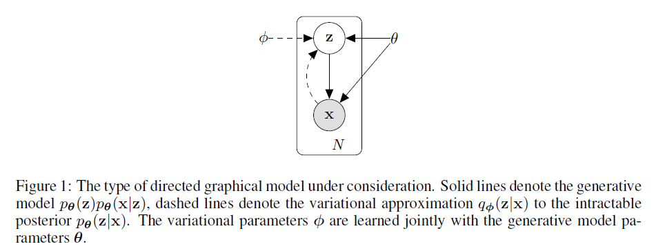

图1：考虑的有向图模型类型。实线表示**生成模型** $p_{θ}(z)p_{θ}(x|z)$ ，虚线表示对于难以处理的后验分布 $p_{θ}(z|x)$ 的**变分近似** $q_{φ}(z|x)$ 。变分参数 $φ$  与生成模型参数 $θ$ 联合学习。 

## 2.1 问题场景
&nbsp;&nbsp;&nbsp;&nbsp;&nbsp;&nbsp;&nbsp;&nbsp;让我们考虑一个数据集 X = {x(i)} (i = 1 ... N)，其中包含 N 个独立同分布的样本，这些样本是某个连续或离散变量 x 的**观测值**。我们假设这些数据是由一个涉及未观测连续随机变量 z 的随机过程生成的(生成模型的初始值)。该过程包含两个步骤：（1）从某个**先验分布** $p_{θ*}(z)$ 中生成一个值 $z^{i}$；（2）在给定 z 的条件下，从某个**条件分布** $p_{θ*}(x|z)$ 中生成一个值 $x^{i}$ 。我们假设**先验分布** $p_{θ*}(z)$ 和**似然分布** $p_{θ*}(x|z)$ 属于**参数化分布族** $p_{θ}(z)$ 和 $p_{θ(x|z)}$ ，并且它们的概率密度函数在几乎所有地方对 θ 和 z 都可微分。不幸的是，我们对这个过程的很多内容是无法观测到的：真实参数 θ* 以及潜在变量 $z^{i}$ 的值对我们来说是未知的。 

&nbsp;&nbsp;&nbsp;&nbsp;&nbsp;&nbsp;&nbsp;&nbsp;非常重要的是，我们不对边缘或后验概率进行常见的简化假设。相反，我们在这里感兴趣的是一个通用算法，即使在以下情况下也能高效工作： 

1. 难以处理的情况：当边缘似然 $p_{θ}(x) = \int pθ(z)pθ(x|z) dz$  的积分难以处理时（因此我们无法评估或求导边缘似然），真实的**后验密度** $p_{θ}(z|x) = pθ(x|z)pθ(z)/pθ(x)$ 也难以处理（因此无法使用EM算法），而对于任何合理的均场变分贝叶斯（mean-field VB）算法所需的积分也难以处理。这些难以处理的情况相当常见，在具有相对复杂的似然函数 $p_{θ}(x|z)$ 的情况下出现，例如具有非线性隐藏层的神经网络。 

*(假设我们有观测数据 X 和参数 θ，似然函数 p(X|θ) 表示在给定参数 θ 下观测数据 X 发生的概率。边缘似然是将似然函数关于参数 θ 进行边缘化（积分），即对所有可能的参数值 θ 进行积分，得到观测数据的边缘概率。)*  

2. 大型数据集：我们有如此庞大的数据，批量优化的成本太高；我们希望能够使用小批量甚至单个数据点进行参数更新。基于采样的解决方案，例如蒙特卡洛EM算法，通常会太慢，因为它涉及每个数据点的一次通常昂贵的采样循环。 

&nbsp;&nbsp;&nbsp;&nbsp;&nbsp;&nbsp;&nbsp;&nbsp;我们对上述情景中的**下述三个相关问题**感兴趣，并提出了解决方案： 
&nbsp;&nbsp;&nbsp;&nbsp;&nbsp;&nbsp;&nbsp;&nbsp;对参数 θ 进行高效的近似极大似然（ML）或最大后验概率（MAP）估计。参数本身可能是感兴趣的对象，例如在分析某个自然过程时。它们还可以用来**模拟隐藏的随机过程** ，并**生成类似真实数据的人工数据(AIGC)**。 
&nbsp;&nbsp;&nbsp;&nbsp;&nbsp;&nbsp;&nbsp;&nbsp;在选择参数 θ 的情况下，对给定观测值 x 进行高效的近似**后验推断**，以得到潜在变量 z。这对于**编码或数据表示任务非常有用**。 
&nbsp;&nbsp;&nbsp;&nbsp;&nbsp;&nbsp;&nbsp;&nbsp;对变量 x 进行高效的近似边缘推断。这使我们能够**执行各种需要对 x 进行先验推断**的任务。在计算机视觉中，常见的应用包括图像去噪、修复和超分辨率。 

&nbsp;&nbsp;&nbsp;&nbsp;&nbsp;&nbsp;&nbsp;&nbsp;为了解决上述问题，让我们引入一个识别模型 $q_{φ}(z|x)$ ：它是对难以处理的真实**后验概率** $p_{θ}(z|x)$ 的近似。请注意，与均场变分推断中的近似后验不同，识别模型不一定是因子化的，其参数 $φ$ 不是从某种闭式期望中计算得出的。相反，我们将介绍一种方法，可以联合学习**生成模型参数** $θ$ 和**识别模型参数** $φ$ 。 

&nbsp;&nbsp;&nbsp;&nbsp;&nbsp;&nbsp;&nbsp;&nbsp;从编码理论的角度来看，未观测的变量 z 可以被解释为**潜在表示(latent)或编码(code)**。因此，在本文中，我们还将将识别模型 $q_{φ}(z|x)$ 称为**概率编码器(加上概率的编码器)**，因为给定数据点 x，它会生成一个分布(生成的是一个分布：例如高斯分布)，表示数据点 x 可能生成的编码 z 的**可能取值范围(是一个范围)**。类似地，我们将 $p_{θ}(x|z)$ 称为概率解码器，因为给定编码 z，它会生成一个分布，表示可能**对应的 x 的取值范围**。 

&nbsp;&nbsp;&nbsp;&nbsp;&nbsp;&nbsp;&nbsp;&nbsp;边缘似然是由对各个数据点的边缘似然之和组成的：log pθ(x₁, ..., xₙ) = Σᴺᵢ₌₁ log pθ(xᵢ) 其中，每个边缘似然可以被重新表示为： 
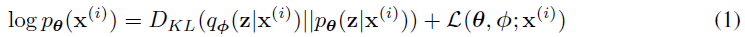

&nbsp;&nbsp;&nbsp;&nbsp;&nbsp;&nbsp;&nbsp;&nbsp;右侧第一个项是**近似后验**与**真实后验**的KL散度（Kullback-Leibler divergence）。由于KL散度非负，因此右侧第二个项 $L(θ, φ; x(i))$ 被称为数据点 i 的边缘似然的（变分）下界，可以表示为： 

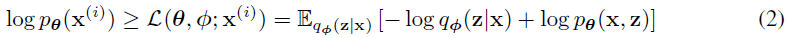

这也可以写成： 

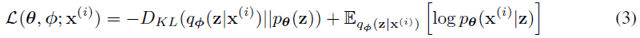

&nbsp;&nbsp;&nbsp;&nbsp;&nbsp;&nbsp;&nbsp;&nbsp;我们希望针对变分参数 φ 和生成参数 θ 对下界 L(θ, φ; x(i)) 进行求导和优化。然而，关于 φ 的下界梯度存在一些问题。对于这种类型的问题，通常（朴素地）使用蒙特卡洛梯度估计器，其形式为： 

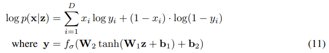

此处， $z(l) ∼ q_{φ}(z|x(i))$ 。这个梯度估计器表现出非常高的方差（参见例如[BJP12]），并且对于我们的目的来说是**不实用的**。 

## 2.3 SGVB估计器和AEVB算法
&nbsp;&nbsp;&nbsp;&nbsp;&nbsp;&nbsp;&nbsp;&nbsp;在本节中，我们介绍**下界**的一个实用估计器及其对参数的导数。我们假设**近似后验**形式为 $q_{φ}(z|x)$ ，但请注意该技术也可应用于不依赖于x的情况 $q_{φ}(z)$ 。完全变分贝叶斯方法用于推断参数的后验概率在附录中给出。 

&nbsp;&nbsp;&nbsp;&nbsp;&nbsp;&nbsp;&nbsp;&nbsp;在选择了一个近似后验分布 $q_{φ}(z|x)$ 并满足第2.4节中概述的某些温和条件的情况下，我们可以使用一个可微分的变换 $g_{φ}(ε, x)$ 对随机变量 $\widetilde z ∼ q_{φ}(z|x)$ 进行**重参数化**，其中ε是一个（辅助的）噪声变量。 

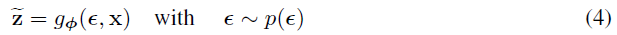

&nbsp;&nbsp;&nbsp;&nbsp;&nbsp;&nbsp;&nbsp;&nbsp;请参考第2.4节，了解选择适当分布p(ε)和函数 $g_{φ}(ε, x)$ 的一般策略。现在，我们可以通过下述方式形成关于 $q_{φ}(z|x)$ 的一些函数f(z)期望的蒙特卡洛估计:  

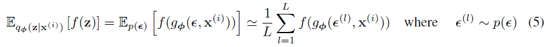

&nbsp;&nbsp;&nbsp;&nbsp;&nbsp;&nbsp;&nbsp;&nbsp;我们将这个技术应用于变分下界（方程（2）），得到了我们的通用随机梯度变分贝叶斯（SGVB）估计器。 

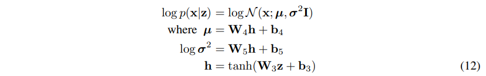

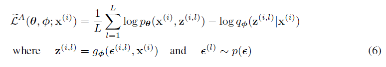

&nbsp;&nbsp;&nbsp;&nbsp;&nbsp;&nbsp;&nbsp;&nbsp;通常，KL散度 $D_{KL}(q_{φ}(z|x^{i}) || p_{θ}(z))$ （见附录B）在数值上可以进行积分，因此只需要通过抽样来估计期望重构误差 $E_{qφ(z|x(i))}[log p_{θ}(x^{i}|z)]$ 。KL散度项可以被解释为对φ进行正则化，**鼓励近似后验接近先验分布** $p_{θ}(z)$ 。这导致了SGVB估计器的第二个版本 $L^{B}(θ, φ; x(i)) ≈ L(θ, φ; x(i))$ , 对应于方程（3），通常比通用估计器具有更小的方差。 

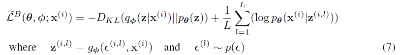

&nbsp;&nbsp;&nbsp;&nbsp;&nbsp;&nbsp;&nbsp;&nbsp;给定数据集X中的多个数据点，其中包含N个数据点，我们可以基于小批量构建整个数据集的**边缘似然下界估计器**： 

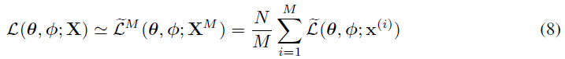

&nbsp;&nbsp;&nbsp;&nbsp;&nbsp;&nbsp;&nbsp;&nbsp;其中，小批量 $X^{M} = {x^(i)}$ (i = 1 ... M) 是从包含N个数据点的完整数据集X中随机抽取的M个数据点的样本。在我们的实验中，我们发现只要小批量大小M足够大（例如M = 100），每个数据点的样本数L可以设置为1。可以计算出导数 $∇_{θ,φ}L(θ; XM)$ , 并且可以将得到的梯度与随机优化方法（如SGD或Adagrad[DHS10]）结合使用。请参考算法1以了解计算随机梯度的基本方法。 

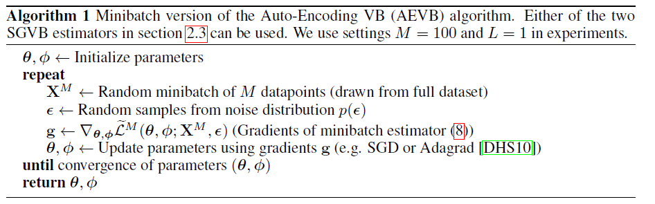

&nbsp;&nbsp;&nbsp;&nbsp;&nbsp;&nbsp;&nbsp;&nbsp;当观察到方程（7）中给出的目标函数时，与自编码器的联系变得清晰起来。第一项是**近似后验与先验之间的KL散度**，起到了**正则化**的作用，而第二项是期望的负rebuild误差。函数 $g_{φ}(.)$ 被选择为将数据点x(i)和随机噪声向量ε(l)映射到来自该数据点的近似后验的样本: $z(i,l) = g_{φ}(ε(l) , x(i))$ , 其中 $z(i,l) ∼ q_{φ}(z|x(i))$ 。随后，样本z(i,l)被输入到函数 $log p_{θ}(x(i)|z(i,l))$ 中，该函数表示给定z(i,l)下，数据点x(i)在生成模型下的概率密度（或质量）。这一项在自编码器中被称为**负重构误差**。 

## 2.4 重参数化技巧
&nbsp;&nbsp;&nbsp;&nbsp;&nbsp;&nbsp;&nbsp;&nbsp;为了解决我们的问题，我们引入了一种从 $q_{φ}(z|x)$ 中**生成样本**的替代方法。基本的参数化技巧非常简单。假设z是一个连续随机变量，而 $z ∼ q_{φ}(z|x)$ 是某个**条件分布** 。通常可以将随机变量z表示为**确定性变量** $z = g_{φ}(ε, x)$ ，其中ε是具有独立边际分布p(ε)的辅助变量，而 $g_{φ}(.)$ 是由φ参数化的某个向量值函数。 

&nbsp;&nbsp;&nbsp;&nbsp;&nbsp;&nbsp;&nbsp;&nbsp;这种重参数化对我们的情况非常有用，因为它可以用来重写关于 $q_{φ}(z|x)$ 的期望，从而使得关于φ的蒙特卡洛估计的期望是**可微的**。根据确定性映射 $z = g_{φ}(ε, x)$ ，我们知道 $q_{φ}(z|x)dz = p(ε)dε$ 。因此，可以得到以下结果： $∫ q_{φ}(z|x) f(z) dz = ∫ p(ε) f(z) dε = ∫ p(ε) f(g_{φ}(ε, x)) dε$ 。由此可以得出，可以构建一个可微的估计器： 

其中 $ε^{l} ∼ p(ε)$ 。在第2.3节中，我们应用了这个技巧来获得**变分下界的可微估计器**。 

&nbsp;&nbsp;&nbsp;&nbsp;&nbsp;&nbsp;&nbsp;&nbsp;以单变量高斯分布为例：假设 z ∼ p(z|x) = N(µ, σ²)。在这种情况下，一个有效的重参数化是 z = µ + σε，其中 ε 是一个辅助噪声变量，ε ∼ N(0, 1)。因此：

此处: $ε^l ∼ N (0, 1)$ . 

