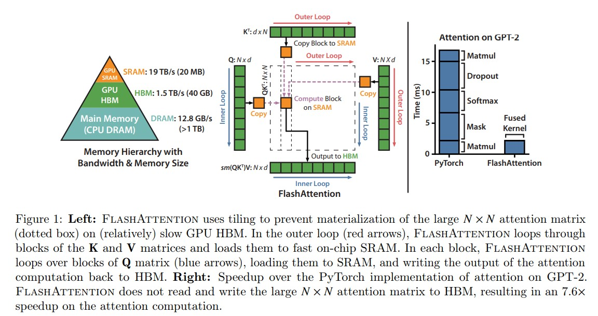
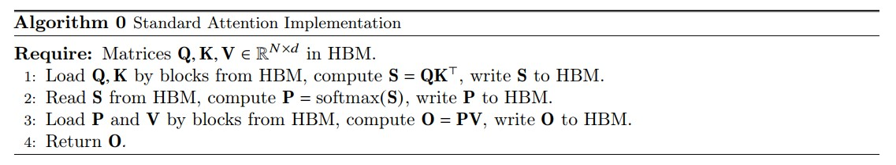
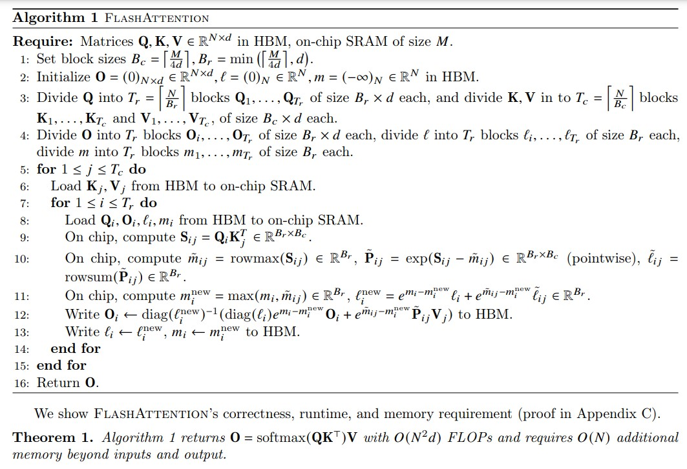
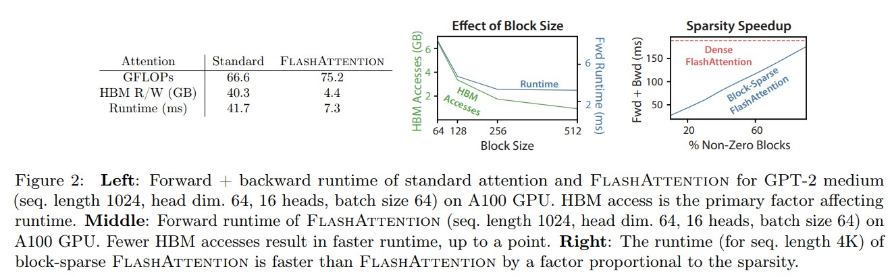
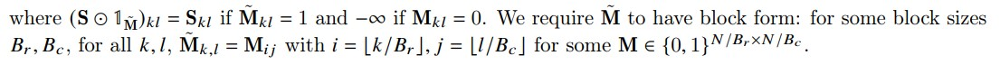

# FlashAttention: Fast and Memory-Efficient Exact Attention with IO-Awareness

# 摘要
Transformer在长序列上速度慢且内存不足，因为自我关注的时间和内存复杂性在序列长度上是二次的。近似注意力方法试图通过权衡模型质量以降低计算复杂度来解决这个问题，但通常无法实现挂钟加速(wall-clock speedup)。我们认为，一个缺失的原则是让注意力算法IO感知——考虑GPU内存级别之间的读写。我们提出了FlashAttention，这是一种IO感知的精确注意力算法，它使用平铺来减少GPU高带宽内存（HBM）和GPU片上SRAM之间的内存读/写次数。我们分析了FlashAttention的IO复杂性，表明它需要比标准关注更少的HBM访问，并且对于一系列SRAM大小来说是最佳的。我们还将FlashAttention扩展到block-sparse attention，从而产生比任何现有的近似注意力方法更快的近似注意力算法。FlashAttention训练transformer的速度比现有baseline更快：与MLPerf 1.1训练速度记录相比，BERT大型（序列长度512）的端到端时钟速度提高了15%，GPT-2（序列长度1K）的速度提高了3倍，远程竞技场(long-range arena序列长度1K-4K)的速度提升了2.4倍。FlashAttention和块稀疏FlashAttentention使Transformers中的上下文更长，产生了更高质量的模型（GPT-2的困惑度为0.7，长文档分类的提升度为6.4）和全新的能力：第一个在Path-X挑战（序列长度16K，准确率为61.4%）和Path-256（序列长度64K，准确度为63.1%）上实现优于偶然性能的transformer。
*注释："Wall-clock time"（挂钟时间）是指程序从开始执行到结束所经过的实际时间，通常以秒为单位。当对程序进行改进或优化时，如果程序的执行时间减少了，那么就可以说程序实现了"wall-clock speedup"。*
*SRAM（Static Random-Access Memory）是一种静态随机存取存储器，用于在计算机和其他电子设备中存储数据。它是一种易失性存储器，需要持续的电源供应来保持存储的数据。SRAM具有更快的访问速度和更低的访问延迟，因为SRAM使用了一种基于触发器的存储元件结构，而DRAM使用了电容器和电荷的存储机制。*
*DRAM（Dynamic Random-Access Memory）是一种动态随机存取存储器，用于在计算机和其他电子设备中存储数据。它是一种易失性存储器，需要持续的电源供应来保持存储的数据。*
*DRAM与另一种常见的存储器类型SRAM（Static Random-Access Memory）有所不同。与SRAM相比，DRAM具有较高的存储密度和较低的成本，但访问速度和延迟相对较高*
*计算机系统中的内存通常是指主存储器，它主要由DRAM（Dynamic Random-Access Memory）组成*

# 介绍(Introduction)
Transformer 模型[82] 已经成为自然语言处理和图像分类等应用中最常用的架构。Transformer 模型变得更大[5]、更深[83]，但要为它们提供更长的上下文仍然很困难[80]，因为它们核心的自注意力模块的时间和内存复杂度随序列长度呈二次增长。一个重要的问题是，将注意力机制变得更快速和内存更高效是否可以帮助 Transformer 模型解决长序列的运行时间和内存挑战。 
许多近似注意力方法旨在减少注意力计算和内存需求。这些方法包括稀疏近似[51, 74]、低秩近似[12, 50, 84]以及它们的组合[3, 9, 92]。尽管这些方法将计算需求降低为线性或接近线性，但其中许多方法并没有在与标准注意力相比的挂钟速度上显示出加速，并且没有得到广泛采用。一个主要原因是它们侧重于降低浮点运算量（与挂钟速度可能不相关），并且往往忽视了内存访问（IO）带来的开销。 
 

图1：左图：FlashAttention使用切片技术，防止在相对较慢的GPU高带宽存储器（HBM）上实例化大型的𝑁×𝑁注意力矩阵（虚线框）。在外循环（红色箭头）中，FlashAttention通过K和V矩阵的块循环，并将它们加载到快速的片上SRAM上。在每个块中，FlashAttention通过Q矩阵的块循环（蓝色箭头），将它们加载到SRAM，并将注意力计算的输出写回HBM。右图：相对于GPT-2在PyTorch实现的注意力机制，FlashAttention获得了加速。FlashAttention不需要将大型的𝑁×𝑁注意力矩阵读取和写入HBM，从而在注意力计算中获得了7.6倍的加速。

在本论文中，我们认为一个没被注意到的原则是使注意力算法具有IO感知性[1]，即仔细考虑对不同级别的快速和慢速存储器(memory)进行读写操作（例如，在快速GPU 芯片上SRAM和相对较慢的GPU高带宽存储器之间，如图1所示，左侧）。在现代GPU上，计算速度已经超过了内存速度[61, 62, 63]，而Transformer中的大多数操作都受到内存访问的瓶颈[43]。在读取和写入数据占据了运行时间的很大部分的内存受限操作中(IO密集型operator中)，IO感知算法至关重要，例如数据库连接[71]、图像处理[70]、数值线性代数[4]等等[40, 85]。然而，诸如PyTorch和Tensorflow等深度学习的常见Python接口并不允许对内存访问进行细粒度的控制。 
我们提出了一种名为FlashAttention的新型注意力算法，它可以在较少的内存访问次数下计算精确的注意力。我们的主要目标是避免将注意力矩阵读取和写入到HBM。为实现这一目标，我们采用了两种成熟的技术来解决这些挑战。(i) 我们重构了注意力计算过程，将输入分割成块，并对输入块进行多次处理，从而逐步执行softmax归一化操作（也称为切片）。(ii) 我们在前向传播中存储了softmax归一化因子，以便在后向传播中快速重新计算注意力，这比从HBM中读取中间注意力矩阵的标准方法更快。我们使用CUDA实现了FlashAttention，以实现对内存访问的细粒度控制，并将所有注意力操作融合到一个GPU内核中。尽管由于重新计算而增加了浮点运算量，但由于大大减少了对HBM的访问量，我们的算法比标准注意力运行得更快（如图1右图所示，GPT-2上最高可达7.6倍），并且使用的内存量与序列长度呈线性关系。 
我们对FlashAttention的IO复杂性进行了分析[1]，证明它需要 $𝑂(𝑁^{2}𝑑^{2}𝑀^{−1})次HBM访问，其中𝑑是头部维度，𝑀是SRAM的大小，而标准注意力需要𝑂(𝑁^{𝑑} + 𝑁^{2})次访问。对于典型的𝑑和𝑀值，与标准注意力相比，FlashAttention需要较少的HBM访问次数（如图2所示，最多减少了9倍）。此外，我们还提供了一个下界，表明没有任何精确的注意力算法可以在所有SRAM大小上渐近地改善HBM访问次数的数量。 
我们还展示了FlashAttention作为实现近似注意力算法潜力的有用基元的能力，克服了它们在内存访问开销方面的问题。作为概念验证，我们实现了块稀疏的FlashAttention，这是一种稀疏(sparse)的注意力算法，比FlashAttention本身快2-4倍，可以扩展到长度为64k的序列。我们证明了块稀疏的FlashAttention具有比FlashAttention更好的IO复杂性，其比例与稀疏比例成正比。在第5节中，我们讨论了对其他操作(operations)的进一步扩展（多GPU上的注意力，核回归，块稀疏矩阵乘法）。我们将FlashAttention开源，以使构建在这个基元之上变得更加容易。 
我们通过实证验证了FlashAttention在模型训练中的加速效果，并通过对更长上下文进行建模来提高模型质量。我们还对FlashAttention和块稀疏的FlashAttention与之前的注意力实现进行了运行时和内存占用的基准测试。 
 **更快的模型训练**
FlashAttention在实际时间上加快了Transformer模型的训练速度。我们在BERT-large（序列长度512）的训练速度比MLPerf 1.1 [58]的训练速度记录快15%，比HuggingFace [87]和Megatron-LM [77]的基准实现快3倍，以及在长距离竞技场（序列长度1K-4K）中比基准(baseline)实现快2.4倍。 
**更高质量的模型**
FlashAttention将Transformer扩展到更长的序列，提高了它们的质量并实现了新的功能。我们观察到在GPT-2上的困惑度提高了0.7，长文档分类任务[13]中通过建模更长序列提高了6.4个点。FlashAttention使得Transformer能够在Path-X [80]挑战中实现超过随机猜测的性能，仅通过使用更长的序列长度（16K）。块稀疏的FlashAttention使得Transformer能够扩展到更长的序列（64K），从而成为第一个能够在Path-256上实现超过随机猜测性能的模型。 
**注意力基准测试**
FlashAttention在常见的序列长度从128到2K之间比标准的注意力实现快3倍，而且可以扩展到64K。在序列长度最多为512的情况下，FlashAttention比任何现有的注意力方法都更快且更节省内存，而对于超过1K的序列长度，一些近似注意力方法（例如Linformer）开始变得更快。另一方面，块稀疏的FlashAttention比我们所知的所有现有近似注意力方法都更快。 

# 2 背景(backgroud)
在现代硬件（GPU）上，我们提供了一些关于常见深度学习操作的性能特征的背景知识。我们还描述了注意力的标准实现方式。

## 2.1 硬件表现(Hardware Performance)

我们在这里专注于GPU。在其他硬件加速器上的性能类似[46, 48]。
**GPU内存层次结构**.
GPU内存层次结构（图1左侧）由多种不同大小和速度的内存组成，较小的内存速度更快。以A100 GPU为例，它具有40-80GB的高带宽内存（HBM），带宽为1.5-2.0TB/s，并且每个108个流多处理器上都有192KB的片上SRAM，带宽估计约为19TB/s [44, 45]。片上SRAM的速度比HBM快一个数量级，但在大小上小多个数量级。随着计算速度相对于内存速度的提高[61, 62, 63]，操作越来越多地受到内存（HBM）访问(accesses)的瓶颈(bottlenecked)限制。因此，利用快速的SRAM变得更加重要。 
**执行模型**.
GPU具有大量的线程来执行操作（called a kernel）。每个内核从HBM加载输入到寄存器和SRAM中，进行计算，然后将输出写入HBM。 
**性能特征**.
根据计算和内存访问之间的平衡，操作可以被分类为计算密集型或内存密集型。这通常通过算术强度（arithmetic intensity）[85]来衡量，它表示每字节内存访问的算术操作数量。 
1.计算密集型（Compute-bound）：操作所需的时间由其中的算术操作数量决定，而访问HBM的时间要小得多。典型的例子包括具有大内部维度的矩阵乘法以及具有大量通道的卷积操作。 
2.内存密集型（Memory-bound）：操作所需的时间由内存访问的次数决定，而计算时间要小得多。这类操作的例子包括大多数其他操作，如逐元素操作（例如激活函数、dropout）和归约操作（例如求和、softmax、批归一化、层归一化）等。
**内核融合(Kernel fusion)**
加速内存密集型操作最常见的方法是进行内核融合：如果对同一输入应用了多个操作，可以从HBM中一次加载输入，而不是为每个操作多次加载。编译器可以自动融合许多逐元素操作[53, 65, 75]。然而，在模型训练的上下文中，中间值仍然需要被写入HBM以便在反向传播过程中保存，这降低了朴素内核融合的有效性。 

## 2.2 Standard Attention Implementation
给定输入序列 $Q、K、V ∈ R^{N×d}$ ，其中 N 是序列长度，d 是头维度（head dimension），我们想要计算注意力输出 $O ∈ R^{N×d}$。
$$\mathbf{S}=\mathbf{Q K}^{\top} \in \mathbb{R}^{N \times N}, \quad \mathbf{P}=softmax(\mathbf{S}) \in \mathbb{R}^{N \times N}, \quad \mathbf{O}=\mathbf{P V} \in \mathbb{R}^{N \times d},$$
这里，softmax 按行(row-wise)来进行。
标准的注意力实现将矩阵 S 和 P 实例化到 HBM 中，这需要 O(N^2) 的内存。通常情况下，N>>d（例如，对于GPT2，N=1024，d=64）。我们在算法0中描述了标准的注意力实现。由于一些或大部分操作是内存密集型的（例如softmax），大量的内存访问会导致较慢的实际执行时间 
这个问题在应用于注意力矩阵的其他逐元素操作时会变得更加严重，例如应用于 S 的掩码操作或应用于 P 的dropout操作。因此，已经有很多尝试将多个逐元素操作融合在一起，例如将掩码操作与softmax操作融合在一起[77]。 
在第3.2节中，我们将展示标准的注意力实现在序列长度 N 方面进行 HBM 访问的二次方增长。我们还将比较标准注意力和我们的方法（FlashAttention）的FLOPs数量和HBM访问数量。 

# 3 FlashAttention：算法、分析和扩展
我们展示了如何在减少HBM读写次数的同时计算精确的注意力，而无需存储大型中间矩阵用于反向传播。这产生了一个既内存高效又在实际执行时间上更快的注意力算法。我们对其IO复杂度进行了分析，表明与标准注意力相比，我们的方法需要更少的HBM访问次数。我们进一步展示了FlashAttention可以作为一个有用的基本原语，通过将其扩展为处理块稀疏注意力。 
为了便于阐述，我们在这里重点关注前向传播过程；附录B中包含了反向传播的详细信息。 

## 3.1 一种具有切片和重计算的高效注意力算法
给定输入的 $Q、K、V ∈ R^{N×d}$ 存储在 HBM 中，我们的目标是计算注意力输出 $O ∈ R^{N×d}$ 并将其写入 HBM。我们的目标是减少 HBM 访问量（降低到次二次方级别的水平）。 
我们应用了两种已经建立的技术（切片和重计算）来克服在次二次方级别的HBM访问中计算精确注意力的技术挑战。我们在算法1中描述了这一过程。主要思想是将输入的 Q、K、V 划分为块，从较慢的HBM加载到较快的SRAM中，然后相对于这些块计算注意力输出。通过在将每个块的输出乘以正确的归一化因子之前进行缩放并将它们相加，我们最终得到了正确的结果。 
**切片**
我们按块计算注意力。由于 softmax 将 K 的列进行耦合，因此我们使用缩放的方法对大型 softmax 进行分解 [51, 60, 66]。为了数值稳定性，向量 $𝑥∈{R^B}$ 的 softmax 计算如下： 

$$m(x):=max(i) \quad x_{i}, \quad  f(x):=\left[\begin{array}{lll} e^{x_{1}-m(x)} & \ldots & e^{x_{B}-m(x)} \end{array}\right], \quad \ell(x):=\sum_{i} f(x)_{i}, \quad softmax(x):=\frac{f(x)}{\ell(x)}$$

*注释：在数学中，":=" 是赋值符号，表示将右侧的值赋给左侧的变量或表达式。它常用于编程语言中表示变量的初始化或赋值操作*
对于向量 $𝑥^{(1)}, 𝑥^{(2)} ∈ R^B$ ，我们可以将拼接后的向量 $𝑥 = [𝑥^{(1)}; 𝑥^{(2)}] ∈ R^{(2B)}$ 的 softmax 进行分解，如下所示：
$$m(x)=m\left(\left[x^{(1)} x^{(2)}\right]\right)=\max \left(m\left(x^{(1)}\right), m\left(x^{(2)}\right)\right),$$
$$f(x)=\left[e^{m\left(x^{(1)}\right)-m(x)} f\left(x^{(1)}\right) \quad e^{m\left(x^{(2)}\right)-m(x)} f\left(x^{(2)}\right)\right],$$
$$\ell(x)=\ell\left(\left[x^{(1)} x^{(2)}\right]\right)=e^{m\left(x^{(1)}\right)-m(x)} \ell\left(x^{(1)}\right)+e^{m\left(x^{(2)}\right)-m(x)} \ell\left(x^{(2)}\right),$$
$$softmax(x)=\frac{f(x)}{\ell(x)}.$$
因此，如果我们跟踪一些额外的统计信息(𝑚(𝑥), ℓ(𝑥))，我们可以一次处理一个块计算 softmax。因此，我们将输入 Q、K、V 分成块（算法1的第3行），同时计算 softmax 值和额外的统计信息（算法1的第10行），然后将结果组合起来（算法1的第12行）。 
**重计算**。我们的目标之一是不在反向传播过程中存储𝑂(𝑁^2)个中间值。反向传播通常需要矩阵S、P ∈ R^N×N来计算相对于Q、K、V的梯度。然而，通过存储输出O和softmax归一化统计信息(𝑚, ℓ)，我们可以在反向传播过程中从SRAM中的Q、K、V块轻松地重新计算注意力矩阵S和P。这可以看作是一种选择性梯度检查点[10, 34]的形式。虽然已经提出了梯度检查点技术来减少所需的最大内存量[66]，但所有已知的实现都需要以速度换取内存。相比之下，即使有更多的FLOPs，我们的重计算由于减少了HBM访问次数而加速了反向传播过程（图2）。完整的反向传播描述详见附录B。 
实现细节：核融合。切片使我们能够在一个CUDA核函数中实现我们的算法，从HBM加载输入数据，执行所有的计算步骤（矩阵乘法、softmax、可选的掩码和dropout、矩阵乘法），然后将结果写回到HBM（掩码和dropout见附录B）。这避免了反复从HBM读取和写入输入和输出的操作。 

flashattention 步骤概述：
Q K V 三个矩阵的形状均为[N x d], 芯片上 SRAM 尺寸为大小为 M 个elements.
1. 设置 block 大小： $B_{c} = \frac{M}{4 d}, B_{r} = min(\frac{M}{4 d}, d)$ .
2. 初始化输出矩阵 O(形状为[N x d]) 为0,  ℓ(形状N)为0，m(形状为N) 负无穷.
3. 将 Q 矩阵分割为 $T_{r} = \frac{N}{B_{r}}$ 个blocks: $Q_{1},...,Q_{T_{r}}$ , 每个block 大小为 $B_{r}$ x d, 同时将K和V 分为  $T_{c} = \frac{N}{B_{c}}$ 个blocks: $K_{1},...,K_{T_{c}}$ and $V_{c},...,V_{T_{c}}$ , 每个block size 为 $B_{c}$ x d.
4. 将output的矩阵 O 分割为 $T_{r}$ 个blocks: $O_{1},...,O_{T_{r}}$ ，每个block 大小为 $B_{r}$ x d, 将ℓ分割为 $T_{r}$ 个blocks: $ℓ_{i},...,ℓ_{T_{r}}$ , 每个大小为 $B_{r}$, 将m 分割为 $T_{r}$ 个blocks: $m_{1},...,m_{T_{r}}$ , 每个大小为 $B_{r}$.
5. for 1 ≤ j ≤ $T_{c}$ do  外层循环遍历K和V：
6. $K_{j}, V_{j}$ 从 HBM 加载到 SRAM.
7. for 1 ≤ i ≤ $T_{r}$ do 内存循环遍历Q
8. 将 $Q_{i},O_{i},ℓ_{i},m_{i}$ 从HBM 加载到SRAM
9. 在芯片上计算 $S_{i j}=Q_{i} K_{j}^{T} \in R^{B_{r} \times B_{c}}$
10. 在芯片上计算: $m_{i j}=rowmax(S_{i j}) \in R^{B_{r}}$ , $P_{i j}=exp(S_{i j}-m_{i j} \in R^{B_{r} \times B_{c}} (pointwise)$ , $ℓ_{i j}=rowsum(P_{i j}) \in R^{B_{r}}$
11. 在芯片上更新 $m_{i}^{new}, ℓ_{i}^{new}$
12. 计算 $P_{i j}V_{j}$ , 进行指数缩放，并将结果reduce 到 $O_{i}$, 最后将 $O_{i}$ 写出到 HBM
13. 将 $m_{i}^{new}, ℓ_{i}^{new}$ 复制给 $m_{i}, ℓ_{i}$ 并写出到HBM
14. end for
15. end for
16. 将O 返回

## 3.2 分析：FlashAttention 的IO 复杂度
 

图2：左图：在A100 GPU上，GPT-2中型模型（序列长度1024，头维度64，16个头，批大小64）的标准注意力和FlashAttention的前向+后向运行时间。HBM访问是影响运行时间的主要因素。中间图：在A100 GPU上，FlashAttention的前向运行时间（序列长度1024，头维度64，16个头，批大小64）。较少的HBM访问次数导致更快的运行时间，直到某个点为止。右图：对于序列长度为4K的块稀疏FlashAttention，运行时间比FlashAttention快，其比例与稀疏度成比例。

我们分析了FlashAttention的IO复杂度，展示了与标准注意力相比HBM访问次数的显著减少。我们还提供了一个下界，证明没有任何精确的注意力算法能够在所有SRAM大小上渐近地改善HBM访问次数。证明详见附录C。 

**定理2**: 设 𝑁 为序列长度，𝑑 为头维度，𝑀 为 SRAM 的大小，其中 𝑑 ≤ 𝑀 ≤ 𝑁𝑑。标准注意力（算法0）需要 
 $Θ(𝑁𝑑 + 𝑁_{2})$ 次 HBM 访问，而 FlashAttention（算法1）需要 $Θ(𝑁^2𝑑^2𝑀^(-1))$ 次 HBM 访问。
    对于典型的𝑑值（64-128）和𝑀值（约为100KB），𝑑^2远远小于𝑀，因此FlashAttention比标准实现需要更少的HBM访问次数。这导致执行速度更快且内存占用更低，这一点我们在第4.3节中进行了验证。 
    证明的主要思想是，给定SRAM大小𝑀，我们可以加载大小为Θ(𝑀)的K、V块（算法1的第6行）。对于每个K和V块，我们迭代遍历所有的Q块（算法1的第8行）来计算中间值，从而导致对Q的 $Θ(𝑁𝑑𝑀^{-1})$ 次遍历。每次遍历加载Θ(𝑁𝑑)个元素，总共需要 $Θ(𝑁^{2}𝑑^{2}𝑀^{-1})$ 次HBM访问。我们同样证明了标准注意力的反向传播需要 $Θ(𝑁𝑑 + 𝑁_{2})$ 次HBM访问，而FlashAttention的反向传播需要 $Θ(𝑁^{2}𝑑^{2}𝑀^{-1})$ 次HBM访问（附录B）。 
    我们证明了一个下界：在计算精确的注意力时，无法在所有𝑀（SRAM大小）的值上渐近地改进HBM访问次数。 
**命题**3：设 𝑁 为序列长度，𝑑 为头维度，𝑀 为 SRAM 的大小，其中 𝑑 ≤ 𝑀 ≤ 𝑁𝑑。在范围 [𝑑, 𝑁𝑑] 内，不存在一种算法可以使用 $𝑜(𝑁^{2}𝑑^{2}𝑀^{-1})$ 次 HBM 访问来计算精确的注意力。
    证明依赖于以下事实：对于 𝑀 = Θ(𝑁𝑑)，任何算法必须执行 Ω(𝑁^2𝑑^2𝑀^(-1)) = Ω(𝑁𝑑) 次 HBM 访问。这种对 𝑀 子范围的下界在流算法文献中很常见[88]。我们将证明基于 𝑀 的参数化复杂性[27]的下界作为未来激动人心的工作留待探索。 
    我们验证了HBM访问次数是决定注意力运行时间的主要因素。在图2（左图）中，我们可以看到，尽管FlashAttention在FLOP计数上比标准注意力更高（由于在反向传播中的重计算），但它的HBM访问次数要少得多，从而导致运行时间更快。在图2（中间图）中，我们变化FlashAttention的块大小 $𝐵_{𝑐}$，这会导致不同数量的HBM访问，并测量前向传播的运行时间。随着块大小的增加，HBM访问次数减少（因为我们对输入进行的遍历次数减少），运行时间也减少。对于足够大的块大小（超过256），运行时间将受到其他因素（例如算术运算）的限制。此外，更大的块大小将无法适应较小的SRAM大小。 

## 3.3 块稀疏FlashAttention
我们将FlashAttention扩展为近似注意力的块稀疏FlashAttention。其输入输出复杂度相对于FlashAttention来说，与稀疏度成比例的因子更小. 
    给定输入Q、K、 $V \in R^{𝑁𝑑}$ 和掩码矩阵 $M \in \left\lbrace0, 1\right\rbrace^{𝑁×𝑁}$ ,我们希望计算：
$$S = QK^{T} \in R^{N \times N}, \quad P=softmax(S \odot 1_{\tilde{M}}) \in R^{N \times N}, \quad O = PV \in R^{N \times d},$$

    给定预定义的块稀疏掩码矩阵 $M \in \left\lbrace0, 1\right\rbrace^(𝑁/𝐵𝑟)×(𝑁/𝐵𝑐)$ ，我们可以轻松地调整算法1，仅计算注意力矩阵的非零块。该算法与算法1相同，只是我们跳过零块。我们在附录B中复制了算法描述，具体见算法5。 
    我们还分析了块稀疏FlashAttention的输入输出复杂度。
**命题4**：设 𝑁 为序列长度，𝑑 为头维度，𝑀 为 SRAM 的大小，其中 𝑑 ≤ 𝑀 ≤ 𝑁𝑑。块稀疏FlashAttention（算法5）需要 $Θ(𝑁𝑑 + 𝑁^{2}𝑑^{2}𝑀^{-1}𝑠)$ 次 HBM 访问，其中 𝑠 是块稀疏掩码中非零块的比例。
    我们可以看到，应用块稀疏性直接通过稀疏性改进了IO复杂性中较大的项。对于较大的序列长度𝑁，𝑠通常设置为 
 $𝑁^(-1/2)$ [11]或 $𝑁^(-1)log𝑁$ [3, 17, 92]，导致 $\Theta(N \sqrt{N})$ 或 $\Theta(N \log N)$ 的IO复杂性。在后续的实验中，我们使用固定的蝴蝶稀疏模式[17]，已经证明能够近似任意稀疏性[16]。
    在图2（右图）中，我们验证了随着稀疏度的增加，块稀疏FlashAttention的运行时间成比例地改善。在LRA基准测试中，块稀疏FlashAttention实现了2.8倍的加速，在性能上与标准注意力相当（第4节）。

