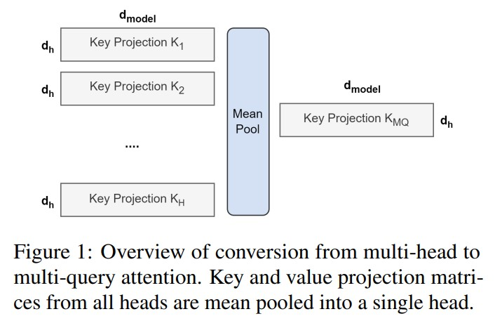
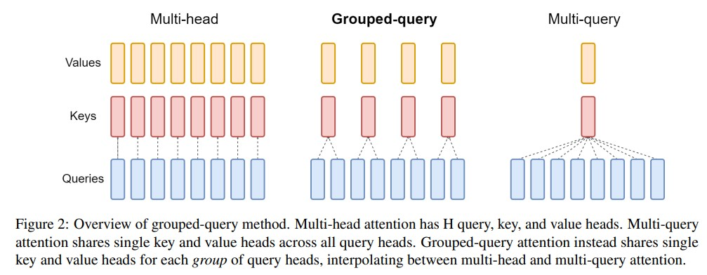

# GQA: 从多头检查点中训练通用的多查询Transformer模型

# 摘要：
&nbsp;&nbsp;&nbsp;&nbsp;&nbsp;&nbsp;&nbsp;&nbsp;多查询注意力（MQA）仅使用**单个键值头**，极大地加快了解码器(encoder)推理速度。然而，MQA可能会导致质量下降，而且训练一个单独的模型只是为了更快的推理可能并不理想(还要保证性能)。我们提出了一种方法，可以使用原始预训练计算量的5％来对现有的多头语言模型检查点(checkpoint)进行自我训练，将其转换为具有MQA的模型。同时，我们引入了分组查询注意力（GQA），它是多查询注意力的一种推广形式，使用中间数量（大于一个，小于查询头(query head)的数量）的键值头。我们展示了经过自我训练的GQA在质量上**接近多头注意力**，并且与MQA具有相当的速度。 

# 1 引言
&nbsp;&nbsp;&nbsp;&nbsp;&nbsp;&nbsp;&nbsp;&nbsp;由于在每个解码(decoder)步骤中加载(load)解码器权重(weight)以及所有注意力键和值所带来的内存带宽开销，自回归解码器推理对于Transformer模型来说是一个严重的瓶颈（Shazeer，2019; Pope等人，2022; de Jong等人，2022）。通过多查询注意力(MQA)（Shazeer，2019），可以大大减少**加载键(key)和值(value)** 的内存带宽开销，该方法**使用多个查询头但单个键和值头**。 
&nbsp;&nbsp;&nbsp;&nbsp;&nbsp;&nbsp;&nbsp;&nbsp;然而，多查询注意力（MQA）可能会导致模型质量下降和训练不稳定，并且训练专门针对质量和推理进行优化的单独模型可能是不可行的。此外，虽然一些语言模型已经使用了多查询注意力，例如PaLM（Chowdhery等人，2022），但许多语言模型并未使用，包括公开可用的语言模型，如T5（Raffel等人，2020）和LLaMA（Touvron等人，2023）。 
&nbsp;&nbsp;&nbsp;&nbsp;&nbsp;&nbsp;&nbsp;&nbsp;本工作提出了两个关于大型语言模型**更快推理**的贡献。首先，我们展示了可以通过**自我训练(Komatsuzaki等人，2022)** 将具有多头注意力（MHA）的语言模型检查点转换为使用MQA，并只需原始训练计算量的一小部分。这提供了一种经济高效的方法，既可以获得**快速的多查询**，又可以得到**高质量的MHA检查点**。 
&nbsp;&nbsp;&nbsp;&nbsp;&nbsp;&nbsp;&nbsp;&nbsp;其次，我们提出了**分组查询注意力(GQA)** ，它是在多头注意力和多查询注意力之间的插值，每个查询头子组使用单个键和值头。我们展示了经过自我训练的GQA在质量上接近多头注意力，同时几乎与多查询注意力一样快速。 

# 2 方法
## 2.1 自我训练
&nbsp;&nbsp;&nbsp;&nbsp;&nbsp;&nbsp;&nbsp;&nbsp;从多头模型生成多查询模型分为两个步骤：首先是转换检查点(checkpoint)，然后是额外的预训练，使模型适应其新的结构。图1展示了将多头检查点转换为多查询检查点的过程。key和value头的投影矩阵被平均汇总为单个投影矩阵，我们发现这比选择单个键和值头或从头开始随机初始化新的键和值头效果更好。 

&nbsp;&nbsp;&nbsp;&nbsp;&nbsp;&nbsp;&nbsp;&nbsp;转换后的检查点接着使用相同的预训练方法进行预训练，但仅进行原始训练步骤的一小部分α。 

## 2.2 分组查询注意力(GQA)

&nbsp;&nbsp;&nbsp;&nbsp;&nbsp;&nbsp;&nbsp;&nbsp;分组查询注意力(GQA)将查询头分成G个组，每个组**共享**一个键头和值头。GQA-G表示具有G个组的分组查询。GQA-1表示单个组，因此具有单个键头和值头，等效于MQA。而GQA-H表示组数等于头数，等效于MHA。图2显示了分组查询注意力和多头/多查询注意力的比较。在将多头检查点转换为GQA检查点时，我们通过对该组内所有**原始头进行平均汇总**来构建每个组的键头和值头。 
&nbsp;&nbsp;&nbsp;&nbsp;&nbsp;&nbsp;&nbsp;&nbsp;中间数量的组导致插值模型，其质量高于MQA但比MHA快，正如我们将展示的那样，这代表了一个**有利的权衡**。从MHA转换为MQA将H个键和值头减少为单个键和值头，将键值缓存(KV Cache)的大小减小，并且需要加载的数据量减少了H倍。然而，更大的模型通常会按比例增加头的数量，从而多查询注意力在内存带宽和容量上都具有更激进的削减。GQA使我们能够**随着模型的增大而保持带宽和容量的相同比例减少**。 
&nbsp;&nbsp;&nbsp;&nbsp;&nbsp;&nbsp;&nbsp;&nbsp;此外，较大的模型相对较少受到注意力的内存带宽开销的影响，因为KV Cache 随着模型维度的增加而扩展，而模型的FLOPs和参数随着模型维度的平方增加。最后，针对大型模型的标准分片将单个键头和值头复制了模型分区的数量（Pope等人，2022）；GQA消除了这种分区的浪费。因此，我们希望GQA在较大的模型中能够达到一个特别好的权衡。 
&nbsp;&nbsp;&nbsp;&nbsp;&nbsp;&nbsp;&nbsp;&nbsp;值得注意的是，GQA不适用于编码器(encoder)的自注意力层；**编码器表示是并行计算的**，因此内存带宽通常不是主要瓶颈。 

