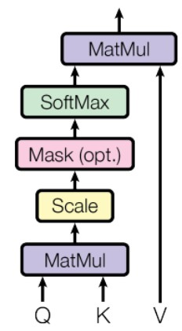
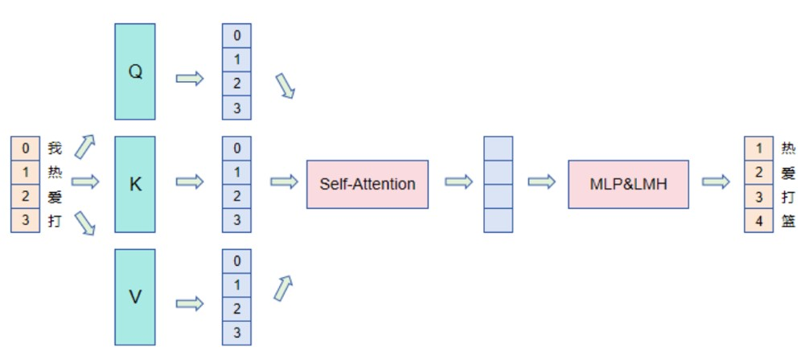
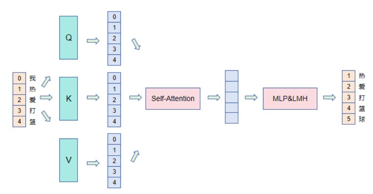
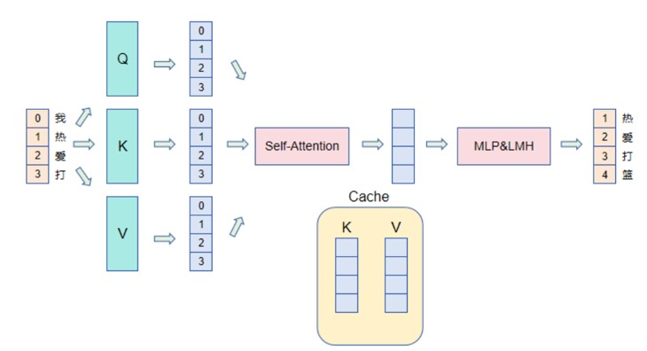
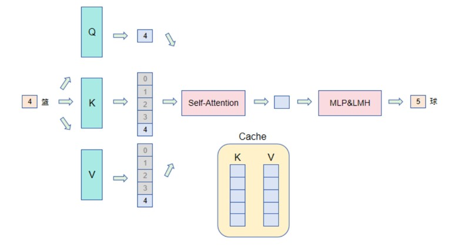

# KV Cache

# 1 概述
&nbsp;&nbsp;&nbsp;&nbsp;&nbsp;&nbsp;&nbsp;&nbsp;在生成式Transformer中，缓存(Caching) Key(K)和 Value(V)状态的技术已经存在一段时间了。这种技术可以显著提高推理速度，在注意力机制中，Key和Value状态用于计算带缩放的点积注意力机制(scaled dot-product attention)，如下图所示。<br>



&nbsp;&nbsp;&nbsp;&nbsp;&nbsp;&nbsp;&nbsp;&nbsp;KV Cache发生在多个tokens生成步骤中，只在Decoder中进行（即在仅解码器的模型如GPT中，或者在编码器-解码器模型如T5中的解码器部分）。像BERT这样的模型不是生成模型，因此没有KV Cache。<br>

&nbsp;&nbsp;&nbsp;&nbsp;&nbsp;&nbsp;&nbsp;&nbsp;解码器以自回归(auto-regressive)的方式工作，就像下图GPT-2文本生成示例所示的那样。<br>


*(figrue 1: 在Encoder的自回归生成中，给定一个输入，模型会预测下一个token，然后在下一步中使用组合的输入进行下一个预测。)* <br>

&nbsp;&nbsp;&nbsp;&nbsp;&nbsp;&nbsp;&nbsp;&nbsp;这种自回归行为会重复(repeats)一些操作，我们可以通过放大(zoom in) Encoder 中计算的带掩码的缩放点积注意力(masked scaled dot-product attention)来更好地理解这一点。<br>


*(解码器中缩放点积注意力的逐步可视化。emb_size表示embedding size.)* <br>

&nbsp;&nbsp;&nbsp;&nbsp;&nbsp;&nbsp;&nbsp;&nbsp;由于解码器是因果的（即令牌的注意力仅依赖于其前面的令牌），在每个生成步骤中，我们重新计算了相同的先前令牌的注意力，而实际上我们只想计算新令牌的注意力。<br>

# 2 KV Cache
&nbsp;&nbsp;&nbsp;&nbsp;&nbsp;&nbsp;&nbsp;&nbsp;这就是KV缓存发挥作用的地方。通过缓存先前的键(Key)和值(Value)，我们可以只专注于计算新token的注意力。<br>


*(缩放点积注意力的比较，带有和不带有KV缓存。emb_size表示嵌入大小。)* <br>

&nbsp;&nbsp;&nbsp;&nbsp;&nbsp;&nbsp;&nbsp;&nbsp;这种优化为什么重要呢？如上图所示，使用KV缓存得到的矩阵要小得多，这导致矩阵乘法更快。唯一的缺点是它需要更多的GPU VRAM（或者如果没有使用GPU，则需要更多的CPU RAM）来缓存键(Key)和值(Value)的状态。<br>

# 3 KV Cache 静态展示
## 3.1 没有KV Cache 的情况
- 之前tokens <br>


- 新增token <br>


## 3.2 有KV Cache 的情况
- 之前tokens <br>


- 新增token <br>


# 4 加速效果展示
&nbsp;&nbsp;&nbsp;&nbsp;&nbsp;&nbsp;&nbsp;&nbsp;让我们使用[transformers库🤗](https://github.com/huggingface/transformers)来比较使用和不使用KV缓存时GPT-2的生成速度.<br>

- 代码如下：
```
import numpy as np
import time
import torch
from transformers import AutoModelForCausalLM, AutoTokenizer

device = "cuda" if torch.cuda.is_available() else "cpu"
tokenizer = AutoTokenizer.from_pretrained("gpt2")
model = AutoModelForCausalLM.from_pretrained("gpt2").to(device)

for use_cache in (True, False):
  times = []
  for _ in range(10):  # measuring 10 generations
    start = time.time()
    model.generate(**tokenizer("What is KV caching?", return_tensors="pt").to(device), use_cache=use_cache, max_new_tokens=1000)
    times.append(time.time() - start)
  print(f"{'with' if use_cache else 'without'} KV caching: {round(np.mean(times), 3)} +- {round(np.std(times), 3)} seconds")
```

- 结果如下：
在Google Colab笔记本上，使用Tesla T4 GPU，以下是生成1000个新token的平均时间和标准差报告：<br>
```python
with KV caching: 11.885 +- 0.272 seconds
without KV caching: 56.197 +- 1.855 seconds
```

&nbsp;&nbsp;&nbsp;&nbsp;&nbsp;&nbsp;&nbsp;&nbsp;结果显示，推理速度的差异巨大，而GPU VRAM的使用量可以忽略不计。因此，请确保在您的Transformer模型中使用KV缓存！<br>

# 5 参考链接
- [参考链接1](https://jalammar.github.io/illustrated-gpt2/)
- [参考链接2](https://kipp.ly/transformer-inference-arithmetic/#kv-cache)
- [参考链接3](https://juejin.cn/post/7294638699418042378?from=search-suggest)

