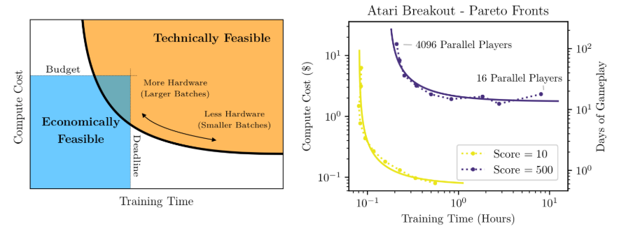
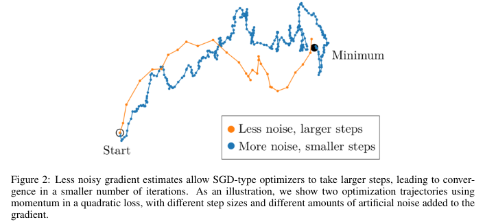

# 一种大批量训练的经验模型(An Empirical Model of Large-Batch Training)

- [paper 链接](https://arxiv.org/pdf/1812.06162)

# 摘要
&nbsp;&nbsp;&nbsp;&nbsp;&nbsp;&nbsp;&nbsp;&nbsp;在越来越多的领域中，已经证明深度学习模型**可以使用相对较大的batch size进行训练，而不会牺牲(sacrificing)数据效率**。然而，这种大规模数据并行处理的限制似乎在**不同的领域之间有所不同**，从ImageNet中的数万 batches 到玩Dota 2游戏的RL代理的数百万批次不等。据我们所知，对于为什么批处理大小的限制不同以及如何在新的领域中选择正确的批处理大小，存在有限的概念理解。在本文中，我们证明了一种简单易行且易于测量的统计量，称为**梯度噪声尺度，可以预测许多领域和应用中最大的有用batch size**，包括一些监督学习数据集（MNIST、SVHN、CIFAR10、ImageNet、Billion Word）、强化学习领域（Atari和Dota）甚至生成模型训练（在SVHN上的自编码器）。我们发现，噪声尺度在训练过程中随着损失的减少而增加，并且主要依赖于模型大小来改进模型性能。我们基于经验的理论还**描述了计算效率和时间效率之间的权衡**，并提供了**自适应批处理大小**训练的好处的大致模型。 

# 1 引言
&nbsp;&nbsp;&nbsp;&nbsp;&nbsp;&nbsp;&nbsp;&nbsp;过去几年中，用于训练深度学习模型的计算量呈现出快速增长[AH18]。这种增长的一个重要推动因素，同时也是限制因素，是并行性(即训练过程可以有效地分布在多个设备上的程度)。无论总的计算量有多少，如果模型训练无法充分并行化，那么可能需要太长的串行时间，从而在实践上是不可行的。 

&nbsp;&nbsp;&nbsp;&nbsp;&nbsp;&nbsp;&nbsp;&nbsp;在深度学习中，非常常见的并行性来源是**数据并行性**，它涉及将数据批次分割到多个设备上，然后对grad 进行allreduce并应用。数据并行性要求设备之间进行快速通信，同时也要求**大batch在算法上对加速学习起到有效作用**。最近的一些论文经验证明，**在特定的数据集或任务上，大批次大小可以在训练中实现几乎线性的加速，而不会严重损害样本效率或泛化能力**。例如，已经成功地使用了8千个[GDG+17]、16千个[SKYL17]、32千个[YGG17, YZH+17, ASF17]，甚至64千个[JSH+18]样本来训练ImageNet，而数千个样本的批次大小在语言模型和生成模型中也是有效的[OEGA18, PKYC18, BDS18]。这种现象并不局限于监督学习：在强化学习中，使用超过一百万个time step（并行运行数万个环境）的批次大小已经在Dota玩家代理中被使用[BCD+18]，甚至在简单的Atari环境中，数千个time step的批次大小也被证明是有效的[AAG+18, HQB+18, SA18]。这些发现使得大量的数据和计算能够在合理的时间内有效地注入到模型中，从而在监督学习、强化学习和其他领域中实现更强大的模型。 

&nbsp;&nbsp;&nbsp;&nbsp;&nbsp;&nbsp;&nbsp;&nbsp;然而，对于给定的数据集和模型，我们很难预测我们可以合理使用多大的批处理大小，为什么该数字取特定值，以及如果使用不同的数据集或模型，我们预期它会有何不同。例如，为什么在训练Dota代理时似乎可以使用超过一百万的批处理大小，而在训练图像识别模型时只能使用数千或数万的批处理大小？在实践中，研究人员倾向于仅仅尝试不同的批处理大小，并观察哪种效果最好，但这种方法的缺点是，**大batch size通常需要仔细调整才能发挥有效作用（例如，它们可能需要一个预热期或非常规的学习率调度）**，因此可以使用大batch size的事实可能在很长一段时间内被忽视。例如，Atari和ImageNet任务在几年的时间里通常使用的批处理大小比现在被认为是可能的要小得多。提前知道我们预期的有效批处理大小将对训练新模型具有重大的实际优势。 

*(图1：在将模型训练到一定性能水平的过程中，时间和计算资源的权衡关系形成了帕累托前沿（左图）。训练时间和计算成本分别主要由优化步骤的数量和处理的训练样本数量确定。我们可以以更多计算资源的代价更快地训练模型。右图显示了通过将模型训练到不同性能水平来获得的Atari Breakout游戏的帕累托前沿的具体示例。成本和训练时间取决于计算架构，并且仅显示近似值。)*

&nbsp;&nbsp;&nbsp;&nbsp;&nbsp;&nbsp;&nbsp;&nbsp;在本论文中，我们试图回答其中一些问题。我们测量了一个简单的经验统计量，即**梯度噪声尺度（实质上是衡量训练样本间梯度信噪比的指标）**，并展示了它能够大致预测各种任务的**最大有效batch size**。我们的模型还预测了计算/时间权衡曲线的具体形状，如图1所示。我们的贡献是一个基本理论和对该理论的广泛经验测试的结合。 

&nbsp;&nbsp;&nbsp;&nbsp;&nbsp;&nbsp;&nbsp;&nbsp;在概念层面上，我们建立了一个框架，在一些基本假设下，预测训练应该在批处理大小接近噪声尺度时几乎线性地进行并行化，之后应该平滑但相对快速地转变为进一步的并行化提供的收益较小的状态。此外，我们预期随着模型变得更准确，噪声尺度应该在训练过程中增加，并且对于更复杂的任务来说，噪声尺度应该更大，但不应强烈依赖于模型大小本身。我们还对根据噪声尺度在训练过程中动态调整批处理大小所能期望的效率收益进行了分析。最后，我们预测，在其他条件相同的情况下，由于环境的随机性和信用分配问题引入的额外方差，噪声尺度在复杂的强化学习任务中倾向于更大。 

&nbsp;&nbsp;&nbsp;&nbsp;&nbsp;&nbsp;&nbsp;&nbsp;在实证方面，我们在监督学习、强化学习和生成模型的8个任务中验证了这些预测，包括ImageNet、CIFAR-10、SVHN、MNIST、BillionWord、Atari、OpenAI的Dota代理[BCD+18]以及用于图像的变分自编码器。对于每个任务，我们展示了噪声尺度准确预测最大可用批处理大小（在数量级上），并且并行性的收益下降符合理论预测的方式。我们还展示了噪声尺度在训练过程中的增加，并展示了通过动态批处理大小调整获得的效率提升。噪声尺度最终会随着模型的性能提高而增大，但这似乎是因为更高性能的模型仅仅实现了更好的损失。 

&nbsp;&nbsp;&nbsp;&nbsp;&nbsp;&nbsp;&nbsp;&nbsp;本论文的其余部分组织如下。在第2节中，我们推导了关于噪声尺度、数据并行性和批处理大小的简单概念图，并解释了它对于最佳批处理大小以及它们在训练过程中和不同任务之间如何变化的预测。在此基础上，我们在第2.3节中进一步研究了训练效率。然后在第3节中，我们对第2节中的预测进行了实证测试，并探讨了噪声尺度如何随数据集、模型大小和学习范式（监督学习与强化学习与生成模型）的变化。第4节介绍了相关工作，第5节讨论了这些结果的影响以及可能的未来实验。 

# 2 理论和梯度噪声尺度的预测
## 2.1 直观图像
&nbsp;&nbsp;&nbsp;&nbsp;&nbsp;&nbsp;&nbsp;&nbsp;在详细讨论梯度噪声尺度和批处理大小之前，先给出一个直观的图像是有用的。假设我们通过随机梯度下降（SGD）来优化一个函数。存在一个真实的优化景观，对应于整个数据集（或更抽象地说，从中抽取的分布）上的损失。当我们使用有限的batch size进行SGD更新时，我们在**逼近这个真实损失的梯度**。我们应该如何决定使用什么batch size呢？ 

&nbsp;&nbsp;&nbsp;&nbsp;&nbsp;&nbsp;&nbsp;&nbsp;当批处理大小非常小的时候，近似值的方差会非常高，导致梯度更新主要是噪声。**连续应用这些SGD更新将平均掉方差并使我们总体上朝着正确的方向前进，但是参数的个别更新并不会很有用**，而且我们几乎可以通过并行聚合(aggregating)这些更新（update）并一次性应用它们（换句话说，使用更大的批处理大小）来达到几乎相同的效果。有关大批量训练和小批量训练的对比，请参见图2。 

*(图2：较少噪声的梯度估计允许SGD类型的优化器采取更大的步长(learning rate)，从而在较少的迭代次数(iterations)内收敛(convergence)。为了说明这一点，我们展示了使用动量在二次损失函数上的两条优化轨迹，其中步长和梯度中添加的人工噪声量不同。）*

**注释：较少噪声的梯度估计允许SGD类型的优化器采取更大的步长，这一点是采用较少step 就可以收敛的根本原因**  

&nbsp;&nbsp;&nbsp;&nbsp;&nbsp;&nbsp;&nbsp;&nbsp;另一方面，当批处理大小非常大时，batch gradient将几乎完全匹配真实梯度，并且相应地，两个随机抽样的批次将具有**几乎相同的梯度**。因此，将批处理大小增加一倍**几乎不会改善更新** ,我们将使用两倍的计算量, 但收益很小。 

&nbsp;&nbsp;&nbsp;&nbsp;&nbsp;&nbsp;&nbsp;&nbsp;直观地说，从第一个阶段（其中增加批处理大小几乎可以实现**完全线性加速**）到第二个阶段（其中增加批处理大小主要浪费计算资源）的**转变**大致应发生在**梯度的噪声和信号之间达到平衡的地方**——即**梯度的方差与梯度本身的尺度相当的地方**。将这种启发式观察形式化，可以得到梯度噪声尺度。 

## 2.6 总结
&nbsp;&nbsp;&nbsp;&nbsp;&nbsp;&nbsp;&nbsp;&nbsp;总结起来，我们的模型对于大批量训练提出了以下预测： 
- 神经网络训练的**速度和效率**之间的权衡由批处理大小控制，并遵循2.11式的形式。 
- 描述成本/时间权衡的关键Batch size $B_{crit}$ 可以通过测量梯度噪声尺度在数量级上进行预测，最简化形式为2.9式中的Bsimple。 
- 梯度噪声尺度在训练过程中可以有显著变化，这表明关键批处理大小还取决于所选择的模型性能水平。 
- 梯度噪声尺度通过训练的“温度”与学习率相关，但在调优良好的训练过程中保持一致（参见附录C）。 

