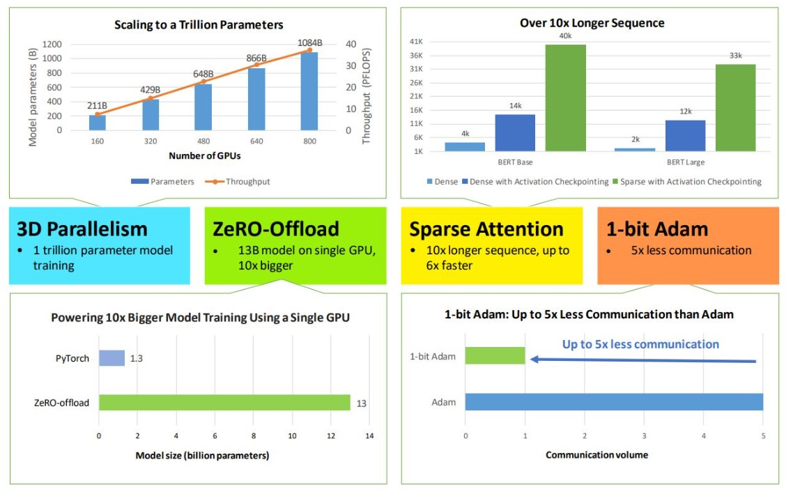
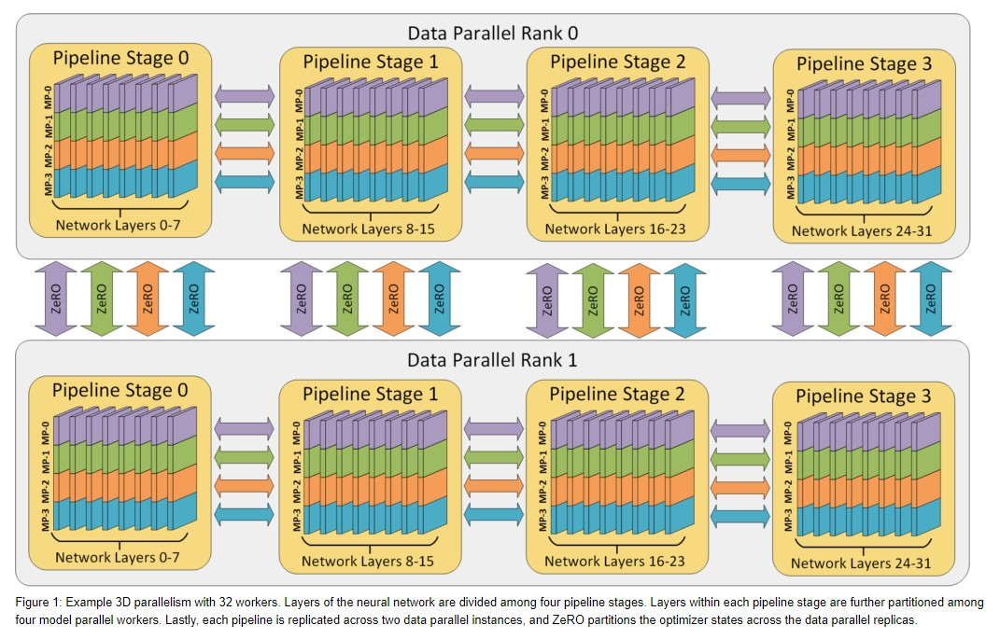
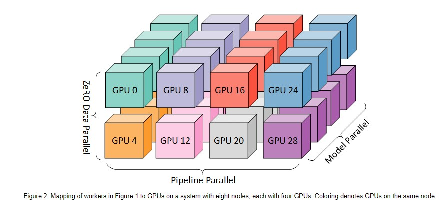

# DeepSpeed：面向所有人的大规模模型训练
# 0 概述
&nbsp;&nbsp;&nbsp;&nbsp;&nbsp;&nbsp;&nbsp;&nbsp;在2020.2月份，我们宣布推出了[DeepSpeed](https://www.microsoft.com/en-us/research/blog/zero-deepspeed-new-system-optimizations-enable-training-models-with-over-100-billion-parameters/)，这是一个开源的深度学习训练优化库，以及库中的一项创新的内存优化技术ZeRO（Zero Redundancy Optimizer）。DeepSpeed通过提升规模、速度、成本和易用性，极大地改进了大型模型训练。DeepSpeed使研究人员能够创建图灵自然语言生成（[Turing-NLG](https://www.microsoft.com/en-us/research/blog/turing-nlg-a-17-billion-parameter-language-model-by-microsoft)）模型，这是当时参数数量达到170亿个并且具有最先进准确性的最大语言模型。在五月份，我们发布了支持最多2000亿参数的[ZeRO-2](https://www.microsoft.com/en-us/research/blog/zero-2-deepspeed-shattering-barriers-of-deep-learning-speed-scale/) (zero-stage2)技术，相比于现有技术，训练速度提高了10倍。同时，我们还发布了一系列计算、输入/输出和收敛优化技术，为最快的BERT训练提供支持。从那时起，我们一直以快速的速度进行创新，推动着深度学习训练速度和规模的界限。我们不断努力创新，不断突破深度学习训练的速度和规模限制。 

&nbsp;&nbsp;&nbsp;&nbsp;&nbsp;&nbsp;&nbsp;&nbsp;今天，我们很高兴分享我们的新进展，这不仅将深度学习训练推向了极限，而且使更多人能够参与其中，从在大型超级计算机上进行训练的数据科学家，到在低端集群甚至单个GPU上进行训练的人。具体而言，DeepSpeed引入了四项新的系统技术，进一步推动了微软AI产品和平台上的大规模AI(AI at Scale)倡议的创新。这些技术具有极高的计算、内存和通信效率，能够支持具有数十亿到数万亿参数的模型训练。这些技术还允许处理极长的输入序列，并可在硬件系统上进行训练，无论是单个GPU、具有数千个GPU的高端集群，还是具有**非常慢的以太网网络的低端集群**。这样的技术使得更多人可以从中受益，并参与到深度学习训练中。 

&nbsp;&nbsp;&nbsp;&nbsp;&nbsp;&nbsp;&nbsp;&nbsp;**使用3D并行性进行万亿参数模型训练**：DeepSpeed实现了三种并行性方法的灵活组合——以ZeRO为基础的数据并行性、流水线并行性和张量切片模型并行性。3D并行性能够根据负载需求的变化灵活适应，以超过一万亿个参数的极大模型为动力，同时实现接近完美的内存扩展性和吞吐量扩展性效率。此外，**改进的通信效率**使用户能够在网络带宽有限的常规集群上以**2-7倍的速度训练具有数十亿参数的模型**。 

&nbsp;&nbsp;&nbsp;&nbsp;&nbsp;&nbsp;&nbsp;&nbsp;**使用ZeRO-Offload在单个GPU上进行10倍大规模模型训练**：我们扩展了ZeRO-2，利用CPU和GPU内存来训练大规模模型。使用一台配备单个NVIDIA V100 GPU的机器，我们的用户可以运行最多130亿参数的模型，而不会耗尽内存，这比现有方法的规模要大10倍，同时获得有竞争力的吞吐量。这个功能使得亿级参数模型训练民主化，并为许多深度学习从业者探索更大、更好的模型打开了窗口。[阅读论文:zero-offload](https://www.microsoft.com/en-us/research/publication/zero-offload-democratizing-billion-scale-model-training/)

&nbsp;&nbsp;&nbsp;&nbsp;&nbsp;&nbsp;&nbsp;&nbsp;**1-bit Adam**：通过最多5倍的通信量减少实现高效通信的大规模训练：Adam是一种用于训练许多大规模深度学习模型的有效且（可能是最常用的）优化算法。然而，Adam通常与通信高效的优化算法不兼容。因此，在分布式设备间进行扩展时，通信成本可能成为瓶颈。我们引入了一种新的算法，即具有高效实现的1-bit Adam，它在实现在达到类似Adam的收敛效率的同时，将通信量减少了最多5倍。我们观察到在通信受限场景下，分布式训练速度提高了最多3.5倍，使得能够扩展到不同类型的GPU集群和网络中。[论文链接](https://www.microsoft.com/en-us/research/publication/1-bit-adam-communication-efficient-large-scale-training-with-adams-convergence-speed/)

# 1 3D并行：实现万亿参数模型的规模化
&nbsp;&nbsp;&nbsp;&nbsp;&nbsp;&nbsp;&nbsp;&nbsp;随着现代GPU集群上可用计算能力的迅速增长，训练一个具有惊人能力的万亿参数模型不再是遥不可及的梦想，而是即将实现的现实。DeepSpeed结合了三种强大的技术，使得训练万亿规模模型和扩展到数千个GPU成为可能：数据并行训练、模型并行训练和流水线并行训练。这种共生关系将深度学习训练的规模扩展到远远超出每种策略单独提供的范围。3D并行同时解决了训练万亿参数模型面临的两个基本挑战：**内存效率和计算效率**。因此，DeepSpeed可以在不牺牲速度的情况下，将规模扩展到内存中最庞大的模型。 

## 1.1 内存效率和计算效率对应巨大模型的挑战
&nbsp;&nbsp;&nbsp;&nbsp;&nbsp;&nbsp;&nbsp;&nbsp;**内存效率**：训练一个**万亿参数模型**所需的内存远远超出单个GPU设备的可用范围。在混合精度下使用Adam优化器进行训练，仅存储模型状态（参数、梯度和优化器状态）就需要**大约16TB的内存**。以NVIDIA A100 GPU为例，其最先进的GPU只有40GB的内存。为了存储模型状态，需要集合**400个**这样的GPU的内存。 
&nbsp;&nbsp;&nbsp;&nbsp;&nbsp;&nbsp;&nbsp;&nbsp;激活值占用的额外内存随批次大小增加而增加。仅使用单位批次大小训练的万亿参数模型会产生超过1TB的激活内存。通过激活值检查点技术（activation checkpointing），可以通过增加计算量将该内存减少到约20GB，但对于训练来说，内存需求仍然过大。 
&nbsp;&nbsp;&nbsp;&nbsp;&nbsp;&nbsp;&nbsp;&nbsp;为了使模型能够开始训练而不会耗尽内存，必须在可用的多个GPU设备之间高效地分割模型状态和激活值。 

&nbsp;&nbsp;&nbsp;&nbsp;&nbsp;&nbsp;&nbsp;&nbsp;**计算效率**：完整训练一个万亿参数模型需要大约5,000zettaflops（即**5后面跟着24个零**；基于OpenAI的[规模计算法则]()）。使用4,000个NVIDIA A100 GPU以50%的计算效率训练这样的模型大约需要100天。 
&nbsp;&nbsp;&nbsp;&nbsp;&nbsp;&nbsp;&nbsp;&nbsp;虽然大型超级计算GPU集群可以拥有超过4,000个GPU，但在这种规模上实现高计算效率是具有挑战性的，因为存在批次大小的限制。计算效率随着计算时间增加而增加，而通信时间则相对减少。这个比例与批次大小成正比。然而，**模型可训练的批次大小有一个上限**，超过这个上限，**收敛效率会急剧下降**。 
&nbsp;&nbsp;&nbsp;&nbsp;&nbsp;&nbsp;&nbsp;&nbsp;世界上最大的模型之一，[GPT-3](https://arxiv.org/abs/2005.14165)，使用约**1,500**的批次大小进行训练。使用**4,000个GPU**，即使是批次大小为4,000，每个GPU只能容纳一个批次，并且会限制可扩展性。 

## 1.2 数据并行、模型并行和流水线并行间的权衡(trade-off)
### 1.2.1 数据并行
&nbsp;&nbsp;&nbsp;&nbsp;&nbsp;&nbsp;&nbsp;&nbsp;**数据并行**是深度学习中一种普遍使用的技术，它将每个训练数据批次分割给数据并行的工作节点。在反向传播后，需要传递和聚合梯度，以确保优化器采取一致的步骤。数据并行具有多个独特的优势，包括计算效率和最小的实现工作量。然而，数据并行依赖于将批次大小与数据并行工作节点数量进行扩展，如果无限扩展会影响收敛性。 
&nbsp;&nbsp;&nbsp;&nbsp;&nbsp;&nbsp;&nbsp;&nbsp;**内存效率**：数据并行在所有工作节点上**复制模型和优化器**，因此**不具备内存效率**。DeepSpeed开发了[ZeRO](https://www.microsoft.com/en-us/research/blog/zero-deepspeed-new-system-optimizations-enable-training-models-with-over-100-billion-parameters/)，这是一组优化，可以提高数据并行的内存效率。该工作依赖于ZeRO stage-1，该阶段将优化器状态在数据并行工作节点之间进行分区，以减少冗余。 
&nbsp;&nbsp;&nbsp;&nbsp;&nbsp;&nbsp;&nbsp;&nbsp;**计算效率**：随着并行度的增加，每个工作节点执行的计算量是恒定的。数据并行可以在**小规模上实现接近完美的扩展性**。然而，在大规模模型或具有低通信带宽的系统上，数据并行中梯度聚合的**通信成本**与模型大小成比例，限制了计算效率。**梯度累积是一种常见策略**，通过进一步增加批次大小，在本地累积梯度之前，在微批次上执行多次前向传播和反向传播，以分摊通信成本，然后再进行**聚合**并采取优化器步骤。 

### 1.2.2 模型并行
&nbsp;&nbsp;&nbsp;&nbsp;&nbsp;&nbsp;&nbsp;&nbsp;**模型并行**是一类广泛使用的技术，它将模型的各个层分割到不同的工作节点上。由于其特性，模型并行的计算和通信是针对特定模型架构的，因此可能需要较大的初始实现工作量。DeepSpeed在这项工作中利用了NVIDIA的[Megatron-LM](https://github.com/NVIDIA/Megatron-LM)，用于大规模模型并行的基于Transformer的语言模型。模型并行可以减少与工作节点数量成比例的内存占用。在三种并行化类型中，**模型并行是最内存高效的，但计算效率最低**。 
&nbsp;&nbsp;&nbsp;&nbsp;&nbsp;&nbsp;&nbsp;&nbsp;**内存效率**：模型并行可将内存占用按比例减少与工作节点的数量。重要的是，它是**唯一一种**可以减少单个网络层**激活内存**的方法。DeepSpeed通过在模型并行工作节点之间分割激活内存进一步提高内存效率。 
&nbsp;&nbsp;&nbsp;&nbsp;&nbsp;&nbsp;&nbsp;&nbsp;**计算效率**：由于每次前向传播和反向传播中**激活值的额外通信**，模型并行的**计算效率较低(通信引起)**。模型并行需要高通信带宽才能高效运行，并且在通信带宽受限的单个节点Node之外无法良好扩展。此外，每个模型并行工作节点**减少了每个通信阶段之间执行的计算量（计算了一部分）**，影响了计算效率。通常将模型并行与数据并行结合使用，以在内存和计算效率之间进行权衡。 

### 1.2.3 流水线并行(Pipeline parallelism)
&nbsp;&nbsp;&nbsp;&nbsp;&nbsp;&nbsp;&nbsp;&nbsp;**流水线并行**训练引擎被包含在这个DeepSpeed的版本中！流水线并行将模型的层划分为可以并行处理的阶段。当一个阶段完成微批次(micro-batch)的前向传播时，激活内存会传递到流水线中的下一个阶段。类似地，当下一个阶段完成反向传播时，梯度会通过流水线向后传递。为了确保流水线阶段能够并行计算，必须保持**多个微批次同时进行**。已经开发了多种方法（如PipeDream）来权衡内存、计算效率和收敛行为。DeepSpeed的方法**通过梯度累积提取并行性**，以保持与传统的数据并行和模型并行训练相同的收敛行为，使用相同的总批次大小。 
&nbsp;&nbsp;&nbsp;&nbsp;&nbsp;&nbsp;&nbsp;&nbsp;**内存效率**：流水线并行可以按流水线阶段的**数量**减少内存占用，使得模型大小能够与工作节点数量线性扩展。然而，流水线并行**不能减少每个层激活的内存占用**。此外，每个工作节点**必须存储**所有**正在进行中的微批次的激活值**。实际上，流水线的第一个阶段的激活内存大约与单个微批次的**总激活内存**相同。一个万亿参数的模型需要大约19GB的内存来存储一个微批次的激活值，几乎占用了新的NVIDIA A100 GPU可用内存的一半。 
&nbsp;&nbsp;&nbsp;&nbsp;&nbsp;&nbsp;&nbsp;&nbsp;**计算效率**：流水线并行具有**最低的通信量**，因为它只在阶段边界的层之间传递与激活大小成比例的数据。然而，它不能无限扩展。与模型并行类似，增加流水线的大小会减少每个流水线阶段的计算量，从而降低计算与通信的比率。流水线并行还要求其每个阶段具有完美的负载平衡，以实现良好的效率。 
&nbsp;&nbsp;&nbsp;&nbsp;&nbsp;&nbsp;&nbsp;&nbsp;此外，流水线并行在每个训练批次的开始和结束时会产生填充和清空流水线的开销。使用梯度累积步骤(and thus batch size)为流水线阶段数量的4倍或8倍，分别可以实现81%和90%的从一个流水线阶段的扩展效率。 

## 1.3 通过3D并行实现内存和计算效率
&nbsp;&nbsp;&nbsp;&nbsp;&nbsp;&nbsp;&nbsp;&nbsp;数据并行、模型并行和流水线并行各自在提高内存和计算效率方面扮演着特定的角色。图1说明了我们的3D策略。 

&nbsp;&nbsp;&nbsp;&nbsp;&nbsp;&nbsp;&nbsp;&nbsp;**内存效率**：将模型的层划分为流水线阶段，然后通过模型并行将每个阶段的层进一步划分。这种二维组合同时减少了模型、优化器和激活值消耗的内存。然而，我们不能无限地划分模型，否则会产生通信开销，从而限制了计算效率。 
&nbsp;&nbsp;&nbsp;&nbsp;&nbsp;&nbsp;&nbsp;&nbsp;**计算效率**：为了使工作节点数量在模型并行和流水线并行之外**继续扩展**，同时又不损失计算效率，我们使用基于ZeRO的数据并行（ZeRO-DP）。ZeRO-DP不仅通过**优化器状态分割**进一步提高内存效率，还通过利用(exploiting)**拓扑感知映射**(topology aware mapping)，使得在最小的通信开销下可以扩展到任意数量的GPU。 

&nbsp;&nbsp;&nbsp;&nbsp;&nbsp;&nbsp;&nbsp;&nbsp;拓扑感知的3D映射（图2）：在3D并行中，每个维度都被精心映射到工作节点上，通过利用两个关键的架构特性，实现最大的计算效率。 
&nbsp;&nbsp;&nbsp;&nbsp;&nbsp;&nbsp;&nbsp;&nbsp;**优化节点内和节点间通信带宽**：模型并行具有三种策略中**最大**的通信开销，因此我们优先将模型并行组放置在节点内(同一个node)，以利用更大的节点内部带宽。在这里，我们采用了基于张量切片(tensor-slicing)的模型并行的NVIDIA Megatron-LM。当模型并行未跨越节点中的所有工作节点时，数据并行组放置在节点内。否则，它们将跨节点放置。流水线并行具有**最低**的通信量，因此我们可以在节点之间调度流水线阶段，而不受通信带宽的限制。 
*(gpus index: 模型并行--> 数据并行 --> 张量并行)*  
&nbsp;&nbsp;&nbsp;&nbsp;&nbsp;&nbsp;&nbsp;&nbsp;通过并行通信实现带宽放大：通过流水线并行和模型并行，每个数据并行组传递的梯度大小线性减小，因此总通信量从纯数据并行中减少。此外，每个数据并行组在一组局部化的工作节点中独立并行地执行通信。因此，通过减少通信量、增加局部性和并行性，数据并行通信的有效带宽得到放大。 

