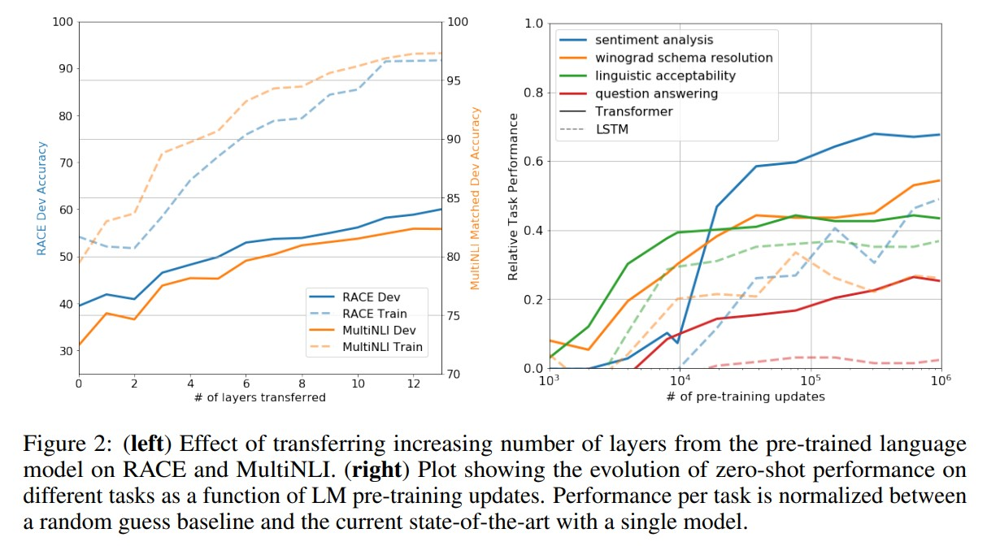

<!-- vscode-markdown-toc -->
* [0 摘要](#)
* [1 简介](#-1)
* [2 相关工作](#-1)
* [3 Framework](#Framework)
	* [3.1 Unsupervised pre-training](#Unsupervisedpre-training)
	* [3.2 Supervised fine-tuning](#Supervisedfine-tuning)
	* [3.3 特定于任务的输入转换(Task-specific input transformations)](#Task-specificinputtransformations)
* [4 Experiments](#Experiments)
	* [4.1 setup](#setup)
	* [4.2 Supervised fine-tuning](#Supervisedfine-tuning-1)
* [5 分析](#-1)
* [6 结论](#-1)

<!-- vscode-markdown-toc-config
	numbering=true
	autoSave=true
	/vscode-markdown-toc-config -->
<!-- /vscode-markdown-toc -->

# 通过生成式预训练提高语言理解能力

##  0 摘要
自然语言理解包括各种各样的任务，如文本蕴涵、问题解答、语义相似性评估和文档分类。虽然大量的未标记的文本语料库非常丰富，但是用于学习这些特定任务的标记数据却非常稀缺，这就使得接受过判别训练的模型难以充分执行。我们证明，通过在不同的未标记文本语料库上生成语言模型的预训练，然后对每个特定任务进行区分性微调，可以实现这些任务的巨大收益。与以前的方法不同，我们在微调期间使用任务感知的输入转换，以实现有效的传输，同时对模型体系结构进行最小的更改。我们在自然语言理解的各种基准上证明了我们的方法的有效性。我们的一般任务不可知论模型优于使用专门为每项任务设计的体系结构的有区别训练的模型，在所研究的12项任务中，有9项任务显著提高了技术水平。例如，我们在常识推理（故事完形填空测试）上取得了8.9%的绝对改善，在回答问题（种族）上取得了5.7%的绝对改善，在文本继承（munli）上取得了1.5%的绝对改善。

##  1 简介
有效地从原始文本中学习的能力对于减轻自然语言处理（NLP）中对监督学习的依赖至关重要。大多数深度学习方法需要大量手动标记的数据，这限制了它们在许多缺乏注释资源的领域中的适用性[61]。在这种情况下，那些可以利用未标记数据中的语言信息的模型提供了收集更多注释的宝贵替代方案，这既耗时又昂贵。此外，在可以考虑监督的那些情况中，以无监督的方式学习良好的表示也可以显著提高性能。迄今为止，最令人信服的证据是大量使用预先训练过的单词嵌入[10，39，42]来提高一系列NLP任务的性能[8，11，26，45]。

然而，利用来自未标记文本的单词级信息仍旧是一个挑战，这有两个主要原因。首先，不清楚哪种类型的优化目标在学习对传输有用的文本表示方面最有效。最近的研究着眼于各种目标，如语言建模[44]、机器翻译[38]和语篇连贯性[22]，每种方法在不同任务上都优于其他方法（https://gluebenchmark.com/leaderboard）。第二，对于将这些学习的表示转移到目标任务上的最有效方法，还没有达成共识。现有技术包括对模型体系结构进行特定于任务的更改[43，44]，使用复杂的学习方案[21]并添加辅助学习目标[50]。这些不确定性使得开发有效的语言处理半监督学习方法变得困难。

本文探索了一种结合无监督预训练和监督微调的半监督语言理解任务方法。我们的目标是学习一种通用的表示，这种表示经过很小的微调后可以适应各种任务。我们假设通过手动注释的训练示例（目标任务）访问大量未标记文本和多个数据集。我们的设置不要求这些目标任务与未标记的文集在同一个域中。我们采用两阶段训练程序。首先，我们使用未标记数据上的语言模型对象去学习神经网络模型的初始参数。随后，我们使用相应的监督目标对这些参数进行调整，1以适应目标任务。

对于我们的模型结构，我们 使用了Transformer[62]，它在机器翻译[62]、文档生成[34]和句法分析[29]等各种任务中都表现得很好。这个模型选项为我们提供了一个更加结构化的记忆方式来处理文本中的长期依赖关系，而不是像循环网络这样的替代方案，从而在不同的任务之间产生强大的迁移性能。在迁移过程中，我们 使用从traversal-style approaches方法[52]派生的特定于任务的输入自适应方法，该方法将结构化文本输入处理为单个连续序列。正如我们在实验中所证明的那样，这些调整使我们能够有效地进行微调，而对预先训练的模型的体系结构进行最小的更改。

我们评估了四种类型的语言理解任务——自然语言推理、问答、语义相似性和文本分类。我们的通用未知任务模型优于经过歧视性训练的模型，这些模型采用专门为每项任务设计的体系结构，在所研究的12项任务中有9项大大改进了最新技术。例如，我们在常识推理（故事完形测试）上取得了8.9%的绝对改善[40]，在回答问题（种族）上取得了5.7%的绝对改善[30]，在文本继承（multinli）上取得了1.5%的绝对改善[66]，在最近引入的粘合多任务基准上取得了5.5%的绝对改善[64]。我们还分析了预训练模型在四种不同环境下的零触发行为，并证明它为下游任务获得了有用的语义信息。

##  2 相关工作
NLP的半监督学习。 我们的工作大体上属于自然语言半监督学习范畴。这种模式已经引起了人们的极大兴趣，已经应用于序列标记[24，33，57]或文本分类[41，70]等任务。最早的方法使用未标记的数据来计算单词级别或短语级别的统计信息，然后将这些统计信息用作受监督模型中的特征[33]。在过去的几年里，研究人员已经证明了使用单词嵌入[11，39，42]的好处，这些单词嵌入在未标记的语料库上进行训练，以提高在各种任务中的表现[8，11，26，45]。然而，这些方法主要是传递单词级别的信息，而我们的目标是捕获更高级别的语义。

最近的方法研究了从未标记的数据中学习和使用多个词级语义。短语级或句子级嵌入（可以使用未标记的语料库进行训练）已被用于将文本编码为适合各种目标任务的向量表示[28、32、1、36、22、12、56、31]。

**无监督的预训练**
无监督预训练是半监督学习的一种特殊情况，其 目标是找到一个好的初始点，而不是修改监督学习目标。早期的研究探索了该技术在图像分类[20，49，63]和回归任务[3]中的应用。随后的研究[15]表明，预训练作为一种正则化方案，能够在深层神经网络中实现更好的泛化。在最近的工作中，该方法被用来帮助训练深度神经网络的各种任务，如图像分类[69]、语音识别[68]、实体消歧[17]和机器翻译[48]。

最接近我们工作的是使用语言建模目标（language modeling objective）对神经网络进行预训练，然后在有监督的情况下对其进行微调。Dai[13]和Howard和Ruder[21]遵循此方法改进文本分类。然而，尽管预训练阶段有助于获取一些语言信息，但他们使用的LSTM模型限制了他们的预测能力，使其范围较短。相比之下，我们选择的transformer网络允许我们捕获更大范围的语言结构，如我们的实验所示。此外，我们还展示了我们的模型在更广泛的任务上的有效性，包括自然语言推理、释义检测和故事完成。其他方法[43、44、38]使用预先训练的语言或机器翻译模型中的隐藏表示（hidden representations）作为辅助功能，同时针对目标任务训练受监督模型。这涉及到每个单独目标任务的大量新参数，而在传输（transfer）过程中，我们需要对模型体系结构进行最小的更改。

**辅助训练目标**
增加辅助的无监督训练目标是半监督学习的一种替代形式。collobert和weston的早期工作[10]使用了各种各样的辅助NLP任务，如POS标记、分块、命名实体识别和语言建模，以改进语义角色标记。最近，REI[50]在目标任务目标中添加了一个辅助语言建模目标，并演示了序列标记任务的性能的提升。我们的实验也使用了一个辅助目标，但正如我们所展示的，无监督的预训练已经学习了与目标任务相关的几个语言方面。 增加辅助的无监督训练目标是半监督学习的一种替代形式。collobert和weston的早期工作[10]使用了各种各样的辅助NLP任务，如POS标记、分块、命名实体识别和语言建模，以改进语义角色标记。最近，REI[50]在目标任务目标中添加了一个辅助语言建模目标，并演示了序列标记任务的性能的提升。我们的实验也使用了一个辅助目标，但正如我们所展示的，无监督的预训练已经学习了与目标任务相关的几个语言方面.

##  3 Framework
我们的训练过程分为两个阶段。第一阶段是在大语料库上学习大容量语言模型。接下来是一个微调阶段，在这个阶段中，我们将使模型适应带有标签数据的特定任务。

###  3.1 Unsupervised pre-training
给定无监督tokens集合 $\mathcal{U}=\left\lbrace u_{1}, \ldots, u_{n}\right\rbrace$ , 我们使用标准语言模型目标（language modeling objective）来最大化以下似然函数： 
$$L_{1}(\mathcal{U})=\sum_{i} \log P\left(u_{i} \mid u_{i-k}, \ldots, u_{i-1} ; \Theta\right) &nbsp;&nbsp;&nbsp;&nbsp; \ldots\ldots(1)$$
其中，k 是文本窗尺寸，条件概率 P 采用参数为 $\Theta$ 的神经网络建模。这些参数用SGD训练[15].
在我们的实验中，我们使用多层 Transformer decoder[34]作为语言模型，这是Transformer的变体[62]。该模型在输入上下文tokens上应用一个多头自注意操作(multi-headed self-attention operation)，随后是位置前馈层(position-wise feedforward layers)，以在目标tokens上生成一个输出分布:
$$\Theta h_{0}=U W_{e}+W_{p}$$
$$h_{l}=transformer\_block\left(h_{l-1}\right) \forall i \in[1{} , n] \ldots\ldots(2)$$
$$P(u)=softmax\left(h_{n} W_{e}^{T}\right)$$

其中 $\mathcal{U}=\left\lbrace u_{-k}, \ldots, u_{-1}\right\rbrace$ 是tokens的文本向量，n是网络层数， $W_{e}$ 是token嵌入矩阵(embedding matrix), $W_{p}$ 是位置嵌入矩阵。

###  3.2 Supervised fine-tuning
在用等式1中的目标对模型进行训练后，我们针对被监督目标任务调整这些参数。我们假设一个带标签的数据集C，其中每个实例由一系列输入标记 $x^{1}, \ldots, x^{m}$ 组成，这里面还包含一个标签y。这些输入通过我们预先训练的模型来获得最终transformer block的激活 $h_{l}^{m}$ , 然后将其输入一个附加的线性输出层, 参数 $W_{y}$ 预测y:
$$P\left(y \mid x^{1}, \ldots x^{m}\right)=softmax\left(h_{l}^{m} W_{y}\right)\ldots\ldots(3)$$

它使我们去最大化如下函数：
$$L_{2}=\sum_{x, y} \log P\left(y \mid x^{1}, \ldots, x^{m}\right)\ldots\ldots(4)$$
我们还发现，将语言建模作为微调的辅助目标有助于学习（a）改进监督模型的泛化，以及（b）加速收敛。这与先前的工作是一致的[50，43]，他们也观察到了这种辅助目标的改进性能。具体来说，我们优化了以下目标（权重为λ）：
$$L_{3}(\mathcal{C})=L_{2}(\mathcal{C})+\lambda * L_{1}(\mathcal{C})\ldots\ldots(5)$$
总的来说，我们在微调过程中需要的唯一额外参数是 $W_{y}$ ,以及分隔符标记的嵌入（embeddings）（在第3.3节中描述）.

 图1：（左）本文中使用的Transformer架构和训练目标。（右）用于在不同任务上进行微调的输入转换。我们将所有结构化输入转换为令牌序列，以供我们预训练模型处理，然后接上一个线性+softmax层。

###  3.3 特定于任务的输入转换(Task-specific input transformations)
对于一些任务，比如文本分类，我们可以直接按照上面的描述对模型进行微调。某些其他任务，如问答或文本继承，具有结构化的输入，如有序的句子对，或文档、问题和答案的三元组（triplets）。由于我们的预训练模型是针对连续的文本序列进行训练的，因此我们需要进行一些修改，以便将其应用于这些任务。先前的工作提出了学习任务特定的体系结构，这些体系结构是基于所传输的表示[44]。这种方法重新引入了大量特定于任务的定制，并且不将转移学习用于这些额外的体系结构组件。相反，我们使用遍历式方法（traversal-style approach）[52]，在这里我们将结构化输入转换成一个有序的序列，我们的预先训练的模型可以处理它。这些输入转换允许我们避免跨任务对体系结构进行广泛的更改。我们在下面提供这些输入转换的简要描述，图1提供了一个可视化的例子。所有转换都包括添加随机初始化的开始和结束标记(\<s\>, \<e\>)。

**文字蕴涵**
我们将前提P和假设H标记序列连接起来，中间有一个分隔符标记($)。

**相似度**
对于相似度任务来说，两个被比较的句子没有固有的顺序。为了反映这一点，我们修改输入序列以包含两个可能的句子顺序（中间有一个分隔符），并分别处理每个序列，以生成两个序列表示
 $h^{m}_{l}$ ,在送入线性输出层之前按元素宽度（element-wise）相加。

**问答和常识性推理**
我们得到一个上下文文档Z、一个问题Q和一组可能的答案 $\left\lbrace a_{k} \right\rbrace$ ,我们将文档上下文和问题与每个可能的答案连接起来，在两者之间添加一个分隔符标记来获取 [z; q; $; a_{k}] 这些序列中的每一个都是用我们的模型独立处理的，然后通过一个SoftMax层进行规范化，以在可能的答案上产生一个输出分布。

##  4 Experiments

###  4.1 setup
无监督预训练 我们使用BooksCorpus数据集[71]来训练语言模型。它包含超过7000本独特的未出版的书籍，从各种类型，包括冒险，幻想和浪漫。至关重要的是，它包含了长时间的连续文本，这使得生成模型能够学习长期信息的条件（condition）。另一种数据集1B Word Benchmark，由类似的方法ELMo[44]使用，大小大致相同，但在句子级别上被打乱-破坏远程（long-range）结构。我们的语言模型在这个语料库上实现了一个非常低的token级别的复杂度18.4。 

**模型具体说明(specifications)** 我们的模型在很大程度上遵循了最初的transformer工作原理[62]。我们训练了一个12层解码器专用transformer与masked self-attention heads（768维状态和12个attention heads）。对于位置前馈网络，我们使用了3072维内部状态。我们使用了最大学习率为2.5e-4的Adam优化方案[27]。在最初的2000次更新中，学习率从零线性增加，并使用cosine schedule将其退火（annealed）为0。我们在512个tokens上随机取64个连续的序列，并用这些序列的minibatch对模型进行训练，迭代100次。由于在整个模型中广泛使用了layerNorm[2]，因此只需简单地用N(0, 0.02)分布去初始化即可。我们使用了一个字节位编码（BPE）词汇表，其中40000个合并(merges)[53]和剩余(residual)、嵌入(embedding)和注意力退出(attention dropouts),正则化率为0.1。我们还采用了[37]中提出的修正版本的L2正则化，所有非偏差或增益权重的 w = 0.01。对于激活函数，我们使用高斯误差线性单元（GELU）[18]。我们使用学习的位置嵌入(learned position embeddings)代替了原始工作中提出的正弦版本。我们使用ftfy库（https://ftfy.readthedocs.io/en/latest）清理BooksCorpus中的原始文本，标准化一些标点和空白，并使用spacy标记器（https://spacy.io/）。

**微调详细信息** 除非指定，否则我们将重新使用无监督预训练中的超参数设置。我们以0.1的速率向分类器添加dropout。对于大多数任务，我们使用6.25e-5的学习率和32的批量尺寸。我们的模型调整得很快，3个训练阶段对于大多数情况来说都是足够的。我们使用线性学习率衰减schedule，预热超过0.2%的训练。λ设为0.5。

###  4.2 Supervised fine-tuning
我们对各种监督任务进行了实验，包括自然语言推理、问答、语义相似性和文本分类。其中一些任务是作为最近发布的Glue多任务基准测试[64]的一部分提供的，我们使用它。图1提供了所有任务和数据集的概述。
**自然语言推理**
自然语言推理（NLI）的任务，也被称为recognizing textual entailment，包括阅读一对句子，从推理、矛盾或中性中判断它们之间的关系。尽管最近人们对这一问题很感兴趣[58、35、44]，但由于存在各种各样的现象，如词法蕴涵、共指、词法和句法歧义，这一任务仍然具有挑战性。我们评估了五个不同来源的数据集，包括图像字幕（SNLI）、转录的演讲、流行小说和政府报告（MNLI）、维基百科文章（QNLI）、科学考试（SciTail）或新闻文章（RTE）。
表2详细介绍了我们的模型和以前最先进方法的不同NLI任务的各种结果。我们的方法明显优于五个数据集中的四个数据集的基线，在MNLI、SciTail、QNLI和SNLI上的绝对改善率分别为1.5%、5%、5.8%和0.6%。这表明我们的模型能够更好地解释多个句子，并处理语言歧义方面的问题。在RTE上，我们评估的一个较小的数据集（2490个例子），我们获得了56%的精确度，低于多任务BiLSTM模型报告的61.7%。考虑到我们的方法在较大的NLI数据集上的强大性能，我们的模型可能也会受益于多任务训练，但我们目前尚未对此进行探讨.

**问答和常识性推理**
另一个需要单句和多句推理的任务是回答问题。我们使用了最新发布的RACE数据集[30]，它由英语段落和高中考试中的相关问题组成。这个语料库已经被证明包含更多的推理型问题，其他数据集如 CNN[19]或Squad[47]，为我们的模型提供了完美的评估，该模型经过训练能够处理远程（long-range）上下文。此外，我们还对故事完形填空测试（Story Cloze Test）[40]进行了评估，该测试包括从两个选项中选择多句故事的正确结尾。在这些任务中，我们的模型再次超过了以前的最佳结果——故事完形填空率高达8.9%，总体比赛成绩高达5.7%。这表明我们的模型能够有效地处理远程上下文。

**相似度**
语义相似度（或释义检测）任务涉及预测两个句子在语义上是否等价。挑战在于认识概念的改写、理解否定和处理句法歧义。我们为这项任务使用三个数据集——微软释义语料库（MRPC）[14]（从新闻来源收集）、Quora问题对（QQP）数据集[9]和语义文本相似性基准（STS-B）[6]。我们获得了三个语义相似任务中的两个（表4）的最新结果，在STS-B上获得了1分的绝对收益。QQP上的性能增量是显著的，与单个任务 biLSTM + ELMo + Attn相比，改进了4.2%。

分类最后，我们还对两个不同的文本分类任务进行了评估。**语言可接受性语料库（CoLa）[65]**包含对句子是否符合语法的专家判断，并测试训练模型的固有语言偏见。另一方面，斯坦福情感树库（SST-2）[54]是一个标准的二进制分类任务。我们的模型在CoLa上得到了45.4分，这比之前的35.0分的最好成绩有了一个特别大的飞跃，显示了我们模型学习到的先天语言偏见。该模型在SST-2上也达到了91.3%的精度，这与最先进的结果是有竞争力的。在胶水基准测试中，我们的总分也达到了72.8分，明显好于之前的68.9分。

总的来说，我们的方法在我们评估的12个数据集中有9个数据集获得了最新的最先进的结果，在许多情况下都很出色。我们的结果还表明，我们的方法在不同大小的数据集上都能很好地工作，从较小的数据集（如STS-B，≈5.7K训练示例）到最大的数据集（SNLI，≈550K训练示例）。

##  5 分析
**转移层数的影响(Impact of number of layers transferred)** 我们观察了从无监督预训练到监督目标任务的不同层次数的transfer的影响。图2（左图）说明了我们的方法在MultiNLI和RACE上的性能，它是传输层数量的函数。我们观察到传输嵌入提高性能的标准结果，并且每个transformer层为multinli上的完全传输提供了高达9%的提升。这表明预训练模型中的每个层都包含解决目标任务的有用功能。

**Zero-shot Behaviors** 我们想更好地理解为什么语言模型的transform的预训练是有效的。一个假设是，底层生成模型学习执行我们评估的许多任务，以提高其语言建模能力，并且transformer的更结构化的注意力记忆与LSTM相比有助于传递。我们设计了一系列启发式解决方案，使用底层的生成模型来执行任务，而无需进行监督的微调。我们将这些启发式解决方案在图2（右图）中的生成性预训练过程中的效果可视化。我们观察到这些启发式方法的性能是稳定的，并且在训练中稳步增加，这表明生成性预训练支持学习各种与任务相关的功能。我们还观察到LSTM在其零触发性能上表现出更高的方差，这表明Transformer架构的归纳偏差（ inductive bias）有助于transfer。

对于CoLA(语言可接受性），用生成模型分配和预测的平均token日志概率对例子进行评分。对于SST-2（情感分析），我们在每一个例子中都非常附加了标记，并且将语言模型的输出分布限制为只有正和负两个词，并猜测它分配给更高概率的标记作为预测。对于race（question answering），我们选择生成模型在文档和问题条件下分配最高平均token日志概率的答案。对于DPRD[46]（winograd模式），我们用两个可能的引用来替换定代词，并预测生成模型在替换后将较高的平均token日志概率分配给序列的其余部分的分辨率。

Ablation studies 我们进行了三项不同的消融研究（表5）。首先，我们在微调过程中检查了没有辅助LM目标的方法的性能。我们观察到辅助目标对nli任务和QQP有帮助。总的来说，趋势表明较大的数据集受益于辅助目标，而较小的数据集则没有。其次，通过与单层2048单元LSTM在同一框架下的对比，分析了Transformer的作用。当使用LSTM而不是Transformer时，我们观察到平均得分下降5.6。LSTM仅在一个数据集（MRPC）上优于Transformer。最后，我们还与直接在监督目标任务训练而没有预先训练的Transformer架构进行了比较。我们观察到，缺乏预训练会影响所有任务的表现，与我们的完整模型相比，降低了14.8%。

##  6 结论
我们引入了一个框架，通过生成性预训练和区分性微调，以单一未知任务模型实现强大的自然语言理解。通过对不同语料库进行长距离连续文本的预先训练，我们的模型获得了重要的世界知识和处理长距离依赖关系的能力，然后成功地将这些知识转移到解决特定性任务，如问答、语义相似性评估、限定确定和文本分类。改进了我们所研究的12个数据集中的9个的最新技术。利用无监督（预）训练提高识别任务的性能一直是机器学习研究的一个重要目标。我们的工作表明，实现显著的性能提升确实是可能的，并且提供了关于什么模型（转换器）和数据集（具有长期依赖性的文本）最适合这种方法的提示。我们希望这将有助于对自然语言理解和其他领域的无监督学习进行新的研究，进一步提高我们对无监督学习如何以及何时起作用的理解。

