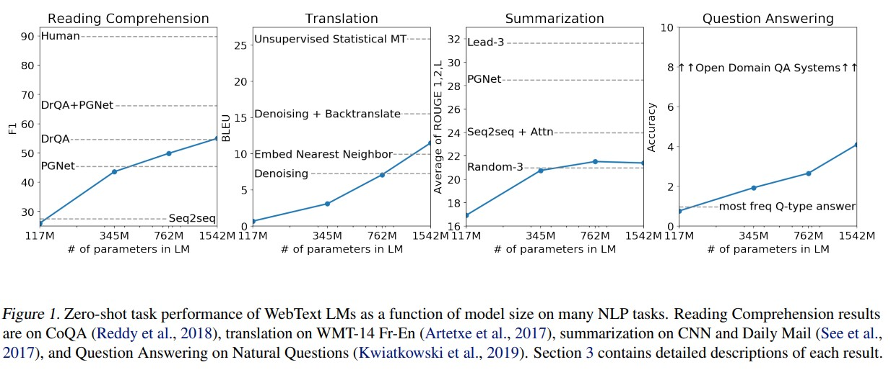
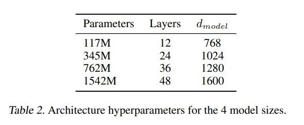
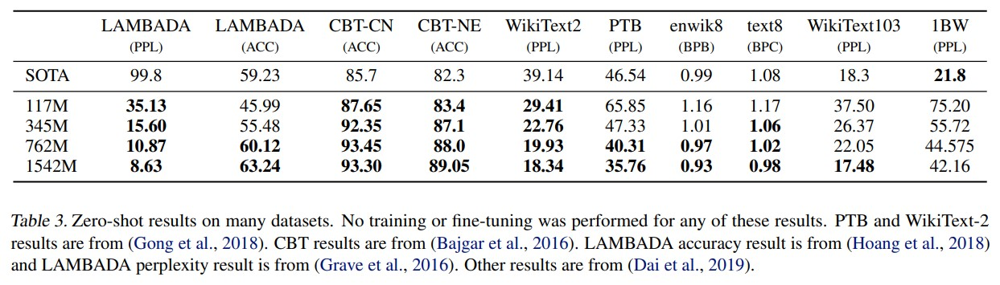
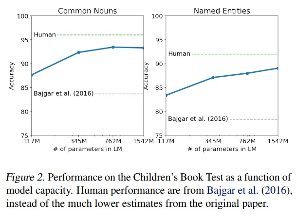
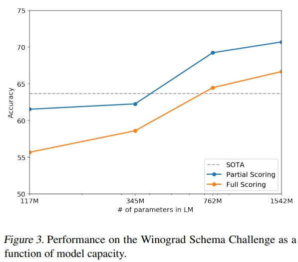
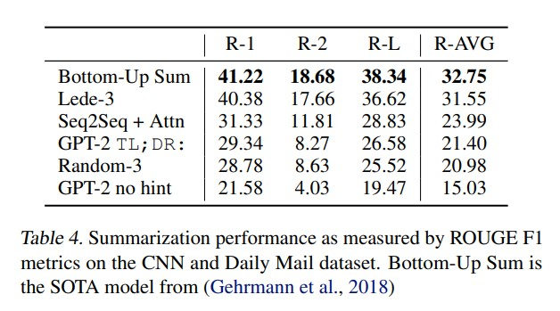
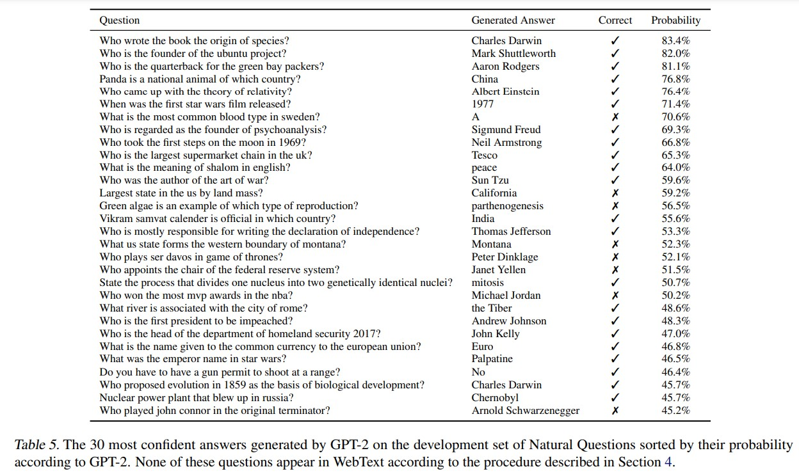
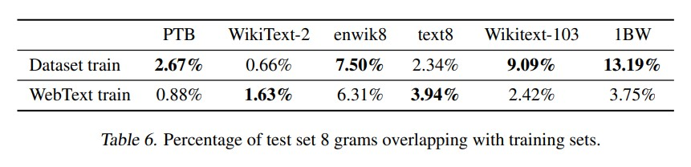
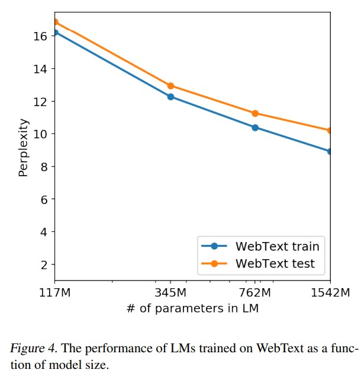

# 语言模型是无监督多任务学习器（Language Models are Unsupervised Multitask Learners）

# 摘要
在自然语言处理任务中，例如问答、机器翻译、阅读理解和摘要，通常采用监督学习来处理特定任务的数据集。我们证明，当训练在一个称为WebText的数百万个网页的新数据集上时，语言模型开始学习这些任务而不需要任何明确的监督。当根据文档和问题条件，模型生成的答案达到CoQA数据集的F1 score 达到55时，它超过了4个基线系统中的3个，而不需要使用127,000多个训练样例。模型的容量对zero-shot任务迁移的成功至关重要，并且提高容量会以对数线性方式提高各种任务的性能。我们最大的模型GPT-2是一个1.5B参数变换器，在zero-shot设置下，在8个测试的语言建模数据集中的7个达到了最先进的结果，但仍然适合WebText。模型的样本反映了这些改进，包含连贯的段落文本。这些发现表明，建立语言处理系统的一条有希望的道路，它们从自然现象中学习如何执行任务。 

# 1 介绍
人工智能系统现在通过使用大型数据集、高容量模型和监督学习（Krizhevsky等，2012）（Sutskever等，2014）（Amodei等，2016），已经能够在期望的任务中表现出色。然而，这些系统很脆弱，对于数据分布（Recht等，2018）和任务规范（Kirkpatrick等，2017）的微小变化都很敏感。目前的系统更多的是狭窄的专家，而不是能干的通才。我们希望移向更通用的系统，它们能够执行许多任务，最终不需要手动创建和标记每个任务的训练数据集。 
现在建立机器学习系统的主流方法是收集一组训练样例，这些样例演示了所需任务的正确行为，训练系统模仿这些行为，然后在独立同分布(identically distributed)的留出样例(held-out)上测试其性能。这对于狭窄专家(narrow experts)的进步非常有用。然而，字幕模型的行为常常不稳定（Lake等，2017），阅读理解系统（Jia和Liang，2017），以及图像分类器（Alcorn等，2018）在多样性和可能输入的变化上的表现不一致，凸显了这种方法的一些不足。 
我们怀疑，在单一领域数据集上进行单一任务训练的普遍性是当前系统泛化能力不足的主要原因。当前架构要想朝着具有更稳健系统的方向发展很可能需要在广泛的领域和任务上进行训练和性能评估。最近，已经提出了几个基准测试，例如GLUE（Wang等，2018）和decaNLP（McCann等，2018），已开始研究这一问题。 
多任务学习（Caruana，1997）是提高性能的一种有前景的框架。然而，在自然语言处理领域，多任务训练仍处于初级阶段。最近的研究报告了温和的性能改进（Yogatama等，2019），到目前为止最有雄心壮志的两个尝试分别在总共10对和17对（数据集，目标）上进行了训练（McCann等，2018）（Bowman等，2018）。从元学习的角度来看，每个（数据集，目标）对是从数据集和目标的分布中采样得到的单个训练样本。当前的机器学习系统需要数百到数千个样本才能产生良好泛化性能的函数。这表明，多任务训练可能需要同样多的有效训练对才能实现其在当前方法下的潜力。使用当前的技术手段来继续扩大数据集的创建和目标的设计以达到可能需要的程度将非常困难。这促使我们探索执行多任务学习的其他设置。 
目前在语言任务(LM)上表现最佳的系统使用预训练(pre-train)和监督微调(supervised fine-tune)相结合。这种方法有着悠久的历史，并且趋向于更灵活的迁移(transfer)形式。首先，词向量被学习并用于任务特定架构的输入（Mikolov等，2013）（Collobert等，2011），然后，递归网络的上下文表示被传递（Dai和Le，2015）（Peters等，2018）。最近的研究表明，任务特定架构不再必要，而传递多个自注意力块(self-attention block)就足够了（Radford等，2018）（Devlin等，2018）。 
这些方法仍然需要有监督训练才能执行任务。当只有很少或没有有监督数据可用时，另一条研究线路展示了语言模型在执行特定任务方面的潜力，例如常识推理（Schwartz等，2017）和情感分析（Radford等，2017）。 
在本论文中，我们将这两个研究方向联系起来，并延续了更通用的迁移(transfer)方法的趋势。我们展示了语言模型可以在零样本(zero-shot)设置下执行下游(down-stream)任务——无需进行任何参数或架构修改。我们通过突出语言模型在零样本(zero-shot)设置下执行各种任务的能力，证明了这种方法的潜力。根据任务的不同，我们取得了有希望、有竞争力且达到了最先进水平的结果。 
 
# 2 方法
我们方法的核心是语言建模。语言建模通常被构建为从一组示例 $(x_{1}, x_{2}, ..., x_{n})$  中无监督地估计分布，其中每个示例由可变长度的符号序列 $(s_{1}, s_{2}, ..., s_{n})$ 组成。由于语言具有天然的顺序性，将符号的联合概率因子分解为条件概率的乘积是常见的做法（Jelinek和Mercer，1980）（Bengio等，2003）： 
$$p(x)=\prod_{i=1}^{n} p\left(s_{n} \mid s_{1}, \ldots, s_{n-1}\right)\ldots\ldots(1)$$

这种方法允许从概率分布p(x)以及形如 $p(s_{n−k}, ..., s_{n} | s_{1}, ..., s_{n−k−1})$ 的任何条件概率中进行可行的采样和估计。近年来，计算这些条件概率的模型的表达能力有了显著提高，例如自注意力架构，如Transformer（Vaswani等，2017）。 
以一个概率框架来表达学习执行单个任务可以被解释为估计一个条件分布p(output|input)。由于一个通用系统应该能够执行多种不同的任务，即使是对于相同的输入，它不仅应该根据输入条件，还应该根据要执行的任务进行条件建模，即p(output|input, task)。这在多任务学习和元学习的设置中已经得到了各种形式的规范化。任务条件往往在架构层面上实现，比如在（Kaiser等，2017）中的任务特定编码器和解码器中，或者在算法层面上实现，比如MAML（Finn等，2017）的内部和外部循环优化框架。但正如McCann等（2018）所示，语言提供了一种灵活的方式来将指定的任务、输入和输出，表示为一系列符号。例如，一个翻译训练示例可以写成序列(translate to french, english text, french text)。同样，一个阅读理解训练示例可以写成(answer the question, document, question, answer)。McCann等（2018）证明了可以训练一个单一模型，即MQAN，以推断和执行具有这种格式的示例上的多种不同任务。 
原则上，语言建模也能够学习McCann等人（2018）的任务，而无需明确监督哪些符号是要预测的输出。由于有监督的目标与无监督的目标相同，只是在序列的子集上进行评估，因此无监督目标的全局最小值也是有监督目标的全局最小值。在这种简化的设置中，与密度估计作为一种原则性的训练目标(training objective)相关的问题（如Sutskever等人，2015中讨论的）被暂时回避了。相反，问题变成了我们是否能够在实践中将无监督目标优化至收敛。初步实验证实，足够大的语言模型能够在这种玩具式(toy)的设置中进行多任务学习，但学习速度比显式监督方法要慢得多。 
虽然从上述明确设定的状态到“自然语言混乱环境”的转变是一个重要的步骤，但Westen（2016）在对话的背景下提出，需要开发能够直接从自然语言中学习的系统，并展示了一个概念验证：通过对教师输出(teacher output)进行前向预测，学习问答任务而无需奖励信号。虽然对话是一种有吸引力的方法，但我们担心它过于限制性。互联网包含大量的信息，可以被 passively（被动地）获取，无需进行交互式通信。我们的猜测是，具备足够容量的语言模型将开始学会推断和执行在自然语言序列中展示的任务，以更好地预测它们，而不管它们的获取方式如何。如果语言模型能够做到这一点，实际上就是在执行无监督的多任务学习。我们通过在各种任务上分析语言模型在zero-shot（零样本）设置下的性能来测试是否如此。

## 2.1 训练数据集(Training Dataset)
大部分以前的工作都是在单一领域的文本上训练语言模型，比如新闻文章（Jozefowicz等，2016）、维基百科（Merity等，2016）或小说（Kiros等，2015）。我们的方法鼓励构建尽可能大而多样的数据集，以收集各种领域和情境中的任务的自然语言演示。 
一个有希望的多样化且几乎无限的文本来源是像Common Crawl这样的网络爬取数据。尽管这些存档比当前的语言模型数据集大了几个数量级，但它们存在着显著的数据质量问题。Trinh和Le（2018）在他们对常识推理的研究中使用了Common Crawl，但指出了大量“内容大部分难以理解”的文档。在我们对Common Crawl进行初步实验时，我们也观察到了类似的数据问题。Trinh和Le（2018）在他们的最佳结果中使用了Common Crawl的一个小子样本，该子样本仅包含与他们目标数据集（Winograd Schema Challenge）最相似的文档。虽然这是一种在特定任务上提高性能的务实方法，但我们希望避免事先对要执行的任务做出假设。 

相反，我们创建了一个强调文档质量的新的网络爬取数据。为了做到这一点，我们只爬取了经过人工筛选/过滤的网页。手动筛选完整的网络爬取数据将是异常昂贵的，因此作为起点，我们从社交媒体平台Reddit上爬取了所有至少获得3个声望（karma）的外部链接。这可以被视为其他用户是否认为链接有趣、有教育意义或仅仅是有趣的启发式指标。 
得到的数据集名为WebText，它包含了这4500万个链接的文本子集。为了从HTML响应中提取文本，我们使用了Dragnet（Peters和Lecocq，2013）和Newspaper1内容提取器的组合。本文中呈现的所有结果都使用了WebText的初步版本，该版本不包括2017年12月之后创建的链接，并且经过去重和一些基于启发式的清理，包含了略多于800万个文档，总计40 GB的文本。我们从WebText中删除了所有维基百科的文档，因为维基百科是其他数据集的常见数据源，并且由于训练数据与测试评估任务有重叠，可能会使分析变得复杂。 

## 2.2 输入表示(Input Representation)
一个通用的语言模型（LM）应该能够计算（并生成）任意字符串的概率。当前的大规模LM包括预处理步骤，如小写处理、分词和未知词标记，这些步骤限制了可建模字符串的范围。虽然将Unicode字符串处理为UTF-8字节序列可以优雅地满足这一要求，例如Gillick等人（2015）的工作，但是当前的字节级LM在大规模数据集（如One Billion Word Benchmark，Al-Rfou等人，2018）上无法与词级LM相竞争。我们在尝试在WebText上训练标准字节级LM时也观察到了类似的性能差距。 

**注释：**
*字节级LM（Byte-level LM）：字节级LM将文本视为字节序列，其中每个字符都被编码为一个字节。这种方法将文本划分为最小的单元，即字节，不考虑其语义或词汇含义。字节级LM在处理多语言和特殊字符时具有优势，因为它们可以轻松处理各种Unicode字符，无论其复杂性如何。然而，由于字节级LM忽略了词汇信息，因此它们可能无法很好地捕捉到词语之间的语义关系。*
*词级LM（Word-level LM）：词级LM将文本视为词的序列，其中每个词被视为一个单独的单位。它基于词汇信息，可以更好地捕捉到语义关系和上下文含义。词级LM通常需要进行预处理步骤，如分词和词汇表构建，以将文本划分为单词。这种方法在许多自然语言处理任务中表现良好，例如机器翻译、文本生成和文本分类。*

字节对编码（Byte Pair Encoding，BPE）（Sennrich等人，2015）是字符级和词级语言建模之间的一种实用的中间方法，它在常见符号序列上有效地插值了词级输入，而在不常见的符号序列上使用字符级输入。尽管它的名字中包含"byte"（字节），但参考的BPE实现通常操作的是Unicode码点，而不是字节序列。为了建模所有的Unicode字符串，这些实现需要包括完整的Unicode符号空间。这将导致一个庞大的基础词汇表，包含136,690个符号，还没有添加任何多符号标记。与通常使用的32,000到64,000个标记词汇表相比，这个规模过大。相比之下，字节级版本的BPE只需要一个大小为256的基础词汇表。然而，直接将BPE应用于字节序列会导致子优化的合并，因为BPE使用基于频率的贪婪启发式方法来构建标记词汇表。我们观察到BPE包含了许多常见单词的多个版本，比如dog，因为它们有多种变体，如dog. dog! dog?。这导致了有限词汇槽和模型容量的次优分配。为了避免这种情况，我们阻止BPE在任何字节序列中跨字符类别合并。我们对空格做了一个例外，这显著提高了压缩效率，同时只对多个词汇标记中的单词进行了最小的碎片化。 

**注释**
*BPE算法的核心思想是通过反复合并最频繁出现的符号对来构建更大的符号。*
*贪婪合并的策略，它只基于当前频率进行决策，并没有考虑到未来可能的合并效益*
*子优化的合并（suboptimal merging）是指在合并符号对时，采用了基于频率的贪婪启发式方法，可能导致生成的合并结果并非最优的情况。*
*次优分配（suboptimal allocation）是指在标记词汇表构建过程中，由于合并操作的顺序或策略导致了对有限词汇槽和模型容量的次优分配的情况。*
*词汇槽（vocabulary slot）是指在自然语言处理中，用于存储和表示词汇表的一种数据结构或内存空间*

这种输入表示方法使我们能够结合基于词级语言模型的实证优势和基于字节级方法的通用性。由于我们的方法可以为任何Unicode字符串分配概率，这使得我们可以在任何数据集上评估我们的语言模型，而无论其预处理、分词或词汇大小如何。 

## 2.3 模型
我们在我们的语言模型中使用了基于Transformer（Vaswani等，2017）的架构。该模型在很大程度上遵循了OpenAI GPT模型（Radford等，2018）的细节，但进行了一些修改。层归一化（Ba等，2016）被移动到每个子块的输入处，类似于预激活残差网络（He等，2016），并在最终的自注意力块之后添加了额外的层归一化。使用了一种修改的初始化方法，考虑了模型深度中残差路径的累积。在初始化时，我们通过一个因子 $1 / \sqrt{N}$ (其中N是残差层的数量）来缩放残差层的权重。词汇表扩展到50,257个标记。我们还将上下文大小从512个标记增加到1024个标记，并使用更大的批量大小为512。

# 3 试验(Experiments)

我们训练并对比了四个大小近似于对数均匀分布的语言模型。这些模型的架构概述如表2所示。最小的模型与原始的GPT模型相等，第二小的模型则相当于BERT（Devlin等，2018）中最大的模型。我们最大的模型，称为GPT-2，比GPT模型的参数数量多一个数量级。每个模型的学习率都经过手动调整，以在WebText的5%保留样本上获得最佳困惑度。所有模型在WebText上仍然欠拟合，并且随着训练时间的增加，保留困惑度仍在改善中。 

## 3.1 语言模型（language model）

作为实现zero-shot任务迁移(transfer)的初始步骤，我们对WebText语言模型在零样本(zero-shot)领域迁移上的表现很感兴趣，尤其是在它们最初用于训练的主要任务——语言建模方面的表现。由于我们的模型在字节级别上运行，并且不需要损失性的预处理或分词，因此我们可以在任何语言模型基准测试中评估它。语言建模数据集的结果通常以每个规范预测单元（通常是字符、字节或单词）的平均负对数概率的缩放或指数化版本进行报告。我们通过计算基于WebText语言模型的数据集的对数概率，并将其除以规范单元的数量来评估相同的数量。对于许多这些数据集来说，WebText语言模型将被显著地测试在分布之外的情况下，需要预测经过强制标准化的文本、分词工件（如断开的标点和缩写）、打乱的句子，甚至是在WebText中极其罕见的字符串"<UNK>"，在400亿字节中仅出现了26次。我们使用可逆的去标记化方法在表3中报告了主要结果，该方法尽可能地去除了这些分词/预处理工件。由于这些去标记化方法是可逆的，我们仍然可以计算数据集的对数概率，它们可以被看作是一种简单的领域适应形式。我们观察到，使用这些去标记化方法后，GPT-2的困惑度(perplexity)提高了2.5到5个单位。 
WebText语言模型在跨领域和数据集之间的迁移效果良好，在zero-shot设置下在8个数据集中的7个上改进了现有技术水平。在仅有100万到200万个训练标记的小型数据集（如Penn Treebank和WikiText-2）上观察到了显著的改进。在用于测量长期依赖关系的数据集（如LAMBADA和儿童图书测试）上也观察到了显著的改进。然而，与One Billion Word Benchmark的先前工作相比，我们的模型仍然明显较差（Chelba等，2013）。这可能是由于该数据集既是最大的数据集，又具有一些破坏性最强的预处理方法，其中1BW的句子级重排移除了所有的长距离结构。 
**注释**
*WebText语言模型是指在WebText数据集上训练得到的语言模型。WebText是一个大规模的文本数据集，由OpenAI创建，用于训练语言模型。该数据集包含了从互联网上采集的多种类型的文本，包括文章、博客、论坛帖子等。*

## 3.2 Children’s Book Test 
 
儿童图书测试（Children's Book Test，CBT）（Hill等，2015）旨在检验语言模型在不同单词类别（命名实体、名词、动词和介词）上的表现。CBT(Childer's Book Test)并不将困惑度作为评估指标，而是通过一个自动构建的填空测试来报告准确率。在这个测试中，任务是预测10个可能的选项中哪个是正确的填空词。根据原始论文中介绍的语言模型方法，我们计算每个选项及其后面的句子在给定该选项的条件下在语言模型中的概率，并预测概率最高的选项作为答案。如图2所示，随着模型规模的增加，性能稳步提高，并在这个测试中逐渐缩小与人类表现之间的差距。数据重叠分析显示，CBT测试集中的一本书《森林奇书》（The Jungle Book）是在WebText数据集中的，因此我们在没有重叠的验证集上报告结果。GPT-2在常见名词上取得了93.3%的新的最优结果，并在命名实体上达到了89.1%的准确率。对CBT数据集应用了去标记化方法，以去除PTB风格的分词工件。 

## 3.3 LAMBADA Dataset
LAMBADA数据集（Paperno等，2016）测试系统在文本中建模长程依赖(long-range dependencies)关系的能力。任务是预测句子的最后一个单词，这个预测至少需要50个上下文标记(tokens of context)。GPT-2将最先进的性能从99.8（Grave等，2016）困惑度提高到8.6，并将语言模型在这个测试中的准确率从19%（Dehghani等，2018）提高到52.66%。对GPT-2的错误进行调查显示，大多数预测都是句子的有效延续，但不是句子的有效结尾。这表明语言模型没有使用额外的有用约束，即单词必须是句子的最后一个。通过添加一个停用词过滤器来近似这个约束，准确率进一步提高到63.24%，使得在这个任务上整体性能提高了4%。先前的最先进方法（Hoang等，2018）使用了不同的限制预测设置，其中模型的输出被限制为只有在上下文中出现的单词。对于GPT-2来说，这种限制是有害的，因为19%的答案不在上下文中。我们使用了一个没有预处理的数据集版本。 

## 3.4 Winograd Schema Challenge
*注释Winograd Schema Challenge（WSC）是一种语言理解任务，旨在测试计算机系统对于具有歧义的句子的理解能力。该任务得名于计算机科学家Terry Winograd。*
 
Winograd Schema挑战（Levesque等，2012）旨在通过衡量系统解决文本中歧义问题的能力来衡量其进行常识推理的能力。最近，Trinh和Le（2018）通过使用语言模型（LMs）预测歧义解决方案的概率，对这一挑战取得了显著进展。我们遵循他们的问题描述，并在图3中使用完整和部分评分技术来展示我们模型的性能。GPT-2将最先进的准确率提高了7%，达到了70.70%。由于数据集规模较小，只有273个示例，我们建议阅读Trichelair等人（2018）的研究来对这一结果进行更详细的理解。 

## 3.5 Reading Comprehension
对话问答数据集（CoQA）（Reddy等，2018）由来自7个不同领域的文档与问答者之间的自然语言对话配对而成。CoQA测试阅读理解能力，同时也测试模型回答依赖于对话历史的问题（例如“为什么？”）的能力。 
在给定文档、相关对话的历史和最后一个标记A的情况下，GPT-2的贪婪解码在开发集上达到了F1 score达到了55。这与4个基准系统中的3个的性能相匹配或超过，而这些基准系统没有使用127,000多个手动收集的问答对进行训练。目前最佳的有监督系统是基于BERT的系统（Devlin等，2018），其F1分数接近人类的89。虽然GPT-2在没有任何有监督训练的情况下取得了令人兴奋的性能，但对其答案和错误的一些检查表明，GPT-2经常使用简单的基于检索的启发式方法，例如对于一个关于“谁”的问题，回答的是文档中的一个名称。 

## 3.6 摘要(Summarization)
 
我们测试了GPT-2在CNN和Daily Mail数据集（Nallapati等，2016）上摘要生成的能力。为了引导摘要生成的行为，我们在文章之后添加了文本“TL;DR:”，并使用Top-k随机采样（Fan等，2018）生成了100个标记(token)，其中k = 2，以减少重复并鼓励比贪婪解码更抽象的摘要生成。我们使用这100个标记中的前3个句子作为摘要。尽管从定性上看，生成的结果类似于摘要，如表14(在附录)所示，但它们通常关注文章中的最新内容或混淆特定细节，例如事故中涉及的汽车数量或标志是否在帽子或衬衫上。在常见的ROUGE 1、2、L指标上，生成的摘要仅仅接近经典神经网络基线的性能，并且仅仅略微优于从文章中选择3个随机句子。当移除任务提示时，GPT-2的性能在综合指标上下降了6.4个点，这证明了在语言模型中使用自然语言来调用特定任务行为的能力。 

## 3.7 翻译(Translation)

我们测试了GPT-2是否已经开始学习如何从一种语言翻译到另一种语言。为了帮助其推断出这是所期望的任务，我们将语言模型条件设置为一个示例对的上下文，格式为"english sentence = french sentence"，然后在最后一个提示"english sentence = "之后，我们使用贪婪解码从模型中采样，并将生成的第一个句子作为翻译结果。在WMT-14英法测试集上，GPT-2的BLEU分数为5，略低于之前关于无监督词语翻译的工作中使用双语词典逐词替换的方法（Conneau等，2017b）。在WMT-14法英测试集上，GPT-2能够充分利用其非常强大的英语语言模型，表现显著更好，达到11.5的BLEU分数。这超过了（Artetxe等，2017）和（Lample等，2017）的几个无监督机器翻译基线，但仍远不及当前最好的无监督机器翻译方法（Artetxe等，2019）的33.5 BLEU分数。这个任务的表现对我们来说很令人惊讶，因为我们在WebText中有意删除了非英语的网页作为过滤步骤。为了确认这一点，我们在WebText上运行了一个字节级语言检测器，它只检测到了10MB的法语数据，约为之前无监督机器翻译研究中常见的单语法语语料库的500倍小。 

## 3.8 问答系统（Question Answering）
测试语言模型中包含的信息的一种潜在方法是评估其在事实型问题中生成正确答案的频率。以前的神经系统展示了这种行为，其中所有信息都存储在参数中，如《神经对话模型》（Vinyals＆Le，2015），但由于缺乏高质量的评估数据集，只报告了定性结果。最近引入的《自然问题》数据集（Kwiatkowski等，2019）是一个有希望以更定量的方式进行测试的资源。与翻译类似，语言模型的上下文由示例问题答案对进行初始化，这有助于模型推断出数据集的简短答案风格。在使用类似于SQUAD的阅读理解数据集上常用的精确匹配指标进行评估时，GPT-2正确回答了4.1%的问题。作为对比，最小的模型没有超过一个极其简单的基准线的1.0%准确率，该基准线返回每个问题类型（who、what、where等）最常见的答案。GPT-2正确回答的问题数量增加了5.3倍，这表明模型容量是神经系统在这种任务上表现不佳的主要因素。GPT-2分配给其生成答案的概率校准良好，并且在自信度最高的1%问题上准确率为63.1%。GPT-2在开发集问题上生成的30个自信度最高的答案显示在表5中。与将信息检索与抽取式文档问题回答相结合的开放领域问答系统（Alberti等，2019）的30%至50%的准确率范围相比，GPT-2的性能仍然远远不及。 

# 4 概括 vs 记忆(Generalization vs Memorization)
计算机视觉领域的最新研究表明，常见的图像数据集中包含相当数量的近似重复图像。例如，CIFAR-10训练集和测试集之间有3.3%的重叠（Barz＆Denzler，2019）。这导致机器学习系统的泛化性能被过高报告。随着数据集的增大，这个问题变得越来越常见，这表明WebText数据集可能也存在着类似的现象。因此，分析测试数据在训练数据中出现的比例非常重要。 
为了研究这一点，我们创建了包含WebText训练集标记的8-grams的布隆过滤器(Bloom filters)。为了提高召回率，字符串被规范化为只包含小写字母和数字的单词，并以单个空格作为分隔符。布隆过滤器(Bloom filters)的构建使得误报率上限为 $1/ 10^{8}$ 。我们进一步通过生成1百万个字符串并对其进行过滤，验证了低误报率，其中没有一个字符串被过滤器找到。 
*注释：8-grams指的是文本中的连续8个字符（或token）的序列。在这种情况下，被用于创建Bloom filters的8-grams是由WebText训练集中的标记（tokens）组成的连续8个字符的序列。* 

 

这些布隆过滤器使我们能够计算出给定数据集中的8-gram在WebText训练集中的百分比。表6显示了常见语言模型基准测试集的重叠分析结果。常见语言模型数据集的测试集与WebText训练集之间的重叠率在1-6%之间，平均重叠率为3.2%。有点令人惊讶的是，许多数据集与它们自己的训练集分割(training splits)有更大的重叠，平均重叠率为5.9%。 
我们的方法针对召回率(recall)进行优化，尽管对重叠部分的手动检查显示出许多常见短语，但也存在许多由于重复数据而导致的较长匹配。这并不是WebText独有的问题。例如，我们发现WikiText-103的测试集中有一篇文章也在训练数据集中。由于测试集中只有60篇文章，至少存在1.6%的重叠。更令人担忧的是，根据我们的过程，1BW与其自己的训练集有近13.2%的重叠。 
在Winograd Schema Challenge中，我们发现只有10个模式与WebText训练集有任何8-gram的重叠。其中有2个是虚假匹配。在剩下的8个中，只有1个模式出现在任何透露答案的上下文中。 
对于CoQA而言，在新闻领域中约有15%的文档已经存在于WebText中，模型在这些文档上的表现比较好，F1得分提高了约3个百分点。CoQA的开发集指标报告了在5个不同领域上的平均性能，由于在各个领域之间的重叠，我们观察到约0.5-1.0个F1的提升。然而，由于CoQA在WebText的链接截止日期之后发布，因此WebText中没有实际的训练问题或答案。 
在LAMBADA数据集上，平均重叠率为1.2%。GPT-2在重叠率超过15%的示例上的困惑度（perplexity）表现比较好，提高了约2个困惑度。当排除所有具有任何重叠的示例重新计算评估指标时，困惑度从8.6降低到8.7，准确率从63.2%降低到62.9%。总体结果的这种非常小的变化可能是由于只有200个示例中的1个具有显著的重叠。 
总体而言，我们的分析表明，WebText训练数据与特定评估数据集之间的数据重叠为报告的结果提供了一种小但一致的益处。然而，对于大多数数据集，我们并没有注意到比标准训练集和测试集之间已经存在的重叠更大的重叠，正如表6所突出显示的那样。 
理解和量化高度相似文本如何影响性能是一个重要的研究问题。更好的去重技术，如可扩展的模糊匹配，也有助于更好地回答这些问题。目前，我们建议在创建新的自然语言处理数据集的训练和测试分割时，使用基于n-gram重叠的去重作为重要的验证步骤和合理性检查。 
 
确定WebText语言模型的性能是否可归因于记忆的另一个潜在方法是检查它们在自己的保留集上的表现。如图4所示，WebText的训练集和测试集的性能相似，并且随着模型规模的增加而一起改善。这表明即使是GPT-2在很多方面仍然对WebText的拟合不足。
GPT-2也能够撰写关于会说话的独角兽发现的新闻文章。表13中提供了一个示例。

# 5 相关工作
这项工作的一个重要部分是评估在更大数据集上训练的更大语言模型的性能。这类似于Jozefowicz等人（2016）的工作，他们在10亿词基准数据集上扩展了基于循环神经网络（RNN）的语言模型。Bajgar等人（2016）此前也通过从古登堡计划（Project Gutenberg）创建一个更大的训练数据集来改善了在儿童书籍测试中的结果，以补充标准的训练数据集。Hestness等人（2017）对各种深度学习模型的性能如何随模型容量和数据集大小的变化进行了彻底分析。尽管我们的实验在不同任务之间产生更多噪音，但我们的结果表明，在目标的子任务中也存在类似的趋势，并延续到10亿参数以上的范围。 
在生成模型中，一些有趣的学习功能已经被记录过，例如RNN语言模型中的单元执行行宽跟踪和引用/评论检测（Karpathy等人，2015）。对我们的工作更具启发性的是Liu等人（2018）的观察，他们发现一个训练用于生成维基百科文章的模型也学会了在不同语言之间进行姓名翻译。 
先前的研究已经探索了用于过滤和构建大型网页文本语料库的替代方法，例如iWeb语料库（Davies，2018）。 
关于语言任务的预训练方法已经进行了广泛的研究。除了介绍中提到的方法外，GloVe（Pennington等人，2014）将词向量表示学习扩展到了整个Common Crawl数据集。早期对文本的深度表示学习的有影响力的工作是Skip-thought Vectors（Kiros等人，2015）。McCann等人（2017）探索了来自机器翻译模型的表示的应用，而Howard＆Ruder（2018）改进了基于RNN的微调方法（Dai＆Le，2015）。Conneau等人（2017a）研究了自然语言推理模型学习到的表示的迁移性能，而Subramanian等人（2018）则探索了大规模多任务训练。 
*注释：表示学习（Representation Learning）是机器学习领域的一个重要概念，指的是通过学习有效的数据表示形式（即特征或表示），从原始数据中提取出能够捕捉数据内在结构和特征的表示方法。这样的表示方法可以帮助机器学习算法更好地解决各种任务，例如分类、聚类、回归等*
（Ramachandran等人，2016年）证明了将预训练语言模型用作编码器和解码器时，对seq2seq模型是有益的。最近的研究表明，像闲聊对话和基于对话的问答系统这样的复杂生成任务进行微调时，语言模型的预训练也是有帮助的（Wolf等人，2019年）（Dinan等人，2018年）。
*注释：Seq2seq模型，也称为编码器-解码器模型，是一种用于序列到序列（sequence-to-sequence）任务的神经网络模型。
Seq2seq模型的目标是将一个序列（输入序列）转换成另一个序列（输出序列）。它由两部分组成：编码器（Encoder）和解码器（Decoder）。
编码器的任务是将输入序列编码为一个固定长度的向量，也称为上下文向量（Context Vector）。编码器通常使用循环神经网络（如LSTM或GRU）来逐步处理输入序列，并在每个时间步骤生成一个隐藏状态。最终，编码器会将整个输入序列的信息压缩到上下文向量中。
解码器的任务是使用上下文向量来生成输出序列。解码器也是一个循环神经网络，它在每个时间步骤接收上一个时间步骤的隐藏状态和上下文向量作为输入，并输出当前时间步骤的预测值。解码器可以按时间步骤逐渐生成输出序列，直到达到特定的终止条件（例如生成特殊的终止符号或达到最大长度）。*

# 6 讨论(discussion)
已有大量的研究致力于学习（Hill等人，2016年）、理解（Levy和Goldberg，2014年）和对监督和无监督预训练方法的表示进行批判性评估（Wieting和Kiela，2019年）。我们的研究结果表明，无监督任务学习是一个值得进一步探索的有希望的领域。这些发现有助于解释预训练技术在下游自然语言处理任务中普遍取得成功的原因，因为我们展示了在极限情况下，其中一种预训练技术开始直接学习执行任务，而无需进行监督调整或修改。 
在阅读理解任务中，GPT-2在零样本(zero-shot)设置下的表现与监督基准模型相媲美。然而，在其他任务（例如文本摘要）中，<u>虽然GPT-2在质量上可以执行任务，但其性能在定量指标上仍然很基础。虽然作为研究结果具有启示性，但从实际应用的角度来看，GPT-2的零样本性能仍然远未达到可用的水平。</u>
我们已经研究了WebText语言模型在许多经典自然语言处理任务上的零样本性能，但还有许多其他任务可以进行评估。毫无疑问，仍然存在许多实际任务，GPT-2的性能仍然不比随机好。即使在我们评估的常见任务上，如问答和翻译，只有当语言模型具备足够的容量时，它们才开始超越简单的基准线。 
虽然GPT-2为零样本性能(zero-shot)在许多任务上的潜在性能建立了基准，但目前还不清楚通过微调时可以达到的性能上限。在某些任务中，GPT-2的完全抽象输出与基于抽取指针网络(extractive pointer network)（Vinyals等人，2015年）的输出截然不同，后者在许多问答和阅读理解数据集上目前是最先进的技术水平。考虑到微调GPT的先前成功，我们计划在诸如decaNLP和GLUE的基准测试中进行微调的研究，尤其是因为目前尚不清楚GPT-2的额外训练数据和容量是否足以克服BERT（Devlin等人，2018年）所展示的单向表示的低效性。 
*注释："Extractive pointer network"是一种基于指针的模型，用于解决问答和阅读理解任务。它的目标是从给定的文本中抽取出与问题或查询相关的答案。*

# 7 结论（conlusion）
当一个大型语言模型在足够大且多样化的数据集上进行训练时，它能够在许多领域和数据集上表现出色。GPT-2在8个测试的语言建模数据集中，有7个达到了最先进的性能水平。该模型在零样本(zero-shot)设置下能够执行多样的任务，这表明容量较大的模型(high-capacity models)在最大化足够多样化文本语料库的可能性时，开始学习如何执行大量任务，而无需明确的监督训练。 

