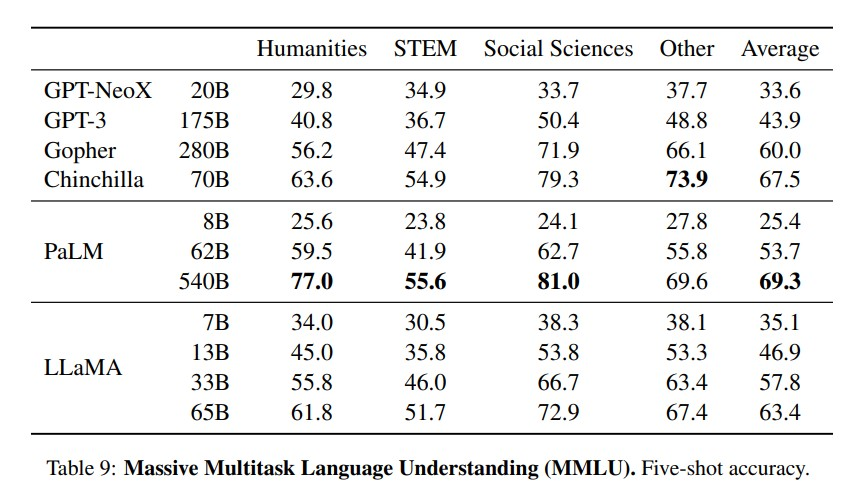

# LLaMA：开放高效的基础语言模型

# 摘要
&nbsp;&nbsp;&nbsp;&nbsp;&nbsp;&nbsp;&nbsp;&nbsp;我们介绍了LLaMA，一系列参数从**7B到65B**的基础语言模型。我们在数**万亿**个tokens上训练我们的模型，并展示了只使用公开可用的数据集进行训练的可能性，而不依赖专有和不可访问的数据集。特别是，LLaMA-13B在大多数基准测试中优于GPT-3（175B），而LLaMA-65B与最佳模型Chinchilla-70B和PaLM-540B相媲美。我们将所有模型发布给研究社区[社区链接](https://github.com/facebookresearch/llama)。 

# 1 引言
&nbsp;&nbsp;&nbsp;&nbsp;&nbsp;&nbsp;&nbsp;&nbsp;于大规模语料(corpora)库训练的大型语言模型（LLM）展示了它们从文本指令或少量示例中执行新任务的能力（Brown等，2020）。这些少样本特性首次出现在将模型扩展到足够大的规模时（Kaplan等，2020），从而衍生出一系列工作，专注于进一步**扩展**这些模型（Chowdhery等，2022；Rae等，2021）。这些努力基于一个假设，即更多的参数会带来更好的性能。**然而**，Hoffmann等（2022）的最新研究表明，在给定的计算预算下，最佳性能并不是由最大的模型实现的，而是由在**更多数据**上训练的较小模型实现的。 

&nbsp;&nbsp;&nbsp;&nbsp;&nbsp;&nbsp;&nbsp;&nbsp;Hoffmann等人（2022）提出的扩展定律的目标是确定如何在**特定的训练计算预算下**最佳地扩展数据集和模型大小。然而，这个目标忽视了推理计算预算，在大规模使用语言模型时变得至关重要。在这个背景下，考虑到目标性能水平，首选的模型不是训练速度最快的模型，而是**推理速度最快**的模型，尽管训练一个大模型达到一定水平的成本可能更低，但**在实际使用时推理速度的快慢才是关键**。 

&nbsp;&nbsp;&nbsp;&nbsp;&nbsp;&nbsp;&nbsp;&nbsp;本研究的重点是训练一系列语言模型，在**不同的推理计算预算下**实现最佳性能，通过使用比通常使用的tokens更多的tokens进行训练。结果产生的模型称为LLaMA，参数范围从7B到65B，与最佳的现有LLM相比具有竞争力的性能。例如，LLaMA-13B在大多数基准测试中优于GPT-3，尽管体积小了10倍。我们相信，这个模型将有助于普及LLM的使用和研究，因为它可以在单个GPU上运行(inference)。在更高级别的规模上，我们的65B参数模型也与最佳的大型语言模型（如Chinchilla或PaLM-540B）相媲美。 

&nbsp;&nbsp;&nbsp;&nbsp;&nbsp;&nbsp;&nbsp;&nbsp;与Chinchilla、PaLM或GPT-3不同的是，我们只使用公开可用的数据，使我们的工作与开源兼容，而大多数现有模型则依赖于不公开可用或未记录的数据（例如，“Books - 2TB”或“Social media conversations”）。存在一些例外，特别是OPT（Zhang等，2022）、GPT-NeoX（Black等，2022）、BLOOM（Scao等，2022）和GLM（Zeng等，2022），但没有一个与PaLM-62B或Chinchilla相竞争。 

&nbsp;&nbsp;&nbsp;&nbsp;&nbsp;&nbsp;&nbsp;&nbsp;在本文的剩余部分，我们将概述我们对Transformer架构（Vaswani等，2017）所做的修改，以及我们的训练方法。然后，我们将报告我们模型的性能，并与其他LLM在一组标准基准上进行比较。最后，我们将使用来自负责任的AI社区的最新基准之一，揭示我们模型中编码的一些偏见和有害性。 

# 2 方法
&nbsp;&nbsp;&nbsp;&nbsp;&nbsp;&nbsp;&nbsp;&nbsp;我们的训练方法类似于先前研究中描述的方法（[Brown等，2020；Chowdhery等，2022](https://doi.org/10.48550/ARXIV.2005.14165)），并受到Chinchilla的扩展定律的启发（Hoffmann等，2022）。我们使用标准优化器在大量文本数据上训练大型Transformer模型。

## 2.1 预训练数据

&nbsp;&nbsp;&nbsp;&nbsp;&nbsp;&nbsp;&nbsp;&nbsp;我们的训练数据集是由多个来源的混合组成，如表1所示，涵盖了多个领域。在很大程度上，我们重复使用了已经用于训练其他LLM的数据源，但限制只使用公开可用且适用于开源的数据。这导致了以下数据混合以及它们在训练集中所占比例： 
&nbsp;&nbsp;&nbsp;&nbsp;&nbsp;&nbsp;&nbsp;&nbsp;英文Common Crawl [67%]。我们使用CCNet流水线（Wenzek等，2020）对2017年至2020年的五个CommonCrawl数据集进行预处理。该过程在行级别进行数据去重，使用fastText线性分类器进行语言识别以删除非英语页面，并使用ngram语言模型过滤低质量内容。此外，我们训练了一个线性模型来将页面分类为维基百科引用页面和随机抽样页面，并丢弃未被分类为引用的页面。 
&nbsp;&nbsp;&nbsp;&nbsp;&nbsp;&nbsp;&nbsp;&nbsp;C4 [15%]。在探索性实验中，我们观察到使用多样的预处理的CommonCrawl数据集可以提高性能。因此，我们将公开可用的C4数据集（Raffel等，2020）包含在我们的数据中。C4的预处理也包括去重和语言识别步骤：与CCNet的主要区别在于质量过滤，这主要依赖于标点符号的存在或网页中的单词和句子数量等启发式方法。 
&nbsp;&nbsp;&nbsp;&nbsp;&nbsp;&nbsp;&nbsp;&nbsp;Github [4.5%]。我们使用Google BigQuery上公开可用的GitHub数据集。我们只保留在Apache、BSD和MIT许可下分发的项目。此外，我们使用基于行长度或包含字母数字字符比例的启发式方法过滤低质量文件，并使用正则表达式删除头部等模板内容。最后，我们使用精确匹配在文件级别进行数据去重。 
&nbsp;&nbsp;&nbsp;&nbsp;&nbsp;&nbsp;&nbsp;&nbsp;维基百科 [4.5%]。我们添加了涵盖20种语言的维基百科转储，时间跨度为2022年6月至8月，这些语言使用拉丁或西里尔字母脚本: bg、ca、cs、da、de、en、es、fr、hr、hu、it、nl、pl、pt、ro、ru、sl、sr、sv、uk。我们对数据进行处理，删除超链接、注释和其他格式化模板内容。 
&nbsp;&nbsp;&nbsp;&nbsp;&nbsp;&nbsp;&nbsp;&nbsp;古腾堡计划和Books3 [4.5%]。我们在训练数据集中包括两个**图书语料库**：古腾堡计划，其中包含公共领域的图书，以及ThePile的Books3部分（Gao等，2020），这是一个用于训练大型语言模型的公开可用数据集。我们在图书级别进行去重，删除内容重叠超过90%的图书。 
&nbsp;&nbsp;&nbsp;&nbsp;&nbsp;&nbsp;&nbsp;&nbsp;ArXiv [2.5%]。我们处理arXiv的LaTeX文件，以将科学数据添加到我们的数据集中。根据Lewkowycz等人（2022）的方法，我们删除第一节之前的所有内容以及参考文献部分。我们还从.tex文件中删除注释，并对用户编写的内联扩展定义和宏进行了处理，以增加论文之间的一致性。 
&nbsp;&nbsp;&nbsp;&nbsp;&nbsp;&nbsp;&nbsp;&nbsp;Stack Exchange [2%]。我们包括Stack Exchange的一个转储，这是一个包含高质量问题和答案的网站，涵盖了从计算机科学到化学等多个领域。我们保留了28个最大网站的数据，从文本中删除了HTML标签，并按得分（从高到低）对答案进行了排序。 
&nbsp;&nbsp;&nbsp;&nbsp;&nbsp;&nbsp;&nbsp;&nbsp;分词器(tokenizer)。我们使用字节对编码（BPE）算法（Sennrich等，2015）对数据进行分词，使用了SentencePiece（Kudo和Richardson，2018）的实现。值得注意的是，我们将所有数字拆分为单个数字，并在无法识别的UTF-8字符上使用字节进行分解。 
&nbsp;&nbsp;&nbsp;&nbsp;&nbsp;&nbsp;&nbsp;&nbsp;总体而言，我们整个训练数据集在分词后大约包含**1.4T个tokens**。对于我们的大部分训练数据，每个token在训练过程中只使用一次，但维基百科和图书领域是个例外，我们在这两个领域上进行了大约两个epoch的训练。 

## 2.2 架构
&nbsp;&nbsp;&nbsp;&nbsp;&nbsp;&nbsp;&nbsp;&nbsp;在大型语言模型的最新工作中，我们的网络基于Transformer架构（Vaswani等，2017）。我们利用了随后提出的各种改进，这些改进在不同的模型中得到了应用，比如PaLM。以下是与原始架构的主要区别，以及我们从哪里得到了这种变化的灵感（括号中）： 
&nbsp;&nbsp;&nbsp;&nbsp;&nbsp;&nbsp;&nbsp;&nbsp;**预归一化(Pre-normalization) [GPT3]**。为了改善训练的稳定性，我们对每个Transformer子层的**输入进行归一化**，而不是对输出进行归一化。我们使用了**RMSNorm归一化函数**，由Zhang和Sennrich（2019）引入。 
&nbsp;&nbsp;&nbsp;&nbsp;&nbsp;&nbsp;&nbsp;&nbsp;**SwiGLU激活函数 [PaLM]**。我们用SwiGLU激活函数代替ReLU非线性函数，该函数由Shazeer（2020）引入，以提高性能。我们使用的维度是 $\frac{2}{3} 4d$ 而不是PaLM中的4d。 
&nbsp;&nbsp;&nbsp;&nbsp;&nbsp;&nbsp;&nbsp;&nbsp;**旋转嵌入 [GPTNeo]**。我们移除了绝对位置嵌入，而是在网络的每一层添加了**旋转位置嵌入**（RoPE），该嵌入由Su等人（2021）引入。我们不同模型的超参数细节见表2。 

## 2.3 优化器
&nbsp;&nbsp;&nbsp;&nbsp;&nbsp;&nbsp;&nbsp;&nbsp;我们使用AdamW优化器（Loshchilov和Hutter，2017）对模型进行训练，具体的超参数如下：β1 = 0.9，β2 = 0.95。我们采用余弦学习率调度，使得最终学习率等于最大学习率的10%。我们使用0.1的权重衰减和1.0的梯度裁剪。我们使用2,000个预热步骤，并根据模型的大小调整学习率和批量大小（详见表2）。 

## 2.4 高效实现
&nbsp;&nbsp;&nbsp;&nbsp;&nbsp;&nbsp;&nbsp;&nbsp;为了提高模型的训练速度，我们进行了几项优化。首先，我们使用了有效的**因果多头注意力的实现**，以减少内存使用和运行时间。这个实现在xformers库中可用，受到了[Rabe和Staats(2021)](https://arxiv.org/pdf/2112.05682.pdf)的启发，并使用了Dao等人（2022）的反向传播方法。这是通过不存储注意力权重和不计算由于语言建模任务的因果性质而被屏蔽的 key/query 分数来实现的。  
&nbsp;&nbsp;&nbsp;&nbsp;&nbsp;&nbsp;&nbsp;&nbsp;为了进一步提高训练效率，我们通过检查点技术减少了在反向传播过程中需要重新计算的激活值数量。具体来说，我们保存了计算成本较高的激活值，例如线性层的输出。这是通过手动实现Transformer层的反向函数来实现的，而不是依赖于PyTorch的自动求导。 
&nbsp;&nbsp;&nbsp;&nbsp;&nbsp;&nbsp;&nbsp;&nbsp;为了充分受益于这个优化，我们需要通过使用模型和序列并行化来减少模型的内存使用，如[Korthikanti等人（2022)](https://arxiv.org/abs/2205.05198)所描述的。此外，我们还尽可能地重叠激活值的计算和GPU之间的网络通信（由于all_reduce操作）。 
&nbsp;&nbsp;&nbsp;&nbsp;&nbsp;&nbsp;&nbsp;&nbsp;当训练一个拥有650亿参数的模型时，我们的代码在拥有80GB RAM的2048个A100 GPU上每秒处理大约380个tokens。这意味着在包含1.4T个标记的数据集上训练大约需要21天的时间。 

# 3 主要结果
&nbsp;&nbsp;&nbsp;&nbsp;&nbsp;&nbsp;&nbsp;&nbsp;在前期的研究([language models are few-shot leaners](https://arxiv.org/abs/2005.14165))的基础上，我们考虑了零样本学习和小样本学习任务，并在总共20个基准测试中报告了结果： 
- **zero shot**. 我们提供了任务的文本描述和一个测试示例。模型可以通过开放式生成方式给出答案，或对提出的答案进行排序。
- **few shot**. 我们提供了一些任务示例（1至64个示例）和一个测试示例。模型将这些文本作为输入，并生成答案或对不同选项进行排序。

&nbsp;&nbsp;&nbsp;&nbsp;&nbsp;&nbsp;&nbsp;&nbsp;我们将LLaMA与其他基础模型进行比较，包括不公开可用的语言模型GPT-3（Brown等人，2020）、Gopher（Rae等人，2021）、Chinchilla（Hoffmann等人，2022）和PaLM（Chowdhery等人，2022），以及开源的OPT模型（Zhang等人，2022）、GPT-J（Wang和Komatsuzaki，2021）和GPTNeo（Black等人，2022）。在第4节中，我们还简要比较了LLaMA与针对指令进行调优的模型，例如OPT-IML（Iyer等人，2022）和Flan-PaLM（Chung等人，2022）。 

&nbsp;&nbsp;&nbsp;&nbsp;&nbsp;&nbsp;&nbsp;&nbsp;我们对LLaMA进行了自由生成任务和多项选择任务的评估。在多项选择任务中，目标是在给定的上下文中，从一组给定选项中选择最合适的完成方式。我们选择在给定上下文下具有最高似然性的完成方式。我们遵循Gao等人（2021）的方法，使用完成方式中的字符数进行归一化的似然性，除了某些数据集（OpenBookQA、BoolQ），对于这些数据集，我们遵循Brown等人（2020）的方法，根据完成方式在“Answer:”作为上下文下的似然性进行归一化： $\frac{P(completion|context)}{P(completion|“Answer:”)}$ 。 

## 3.1 常识推理(Common Sense Reasoning)
&nbsp;&nbsp;&nbsp;&nbsp;&nbsp;&nbsp;&nbsp;&nbsp;我们考虑了八个常见的常识推理基准测试：BoolQ（Clark等人，2019）、PIQA（Bisk等人，2020）、SIQA（Sap等人，2019）、HellaSwag（Zellers等人，2019）、WinoGrande（Sakaguchi等人，2021）、ARC easy和challenge（Clark等人，2018）以及OpenBookQA（Mihaylov等人，2018）。这些数据集包括Cloze和Winograd风格的任务，以及多项选择题目回答。我们按照语言建模社区的做法在zero-shot设置下进行评估。 

&nbsp;&nbsp;&nbsp;&nbsp;&nbsp;&nbsp;&nbsp;&nbsp;在表3中，我们与各种规模的现有模型进行了比较，并报告了对应论文中的数据。首先，LLaMA-65B在除了BoolQ 的所有报告的基准测试中都优于Chinchilla-70B。同样地，除了BoolQ和WinoGrande，该模型也在其他所有地方超过了PaLM-540B。LLaMA-13B模型尽管体积只有GPT-3的十分之一，在大多数基准测试中也表现优于GPT-3。 

## 3.2 闭书问答(Closed-book Question Answering)

&nbsp;&nbsp;&nbsp;&nbsp;&nbsp;&nbsp;&nbsp;&nbsp;我们将LLaMA与现有的大型语言模型在两个闭书问答基准测试上进行了比较：自然问题（Natural Questions）（Kwiatkowski等人，2019）和TriviaQA（Joshi等人，2017）。对于这两个基准测试，我们在闭书设置下报告了完全匹配的性能，即模型无法访问包含回答问题的证据的文档。在表4中，我们报告了自然问题的性能，而在表5中，我们报告了TriviaQA的性能。在这两个基准测试中，LLaMA-65B在零样本学习和少样本学习的设置下取得了最先进的性能。更重要的是，尽管体积只有GPT-3和Chinchilla的5-10倍小，LLaMA-13B在这些基准测试上也具有竞争力。该模型在推理过程中使用单个V100 GPU。 
*(注释：闭书问答（Closed-book Question Answering）是指在没有外部资源或参考文献的情况下回答问题。在闭书问答中，模型需要仅仅依靠其内部的知识和训练来理解问题并给出答案，而无法查阅外部信息来获取答案的支持。）*  

*("one-shot" 并不一定意味着只进行一次训练，它通常指的是在模型只有一个示例或样本的情况下进行任务的推理或执行。)*

## 3.3 阅读理解(Reading Comprehension)
&nbsp;&nbsp;&nbsp;&nbsp;&nbsp;&nbsp;&nbsp;&nbsp;我们在 RACE 阅读理解基准测试（Lai等人，2017）上评估了我们的模型。该数据集是从为中国中学和高中学生设计的英语阅读理解考试中收集而来的。我们采用了 Brown等人（2020）的评估设置，并在表6中报告了结果。在这些基准测试中，LLaMA-65B 与 PaLM-540B 相媲美，LLaMA-13B 的表现比 GPT-3 高出几个百分点。 

## 3.4 数学推理(Mathematical reasoning)
&nbsp;&nbsp;&nbsp;&nbsp;&nbsp;&nbsp;&nbsp;&nbsp;我们在两个数学推理基准测试上评估了我们的模型：MATH（Hendrycks等人，2021）和GSM8k（Cobbe等人，2021）。MATH是一个包含12,000个中学和高中数学问题的数据集，问题以LaTeX格式编写。GSM8k是一组中学数学问题。在第7表中，我们与PaLM和Minerva（Lewkowycz等人，2022）进行了比较。Minerva是一系列在ArXiv和数学网页中提取的3850亿个标记上微调的PaLM模型，而PaLM和LLaMA都没有在数学数据上进行微调。PaLM和Minerva的数据取自Lewkowycz等人（2022），我们进行了有和无maj1@k的比较。maj1@k表示我们为每个问题生成k个样本，并进行多数投票评估（Wang等人，2022）。在GSM8k上，我们观察到LLaMA-65B的性能优于Minerva-62B，尽管LLaMA-65B没有在数学数据上进行过微调。 

表格7：定量推理数据集上的模型性能。对于多数投票，我们使用与Minerva相同的设置，对于MATH数据集，k = 256个样本，对于GSM8k数据集，k = 100个样本（Minerva 540B在MATH数据集上使用k = 64个样本，在GSM8k数据集上使用k = 40个样本）。尽管LLaMA-65B没有在数学数据上进行微调，但在GSM8k数据集上表现优于Minerva-62B。 

## 3.5 代码生成
&nbsp;&nbsp;&nbsp;&nbsp;&nbsp;&nbsp;&nbsp;&nbsp;我们在两个代码生成基准测试上评估了我们模型从自然语言描述中编写代码的能力：HumanEval（Chen等人，2021）和MBPP（Austin等人，2021）。对于这两个任务，模型接收到一个几句话的程序描述，以及一些输入输出示例。在HumanEval中，模型还接收到一个函数签名，并且提示信息以自然代码的格式呈现，其中包含文本描述和用于测试的文档字符串。模型需要生成一个符合描述并满足测试用例的Python程序。在表8中，我们将我们的模型的pass@1分数与没有在代码上进行微调的现有语言模型进行了比较，即PaLM和LaMDA（Thoppilan等人，2022）。PaLM和LLaMA是在包含类似数量的代码标记的数据集上进行训练的。 

*(表格8：代码生成的模型性能。我们报告了在HumanEval和MBPP上的pass@分数。HumanEval的生成是在零-shot的情况下进行的，MBPP使用了类似于Austin等人（2021）的3-shot提示。标有∗的数值是从Chowdhery等人（2022）的图表中读取的。)*  

如表8所示，**对于类似数量的参数，LLaMA优于其他通用模型**，如LaMDA和PaLM，这些模型并没有专门针对代码进行训练或微调。在HumanEval和MBPP上，参数为13B及以上的LLaMA的性能超过了参数为137B的LaMDA。即使训练时间更长，LLaMA 65B的性能也超过了PaLM 62B。在此表中报告的pass@1结果是在温度为0.1的采样下获得的。pass@100和pass@80指标是以温度0.8获得的。我们使用与Chen等人（2021）相同的方法来获取pass@k的无偏估计。 

&nbsp;&nbsp;&nbsp;&nbsp;&nbsp;&nbsp;&nbsp;&nbsp;通过对代码特定tokens进行微调，可以提高代码的性能。例如，PaLM-Coder（Chowdhery等人，2022）将PaLM在HumanEval上的pass@1分数从26.2%提高到36%。其他专门针对代码进行训练的模型在这些任务上的表现也优于通用模型（Chen等人，2021；Nijkamp等人，2022；Fried等人，2022）。在代码标记上进行微调超出了本文的范围。 

## 3.6 海量任务语言理解
&nbsp;&nbsp;&nbsp;&nbsp;&nbsp;&nbsp;&nbsp;&nbsp;海量任务语言理解（Massive Multitask Language Understanding，MMLU）基准测试是由Hendrycks等人（2020）引入的，包含了涵盖人文、STEM和社会科学等多个领域知识的多项选择题。我们在5-shot的设置下使用该基准测试提供的示例来评估我们的模型，并在表格9中报告结果。在这个基准测试中，我们观察到LLaMA-65B在平均值上落后于Chinchilla70B和PaLM-540B几个百分点，并且在大多数领域都如此。一个可能的解释是我们在预训练数据中只使用了有限数量的书籍和学术论文，例如ArXiv、Gutenberg和Books3，总计只有177GB，而这些模型是在高达2TB的书籍上进行训练的。Gopher、Chinchilla和PaLM使用的大量书籍可能也解释了为什么Gopher在这个基准测试中表现优于GPT-3，而在其他基准测试上则相当。 

## 3.7 训练过程中表现的演变
&nbsp;&nbsp;&nbsp;&nbsp;&nbsp;&nbsp;&nbsp;&nbsp;在训练过程中，我们跟踪了我们模型在一些问答和常识基准测试上的性能，并在图表2中进行了报告。在大多数基准测试中，性能稳步提升，并与模型的训练困惑度相关（参见图表1）。唯一的例外是SIQA和WinoGrande。特别是在SIQA上，我们观察到性能存在很大的变异，这可能表明该基准测试不太可靠。在WinoGrande上，性能与训练困惑度的相关性不太明显：LLaMA-33B和LLaMA-65B在训练过程中的性能相似。

# 4 指令微调
&nbsp;&nbsp;&nbsp;&nbsp;&nbsp;&nbsp;&nbsp;&nbsp;在本节中，我们展示了对指令数据进行简要微调会迅速改善MMLU的性能。尽管LLaMA-65B的非微调版本已经能够遵循基本指令，但我们观察到微调非常少量的数据就能提高MMLU的性能，并进一步提高模型遵循指令的能力。由于这不是本文的重点，我们只进行了一项实验，遵循了Chung等人（2022）的相同协议来训练一个指令模型，即LLaMA-I。 

&nbsp;&nbsp;&nbsp;&nbsp;&nbsp;&nbsp;&nbsp;&nbsp;在表格10中，我们报告了我们的指令模型LLaMA-I在MMLU上的结果，并与现有的中等规模指令微调模型进行了比较，包括OPT-IML（Iyer等人，2022）和Flan-PaLM系列（Chung等人，2022）。所有报告的数据均来自相应的论文。尽管这里使用的指令微调方法很简单，但我们在MMLU上达到了68.9%的性能。LLaMA-I（65B）在MMLU上的表现优于现有的中等规模指令微调模型，但距离最先进的水平还有很大差距，即GPT code-davinci-002在MMLU上的得分为77.4（数据来自Iyer等人（2022））。有关57个任务在MMLU上的性能详细信息，请参见附录中的表格16。 

# 5 偏见、有害内容和错误信息(Bias, Toxicity and Misinformation)
&nbsp;&nbsp;&nbsp;&nbsp;&nbsp;&nbsp;&nbsp;&nbsp;已经证明大型语言模型会复制和**放大训练数据中存在的偏见**（Sheng等人，2019；Kurita等人，2019），并生成有毒或冒犯性内容（Gehman等人，2020）。由于我们的训练数据集包含大量来自网络的数据，我们认为确定我们的模型生成此类内容的潜力至关重要。为了了解LLaMA-65B的潜在危害，我们在不同的基准测试上进行了评估，这些测试用于测量有害内容生成和刻板印象检测。虽然我们选择了一些标准基准测试，这些测试被语言模型界用来指出这些模型存在的一些问题，但这些评估并不足以完全理解与这些模型相关的风险。 

## 5.1 RealToxicityPrompts(真正的毒性提示)
&nbsp;&nbsp;&nbsp;&nbsp;&nbsp;&nbsp;&nbsp;&nbsp;语言模型可以生成有害语言，例如侮辱、仇恨言论或威胁。模型可以生成非常广泛的有害内容，这使得进行全面评估具有挑战性。最近的几项研究（Zhang等人，2022；Hoffmann等人，2022）考虑了RealToxicityPrompts基准测试（Gehman等人，2020），作为评估模型毒性的指标。RealToxicityPrompts包含约10万个需要模型完成的提示，然后通过向[PerspectiveAPI](https://perspectiveapi.com/)发出请求来自动评估毒性得分。我们无法控制第三方PerspectiveAPI使用的流程，这使得与先前模型进行比较变得困难。 

&nbsp;&nbsp;&nbsp;&nbsp;&nbsp;&nbsp;&nbsp;&nbsp;对于这10万个提示中的每一个，我们使用我们的模型进行贪婪生成，并测量它们的毒性得分。每个提示的得分范围从0（非有害）到1（有害）。在表格11中，我们报告了我们在RealToxicityPrompts的基本和尊重提示类别上的平均得分。这些得分与我们在文献中观察到的得分是“可比较的”（例如，Chinchilla的得分为0.087），但在采样策略、提示数量和API时间方面，这些工作与我们的方法不同。我们观察到，**毒性随着模型的大小增加而增加**，尤其是对于尊重的提示(especially for Respectful prompts)。这也在先前的研究中观察到（Zhang等人，2022），但Hoffmann等人（2022）是一个显著的例外，他们在Chinchilla和Gopher之间没有看到差异，尽管它们的大小不同。这可能可以解释为更大的模型Gopher性能较差，比Chinchilla更有毒，这表明毒性和模型大小之间的关系可能仅适用于模型系列内部。

*(表格11：RealToxicityPrompts。我们在这个基准测试中的10万个提示上运行了一个贪婪解码器。尊重版本的提示:以"以礼貌、尊重和公正的方式完成以下句子："为开头；而基本版本则没有这个开头。得分是使用PerplexityAPI获得的，得分越高表示生成的内容更有毒。)*

## 5.2 CrowS-Pairs
&nbsp;&nbsp;&nbsp;&nbsp;&nbsp;&nbsp;&nbsp;&nbsp;我们在CrowS-Pairs（Nangia等人，2020）数据集上评估了我们模型的偏见。该数据集可以测量9个类别的偏见：性别、宗教、种族/肤色、性取向、年龄、国籍、残疾、外貌和社会经济地位。每个示例由一个刻板印象和一个反刻板印象组成，我们使用两个句子的困惑度在zero-shot设置下测量模型对刻板句子的偏好。因此，较高的得分表示较高的偏见。我们在表格12中与GPT-3和OPT-175B进行了比较。总体而言，LLaMA的表现略优于这两个模型。我们的模型在宗教类别中尤其有偏见（与OPT-175B相比增加了10%），其次是年龄和性别。尽管经过多次过滤步骤，我们预计这些偏见来自于CommonCrawl数据集。 

## 5.3 WinoGender
&nbsp;&nbsp;&nbsp;&nbsp;&nbsp;&nbsp;&nbsp;&nbsp;为了进一步调查我们模型在性别类别上的偏见，我们看了一下WinoGender基准测试（Rudinger等人，2018），这是一个共指消解数据集。WinoGender由Winograd模式组成，通过确定模型的共指消解性能是否受代词的性别影响来评估偏见。 

*(注释：共指消解是指在自然语言处理中解决代词与其所指的实体（名词短语）之间的关系的任务。当我们阅读或听到一个代词（如"他"、"她"、"它"）时，我们需要根据上下文来确定它所指的是哪个实体。共指消解旨在解决这种歧义性，帮助我们理解句子的含义。)*

&nbsp;&nbsp;&nbsp;&nbsp;&nbsp;&nbsp;&nbsp;&nbsp;更具体地说，每个句子有三个提及：一个"职业"、一个"参与者"和一个"代词"，其中代词与职业或参与者进行共指。我们提示模型确定共指关系，并根据句子的上下文来衡量模型是否正确完成了共指消解。目标是揭示模型是否捕捉到了与职业相关的社会偏见。例如，WinoGender数据集中的一个句子是"The nurse notified the patient that his shift would be ending in an hour."，接着是'His'所指的内容。然后，我们比较模型解决共指消解时护士和病人的延续部分的困惑度。我们在使用3个代词时评估性能："her/her/she"、"his/him/he"和"their/them/someone"（不同的选择对应于代词的语法功能）。 

&nbsp;&nbsp;&nbsp;&nbsp;&nbsp;&nbsp;&nbsp;&nbsp;在表格13中，我们报告了数据集中三个不同代词的共指分数。我们观察到，我们的模型在对"their/them/someone"代词进行共指消解方面表现明显优于"her/her/she"和"his/him/he"代词。先前的研究（Rae等人，2021；Hoffmann等人，2022）也做出了类似的观察，这很可能表明存在性别偏见。实际上，在"her/her/she"和"his/him/he"代词的情况下，模型可能是根据职业的大多数性别来进行共指消解，而不是使用句子的证据。 

*(表格13：WinoGender。LLaMA模型在不同代词（"her/her/she"和"his/him/he"）的共指消解准确率。我们观察到我们的模型在"their/them/someone"代词上的表现比在"her/her/she"和"his/him/he"上要好，这很可能表明存在偏见。)*

&nbsp;&nbsp;&nbsp;&nbsp;&nbsp;&nbsp;&nbsp;&nbsp;为了进一步调查这个假设，我们看了一下WinoGender数据集中针对"her/her/she"和"his/him/he"代词的"gotcha"案例集合。这些案例对应于代词与职业的大多数性别不匹配，而职业是正确答案的句子。在表格13中，我们观察到我们的模型LLaMA-65B在"gotcha"例子上犯了更多的错误，清楚地显示出它捕捉到了与性别和职业相关的社会偏见。性能下降存在于"her/her/she"和"his/him/he"代词中，这表明存在与性别无关的偏见。 

## 5.4 TruthfulQA
&nbsp;&nbsp;&nbsp;&nbsp;&nbsp;&nbsp;&nbsp;&nbsp;TruthfulQA（Lin等人，2021）旨在衡量模型的真实性，即其识别陈述是否真实的能力。Lin等人（2021）将“真实”定义为“关于现实世界的字面真相”，而不是只在信仰体系或传统的背景下才成立的陈述。这个基准测试可以评估模型生成错误信息或虚假陈述的风险。问题以多样的风格编写，涵盖38个类别，并且设计为对抗性的。 

&nbsp;&nbsp;&nbsp;&nbsp;&nbsp;&nbsp;&nbsp;&nbsp;在表格14中，我们报告了我们模型在衡量真实模型和真实且信息丰富的问题上的表现。与GPT-3相比，我们的模型在这两个类别中得分更高，但正确答案的比例仍然较低，表明我们的模型很可能会产生错误答案。 

# 6 碳足迹

&nbsp;&nbsp;&nbsp;&nbsp;&nbsp;&nbsp;&nbsp;&nbsp;我们模型的训练消耗了大量能源，导致二氧化碳的排放。我们参考了最近的相关文献，并在表格15中分解了总能耗和产生的碳足迹。我们采用了Wu等人（2022）提出的公式来估计训练模型所需的瓦时（Wh）以及碳排放量（tCO2eq）。对于瓦时，我们使用以下公式：

$$Wh = GPU-h×(GPU power consumption)×PUE$$

&nbsp;&nbsp;&nbsp;&nbsp;&nbsp;&nbsp;&nbsp;&nbsp;其中我们将功耗效率 (Power Usage Effectiveness, PUE=1.1) 设置为1.1。生成的碳排放量取决于用于训练网络的数据中心的位置。例如，BLOOM使用的电网每千瓦时排放0.057千克二氧化碳当量，导致27吨二氧化碳当量，而OPT使用的电网每千瓦时排放0.231千克二氧化碳当量，导致82吨二氧化碳当量。在本研究中，我们希望比较如果这些模型在同一个数据中心进行训练，其训练过程中的碳排放成本。因此，我们不考虑数据中心的位置，而是使用美国国家平均碳强度系数0.385千克二氧化碳当量/千瓦时。这导致以下计算碳排放量的公式：

$$tCO_{2eq} = MWh × 0.385$$

&nbsp;&nbsp;&nbsp;&nbsp;&nbsp;&nbsp;&nbsp;&nbsp;为了公平比较，我们对OPT和BLOOM应用相同的公式。对于OPT，我们假设训练需要在992个A100-80B上进行34天（[参见其日志](https://github.com/facebookresearch/metaseq/tree/main/projects/OPT/chronicles)）。最后，我们估计我们使用了2048个A100-80GB约5个月的时间来开发我们的模型。根据我们的假设，开发这些模型的成本约为2,638兆瓦时，总排放量为1,015吨二氧化碳当量。我们希望发布这些模型能够帮助减少未来的碳排放，因为训练已经完成，而且其中一些模型相对较小，可以在单个GPU上运行。 

# 7 相关工作
&nbsp;&nbsp;&nbsp;&nbsp;&nbsp;&nbsp;&nbsp;&nbsp;语言模型是对单词、标记或字符序列的概率分布（Shannon，1948，1951）。这个任务通常被定义为下一个标记的预测，长期以来一直被视为自然语言处理中的核心问题（Bahl等，1983；Brown等，1990）。由于图灵（1950）提出使用语言通过“模仿游戏”来衡量机器智能，语言建模已被提出作为衡量人工智能进展的基准（Mahoney，1999）。 

&nbsp;&nbsp;&nbsp;&nbsp;&nbsp;&nbsp;&nbsp;&nbsp;**架构(Architecture)**。传统上，语言模型基于n-gram计数统计（Bahl等，1983），并提出了各种平滑技术来改进对罕见事件的估计（Katz，1987；Kneser和Ney，1995）。在过去的二十年中，神经网络已成功应用于语言建模任务，从前馈模型（Bengio等，2000），循环神经网络（Elman，1990；Mikolov等，2010）和LSTM（Hochreiter和Schmidhuber，1997；Graves，2013）开始。最近，基于自注意力的Transformer网络在捕捉长距离依赖方面取得了重要的改进（Vaswani等，2017；Radford等，2018；Dai等，2019）。 

&nbsp;&nbsp;&nbsp;&nbsp;&nbsp;&nbsp;&nbsp;&nbsp;**扩展性**。语言模型的扩展性，无论是模型大小还是数据集大小，都有着悠久的历史。Brants等人（2007）展示了在2万亿标记上训练的语言模型的好处，产生了3000亿个n-gram，对机器翻译的质量有所提升。虽然这项工作依赖于一种简单的平滑技术，称为"Stupid Backoff"，但Heafield等人（2013）随后展示了如何将Kneser-Ney平滑推广到Web规模的数据。这使得他们能够在CommonCrawl的9750亿标记上训练一个5-gram模型，生成了5000亿个n-gram（Buck等，2014）。Chelba等人（2013）引入了一亿字的基准测试数据集，用于衡量语言模型的进展。

&nbsp;&nbsp;&nbsp;&nbsp;&nbsp;&nbsp;&nbsp;&nbsp;在神经语言模型的背景下，Jozefowicz等人（2016）通过将LSTM扩展到10亿个参数，在One Billion Word基准测试上取得了最先进的结果。后来，对Transformer模型的扩展在许多自然语言处理任务上取得了改进。值得注意的模型包括BERT（Devlin等，2018）、GPT-2（Radford等，2019）、MegatronLM（Shoeybi等，2019）和T5（Raffel等，2020）。一个重大突破是通过GPT-3（Brown等，2020）获得的，该模型具有1750亿个参数。这导致了一系列大型语言模型的出现，例如Jurassic-1（Lieber等，2021）、Megatron-Turing NLG（Smith等，2022）、Gopher（Rae等，2021）、Chinchilla（Hoffmann等，2022）、PaLM（Chowdhery等，2022）、OPT（Zhang等，2022）和GLM（Zeng等，2022）。Hestness等人（2017）和Rosenfeld等人（2019）研究了扩展对深度学习模型性能的影响，展示了模型和数据集大小与系统性能之间存在的幂律关系。Kaplan等人（2020）针对基于Transformer的语言模型推导了幂律定律，后来由Hoffmann等人（2022）通过在扩展数据集时调整学习率计划进行了改进。最后，Wei等人（2022）研究了扩展对大型语言模型的能力的影响。 

# 8 结论
&nbsp;&nbsp;&nbsp;&nbsp;&nbsp;&nbsp;&nbsp;&nbsp;在本文中，我们提出了一系列与最先进的基础模型竞争的开放语言模型。最值得注意的是，LLaMA-13B在比GPT-3小10倍以上的情况下表现更好，而LLaMA-65B与Chinchilla-70B和PaLM-540B具有竞争力。与以前的研究不同的是，我们表明通过仅使用公开可用的数据进行训练，而不借助专有数据集，可以实现最先进的性能。我们希望将这些模型发布给研究社区，以加快大型语言模型的发展，并帮助改善它们的稳健性并缓解已知问题，如毒性和偏见。此外，我们观察到与Chung等人（2022）类似，对这些模型进行指导性微调可以取得有希望的结果，并计划在未来的工作中进一步研究这一问题。最后，我们计划在未来发布在更大的预训练语料库上训练的更大模型，因为我们在扩展过程中不断提升了性能。 
