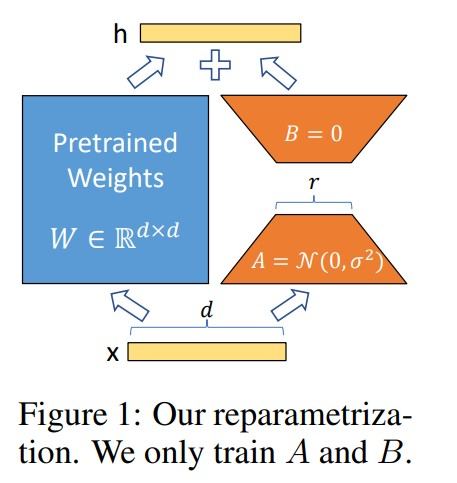

# LORA: 大型语言模型的低秩适应(Low-Rank Adaption of Large Language MODELS)

# 摘要
&nbsp;&nbsp;&nbsp;&nbsp;&nbsp;&nbsp;&nbsp;&nbsp; 自然语言处理的一个重要范式是在通用领域数据上进行大规模预训练(pre-train)，然后将其适应于特定任务或领域。随着我们预训练的模型变得更大，重新训练所有模型参数的完全微调(full fine-tuning)变得越来越不可行。以GPT-3 175B为例，部署独立的微调模型实例，每个实例都有175B个参数，成本过高。我们提出了**低秩自适应(Low-Rank Adaptation，LoRA)方法**，它**冻结预训练模型权重**，并将**可训练的秩分解矩阵**注入到Transformer架构的每一层中，从而大大减少了下游任务的可训练参数数量。与使用Adam微调的GPT-3 175B相比，LoRA可以将可训练**参数的数量减少10,000倍**，**GPU内存需求减少3倍**。尽管LoRA具有更少的可训练参数、更高的训练吞吐量，并且与适配器相比没有额外的推理延迟，但在RoBERTa、DeBERTa、GPT-2和GPT-3的模型质量上表现相当或更好。我们还对语言模型自适应中的秩缺陷进行了实证研究，这为LoRA的有效性提供了启示。我们发布了一个软件包，方便将LoRA与PyTorch模型集成，并提供RoBERTa、DeBERTa和GPT-2的实现和模型检查点，网址为https://github.com/microsoft/LoRA。 

&nbsp;&nbsp;&nbsp;&nbsp;&nbsp;&nbsp;&nbsp;&nbsp;许多自然语言处理应用程序依赖于将一个大规模预训练的语言模型适应(adapting)到多个下游应用(down stream applications)中。这种适应通常通过微调(fine-tuning)来实现，**微调会更新预训练模型的所有参数**。微调的主要缺点是新模型的参数数量与原始模型**相同**。随着每隔几个月会训练出更大的模型，对于GPT-2（Radford等，2019）或RoBERTa large（Liu等，2019）来说，这只是一个"不便之处"，但对于具有1750亿可训练参数的GPT-3（Brown等，2020）来说，这成为一个关键的部署挑战。 
*(尽管GPT-3 175B在few-shot learning方面取得了不俗的性能，但如附录A所示，微调显著提高了其性能。)*  

&nbsp;&nbsp;&nbsp;&nbsp;&nbsp;&nbsp;&nbsp;&nbsp;许多人试图通过**仅适应部分参数(some parameters)** 或为新任务学习**外部模块(external modules)** 来缓解这个问题。这样，除了每个任务的预训练模型外，我们只需要存储和加载少量的任务特定参数，从而在部署时大大提高了操作效率。然而，现有的技术常常通过增加模型的深度或减少模型的可用序列长度来引入推理延迟(inference latency)（Houlsby等，2019; Rebuffi等，2017）（Li和Liang，2021; Lester等，2021; Hambardzumyan等，2020; Liu等，2021）（第3节）。更重要的是，这些方法通常无法与微调基准相匹配，在效率和模型质量之间存在权衡(trade-off)。 

&nbsp;&nbsp;&nbsp;&nbsp;&nbsp;&nbsp;&nbsp;&nbsp;我们受到Li等人（2018a）和Aghajanyan等人（2020）的启发，他们表明过度参数化的学习模型实际上存在于一个较低的内在维度上(low intrinsic dimension)。我们假设在模型适应(adaptation)过程中权重的变化也具有较低的"内在秩"，从而引出了我们提出的低秩自适应(Low-Rank Adaptation:LoRA)方法。LoRA允许我们通过优化适应过程中密集层的秩分解矩阵(rank decomposition matrices)间接地(indirectly)训练一些密集层，同时保持预训练权重的冻结状态，如图1所示。以GPT-3 175B为例，我们展示了即使在完整秩（即d）高达12,288的情况下，一个非常低的秩（即图1中的r可以是一或二）就足够使用，使LoRA在存储和计算效率上都非常高效。 

LoRA具有几个关键优势： 
- 预训练模型可以被共享并用于构建许多用于不同任务的小型LoRA模块。我们可以冻结共享模型，并通过替换图1中的矩阵A和B来**高效切换任务**，从而显著减少存储需求和任务切换开销。 
- LoRA通过使用自适应优化器**使训练更加高效**，并将**硬件门槛降低了最多3倍**，因为我们不需要计算大多数参数的梯度或维护优化器状态。相反，我们**只优化注入的、更小的低秩矩阵**。 
- 我们简单的线性设计使得在部署(deployed)时能够将可训练矩阵与冻结的权重合并，与完全微调的模型相比，**不引入推理延迟**。 
- LoRA与许多先前的方法正交，可以与其中许多方法结合使用，例如prefix-tuning。我们在附录E中提供了一个例子。 
*(Prefix-tuning是一种用于自然语言处理（NLP）任务的模型自适应方法。它通过在预训练模型之前添加一个可优化的前缀向量来适应特定任务。这个前缀向量相当于一个任务特定的附加参数，它通过微调来与预训练模型一起进行训练。在推理时，前缀向量与预训练模型的输出进行组合，生成最终的任务特定预测结果。)*

&nbsp;&nbsp;&nbsp;&nbsp;&nbsp;&nbsp;&nbsp;&nbsp;**术语和约定**：我们经常引用Transformer架构，并使用其维度的常规术语。我们将Transformer层的输入和输出维度大小称为 $d_{model}$ 。我们使用 $W_{q}$ 、 $W_{k}$ 、 $W_{v}$ 和 $W_{o}$ 来表示自注意模块中的Q/K/V/output projection 矩阵。W或 $W_{0}$ 表示预训练的权重矩阵，∆W表示在适应过程中累积的梯度更新。我们使用r来表示LoRA模块的秩(rank)。我们遵循（Vaswani等，2017；Brown等，2020）设定的约定，并使用Adam（Loshchilov和Hutter，2019；Kingma和Ba，2017）进行模型优化，并使用Transformer MLP前馈维度 $d_{ffn} = 4 \times d_{model}$ 。

# 2 问题陈述
&nbsp;&nbsp;&nbsp;&nbsp;&nbsp;&nbsp;&nbsp;&nbsp;尽管我们的提议与训练目标无关，但我们将重点放在语言建模上，作为我们的动机案例。以下是语言建模问题的简要描述，特别是在给定任务特定提示的情况下最大化条件概率。 
&nbsp;&nbsp;&nbsp;&nbsp;&nbsp;&nbsp;&nbsp;&nbsp;假设我们有一个由参数 $\Phi$ 参数化的预训练自回归语言模型 $P_{\Phi}(y \mid x)$ 。例如, $P_{\Phi}(y \mid x)$ 可以是基于Transformer架构（Vaswani等，2017）的通用多任务学习器，如GPT(Radford等，b；Brown等，2020)。考虑将这个预训练模型调整到下游的条件文本生成任务中，例如摘要生成、机器阅读理解（MRC）和自然语言转SQL（NL2SQL）。每个下游任务由一个上下文-目标对的训练数据集表示: $\mathcal{Z}=\left\lbrace (x_{i}, x_{i}) \right\rbrace_{i = 1, \dots, N}$ , 其中 $x_{i}$ 和 $y_{i}$ 都是标记序列。例如，在NL2SQL中, $x_{i}$ 是一个自然语言查询， $y_{i}$ 是它对应的SQL命令；在摘要生成中， $x_{i}$ 是一篇文章的内容， $y_{i}$ 是它的摘要。 
&nbsp;&nbsp;&nbsp;&nbsp;&nbsp;&nbsp;&nbsp;&nbsp;在完全微调过程中，模型的初始权重被设定为预训练权重 $\Phi_{0}$ ，并通过重复迭代梯度来最大化条件语言建模目标(公式1)，从而更新为 $\Phi_{0} + \bigtriangleup \Phi$ :  

&nbsp;&nbsp;&nbsp;&nbsp;&nbsp;&nbsp;&nbsp;&nbsp;完全微调的主要缺点之一是，对于每个下游任务，我们学习了一个不同的参数集 $\bigtriangleup \Phi$ ，其维度 $|\Delta \Phi|$ 与 $|\Delta \Phi_{0}|$ 相等。因此，如果预训练模型很大（例如GPT-3, $|\Delta \Phi_{0}|$ 约为1750亿个参数），存储和部署许多独立的微调模型实例可能会具有挑战性，甚至可能不可行。 
&nbsp;&nbsp;&nbsp;&nbsp;&nbsp;&nbsp;&nbsp;&nbsp;在本文中，我们采用了一种更高效的参数方法，其中任务特定的参数增量 $\Delta \Phi = \Delta \Phi(\theta )$ 由一组尺寸更小的参数 $\theta$ 进一步编码，满足 |\Theta| \ll\left|\Phi_{0}\right| . 因此，寻找 $\Delta \Phi $ 的任务变为在 $\Phi$ 上进行优化： 

&nbsp;&nbsp;&nbsp;&nbsp;&nbsp;&nbsp;&nbsp;&nbsp;在接下来的部分中，我们提议使用低秩表示来编码 $\Delta \Phi$ ，这**既具有计算效率又具有内存效率**。当预训练模型是GPT-3 175B时，可训练参数的数量 $|\theta|$ 可以仅为 $|\Phi_{0}|$ 的0.01%。

