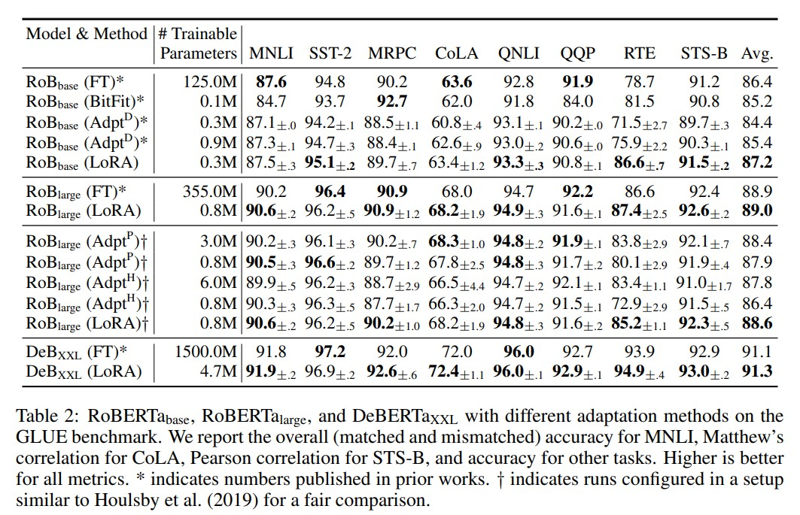

# LORA: 大型语言模型的低秩适应(Low-Rank Adaption of Large Language MODELS)

# 摘要
&nbsp;&nbsp;&nbsp;&nbsp;&nbsp;&nbsp;&nbsp;&nbsp; 自然语言处理的一个重要范式是在通用领域数据上进行大规模预训练(pre-train)，然后将其适应于特定任务或领域。随着我们预训练的模型变得更大，重新训练所有模型参数的完全微调(full fine-tuning)变得越来越不可行。以GPT-3 175B为例，部署独立的微调模型实例，每个实例都有175B个参数，成本过高。我们提出了**低秩自适应(Low-Rank Adaptation，LoRA)方法**，它**冻结预训练模型权重**，并将**可训练的秩分解矩阵**注入到Transformer架构的每一层中，从而大大减少了下游任务的可训练参数数量。与使用Adam微调的GPT-3 175B相比，LoRA可以将可训练**参数的数量减少10,000倍**，**GPU内存需求减少3倍**。尽管LoRA具有更少的可训练参数、更高的训练吞吐量，并且与适配器相比没有额外的推理延迟，但在RoBERTa、DeBERTa、GPT-2和GPT-3的模型质量上表现相当或更好。我们还对语言模型自适应中的秩缺陷进行了实证研究，这为LoRA的有效性提供了启示。我们发布了一个软件包，方便将LoRA与PyTorch模型集成，并提供RoBERTa、DeBERTa和GPT-2的实现和模型检查点，网址为https://github.com/microsoft/LoRA。 

&nbsp;&nbsp;&nbsp;&nbsp;&nbsp;&nbsp;&nbsp;&nbsp;许多自然语言处理应用程序依赖于将一个大规模预训练的语言模型适应(adapting)到多个下游应用(down stream applications)中。这种适应通常通过微调(fine-tuning)来实现，**微调会更新预训练模型的所有参数**。微调的主要缺点是新模型的参数数量与原始模型**相同**。随着每隔几个月会训练出更大的模型，对于GPT-2（Radford等，2019）或RoBERTa large（Liu等，2019）来说，这只是一个"不便之处"，但对于具有1750亿可训练参数的GPT-3（Brown等，2020）来说，这成为一个关键的部署挑战。 
*(尽管GPT-3 175B在few-shot learning方面取得了不俗的性能，但如附录A所示，微调显著提高了其性能。)*  

&nbsp;&nbsp;&nbsp;&nbsp;&nbsp;&nbsp;&nbsp;&nbsp;许多人试图通过**仅适应部分参数(some parameters)** 或为新任务学习**外部模块(external modules)** 来缓解这个问题。这样，除了每个任务的预训练模型外，我们只需要存储和加载少量的任务特定参数，从而在部署时大大提高了操作效率。然而，现有的技术常常通过增加模型的深度或减少模型的可用序列长度来引入推理延迟(inference latency)（Houlsby等，2019; Rebuffi等，2017）（Li和Liang，2021; Lester等，2021; Hambardzumyan等，2020; Liu等，2021）（第3节）。更重要的是，这些方法通常无法与微调基准相匹配，在效率和模型质量之间存在权衡(trade-off)。 

&nbsp;&nbsp;&nbsp;&nbsp;&nbsp;&nbsp;&nbsp;&nbsp;我们受到Li等人（2018a）和Aghajanyan等人（2020）的启发，他们表明过度参数化的学习模型实际上存在于一个较低的内在维度上(low intrinsic dimension)。我们假设在模型适应(adaptation)过程中权重的变化也具有较低的"内在秩"，从而引出了我们提出的低秩自适应(Low-Rank Adaptation:LoRA)方法。LoRA允许我们通过优化适应过程中密集层的秩分解矩阵(rank decomposition matrices)间接地(indirectly)训练一些密集层，同时保持预训练权重的冻结状态，如图1所示。以GPT-3 175B为例，我们展示了即使在完整秩（即d）高达12,288的情况下，一个非常低的秩（即图1中的r可以是一或二）就足够使用，使LoRA在存储和计算效率上都非常高效。 

LoRA具有几个关键优势： 
- 预训练模型可以被共享并用于构建许多用于不同任务的小型LoRA模块。我们可以冻结共享模型，并通过替换图1中的矩阵A和B来**高效切换任务**，从而显著减少存储需求和任务切换开销。 
- LoRA通过使用自适应优化器**使训练更加高效**，并将**硬件门槛降低了最多3倍**，因为我们不需要计算大多数参数的梯度或维护优化器状态。相反，我们**只优化注入的、更小的低秩矩阵**。 
- 我们简单的线性设计使得在部署(deployed)时能够将可训练矩阵与冻结的权重合并，与完全微调的模型相比，**不引入推理延迟**。 
- LoRA与许多先前的方法正交，可以与其中许多方法结合使用，例如prefix-tuning。我们在附录E中提供了一个例子。 
*(Prefix-tuning是一种用于自然语言处理（NLP）任务的模型自适应方法。它通过在预训练模型之前添加一个可优化的前缀向量来适应特定任务。这个前缀向量相当于一个任务特定的附加参数，它通过微调来与预训练模型一起进行训练。在推理时，前缀向量与预训练模型的输出进行组合，生成最终的任务特定预测结果。)*

&nbsp;&nbsp;&nbsp;&nbsp;&nbsp;&nbsp;&nbsp;&nbsp;**术语和约定**：我们经常引用Transformer架构，并使用其维度的常规术语。我们将Transformer层的输入和输出维度大小称为 $d_{model}$ 。我们使用 $W_{q}$ 、 $W_{k}$ 、 $W_{v}$ 和 $W_{o}$ 来表示自注意模块中的Q/K/V/output projection 矩阵。W或 $W_{0}$ 表示预训练的权重矩阵，∆W表示在适应过程中累积的梯度更新。我们使用r来表示LoRA模块的秩(rank)。我们遵循（Vaswani等，2017；Brown等，2020）设定的约定，并使用Adam（Loshchilov和Hutter，2019；Kingma和Ba，2017）进行模型优化，并使用Transformer MLP前馈维度 $d_{ffn} = 4 \times d_{model}$ 。

# 2 问题陈述
&nbsp;&nbsp;&nbsp;&nbsp;&nbsp;&nbsp;&nbsp;&nbsp;尽管我们的提议与训练目标无关，但我们将重点放在语言建模上，作为我们的动机案例。以下是语言建模问题的简要描述，特别是在给定任务特定提示的情况下最大化条件概率。 
&nbsp;&nbsp;&nbsp;&nbsp;&nbsp;&nbsp;&nbsp;&nbsp;假设我们有一个由参数 $\Phi$ 参数化的预训练自回归语言模型 $P_{\Phi}(y \mid x)$ 。例如, $P_{\Phi}(y \mid x)$ 可以是基于Transformer架构（Vaswani等，2017）的通用多任务学习器，如GPT(Radford等，b；Brown等，2020)。考虑将这个预训练模型调整到下游的条件文本生成任务中，例如摘要生成、机器阅读理解（MRC）和自然语言转SQL（NL2SQL）。每个下游任务由一个上下文-目标对的训练数据集表示: $\mathcal{Z}=\left\lbrace (x_{i}, x_{i}) \right\rbrace_{i = 1, \dots, N}$ , 其中 $x_{i}$ 和 $y_{i}$ 都是标记序列。例如，在NL2SQL中, $x_{i}$ 是一个自然语言查询， $y_{i}$ 是它对应的SQL命令；在摘要生成中， $x_{i}$ 是一篇文章的内容， $y_{i}$ 是它的摘要。 
&nbsp;&nbsp;&nbsp;&nbsp;&nbsp;&nbsp;&nbsp;&nbsp;在完全微调过程中，模型的初始权重被设定为预训练权重 $\Phi_{0}$ ，并通过重复迭代梯度来最大化条件语言建模目标(公式1)，从而更新为 $\Phi_{0} + \bigtriangleup \Phi$ :  

&nbsp;&nbsp;&nbsp;&nbsp;&nbsp;&nbsp;&nbsp;&nbsp;完全微调的主要缺点之一是，对于每个下游任务，我们学习了一个不同的参数集 $\bigtriangleup \Phi$ ，其维度 $|\Delta \Phi|$ 与 $|\Delta \Phi_{0}|$ 相等。因此，如果预训练模型很大（例如GPT-3, $|\Delta \Phi_{0}|$ 约为1750亿个参数），存储和部署许多独立的微调模型实例可能会具有挑战性，甚至可能不可行。 
&nbsp;&nbsp;&nbsp;&nbsp;&nbsp;&nbsp;&nbsp;&nbsp;在本文中，我们采用了一种更高效的参数方法，其中任务特定的参数增量 $\Delta \Phi = \Delta \Phi(\Theta)$ 由一组尺寸更小的参数 $\Theta$ 进一步编码，满足 $|\Theta| \ll\left|\Phi_{0}\right|$ . 因此，寻找 $\Delta \Phi$ 的任务变为在 $\Phi$ 上进行优化： 

&nbsp;&nbsp;&nbsp;&nbsp;&nbsp;&nbsp;&nbsp;&nbsp;在接下来的部分中，我们提议使用低秩表示来编码 $\Delta \Phi$ ，这**既具有计算效率又具有内存效率**。当预训练模型是GPT-3 175B时，可训练参数的数量 $|\Theta|$ 可以仅为 $|\Phi_{0}|$ 的0.01%。

# 3 现有的解决方案不够好吗？
&nbsp;&nbsp;&nbsp;&nbsp;&nbsp;&nbsp;&nbsp;&nbsp;我们所要解决的问题绝不是新问题。自从迁移学习的提出以来，已经有数十项工作致力于使模型适应更多参数和更高计算效率。请参见第6节，了解一些著名的工作调查。以语言建模为例，当涉及到高效适应时，有两种主要策略：**添加适配器层**（Houlsby等，2019；Rebuffi等，2017；Pfeiffer等，2021；Ruckl¨e等，2020）或**优化某些形式的输入层激活**（Li和Liang，2021；Lester等，2021；Hambardzumyan等，2020；Liu等，2021）。然而，这两种策略都有其局限性，特别是在大规模和延迟敏感的生产场景中。 
&nbsp;&nbsp;&nbsp;&nbsp;&nbsp;&nbsp;&nbsp;&nbsp;**适配器层引入推理延迟** 适配器有许多变种。我们专注于Houlsby等人（2019）提出的原始设计，每个Transformer块有两个适配器层，以及Lin等人（2020）最近的一种设计，每个块只有一个适配器层，但带有额外的LayerNorm（Ba等人，2016）。虽然可以通过修剪层(pruning layer)或利用多任务设置(multi-task setting)(Ruckl¨e等人，2020；Pfeiffer等人，2021)来减少总体延迟，但没有直接的方法来绕过适配器层中的额外计算。这似乎不是个问题，因为适配器层通过具有较小的瓶颈(bottleneck)维度，设计为具有**少量参数**(有时比原始模型的参数少于1%)，这限制了它们增加的FLOPs。然而，大型神经网络依赖于硬件并行性来保持低延迟，而**适配器层必须按顺序进行处理**。这在批次大小通常只有一个的在线推理环境中产生了差异。在**没有**模型并行性的通用场景中，例如在单个GPU上运行GPT-2(Radford等人，2019)中等规模的推理，即使使用了非常小的瓶颈维度(表1)，使用适配器也会导致明显的延迟增加。 

&nbsp;&nbsp;&nbsp;&nbsp;&nbsp;&nbsp;&nbsp;&nbsp;当我们像Shoeybi等人（2020）和Lepikhin等人（2020）那样对模型进行分片时，这个问题会变得更糟，因为额外的深度需要更多的同步GPU操作，如AllReduce和Broadcast，除非我们将适配器参数冗余地存储多次。 
&nbsp;&nbsp;&nbsp;&nbsp;&nbsp;&nbsp;&nbsp;&nbsp;**直接优化提示信息是困难的**，就像前缀调优（prefix tuning）（Li和Liang，2021）所示的那样，面临着不同的挑战。我们观察到，前缀调优很难进行优化，并且其性能在可训练参数上变化非单调，这与原始论文中的类似观察结果一致。更根本地，为了适应而**保留一部分序列长度**必然会**减少可用于处理下游任务的序列长度**，我们怀疑这会使得调优提示信息的性能相对于其他方法较差。我们将在第5节中对任务性能进行研究。 

# 4 我们的方法
&nbsp;&nbsp;&nbsp;&nbsp;&nbsp;&nbsp;&nbsp;&nbsp;我们描述了LoRA的简单设计及其实际好处。这里概述的原则适用于深度学习模型中的任何密集层，尽管在我们的实验中，我们只关注Transformer语言模型中的特定权重，作为激发使用案例。 
## 4.1 低秩参数化的更新矩阵
&nbsp;&nbsp;&nbsp;&nbsp;&nbsp;&nbsp;&nbsp;&nbsp;神经网络包含许多执行矩阵乘法的密集层。这些层中的权重矩阵通常具有满秩(full-rank)。当适应特定任务时，Aghajanyan等人（2020）表明，预训练语言模型具有较低的“内在维度(instrisic dimension)”，即使在随机投影到较小子空间后仍然可以高效学习。受此启发，我们假设在适应(adaptation)过程中，权重的更新也具有较低的“内在秩”。对于预训练的权重矩阵 $W_{0} \in \mathbb{R}^{d \times k}$ ，我们通过使用低秩分解 $W_{0} + ∆W = W_{0} + BA$ 来约束其更新，其中, $B \in \mathbb{R}^{d \times r}$ , $A \in \mathbb{R}^{r \times k}$ ，秩 $r \ll min(d, k)$ 。在训练过程中, $W_{0}$ 被冻结，不接收梯度更新，而A和B包含可训练参数。注意, $W_{0}$ 和 ∆W = BA 都与相同的输入相乘，并且它们各自的输出向量在坐标方向上求和。对于 $h = W_{0}x$ ，我们修改后的前向传播如下： 
$$h=W_{0} x+\Delta W x=W_{0} x+B A x \ldots\ldots(3)$$

&nbsp;&nbsp;&nbsp;&nbsp;&nbsp;&nbsp;&nbsp;&nbsp;图1中说明了我们的重参数化(reparametrization)方法。我们对A使用随机高斯初始化，对B使用零初始化，因此在训练开始时, ∆W = BA为零。然后，我们通过α/r 对 ∆Wx 进行缩放，其中α是r维度的常数。在使用Adam进行优化时，调整α的过程与调整学习率的过程大致相同，只要我们适当地缩放初始化。因此，我们只将α设置为我们尝试的第一个r，并且**不对其进行调整**。这种缩放有助于减少在改变r时重新调整超参数的需求（Yang和Hu，2021）。 

&nbsp;&nbsp;&nbsp;&nbsp;&nbsp;&nbsp;&nbsp;&nbsp; **全面微调的推广** 。更一般的微调形式允许训练预训练参数的子集。LoRA进一步推进，并且在适应过程中不要求权重矩阵的累积梯度更新具有满秩。这意味着当将LoRA应用于所有权重矩阵并训练所有偏置时，通过将LoRA的秩r设置为预训练权重矩阵的秩，我们**大致恢复了全面微调的表达能力**。换句话说，当我们增加可训练参数的数量时(当适应困难任务时，这是不可避免的)，训练LoRA大致收敛到训练原始模型，而**基于适配器的方法**则收敛到一个多层感知机(MLP)，基于**前缀的方法**则收敛到一个无法处理长输入序列的模型。 
*(基于适配器的方法通过添加适配器层来实现模型的适应性，而基于前缀的方法则通过在输入序列中添加任务指令来指导模型的行为。两种方法都有助于在预训练模型的基础上实现迁移学习和多任务学习，但它们的实现方式和影响稍有不同。)*  

&nbsp;&nbsp;&nbsp;&nbsp;&nbsp;&nbsp;&nbsp;&nbsp;**没有额外的推理延迟**。在生产环境中部署时，我们可以显式地计算并存储W = W0 + BA，并进行正常的推理。请注意，W0和BA都属于 $\mathbb{R}^{d \times r}$ 。当我们需要切换到另一个下游任务时，我们可以通过减去BA并添加不同的B0A0来恢复W0，**这是一个快速操作，几乎没有额外的内存开销**。关键是，这保证了与微调模型(fine-tune)相比，在推理过程中不会引入任何额外的延迟。 

## 4.2 将LoRA应用于Transformer
&nbsp;&nbsp;&nbsp;&nbsp;&nbsp;&nbsp;&nbsp;&nbsp;原则上，我们可以将LoRA应用于神经网络中的任何一组权重矩阵，以减少可训练参数的数量。在Transformer架构中，自注意力模块中有四个权重矩阵( $W_{q}$ 、 $W_{k}$ 、 $W_{v}$ 、 $W_{o}$ )，MLP模块中有两个权重矩阵。我们将 $W_{q}$ (或 $W_{k}$ 、 $W_{v}$ )视为一个维度为 $d_{model} \times d_{model}$ 的单个矩阵，即使输出维度通常被划分为注意力头。为了简化和提高参数效率，我们**仅限于适应下游任务的注意力权重**，并冻结MLP模块（因此在下游任务中不对其进行训练）。我们在第7.1节进一步研究了在Transformer中适应不同类型的注意力权重矩阵的效果。将MLP层、LayerNorm层和偏置适应性的实证研究留给以后的工作。 
&nbsp;&nbsp;&nbsp;&nbsp;&nbsp;&nbsp;&nbsp;&nbsp;**实际效益和限制** 最显著的好处来自于内存和存储(storage)使用的减少。对于使用Adam训练的大型Transformer，在 $r \ll d_{model}$ 的情况下，我们将显存(VRAM)的使用量减少了2/3，因为我们不需要存储冻结参数的优化器状态。在GPT-3 175B上，我们将训练过程中的显存(VRAM)消耗从1.2TB减少到350GB。当r = 4且仅适应 Q 和 V 投影矩阵时，检查点的大小大约减少了10,000倍(从350GB减少到35MB)。这使得我们可以使用更少的GPU进行训练，并避免I/O瓶颈。另一个好处是，我们可以通过仅交换LoRA权重而不是所有参数，以较低的成本在部署时在任务之间切换。这使得可以在存储预训练权重的机器上动态创建许多定制模型，并进行快速切换。与全面微调(full fine-tuning)相比，在GPT-3 175B上的训练过程中我们观察到25%的加速，因为我们不需要计算绝大部分参数的梯度。
*(注释：在部署过程中，我们仍然需要使用350GB的模型；然而，存储100个适应模型只需要350GB + 35MB * 100 ≈ 354GB，而不是100 * 350GB ≈ 35TB。）*
*(注释：对于GPT-3 175B，完全微调的训练吞吐量为每个V100 GPU的32.5tokens/s；使用相同数量的权重分片进行模型并行处理，LoRA的吞吐量为每个V100 GPU的43.1tokens/s。)*

&nbsp;&nbsp;&nbsp;&nbsp;&nbsp;&nbsp;&nbsp;&nbsp;LoRA也有其局限性。例如，如果选择将A和B吸收到W中以消除额外的推理延迟，那么在单次前向传递中将**不同任务的输入进行批处理**就不是一件简单的事情。尽管在不关注延迟的场景中可以选择**不合并权重**，并动态选择用于批处理中样本的LoRA模块。 

# 5 实证实验
&nbsp;&nbsp;&nbsp;&nbsp;&nbsp;&nbsp;&nbsp;&nbsp;我们在RoBERTa（Liu等，2019）、DeBERTa（He等，2021）和GPT-2（Radford等，b）上评估LoRA在下游任务上的性能，然后再扩展到GPT-3 175B（Brown等，2020）。我们的实验涵盖了从自然语言理解（NLU）到生成（NLG）的各种任务。具体而言，我们在RoBERTa和DeBERTa上使用GLUE（Wang等，2019）基准进行评估。在GPT-2上，我们遵循Li＆Liang（2021）的设置进行直接比较，并在GPT-3上添加了WikiSQL（Zhong等，2017）（从自然语言到SQL查询）和SAMSum（Gliwa等，2019）（对话摘要）进行大规模实验。有关我们使用的数据集的更多详细信息，请参阅附录C。我们在所有实验中使用NVIDIA Tesla V100。 
*(GLUE: General Language Understanding Evaluation是一个广泛用于评估自然语言处理模型的基准测试集和任务集合。它由一系列不同的下游任务组成，这些任务涵盖了自然语言理解的各个方面，包括文本分类、句子相似性、命名实体识别等。GLUE的目标是提供一个统一的评估框架，使研究人员能够比较不同模型在各种任务上的性能。)*

## 5.1 基准模型
&nbsp;&nbsp;&nbsp;&nbsp;&nbsp;&nbsp;&nbsp;&nbsp;为了广泛比较其他基准模型，我们复制了以前研究中使用的设置，并在可能的情况下重用其报告的结果。然而，这意味着某些基准模型可能只出现在特定的实验中。 
&nbsp;&nbsp;&nbsp;&nbsp;&nbsp;&nbsp;&nbsp;&nbsp;**微调(Fine-Tuning，FT)** 是一种常见的自适应方法。在微调过程中，模型被初始化为预训练的权重和偏置，并对**所有模型参数**进行梯度更新。**一种简单的变体是只更新某些层而冻结其他层**。我们包括了一种在以前的研究中报告的基准模型（Li＆Liang，2021）在**GPT-2上，它仅调整了最后两层( $FT_{Top2}$ )**。 

*(MNLI-蕴含任务，SST-2:情感分类；MRPC：语义相似判断；CoLA：语法合理性判断任务；QNLI：问答任务；QQP：问题配对任务； RTE：文本蕴含任务；STS-B：语义相似任务)*

&nbsp;&nbsp;&nbsp;&nbsp;&nbsp;&nbsp;&nbsp;&nbsp;**Bias-only或BitFit**是一种基准模型，其中我们只训练偏置向量，同时冻结其他所有参数。近期，BitFit（Zaken等人，2021）也研究了这种基准模型。 
&nbsp;&nbsp;&nbsp;&nbsp;&nbsp;&nbsp;&nbsp;&nbsp;**前缀嵌入Prefix-embedding tuning(PreEmbed)** 在输入标记(input tokens)之间插入特殊标记(special tokens)。这些特殊标记具有**可训练**的词嵌入，通常不在模型的词汇表中。在哪里放置这些标记会对性能产生影响。我们关注“前缀化”，即将这些标记前置于提示之前，以及“中缀化”，即将其附加到提示之后；这两种方法在Li＆Liang（2021）中进行了讨论。我们使用 $l_{p}$(或 $l_{i}$ )表示前缀(或中缀)标记的数量。可训练参数的数量为 $|\Theta|=d_{model} \times\left(l_{p}+l_{i}\right)$ 。 
&nbsp;&nbsp;&nbsp;&nbsp;&nbsp;&nbsp;&nbsp;&nbsp;**前缀层调整Prefix-layer tuning(PreLayer)** 是前缀嵌入(preEmbed)调整的扩展。与仅仅学习一些特殊标记的词嵌入（或等效地说，嵌入层后的激活）不同，我们学习每个Transformer层后的激活。之前层次的激活被可训练的激活所替代。结果可训练参数的数量为 $|Θ| = L \times d_{model} \times (l_{p} + l_{i})$ ，其中L为Transformer层的数量。 
&nbsp;&nbsp;&nbsp;&nbsp;&nbsp;&nbsp;&nbsp;&nbsp;**适配器调整(Adapter tuning)** ,正如Houlsby等人（2019）所提出的，将适配器层插入自注意模块(和MLP模块)与后续残差连接之间。**适配器层包含两个带有偏置的全连接层**，**中间有非线性激活函数**。我们将这个最初的设计称为 $Adapter^{H}$ 。最近，Lin等人（2020）提出了一种更高效的设计，**仅将适配器层应用于MLP模块之后和LayerNorm之后**。我们称之为 $Adapter^{L}$ 。这与Pfeiffer等人（2021）提出的另一种设计非常相似，我们称之为 $Adapter^{P}$ 。我们还包括另一种名为AdapterDrop（Ruckl¨e等人，2020）的基准模型，该模型删除了一些适配器层以提高效率（AdapterD）。我们尽可能引用先前工作的数据，以便与更多基准模型进行比较；它们在第一列带有星号（*）的行中。在所有情况下，我们有 $|\Theta|=L_{Adpt} \times (2 \times d_{model} \times r + r + d_{model}) + 2 \times L_{LN} \times d_{model}$ ，其中 $L_{Adpt}$ 是适配器层的数量, $L_{LN}$ 是可训练的LayerNorm层的数量（例如，在AdapterL中）。 
&nbsp;&nbsp;&nbsp;&nbsp;&nbsp;&nbsp;&nbsp;&nbsp;**LoRA(Low-Rank Attention)** 在现有的权重矩阵旁边添加了可训练的秩分解矩阵对。正如在第4.2节中提到的，为了简化起见，在大多数实验中，我们**只将LoRA应用于W_q和W_v**。可训练参数的数量由秩r和原始权重的形状决定： $|Theta| = 2 \times L_{LoRA} \times d_{model} \times r, 其中 $L_{LoRA}$ 是我们应用LoRA的权重矩阵的数量。 

## 5.2 ROBERT_A BASE/LARGE
&nbsp;&nbsp;&nbsp;&nbsp;&nbsp;&nbsp;&nbsp;&nbsp;**RoBERTa（Liu等人，2019）对最初由BERT（Devlin等人，2019a）提出的预训练方法进行了优化**，并提高了后者(bert)的任务性能，而没有引入更多的可训练参数。近年来，尽管RoBERTa在诸如GLUE（通用语言理解评估）基准测试（Wang等人，2019）等NLP排行榜上被更大的模型超越，但它仍然是一种在实践中尺寸适中的具有竞争力和受欢迎的预训练模型。我们从HuggingFace Transformers库（Wolf等人，2020）中获取预训练的RoBERTa base（125M）和RoBERTa large（355M），并在GLUE基准测试中评估不同高效适应方法在各个任务上的性能。我们还根据Houlsby等人（2019）和Pfeiffer等人（2021）的设置进行复现。为了确保公平比较，我们在与适配器进行比较时对LoRA的评估进行了两个关键更改。首先，我们对所有任务使用相同的批量大小，并使用序列长度为128以匹配适配器baseline。其次，我们将模型初始化为在MRPC、RTE和STS-B上的预训练模型，而不是像微调基准模型那样已经适应于MNLI。按照Houlsby等人（2019）更受限制的设置运行的结果标记为†。结果呈现在表2的前三个部分中。有关使用的超参数的详细信息，请参见D.1节。 

## 5.3 DEBERT_A XXL
&nbsp;&nbsp;&nbsp;&nbsp;&nbsp;&nbsp;&nbsp;&nbsp;DeBERTa（He等人，2021）是BERT的一个较新的变体，它在更大规模上进行了训练，并在GLUE(通用语言理解评估)（Wang等人，2019）和SuperGLUE（Wang等人，2020）等基准测试中表现出很高的竞争力。我们评估LoRA是否仍然能够在GLUE上与**完全微调**的DeBERTa XXL（1.5B）的性能相匹配。结果呈现在表2的底部部分中。有关使用的超参数的详细信息，请参见D.2节。 

## 5.4 GPT-2 MEDIUM/LARGE
&nbsp;&nbsp;&nbsp;&nbsp;&nbsp;&nbsp;&nbsp;&nbsp;在展示了LoRA可以作为**完全微调**的竞争性替代方案之后，我们希望回答LoRA在自热语言生成模型(NLG)（如GPT-2 medium和large）上是否仍然占据主导地位（Radford等人，b）。为了进行直接比较，我们将设置尽可能接近Li＆Liang（2021）的设置。由于篇幅限制，在本节中我们只呈现在E2E NLG Challenge上的结果（表3）。有关WebNLG（Gardent等人，2017）和DART（Nan等人，2020）的结果，请参见F.1节。我们在D.3节中列出了使用的超参数列表。 

## 5.5 扩展到GPT-3 175B
&nbsp;&nbsp;&nbsp;&nbsp;&nbsp;&nbsp;&nbsp;&nbsp;作为对LoRA的最后一次压力测试，我们将其扩展到拥有1750亿个参数的GPT-3。由于训练成本高昂，我们仅报告给定任务在随机种子上的典型标准差，而不是为每个条目提供一个标准差。有关使用的超参数的详细信息，请参见D.4节。 

&nbsp;&nbsp;&nbsp;&nbsp;&nbsp;&nbsp;&nbsp;&nbsp;如表4所示，LoRA在所有三个数据集上达到或超过了微调基准。需要注意的是，并非所有方法在拥有更多可训练参数时都具有单调性的收益，如图2所示。当我们在前缀嵌入调整中使用超过256个特殊标记或在前缀层调整中使用超过32个特殊标记时，我们观察到明显的性能下降。这与Li＆Liang（2021）中的类似观察结果一致。虽然对这一现象的彻底调查超出了本文的范围，但我们怀疑**更多的特殊标记会导致输入分布进一步偏离预训练数据分布**。此外，我们在F.3节中研究了不同适应方法在低数据情况下的性能。 

# 6 相关工作
&nbsp;&nbsp;&nbsp;&nbsp;&nbsp;&nbsp;&nbsp;&nbsp; Transformer语言模型。Transformer（Vaswani等人，2017）是一种序列到序列的架构，它广泛使用自注意力机制。Radford等人（a）通过使用一堆Transformer解码器将其应用于自回归语言建模。从那时起，基于Transformer的语言模型在NLP领域占据主导地位，在许多任务中达到了最先进的水平。BERT（Devlin等人，2019b）和GPT-2（Radford等人，b）引入了一种新的范式，它们都是在大量文本上进行训练的大型Transformer语言模型，通过在预训练通用领域数据上进行任务特定数据的微调，相比直接在任务特定数据上进行训练，可以显著提高性能。训练更大的Transformer通常会得到更好的性能，并且仍然是一个活跃的研究方向。GPT-3（Brown等人，2020）是迄今为止训练参数最多的单个Transformer语言模型，拥有1750亿个参数。 

&nbsp;&nbsp;&nbsp;&nbsp;&nbsp;&nbsp;&nbsp;&nbsp;提示工程和微调。虽然GPT-3 175B可以通过仅几个额外的训练示例来调整其行为，但结果在很大程度上取决于**输入的提示**（Brown等人，2020）。这就需要一种经验性的方法来组合和格式化提示，以最大限度地提高模型在所需任务上的性能，这被称为**提示工程或提示优化**。微调是将预先在通用领域进行预训练的模型重新训练到特定任务上的过程（Devlin等人，2019b；Radford等人，a）。其变体包括仅学习参数的子集（Devlin等人，2019b；Collobert＆Weston，2008），但实践者通常重新训练所有参数以最大化下游性能。然而，GPT-3 175B的巨大规模使得以常规方式进行微调变得具有挑战性，因为它产生的检查点很大，并且由于与预训练具有相同的内存占用，进入门槛较高。 

&nbsp;&nbsp;&nbsp;&nbsp;&nbsp;&nbsp;&nbsp;&nbsp;**高效的参数自适应**。许多人提出在神经网络的现有层之间插入适配器层（Houlsby等人，2019；Rebuffi等人，2017；Lin等人，2020）。我们的方法使用类似的瓶颈结构(bottleneck structure)，对权重更新施加低秩约束(low-rank constraint)。关键的功能差异在于我们的学习**权重(lora)可以在推断期间与主要权重合并**，因此不会引入任何延迟，而适配器层则不具备(not the case)这个特性（第3节）。适配器的现代扩展是COMPACTER（Mahabadi等人，2021），它基本上使用克罗内克积和一些预定的权重共享方案对适配器层进行参数化。类似地，将LoRA与其他基于张量积的方法结合可能会提高其参数效率，这留给未来的工作来研究。最近，许多人提出了在微调之外优化输入词嵌入的方法，类似于连续可微的提示工程的推广（Li＆Liang，2021；Lester等人，2021；Hambardzumyan等人，2020；Liu等人，2021）。我们在实验部分中与Li＆Liang（2021）进行了比较。然而，这些方法只能通过**在提示中使用更多的特殊标记来进行扩展**，而这些特殊标记会占用任务标记的可用序列长度，从而限制了任务标记的数量。 

&nbsp;&nbsp;&nbsp;&nbsp;&nbsp;&nbsp;&nbsp;&nbsp;**深度学习中的低秩结构**。低秩结构在**机器学习**中非常常见。许多机器学习问题具有一定的内在低秩结构（Li等人，2016；Cai等人，2010；Li等人，2018b；Grasedyck等人，2013）。此外，已知对于许多深度学习任务，特别是具有过度参数化的神经网络，经过训练后学习到的神经网络会具有**低秩属性**（Oymak等人，2019）。一些先前的工作甚至在训练原始神经网络时明确地引入了低秩约束（Sainath等人，2013；Povey等人，2018；Zhang等人，2014；Jaderberg等人，2014；Zhao等人，2016；Khodak等人，2021；Denil等人，2014）；然而，据我们所知，这些工作中没有一个考虑到对**冻结模型进行低秩更新**以适应下游任务。在理论文献中，已知当底层概念类具有一定低秩结构时，神经网络优于其他经典学习方法，包括相应的（有限宽度的）神经切线核（Allen-Zhu等人，2019；Li＆Liang，2018）（Ghorbani等人，2020；Allen-Zhu＆Li，2019；Allen-Zhu＆Li，2020a）。Allen-Zhu和Li（2020b）的另一个理论结果表明，低秩自适应对于对抗训练是有用的。总之，我们相信我们所提出的低秩自适应更新是有理论基础支持的。 

# 7 理解低秩更新
&nbsp;&nbsp;&nbsp;&nbsp;&nbsp;&nbsp;&nbsp;&nbsp;鉴于LoRA的经验优势，我们希望进一步解释从下游任务中学到的低秩自适应的性质。需要注意的是，低秩结构不仅降低了硬件入门门槛，使我们能够并行运行多个实验，而且还提供了更新权重(updated weight)与预训练权重(pre-trained weight)相关性(correlated)更好的可解释性。我们的研究重点放在GPT-3 175B上，我们成功地实现了可训练参数的最大减少（高达10,000倍），而不会对任务性能产生不利影响。 

&nbsp;&nbsp;&nbsp;&nbsp;&nbsp;&nbsp;&nbsp;&nbsp;我们进行了一系列实证研究以回答以下问题：1）在给定参数预算约束的情况下(限制更新参数的数量)，应该适应预训练Transformer中的**哪些权重**矩阵以最大化下游性能？2）“最优”自适应矩阵∆W是否真的是秩缺失的（非满秩的）？如果是，实际应该使用什么样的秩？3）∆W与W之间有何联系？∆W与W高度相关吗？与W相比，∆W有多大？ 
&nbsp;&nbsp;&nbsp;&nbsp;&nbsp;&nbsp;&nbsp;&nbsp; 我们相信我们对问题（2）和（3）的回答揭示了在NLP中使用预训练语言模型进行下游任务的基本原理，这是一个关键的主题。 

## 7.1 我们应该对Transformer中的哪些权重矩阵应用LoRA？
&nbsp;&nbsp;&nbsp;&nbsp;&nbsp;&nbsp;&nbsp;&nbsp; 在有限的参数预算下，我们应该使用LoRA对哪些类型的权重进行自适应，以获得下游任务上的最佳性能？如第4.2节所述，我们只考虑自注意力模块中的权重矩阵。在GPT-3 175B上，我们设置了一个参数预算为18M（如果以FP16存储，则大约为35MB），这相当于如果我们对一种类型的注意力权重进行自适应，则r = 8，如果我们对两种类型进行自适应，则r = 4，对于所有96个层。结果如表5所示。 

&nbsp;&nbsp;&nbsp;&nbsp;&nbsp;&nbsp;&nbsp;&nbsp;需要注意的是，将所有参数放在 $\Delta W_{q}$ 或 $\Delta W_{k}$ 中会导致显著较低的性能，而同时适应Wq和Wv会产生最好的结果。这表明，即使秩为4，∆W中仍然捕获足够的信息，因此更倾向于适应更多的权重矩阵，而不是使用更大秩的单个类型的权重进行适应。 

## 7.2 LoRA的最佳秩r是多少？
&nbsp;&nbsp;&nbsp;&nbsp;&nbsp;&nbsp;&nbsp;&nbsp;我们将注意力转向秩r对模型性能的影响。我们对{Wq, Wv}，{Wq, Wk, Wv, Wc}和只有Wq进行自适应，以进行比较。 
&nbsp;&nbsp;&nbsp;&nbsp;&nbsp;&nbsp;&nbsp;&nbsp;表格6显示，令人惊讶的是，LoRA在非常小的秩（特别是对于{Wq, Wv}而言）上已经表现出有竞争力的性能。这表明更新矩阵∆W可能具有非常小的“内在秩”。为了进一步支持这一发现，我们检查了不同r值和不同随机种子学习到的子空间的重叠情况。我们认为**增加r值并不能覆盖更有意义的子空间**，这表明**低秩自适应矩阵已经足够**。 
*(注释：然而，我们并不期望小的r在每个任务或数据集上都能起作用。考虑以下思想实验：如果下游任务所使用的语言与预训练所用的语言不同，重新训练整个模型（类似于具有r = d_model的LoRA）肯定可以胜过具有小r的LoRA。)*  

&nbsp;&nbsp;&nbsp;&nbsp;&nbsp;&nbsp;&nbsp;&nbsp;**不同r之间的子空间相似性**。给定 $A_{r=8}$ 和 $A_{r=64}$ ，它们是使用相同的预训练模型学到的秩为8和64的自适应矩阵，我们进行奇异值分解并获得右奇异正交矩阵 $U_{A_{r=8}}$ 和 $U_{A_{r=64}}$ 。我们希望回答以下问题：在 $U_{A_{r=8}}$ 的前i个奇异向量（1≤i≤8）所张成的子空间中，有多少包含在 $U_{A_{r=64}}$ 的前j个奇异向量（1≤j≤64）所张成的子空间中？我们使用基于Grassmann距离的归一化子空间相似度来衡量这个数量（有关更正式的讨论，请参见附录G）。

其中 $U_{A_{r=8}}^{i}$ 表示与前i个奇异向量对应的 $U_{A_{r=8}}$ 的列。 

&nbsp;&nbsp;&nbsp;&nbsp;&nbsp;&nbsp;&nbsp;&nbsp;函数φ(·)的取值范围为[0, 1]，其中1表示子空间完全重叠，0表示子空间完全分离。请参见图3，了解在变化i和j时φ如何变化。由于空间限制，我们只查看了第48层（共96层），但结论对其他层也成立，如第H.1节所示。 

$$\phi\left(A_{r=64}, A_{r=8}, i, j\right)$$

*(图3：A_{r=8}和A_{r=64}的列向量之间的子空间相似性，分别针对∆Wq和∆Wv。第三和第四个图放大了前两个图中的左下三角形区域。r = 8中的顶部方向包含在r = 64中，反之亦然。)*

&nbsp;&nbsp;&nbsp;&nbsp;&nbsp;&nbsp;&nbsp;&nbsp;从图3中我们得出一个重要观察结果: 
&nbsp;&nbsp;&nbsp;&nbsp;&nbsp;&nbsp;&nbsp;&nbsp;在 $A_{r=8}$ 和 $A_{r=64}$ 之间，与顶部奇异向量对应的方向明显重叠，而其他方向则不然。具体而言， $A_{r=8}$ 的 ∆Wv（或∆Wq）与 $A_{r=64}$ 的∆Wv（或∆Wq）共享一个维度为1的子空间，其归一化相似度大于0.5，这解释了为什么r = 1在GPT-3的下游任务中表现得相当不错。 

&nbsp;&nbsp;&nbsp;&nbsp;&nbsp;&nbsp;&nbsp;&nbsp;由于 $A_{r=8}$ 和 $A_{r=64}$ 都是使用相同的预训练模型学习得到的，图3表明 $A_{r=8}$ 和 $A_{r=64}$ 的顶部奇异向量方向是最有用的，而其他方向可能主要包含在训练过程中累积的**随机噪声**。因此，**自适应矩阵确实可以具有非常低的秩**。 

&nbsp;&nbsp;&nbsp;&nbsp;&nbsp;&nbsp;&nbsp;&nbsp;**不同随机种子之间的子空间相似性**。我们通过绘制r = 64的两个具有不同随机种子的运行之间的归一化子空间相似度来进一步确认这一点，如图4所示。 $\Delta W_{q}$ 似乎比 $\Delta W{v}$ 具有更高的“内在秩”，因为两个运行对于 $\Delta W_{q}$ 学习到了更多常见的奇异值方向，这与我们在表6中的实证观察一致。作为对比，我们还绘制了两个随机高斯矩阵，它们之间没有任何共同的奇异值方向。 

*(这里是将矩阵进行了奇异值分解得到 AB 两个正交矩阵，而单独对得到的奇异值矩阵进行分析得到的结果，这里只是用A进行分析，用B结论一致)*

