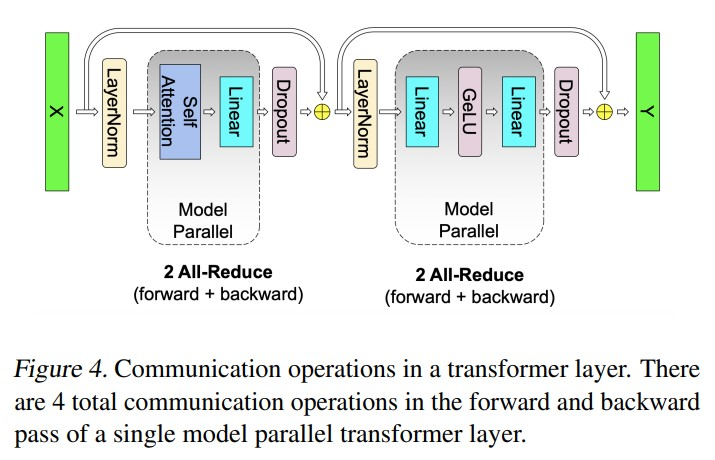

# Megatron-LM : Training Multi-Billion Parameter Language Models Using Model Parallelism

# 0 摘要
 近期在语言模型上的工作表明，训练大型Transformer模型在自然语言处理应用方面推动了技术的进步。然而，非常大的模型因为内存限制而非常难以训练。本文介绍了训练非常大型Transformer模型的技术，并实现了一种简单高效的层内模型并行方法，使得可以训练具有数十亿参数的Transformer模型。本文的方法不需要新的编译器或库变更，与流水线模型并行性是正交且互补的，并且可以通过在原生PyTorch中插入少量通信操作来完全实现。我们通过使用512个GPU收敛基于Transformer的模型，展示了这种方法，模型参数数量高达83亿。与维持39 TeraFLOPs（10^12）的强大单个GPU基线相比，我们在整个应用程序中可持续维持15.1 PetaFLOPs(10^15)，其缩放效率为76%(15.1*1000/ (39*512))，相当于峰值FLOPs的30%。为了证明大型语言模型能够进一步推动技术的最新进展，我们训练了一个83亿参数的Transformer语言模型，类似于GPT-2，并且训练了一个39亿参数的模型，类似于BERT。我们展示了在BERT类模型中仔细考虑层归一化的位置对于在模型规模增大时实现性能提升至关重要。使用GPT-2模型，我们在WikiText103数据集上取得了最新技术水平（SOTA）的结果（困惑度为10.8，相比于SOTA的15.8），并且在LAMBADA数据集上取得了最新技术水平（SOTA）的结果（准确率为66.5%，相比于SOTA的63.2%）.我们的BERT模型在RACE上实现了SOTA结果(90.9%，而SOTA的准确率为89.4%)。

*注解：困惑度（perplexity）是一种用于评估语言模型性能的指标。它衡量了模型在给定语言序列上的预测能力和不确定性。困惑度越低，表示模型对给定序列的预测越准确和自信。在语言建模任务中，困惑度被定义为给定一个测试集，对该测试集中的每个词进行预测的概率的几何平均值的倒数。具体计算方式为将模型对每个词的预测概率取对数，然后计算平均值，最后取指数得到困惑度。因此，较低的困惑度值表示模型在给定语言序列上的预测能力更好。在比较不同模型或不同设置时，较低的困惑度通常被视为更好的性能指标。*

# 1 简介
nlp 因 计算能力和数据集的增加而快速发展。计算能力和数据的丰富使得通过无监督预训练可以训练规模越来越大的语言模型。实验证据表明，对于诸如文章补全、问答和自然语言推理等自然语言处理任务，更大规模的语言模型具有显著更高的效果。近期的研究表明：通过对这些预训练的语言模型进行下游自然语言任务的微调，取得最先进的效果(sota)。<br>

随着这些模型变得越来越大，它们超过了现代处理器的内存限制，并且需要额外的内存管理技术，例如激活检查点技术（论文链接）。广泛使用的优化算法，如ADAM，需要额外的内存来存储动量和其他优化器状态（一阶矩和二阶矩），这会降低可以有效训练的模型的规模。为了克服这个限制，有几种模型并行的方法通过将模型分区，使得权重及其关联的优化器状态不需要同时存在于处理器上。这样可以在不增加内存需求的情况下实现模型的并行化。例如，GPipe（Huang等，2018年）和Mesh-Tensorflow（Shazeer等，2018年）提供了不同类型的模型并行化框架。然而，它们需要对模型进行重写，并依赖于仍在开发中的自定义编译器和框架。<br>

在这项工作中，我们采用一种简单高效的模型并行方法，使用层内模型并行（intra-layer model-parallelism）。我们利用基于Transformer的语言模型中固有的结构，实现了一个简单的模型并行方法，可以在PyTorch中高效地进行训练，而无需编写自定义的C++代码或编译器。这种方法与像GPipe这样的方法所倡导的基于流水线的模型并行方法是正交的。<br>

为了展示我们方法的可扩展性，我们首先通过在一块单独的NVIDIA V100 32GB GPU上训练一个拥有12亿参数的模型来建立一个基准。该模型可以持续达到39 TeraFLOPs的计算性能。这个性能水平相当于DGX-2H服务器上单个GPU的理论峰值浮点运算速度的30%，因此可以作为一个强有力的基准。模型放大到83亿参数，通过在512个GPU上使用8路模型并行化，我们实现了每秒高达15.1 PetaFLOPs并且持续的计算性能。这相对于单个GPU的情况下具有76%的扩展效率。图1展示了更详细的扩展结果。<br>


为了分析模型规模扩展对准确性的影响，我们同时训练了左到右的GPT-2（Radford等，2019年）语言模型以及BERT（Devlin等，2018年）双向Transformer，并在多个下游任务上进行评估。我们展示了随着模型规模增加，现有的BERT架构会导致模型性能下降。本文通过重新排列Transformer层中的层归一化（layer normalization）和残差连接（residual connection）来克服这个挑战，并且我们展示了随着模型规模增加，通过这种改变，在开发集上进行的下游任务的结果会持续改善。此外，我们还展示了我们的模型在WikiText103、LAMBADA的填空式预测准确率以及RACE阅读理解数据集上取得了测试集的最先进（SOTA）结果。<br>

本文的贡献总结如下：
- 对现有的PyTorch Transformer实现进行少量有针对性的修改，实现了一种简单高效的模型并行方法。
- 对模型并行和数据并行技术进行了深入的实证分析，并展示了使用512个GPU时高达76%的扩展效率。
- 我们展示了在BERT类模型中，对层归一化的精确放置非常关键，以实现随着模型规模增长而获得更高的准确性。
- 证明了扩展模型规模会导致GPT-2（在研究中达到83亿参数）和BERT（在研究中达到39亿参数）模型的准确性得到改善。
- 展示了我们的模型在测试集上取得了最先进的结果：在WikiText103上的困惑度（perplexity）为10.8，LAMBADA上的准确率为66.5%，RACE上的准确率为90.9%。
- 将我们的代码和训练评估流程与https://github.com/NVIDIA/Megatron-LM 一同开源。

# 2 背景和挑战
## 2.1 神经网络语言模型预训练
预训练语言模型已成为自然语言处理（NLP）研究人员工具包中不可或缺的一部分。利用大规模语料库进行预训练，学习语言的鲁棒的神经表示已成为过去十年的研究热点。早期对预训练和迁移学习语言的神经表示的研究表明，与从头开始学习的词嵌入表（embedding table）相比，预训练的词嵌入表能够提高下游任务的结果。后续的研究进一步推动了这一领域的发展，通过学习和转移能够捕捉单词上下文表示的神经模型，进一步完善了这些想法。不仅仅是将语言模型用于提取上下文词表示，而是通过端到端的方式对语言模型进行微调，以适应下游任务。通过这些研究，最先进的技术发展已经从仅仅转移词嵌入表的方法，进一步转移到了转移整个拥有数十亿参数的语言模型。这些方法的发展需要硬件、系统技术和框架能够在大规模模型上高效运行，并满足不断增长的计算需求。我们的工作旨在提供必要的工具，以在这一趋势中进一步向前迈进。<br>

## 2.2 Transformer Language Models and Multi-Head Attention
目前在自然语言处理领域的工作趋向于使用 Transformer 模型（Vaswani et al., 2017），因为它们具有卓越的准确性和计算效率。最初的Transformer结构设计为一种机器翻译架构，它通过两个部分——编码器（Encoder）和解码器（Decoder）将输入序列转换为另一个输出序列。然而，最近的研究利用Transformer进行语言建模，例如BERT（Devlin等人，2018）和GPT-2（Radford等人，2019），根据需要只使用编码器或解码器。本研究同时探索了解码器架构GPT-2和编码器架构BERT。<br>

图2显示了我们使用的模型的示意图。我们建议读者参考先前的工作，以获取对模型架构的详细描述。值得一提的是，无论是GPT-2还是BERT，它们都使用GeLU（Hendrycks和Gimpel，2016）非线性激活函数和层归一化（Ba等人，2016）作用于多头注意力和前馈层的输入上，而原始的Transformer（Vaswani等人，2017）则使用ReLU非线性激活函数，并将层归一化应用于输出上。<br>

## 2.3 Data and Model Parallelism in Deep Learning
将深度神经网络训练扩展到多个硬件加速器的过程中，存在两种核心范式：数据并行（Data Parallelism）和模型并行（Model Parallelism）。其中，数据并行(Valiant, 1990)mini-batch被分割到多个woker；模型并行内存的使用和计算分布在多个woker之间。通过将mini-batch size与可用workers节点数量成比例地增加（即弱扩展weak scaling），可以观察到在训练数据吞吐量方面近乎线性的扩展效果。然而，大批量训练会引入优化过程中的复杂性，可能导致准确性降低或收敛时间延长，从而抵消了增加训练吞吐量的好处。进一步的研究已经开发出了一些技术来减轻这些影响并降低大型神经网络的训练时间。为了进一步扩展训练规模，一项名为"parallel work"的研究（Chen等人，2016年）结合了数据并行和激活检查点技术（论文链接）：在反向传播过程中重新计算激活值，而无需在正向传播过程中存储它们，以减少内存需求。<br>
*注解：模型并行是指将模型的内存使用和计算分布在多个工作节点上的方法。在模型并行中，不同的工作节点负责处理模型的不同部分，它们之间通过通信来共享信息和计算结果。通过模型并行，可以处理更大规模的模型，因为可以将模型参数和计算负载分布在多个节点上。*

然而，这些技术在能够处理的问题规模上存在一个根本限制：模型必须完全适应单个工作节点。随着像BERT和GPT-2这样规模和复杂性不断增加的语言模型的出现，神经网络已经接近现代硬件加速器的内存容量上限。解决这个问题的一个方法是采用参数共享来减小模型的内存占用（Lan等人，2019年），但这限制了模型的总容量。我们的方法是利用模型并行技术将模型分散在多个加速器上。这不仅减轻了内存压力，还独立于mini-batch大小增加了并行性的数量。<br>

在模型并行中，还存在两种进一步的范例：层间的管道并行(pipeline parallelism)和更一般化的分布式张量计算(distributed tensor computation)。在层间管道并行中，一组算子在一个设备上执行，然后将输出（output）传递到管道中的下一个设备，该设备执行不同层的算子运算。一些方法在使用管道并行时结合了参数服务器，然而这些方法存在一致性问题。GPipe是用于TensorFlow的框架，它通过使用同步梯度下降来克服了这个一致性问题。这种方法需要额外的逻辑来处理这些通信和计算操作的高效流水线处理，并且存在会降低效率的流水线停顿或对优化器本身的修改会影响准确性的问题。<br>

分布式张量计算是一种正交且更一般化的方法，它将张量操作划分到多个设备上以加速计算或增加模型规模。FlexFlow是一个深度学习框架，用于协调这种并行计算，它提供了一种选择最佳并行化策略的方法。最近，Mesh-TensorFlow引入了一种语言，用于在TensorFlow（Abadi等人，2015年）中指定一类通用的分布式张量计算。并行维度由最终用户在语言中指定，并使用适当的集合原语（链接）编译生成图形。在这里我们用来和Mesh-TensorFlow相同的见解并且利用计算transfomer的注意力头时的并行性来优化我们的tranformer模型。然而，与其实现一个用于模型并行的框架和编译器，我们只对现有的PyTorch变换器实现进行了一些有针对性的修改。我们的方法简单，不需要新的编译器或代码重写，通过插入一些简答的通讯原语（下章节详解）就可以完全实现。<br>
*注解：在这里，"正交"是指分布式张量计算与先前讨论的管道并行和参数服务器等方法是独立且不相互依赖的。它表示分布式张量计算是一种独立的、独特的方法，与其他方法没有直接的关联或依赖关系。*

# 3 Model Parallel Transformers
我们利用Transformer网络的结构，通过添加一些同步原语，创建了一个简单的模型并行实现。一个Transformer layer由一个自注意力块和一个两层的多层感知机（MLP）组成，如图2所示。我们分别在这两个块中引入了模型并行。<br>
我们首先详细介绍MLP块。该块的第一部分是一个GEMM运算，紧接着是GeLU非线性激活函数:<br>

$$Y=GeLU(XA)\ldots\ldots(1)$$

并行化GEMM的一种选项是将权重矩阵A沿着行分割，将输入X沿着列分割为：<br>

$$X=[X_{1},X_{2}], A = \begin{bmatrix} A_{1} \\ A_{2}\end{bmatrix}\ldots\ldots(2)$$

这种分割将导致Y = GeLU(X1A1 + X2A2)。由于GeLU是一个非线性函数，GeLU(X1A1 + X2A2) $\ne$ GeLU(X1A1) + GeLU(X2A2)，因此在GeLU函数之前需要一个同步点。<br>
另一种选项是沿着列分割A，即A = [A1, A2]。这种分割使得GeLU非线性激活函数可以分别应用于每个分割的GEMM的输出：<br>

$$[Y1, Y2] = [GeLU(XA1), GeLU(XA2)] \ldots\ldots(3)$$

这种方式具有优势，因为它去除了一个同步点。因此，我们以列并行的方式对第一个GEMM进行分区，并将第二个GEMM沿着其行进行分割，以便直接使用GeLU层的输出而无需进行任何通信，如图3a所示。第二个GEMM的输出在通过丢弃层之前在GPU之间进行了规约（reduce）操作。这种方法将MLP块中的两个GEMM都在多个GPU上进行了分割，并且在前向传播中仅需要一个全局规约操作（g运算符），在反向传播中也只需要一个全局规约操作（f运算符）。这两个操作符是彼此的共轭，并且可以在PyTorch中用只有几行代码实现。以下是f运算符的一个示例实现：<br>
```python
class f(torch.autograd.Function):
  def forward(ctx, x):
    return x
  def backward(ctx, gradient):
    all_reduce(gradient)
    return gradient
```
代码1. f运算符的实现。g运算符与f类似，在反向传播中使用identity操作，在前向传播中使用全局规约函数。<br>


<center>图3. 带有模型并行的Transformer块。f和g是共轭的。在前向传播中，f是一个恒等操作符并进行全局规约，而在反向传播中，f是一个全局规约操作符并进行恒等操作。而g在前向传播中是一个全局规约操作符并进行恒等操作，而在反向传播中是一个恒等操作符。</center>

如图3b所示，对于自注意力块，我们利用多头注意力操作中固有的并行性，以列并行的方式对与关键字（K）、查询（Q）和值（V）相关的GEMM进行分区，以便每个注意力头对应的矩阵乘法在一个GPU上本地完成。这样做可以将每个注意力头的参数和工作负载分配到多个GPU上，而且不需要即时通信就可以完成自注意力计算。紧随自注意力层之后的输出线性层的后续GEMM运算是沿着行(row)并行化的，并且直接使用并行注意力层的输出作为输入，而无需在GPU之间进行通信。对于MLP和自注意力层，这种方法将两个GEMM分组合并在一起，消除了它们之间的同步点，从而实现了更好的扩展性。这使得我们可以在简单的Transformer层中执行所有的GEMM运算，只需在前向路径中进行两次全局规约，而在反向路径中进行两次全局规约（参见图4）。<br>


Transformer语言模型具有一个输出嵌入层，其维度为隐藏大小（H）乘以词汇表大小（v）。由于现代语言模型的词汇表大小通常在数万个标记的数量级上（例如，GPT-2使用的词汇表大小为50,257-->比较大），因此对输出嵌入的GEMM进行并行化是有益的。然而在transformer模型中输入层和输出层的embedding是共享权重的，需要同时做改变。我们沿着词汇（vocabulary）维度方向将embedding 权重矩阵 $E_{H x v}$ 进行并行 $E=\left[E_{1}, E_{2}\right]$(也即列方向)；由于每个分区现在只包含嵌入表的一部分，input embedding之后我们需要有做all-reduce(g 操作)。对于output embedding，一种方法是实时模型并行 $GEMM\left[Y_{1}, Y_{2}\right]=\left[X E_{1}, X E_{2}\right]$ 来获取logits，之后需要做all-gather Y=all-gather( $Y_{1}, Y_{2}$ )，最终将结果送到交叉熵损失函数。然而，在这种情况下，all-gather操作将需要通信 $b × s × v$ 个元素（其中b是批量大小，s是序列长度），这个数量非常庞大，因为词汇表大小很大。为了减少通信量，我们将并行GEMM(General Matrix Multiply)的输出[Y1，Y2]与交叉熵损失进行了融合，将维度减少为b × s。将标量损失(scalar losses)而不是logits进行通信是对通信量的巨大减少，能够提高我们的模型并行方法的效率。<br>

我们的模型并行方法的许多部分可以被描述为旨在减少通信并保持GPU计算负载的技术。其余部分，我们选择在多个GPU上复制计算，而不是让一个GPU计算部分dropout、层归一化或残差连接的结果并广播给其他GPU。具体而言，我们在每个GPU上维护了层归一化参数的副本，并在模型并行区域的输出上运行dropout和残差连接操作，然后将它们作为输入传递给下一个模型并行区域。为了优化模型，我们允许每个模型并行工作器优化其自己的参数集。由于所有的值要么是本地的，要么是在GPU上复制的，因此在这种设计中不需要通信更新的参数值。
换言之，我们通过在每个GPU上复制操作和参数来减少通信开销。这样可以避免在模型并行的过程中需要频繁地在不同GPU之间传递数据，从而提高了计算效率和训练速度。<br>

我们在附录B中进一步介绍了混合模型和数据并行处理以及随机数生成的详细信息，供参考。总的来说，我们上述描述的方法实现简单，只需要在前向传播和反向传播中添加几个额外的全局规约操作。它不需要编译器，并且与流水线模型并行相互独立且互补，这是一种被其他方法所支持的模型并行方法。<br>

# 4 setup
预训练的语言理解模型是自然语言处理和语言理解中的核心任务。语言建模有几种不同的定义方式。在这里我们关注下GPT-2 和 bert，gpt2是一个从左到右的生成式transfomer 基础语言模型，bert是一种基于mask语言模型的双向transformer模型。我们将在下一节中解释这些模型的配置，并参考原始论文获取更多详细信息。

## 4.1 训练数据集
为了收集具有长期依赖关系的大型多样化训练集，我们聚合了几个最大的语言建模数据集。我们创建了一个包含Wikipedia、cc-stories、realNews和 open web-text聚合后的数据集。为防止训练集泄露影响到我们的下游任务，我们移除了发表在WikiText103测试集的相关文章。我们还在预处理期删除了CC-Stories语料库中不必要的换行符。对于BERT模型，我们在训练数据集中包括了BooksCorpus 。然而，由于该数据集与LAMBADA任务重叠，因此被排除在GPT-2训练之外。

我们合并所有的数据集并且从聚合后的数据集中过滤掉所有tokens 数小于128的文章。由于相同的内容可能重复多次，我们过滤掉了LSH（locality sensitive
 hashing）相似度大于0.7的文本。生成的聚合语料库包含174 GB的重复数据删除文本。

## 4.2 训练优化和超参数
为例更加高效的训练模型，我们使用带动态损失缩放的汇合精度方案来利用v100的tenosor core计算单元（https://www.jianshu.com/p/315f219e0796），我们使用简单的正态分布W~N（0， 0.02）来初始化我们的权重。之后我们将short cut 前的weight 用1/（2n）**（1/2）进行缩放（N是transformer的网络层数）。对于优化器我们使用带权重衰减（λ=0.01）的Adam。另外，我们使用全局的梯度裁剪值1.0 来提高训练大模型的稳定性。所有情况下，都使用 dropout = 0.1。最后，为例更好管理内存，我们在每个transformer layer后使用activation checkpointing。

对于 GPT-2 模型，所有的训练都是在批次大小为 512 的情况下，使用由 1024 个子词单位（字符或字节）组成的序列进行的，共进行了 300,000 次迭代。我们使用学习率为 1.5e-4，并在接下来的 297,000 次迭代中进行单循环余弦衰减，之前有一个 3,000 次迭代的预热阶段。学习率达到1e-5时停止衰减。

对于 BERT 模型，我们主要遵循了（Lan 等人，2019）中描述的训练过程。我们使用原始的 BERT 词典，词汇大小为 30,522。此外，根据（Lan 等人，2019）的建议，我们将下一个句子预测头替换为句子顺序预测，并使用了（Joshi 等人，2019）的整词 n-gram 掩码。对于所有情况，我们将批次大小设置为 1024，并使用学习率为 1.0e4，在 10,000 次迭代中进行预热，并在 2,000,000 次迭代中线性衰减。其他训练参数与（Devlin 等人，2018）保持相同。

# 5 试验结果

我们所有的试验使用共达32个DGX-2H的服务器（一共包含512块显存为32GB的Tesla V100 SXM3）。我们的基础架构用于优化多节点深度学习应用，服务器内GPU间通过NVSwitch链接带宽可达到300GB/sec ，服务器间通过每个服务器上的8个InfiniBand 适配器链接，带宽可达到100GB/sec.<br>

## 5.1 扩展分析

为测试本文方案的扩展性，我们使用四组参数（表1）来测试GPT-2模型。为了在自注意力机制中维持GEMM的一致性，每个注意力头的hidden size维持在96，通过改变头的个数和层的数目来配置参数量的范围从1 billion 到 8 billion。1.2billion参数量配置的方案使用1个GPU，而8billion参配置的方案需要8路模型并行（8GPUs）。原始的词汇数为50257，然而，为了在logit层有高效的GEMM操作，每个GPU上词汇表的尺寸是128的倍数是有益的。因为我们用8路模型并行来做的研究，我们将词汇表进行pad以使其可以被128x8=1024整除，如此最终词汇表size 为 51200. 我们同时研究了模型并行和模型+数据并行扩展。 对于模型并行扩展，在所有配置中使用固定的batch=8。数据并行扩展在训练多个sota模型中是必须的，这些模型使用更大的global batch size。最终，在模型+数据并行情况下，我们将所有测试的global batch固定到512，对应于64路的数据并行。


### 5.1.1 模型和数据并行
在本节中，我们将展示针对模型参数的弱扩展，在模型并行和模型+数据并行的情况下进行。弱扩展（弱扩展（weak scaling）是指在并行计算中的一种扩展方式，其中问题规模随着计算资源的增加而相应地增加。简单来说，弱扩展旨在保持每个处理器或计算节点处理的工作量不变，只是增加了处理器或计算节点的数量。）典型用于batch-size的缩放。然而，这种方法无法解决无法适应单个GPU的大型模型的训练问题，并且对于较大的批次大小会导致训练收敛性下降。相比之下，我们在这里采用弱扩展来训练原本不可能实现的更大型的模型。所有扩展数据的基准是表格1中的第一个配置（12亿参数），在单个GPU上运行。这是一个强有力的基准，因为它在整个训练过程中实现了39 TeraFLOPS的计算性能，这相当于DGX-2H服务器上单个GPU的理论峰值FLOPS的30%。<br>
图5显示了模型并行和模型+数据并行的扩展数值。我们观察到在两种设置下都有出色的扩展效果。例如，具有83亿参数和8路（8个GPU）模型并行的情况下，实现了77%的线性扩展。模型+数据并行需要进一步的梯度通信，因此扩展数值略有下降。然而，即使在最大的配置（83亿参数）下运行512个GPU，相对于强单个GPU基准配置（12亿参数）的线性扩展，我们也实现了74%的扩展效果。附录D提供了进一步的扩展分析。<br>


## 5.2 使用 GPT-2 进行语言建模的结果
为了证明大型语言模型可以进一步推动技术的发展，我们考虑训练 GPT-2 模型，其大小和配置如表2所示。355M 模型在大小和配置上与 BERT-Large 模型（Devlin 等人，2018）相当。2.5B 模型比先前最大的 GPT-2 模型更大，而8.3B 模型则比我们所了解的任何从左到右的 Transformer 语言模型都要大。为了训练和评估我们的语言模型，我们使用了第4节中描述的步骤和过程。表2还列出了推进一个epoch所需的时间，相当于68,507次迭代。例如，对于在512个GPU上的8.3B模型，每个epoch大约需要两天的时间。与我们在表1中用于扩展研究的配置相比，每个epoch的时间大大降低，配置情况如下：2.5B模型相同，8.3B模型的注意力头减少到了24个，而355M模型则比以前任何模型都要小得多，但仍使用64个GPU进行训练。


图6显示了验证困惑度与迭代次数的关系。随着模型规模的增加，验证困惑度（validateion set perplexity）降低，并且对于8.3B模型，验证困惑度降至9.27。我们在表3中报告了在LAMBADA和WikiText103数据集上训练模型的零样本评估结果。有关评估方法的更多细节，请参见附录E。我们观察到，增加模型规模也会导致WikiText103的困惑度降低以及LAMBADA任务的填空准确性提高的趋势。我们的8.3B模型在适当调整的困惑度为10.81时，在WikiText103测试集上实现了最先进的困惑度表现。在66.51%的准确率下，8.3B模型也超过了先前在LAMBADA任务上的填空准确性结果。附录C中包含了从83亿参数模型生成的样本。最近，微软与NVIDIA合作使用Megatron训练了一个拥有170亿参数的GPT-2模型，名为Turing-NLG（Microsoft，2020），并展示了随着模型规模扩大，准确性进一步提高的结果，突显了更大模型的价值。
为了确保我们不在测试集中训练任何数据，我们按照之前的研究所做的方式，计算测试集中出现在我们训练集中的8-gram的百分比。WikiText103测试集最多有10.8%的重叠，而LAMBADA测试集（Paperno等人，2016）最多有1.4%的重叠。我们应该注意到，WikiText103测试集已经与WikiText103训练集有9.09%的重叠（Radford等人，2019）。由于这与之前的研究结果一致，我们有信心确保我们的训练数据中没有无意中包含测试数据中的文档。


## 5.3 使用BERT的双向Transformer结果展示
在本节中，我们将我们的方法应用于BERT风格的Transformer模型，并研究模型规模对多个下游任务的影响。之前的研究（Lan等人，2019）发现，将模型规模增加到超过具有336M参数的BERT-large会导致意外的模型退化。为了解决这种退化，该研究的作者引入了参数共享，并展示了与原始BERT模型相比，他们的模型在规模上表现更好。<br>
我们进一步研究了这种行为，并凭经验证明，如图7所示，重新排列laynorm（层归一化）和残差连接的顺序对于实现BERT风格模型的扩展至BERT-Large之外至关重要。图7中的架构（b）消除了使用原始BERT架构（a）时观察到的不稳定性，并且具有更低的训练损失。据我们所知，我们是第一个报告这种变化可以训练更大的BERT模型的研究者。<br>

使用图7(b)中的架构变化，我们考虑了表4中详细介绍的三种不同情况。336M模型与BERT-large大小相同。1.3B模型与之前显示结果较差的336M BERT-large模型（Lan等人，2019）相同。我们进一步通过增加隐藏大小和层数来扩展BERT模型，得到3.9B参数的情况。在所有情况下，每个注意力头的隐藏大小保持为64。336M和1.3B模型进行了200万次迭代的训练，而3.9B模型进行了150万次迭代的训练，并且仍在训练中。<br>


在一个占3%的保留集上，336M、1.3B和3.9B模型分别实现了1.58、1.30和1.16的验证集困惑度，随着模型规模的增大而单调递减。我们在几个下游任务上对经过训练的模型进行了微调，包括来自GLUE基准测试的MNLI和QQP（Wang等人，2019），来自斯坦福问答数据集的SQuAD 1.1和SQuAD 2.0（Rajpurkar等人，2016；2018），以及阅读理解RACE数据集（Lai等人，2017）。对于微调，我们遵循与（Liu等人，2019b）相同的过程。我们首先对批量大小（batch size）和学习率（learning rate）进行超参数调优。一旦我们得到最佳数值，我们会报告使用5个不同的随机种子进行初始化的开发集中位数结果。每个模型和任务使用的超参数在附录A中提供。表5显示了MNLI、QQP、SQuAD 1.1和SQuAD 2.0的开发集结果，以及RACE的测试集结果。对于RACE的测试集结果，我们首先使用开发集找到在5个随机种子上得到中位数分数的检查点，然后报告该检查点在测试集上的结果。我们还报告了SQuAD的开发集和RACE的测试集的五路集成结果。从表5中我们观察到：(a) 随着模型规模的增加，在所有情况下下游任务的性能都有所提高，(b) 相比其他基于BERT的模型，我们的3.9B模型在开发集上取得了最先进的结果，(c) 我们的3.9B模型在RACE测试集上既实现了单模型的最先进结果，也实现了集成的最先进结果。<br>


# 6 结论和展望
在这项工作中，我们通过对现有的PyTorch Transformer实现进行一些修改，成功地克服了传统的每个模型单GPU训练的限制，实现了模型并行。我们使用512个NVIDIA V100 GPU和8路模型并行，在整个应用程序中持续达到了高达15.1 PetaFLOPs的计算性能，高效地训练了基于Transformer的模型，参数规模达到了83亿。我们还展示了对于BERT模型来说，仔细考虑层归一化在BERT风格模型中的位置对于随着模型规模增大而实现增加的准确性至关重要。我们研究了模型规模对下游任务准确性的影响，并在下游任务上取得了非常出色的结果，并为WikiText103、LAMBADA和RACE数据集建立了新的最先进模型。最后，我们开源了我们的代码，以便未来的工作能够利用模型并行Transformer。
未来的工作方向有几个。继续增加预训练的规模是一个有前途的研究方向，它将进一步测试现有的深度学习硬件和软件。要实现这一点，需要改进优化器的效率和内存占用。此外，训练一个具有超过160亿参数的模型将需要比DGX-2H盒子上的16个GPU可用内存更多。对于这样的模型，混合的层内和层间模型并行以及节点间模型并行将更加合适。另外三个研究方向包括：(a) 针对不同的模型家族（如XLNet、T5）进行预训练，(b) 在更困难和多样化的下游任务中评估大型模型的性能（例如生成式问答、摘要和对话），以及(c) 使用知识蒸馏从这些大型预训练的教师模型训练小型学生模型。<br>