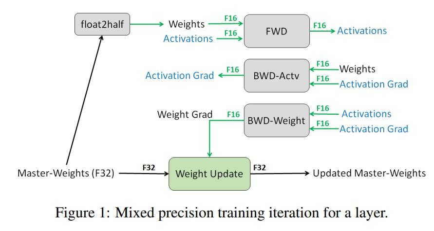
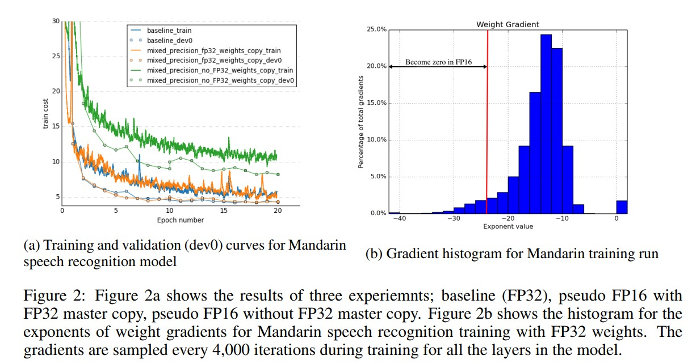
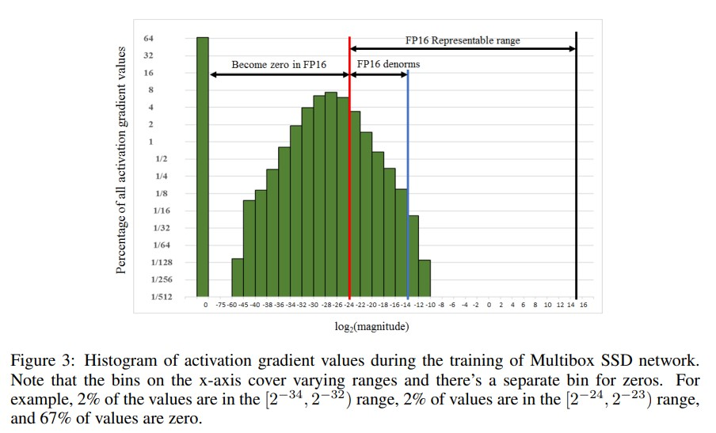
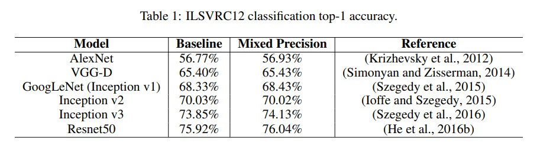
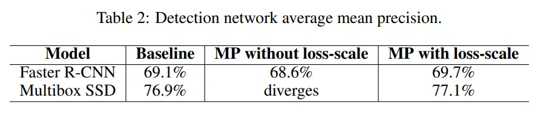
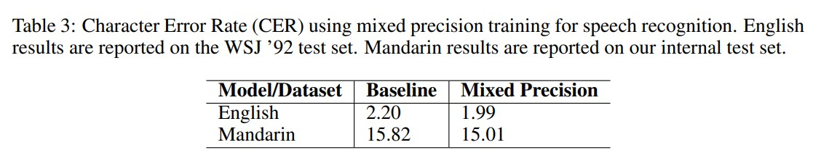
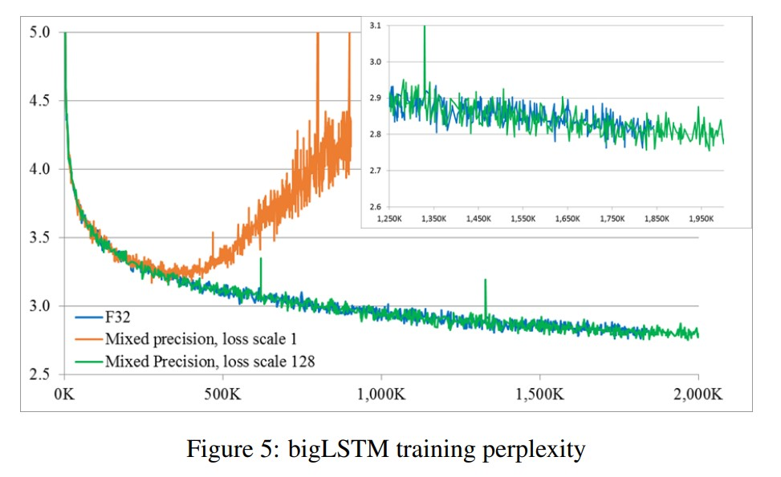
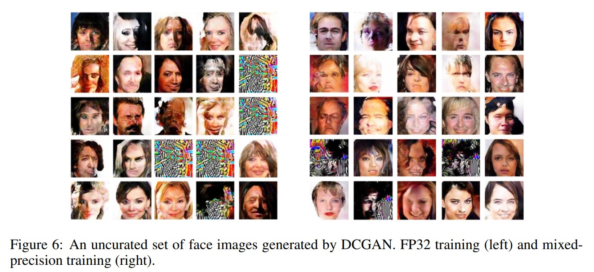

# 混合精度训练(MIXED PRECISION TRAINING)

# 摘要：
&nbsp;&nbsp;&nbsp;&nbsp;&nbsp;&nbsp;&nbsp;&nbsp;增加神经网络的大小通常可以提高准确性，但也会增加训练模型的内存和计算需求。我们引入了一种使用半精度浮点数训练深度神经网络的方法，既不会丢失模型准确性，也不需要修改超参数。这几乎将内存需求减少了一半，并且在最新的GPU上加快了计算速度。权重、激活和梯度以IEEE半精度格式存储。由于该格式的范围比单精度要**窄**，我们提出了**三种**防止关键信息丢失的技术。首先，我们建议在每个优化器步骤(step)之后保持(maintaining)一个单精度的权重副本用于梯度的累积（此副本在前向传播和反向传播时舍入(rounded)为半精度）。其次，我们提出了**损失缩放(loss-scaling)来保留具有较小幅度的梯度值**。第三，我们使用半精度算术进行计算，并将计算结果累积到单精度的输出中，然后在存储到内存之前将这些单精度的输出转换为半精度。我们证明了所提出的方法在各种任务和现代大规模（超过1亿个参数）的模型架构上都适用，这些模型在大型数据集上进行训练。 

# 1 引言
&nbsp;&nbsp;&nbsp;&nbsp;&nbsp;&nbsp;&nbsp;&nbsp;深度学习在许多不同的应用中取得了进展，包括图像识别（He等，2016a），语言建模（Jozefowicz等，2016），机器翻译（Wu等，2016）和语音识别（Amodei等，2016）。这些成果中有两个关键趋势：越来越大的训练数据集和越来越复杂的模型。例如，在Hannun等人（2014）中使用的神经网络有1100万个参数，而在Amodei等人（2016）的双向RNN模型中增长到约6700万个参数，最新的单向门控循环单元（GRU）模型中进一步增长到1.16亿个参数。 
&nbsp;&nbsp;&nbsp;&nbsp;&nbsp;&nbsp;&nbsp;&nbsp;较大的模型通常需要更多的计算和内存资源来进行训练。通过使用降低精度的表示和算术运算，可以降低这些需求。任何程序的性能（速度），包括神经网络的训练和推理，都受到三个因素之一的限制：**算术带宽、内存带宽或延迟**。降低精度可以解决其中两个限制因素。通过使用较少的位数存储相同数量的值，可以降低内存带宽压力。在支持降低精度数学运算的处理器上，算术运算的时间也可以降低。例如，最近的GPU中，**半精度数学运算的吞吐量比单精度高2倍到8倍**。除了提高速度，降低精度的格式还可以减少训练所需的内存量。 
&nbsp;&nbsp;&nbsp;&nbsp;&nbsp;&nbsp;&nbsp;&nbsp;现代深度学习训练系统通常使用单精度（FP32）格式。在本文中，我们解决了在保持模型准确性的同时使用降低精度进行训练的问题。具体而言，我们使用IEEE半精度格式（FP16）对各种神经网络进行训练。由于FP16格式的动态范围比FP32更窄，我们引入了三种技术来防止模型准确性损失：**在FP32中保持权重的主副本**，**通过损失缩放来最小化梯度值为零**，以及**在FP32中进行累积的FP16算术(算术运算)**。使用这些技术，我们证明了可以训练各种网络架构和应用，并达到与FP32训练相当的准确性。实验结果包括卷积网络和循环网络架构，用于分类、回归和生成任务。应用领域包括图像分类、图像生成、目标检测、语言建模、机器翻译和语音识别。所提出的方法不需要对模型或训练超参数进行任何更改。 

# 2 相关工作
&nbsp;&nbsp;&nbsp;&nbsp;&nbsp;&nbsp;&nbsp;&nbsp;关于使用降低精度训练卷积神经网络（CNN）的研究已经有很多发表的论文。Courbariaux等人（2015）提出了使用二值权重进行训练，而其他张量和算术运算则采用完整精度。Hubara等人（2016a）扩展了这项工作，将激活值也进行了二值化，但梯度存储和计算仍使用单精度。Hubara等人（2016b）考虑了将权重和激活值量化为2、4和6位，而梯度则为实数。Rastegari等人（2016）将所有张量（包括梯度）进行了二值化。然而，所有这些方法在训练更大的CNN模型进行ILSVRC分类任务（Russakovsky等，2015）时都会导致非常明显的准确性损失。Zhou等人（2016）将权重、激活值和梯度量化为不同的位数，以进一步提高结果的准确性。但这仍然会导致一定的准确性损失，并且需要在每个网络上搜索位宽配置，对于较大的模型来说可能不实际。Mishra等人通过在流行的CNN中将层的宽度增加一倍或三倍，改进了之前对权重和激活值量化所达到的Top-1准确性。然而，梯度仍然使用单精度进行计算和存储，而量化模型的准确性低于加宽基准模型的准确性。Gupta等人（2015）**证明了16位定点表示可以用于在MNIST和CIFAR-10数据集上训练CNN而不会损失准确性**。目前还不清楚这种方法在在大型数据集上训练的较大CNN上的效果如何，以及它是否适用于循环神经网络（RNNs）。 
&nbsp;&nbsp;&nbsp;&nbsp;&nbsp;&nbsp;&nbsp;&nbsp;也有几个提议对RNN训练进行量化。He等人（2016c）训练了GRU（Cho等，2014）和长短期记忆（LSTM）（Hochreiter和Schmidhuber，1997）单元的量化变体，以减少权重和激活值的位数，尽管会略微损失准确性。目前还不清楚他们的结果是否适用于需要更大网络来处理更大数据集的情况。Hubara等人（2016b）提出了另一种在不改变RNN结构的情况下量化RNN的方法。Ott等人（2016）提出了另一种量化RNN的方法。他们评估了在不同的RNN模型（用于语言建模和语音识别）中对权重进行二值化、三值化和指数化量化的效果。所有这些方法都保持了梯度在单精度中不变，因此在反向传播过程中的计算成本没有改变。 
&nbsp;&nbsp;&nbsp;&nbsp;&nbsp;&nbsp;&nbsp;&nbsp;这篇论文提出的技术与上述方法在三个方面有所不同。首先，我们在前向和反向传播中使用了降低精度（在我们的情况下是FP16）的所有张量和算术运算。其次，没有调整超参数（如层宽）。最后，与单精度基准模型相比，使用这些技术训练的模型**不会损失准确性**。我们证明了这种技术在使用大规模数据集训练的最先进模型的各种应用中都是有效的。 

# 3 实施细节
&nbsp;&nbsp;&nbsp;&nbsp;&nbsp;&nbsp;&nbsp;&nbsp;我们介绍了使用FP16进行训练的关键技术，同时保持与FP32训练相匹配的模型准确性：单精度主权重和更新(updates --> grad)、损失缩放以及将FP16乘积累积到FP32中。使用这些技术进行训练的结果将在第4节中呈现。 

## 3.1 FP32权重的主副本
&nbsp;&nbsp;&nbsp;&nbsp;&nbsp;&nbsp;&nbsp;&nbsp;在混合精度训练中，**权重、激活值和梯度都以FP16格式存储**。为了与FP32网络的准确性相匹配，**在优化器步骤中使用FP32的主权重副本，并将其与权重梯度进行更新**。在每个迭代中，FP16的主权重副本用于前向和反向传播，减少了FP32训练所需的存储和带宽。图1说明了这个混合精度训练过程。 

&nbsp;&nbsp;&nbsp;&nbsp;&nbsp;&nbsp;&nbsp;&nbsp;虽然并非所有网络都需要FP32主权重，但有两个可能的原因解释为什么一些网络需要它。 
-**溢出错误** 一个解释是更新（权重梯度乘以学习率）变得太小，无法用FP16表示 - 任何幅度小于 $2^{−24}$ 的值将在FP16中变为零。从图2b可以看出，**大约有5%的权重梯度值的指数小于−24**.这些小值梯度在与学习率相乘时会变为零，并对模型的准确性产生不利影响。使用单精度副本来进行更新可以解决这个问题并恢复准确性。 
*注释：fp16低精度带来的两个问题：1.溢出错误：fp16能表示的最小数为 $2^{-24}$, 比这个数还小时出现下溢出；2. 舍入误差：fp16的数据间隔是 $2^{-14}$ 。*  

- **舍入误差** 另一个解释是权重值与权重更新值(weight update value)之间的**比值非常大**。在这种情况下，即使权重更新(weight update)在FP16中可表示，当加法操作将其(梯度更新)右移以使二进制点与权重(weight)对齐时，它可能仍然变为零。这种情况可能发生在归一化的权重值的幅度至少比权重更新大2048倍的情况下。由于FP16具有10 bit 的尾数(mantissa)位，隐式位(10个小数位的第一个位置)必须右移11个或更多位置才能可能变为零（在某些情况下，舍入可以恢复值）。在比值大于2048的情况下，隐式位将右移12个或更多位置。这将导致权重更新变为零，无法恢复。对于非归一化的数字，更大的比值将产生相同的效果。同样，可以通过在FP32中计算更新(weight updtate)来抵消这种效应。 
*注释：2^(-14)~2^16之间有30个区间：$2^{-14}~2^{-13}, 2^{-13}~2^{-12}, ......, 2^{-1}~1, 1~2, 2~4, ......, 2^{15}~2^{16}$ ，不管区间的大小，float都会把这个区间分为2^m即1024份；造成每个范围内数据间隔不同；当两个相差很多的数相加时，要服从最大数所在区间的间隔，这样小的数很容易被忽略造成舍入误差, 因此：混合精度训练时乘法可以用低精度，而加法必须要用高精度。*  
*参考：https://blog.csdn.net/guanyonglai/article/details/127058613*  

&nbsp;&nbsp;&nbsp;&nbsp;&nbsp;&nbsp;&nbsp;&nbsp;为了说明需要使用FP32主权重副本，我们使用普通话语音模型(Mandarin speech model)对800小时的语音数据集进行了20个epoch的训练（更详细的描述在第4.3节中）。如图2a所示，在进行FP16前向和反向传递后，更新FP32主权重副本可以达到与FP32训练结果相匹配的效果，而直接更新FP16权重则导致了80%的相对准确性损失。 
&nbsp;&nbsp;&nbsp;&nbsp;&nbsp;&nbsp;&nbsp;&nbsp;尽管保留额外的权重副本与单精度训练相比会使权重的内存需求增加50%，但对整体内存使用的影响要小得多。在训练过程中，内存消耗主要由激活值(activation)所主导，这是由于更大的批量大小和每个层的激活值被保存以便在反向传播过程中重复使用。由于激活值也以半精度格式（FP16）存储，因此用于训练深度神经网络的总体内存消耗大约减少了一半。 

# 3.2 损失缩放
&nbsp;&nbsp;&nbsp;&nbsp;&nbsp;&nbsp;&nbsp;&nbsp;FP16指数偏置(b)将归一化值指数的范围调整为[-14, 15]，而实际上梯度值往往被小的幅度所主导（负指数）。例如，考虑图3显示的**激活梯度值**的直方图，该直方图是在Multibox SSD检测器网络（Liu等，2015a）的FP32训练过程中收集到的。请注意，**很大一部分FP16可表示范围未被使用，而许多值低于最小可表示范围，并变为零**。通过**缩放梯度**，可以将其移动到更广的可表示范围内，并保留否则将变为零的值。这个特定的网络在不进行梯度缩放时发散，但将梯度缩放因子设为8（将指数增加3）足以达到与FP32训练相匹配的准确性。这表明在这个模型的训练中，幅度小于 $2^{-27}$ 的激活梯度值是无关紧要的，但在[ $2^{-27}$ ，$2^{-27}$ )范围内的值是重要的，并需要保留。 

&nbsp;&nbsp;&nbsp;&nbsp;&nbsp;&nbsp;&nbsp;&nbsp;一种有效的方法是在进行反向传播之前，通过在前向传递中计算的**损失值进行缩放**，将梯度值移动到FP16可表示的范围内。通过链式法则，反向传播确保所有梯度值按相同的比例进行缩放。这在反向传播过程中不需要额外的操作，并且可以防止相关的梯度值变为零。在权重更新之前，必须对权重梯度进行缩放以保持更新幅度与FP32训练中的一致性。最简单的方法是在反向传播**后**但梯度剪裁或其他与梯度相关的计算之**前**进行这种缩放，确保不需要调整任何超参数（如梯度剪裁阈值、权重衰减等）。 
&nbsp;&nbsp;&nbsp;&nbsp;&nbsp;&nbsp;&nbsp;&nbsp;选择损失缩放因子有几种方式。最简单的方法是选择一个固定的(constant)缩放因子。我们使用了各种缩放因子进行了多种网络的训练，这些因子的范围从8到32,000不等(许多网络不需要缩放因子)。可以根据经验选择一个固定的缩放因子，或者如果有梯度统计信息可用，可以直**接选择一个因子，使其与最大梯度绝对值的乘积低于65,504（FP16可表示的最大值）即可**。只要在反向传播过程中不会导致溢出，选择一个较大的缩放因子没有任何不利之处。**溢出会导致权重梯度中出现无穷大和NaN值**，这将对权重进行不可逆的损坏。请注意，通过检查计算得到的权重梯度，可以有效地检测到溢出，例如，在对权重梯度值进行缩放时。一种选择是在检测到溢出时跳过权重更新，并继续进行下一次迭代。 

# 3.3 运算精度(arithmetic precision)
&nbsp;&nbsp;&nbsp;&nbsp;&nbsp;&nbsp;&nbsp;&nbsp;从大体上讲，神经网络的算术运算可以分为三类：向量点积(vector dot products)、归约(reductions)和逐点操作(pointwise operations)。在使用低精度运算时，这些类别需要采取不同的处理方式。为了保持模型的准确性，我们发现一些网络要求将FP16向量点积的部分乘积累加到一个FP32值中，然后在写入内存之前将其转换为FP16。**如果没有在FP32中进行这种累加，某些FP16模型的准确性将无法与基准模型匹配**。与**以前的GPU只支持FP16的乘加**操作不同，**NVIDIA Volta GPU引入了张量核心（Tensor Cores），可以将FP16输入矩阵相乘并将乘积累加到FP16或FP32输出中（NVIDIA，2017年）**。 
&nbsp;&nbsp;&nbsp;&nbsp;&nbsp;&nbsp;&nbsp;&nbsp;大规模的归约（如对向量元素求和）应该在FP32下进行。这样的归约通常出现在批归一化层（用于累积统计信息）和softmax层中。我们的实现中，这两种类型的层仍然从内存中读取和写入FP16张量，但**在FP32下进行算术运算**。由于这些层受到内存带宽限制，对算术速度并不敏感，因此这并不会减慢训练过程。 
&nbsp;&nbsp;&nbsp;&nbsp;&nbsp;&nbsp;&nbsp;&nbsp;pointwise操作，例如非线性函数和逐元素矩阵乘积，受限于内存带宽。由于算术精度不会影响这些操作的速度，因此可以使用FP16或FP32进行运算。在这些操作中，算术精度的选择取决于具体情况，可以根据需求使用FP16或FP32的数学运算。 

# 4 结果
&nbsp;&nbsp;&nbsp;&nbsp;&nbsp;&nbsp;&nbsp;&nbsp;我们对各种深度学习任务进行了实验，涵盖了广泛的深度学习模型。针对每个应用，我们进行了以下实验： 

- 基准实验（FP32）：激活值、权重和梯度均使用单精度存储。所有的算术运算也都采用FP32。 
- 混合精度（MP）：存储(storage)和算术(arthimetic)运算使用FP16。权重、激活值和梯度都使用FP16进行存储，而使用FP32的主要权重副本用于更新。对于某些应用，使用了损失缩放。在使用FP16进行算术运算的实验中，卷积、全连接层以及循环层中的矩阵乘积等操作使用了张量核心（Tensor Core），并将结果累加到FP32中。 

&nbsp;&nbsp;&nbsp;&nbsp;&nbsp;&nbsp;&nbsp;&nbsp;基准实验是在NVIDIA的Maxwell或Pascal GPU上进行的。混合精度实验是在能够将FP16产品累加到FP32的Volta V100上进行的。混合精度语音识别实验（第4.3节）是使用Maxwell GPU进行的，仅使用FP16存储。这种设置允许我们在非Volta硬件上模拟TensorCore操作。许多网络在这种模式下进行了训练，以确认所得到的模型准确性与在Volta V100 GPU上运行的混合精度训练相等。这是合理的，因为**混合精度算术在内存写入之前将FP16产品累加到FP32**，然后将结果转换为FP16。 

## 4.1 用于ILSVRC 分类的CNN
&nbsp;&nbsp;&nbsp;&nbsp;&nbsp;&nbsp;&nbsp;&nbsp;我们使用混合精度训练了几个用于ILSVRC分类任务（Russakovsky et al.，2015）的CNN模型：Alexnet、VGG-D、GoogLeNet、Inception v2、Inception v3和预激活Resnet-50。在所有这些情况下，我们能够使用相同的超参数与基准FP32训练会话相匹配的top-1准确率。网络使用修改后的Caffe（Jia et al.，2014）框架进行训练，以使用Volta TensorOps，仅Resnet50使用了PyTorch（Paszke et al.，2017）。如果有的话，我们使用了来自公共代码库的训练计划（VGGD的训练计划尚未发布）。表1显示了在ILSVRC验证集上的top-1准确率。由于单裁剪测试和简化的数据增强，某些情况下基准（FP32）的准确率与已发布的结果不同。我们在Caffe中的数据增强包括从256x256图像中进行随机水平翻转和随机裁剪，而PyTorch中的Resnet50训练使用了PyTorch视觉代码库中的完整增强脚本。 

&nbsp;&nbsp;&nbsp;&nbsp;&nbsp;&nbsp;&nbsp;&nbsp;这些成功网络的混合精度训练过程中，不需要使用损失缩放技术。虽然在前向传播和反向传播过程中，所有张量都是FP16格式的，但权重的主要副本按照第3.1节的描述进行FP32更新。 

## 4.2 检测卷积网络
&nbsp;&nbsp;&nbsp;&nbsp;&nbsp;&nbsp;&nbsp;&nbsp;目标检测是一项回归任务，网络通过预测边界框坐标值来实现目标检测（相对于分类任务，其中预测的值会通过softmax层转换为概率）。目标检测器还具有分类组件，用于为每个边界框预测目标类型的概率。我们训练了两种流行的目标检测方法：Faster-RCNN（Ren et al.，2015）和Multibox-SSD（Liu et al.，2015a）。这两个检测器都使用VGG-16网络作为骨干网络。模型和训练脚本来自公共代码库（Girshick；Liu）。在Pascal VOC 2007测试集上计算了平均精度均值（mAP）。Faster-RCNN在VOC 2007训练集上进行训练，而SSD在VOC 2007和2012数据的并集上进行训练，这是表2中基准mAP差异的原因。

&nbsp;&nbsp;&nbsp;&nbsp;&nbsp;&nbsp;&nbsp;&nbsp;如表2所示，如果没有进行损失缩放，SSD检测器无法在FP16下进行训练。因为FP16将小梯度值变为零，如第3.2节所述，会导致学习到不好的权重，并且训练会发散。如第3.2节所述，损失缩放因子设为8可以恢复相关的梯度值，并且混合精度训练与FP32的mAP相匹配。 

## 4.3 语音识别
&nbsp;&nbsp;&nbsp;&nbsp;&nbsp;&nbsp;&nbsp;&nbsp;我们使用DeepSpeech-2模型探索了语音数据的混合精度训练，包括英语和汉语数据集。用于英语数据集训练的模型包括两个2D卷积层、三个带有GRU单元的循环层、1个行卷积层和连接时序分类（CTC）成本层（Graves et al.，2006）。它大约有1.15亿个参数。该模型是在我们的内部数据集上进行训练的，该数据集包含6000小时的英语语音。汉语模型具有类似的架构，总共有2.15亿个参数。汉语模型是在我们的内部训练集上进行的，该训练集包含2600小时的语音数据。对于这些模型，我们进行了基准实验和伪FP16实验。所有模型都使用Nesterov随机梯度下降（SGD）进行了20个周期的训练。所有超参数，如学习率、退火计划和动量，在基准实验和伪FP16实验中都是相同的。表3显示了这些实验在独立的测试集上的结果。

&nbsp;&nbsp;&nbsp;&nbsp;&nbsp;&nbsp;&nbsp;&nbsp;与分类和检测网络类似，混合精度训练在大规模语音数据集上训练的递归神经网络中表现良好。这些语音模型是使用这种技术训练的最大模型。此外，与使用递归层的其他应用程序相比，训练语音模型所涉及的时间步(time-steps)数异常庞大。如表3所示，伪FP16的结果大约比基准结果好5%到10%。这表明**半精度存储格式可能在训练过程中起到了正则化的作用**。 

## 4.4 机器翻译
&nbsp;&nbsp;&nbsp;&nbsp;&nbsp;&nbsp;&nbsp;&nbsp;对于语言翻译任务，我们在TensorFlow教程中训练了几个模型变体，用于英语到法语的翻译（Google）。该模型使用了词汇表，英语和法语的词汇表分别包含了10万和4万个词条。我们训练的网络中，编码器和解码器分别有3层或5层。在两种情况下，每个层都由1024个LSTM单元组成。我们使用SGD优化器在WMT15数据集上进行训练。相同设置下不同训练会话的准确性存在明显的变化。例如，参考图4中的三条FP32曲线，它展示了3层模型的情况。使用损失缩放的混合精度训练可以与FP32的结果相匹配，而没有使用损失缩放会导致结果略微下降。5层模型表现出相同的训练行为。 

## 4.5 语言模型
&nbsp;&nbsp;&nbsp;&nbsp;&nbsp;&nbsp;&nbsp;&nbsp;我们在10亿词数据集上训练了英语语言模型，称为bigLSTM（Jozefowicz et al.，2016）。该模型包含两层8192个LSTM单元，并投影到一个1024维的嵌入空间。该模型使用Adagrad优化器进行了50个epoch的训练。词汇表大小为793K个单词。在训练过程中，我们使用了一个包含8K个负样本的采样softmax层。在4个GPU上聚合的批量大小为1024。为了与FP32的困惑度训练相匹配，使用FP16进行训练**需要进行损失缩放**，如图5所示。如果没有进行损失缩放，FP16训练的困惑度曲线会在300K次迭代后与FP32训练相比发散。缩放因子为128可以恢复所有相关的梯度值，FP16训练的准确性与基准运行相匹配。 

## 4.6 DCGAN 结果
&nbsp;&nbsp;&nbsp;&nbsp;&nbsp;&nbsp;&nbsp;&nbsp;生成对抗网络（GANs）在训练过程中结合了回归和判别任务。对于图像任务，生成器网络通过回归像素颜色来生成图像。在这种情况下，生成器预测每个通道的8位颜色值。我们使用DCGAN方法（Radford et al.，2015）和CelebFaces数据集（Liu et al.，2015b）训练网络，生成128x128像素的人脸图像。生成器包含7层分数步幅卷积，其中6层使用leaky ReLU激活函数，1层使用tanh激活函数。判别器包含6个卷积层和2个全连接层。除了判别器的最后一层使用sigmoid激活函数外，所有层都使用leaky ReLU激活函数。批量归一化应用于除判别器的最后一个全连接层以外的所有层。我们使用Adam优化器进行了10万次迭代的训练。在图6中展示了一组输出图像。请注意，我们展示的是随机选择的一组输出图像，而GAN的研究论文通常会通过排除质量较差的示例来展示挑选出的输出图像。与本文涵盖的其他网络不同，GAN的结果质量没有被广泛接受的量化标准。从质量上看，FP32和混合精度训练的输出结果是可比较的。该网络不需要进行损失缩放以匹配FP32的结果。 

# 5 结论和未来工作
&nbsp;&nbsp;&nbsp;&nbsp;&nbsp;&nbsp;&nbsp;&nbsp;混合精度训练是一种重要的技术，它可以减少深度神经网络的内存消耗以及内存和算术操作所需的时间。我们已经证明，使用这种技术可以在不进行任何超参数调整的情况下训练许多不同的深度学习模型，并且不会损失准确性。对于某些具有大量小梯度值的模型，我们引入了梯度缩放方法，以帮助它们达到与FP32基准模型相同的准确性。 
&nbsp;&nbsp;&nbsp;&nbsp;&nbsp;&nbsp;&nbsp;&nbsp;在Volta GPU上使用DeepBench对深度神经网络（DNN）操作进行基准测试，如果操作受限于内存或算术带宽，与FP32实现相比，可以实现2-6倍的加速。如果操作受限于延迟，加速度会较低。对于混合精度的网络训练和推理速度的提升取决于库和框架对混合精度的优化，这也是未来工作的重点（本文实验使用的是早期版本的库和框架）。 
*注释：https://github.com/baidu-research/DeepBench*  

&nbsp;&nbsp;&nbsp;&nbsp;&nbsp;&nbsp;&nbsp;&nbsp;我们还希望将这项工作扩展到包括生成模型，例如文本到语音系统和深度强化学习应用。此外，**自动化损失缩放因子**的选择将进一步简化混合精度训练。通过检查权重梯度是否溢出，可以**动态地增加或减小损失缩放因子**，并在检测到溢出时跳过权重更新。这样可以更加灵活地控制损失缩放，提高训练的稳定性。 
