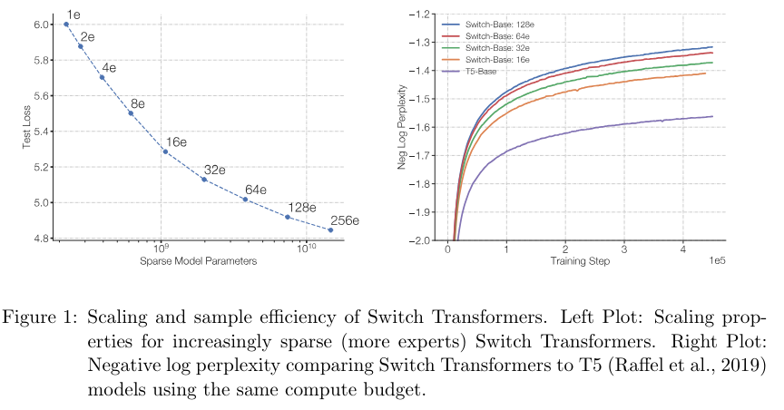
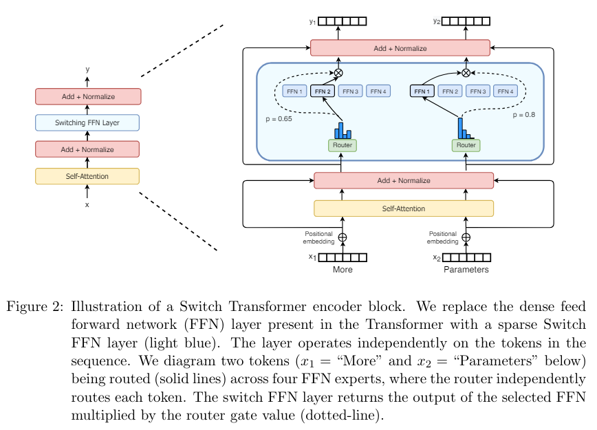
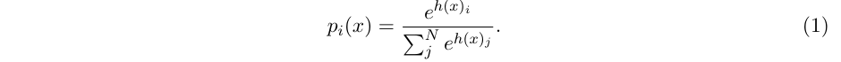
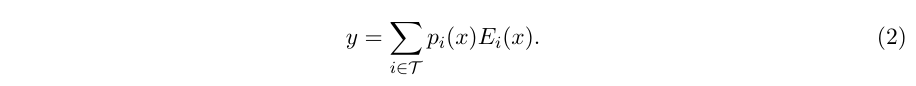
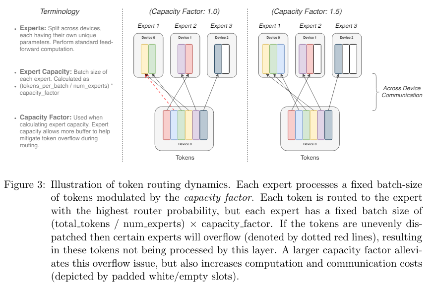
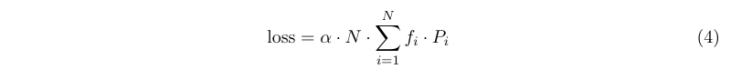
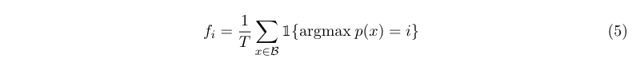
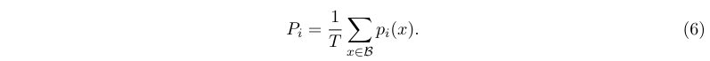
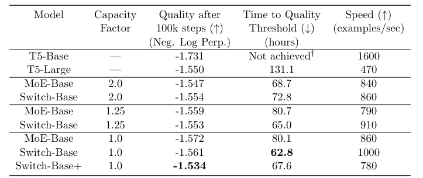

# Switch Transformers: Scaling to Trillion Parameter Models with Simple and Efficient Sparsity
- [论文链接](https://arxiv.org/pdf/2101.03961)

# 0 摘要
&nbsp;&nbsp;&nbsp;&nbsp;&nbsp;&nbsp;&nbsp;&nbsp;在深度学习中，模型通常对所有输入重用相同的参数。而专家混合（MoE）模型则违反了这一点，它**为每个输入示例选择不同的参数**。结果是一个**稀疏激活**的模型，具有大量的参数，但**计算成本恒定**。然而，尽管MoE取得了一些显著的成功，但由于复杂性、**通信成本**和**训练不稳定性**的原因，广泛采用受到了阻碍。我们通过引入Switch Transformer来解决这些问题。我们**简化了MoE路由算法，并设计了直观改进的模型，降低了通信和计算成本**。我们提出的训练技术缓解了不稳定性，并且我们首次展示了**大规模稀疏模型可以使用较低精度（bfloat16）格式进行训练**。我们基于T5-Base和T5-Large(Raffel 等，2019）设计模型，利用相同的计算资源**在预训练速度上获得高达7倍的提升**。这些改进扩展到多语言环境，在所有101种语言上我们都比mT5-Base版本获得了提升。最后，我们通过在“Colossal Clean Crawled Corpus”上预训练万亿参数模型，并实现了对T5-XXL模型的4倍加速，推动了当前语言模型的规模。 

# 1 引言
&nbsp;&nbsp;&nbsp;&nbsp;&nbsp;&nbsp;&nbsp;&nbsp;大规模训练已成为实现灵活和强大的神经语言模型的有效途径（Radford等，2018; Kaplan等，2020; Brown等，2020）。简单的架构(在充足的计算预算、数据集大小和参数数量的支持下)超过了更复杂的算法（Sutton，2019）。Radford等（2018）、Raffel等（2019）和Brown等（2020）采用的方法是扩展密集激活的Transformer模型的规模（Vaswani等，2017）。虽然这种方法有效，但计算成本也非常高（Strubell等，2019）。受到模型规模成功的启发，但为了寻求更高的计算效率，我们提出了一种**稀疏激活**的专家模型：Switch Transformer。在我们的情况下，稀疏性来自于**为每个输入示例 激活 神经网络权重的子集(就是每个输入激活一部分weight)**。 

&nbsp;&nbsp;&nbsp;&nbsp;&nbsp;&nbsp;&nbsp;&nbsp;稀疏训练是一个活跃的研究和工程领域（Gray等，2017; Gale等，2020），但直到今天，机器学习库和硬件加速器仍然偏向于密集矩阵乘法。为了有一个高效的稀疏算法，我们从专家混合（MoE）范式（Jacobs等，1991; Jordan和Jacobs，1994; Shazeer等，2017）开始，并简化它以获得训练稳定性和计算效益。在机器翻译领域，MoE模型取得了显著的成功（Shazeer等，2017, 2018; Lepikhin等，2020），然而，由于复杂性、**通信成本和训练不稳定性**，广泛采用受到了阻碍。 

&nbsp;&nbsp;&nbsp;&nbsp;&nbsp;&nbsp;&nbsp;&nbsp;我们解决了这些问题，并超越了翻译领域，发现这类算法在自然语言处理中具有广泛的价值。我们在各种自然语言任务和自然语言处理的三个领域（预训练、微调和多任务训练）上测量了卓越的扩展性。虽然本工作侧重于规模，但我们还展示了Switch Transformer架构不仅在超级计算机领域表现出色，而且即使只有少量计算核心也具有益处。此外，我们的大规模稀疏模型**可以通过蒸馏（Hinton等，2015）转化为小型稠密版本**，同时**保留30%的稀疏模型质量提升**。我们的贡献如下： 

- Switch Transformer架构，对专家混合进行了简化和改进。 
- 在扩展性能(scale properties)和与经过深度调优(strongly tuned)的T5模型（Raffel等，2019）进行基准测试中，我们测量了**7倍以上的预训练加速**，同时仍然使用相同的每个标记的FLOPS。我们进一步展示了即使在有限的计算资源下，**使用仅两个专家也能获得改进**。 
- 将稀疏预训练和专门微调的模型成功地蒸馏为小型稠密模型。我们将模型大小减小了高达99％，同时保留了大规模稀疏模型30％的质量提升。 
- 改进的预训练和微调技术：1. 可选择的训练精度，可以使用较低的bfloat16精度进行训练; 2. 初始化方案(scheme)，可以扩展到更多的专家数量; 3. 增加专家正则化(regularization)，改善稀疏模型的微调和多任务训练。 
- 我们对多语言数据进行了预训练效益的评估，在101种语言中发现了普遍的改进，并且有91％的语言相比于mT5基准模型（Xue等人，2020）获得了4倍以上的加速。 
- 通过有效地组合数据、模型和专家并行性，增加了神经语言模型的规模，创建了具有高达一万亿参数的模型。这些模型将经过强优化的T5-XXL基准模型的预训练速度提高了4倍。 

# 2 Switch Transformer
&nbsp;&nbsp;&nbsp;&nbsp;&nbsp;&nbsp;&nbsp;&nbsp;Switch Transformer的设计原则是以简单且计算效率高的方式最大化Transformer模型（Vaswani等，2017）的参数数量。在Kaplan等人（[2020](https://arxiv.org/pdf/2001.08361)）的详尽研究中，规模的好处得到了充分的探讨，揭示了**模型规模、数据集大小和计算预算**之间的幂律扩展关系。重要的是，这项工作主张**在相对较少的数据上训练大模型作为计算上的最佳方法。**  

&nbsp;&nbsp;&nbsp;&nbsp;&nbsp;&nbsp;&nbsp;&nbsp;根据(Heeding)这些结果，我们进一步研究了第四个方向：**增加参数数量，同时保持每个样本的浮点运算（FLOPs）不变**。我们的假设是，**参数数量与总计算量无关，是一个独立重要的扩展方向**。为了实现这一点，我们设计了一个稀疏激活的模型，可以有效地利用为密集矩阵乘法设计的硬件，如GPU和TPU。我们的工作重点在TPU架构上，但这类模型也可以在GPU集群上进行类似的训练。在我们的分布式训练设置中，稀疏激活的层在不同设备上分割唯一的权重。因此，模型的权重随着设备数量的增加而增加，同时在每个设备上保持可管理的内存和计算占用。

## 2.1 简化稀疏路由
&nbsp;&nbsp;&nbsp;&nbsp;&nbsp;&nbsp;&nbsp;&nbsp;专家混合路由。Shazeer等人（2017）提出了一种自然语言的专家混合（MoE）层，它将一个标记表示x(token representation)作为输入，然后将其路由到从N个专家 $\left\lbrace E_{i} (x) \right\rbrace_{i=1} ^{N}$ 中选择的前k个确定最佳的专家。路由变量 $W_{r}$ 用于生成逻辑向量 $h(x) = W_{r} · x$ ，通过对该层可用的N个专家进行softmax归一化。第i个专家的 **门值(gate-value)** 由以下公式给出: 

 

&nbsp;&nbsp;&nbsp;&nbsp;&nbsp;&nbsp;&nbsp;&nbsp;选择前k个 **门值(gate-value)** 用于路由标记x。如果 $\mathcal{T}$ 是所选的前k个索引的集合，则该层的输出计算是通过门值对每个专家对标记的计算进行线性加权组合:  

 

&nbsp;&nbsp;&nbsp;&nbsp;&nbsp;&nbsp;&nbsp;&nbsp;**Switch路由：重新思考专家混合。** Shazeer等人（2017）推测(conjectured)，为了获得对路由函数的非平凡梯度(较大的梯度)，需要将标记路由到k > 1个专家。作者们直觉地认为，如果不能比较至少两个专家，学习路由将无法进行。Ramachandran和Le（2018）进一步研究了前k个决策，并发现在具有多个路由层的模型中，较低层的较高k值非常重要。与这些想法相反，我们使用了一个简化的策略，只将标记路由到**单个专家**。我们展示了**这种简化保持了模型质量，减少了路由计算并且表现更好**。这种 **k = 1的路由策略后来被称为Switch层**。需要注意的是，对于MoE和Switch路由，方程式2中的门值 $p_{i}(x)$ 使得路由器具有可微性。 

&nbsp;&nbsp;&nbsp;&nbsp;&nbsp;&nbsp;&nbsp;&nbsp;Switch层的好处有三个：（1）由于我们只将token 路由到单个专家，所以路由计算减少了；（2）每个专家的批量大小（专家容量）可以至少减半，因为每个token只被路由到一个专家；（3）路由实现简化，通信成本降低。图3展示了使用不同专家容量因子进行路由的示例。 

## 2.2 高效稀疏路由
&nbsp;&nbsp;&nbsp;&nbsp;&nbsp;&nbsp;&nbsp;&nbsp;我们使用Mesh-Tensorflow（MTF）（Shazeer等，2018），这是一个库，具有类似于TensorFlow（Abadi等，2016）的语义和API，可实现高效的分布式数据和模型并行架构。它通过**将一组物理核心抽象为逻辑处理器网格来实现这一目标**。然后，张量和计算可以按命名维度进行分片，便于在各个维度上轻松地对模型进行分区。我们设计我们的模型时考虑到了需要静态声明大小的TPU。下面我们描述了我们的分布式Switch Transformer实现。 

&nbsp;&nbsp;&nbsp;&nbsp;&nbsp;&nbsp;&nbsp;&nbsp;**分布式开关实现(Distributed Switch Implementation)**。我们所有的张量形状在编译时**静态确定**，但由于训练和推理时的路由决策，我们的**计算是动态的**。因此，一个重要的技术考虑因素是如何设置专家的容量(expert capacity)。专家容量（每个专家计算的令牌数量)通过将批处理中的令牌数量均匀分配给专家数量，然后再乘以一个容量因子来设置。 

&nbsp;&nbsp;&nbsp;&nbsp;&nbsp;&nbsp;&nbsp;&nbsp;容量因子大于1.0会创建额外的缓冲区(additional buffer)，以容纳当tokens在专家之间不完全平衡时的情况。如果太多的tokens被路由到一个专家（后面称为被丢弃的tokens），则会跳过计算，并通过剩余连接(residual connection)直接将令牌表示传递到下一层。然而，增加expert capacity并非没有缺点(drawbacks)，因为high value会导致计算和内存的浪费。这种权衡在图3中有所解释。根据经验(Empirically)，我们发现**确保较低的令牌丢失率对于稀疏专家模型的扩展很重要**。在我们的实验中，我们没有注意到令牌丢失数量与专家数量之间的任何依赖关系（通常 < 1%）。使用足够高的系数使用辅助负载平衡损失（下一节）可以确保良好的负载平衡。我们在表1中研究了这些设计决策对模型质量和速度的影响。 

&nbsp;&nbsp;&nbsp;&nbsp;&nbsp;&nbsp;&nbsp;&nbsp;**可微分的负载平衡损失。** 为了促进专家之间的负载平衡，我们添加了一个辅助损失(auxiliary loss)（Shazeer等，2017年，2018年；Lepikhin等，2020年）。与Shazeer等（2018年）；Lepikhin等（2020年）一样，Switch Transformer简化了Shazeer等（2017年）原始设计，后者具有单独的负载平衡和重要性加权损失。**对于每个Switch层，该辅助损失在训练过程中添加到模型总损失中。** 给定索引为i = 1..N 的 N个专家和具有 T 个token的批次 B，辅助损失(auxiliary)被计算为向量f和P之间的缩放点积:  

其中 $f_{i}$ 是分派给专家 i 的tokens 的比例： 

其中 $P_{i}$ 是分配给专家i的路由器概率比例:  

&nbsp;&nbsp;&nbsp;&nbsp;&nbsp;&nbsp;&nbsp;&nbsp;由于我们希望(seek)将令牌批次(batch of tokens)在N个专家之间进行均匀路由(uniform routing)，因此我们希望这两个向量的值都为1/N。方程4的辅助损失鼓励均匀路由，因为它在均匀分布下最小化。这个目标也可以微分，因为P向量是可微分的，但f向量不是。最终的损失乘以专家数量N，以保持损失在专家数量变化时的恒定性，因为在均匀路由下, $\sum (f_{i} P_{i}) = \frac{1}{N}$ 。最后，超参数α是辅助损失的乘法系数；在整个工作中，我们使用 $α = 10^{-2}$ ，这个值足够大以确保负载平衡，同时又足够小以不会压倒主要的交叉熵目标。我们在 $10^{-1}$ 到 $10^{-5}$ 的范围内以10的幂进行了超参数范围的扫描，并发现 $10^{-2}$ 可以快速实现负载平衡，而不会干扰训练损失。 

## 2.3 将所有内容整合在一起：Switch Transformer
&nbsp;&nbsp;&nbsp;&nbsp;&nbsp;&nbsp;&nbsp;&nbsp;我们对Switch Transformer的第一个测试是在“Colossal Clean Crawled Corpus” (C4) 上进行预训练，该语料库在(Raffel等人，2019年)中介绍。对于我们的预训练目标，我们使用了掩码语言建模任务 (Taylor, 1953; Fedus等人，2018; Devlin等人，2018)，其中模型被训练以预测缺失的token。在我们的预训练设置中，根据Raffel等人 (2019年)确定的最佳设置，我们丢弃了15%的令牌，然后用单个标记令牌替换掩码序列。为了比较我们的模型，我们记录了负对数困惑度(negative log perplexity)。在本文的所有表格中，↑表示该指标的较高值更好，反之，↓表示较低值更好。本研究中研究的所有模型的比较结果见表9。 

&nbsp;&nbsp;&nbsp;&nbsp;&nbsp;&nbsp;&nbsp;&nbsp;Switch Transformer和MoE Transformer的一对一比较结果在表1中呈现。我们的Switch Transformer模型与'T5-Base' (Raffel等人，2019)的FLOP相匹配（每个token应用相同计算量）。MoE Transformer采用了前2个路由，它有两个专家，每个专家对每个令牌应用单独的前馈神经网络（FFN），因此其FLOPS更大。所有模型在相同的硬件上进行了相同步数的训练。需要注意的是，在上述实验设置中，MoE模型从容量因子2.0降低到1.25时实际上变慢了（从840到790），这是出乎意料的。 

*Table1： Switch Transformer与MoE Transformer以及T5稠密基线之间的一对一比较，衡量了每步和每单位时间上Switch Transformer相对于MoE Transformer的优势。我们通过负对数困惑度和达到任意选择的质量阈值（负对数困惑度=-1.50）所需的时间来衡量模型的质量。所有的MoE和Switch Transformer模型都使用128个专家，在每个其他前馈层上都有专家。对于Switch-Base+，我们增加了模型的大小，直到它的速度与MoE模型相匹配，通过将模型的隐藏大小从768增加到896，将头数从14增加到16。所有模型都使用相同数量的计算资源（32个核心）和相同的硬件（TPUv3）进行训练。此外，请注意，为了达到我们的-1.50的负对数困惑度水平，所有的模型都需要超过100,000个步骤的预训练。† T5-Base在训练的100,000个步骤中没有达到这个负对数困惑度的水平。*

&nbsp;&nbsp;&nbsp;&nbsp;&nbsp;&nbsp;&nbsp;&nbsp;我们从表1中得出了三个关键发现：（1）基于速度和质量的考虑，Switch Transformer在性能上优于经过精心调节的稠密模型和MoE Transformer。在固定的计算量和wall-clock time内，Switch Transformer取得了最好的结果。 （2）与MoE Transformer相比，Switch Transformer具有更小的计算占用。如果我们增加Switch Transformer的大小以匹配MoE Transformer的训练速度，我们发现在每个步骤上它的表现优于所有MoE和稠密模型。 （3）Switch Transformer在较低的容量因子（1.0、1.25）下表现更好。较小的专家容量意味着在大模型领域内模型内存非常稀缺的情况下，**容量因子应尽可能小**。 

## 2.4 改进的训练和微调技术
&nbsp;&nbsp;&nbsp;&nbsp;&nbsp;&nbsp;&nbsp;&nbsp;与普通的Transformer相比，稀疏专家模型可能会引入训练困难。这是因为在这些层次上的**硬切换（路由）决策可能导致不稳定性**。此外，像bfloat16（Wang和Kanwar，2019）这样的低精度格式可能会加剧我们的路由器中softmax计算的问题。我们在这里描述训练困难和我们使用的方法，以克服这些问题，实现稳定且可扩展的训练。 

 

 

