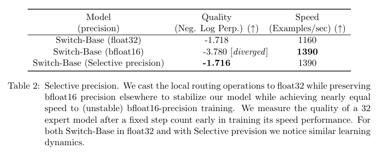
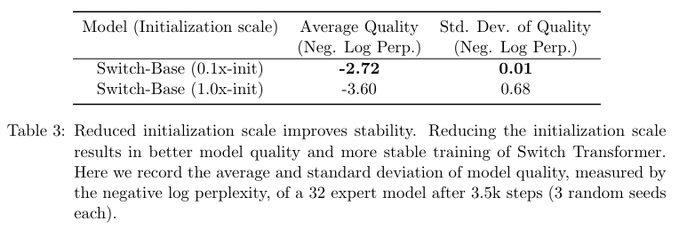
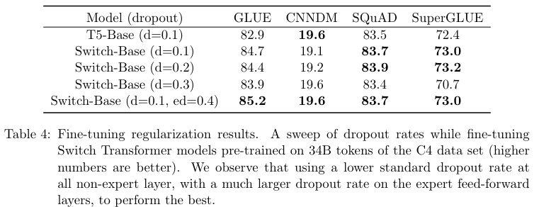
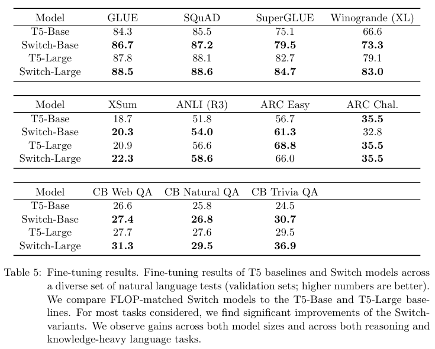
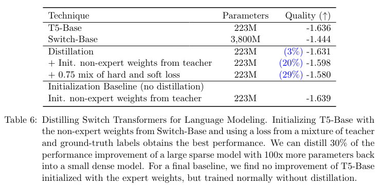
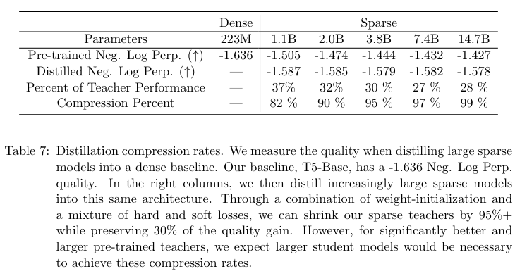
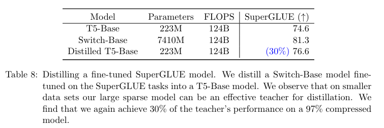

# Switch Transformers: Scaling to Trillion Parameter Models with Simple and Efficient Sparsity
- [论文链接](https://arxiv.org/pdf/2101.03961)

# 0 摘要
&nbsp;&nbsp;&nbsp;&nbsp;&nbsp;&nbsp;&nbsp;&nbsp;在深度学习中，模型通常对所有输入重用相同的参数。而专家混合（MoE）模型则违反了这一点，它**为每个输入示例选择不同的参数**。结果是一个**稀疏激活**的模型，具有大量的参数，但**计算成本恒定**。然而，尽管MoE取得了一些显著的成功，但由于复杂性、**通信成本**和**训练不稳定性**的原因，广泛采用受到了阻碍。我们通过引入Switch Transformer来解决这些问题。我们**简化了MoE路由算法，并设计了直观改进的模型，降低了通信和计算成本**。我们提出的训练技术缓解了不稳定性，并且我们首次展示了**大规模稀疏模型可以使用较低精度（bfloat16）格式进行训练**。我们基于T5-Base和T5-Large(Raffel 等，2019）设计模型，利用相同的计算资源**在预训练速度上获得高达7倍的提升**。这些改进扩展到多语言环境，在所有101种语言上我们都比mT5-Base版本获得了提升。最后，我们通过在“Colossal Clean Crawled Corpus”上预训练万亿参数模型，并实现了对T5-XXL模型的4倍加速，推动了当前语言模型的规模。 

# 1 引言
&nbsp;&nbsp;&nbsp;&nbsp;&nbsp;&nbsp;&nbsp;&nbsp;大规模训练已成为实现灵活和强大的神经语言模型的有效途径（Radford等，2018; Kaplan等，2020; Brown等，2020）。简单的架构(在充足的计算预算、数据集大小和参数数量的支持下)超过了更复杂的算法（Sutton，2019）。Radford等（2018）、Raffel等（2019）和Brown等（2020）采用的方法是扩展密集激活的Transformer模型的规模（Vaswani等，2017）。虽然这种方法有效，但计算成本也非常高（Strubell等，2019）。受到模型规模成功的启发，但为了寻求更高的计算效率，我们提出了一种**稀疏激活**的专家模型：Switch Transformer。在我们的情况下，稀疏性来自于**为每个输入示例 激活 神经网络权重的子集(就是每个输入激活一部分weight)**。 

&nbsp;&nbsp;&nbsp;&nbsp;&nbsp;&nbsp;&nbsp;&nbsp;稀疏训练是一个活跃的研究和工程领域（Gray等，2017; Gale等，2020），但直到今天，机器学习库和硬件加速器仍然偏向于密集矩阵乘法。为了有一个高效的稀疏算法，我们从专家混合（MoE）范式（Jacobs等，1991; Jordan和Jacobs，1994; Shazeer等，2017）开始，并简化它以获得训练稳定性和计算效益。在机器翻译领域，MoE模型取得了显著的成功（Shazeer等，2017, 2018; Lepikhin等，2020），然而，由于复杂性、**通信成本和训练不稳定性**，广泛采用受到了阻碍。 

&nbsp;&nbsp;&nbsp;&nbsp;&nbsp;&nbsp;&nbsp;&nbsp;我们解决了这些问题，并超越了翻译领域，发现这类算法在自然语言处理中具有广泛的价值。我们在各种自然语言任务和自然语言处理的三个领域（预训练、微调和多任务训练）上测量了卓越的扩展性。虽然本工作侧重于规模，但我们还展示了Switch Transformer架构不仅在超级计算机领域表现出色，而且即使只有少量计算核心也具有益处。此外，我们的大规模稀疏模型**可以通过蒸馏（Hinton等，2015）转化为小型稠密版本**，同时**保留30%的稀疏模型质量提升**。我们的贡献如下： 

- Switch Transformer架构，对专家混合进行了简化和改进。 
- 在扩展性能(scale properties)和与经过深度调优(strongly tuned)的T5模型（Raffel等，2019）进行基准测试中，我们测量了**7倍以上的预训练加速**，同时仍然使用相同的每个标记的FLOPS。我们进一步展示了即使在有限的计算资源下，**使用仅两个专家也能获得改进**。 
- 将稀疏预训练和专门微调的模型成功地蒸馏为小型稠密模型。我们将模型大小减小了高达99％，同时保留了大规模稀疏模型30％的质量提升。 
- 改进的预训练和微调技术：1. 可选择的训练精度，可以使用较低的bfloat16精度进行训练; 2. 初始化方案(scheme)，可以扩展到更多的专家数量; 3. 增加专家正则化(regularization)，改善稀疏模型的微调和多任务训练。 
- 我们对多语言数据进行了预训练效益的评估，在101种语言中发现了普遍的改进，并且有91％的语言相比于mT5基准模型（Xue等人，2020）获得了4倍以上的加速。 
- 通过有效地组合数据、模型和专家并行性，增加了神经语言模型的规模，创建了具有高达一万亿参数的模型。这些模型将经过强优化的T5-XXL基准模型的预训练速度提高了4倍。 

# 2 Switch Transformer
&nbsp;&nbsp;&nbsp;&nbsp;&nbsp;&nbsp;&nbsp;&nbsp;Switch Transformer的设计原则是以简单且计算效率高的方式最大化Transformer模型（Vaswani等，2017）的参数数量。在Kaplan等人（[2020](https://arxiv.org/pdf/2001.08361)）的详尽研究中，规模的好处得到了充分的探讨，揭示了**模型规模、数据集大小和计算预算**之间的幂律扩展关系。重要的是，这项工作主张**在相对较少的数据上训练大模型作为计算上的最佳方法。**  

&nbsp;&nbsp;&nbsp;&nbsp;&nbsp;&nbsp;&nbsp;&nbsp;根据(Heeding)这些结果，我们进一步研究了第四个方向：**增加参数数量，同时保持每个样本的浮点运算（FLOPs）不变**。我们的假设是，**参数数量与总计算量无关，是一个独立重要的扩展方向**。为了实现这一点，我们设计了一个稀疏激活的模型，可以有效地利用为密集矩阵乘法设计的硬件，如GPU和TPU。我们的工作重点在TPU架构上，但这类模型也可以在GPU集群上进行类似的训练。在我们的分布式训练设置中，稀疏激活的层在不同设备上分割唯一的权重。因此，模型的权重随着设备数量的增加而增加，同时在每个设备上保持可管理的内存和计算占用。

## 2.1 简化稀疏路由
&nbsp;&nbsp;&nbsp;&nbsp;&nbsp;&nbsp;&nbsp;&nbsp;专家混合路由。Shazeer等人（2017）提出了一种自然语言的专家混合（MoE）层，它将一个标记表示x(token representation)作为输入，然后将其路由到从N个专家 $\left\lbrace E_{i} (x) \right\rbrace_{i=1} ^{N}$ 中选择的前k个确定最佳的专家。路由变量 $W_{r}$ 用于生成逻辑向量 $h(x) = W_{r} · x$ ，通过对该层可用的N个专家进行softmax归一化。第i个专家的 **门值(gate-value)** 由以下公式给出: 

 

&nbsp;&nbsp;&nbsp;&nbsp;&nbsp;&nbsp;&nbsp;&nbsp;选择前k个 **门值(gate-value)** 用于路由标记x。如果 $\mathcal{T}$ 是所选的前k个索引的集合，则该层的输出计算是通过门值对每个专家对标记的计算进行线性加权组合:  

 

&nbsp;&nbsp;&nbsp;&nbsp;&nbsp;&nbsp;&nbsp;&nbsp;**Switch路由：重新思考专家混合。** Shazeer等人（2017）推测(conjectured)，为了获得对路由函数的非平凡梯度(较大的梯度)，需要将标记路由到k > 1个专家。作者们直觉地认为，如果不能比较至少两个专家，学习路由将无法进行。Ramachandran和Le（2018）进一步研究了前k个决策，并发现在具有多个路由层的模型中，较低层的较高k值非常重要。与这些想法相反，我们使用了一个简化的策略，只将标记路由到**单个专家**。我们展示了**这种简化保持了模型质量，减少了路由计算并且表现更好**。这种 **k = 1的路由策略后来被称为Switch层**。需要注意的是，对于MoE和Switch路由，方程式2中的门值 $p_{i}(x)$ 使得路由器具有可微性。 

&nbsp;&nbsp;&nbsp;&nbsp;&nbsp;&nbsp;&nbsp;&nbsp;Switch层的好处有三个：（1）由于我们只将token 路由到单个专家，所以路由计算减少了；（2）每个专家的批量大小（专家容量）可以至少减半，因为每个token只被路由到一个专家；（3）路由实现简化，通信成本降低。图3展示了使用不同专家容量因子进行路由的示例。 

## 2.2 高效稀疏路由
&nbsp;&nbsp;&nbsp;&nbsp;&nbsp;&nbsp;&nbsp;&nbsp;我们使用Mesh-Tensorflow（MTF）（Shazeer等，2018），这是一个库，具有类似于TensorFlow（Abadi等，2016）的语义和API，可实现高效的分布式数据和模型并行架构。它通过**将一组物理核心抽象为逻辑处理器网格来实现这一目标**。然后，张量和计算可以按命名维度进行分片，便于在各个维度上轻松地对模型进行分区。我们设计我们的模型时考虑到了需要静态声明大小的TPU。下面我们描述了我们的分布式Switch Transformer实现。 

&nbsp;&nbsp;&nbsp;&nbsp;&nbsp;&nbsp;&nbsp;&nbsp;**分布式开关实现(Distributed Switch Implementation)**。我们所有的张量形状在编译时**静态确定**，但由于训练和推理时的路由决策，我们的**计算是动态的**。因此，一个重要的技术考虑因素是如何设置专家的容量(expert capacity)。专家容量（每个专家计算的令牌数量)通过将批处理中的令牌数量均匀分配给专家数量，然后再乘以一个容量因子来设置。 

&nbsp;&nbsp;&nbsp;&nbsp;&nbsp;&nbsp;&nbsp;&nbsp;容量因子大于1.0会创建额外的缓冲区(additional buffer)，以容纳当tokens在专家之间不完全平衡时的情况。如果太多的tokens被路由到一个专家（后面称为被丢弃的tokens），则会跳过计算，并通过剩余连接(residual connection)直接将令牌表示传递到下一层。然而，增加expert capacity并非没有缺点(drawbacks)，因为high value会导致计算和内存的浪费。这种权衡在图3中有所解释。根据经验(Empirically)，我们发现**确保较低的令牌丢失率对于稀疏专家模型的扩展很重要**。在我们的实验中，我们没有注意到令牌丢失数量与专家数量之间的任何依赖关系（通常 < 1%）。使用足够高的系数使用辅助负载平衡损失（下一节）可以确保良好的负载平衡。我们在表1中研究了这些设计决策对模型质量和速度的影响。 

&nbsp;&nbsp;&nbsp;&nbsp;&nbsp;&nbsp;&nbsp;&nbsp;**可微分的负载平衡损失。** 为了促进专家之间的负载平衡，我们添加了一个辅助损失(auxiliary loss)（Shazeer等，2017年，2018年；Lepikhin等，2020年）。与Shazeer等（2018年）；Lepikhin等（2020年）一样，Switch Transformer简化了Shazeer等（2017年）原始设计，后者具有单独的负载平衡和重要性加权损失。**对于每个Switch层，该辅助损失在训练过程中添加到模型总损失中。** 给定索引为i = 1..N 的 N个专家和具有 T 个token的批次 B，辅助损失(auxiliary)被计算为向量f和P之间的缩放点积:  

其中 $f_{i}$ 是分派给专家 i 的tokens 的比例： 

其中 $P_{i}$ 是分配给专家i的路由器概率比例:  

&nbsp;&nbsp;&nbsp;&nbsp;&nbsp;&nbsp;&nbsp;&nbsp;由于我们希望(seek)将令牌批次(batch of tokens)在N个专家之间进行均匀路由(uniform routing)，因此我们希望这两个向量的值都为1/N。方程4的辅助损失鼓励均匀路由，因为它在均匀分布下最小化。这个目标也可以微分，因为P向量是可微分的，但f向量不是。最终的损失乘以专家数量N，以保持损失在专家数量变化时的恒定性，因为在均匀路由下, $\sum (f_{i} P_{i}) = \frac{1}{N}$ 。最后，超参数α是辅助损失的乘法系数；在整个工作中，我们使用 $α = 10^{-2}$ ，这个值足够大以确保负载平衡，同时又足够小以不会压倒主要的交叉熵目标。我们在 $10^{-1}$ 到 $10^{-5}$ 的范围内以10的幂进行了超参数范围的扫描，并发现 $10^{-2}$ 可以快速实现负载平衡，而不会干扰训练损失。 

## 2.3 将所有内容整合在一起：Switch Transformer
&nbsp;&nbsp;&nbsp;&nbsp;&nbsp;&nbsp;&nbsp;&nbsp;我们对Switch Transformer的第一个测试是在“Colossal Clean Crawled Corpus” (C4) 上进行预训练，该语料库在(Raffel等人，2019年)中介绍。对于我们的预训练目标，我们使用了掩码语言建模任务 (Taylor, 1953; Fedus等人，2018; Devlin等人，2018)，其中模型被训练以预测缺失的token。在我们的预训练设置中，根据Raffel等人 (2019年)确定的最佳设置，我们丢弃了15%的令牌，然后用单个标记令牌替换掩码序列。为了比较我们的模型，我们记录了负对数困惑度(negative log perplexity)。在本文的所有表格中，↑表示该指标的较高值更好，反之，↓表示较低值更好。本研究中研究的所有模型的比较结果见表9。 

&nbsp;&nbsp;&nbsp;&nbsp;&nbsp;&nbsp;&nbsp;&nbsp;Switch Transformer和MoE Transformer的一对一比较结果在表1中呈现。我们的Switch Transformer模型与'T5-Base' (Raffel等人，2019)的FLOP相匹配（每个token应用相同计算量）。MoE Transformer采用了前2个路由，它有两个专家，每个专家对每个令牌应用单独的前馈神经网络（FFN），因此其FLOPS更大。所有模型在相同的硬件上进行了相同步数的训练。需要注意的是，在上述实验设置中，MoE模型从容量因子2.0降低到1.25时实际上变慢了（从840到790），这是出乎意料的。 

*Table1： Switch Transformer与MoE Transformer以及T5稠密基线之间的一对一比较，衡量了每步和每单位时间上Switch Transformer相对于MoE Transformer的优势。我们通过负对数困惑度和达到任意选择的质量阈值（负对数困惑度=-1.50）所需的时间来衡量模型的质量。所有的MoE和Switch Transformer模型都使用128个专家，在每个其他前馈层上都有专家。对于Switch-Base+，我们增加了模型的大小，直到它的速度与MoE模型相匹配，通过将模型的隐藏大小从768增加到896，将头数从14增加到16。所有模型都使用相同数量的计算资源（32个核心）和相同的硬件（TPUv3）进行训练。此外，请注意，为了达到我们的-1.50的负对数困惑度水平，所有的模型都需要超过100,000个步骤的预训练。† T5-Base在训练的100,000个步骤中没有达到这个负对数困惑度的水平。*

&nbsp;&nbsp;&nbsp;&nbsp;&nbsp;&nbsp;&nbsp;&nbsp;我们从表1中得出了三个关键发现：（1）基于速度和质量的考虑，Switch Transformer在性能上优于经过精心调节的稠密模型和MoE Transformer。在固定的计算量和wall-clock time内，Switch Transformer取得了最好的结果。 （2）与MoE Transformer相比，Switch Transformer具有更小的计算占用。如果我们增加Switch Transformer的大小以匹配MoE Transformer的训练速度，我们发现在每个步骤上它的表现优于所有MoE和稠密模型。 （3）Switch Transformer在较低的容量因子（1.0、1.25）下表现更好。较小的专家容量意味着在大模型领域内模型内存非常稀缺的情况下，**容量因子应尽可能小**。 

## 2.4 改进的训练和微调技术
&nbsp;&nbsp;&nbsp;&nbsp;&nbsp;&nbsp;&nbsp;&nbsp;与普通的Transformer相比，稀疏专家模型可能会引入训练困难。这是因为在这些层次上的**硬切换（路由）决策可能导致不稳定性**。此外，像bfloat16（Wang和Kanwar，2019）这样的低精度格式可能会加剧我们的路由器中softmax计算的问题。我们在这里描述训练困难和我们使用的方法，以克服这些问题，实现稳定且可扩展的训练。 

&nbsp;&nbsp;&nbsp;&nbsp;&nbsp;&nbsp;&nbsp;&nbsp;针对大型稀疏模型的选择性精度(selective precision)。**模型不稳定性妨碍了使用高效的bfloat16精度进行训练的能力**，因此Lepikhin等人（[2020](https://arxiv.org/pdf/2006.16668)）在他们的MoE Transformer中始终使用float32精度进行训练。然而，我们表明通过**在模型的局部部分选择性地转换为float32精度**，可以实现稳定性，而无需承担float32张量昂贵的通信成本。这种技术与现代混合精度训练策略相一致，其中模型的某些部分和梯度更新以更高的精度进行，正如Micikevicius等人（2017）所示。表2显示，我们的方法在几乎与bfloat16训练相等的速度下，提供了float32的训练稳定性。 

&nbsp;&nbsp;&nbsp;&nbsp;&nbsp;&nbsp;&nbsp;&nbsp;为了实现这一点，我们将路由器的输入转换为float32精度。路由器函数接受令牌作为输入，并生成用于选择和重新组合专家计算的调度和合并张量（有关详细信息，请参阅附录中的代码块15）。重要的是，float32精度仅在路由器函数的主体内部使用，即在与该设备相关的计算中。因为最终的调度和合并张量在函数结束时重新转换为bfloat16精度，所以没有昂贵的float32张量通过 all-to-all communication 操作广播，但我们仍然受益于float32的增强稳定性。 

&nbsp;&nbsp;&nbsp;&nbsp;&nbsp;&nbsp;&nbsp;&nbsp;为了保持稳定性，我们**对参数进行较小的初始化**。适当的初始化对于深度学习的成功训练至关重要，我们特别观察到这一点对于Switch Transformer来说尤为重要。我们通过从截断正态分布中抽取元素来初始化权重矩阵，其中均值µ=0，标准差 $σ= \sqrt (\frac{s}{n})$ ，其中s是一个缩放超参数，n是权重张量中的输入单元数（例如，fan-in）。

&nbsp;&nbsp;&nbsp;&nbsp;&nbsp;&nbsp;&nbsp;&nbsp;作为对不稳定性的额外纠正措施，我们建议将默认的Transformer初始化**缩放因子s=1.0减小10倍**。这既提高了质量，又减少了训练不稳定的可能性。表3衡量了模型质量的提升和训练早期方差的减少。我们发现，通过Neg. Log Perp.测量的平均模型质量显著提高，并且运行结果的方差大大降低。此外，**这种初始化方案在跨越几个数量级的模型上广泛有效**。我们使用相同的方法稳定地训练小到我们的基线223M参数模型，以及超过一万亿参数的巨大模型。 

&nbsp;&nbsp;&nbsp;&nbsp;&nbsp;&nbsp;&nbsp;&nbsp;对大型稀疏模型进行正则化(regularizing)。我们的论文考虑了常见的自然语言处理方法，即在大型语料库上进行预训练，然后在较小的下游任务（如摘要或问题回答）上进行微调。一个自然而然的问题是过拟合，**因为许多微调任务只有很少的示例**。在标准Transformer的微调过程中，Raffel等人（2019）在每个层次上使用dropout（Srivastava等人，2014）来防止过拟合。我们的Switch Transformer具有比FLOP匹配的稠密基准模型更多的参数，这**可能导致在这些较小的下游任务中更严重的过拟合现象**。 

&nbsp;&nbsp;&nbsp;&nbsp;&nbsp;&nbsp;&nbsp;&nbsp;因此，在微调过程中，我们提出了一种简单的方法来缓解这个问题：增加专家内的dropout，我们将其称为专家dropout。在微调过程中，我们只需在每个专家层的中间前馈计算中显著增加dropout rate。表4显示了我们的专家dropout协议的结果。我们观察到，**简单地在所有层级增加dropout会导致性能下降**。然而，在非专家层设置较小的dropout率（0.1），而在专家层设置较大的dropout率（0.4），可以改善四个较小的下游任务的性能。 

# 3 缩放性质(scaling Properties)
&nbsp;&nbsp;&nbsp;&nbsp;&nbsp;&nbsp;&nbsp;&nbsp;我们对Switch Transformer架构在预训练期间的缩放性质进行了研究。根据Kaplan等人（2020）的研究，我们考虑了一个模型既不受计算预算限制，也不受数据量限制的情况。为了避免数据瓶颈，我们使用了包含超过1800亿target token 的大型C4语料库（Raffel等人，2019），并训练直到出现递减的收益。 

&nbsp;&nbsp;&nbsp;&nbsp;&nbsp;&nbsp;&nbsp;&nbsp;专家的数量是扩展我们模型最有效的维度。增加专家的数量可以使计算成本近似保持不变，因为模型每个令牌只选择一个专家，而不管可供选择的专家数量如何。然而，路由器必须计算一个概率分布，涵盖更多的专家，但这只是一个轻量级的计算，成本为O(dmodel × num experts)，其中dmodel是在层之间传递的 embedding dimension 维度。在本节中，我们考虑在固定的计算预算下，基于步骤(step-basis)和基于时间(time-basis)的缩放性质。 

## 3.1 基于步骤的缩放结果
&nbsp;&nbsp;&nbsp;&nbsp;&nbsp;&nbsp;&nbsp;&nbsp;图4展示了在训练所有模型进行**固定步骤数量时**，随着专家数量的增加而产生的一致的扩展优势。我们观察到一个明显的趋势：**在保持每个token的FLOPS固定的情况下，拥有更多参数（专家）可以加快训练速度**。左图展示了稀疏模型参数和测试损失之间的一致的缩放性质（在每个令牌的FLOPS固定的情况下）。这揭示了沿着稀疏模型参数的这个额外维度进行扩展的优势。右图衡量了一个稠密模型变体和四个FLOP匹配的稀疏变体的样本效率。我们发现**增加专家的数量会导致更具样本效率的模型**。我们的Switch-Base 64专家模型在第60,000步和第450,000步时达到了与T5-Base模型相同的性能，步骤时间(step time)上提速了7.5倍。此外，与Kaplan等人（2020）的研究结果一致，我们发现较大的模型也更具样本效率，即对于观察到的token数量固定，学习速度更快。 

## 3.2 基于时间的缩放结果
&nbsp;&nbsp;&nbsp;&nbsp;&nbsp;&nbsp;&nbsp;&nbsp;在基于步骤的缩放结果中，图4显示随着专家数量的增加，性能稳定提升。尽管我们的模型每个令牌的FLOPS大致与基准模型相同，但我们的Switch Transformer在设备之间产生**额外的通信成本**，以及**路由机制的额外计算开销**。因此，在step-basis的观察中观察到的样本效率的提高并不一定会转化为更好的模型质量（以墙钟时间衡量）。这引发了一个问题： 
*(注释：Wall-clock time（墙钟时间）是指实际经过的时间，也就是从开始到结束的总时间。它是以墙上的时钟（wall-clock）为基准，而不考虑计算机的处理速度或其他因素的时间度量。）*  
&nbsp;&nbsp;&nbsp;&nbsp;&nbsp;&nbsp;&nbsp;&nbsp;在固定的训练持续时间和计算预算下，应该训练稠密模型还是稀疏模型呢？ 
&nbsp;&nbsp;&nbsp;&nbsp;&nbsp;&nbsp;&nbsp;&nbsp;图5和图6回答了这个问题。图5根据时间的函数衡量了预训练模型的质量。在固定的训练持续时间和计算预算下，Switch Transformer架构实现了显著的加速。在这种设置下，我们的Switch-Base 64专家模型的训练时间是T5-Base模型**获得相似困惑度所需时间的七分之一**。 

## 3.3 缩放与更大的稠密模型对比
&nbsp;&nbsp;&nbsp;&nbsp;&nbsp;&nbsp;&nbsp;&nbsp;上述分析表明，在计算资源匹配的情况下，稀疏模型的Switch版本超过了稠密模型。图6考虑了另一种情况：如果我们将资源分配给一个更大的稠密模型，会发生什么？现在我们这样做，将Switch-Base与下一个强基准模型T5-Large进行对比。尽管T5-Large每个token应用了3.5倍的FLOPs，但Switch-Base仍然具有更高的样本效率，并实现了2.5倍的加速。此外，通过设计一个新的更大的稀疏版本Switch-Large，它与T5-Large在FLOP上匹配，可以获得更多的收益。我们在下一节中进行了这样的设计，并展示了更优秀的缩放和微调性能。 

# 4 下游结果
&nbsp;&nbsp;&nbsp;&nbsp;&nbsp;&nbsp;&nbsp;&nbsp;第3节展示了在**预训练阶段具有出色的缩放性能**，但我们现在验证这些优势是否能够转化为在下游任务中改进的语言学习能力。我们首先对各种不同的自然语言处理任务进行**微调**。接下来，我们研究通过将稀疏模型蒸馏为小型且易于部署的稠密基线，将内存占用降低了90%以上。最后，在多任务、多语言环境中衡量改进效果，我们展示了Switch Transformer在多任务学习中的强大能力，相比于多语言T5-Base模型，在101种语言中都有所改进。 

## 4.1 微调
&nbsp;&nbsp;&nbsp;&nbsp;&nbsp;&nbsp;&nbsp;&nbsp;**用于微调的基准模型和Switch模型**。我们的基准模型是经过高度调优的223M参数T5-Base模型和739M参数的T5-Large模型（Raffel等人，2019）。对于这两个版本，我们设计了一个在FLOP上匹配的Switch Transformer，参数更多，具体情况请参阅表9。我们的基准模型与Raffel等人（2019）的基准模型略有不同，因为我们在改进的C4语料库上进行预训练，该语料库去除了示例内文本的重复，从而提高了作为预训练任务的效果（Lee等人，2021）。根据我们的协议，我们每个批次使用220（1,048,576）个token进行预训练，共进行550k个step，总共使用了576B个tokens。然后，我们使用batch size为1M进行微调，进行16k个 step，并对每个任务进行评估，每200个step报告一次在验证集上的最佳性能。 
&nbsp;&nbsp;&nbsp;&nbsp;&nbsp;&nbsp;&nbsp;&nbsp;对于所有层，我们使用0.1的丢弃率，除了Switch层，其丢弃率为0.4（参见表4）。对于每个任务，我们在微调过程中每200个step评估一次模型质量，并报告在验证集上计算得到的性能峰值。 

&nbsp;&nbsp;&nbsp;&nbsp;&nbsp;&nbsp;&nbsp;&nbsp;**微调任务和数据集**。我们选择了一些探索语言能力的任务，包括问答、摘要和对世界知识的理解。语言基准测试集GLUE（Wang等人，2018）和SuperGLUE（Wang等人，2019）被处理为复合混合任务，其中每个任务的混合比例与其中包含的令牌数量成比例。这些基准测试集包括需要进行情感分析（SST2）、词义消歧（WIC）、句子相似度（MRPC、STS-B、QQP）、自然语言推理（MNLI、QNLI、RTE、CB）、问答（MultiRC、RECORD、BoolQ）、共指消解（WNLI、WSC）、句子完成（COPA）和句子可接受性（CoLA）的任务。我们使用CNNDM（Hermann等人，2015）和BBC XSum（Narayan等人，2018）数据集来衡量对文章进行摘要的能力。问答任务使用了SQuAD数据集（Rajpurkar等人，2016）和ARC推理挑战数据集（Clark等人，2018）。与Roberts等人（2020）的方法类似，我们通过在三个闭卷问答数据集上进行微调来评估模型的知识水平：自然问题（Kwiatkowski等人，2019）、网络问题（Berant等人，2013）和Trivia QA（Joshi等人，2017）。闭卷表示问题没有附加的参考或上下文材料。为了评估模型的常识推理能力，我们在Winogrande模式挑战数据集上进行评估（Sakaguchi等人，2020）。最后，我们在对抗性自然语言推理基准测试集（Nie等人，2019）上测试模型的自然语言推理能力。 
&nbsp;&nbsp;&nbsp;&nbsp;&nbsp;&nbsp;&nbsp;&nbsp;**微调评估指标**。本文中使用以下评估指标：我们报告GLUE和SuperGLUE所有子任务的平均分数。在CNNDM和XSum中使用Rouge-2指标。在SQuAD和闭卷任务（Web、Natural和Trivia Questions）中，我们报告与目标完全匹配的答案的百分比（有关详细信息和此度量的不足，请参考Roberts等人（2020）的论文）。最后，在ARC Easy、ARC Challenge、ANLI和Winogrande中，我们报告生成的响应的准确性。 
&nbsp;&nbsp;&nbsp;&nbsp;&nbsp;&nbsp;&nbsp;&nbsp;**微调结果**。我们观察到在许多自然语言任务中存在显著的下游改进。显著的改进来自SuperGLUE，其中我们发现与T5-Base和T5-Large基准相比，与FLOP匹配的Switch变体分别提高了**4.4个百分点和2个百分点**，同时在Winogrande、闭卷Trivia QA和XSum中也有很大的改进。在我们的微调研究中，唯一观察不到改进的任务是AI2推理挑战（ARC）数据集，其中T5-Base在挑战数据集上表现优于Switch-Base，T5-Large在简单数据集上表现优于Switch-Large。总体而言，我们观察到在推理和知识密集型任务中都存在显著改进。这证实了我们的架构不仅在预训练阶段表现良好，而且**可以通过微调将质量改进转化为下游任务**。 

## 4.2 蒸馏
&nbsp;&nbsp;&nbsp;&nbsp;&nbsp;&nbsp;&nbsp;&nbsp;部署拥有数十亿或数万亿参数的大规模神经网络是不方便的。为了缓解这个问题，我们研究**将大型稀疏模型蒸馏为小型稠密模型**（Hinton等人，2015）。未来的工作还可以研究将大型模型蒸馏为更小的稀疏模型。 
&nbsp;&nbsp;&nbsp;&nbsp;&nbsp;&nbsp;&nbsp;&nbsp;**蒸馏技术**。在表6中，我们研究了各种蒸馏技术。这些技术是基于Sanh等人（2019）的研究构建的，他们研究了用于BERT模型的蒸馏方法。我们发现，使用非专家权重初始化稠密模型可以带来适度的改进。这是可能的，因为所有模型的FLOP匹配，所以非专家层的尺寸是相同的。由于在Transformer中，专家层通常只在每个或每隔一个FFN层添加，这允许许多权重使用训练好的参数进行初始化。此外，我们观察到使用教师概率的0.25和ground truth label的0.75的混合进行蒸馏可以改进结果。通过结合这两种技术，我们**保留了较大稀疏模型的约30%的质量提升，而参数数量仅为其1/20左右**。质量提升指的是Switch-Base（教师）和T5-Base（学生）之间的质量差异的百分比。因此，100%的质量提升意味着学生的性能与教师相同。 

&nbsp;&nbsp;&nbsp;&nbsp;&nbsp;&nbsp;&nbsp;&nbsp;**可实现的压缩(compression)比率(rates)**。使用表6中描述的最佳蒸馏技术，我们将各种稀疏模型蒸馏为稠密模型。我们对Switch-Base版本进行了蒸馏，扫描了不断增加的专家数量，对应于1.1B到14.7B参数之间的变化。通过蒸馏，我们可以在压缩82%的同时保留1.1B参数模型质量提升的37%。在极端情况下，当我们将模型压缩99%时，仍然能够保持28%的教师模型质量改进。 

&nbsp;&nbsp;&nbsp;&nbsp;&nbsp;&nbsp;&nbsp;&nbsp;**蒸馏微调模型**。我们通过研究将微调的稀疏模型蒸馏为稠密模型来总结。表8展示了将在SuperGLUE任务上微调的7.4B参数Switch-Base模型蒸馏为223M T5-Base模型的结果。与我们的预训练结果类似，我们发现当蒸馏为FLOP匹配的稠密变体时，我们能够保留稀疏模型30%的提升效果。一个潜在的未来方向，目前未考虑，可能是研究用于微调任务的特定专家，并提取它们以实现更好的模型压缩效果。 

## 4.3 多语言学习
&nbsp;&nbsp;&nbsp;&nbsp;&nbsp;&nbsp;&nbsp;&nbsp;在我们最后一组下游实验中，我们在**101种不同语言的混合数据上进行预训练**，以评估模型质量和速度之间的权衡。我们基于最近的mT5工作（Xue等人，2020）构建和进行基准测试，mT5是T5的多语言扩展。我们在跨越101种语言的通用爬网数据集（mC4）的多语言变体上进行预训练，这些语言是mT5中引入的，但由于某些语言内的不同脚本变体，混合数据包含107个任务。 
&nbsp;&nbsp;&nbsp;&nbsp;&nbsp;&nbsp;&nbsp;&nbsp;在图7中，我们绘制了FLOP匹配的Switch模型（mSwitch-Base）与T5基准模型（mT5-Base）之间的所有语言的负对数困惑度质量改进情况。在将两个版本都进行了100万步的预训练后，我们发现在考虑的所有101种语言中，Switch Transformer相对于基准模型都增加了最终的负对数困惑度。在图8中，我们呈现了另一种视角，将使用Switch Transformer相对于mT5-Base的每步速度提升进行了直方图分析。我们发现相对于mT5-Base，Switch Transformer的平均加速比为5倍，并且91%的语言至少实现了4倍的加速。这表明Switch Transformer在多任务和多语言学习方面是有效的。 

# 5 使用数据、模型和专家并行设计模型
&nbsp;&nbsp;&nbsp;&nbsp;&nbsp;&nbsp;&nbsp;&nbsp;任意增加专家数量会遭遇收益递减的问题（图4）。在这里，我们描述了**互补的扩展策略**。扩展Transformer的常见方式是同时增加维度，比如 $d_{model}$ 或 $d_{ff}$ 。这既增加了参数和计算量，最终受限于每个加速器的内存。一旦超过了加速器内存的大小，就可以使用单程序多数据（SPMD）模型并行性。本节研究了数据、模型和专家并行结合的权衡。 
&nbsp;&nbsp;&nbsp;&nbsp;&nbsp;&nbsp;&nbsp;&nbsp;回顾前馈网络（FFN）层。我们使用FFN层作为展示Mesh TensorFlow（Shazeer等人，2018）中数据、模型和专家并行性如何工作的示例，并在这里进行简要回顾。我们假设批处理中有B个标记，每个标记的维度为 $d_{model}$ 。FFN的输入（x）和输出（y）的大小均为[B, $d_{model}$ ]，中间层（h）的大小为[B, $d_{ff}$ ]，其中 $d_{ff}$ 通常比 $d_{model}$ 大几倍。在FFN中，中间层计算为 $h = xW_{in}$ ，然后层的输出为 $y = ReLU(h)W_{out}$ 。因此， $W_{in}$ 和 $W_{out}$ 独立地应用于每个token，并具有大小为[ $d_{model}$ , $d_{ff}$ ]和[ $d_{ff}$, $d_{model}$ ]。 
&nbsp;&nbsp;&nbsp;&nbsp;&nbsp;&nbsp;&nbsp;&nbsp;我们描述了分区的两个方面：权重和数据批次在核心上的划分，如图9所示。我们将所有可用的核心表示为N，Mesh TensorFlow可以将其重新映射为逻辑多维处理器网格。在这里，我们创建了一个二维逻辑网格，其中一个维度表示**数据并行分片的方式（n）**，另一个维度表示**模型并行分片的方式（m）**。总核心数必须等于在数据并行和模型并行上进行分片的方式，例如 **N = n × m**。为了在核心之间进行分片，**包含B个标记的张量将在n个数据并行核心之间进行分片**，因此**每个核心包含B/n个 tokens**。然后，具有 $d_{ff}$ 的张量和变量在m个模型并行核心之间进行分片。对于具有专家层的变体，我们考虑E个专家，每个专家可以处理多达C个标记。 

