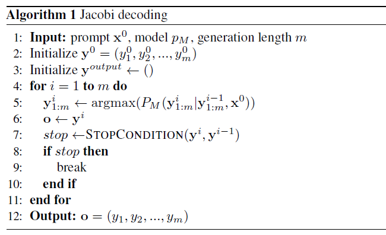

# LOOKAHEAD DECODING : Break the Sequential Dependency of LLM Inference
- [论文链接](https://arxiv.org/pdf/2402.02057)

# 2 背景

## 2.3 猜测和验证范式
&nbsp;&nbsp;&nbsp;&nbsp;&nbsp;&nbsp;&nbsp;&nbsp;猜测和验证解码范式推测多个**潜在**的未来标记，随后在单个解码步骤中确认这些猜测的正确性。以贪婪采样的推测解码为例：在步骤 t，给定提示 x0 和到目前为止生成的标记 y1:t−1，我们可以使用一个draft model 自回归地生成长度为 n 的草稿序列 yt:t+n−1。由于 yt:t+n−1 是预先已知的，我们随后使用LLM并行解决方程 2，得到 y′t:t+n。然后，我们验证对于每个 i 从 i = 0 到 i = n − 1，yt+i 是否等于 y′ t+i。如果匹配成功，我们接受此标记并继续；否则，我们停止检查并丢弃后续标记。最后，我们使用所有接受的标记更新 y。 

*图1：具有 W = 5、N = 3 和 G = 2 的LOOKAHEAD DECODING 工作流程。对于每个解码步骤，我们执行以下操作。（1）在lookahead branch的每个位置生成一个token；（2）使用verification branch验证和接受3元组（从3元组池中搜索）；（3）从lookahead branch轨迹中收集和缓存新生成的3元组到池中；（4）更新lookahead branch以保持固定的窗口大小.*   
- W：past_tokens 里每一个window的长度
- N：预测的标记数量 + 1(key)
- G：最大token_map的数量

&nbsp;&nbsp;&nbsp;&nbsp;&nbsp;&nbsp;&nbsp;&nbsp;如第1节所述，这些方法依赖于一个良好的draft model，而要获得这样的模型并使其具有泛化能力是困难的。 

## 2.4 雅可比解码
&nbsp;&nbsp;&nbsp;&nbsp;&nbsp;&nbsp;&nbsp;&nbsp;通过将 f(yi, y1:i−1, x0) = yi − argmax PM(yi|y1:i−1, x0) 进行标记，我们可以将方程 1 转化为以下非线性方程组（Song 等人，2021年；Santilli 等人，2023年）： 

&nbsp;&nbsp;&nbsp;&nbsp;&nbsp;&nbsp;&nbsp;&nbsp;我们可以使用Jacobi迭代来解决这个非线性系统，从一个随机的初始猜测y0开始，通过沿着轨迹y1，...，yt，...，迭代更新所有yi，直到收敛到固定点解ym。我们在附录算法1中详细描述了这个算法，称为Jacobi解码。该过程保证在最多m次迭代中返回所有m个变量yi的解，因为**每个Jacobi更新的第一个标记与自回归解码匹配**。有时，在单个迭代中可能会正确生成多个标记，从而潜在地减少解码步骤的数量。值得注意的是，由于yt是基于轨迹上的过去值yt−1生成的，yt−1和yt中的任意两个相邻标记可以形成一个有意义的2元组。 

## 2.5 Jacobi解码的局限性。
&nbsp;&nbsp;&nbsp;&nbsp;&nbsp;&nbsp;&nbsp;&nbsp;在经验上，我们观察到Jacobi解码几乎无法减少解码步骤，即使它可以在每个步骤生成多个标记。这是因为生成的标记通常放在序列的错误位置，并且正确放置的标记经常被后续的Jacobi迭代替代。这阻止了它实现实际的时间加速。 

# 3 LOOKAHEAD DECODING
&nbsp;&nbsp;&nbsp;&nbsp;&nbsp;&nbsp;&nbsp;&nbsp;利用Jacobi解码在一个步骤中生成多个标记的能力，但解决了其局限性。图1展示了其工作流程。LOOKAHEAD DECODING的关键设计是跟踪Jacobi解码的轨迹并从该轨迹生成n-gram。通过维护一个固定大小的二维窗口，其中两个维度分别对应于序列和时间轴，以并行方式从Jacobi迭代轨迹中生成多个不相交的n-gram。我们称这个过程为lookahead branch。此外，LOOKAHEAD DECODING引入了一个n-gram池，用于缓存沿着轨迹生成的这些n-gram。有希望的n-gram候选项稍后通过设计的验证分支进行验证，以保留LLM的输出分布；如果通过验证，这些不相交的n-gram将被整合到序列中。详细算法见附录中的算法2。 

## 3.1. LOOKAHEAD BRANCH
&nbsp;&nbsp;&nbsp;&nbsp;&nbsp;&nbsp;&nbsp;&nbsp;LOOKAHEAD DECODING使用固定大小的二维窗口进行高效的n-gram生成。与原始Jacobi解码相比，后者仅使用来自上一步的历史token（或等效地生成2-gram），LOOKAHEAD DECODING通过使用 n − 1个过去步骤的历史token，并行生成许多n-gram（其中n ≥ 2），有效地利用了轨迹中更多的信息。Lookahead branch中的固定大小二维窗口由两个参数表示：(1) W定义了向未来标记位置进行并行解码的lookahead窗口大小；(2) N定义了lookahead step，从过去的Jacobi轨迹中检索n-gram。详细过程请参见算法2。 

&nbsp;&nbsp;&nbsp;&nbsp;&nbsp;&nbsp;&nbsp;&nbsp;在图2（b）中展示了W = 5 和 N = 4 的lookahead branch的一个示例，其中我们 look back N − 1 = 3 步，并在每一步 look ahead 5 个token。带有数字 0 的蓝色标记是当前步骤（t）的输入，橙色、绿色和红色标记分别是在前几个前瞻分支的步骤 t − 3、t − 2 和 t − 1 中生成的。每个标记上的数字显示了它相对于当前输入（即标记为 0 的蓝色标记）的相对位置。在当前阶段，我们执行修改后的Jacobi迭代，为所有5个位置生成新的token，沿着由前面 3 步形成的轨迹进行。一旦生成，我们将它们收集并缓存在n-gram池中（n = 4）—例如，一个4-gram由位置1处的橙色标记、位置2处的绿色标记、位置3处的红色标记和一个新生成的标记组成。

&nbsp;&nbsp;&nbsp;&nbsp;&nbsp;&nbsp;&nbsp;&nbsp;在两个维度（时间和序列）中最过时的标记将被移除，并新生成的标记将被附加到前瞻分支中，以保持每一步的固定窗口大小。例如，在图2中，我们将移除所有位置为1的橙色和绿色token。然后，我们将形成一个新的lookahead branch，其中包含索引为2、3、4、5的绿色标记，所有红色标记，以及所有新生成的标记，用于下一步。 

## 3.2. VERIFICATION BRANCH
&nbsp;&nbsp;&nbsp;&nbsp;&nbsp;&nbsp;&nbsp;&nbsp;LOOKAHEAD DECODING通过其验证分支保留输出分布。我们首先讨论如何在贪婪抽样中进行验证。回想一下，在推测解码中：验证是通过将草稿标记发送到LLM以获取每个草稿标记的输出，然后逐步检查由目标LLM生成的最后一个标记对应的输出是否完全匹配草稿标记本身（§2）来执行的。LOOKAHEAD DECODING中的验证分支类似于此过程，尽管是并行验证许多草稿n-gram候选项。具体而言，我们首先从n-gram池中查找“有希望的”n-gram — 通过检查n-gram是否以与当前正在进行的序列的最后一个标记完全匹配的标记开头来进行。然后，我们使用LLM并行验证所有这些n-gram，遵循与推测解码类似的方式。详细过程请参见附录中的算法3。 

&nbsp;&nbsp;&nbsp;&nbsp;&nbsp;&nbsp;&nbsp;&nbsp;接下来我们讨论如何支持更高级的抽样。以前的研究（Miao等，2023年）已经为具有抽样支持的推测解码开发了基于树的高效验证方法，可以并行验证从标记树派生的多个draft序列。然而，这种方法不适用于LOOKAHEAD DECODING，因为我们的验证是针对不相交的n-gram而不是树结构进行的。我们通过逐渐沿着n-gram长度进行验证，并**移除具有不匹配前缀的n-gram**来改进它。此外，推测解码风格的验证需要概率分布，在其中draft标记被抽样以更新概率分布，当草稿标记被拒绝时。由于我们将所有n-gram存储在池中而不是在每一步都丢弃它们(但可能在后续步骤中丢弃)，我们需要大量内存来存储整个n-gram池的概率分布（每个具有词汇大小）。克服这一点的关键在于利用验证对draft标记的抽样方式是无关紧要的这一机制-不同的抽样方法（例如贪婪抽样）只会影响接受率，但保持输出分布不变。我们可以在n-gram生成（前瞻分支）时强制进行贪婪抽样，其中概率分布退化为一个one-hot向量。因此，**我们只需要存储选中的标记**。我们在算法4中详细阐述这种方法，在附录B中证明其正确性，并在§5.3中验证其质量和加速效果。 

&nbsp;&nbsp;&nbsp;&nbsp;&nbsp;&nbsp;&nbsp;&nbsp;随着解码的进行，预计会有一个越来越大的n-gram缓存，因此验证分支也会不断增长。我们设置一个上限G来限制在验证分支中并行运行的有希望候选项的最大数量，以管理验证成本。根据经验，我们建议将G设置成与W成比例，以平衡生成和验证的关系。在实践中，我们简单地将G设定为W。 

## 3.3. 在同一步骤中解码、预测和验证
&nbsp;&nbsp;&nbsp;&nbsp;&nbsp;&nbsp;&nbsp;&nbsp;在执行时，前瞻和验证分支可以整合到一个解码步骤中，以利用并行处理。这需要一个指定的注意力掩码，如图2（b）所示。这个注意力掩码是根据每个标记只对比自身位置索引大的标记可见的原则直接推导而来（§2）。例如，只有位置5处的绿色标记和所有橙色标记对红色标记6可见。前瞻分支中的标记对验证分支中的标记不可见，反之亦然。 
&nbsp;&nbsp;&nbsp;&nbsp;&nbsp;&nbsp;&nbsp;&nbsp;与FlashAttention集成。FlashAttention（Dao等，2022年；Dao，2023年）可以通过在较慢的内存层次结构上节省内存I/O来极大加速LLM的训练和推断。它强制使用因果掩码（例如，图2（a）），以避免在一个下三角范围之外的所有标记交互，这不适用于LOOKAHEAD DECODING，因为我们为不同的W、N和G采用了更为微妙的注意力掩码（例如，图2（b））。为了解决这个问题，我们在FlashAttention中硬编码了LOOKAHEAD DECODING的注意力模式，可调整W、N和G。将FlashAttention应用于LOOKAHEAD DECODING相比我们在实验中在原生PyTorch上直接实现的方法，可以使端到端速度提高约20%（§5.2） 

## 3.4. lookahead parallel
&nbsp;&nbsp;&nbsp;&nbsp;&nbsp;&nbsp;&nbsp;&nbsp;LOOKAHEAD DECODING在多个GPU上容易实现lookahead和验证分支的并行化。lookahead的并行化是根据lookahead计算是由几个不相交分支组成这一点来实现的。例如，在图2（b）中，具有绿色1和红色2标记的分支与具有绿色3和红色4标记的分支没有交互。我们可以将这些不相交的分支放在不同的GPU上，而在推断计算过程中不引入通信。验证分支的并行化是通过将多个n-gram候选项分配给不同的设备来完成的(多个三角阵互不干涉)。由于**每个候选项的验证在设计上是相互独立的**，这不会引起通信。 

&nbsp;&nbsp;&nbsp;&nbsp;&nbsp;&nbsp;&nbsp;&nbsp;图3展示了将图2（b）中的前瞻分支和验证分支并行化到四个GPU的示例。这种工作负载分配将导致橙色标记0、1、2、3和输入标记0被冗余地放置和计算。然而，在整个前向传播过程中，这实质上可以节省通信量。我们只需要在前向传播后在每个设备上同步生成的标记。我们可以通过多个GPU增加的FLOPs进一步扩展W、N和G，以根据LOOKAHEAD DECODING的可扩展性（§4）获得更低的延迟。 

