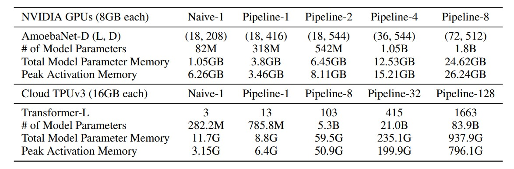

# GPipe: 使用微批次流水线(Micro-Batch Pipeline)轻松扩展并行性

# 0 摘要
&nbsp;&nbsp;&nbsp;&nbsp;&nbsp;&nbsp;&nbsp;&nbsp;扩展深度神经网络容量被认为是提高多个不同机器学习任务模型质量的有效方法。在许多情况下，将模型容量增加到单个加速器(GPU)的内存限制之外，需要开发特殊的算法或基础设施。这些解决方案通常是特定于体系结构(Megatron-LM)的，无法转移到其他任务中。为了解决高效且与**任务无关**的模型并行性需求，我们引入了GPipe，一个流水线并行性库(pipeline parallelism library)，允许扩展任何可以表示为层序列(a sequence of layers)的网络。通过在不同的加速器上(diff gpus)进行层子序列的流水线处理，GPipe能够高效地扩展各种不同网络的规模。此外，GPipe利用一种**新颖的批次分割流水线算法**，在模型跨多个加速器进行分割时实现几乎线性加速。我们通过在两个具有不同网络架构的不同任务上训练大规模神经网络来展示GPipe的优势：（一）图像分类：我们训练了一个含有5.57亿参数的AmoebaNet模型，在ImageNet-2012上达到84.4%的top-1准确率；（二）多语言神经机器翻译：我们训练了一个单一的60亿参数、128层的Transformer模型，涵盖100多种语言的语料库，实现了比所有双语模型更好的质量。 

# 1 引言
&nbsp;&nbsp;&nbsp;&nbsp;&nbsp;&nbsp;&nbsp;&nbsp;在过去的十年中，深度学习取得了巨大的进展，部分原因是由于开发了一些方法，促进了神经网络有效容量的扩展。这一趋势在图像分类领域最为明显，随着模型**容量的增加，ImageNet上的准确率也得到了提高**（图1a）。在自然语言处理领域也可以观察到类似的现象（图1b），简单的浅层句子表示模型(simple shallow  sentence representations models))[1, 2]被更深和更大的对应模型[3, 4]超越。 

&nbsp;&nbsp;&nbsp;&nbsp;&nbsp;&nbsp;&nbsp;&nbsp;尽管更大的模型为多个领域带来了显著的质量提升，但扩展(scaling)神经网络也带来了重大的实际挑战。硬件限制，包括加速器（GPU或TPU）上的内存限制和通信带宽，迫使用户将较大的模型分成不同的分区，并将不同的分区分配给不同的加速器。然而，**设计和实现高效的模型并行算法非常困难**，这往往需要从容量扩展、灵活性（或特定任务和架构的特定性）和训练效率之间做出艰难的选择。因此，大多数高效的模型并行算法都是特定于体系结构和任务的。随着深度学习应用的增多，对可靠且灵活的基础设施的需求不断增加，使研究人员能够轻松地为各种机器学习任务扩展神经网络。 

*(图1：(a)近年来代表性的最先进图像分类模型在ImageNet 2012验证数据集[5]上的top-1准确率与模型大小之间存在强相关性[6, 7, 8, 9, 10, 11, 12]。模型容量增加了36倍。红点表示550M参数的AmoebaNet模型的top-1准确率为84.4%。(b)与双语基线相比，在我们的大规模多语言内部语料库上，翻译质量（BLEU）随着模型大小的增加而改善的平均值。每个点T(L, H, A)表示具有L个编码器层和L个解码器层、前馈隐藏维度为H(hidden)和A(attention head)个注意力头的Transformer的性能。红点表示128层、60亿参数的Transformer的性能。)*  
*(注释：BLEU代表"Bilingual Evaluation Understudy"，是一种用于评估机器翻译结果质量的指标。BLEU: a Method for Automatic Evaluation of Machine Translation)*  

&nbsp;&nbsp;&nbsp;&nbsp;&nbsp;&nbsp;&nbsp;&nbsp;为了解决这些挑战，我们引入了GPipe，这是一个灵活的库，能够高效地训练大规模神经网络。GPipe通过将模型在不同的加速器之间进行分区(partitioning)，并支持在每个加速器上重新材料化((re-materialization))的方式，使任意深度神经网络架构能够超越单个加速器的内存限制[13, 14]。使用GPipe，每个模型可以被指定为一系列的层，并且连续的层组可以被分割成单元(cells)。然后，每个单元(cells)被放置在一个独立的加速器(gpu or tpu)上。基于这种分割设置，我们提出了一种新颖的具有批次分割(batch splitting)的流水线并行算法。我们首先将一个训练样本的小批量(mini-batch)拆分为更小的微批次(micro-batches)，然后将每组微批次的执行进行流水线处理。我们采用同步(synchronous)小批量梯度下降进行训练，其中**梯度在一个小批量的所有微批次中累积**，并在小批量结束时应用。因此，使用GPipe的梯度更新在分区数量上是一致的，使得研究人员可以通过部署更多加速器轻松地训练越来越大的模型。GPipe**还可以与数据并行性结合**，进一步扩大训练规模。 

&nbsp;&nbsp;&nbsp;&nbsp;&nbsp;&nbsp;&nbsp;&nbsp;我们在图像分类和机器翻译任务上展示了GPipe的灵活性和高效性。对于图像分类任务，我们使用ImageNet 2012数据集上的480×480输入训练了AmoebaNet模型。通过增加模型的宽度，我们将参数数量扩展到了5.57亿，并且获得了84.4%的top-1验证准确率。在机器翻译任务中，我们使用103种语言（102种语言到英语）训练了一个单一的128层、60亿参数的多语言Transformer模型。我们展示了这个模型在100种语言对上胜过了分别训练的3.5亿参数的双语Transformer Big[15]模型。 

# 2 GPipe库
&nbsp;&nbsp;&nbsp;&nbsp;&nbsp;&nbsp;&nbsp;&nbsp;我们现在描述GPipe的接口和主要设计特点。这个开源库是在Lingvo [16]框架下实现的。GPipe的核心设计特点通常适用于其他框架[17, 18, 19]，可以在其他框架中实现。 

图2: (a) 一个示例的神经网络，具有连续的层，被分割到四个加速器上。 $F_{k}$ 是第k个单元的组合前向计算函数。 $B_{k}$ 是反向传播函数，它依赖于来自上一层的 $B_{k+1}$ 和 $F_{k}$ 。(b) 朴素的模型并行策略由于网络的顺序依赖关系导致严重的低利用率。(c) 流水线并行将输入的小批次分割成较小的微批次，使得不同的加速器可以同时处理不同的微批次。梯度在最后同步应用。 

## 2.1 接口
&nbsp;&nbsp;&nbsp;&nbsp;&nbsp;&nbsp;&nbsp;&nbsp;任何深度神经网络都可以定义为L层的序列。每一层 $L_{i}$ 由一个前向计算函数 $f_{i}$ 和相应的参数集 $w_{i}$ 组成。GPipe还允许用户指定一个可选的计算成本估计函数 $c_{i}$ 。给定分区数K，L层的序列可以被分割成K个复合层，或称为cell。令 $p_{k}$ 包含层i和j之间的连续层。与 $p_{k}$ 对应的参数集等于 $w_{i} 、w_{i+1}、 \dots、w_{j}$ 的并集，它的前向函数为 $F_{k}=f_{j} \circ \ldots \circ f_{i+1} \circ f_{i}$ 。相应的反向传播函数 $B_{k}$ 可以通过自动符号微分从 $F_{k}$ 中计算得到。成本估计器 $C_{k}$ 被设置为 $\Sigma_{l=i}^{j} c_{l}$ 。 

&nbsp;&nbsp;&nbsp;&nbsp;&nbsp;&nbsp;&nbsp;&nbsp;GPipe接口非常简单和直观，用户只需要指定以下内容：(i) 模型分区的数量K，(ii) 微批次(micro-batch)的数量M，以及 (iii) 定义模型的L层序列和定义。请参考补充材料中的示例。 

## 2.2 算法
&nbsp;&nbsp;&nbsp;&nbsp;&nbsp;&nbsp;&nbsp;&nbsp;用户一旦根据模型参数 $w_{i}$ 、前向计算函数 $f_{i}$ 和成本估计函数 $c_{i}$ 定义了网络中的层序列，GPipe将网络分割为K个cell，并将第k个cell放置在第k个加速器上。通信原语(Communication primitives)会**自动**插入到分区边界，以允许相邻分区之间的数据传输(data transfer)。分区算法通过最小化所有cell的估计成本的方差(minimizes the variance)，以便通过在所有分区之间**同步计算时间**来最大化流水线的效率。 

&nbsp;&nbsp;&nbsp;&nbsp;&nbsp;&nbsp;&nbsp;&nbsp;在前向传播过程中，GPipe首先将大小为N的每个小批次分割成 **M个** 相等的微批次，然后通过K个加速器进行流水线处理。在反向传播过程中，根据前向传播过程中使用的相同模型参数，**计算每个微批次的梯度**。在每个小批次结束时，来自所有M个微批次的梯度**被累积并应用于更新所有加速器上的模型参数**。这一系列操作的顺序如图2c所示。 

&nbsp;&nbsp;&nbsp;&nbsp;&nbsp;&nbsp;&nbsp;&nbsp;如果网络中使用了批归一化（batch normalization）[20]，则在训练过程中，输入的足够统计量会在每个微批次和必要时在副本上进行计算[21]。我们还会跟踪**整个小批次(mini-batch)上**的足够统计量的移动平均值，以在评估过程(非训练)中使用。 

## 2.3 性能优化
&nbsp;&nbsp;&nbsp;&nbsp;&nbsp;&nbsp;&nbsp;&nbsp;为了减少激活内存需求，GPipe支持重新计算(re-materialization)[14]。在前向计算过程中，每个加速器只在分区边界处存储输出激活。在反向传播过程中，第k个加速器重新计算复合前向函数 $F_{k}$ 。因此，峰值激活内存需求降低到 $O(N + \frac{L}{K} \times \frac{N}{M})$ ，其中 $\frac{N}{M}$ 是微批次的大小， $\frac{L}{K}$ 是每个分区的层数。相比之下，如果不进行重新计算和分区，内存需求将为 $O(N \times L)$ ，因为计算梯度 $b_{i}$ 需要上一层的梯度 $b_{i+1}$ 和缓存的激活 $f_{i}(x)$ 。  

&nbsp;&nbsp;&nbsp;&nbsp;&nbsp;&nbsp;&nbsp;&nbsp;如图2c所示，分区会引入一些加速器的空闲时间，我们称之为冒泡开销(bubble overhead)。这个冒泡时间在微步数M(mini-batch 被分割为M个 mocro-batch)上的平摊是 $O(\frac{K-1}{M + K -1}$ 。在我们的实验中，当 M ≥ 4 × K (K 个 加速器)时，我们发现冒泡开销可以忽略不计。部分原因是因为在反向传播过程中，重新计算可以提前调度，而无需等待较早层的梯度。 

&nbsp;&nbsp;&nbsp;&nbsp;&nbsp;&nbsp;&nbsp;&nbsp;由于在加速器之间**只需要在分区边界传递激活张量**，所以GPipe引入了低通信开销。因此，即使在没有高速互连的加速器上，我们也可以实现高效的扩展性能。 

&nbsp;&nbsp;&nbsp;&nbsp;&nbsp;&nbsp;&nbsp;&nbsp;图2c假设分区是均衡的。然而，不同层的内存需求和计算量通常存在**很大的不平衡**。在这种情况下，不完美的分区算法可能会导致负载不平衡。更好的分区算法有可能改善我们的启发式方法的性能。 

# 3 性能分析
&nbsp;&nbsp;&nbsp;&nbsp;&nbsp;&nbsp;&nbsp;&nbsp;我们使用两种非常不同类型的模型架构来评估GPipe的性能：AmoebaNet [12] 卷积模型和Transformer [15] 序列到序列模型。我们进行了实验来研究它们的可扩展性、效率和通信成本。 

*(表格1：在不同场景下，GPipe支持的AmoebaNet的最大模型大小。Naive-1是指不使用GPipe的顺序版本。Pipeline-k表示在k个加速器上使用GPipe进行k个分区。AmoebaNet-D (L, D)：具有L个普通单元层和过滤器大小D的AmoebaNet模型。Transformer-L：具有L层，2048个模型和8192个隐藏维度的Transformer模型。每个模型参数需要12个字节，因为我们在训练过程中应用了RMSProp算法。)*

&nbsp;&nbsp;&nbsp;&nbsp;&nbsp;&nbsp;&nbsp;&nbsp;我们预计重计算和流水线并行性都将有利于内存利用率，从而使得适应巨型模型成为可能。我们在表格1中报告了在相当大的输入尺寸下GPipe能够支持的最大模型大小。对于AmoebaNet，我们在每个加速器具有8GB内存的Cloud TPUv2上运行了实验。我们使用了固定的输入图像大小为224×224和小批次大小为128。在没有GPipe的情况下，单个加速器可以训练高达8200万参数的AmoebaNet，受设备内存限制的约束。由于反向传播中的重新计算和批次分割，GPipe将中间激活的内存需求从6.26GB降低到3.46GB，使得**单个加速器上能够支持31800万参数**的模型。通过模型并行性，我们能够将AmoebaNet扩展到了**18亿参数，在8个加速器上进行训练**， 比没有GPipe时高出25倍。在这种情况下，由于AmoebaNet中模型参数在不同层之间分布不均衡，最大模型大小**并没有完全线性扩展**。 

&nbsp;&nbsp;&nbsp;&nbsp;&nbsp;&nbsp;&nbsp;&nbsp;接下来，我们使用每个加速器核心具有**16GB**内存的Cloud TPUv3训练了Transformer模型。我们使用了固定的词汇大小为32k，序列长度为1024，批次大小为32。每个Transformer层的模型维度为2048，前向隐藏维度为8192，注意力头数为32。我们通过改变层数来扩展模型。重计算使得在单个加速器上可以训练一个大约**2.7倍**的更大模型。使用128个分区，GPipe使得Transformer模型可以扩展到83.9B参数，比单个加速器上的可能性增加了**298倍**。与AmoebaNet不同，对于Transformer，最大模型大小与加速器数量**呈线性扩展**，因为每个层具有相同数量的参数和输入大小。 

&nbsp;&nbsp;&nbsp;&nbsp;&nbsp;&nbsp;&nbsp;&nbsp;为了评估效率，我们在表格2中报告了使用不同分区数量和不同微批次数量的GPipe对AmoebaNet-D（18, 256）和Transformer-48进行的训练吞吐量的归一化结果。每个分区分配给一个独立的加速器。我们观察到，当微批次数量M至少是分区数量的**4倍**时，冒泡开销几乎可以忽略不计。对于Transformer模型，当它在分区数量的四倍加速器上进行分区时，可以实现3.5倍的加速。此外，由于Transformer层的计算均匀分布，训练吞吐量几乎与设备数量呈线性扩展。相反，由于AmoebaNet模型的计算分布不平衡，它的加速比是亚线性的。当M相对较小时，冒泡开销就不再可以忽略了。当**M为1时，实际上没有流水线并行性**，我们观察到，M = 1 时，无论使用多少个加速器，吞吐量都保持相对稳定，这表明任何给定时间只有一个设备在进行计算。 

*(表格2：加速倍数与参数的关系表格，使用不同分区数量K和不同微批次数量M的GPipe在TPU上的归一化训练吞吐量。随着更多的微批次，性能提高。当M ≥ K时，Transformer模型的加速比几乎与加速器数量呈线性关系。如果需要，批次大小会进行调整以适应内存。)*

&nbsp;&nbsp;&nbsp;&nbsp;&nbsp;&nbsp;&nbsp;&nbsp;为了衡量GPipe的通信开销影响，我们在一台具有多个NVIDIA P100 GPU但没有NVLink的主机上运行了实验。跨GPU的数据传输必须通过PCI-E进行相对较慢的设备到主机和主机到设备传输。微批次数量M固定为32。如表3所示，当我们将分区数量从2增加到8时，我们观察到AmoebaNet-D（18, 128）的加速比为2.7倍。对于24层Transformer，加速比为3.3倍。与我们在配备高速互连的TPU上观察到的类似，存在类似的线性加速。由于GPipe仅在分区边界传输激活张量，设备之间的通信带宽不再成为模型并行性的瓶颈。 

# 4 图像分类
&nbsp;&nbsp;&nbsp;&nbsp;&nbsp;&nbsp;&nbsp;&nbsp;作为概念验证，我们首先使用GPipe对AmoebaNet进行了扩展。我们增加了AmoebaNet中的通道数，并将输入图像大小扩展到480×480。我们使用与[12]中描述的相同超参数，在ImageNet 2012数据集上训练了这个拥有5.57亿参数的AmoebaNet-B(18, 512)。网络被分为4个分区。这个单一模型在单图裁剪的情况下达到了84.4%的top-1和97%的top-5验证准确率 

&nbsp;&nbsp;&nbsp;&nbsp;&nbsp;&nbsp;&nbsp;&nbsp;我们进一步通过迁移学习[22, 23]在其他图像数据集上展示了巨型卷积网络的有效性。具体而言，我们使用预训练的ImageNet模型，在从通用到细粒度分类的各种目标数据集上进行微调。我们将最后一个softmax分类层的输出单元数更改为目标数据集中的类别数，并随机初始化新的softmax层。所有其他层都使用ImageNet预训练的初始化。在训练期间，网络的输入图像被调整为480×480，随机水平翻转，并使用cutout[24]进行数据增强。训练的超参数与ImageNet相同（我们在补充材料中提供了我们的训练设置的详细描述）。在表4中，我们报告了每个数据集进行了5次微调运行的平均单图裁剪测试准确率。我们的巨型模型在所有目标数据集上获得了有竞争力的结果。例如，CIFAR-10的错误率降低到了1%，CIFAR-100的错误率降低到了8.7%。这些结果证实了Kornblith等人的发现[25]，即更好的ImageNet模型具有更好的迁移性能。 

*(表格4：使用在ImageNet 2012上首先训练，然后在其他数据集上进行微调的AmoebaNet-B (18, 512)的图像分类准确率。有关我们训练设置的详细描述，请参阅补充材料。我们的微调结果是在5次微调运行中进行平均的。来自Real等人[12]和Cubuk等人[26]的基准结果是直接从头开始训练的。*Mahajan等人的模型[27]在非公开的Instagram数据上进行了预训练，达到了85.4%的top-1准确率。Ngiam等人[28]通过使用私有数据集（JFT-300M）进行预训练获得了更好的结果。)*

