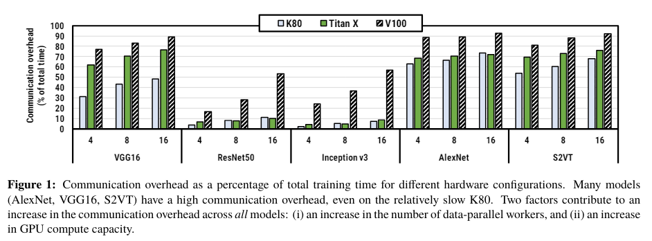
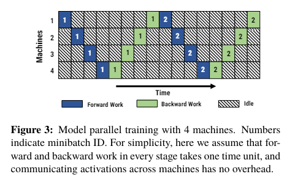

# PipeDream: Fast and Efficient Pipeline Parallel DNN Training
- [paper 论文](https://arxiv.org/pdf/1806.03377)

# 摘要
&nbsp;&nbsp;&nbsp;&nbsp;&nbsp;&nbsp;&nbsp;&nbsp;PipeDream是一种用于GPU的深度神经网络（DNN）训练系统，通过在多台机器上进行流水线执行来并行计算。其流水线并行计算模型**避免了**数据并行训练中面临的由于大型模型和/或有限的网络带宽引起的**高通信与计算比例而导致的减速问题**。**相对于数据并行训练，PipeDream相对于大型DNNs减少了高达95%的通信，并允许完全重叠的通信和计算**。PipeDream通过系统地**将DNN层分配给所有可用的GPU**，以平衡工作并最小化通信，为backward的正确性版本化模型参数，并以循环方式安排不同输入的正向和反向传递，以优化“达到目标准确性所需的时间”。在两个不同的集群上对五个不同的DNN进行的实验表明，与数据并行训练相比，**PipeDream在时间达到准确性(time-to-accuracy)方面最多快5倍**。 

# 1 引言
&nbsp;&nbsp;&nbsp;&nbsp;&nbsp;&nbsp;&nbsp;&nbsp;过去五年中，深度神经网络（DNN）的使用迅速增加，研究人员和实践者在广泛的应用领域中成功地应用这些模型，包括图像和视频分类、语音识别和语言翻译 [16, 17, 21, 22, 44]。随着DNN的广泛发展和使用，模型的规模也在增加，以增加其效果——现在的模型通常有数十到数百个层，总共约有1000万到2000万个参数。这样的增长不仅加剧了已经耗时且资源密集的DNN训练过程的压力，还导致了常用的并行化方法失效。 

&nbsp;&nbsp;&nbsp;&nbsp;&nbsp;&nbsp;&nbsp;&nbsp;最常见的方法是数据并行化，即将DNN模型复制到多个工作机器上，每个工作机器处理**训练数据**的一个子集。在各个工作机器上计算的权重更新(grads)被聚合起来(reduce)，以获得反映所有输入更新的最终权重更新。每次聚合传输的数据量与模型的大小成正比(传输的是weight的grad)。虽然**数据并行训练在**某些具有**高计算与通信比率（计算量/通信量）的流行模型上效果很好**，但两个重要趋势威胁了其效果。首先，不断增长的模型规模增加了每次聚合通信的量。事实上，**有些广泛使用的模型已经足够大，以至于通信开销已经超过了计算时间，限制了规模扩展并主导了总体训练时间**（例如，对于VGG-16，高达训练时间的85%）[36]。**其次，GPU计算能力的快速增长进一步将训练的瓶颈转移到了模型间的通信上**。我们的结果在三代NVIDIA GPU（Kepler、Pascal和Volta）以及五种不同的DNN模型上定量地展示了这些效果（图1）。 

&nbsp;&nbsp;&nbsp;&nbsp;&nbsp;&nbsp;&nbsp;&nbsp;另一种分布式训练的方法是**模型并行化**，传统上用于那些在训练过程中无法完全放入工作机器的内存或缓存的大型模型 [10, 25, 7]。模型并行训练涉及**将模型在工作机器之间进行分割**，使得**每个工作机器仅评估和更新模型的一部分参数**。然而，尽管模型并行化使得大型模型的训练成为可能，传统的模型并行化可能导致计算资源的严重浪费，因为它要么一次只能使用一个工作机器（如果每个层分配给一个工作机器），要么无法重叠计算和通信（如果每个层被分割）。此外，即使对于经验丰富的机器学习实践者来说，确定**如何最好地将DNN模型在工作机器之间分割也是一项具有挑战性的任务** [30]，通常会导致额外的低效。 

&nbsp;&nbsp;&nbsp;&nbsp;&nbsp;&nbsp;&nbsp;&nbsp;本文介绍了PipeDream，一种专门用于DNN的新型分布式训练系统。与模型并行化类似，它将DNN进行分割，并将各个层的**子集**分配给每个工作机器。但是，与传统的模型并行化不同，PipeDream采用了**激进的(aggressively)小批量处理流水线技术**，不同的woker在任何时间点处理不同的输入。这是通过将多个输入注入到具有第一个DNN层的工作机器中来实现的，从而保持流水线充满，并确保所有工作机器上的并发处理。它还对选定的层子集使用数据并行化以在工作机器之间平衡计算负载。我们**将这种流水线、模型并行化和数据并行化的组合称为流水线并行训练**。 

&nbsp;&nbsp;&nbsp;&nbsp;&nbsp;&nbsp;&nbsp;&nbsp;Pipeline-parallel并行训练有潜力在数据并行性受限时提供高效的深度神经网络（DNN）训练性能。特别是，在不同工作节点上分配的相邻层之间的前向传递中，工作节点之间的**相互通信可以限制在激活值和梯度之间(weight 不用通信)**。我们观察到，与数据并行训练相比，这种通信量**可以减少高达95%**。 

&nbsp;&nbsp;&nbsp;&nbsp;&nbsp;&nbsp;&nbsp;&nbsp;PipeDream是第一个以通用和自动化的方式结合了管道并行、模型并行和数据并行的系统。它通过解决多个挑战来实现管道并行的潜力。首先，就像处理器中的流水线处理一样，实现高效率需要将DNN正确地分割成“stage(阶段)”（layer-subsequences），**每个stage在不同的工作节点上执行(ps:每个worker只负责固定的stage)**；这取决于模型架构和硬件部署。错误的分割，即stage的工作量严重不平衡，可能导致工作节点花费大量时间处于闲置状态。PipeDream**根据短期性能分析运行自动确定如何对DNN的层进行分割**，使用一种平衡不同阶段计算负载并最小化通信的算法。其次，由于DNN不总是能均匀地分配给所有可用工作节点，**PipeDream可以在某些stage使用数据并行性，即将multiple workers分配给给定stage**，在并行处理不同的小批量数据。第三，与传统的单向流水线不同，DNN训练是双向的，即前向传递后面跟着反向传递，通过相同层以相反的顺序进行。PipeDream在每个worker上交替(interleaves)进行forward和backward小批量处理(**forward 和 backward 交错起来**)，同时确保在backward中将小批量数据路由到相同的工作节点。这有助于保持所有工作节点的繁忙状态，避免管道停顿，同时防止过多的进行中小批量数据，并确保模型收敛。第四，需要仔细管理权重版本，以获得训练结束时的高质量模型。我们发现，允许给定小批量的backward使用比对应的前向传递中使用的参数更为实时的参数可能会带来显著问题。**PipeDream为每个进行中(in-flight)的小批量数据维护参数值版本**，以解决这个问题。 
&nbsp;&nbsp;&nbsp;&nbsp;&nbsp;&nbsp;&nbsp;&nbsp;使用PipeDream进行的实验验证了其在我们评估的五个模型上的有效性，这些模型涵盖了两个重要的DNN类别——CNN和RNN（seq-to-seq）。在ILSVRC12数据集上训练Inception-v3 [19]、VGG16 [36]、Resnet-50 [16]和AlexNet [26]时，相比于数据并行BSP，PipeDream的训练加速效果分别为1.45倍、5.12倍、1.21倍和6.76倍。在MSVD [3]数据集上训练S2VT [43]模型时，相比于数据并行BSP，PipeDream的训练加速效果为3倍。 
&nbsp;&nbsp;&nbsp;&nbsp;&nbsp;&nbsp;&nbsp;&nbsp;总结起来，这篇论文有四个主要贡献。首先，它引入了一种专门针对DNN训练的并行化方法，通过将模型并行、积极的管道并行和数据并行相结合，解决了通信瓶颈的问题。其次，它确定了实现这一想法性能潜力的关键挑战，并详细介绍了每个挑战的解决方案。第三，它描述了一个高效实现管道并行DNN训练的系统（PipeDream）。第四，它通过实验证明了PipeDream在通信开销限制数据并行训练的情况下，包括数据并行比单机训练更慢的情况下，实现了并行DNN训练的可能性。 

# 2 背景与相关工作
&nbsp;&nbsp;&nbsp;&nbsp;&nbsp;&nbsp;&nbsp;&nbsp;本节讨论分布式深度神经网络（DNN）训练，包括术语、常见方法及其限制，以及使用图像分类模型训练作为具体示例的相关工作。 

## 2.1 DNN 训练
&nbsp;&nbsp;&nbsp;&nbsp;&nbsp;&nbsp;&nbsp;&nbsp;DNN 模型由不同类型的层序列组成（例如卷积、全连接、池化）。DNN 模型通常使用标记图像数据集进行训练。训练过程包括多个Epoch，其中每个Epoch是一个遍历整个数据集的迭代过程。在每个Epoch中，模型对数据集中的所有图像进行训练，分为多个step。在每个step中，当前模型首先对一个小的训练样本集（minibatch）进行预测，这个过程称为前向传递。在进行预测时，将输入数据从 minibatch 中提取，并输入到模型的第一层。然后，每层计算其输入，以产生输出供下一层使用。最后一层的输出是类预测。根据模型的预测标签和每个图像的实际标签，输出层计算损失（或错误）。在随后的反向传递中，每层计算 1）**前一层的错误和** 2）所有**相关层的权重更新（损失的梯度）**，从而使模型的预测向所需的输出靠近。 

&nbsp;&nbsp;&nbsp;&nbsp;&nbsp;&nbsp;&nbsp;&nbsp;DNN 训练的目标是在尽可能短的时间内获得高准确率模型。这个目标可以通过两个度量标准来衡量：**1) 统计效率，即达到所需准确率所需的Epoch 数量**；**2) 硬件效率，即完成单个Epoch 所需的时间**。达到所需准确率水平的总训练时间**只是这两个度量标准的乘积[15]**。为了在合理的时间内训练大型模型，训练通常分布在多个GPU 上，通常使用两种方法之一：数据并行或模型并行。 

&nbsp;&nbsp;&nbsp;&nbsp;&nbsp;&nbsp;&nbsp;&nbsp;**数据并行**。使用数据并行，输入数据集被分区到多个GPU 上。每个GPU 都维护着模型的**完整副本**，并在其自己的数据分区上进行训练，同时周期性地与其他GPU同步权重，使用集体通信原语[14] 或参数服务器[28,9]。参数同步的频率对统计效率和硬件效率都产生影响。 

&nbsp;&nbsp;&nbsp;&nbsp;&nbsp;&nbsp;&nbsp;&nbsp;在一方面，每个小批量结束时进行同步（referred to as bulk synchronous parallel or BSP [42]）可以减少用于计算梯度的权重过时，确保良好的统计效率。然而，如图2所示，**BSP要求每个GPU等待其他GPU的梯度**，从而显著降低了硬件效率。尽管存在诸如无等待反向传播（Wait-free Backpropagation）[47]等优化技术，其中weight grad一旦可用就立即发送（在现代参数服务器中常见），但由于DNN计算的结构以及**通信往往会占据总执行时间的主导地位，数据并行训练中的通信停滞是不可避免的**。此外，计算速度的快速增加进一步加剧了这个问题。 

&nbsp;&nbsp;&nbsp;&nbsp;&nbsp;&nbsp;&nbsp;&nbsp;图1定量地显示了在“大众”公共云服务器上运行的五个不同DNN模型，在使用三代不同的NVIDIA GPU（Kepler（K80），Pascal（Titan X）和Volta（V100））以及通过**10Gbps网络连接时**，花费在通信停顿上的训练时间的比例。我们关注三个要点。首先，从像K80这样较慢的GPU开始，我们注意到一些CNN（VGG16和AlexNet）以及用于视频转录的序列到序列模型（S2VT）在通信上花费了相当多的时间。而ResNet50和Inception-v3等网络的通信开销相对较低。其次，**随着数据并行workers进程数量的增加，所有模型的通信开销也会增加**。第三，随着GPU计算速度的提高（从K80到V100），所有五个模型的通信停顿(stalls)也会增加。 

&nbsp;&nbsp;&nbsp;&nbsp;&nbsp;&nbsp;&nbsp;&nbsp;先前的研究提出了更宽松的同步模型，其中每个GPU在没有等待其他GPU的梯度的情况下继续计算下一个小批量数据。我们称之为**异步并行或ASP的方法可以减少GPU的空闲时间**，从而提高硬件效率与BSP相比。然而，这个过程可能导致在**过时权重(stale weights)** 上计算梯度，从而降低统计效率。我们的实验结果支持最近的研究发现的观点：ASP并不能减少端到端的DNN训练时间[9, 1, 4]。 

&nbsp;&nbsp;&nbsp;&nbsp;&nbsp;&nbsp;&nbsp;&nbsp;**模型并行**。在模型并行中，模型被分割到多个GPU上，每个GPU只负责模型的一部分。对于矩阵分解、主题建模和线性回归等机器学习（ML）问题，先前的研究[29, 27, 45, 23]表明，由于不使用极大的mini-batch而导致的改进统计效率，**模型并行通常可以实现更快的训练时间**；STRADS框架[23]显示，通过将多个小批量进行流水线处理，可以进一步改善这些ML问题的训练时间。**模型并行也已经被用于DNN，但传统上只被视为最后的选择**，当模型训练的工作集太大无法适应单个工作进程的内存或缓存[25, 7, 10]（使得数据并行不可行）。这是因为传统的模型并行DNN训练存在两个主要限制。 

&nbsp;&nbsp;&nbsp;&nbsp;&nbsp;&nbsp;&nbsp;&nbsp;首先，**模型并行的DNN训练导致GPU资源的严重浪费**，如图3所示。图中展示了将DNN层在四台机器上进行分割的情况，每台机器负责一组连续的层(a group of consecutive layers)；在这种情况下，这些组之间的**层间值（激活和梯度）是需要在机器之间进行通信的唯一参数**。对于每个mini-batch，任何时刻只有一个stage处于活动状态。连续地进行多个mini-batch数据的流水线处理可以提高利用率，但传统上并不这样做，因为：1）DNN具有双向性（前向传播后会按相反的顺序进行反向传播），这使得流水线处理具有挑战性，而且更重要的是2）简单的流水线处理机制会在**过时的权重上**进行权重更新计算，导致最终模型的准确性低于数据并行训练的准确性。 

&nbsp;&nbsp;&nbsp;&nbsp;&nbsp;&nbsp;&nbsp;&nbsp;其次，将模型分割到多个GPU上的负担落在程序员身上[25]，导致出现了临时解决方案。最近的研究探索了使用强化学习来自动确定模型并行的设备放置[30]。然而，这种在线决策技术非常耗时和资源密集，而且它们不能无缝地结合流水线处理、数据并行和模型并行。 

