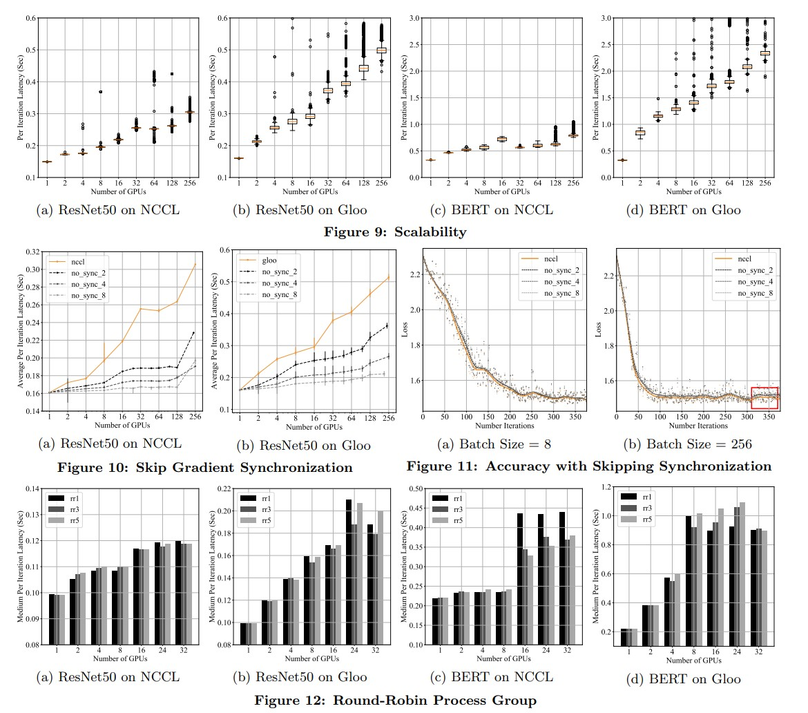

# PyTorch Distributed: Experiences on Accelerating Data Parallel Training

# 摘要
&nbsp;&nbsp;&nbsp;&nbsp;&nbsp;&nbsp;&nbsp;&nbsp;本文介绍了PyTorch分布式数据并行模块的设计、实现和评估。PyTorch是一个广泛采用的科学计算包，用于深度学习研究和应用。深度学习的最新进展表明大型数据集和大型模型的价值，这需要能够将模型训练扩展到更多的计算资源上。数据并行性已经成为分布式训练的流行解决方案，因为它具有直观的原理和广泛的适用性。一般而言，分布式数据并行技术在**每个计算资源上复制模型**，独立生成梯度，然后在每次迭代中通信这些梯度以保持模型副本的一致性。尽管这种技术在概念上很简单，但**计算和通信之间的微妙依赖关系使得优化分布式训练效率变得非常复杂**。从v1.5版本开始，PyTorch本地提供了多种技术来加速分布式数据并行，包括**梯度分桶、计算与通信的重叠以及跳过梯度同步**等。评估结果表明，适当配置时，PyTorch分布式数据并行模块在使用256个GPU时实现了近线性的可扩展性.<br>

# 1 引言
&nbsp;&nbsp;&nbsp;&nbsp;&nbsp;&nbsp;&nbsp;&nbsp;深度神经网络（DNN）已经为各种应用提供了动力，包括图像识别[20]、语言翻译[15]、异常检测[16]、内容推荐[38]、药物发现[33]、艺术生成[28]、游戏玩法[18]和自动驾驶汽车[13]等。许多应用通过使用更大的模型和更大的数据集来优化以追求更高的智能，这需要分布式训练系统的进一步发展。在现有的解决方案中，分布式数据并行是一种主导策略，因为它对系统的**干扰最小**。本文介绍了PyTorch v1.5中分布式数据并行包的设计、实现和评估。<br>
&nbsp;&nbsp;&nbsp;&nbsp;&nbsp;&nbsp;&nbsp;&nbsp;训练DNN模型通常需要反复进行三个步骤[26]：前向传播计算损失，反向传播计算梯度，以及优化器步骤更新参数。数据并行性的概念普遍适用于这样的框架。应用程序可以创建多个模型副本，每个模型副本都在一部分训练数据上工作，并**独立执行前向传播和反向传播**。然后，模型副本可以根据算法同步它们的梯度或更新的参数。在应用程序端纯粹构建一个可工作的数据并行版本理论上是可能的，因为它只需要在每次迭代中插入适当的通信。然而，为了挤出最后一丝性能，需要在设计和调优上投入大量的工作。在平台端提供本地的分布式数据并行API可以帮助应用程序开发人员专注于优化他们的模型，而平台开发团队可以持续透明地提高训练速度。提供一个通用的分布式数据并行包面临三个挑战。<br>
- **数学等价性**：数据并行的目的是加速在**大型数据集**上的训练。应用程序期望获得与在没有模型复制的情况下进行本地训练时相同的结果模型。这要求尽管是分布式的，但**在数学上等价于本地训练**。
- **非侵入性和拦截式API**：应用程序开发通常从本地模型开始，然后在需要时扩展。为了避免在过渡期间出现巨大的困难，API必须对应用程序代码**非侵入性**。另一方面，API需要允许内部实现及时拦截信号以进行通信和系统优化。
- **高性能**：数据并行训练受到计算和通信之间微妙依赖关系的影响。设计和实现必须探索解决方案空间，以将更多资源高效地转化为更高的训练吞吐量。

&nbsp;&nbsp;&nbsp;&nbsp;&nbsp;&nbsp;&nbsp;&nbsp;PyTorch提供了分布式数据并行作为一个nn.Module类，应用程序在构造时将它们的模型作为子模块提供。为了保证数学等价性，所有副本从相同的初始模型参数值开始，并在训练迭代中同步梯度以保持参数的一致性。为了最小化对应用程序的干扰，实现暴露了与用户模型相同的前向传播API，允许应用程序无需额外的代码更改，无缝地将用户模型的后续出现替换为分布式数据并行模型对象。设计中集成了几种技术来提供高性能的训练，包括**梯度分桶、计算与通信的重叠以及跳过同步**。<br>

&nbsp;&nbsp;&nbsp;&nbsp;&nbsp;&nbsp;&nbsp;&nbsp;我们在一个独立的32-GPU集群上进行了评估，并在一个更大的共享授权(entitlement)中使用了256个GPU。我们开发了基准测试来评估分布式包在不同规模下的性能，以深入了解不同优化技术和配置的性能影响。实验还涵盖了NCCL和Gloo通信库之间的比较。结果表明：<br>
1. **通信是训练延迟(latency)的主要因素**，并且其影响随着模型规模的增大而增加；
2. **桶大小对通信效率有很大影响**，如果适当配置，可以实现超过2倍的加速；
3. **适当跳过同步操作可以显著减少平摊的通信开销，而不明显降低收敛速度。**

&nbsp;&nbsp;&nbsp;&nbsp;&nbsp;&nbsp;&nbsp;&nbsp;本文介绍的技术首次在PyTorch v1.1中发布。在过去的一年中，我们看到这些技术在内部和外部都得到了广泛采用。在Facebook内部，从2020年5月11日到2020年6月5日期间的工作负载研究显示，在各种应用程序中，包括语音、视觉、移动视觉、翻译等，超过60%的 production GPU hours 都用于PyTorch分布式数据并行包。本文有三个主要贡献。首先，本文揭示了一个被广泛采用的工业级分布式训练解决方案的设计和实现。其次，本文强调了以前工作中忽视的实际注意事项（例如，由于复数图形）。第三，我们分享了从为内部团队和开源社区用户提供服务中收集到的性能调优经验，并总结了未来改进的几个方向。<br>

&nbsp;&nbsp;&nbsp;&nbsp;&nbsp;&nbsp;&nbsp;&nbsp;本文的剩余部分组织如下。第2节简要介绍了PyTorch和数据并行性。第3节详细介绍了PyTorch分布式数据并行模块的设计。第4节和第5节分别介绍了实现和评估。然后，第6节讨论了所学到的经验和未来改进的机会，第7节调查了相关工作。最后，第8节总结了本文。<br>

# 2 背景
&nbsp;&nbsp;&nbsp;&nbsp;&nbsp;&nbsp;&nbsp;&nbsp;在深入讨论分布式训练之前，让我们简要讨论使用PyTorch进行本地模型训练的实现和执行方式。然后，我们解释和证明了数据并行的概念，并描述了通信原语。<br>

## 2.1 PyTorch
&nbsp;&nbsp;&nbsp;&nbsp;&nbsp;&nbsp;&nbsp;&nbsp;PyTorch将值(values)组织成张量（Tensors），它们是具有丰富的数据操作算子的通用n维数组。模块（Module）定义了从输入值到输出值的转换，其在前向传播期间的行为由其forward成员函数指定。一个模块可以包含张量作为参数。例如，线性模块（Linear Module）包含一个权重参数和一个偏差参数，其forward函数通过将输入与权重相乘并添加偏差来生成输出。应用程序通过在自定义的forward函数中连接本地模块（如线性模块、卷积模块等）和函数（如relu、池化等）来组合自己的模块。典型的训练迭代包括前向传播（使用输入和标签生成损失）、反向传播（计算参数的梯度）和优化器步骤（使用梯度更新参数）。更具体地说，在前向传播过程中，PyTorch构建自动求导图来记录执行的操作。然后，在反向传播过程中，它使用自动求导图进行反向传播以生成梯度。最后，优化器将梯度应用于更新参数。训练过程重复这三个步骤，直到模型收敛。<br>

## 2.2 数据并行性
&nbsp;&nbsp;&nbsp;&nbsp;&nbsp;&nbsp;&nbsp;&nbsp;PyTorch提供了几种工具来促进分布式训练，包括: <br>
- DataParallel用于在**同一台机器上**使用多个GPU进行**单进程多线程**数据并行训练;
- DistributedDataParallel用于在**多个GPU和多台机器上**进行**多进程**数据并行训练;
- 以及RPC [6]用于通用分布式模型并行训练（例如参数服务器 [27]）。
本文重点介绍DistributedDataParallel。

&nbsp;&nbsp;&nbsp;&nbsp;&nbsp;&nbsp;&nbsp;&nbsp;数据并行性通过**在优化器步骤之前传递梯度**来实现分布式训练，以确保所有模型副本的参数都**使用完全相同的梯度更新**，从而使模型副本在迭代中保持一致。<br>
&nbsp;&nbsp;&nbsp;&nbsp;&nbsp;&nbsp;&nbsp;&nbsp;**参数平均**是另一种常用的扩展模型(scale-out)训练的技术。类似地，它可以在多台机器上启动多个进程，但与同步梯度不同，参数平均直接计算所有模型参数的平均值。这**发生在本地优化器步骤之后**，这意味着参数平均可以完全作为辅助步骤实现，不需要与本地训练步骤交互，这非常方便和清晰地**解耦了分布式训练和本地迭代的代码**。参数平均也存在一些注意事项。<br>

- 参数平均与本地训练相比，可能会产生截然不同的结果，有时会对模型的准确性产生不利影响。根本原因在于，参数平均在数学上与在本地处理所有输入数据并不等价，特别是当优化器依赖于过去的局部梯度值（例如动量）时。由于不同的模型副本可能看到不同的梯度，参数平均和本地训练相比可能会产生截然不同的结果，有时对模型的准确性有害。其根本原因是，参数平均在数学上与本地处理所有输入数据并不等效，特别是当优化器依赖于过去的局部梯度值（例如动量）时。由于不同的模型副本可能会看到不同的梯度，优化器中的状态可能逐渐发散，导致梯度下降方向冲突。这可能导致在从局部优化的模型切换到大规模部署的模型时，性能出现无法解释的差异。<br>
- 参数平均的结构将计算（即反向传播）和通信（即计算平均值）分为**不重叠**的阶段，使用优化器的**step()函数作为硬分界点**。无论我们如何强化计算或通信的优化，一种类型的资源在任何给定的时间点都会处于空闲状态，放弃了大量的性能优化机会。<br>
*(注释：因为反向传播需要知道weight的值）*

&nbsp;&nbsp;&nbsp;&nbsp;&nbsp;&nbsp;&nbsp;&nbsp;基于上述基本陷阱(pitfalls)，我们决定使用数据并行来实现分布式训练，以**同步梯度(gradient)而不是参数(parameters)**。请注意，应用程序仍然可以轻松地使用PyTorch构建参数平均。事实上，第3.3节中描述的集合通信功能是这种用例的适当解决方案。应用程序只需要显式地启动AllReduce操作，以相应地计算平均参数。<br>

## 2.3 AllReduce
&nbsp;&nbsp;&nbsp;&nbsp;&nbsp;&nbsp;&nbsp;&nbsp;AllReduce是DistributedDataParallel使用的原始通信API，用于在所有进程之间计算梯度求和(sum)。它受到多个通信库的支持，包括NCCL [2]、Gloo [1]和MPI [4]。AllReduce操作要求每个参与的进程提供一个**大小相等的张量**，对来自所有进程的输入张量进行共同的算术操作（例如求和、乘积、最小值、最大值），并**将相同的结果张量返回给每个参与者**。一个简单的实现可以让每个进程将其输入张量广播到所有对等进程，然后独立地应用算术操作。然而，由于**AllReduce对分布式训练速度有重大影响**，通信库已经实现了更复杂、更高效的算法，例如基于环的AllReduce [2]和基于树的AllReduce [22]。由于一个AllReduce操作直到所有进程都加入才能开始，因此它被认为是一种**同步通信**，与**参数服务器 [27]** 中使用的点对点通信形成对比。<br>

# 3系统设计


&nbsp;&nbsp;&nbsp;&nbsp;&nbsp;&nbsp;&nbsp;&nbsp;PyTorch [30] 提供了一个DistributedDataParallel (DDP)模块，可以帮助在多个进程和机器上轻松并行化训练。在分布式训练中，每个进程都有自己的**本地模型副本**和**本地优化器**。就正确性而言，分布式数据并行训练和本地训练必须在数学上等价。DDP通过**确保所有模型副本从完全相同的模型状态开始**，并在每次反向传播后看到**相同的参数梯度**来保证正确性。因此，即使来自不同进程的优化器都是独立的，它们应该能够在每次迭代结束时将其本地模型副本带到相同的状态。图1展示了DDP的构建模块，包括Python API前端、C++梯度减少核心算法(gradient reduction core algorithm)，并采用c10d集合通信库。以下各节按照这个堆栈图的自顶向下顺序来介绍。<br>
*(注释：对于具有固有随机性的优化器，不同的进程可以使用相同的随机种子来初始化它们的状态。)* <br>
&nbsp;&nbsp;&nbsp;&nbsp;&nbsp;&nbsp;&nbsp;&nbsp;第3.1节介绍了API设计原则。第3.2节解释了PyTorch分布式数据并行训练中使用的梯度减少(gradient reduction)技术。最后，第3.3节讨论了DDP的集合通信后端。<br>

## 3.1 API
&nbsp;&nbsp;&nbsp;&nbsp;&nbsp;&nbsp;&nbsp;&nbsp;在设计API时，我们制定了两个设计目标，以实现所需的功能。<br>
- 非侵入性：API必须对应用程序是非侵入性的。应用程序开发人员通常从编写本地训练脚本开始，在单台机器上达到资源限制时才扩展。此时，要求开发人员重写整个应用程序以启用分布式数据并行训练是不可接受的。相反，开发人员应该能够最小限度地修改并重用本地训练脚本。
- 拦截性(Interceptive)：API需要允许实现(implementation)拦截各种信号并及时触发适当的算法。分布式数据并行旨在通过使用更多计算资源加速训练。这个过程需要在计算和通信中进行微妙(subtle)的优化，以实现最佳性能。因此，API必须尽可能多地向内部实现暴露优化机会。<br>

&nbsp;&nbsp;&nbsp;&nbsp;&nbsp;&nbsp;&nbsp;&nbsp;根据上述要求，我们将**分布式数据并行(DDP)实现为一个nn.Module**，它将**本地模型(local model)作为构造函数参数**，并在反向传播中透明地同步梯度(synchronizes)。下面的代码片段展示了使用DDP模块的示例。该示例使用nn.Linear层在第10行创建一个本地模型。然后，在第11行将本地模型转换为分布式训练模型，并在第12行设置优化器。第14到23行是典型的前向传播、反向传播和优化器步骤的实现。在这个玩具(toy)分布式训练示例中，第11行是将本地训练应用程序转换为分布式应用程序的唯一区别，这满足了非侵入性的要求。它还满足了拦截性的要求。构造函数允许DDP检查模型结构和参数。**构造完成后，本地模型将被分布式模型替换**，然后可以轻松拦截(Intercept)forward()调用以执行相应的操作。对于反向传播，DDP依赖于**反向钩子**来触发(trigger)梯度减少，当在损失张量上执行backward()时，它(gradient reduction)将由自动求导引擎调用.<br>

```python
1 import torch
2 import torch.nn as nn
3 import torch.nn.parallel as par
4 import torch.optim as optim
5
6 # initialize torch.distributed properly
7 # with init_process_group
8
9 # setup model and optimizer
10 net = nn.Linear (10 , 10)
11 net = par.DistributedDataParallel( net )  # 唯一区别
12 opt = optim.SGD(net.parameters() , lr =0.01)
13
14 # run forward pass
15 inp = torch.randn (20 , 10)
16 exp = torch.randn (20 , 10)
17 out = net(inp)
18
19 # run backward pass
20 nn.MSELoss()(out , exp ).backward ()
21
22 # update parameters
23 opt.step ()
```

## 3.2 梯度减少（gradient reduction）
&nbsp;&nbsp;&nbsp;&nbsp;&nbsp;&nbsp;&nbsp;&nbsp;DDP中的梯度减少算法在过去的版本中有所发展。为了介绍当前实现的结构，让我们从一个简单的解决方案开始，逐渐引入更多的复杂性，并在PyTorch v1.5.0中得到当前版本。这也将解释为什么在3.1节中描述的相同简单API允许我们安装各种性能优化算法。<br>

### 3.2.1 一个简单的解决方案
&nbsp;&nbsp;&nbsp;&nbsp;&nbsp;&nbsp;&nbsp;&nbsp;正如在第3节开头提到的，DDP通过让所有训练进程(1)从相同的模型状态开始，(2)在每次迭代中使用相同的梯度来保证正确性。前者可以通过在DDP构造时将**模型状态**从一个进程**广播**到所有其他进程来实现。要实现后者，一个简单的解决方案可以在**本地反向传播之后、更新本地参数之前插入梯度同步阶段**。然而，3.1节中展示的API在这个阶段之间没有提供明确的入口，因为在backward()和step()之间没有任何内容。幸运的是，PyTorch的自动求导引擎接受自定义的反向传播钩子。DDP可以**注册自动求导钩子**，以**在每次反向传播后触发计算**。当钩子触发时(fired)，每个钩子都会扫描所有本地模型参数，并从每个参数中检索梯度张量。然后，它使用AllReduce集合通信调用在所有进程上计算每个参数的平均梯度，并将结果写回梯度张量中。<br>

&nbsp;&nbsp;&nbsp;&nbsp;&nbsp;&nbsp;&nbsp;&nbsp;这个简单的解决方案对于我们的目的是足够的，但存在两个性能问题：
- 集体通信(collective communication)在小张量上的性能较差，这在具有大量小参数的大型模型上尤为明显。
- 将梯度计算和同步(synchronization)分开会失去在计算和通信之间进行重叠的机会，因为它们之间存在硬边界(hard boundary)。
下面的章节将阐述解决上述两个问题的方法。<br>

### 3.2.2 梯度分桶


&nbsp;&nbsp;&nbsp;&nbsp;&nbsp;&nbsp;&nbsp;&nbsp;梯度分桶的思想源于一个观察结果，即集体通信在大张量上的效率更高。图2(a)和(b)提供了一个定量的观点，展示了使用不同参数数量进行AllReduce的总执行时间，其中包括60M个torch.float32参数。为了最大化带宽利用率，**所有的AllReduce操作都是异步启动的（launched asynchronously）**，并且一起等待所有操作完成，模拟DDP的梯度减少算法。实验是在一台启用了NVLink [3]的服务器上进行的，配备了两个NVIDIA Quadro GP100 GPU。NCCL[2] AllReduce直接在CUDA输入张量上运行，而Gloo[1] AllReduce在CPU输入张量上运行，以消除**使用Gloo后端时在CUDA内存和CPU内存之间复制**的开销。从图中可以清楚地看到，对于NCCL和Gloo，使用更大的输入张量时总的通信时间显著减少。Gloo在每个输入张量大约500K个参数时达到最高速度，而对于具有20M参数GPU张量的NVLink上的NCCL来说，没有明显的饱和信号。<br>
&nbsp;&nbsp;&nbsp;&nbsp;&nbsp;&nbsp;&nbsp;&nbsp;这些实验表明，DDP可以在每个梯度张量可用时不立即启动专用的AllReduce，而是等待一段时间，将多个梯度分桶到一个AllReduce操作中，从而实现更高的吞吐量和更低的延迟。这对于具有许多小参数的模型尤其有帮助。然而，DDP不应该在一个单独的AllReduce中通信所有的梯度，否则在计算结束之前将无法开始通信。图2(c)和(d)显示了包含大约60M参数的ResNet152[20]的GPU和CPU反向计算时间。X轴是准备好的梯度数量，Y轴是自反向传播开始以来经过的时间。在**GPU上的反向传播大约需要250毫秒才能完成，与NVLink上的NCCL的时间量级相同**。这个结论也适用于Gloo和CPU的反向传播。这些测量结果表明，通过使用相对较小的桶大小，DDP可以在后向传播过程中并行启动AllReduce操作，以实现通信与计算的重叠，这将在每次迭代的延迟上产生差异。<br>


### 3.2.3通信重叠计算
&nbsp;&nbsp;&nbsp;&nbsp;&nbsp;&nbsp;&nbsp;&nbsp;梯度的AllReduce操作可以在本地反向传播完成**之前**开始。通过使用分桶，DDP只需在启动通信之前等待同一个桶中的所有内容。在这种设置下，仅在反向传播结束时触发AllReduce已经不再足够。它需要对**更频繁的信号**作出反应，并更及时地启动AllReduce。因此，DDP为每个梯度累加器注册一个自动求导钩子(autograd hook)。钩子在其对应的**梯度累加器更新梯度之后触发**，并检查其所属的桶。如果**同一个桶中的所有梯度的钩子都已经触发**，最后一个钩子将在该桶上触发一个异步的AllReduce操作。<br>

&nbsp;&nbsp;&nbsp;&nbsp;&nbsp;&nbsp;&nbsp;&nbsp;有两个需要注意的问题。首先，所有进程的减少顺序(reducing order)必须相同，否则AllReduce的内容可能不匹配，导致错误的减少结果或程序崩溃。然而，PyTorch在每次前向传递中**动态**构建自动求导图，不同的进程可能无法就梯度准备的顺序达成一致。图3(a)展示了一个例子，其中两个垂直轴表示时间，虚线表示梯度何时准备就绪。在进程1中，四个梯度按顺序计算，但在进程2中，梯度 $g_{2}$ 在 $g_{3}$ 和 $g_{4}$ 之后计算。在这种情况下，如果所有进程在梯度准备就绪后立即进行AllReduce，那么AllReduce的内容将不匹配。因此，**所有进程必须使用相同的桶排序顺序**，并且在启动桶i+1之前，没有进程可以在桶i上启动AllReduce。**如果桶0是最后一个准备就绪的桶(桶0先开始)，通信就无法与计算重叠**。PyTorch v1.5.0通过使用model.parameters()的**相反顺序**作为桶排序顺序来解决了这个问题，假设层次很可能按照与前向传递中调用它们的顺序相同的顺序进行注册。因此，相反的顺序应该**近似**表示反向传播中的梯度计算顺序。诚然，这不是一个完美的解决方案，但是它是一个可以依靠的近似解决方案，几乎没有额外的工程开销。<br>

&nbsp;&nbsp;&nbsp;&nbsp;&nbsp;&nbsp;&nbsp;&nbsp;第二个需要注意的问题是，训练迭代可能只涉及模型中的一个子图，而且这个子图可能在每次迭代时都不同，这意味着**某些梯度在某些迭代中可能被跳过**。然而，由于**梯度到桶的映射是在构建时确定的**，这些缺失的梯度会**导致某些桶永远不会看到最终的自动求导钩子**，并且无法将桶标记为准备就绪。结果，反向传播可能会停滞不前。图3(b)展示了一个例子，在其中，与梯度 $g_{3}$ 对应的参数**在某个迭代中被跳过**，导致了 $g_{3}$ 的准备就绪信号缺失。为了解决这个问题，DDP从前向传递的输出张量(loss)开始遍历自动求导图，以找到所有参与的参数。这些参与的张量的准备就绪（readiness）是一个足够的信号，可以推断出反向传递的完成。因此，DDP可以避免等待其余参数梯度的到来，而是**在前向传递结束时主动标记它们为准备就绪**。需要注意的是，这个改变并不妨碍我们开发非侵入式的API，因为应用程序直接在DDP上调用前向函数，因此DDP可以在其成员函数中轻松插入这一步骤。 <br>


&nbsp;&nbsp;&nbsp;&nbsp;&nbsp;&nbsp;&nbsp;&nbsp;算法1展示了DDP的伪代码。构造函数包含两个主要步骤，**广播模型状态**和**安装自动求导钩子**。DDP的前向函数是本地模型前向传递的简单包装器，并**遍历自动求导图以在结束时标记未使用的参数**。**自动求导钩子以内部参数索引作为输入**，这有助于找到参数张量及其所属的桶。它**将局部梯度写入桶中的正确偏移位置**，然后启动异步的AllReduce操作(不同的桶可以同时开始)。伪代码中省略了一个额外的最终化步骤，该步骤等待AllReduce操作，并在反向传递结束时将值写回梯度中。图4阐明了(elucidates)DDP在前向传递和反向传递中如何与本地模型交互。<br>


&nbsp;&nbsp;&nbsp;&nbsp;&nbsp;&nbsp;&nbsp;&nbsp;上述解决方案适用于大多数情况。然而，由于**DDP始终计算所有梯度的平均值并将其写回参数的.grad字段(field)**，优化器无法区分一个梯度是否参与了最近的反向传播。由于DDP和优化器的解耦(decoupled)设计，DDP没有侧信道(side channel)来向优化器暗示这些信息。在没有这些信息的情况下，训练过程可能会导致模型准确性的回归，例如，当优化器使用梯度缺失信息来跳过更新动量值时。为了解决这个问题，**DDP应该只处理确实参与了反向传播的梯度**。然而，仅凭本地自动求导图无法提取这些信息，因为本地缺失的梯度仍可能在同行(peer)DDP进程的前向/反向传播中使用。因此，**DDP使用位图(bitmap)来跟踪本地(bitmap)参数的参与情况**，并发起一个**额外的**AllReduce操作来收集全局未使用的参数。不幸的是，由于元素类型可能不匹配，DDP无法将这个位图合并到其他梯度AllReduce操作中。这种额外的开销只在应用程序明确告诉DDP查找未使用的参数时才会出现，因此只在必要时才需要支付这个代价。<br>

### 3.2.4 梯度累积
&nbsp;&nbsp;&nbsp;&nbsp;&nbsp;&nbsp;&nbsp;&nbsp;一种常见的加速分布式数据并行训练的技术是减少梯度同步的频率。应用程序可以在每次迭代之前进行**n次本地训练迭代**，而不是在每次迭代中都启动AllReduce操作，然后再进行全局梯度同步。如果输入批次过大而无法适应设备，这也会很有帮助。在这种情况下，应用程序可以将一个输入批次分成多个微批次(micro-batch)，在每个微批次上运行本地的前向和反向传播，并仅在大批次的边界处启动梯度同步。从理论上讲，这应该产生与一次处理大批次中的所有数据相同的结果，因为**梯度将简单地累积到同一个张量中**。然而，这在一定程度上与第3.2.3节中讨论的梯度规约算法存在冲突。该算法会在每次前向传递结束时将未使用的参数标记为就绪状态，而在一个迭代中未使用的参数仍然可以参与后续的迭代。此外，DDP无法区分应用程序是否计划在反向传播后立即调用optimizer.step()函数，还是通过多次迭代累积梯度。因此，我们需要为这种情况引入一个额外的接口（即no sync）。下面是一个示例代码片段。<br>

```python
1 ddp = DistributedDataParallel(net)
2 with ddp.no_sync():
3   for inp, exp in zip(inputs, expected_outputs):
4      # no synchronization, accumulate grads
5      loss_fn (ddp(inp), exp).backward()
6 # synchronize grads
7 loss_fn(ddp(another_inp), another_exp).backward()
8 opt.step()
```
&nbsp;&nbsp;&nbsp;&nbsp;&nbsp;&nbsp;&nbsp;&nbsp;底层实现中，no sync 的实现非常简单。上下文管理器在进入和退出上下文时只是切换一个标志，并且该标志在 DDP 的前向函数中被使用。在 no sync 模式下，**所有的 DDP 钩子都被禁用**，而上下文之外的第一次反向传播将会将累积的梯度进行同步(sync)。全局未使用参数的信息也会在位图(bit-map)中累积，并在下一次通信发生时使用。<br>

## 3.3 集体通信
&nbsp;&nbsp;&nbsp;&nbsp;&nbsp;&nbsp;&nbsp;&nbsp;分布式数据并行(DDP)训练使用了一种特殊的通信模式，每个参与者都提供一个大小相同的张量，并在所有参与者之间收集全局总和。这可以被实现为一个 gather 操作，然后使用点对点通信在每个参与者上进行本地归约，但这将放弃性能优化的机会[22]。DDP 构建在集体通信库之上，包括三个选项，NCCL [2]、Gloo [1] 和 MPI [4]。DDP 采用了这三个库的 API，并将它们封装成相同的 ProcessGroup API。这个名称预示(heralds) ProcessGroup 期望**多个进程作为一个组来共同工作**。所有 ProcessGroup 实例同时构造，这是使用一个约会(rendezvous)服务实现的，第一个到达的实例将阻塞等待，直到最后一个实例加入。对于 NCCL 后端，ProcessGroup 维护了**一组专用的 CUDA 流用于通信**，这样它就**不会阻塞**在**默认流中的计算**。由于所有通信都是集体操作(collective operations)，所有 ProcessGroup 实例上的后续操作必须匹配大小和类型，并遵循相同的顺序。使用相同的 ProcessGroup API 对所有库进行操作允许我们在相同的 DDP 实现下尝试不同的通信算法。例如，PyTorch v1.5 提供了一个组合的轮询() ProcessGroup 实现，它接受一个 ProcessGroup 实例列表，并以循环(round-robin)的方式将集体通信分派给这些 ProcessGroup 实例。通过使用循环(round-robin) ProcessGroup，如果单个 NCCL、Gloo 或 MPI ProcessGroup 无法饱和链路容量，DDP 可以实现更高的带宽利用率。<br>

# 4 实现
&nbsp;&nbsp;&nbsp;&nbsp;&nbsp;&nbsp;&nbsp;&nbsp;DDP 的实现在过去的几个版本中进行了多次演进(evolved)。本节重点介绍 PyTorch v1.5.0 的当前状态。DDP 的实现同时存在于 Python 和 C++ 文件中，Python 提供 API 并组合非性能关键的组件，而 C++ 则提供**核心**的梯度归约算法(core gradient reduction algorithm)。Python API 通过 Pybind11 [5] 调用 C++ 核心。<br>

## 4.1 Python 前端
&nbsp;&nbsp;&nbsp;&nbsp;&nbsp;&nbsp;&nbsp;&nbsp;DDP 的 nn.module 实现在 **distributed.py** 中，其中包含用户接口组件，包括构造函数、前向函数和无同步(no sync)上下文管理器。除了在第3节中强调的一般思想之外，Python 前端还有一些实现细节来塑造 DDP 的行为。<br>

&nbsp;&nbsp;&nbsp;&nbsp;&nbsp;&nbsp;&nbsp;&nbsp;**可配置的旋钮（Configuable Knobs）** 被暴露在 DDP 构造函数 API 中。其中包括：
1. process_group：用于指定 DDP 运行 AllReduce 的进程组实例，这有助于避免对默认进程组造成干扰。
2. bucket_cap_mb：用于控制 AllReduce 的桶大小，应用程序应根据训练速度优化调整此参数。
3. find_unused_parameters：用于切换(toggle) DDP 是否通过遍历自动求导图检测未使用的参数。  
本地模型中的模型设备关联性也会影响 DDP 的行为，特别是当模型跨多个设备时。当模型太大无法放入单个设备时，通常会出现这种情况。对于大型模型，应用程序可以将模型的不同层放置在不同的设备上，并使用 Tensor.to(device) API 将中间输出从一个设备移动到另一个设备。**DDP 也适用于多设备模型**。只要设备标识参数是 None 或空列表，**DDP 将检查模型，执行完整性(sanity)检查，并相应地进行配置**。然后，它将多设备模型视为一个整体。<br>

&nbsp;&nbsp;&nbsp;&nbsp;&nbsp;&nbsp;&nbsp;&nbsp;模型缓冲区(buffers)在需要跟踪状态（如运行方差running-var和运行均值running-meaning）的层（例如 BatchNorm）时是必需的。DDP 通过让排名为 0 的进程拥有权限来支持模型缓冲区。如果模型包含缓冲区，DDP 将在本地模型上开始 forward pass前将缓冲区值从rank为 0 的进程广播到所有其他进程。这种行为也与无同步(no-sync)模式兼容。当启用无同步模式时，在前向传递中正确设置一个标志(flag)，以指示是否期望在紧接的反向传递中进行梯度归约。如果进行通信，DDP 将在后续的前向传递之前**广播缓冲区**。<br>

## 4.2 核心梯度归约
&nbsp;&nbsp;&nbsp;&nbsp;&nbsp;&nbsp;&nbsp;&nbsp;在 DDP 中，主要的开发工作都花在梯度归约上，因为它是性能最关键的步骤。实现位于 **reducer.cpp** 中，由四个主要组件组成: <br>
- 构建参数到桶的映射、
- 安装 autograd 钩子、
- 启动桶 AllReduce、
- 检测全局未使用参数。
本节详细介绍这四个组件。<br>

&nbsp;&nbsp;&nbsp;&nbsp;&nbsp;&nbsp;&nbsp;&nbsp;**参数到桶的映射(Parameter-to-Bucket Mapping)** 对 DDP 的速度有重要影响。在**每次反向传递中**，张量从所有参数梯度**复制到桶中**，并在 AllReduce 后将平均梯度**复制回来**。为了加速复制操作，**桶总是在与参数相同的设备上创建**。如果模型跨多个设备，DDP 会考虑设备关联性(affinity)，确保**同一桶中的所有参数在同一设备上**。AllReduce 的顺序也会产生影响(model.parameters()相反顺序)，因为它决定了通信与计算之间可以重叠多少。DDP 以 model.parameters() 的**相反顺序**启动 AllReduce。<br>

&nbsp;&nbsp;&nbsp;&nbsp;&nbsp;&nbsp;&nbsp;&nbsp;**自动微分钩子(Autograd Hook)** 是 DDP 在反向传递(backward pass)中的入口点。在构造过程中，DDP 循环遍历模型中的所有参数，在每个参数上找到梯度累加器(gradient accumulator)，并将相同的后钩子函数(post-hook function)安装到每个梯度累加器上。当相应的梯度准备好时，梯度累加器将**触发后钩子函数(post-hook)**，而 DDP 将确定何时启动整个桶的 AllReduce 操作。然而，由于不能保证梯度准备的顺序，DDP 无法选择性地选择参数来安装钩子。在当前的实现中，**每个桶都保持着待处理梯度的计数**。每个后钩子函数会使计数递减，当计数达到零时，DDP 标记该桶为准备就绪。在下一次前向传递中，DDP 会为每个桶**重新设置待处理梯度的计数**。 <br>

&nbsp;&nbsp;&nbsp;&nbsp;&nbsp;&nbsp;&nbsp;&nbsp;**Bucket AllReduce** 是 DDP 中通信开销的主要来源。一方面，将更多的梯度打包到同一个桶中可以减少通信的平均系统开销。另一方面，使用较大的桶大小会导致更长的归约时间，因为每个桶需要等待更多的梯度。因此，**桶大小是一个关键的权衡因素**。默认情况下，每个桶的大小为**25MB**。应用程序应该根据自己的使用情况经验性地衡量其影响，并将其设置为最优值。<br>

&nbsp;&nbsp;&nbsp;&nbsp;&nbsp;&nbsp;&nbsp;&nbsp;在前向传递和反向传递过程中，**全局未使用参数(Globally Unused Parameters)** 的梯度应该保持不变。检测未使用的参数需要全局信息，因为一个参数在一个迭代中可能在**一个 DDP 进程中不存在**，但在**另一个进程中却参与了**同一迭代的训练。DDP 在位图(bit-map)中维护本地(local gpu)未使用参数的信息，并启动**额外**的 AllReduce 来收集**全局位图**。由于位图比张量大小要小得多，DDP 不会为每个桶创建位图，而是模型中的**所有参数共享相同的位图**。**位图存在于 CPU 上**，避免为每次更新启动专用的 CUDA 内核。然而，某些 ProcessGroup 后端可能无法在 CPU 张量上运行 AllReduce。例如，ProcessGroupNCCL 仅支持 CUDA 张量。此外，由于 DDP 应该与任何自定义的 ProcessGroup 后端一起工作，它不能假设所有后端都支持 CPU 张量。为了解决这个问题，DDP **在与第一个模型参数相同的设备上维护另一个位图**，并调用非阻塞复制将 **CPU 位图移动到设备位图**以进行集体通信。<br>

# 5. 评估


&nbsp;&nbsp;&nbsp;&nbsp;&nbsp;&nbsp;&nbsp;&nbsp;本节介绍使用具有独占的 32 GPU 集群(4-server-cluster)和共享配额的 PyTorch DDP 的评估结果。在独占集群(exclusive cluster)中，GPU 位于 4 台服务器上，使用 Mellanox MT27700 ConnectX-4 100GB/s 网卡进行连接。这 4 台服务器位于同一个机架(rack)上，每台服务器配备有 8 个 NVIDIA Tesla V100 GPU。图 5 显示了同一台服务器内 8 个 GPU 的互连情况。只有在一组实验需要超过 32 个 GPU 时，我们才使用共享配额(shared entitlement)。在共享配额中，我们提交的作业可以在不同数量的 GPU 上运行，不同的作业可以在不同的机器上运行，因此硬件和网络连接性可能因作业而异。尽管测试环境的差异可能导致相同代码的不同延迟测量，但我们将相同的一组实验打包到同一个作业中，以便同一条曲线中显示的趋势仍然具有意义。<br>
&nbsp;&nbsp;&nbsp;&nbsp;&nbsp;&nbsp;&nbsp;&nbsp;我们使用两个流行的模型 ResNet50 [20] 和 BERT [15] 来表示典型的视觉和自然语言处理（NLP）应用，对 DDP 进行每次迭代的延迟和可伸缩性测量。大多数实验使用随机生成的合成输入和标签，这足以进行每次迭代延迟的比较，而不是模型准确性。实验使用 CrossEntropyLoss 函数计算损失，并使用 SGD 优化器更新参数。与准确性相关的实验配置将在它们的介绍附近详细解释。<br>

## 5.1 延迟分解(Breakdown)


&nbsp;&nbsp;&nbsp;&nbsp;&nbsp;&nbsp;&nbsp;&nbsp;典型的训练迭代包括三个步骤：前向传播计算损失，反向传播计算梯度，以及优化器更新参数。使用 DDP，反向传播涉及本地计算和 AllReduce 通信。为了展示计算与通信重叠的有效性，图 6 绘制了使用 NCCL 和 Gloo 后端分别对 ResNet50 和 BERT 模型进行实验时的延迟分解。所有实验都使用了 4 台机器上的 32 个 GPU 进行。为了在不同模型和后端组合上进行速度比较，我们将所有非重叠情况下的总延迟归一化为 1。结果表明，**反向传播是 PyTorch DDP 训练中耗时最长的步骤**，因为在此步骤中完成了 AllReduce 通信（即梯度同步）。这个观察结果说明，DDP 反向传播值得付出最多的改进努力。在**反向传播中，通信步骤占据了总延迟的一半以上**，而随着模型大小的增加，这一现象变得**更加严重**。在这两个后端之间，**NCCL 比 GLOO 快得多**。当计算和通信所花费的时间大致相同时，重叠方法对于 ResNet 和 BERT 在 NCCL 上获得了 38.0% 和 35.2% 的加速。使用 GLOO 后端时，这个增益分别缩小到了 26.8% 和 21.5%，因为 GLOO(通信慢) 通信成为反向传播中主导的延迟。<br>

## 5.2 桶大小


&nbsp;&nbsp;&nbsp;&nbsp;&nbsp;&nbsp;&nbsp;&nbsp;为了避免启动过多的 AllReduce 操作，DDP将小梯度组织成较大的桶，并使用一个 AllReduce 操作**同步每个桶**。在这种设计中，桶大小是一个重要的配置参数。DDP通过桶容量（bucket cap mb）参数将这个参数暴露给应用程序。没有一个单独的桶大小可以适用于所有应用程序。这个值应该经过实证测量和确定。桶容量的**默认值是 25MB**，这是基于我们的经验得出的最佳估计。下面的实验也证实了对于 ResNet50 和 BERT 来说，这是一个合理的选择。本节使用两台机器上的 16 个 GPU 比较了不同桶大小下的每次迭代延迟。零桶大小(Zero bucket size)意味着每个梯度一准备好就立即进行通信。这作为桶大小范围的一个极端的基准。另一个极端是在一个短时间内通信所有梯度，但由于图 7 和图 8 明确显示出对于 ResNet50 和 BERT 来说最佳选择位于中间，所以被跳过了。<br>

&nbsp;&nbsp;&nbsp;&nbsp;&nbsp;&nbsp;&nbsp;&nbsp;图 7(a) 使用箱线图说明了桶大小(bucket size)对使用 NCCL 后端的 ResNet50 每次迭代延迟的影响。x 轴表示桶大小（以 MB 为单位），y 轴表示每次迭代的延迟（以秒为单位）。异常值是由于 DDP 实例重构和输入数据重生成导致的每 100 个迭代边界处的微小延迟峰值。除此之外，大多数迭代的延迟集中在一个非常狭窄的时间范围内，这也与图 6(a) 中的结果一致。结果表明，在 **10MB 和 25MB 的桶大小之间可以达到最高速度**。图 7(b) 展示了使用 Gloo 后端的相同测量结果。结果与 NCCL 后端有两个方面的不同：1）每次迭代的延迟范围较大，2）与 10MB 和 25MB 相比，5MB 的桶大小具有更高的速度。第一个差异与图 6(b) 相符合。为了理解第二个差异，让我们重新审视一下图 2(b)，即不同张量大小下的 Gloo AllReduce 延迟。很明显，当桶大小大于 512KB 时，总的 AllReduce 时间在大致相同的水平上波动。因此，使用 Gloo 后端的大桶大小（超过 512KB）只会导致**梯度的等待时间变长**，从而导致每次迭代的延迟变长。图 7(c) 和 (d) 显示了 BERT 模型的测量结果。由于 BERT 模型的参数数量比 ResNet50 多 15 倍，直观上讲，它应该受益于更大的桶大小，因为更大的通信开销会掩盖第一个桶的等待时间。结果验证了使用 NCCL 后端的直觉，即 **50MB** 的桶大小可以获得最佳性能。然而，使用 Gloo 后端时，5MB 的桶大小仍然具有最低的每次迭代延迟。<br>

&nbsp;&nbsp;&nbsp;&nbsp;&nbsp;&nbsp;&nbsp;&nbsp;图 8 展示了相同一组实验在 32 个 GPU 上的结果。在这种情况下，异常值的范围更大，这并不令人惊讶，因为在参与者更多的情况下，同步通常需要更长的时间，而 "strangler" 的影响更加显著。图 8(a) 和 (b) 都表明，与 16 个 GPU 相比，在 32 个 GPU 上将桶大小设置为 0MB 会导致明显更长的每次迭代延迟，因为在更大的集群上预计梯度的减少(reductions)速度会更慢。然而，当桶大小设置为 5MB 以上时，从 16 个 GPU 扩展到 32 个 GPU 并不会导致明显的速度回退。这可能是因为虽然单个 AllReduce 操作预计会更慢，但**异步执行和并行性可以帮助隐藏整体延迟**。 <br>

## 5.3 可扩展性



&nbsp;&nbsp;&nbsp;&nbsp;&nbsp;&nbsp;&nbsp;&nbsp;为了了解 DDP 的可扩展性，我们在共享配额(shared entitlement)中使用 NCCL 和 Gloo 后端，在多达 256 个 GPU 上测量了 ResNet50 和 BERT 的每次迭代训练延迟。结果如图 9 所示。X 轴是 GPU 的数量，Y 轴是延迟。图 9(a) 显示，随着扩展规模的增加，每次迭代的延迟稳定增加。使用 **256 个 GPU 每次迭代**的延迟相比本地训练**增加了 100%**，这意味着实际的**扩展因子是 256 × 50% = 128(相当于128个GPU)**。对于 BERT 模型，每次迭代的延迟由于模型更大而显著增加。另一个观察结果是，与图 9(c) 中的 32 个 GPU 情况相比，16 个 GPU 的情况下每次迭代的延迟更长。我们怀疑这是因为 16 个 GPU 的实验可能在一个慢速或拥塞的链路上进行，或者共享配额中存在其他与我们的作业竞争资源的工作流程。图 9(b) 和 (d) 展示了使用 Gloo 后端的结果，当使用 256 个 GPU 时，ResNet 的每次迭代减速约为 3 倍，BERT 的减速约为 6 倍。在更大的模型尺寸下训练速度的恶化表明，在这个实验中使用 **Gloo 后端时，网络是瓶颈资源**。<br>

&nbsp;&nbsp;&nbsp;&nbsp;&nbsp;&nbsp;&nbsp;&nbsp;总的来说，扩展到更多的GPU会减慢每个迭代的速度。为了减少开销，一种选项是**跳过梯度同步**，即**每隔n个迭代执行一次梯度归约**。这种方法有助于显著减少平摊的延迟。图10显示了每次迭代的平均延迟，其中进行了每1、2、4和8次迭代的梯度归约。为了直观比较这种方法的有效性，我们将相同模型和后端组合的不同跳过配置合并到同一张图中。使用NCCL和Gloo后端的ResNet50在使用256个GPU进行每8次迭代的梯度同步时，加速比分别达到38%和57%。当从128个扩展到256个GPU时，NCCL后端的延迟会突然增加，对于图中显示的所有实验都是如此。我们认为这是由于某些未包括在128个GPU实验中的256个节点之间的连接较慢或拥塞造成的。除了每次迭代的延迟外，衡量收敛速度以验证**加速是否会被收敛减速也非常重要**。实验使用MNIST [25]数据集训练ResNet。学习率设置为0.02，批大小为8。结果绘制在图11(a)中，只包含NCCL后端的测量数据，因为通信层不会改变收敛速度。X轴是迭代次数，Y轴是损失。请注意，该实验的目标不是为MNIST开发最佳模型，而是仅旨在展示**跳过同步**对模型收敛的影响。原始损失数据波动严重，由小点表示。直接将它们连接成一条线会导致最后一条曲线覆盖所有先前绘制的曲线，使它们不太可见。因此，我们使用SciPy [8]中的filtfilt函数应用3阶低通滤波器，并绘制平滑的损失曲线。该图证实，在这种情况下不进行同步只会对收敛速度产生**微不足道的恶化影响**。然而，我们必须强调，不进行同步的影响可能取决于配置。图11(b)显示了类似的测量结果，将批大小更改为256，**学习率更改为0.06**。如右下角的红色框所示，**不进行同步会损害最终的训练损失**。这是因为较大的批大小和不进行同步会导致在连续通信和优化器步骤之间**积累更多的梯度**，这隐含地**要求使用较小的学习率**。总之，当**适当地**跳过同步时，DDP实现了几乎线性的可扩展性，并且几乎没有准确性的惩罚。<br>

## 5.4 轮询(Round-Robin)进程组
&nbsp;&nbsp;&nbsp;&nbsp;&nbsp;&nbsp;&nbsp;&nbsp;另一种加速训练的技术是**使用多个进程组**来解决进程组后端实现中的潜在**并发限制**问题。**并发限制可能来自NCCL流或Gloo线程**，具体取决于**后端类型**，这可能会阻止一个进程组实例充分利用所有链路带宽。PyTorch分布式包支持**使用多个NCCL或Gloo进程组组合成一个轮询进程组**，按照轮询顺序将集体通信**分派给不同的进程组实例**。图12绘制了使用1、3和5个NCCL或Gloo进程组的轮询进程组的每次迭代延迟，其中rrx表示具有x个进程组实例的轮询进程组。在NCCL后端的ResNet50中，使用不同数量的进程组几乎没有明显差异，这意味着对于像ResNet50这样相对较小的模型来说，带宽不是瓶颈资源。在Gloo上的ResNet50中可以观察到明显的差异，其中rr3始终优于rr1。在NCCL后端的BERT模型中，最显著的加速发生在rr3相对于rr1在16个GPU上实现了33%的加速，这表明**一个NCCL组无法充分利用链路容量(link capacity)**。 <br>

# 6 讨论
&nbsp;&nbsp;&nbsp;&nbsp;&nbsp;&nbsp;&nbsp;&nbsp;本节讨论了我们的实验和过去经验中所学到的教训。然后，我们提出了一些未来改进的想法。<br>

## 6.1 所学到的教训
&nbsp;&nbsp;&nbsp;&nbsp;&nbsp;&nbsp;&nbsp;&nbsp;分布式数据并行训练是一个在概念上简单但在实践中复杂微妙(subtle)的框架。有各种技术可以改进其速度，从而创建了一个复杂的配置空间。根据我们的观察，没有一个单一的配置适用于所有的用例，因为它很大程度上取决于模型大小、模型结构、网络链路带宽等因素。然而，在单个配置维度上，我们总结了一些直觉经验，以帮助应用程序开发人员快速定位可能包含给定用例最佳解决方案的小范围。对于每个不同的部署，具体配置的值需要进行实证测量。<br>

- 通信后端：在大多数情况下，NCCL比Gloo要快得多。在可用的情况下，应用程序应尽可能使用NCCL作为主要的集体通信后端。
- 桶大小：过小或过大的桶大小对通信性能都有不利影响。最佳值位于两者之间，并且取决于所使用的通信后端类型。最佳的桶大小可能会以亚线性方式随着模型大小的增加而增加。
- 资源分配：当**跨越机器边界扩展模型时，使用NCCL后端会导致显著的减速**，如果机器之间的带宽明显低于同一台机器上的GPU之间的带宽。在这种情况下，建议将分布式数据并行（DDP）组保持在同一台机器上。如果训练需要更大规模，开发人员可以尝试启用无同步模式(no-sync)，以获得可接受的收敛速度。<br>

## 6.2 未来的改进
&nbsp;&nbsp;&nbsp;&nbsp;&nbsp;&nbsp;&nbsp;&nbsp;在实施和维护DDP包的过程中，我们提出了一些改进的想法。本节讨论了这些改进背后的基本思想。<br>

### 6.2.1 梯度顺序预测
&nbsp;&nbsp;&nbsp;&nbsp;&nbsp;&nbsp;&nbsp;&nbsp;尽管DDP无法在构建时确定所有参数的反向计算顺序，但实际上这个顺序通常**不经常改变**。一个可行的解决方案是使用autograd hooks跟踪反向计算顺序，并相应地更新参数到桶的映射关系。由于桶的重新分配会引入明显的开销，应该**尽量减少频繁进行重新分配**。考虑到DDP已经存在的复杂性，跟踪的开销应该可以忽略不计。然而，如果在不同迭代中跟踪结果存在差异，将需要额外的复杂性来达成共识。<br>

### 6.2.2 层丢弃
&nbsp;&nbsp;&nbsp;&nbsp;&nbsp;&nbsp;&nbsp;&nbsp;一种加速训练并避免过拟合的技术是在前向传递中随机丢弃layers[17]。这在本地训练中效果很好。由于每次前向传递都会构建一个新的自动求导图，因此被跳过的层级也不会参与后向传递。这个想法在DDP中也适用，因为在前向传递中可以将被跳过的层级的参数标记为准备就绪，并且DDP在后向传递中不会等待它们的自动求导钩子。虽然DDP会产生正确的结果，但仅凭这个技术无法像本地训练那样加速分布式数据并行训练，因为存在**固定的参数到桶的映射关系**。由于AllReduce使用桶作为最小粒度，它无法合理地对待**桶中的空缺**（即跳过的层级或参数）。因此，无论前向传递如何跳过layers，**后向传递期间要传输的数据量始终相同**。此外，DDP无法承受调整所有桶以配合随机跳过层级的额外内存分配开销。为了解决这个问题，一种解决方案是保持桶缓冲区不变，但相应地修改参数到桶的映射关系。另一种选择是在桶级别上执行layers跳过，即DDP可以将layers而不是参数映射到桶中，并且所有进程在**同一迭代中跳过相同的桶**。这两个选项都需要在所有DDP进程之间进行额外的协调，可以通过使用相同的随机种子或者有一个授权进程来广播计划。<br>

### 6.2.3 梯度压缩
&nbsp;&nbsp;&nbsp;&nbsp;&nbsp;&nbsp;&nbsp;&nbsp;DDP的另一个潜在改进方法是通过压缩梯度来减少通信数据的量。梯度的绝对值通常较小，可能不需要使用float32或float64类型。**当前的DDP实现总是使用参数类型作为梯度类型**，这在模型接近收敛时可能会过度（模型训练接近收敛时，使用与参数类型相同的精度来表示梯度可能会过于精细或不必要）。在这种情况下，通过只传输具有必要精度的梯度，DDP可以从**自适应压缩级别(adaptive compression levels)** 中受益。最近的一些研究工作[34]甚至提出了更为激进的压缩方案，通过牺牲一小部分模型精度，应用程序可以通过仅传输每个梯度的1位(1 bit)来显著加快分布式训练的速度。<br>

# 7 相关工作
&nbsp;&nbsp;&nbsp;&nbsp;&nbsp;&nbsp;&nbsp;&nbsp;分布式训练算法可以从不同的角度进行分类。以下是三种常见的分类方式：<br>
- 同步更新 vs 异步更新：在同步更新中，所有模型副本可以使用AllReduce来共同通信梯度或参数，而异步更新方案则使用点对点通信来独立更新梯度或参数(不要求模型副本同时进行更新)。
- 跨迭代 vs 内迭代：跨迭代并行（例如，流水线并行）允许多个迭代的生命周期相互重叠，而内迭代方案则专注于在一个迭代中并行化训练。
- 数据并行 vs 模型并行：数据并行训练将输入数据分发给多个模型副本，而模型并行将模型分割成较小的部分，特别是在模型过大无法适应一个设备或机器时，模型并行非常有帮助。


&nbsp;&nbsp;&nbsp;&nbsp;&nbsp;&nbsp;&nbsp;&nbsp;表格1总结了一些最近的分布式训练解决方案，并标记了它们支持的方案。除了训练方案的进展之外，先前的研究还探索了不同的通信算法，包括基于树的AllReduce [22]、异构感知互连结构 [39]和AllReduce分解 [14]。由于本文重点关注DDP，本节的其余部分只详细介绍和比较与之密切相关的技术，即同步、内迭代和数据并行训练方案(**S I D**)。<br>

&nbsp;&nbsp;&nbsp;&nbsp;&nbsp;&nbsp;&nbsp;&nbsp;本文介绍的技术首先在PyTorch v1.1中实施和发布。类似的计算-通信重叠技术也在TensorFlow v2.2中作为多worker 镜像策略 [10]引入。这项技术也在学术界进行了研究。GradientFlow [37]将分桶AllReduce与跳过参数同步相结合。与PyTorch DDP不同的是，GradientFlow在一个迭代中不是完全跳过同步步骤，而是**选择性地通信一部分梯度**。尽管这种策略有助于减少梯度的通信开销，但它需要额外的通信阶段来达成对要同步的梯度的共识。因此，在获得共识所产生的开销可能会掩盖在梯度同步中实现的加速效果，特别是对于小模型或大网络往返延迟较大的情况。<br>

&nbsp;&nbsp;&nbsp;&nbsp;&nbsp;&nbsp;&nbsp;&nbsp;另一种加速分布式训练的方法是根据下游计算的顺序来**中断和优先处理通信***(注释： 即引入梯度同步优先级)*。 Jayarajan等人[24]提出了根据正向顺序而不是反向顺序来优先处理梯度同步和参数更新的方法，这意味着包含初始层的梯度桶应该比最后层的梯度桶具有更高的优先级。通信仍然应该从最后一层的梯度开始，因为它们会更早准备好，但是具有更高优先级的梯度（即初始层的梯度）**可以中断具有较低优先级的梯度**。这种设计允许下一次迭代的**前向传递更早地开始**，甚至在上一次迭代的梯度通信完成之前，从而创造更多的计算和通信重叠的机会。<br>
&nbsp;&nbsp;&nbsp;&nbsp;&nbsp;&nbsp;&nbsp;&nbsp;ByteScheduler [31]也探索了为分布式数据并行训练调度通信的方法。然而，ByteScheduler并不绑定于单个框架，而是通过在框架API和框架引擎之间插入一个公共核心调度器，并使用每个引擎插件拦截通信调用来为多个框架提供支持。为了与PyTorch集成，ByteScheduler建立在Horovod [35]之上，后者**在优化器中启动通信**。这种方法的一个缺点是在反向传递和优化器步骤之间存在一个严格的障碍。因此，通信只能与下一个前向传递重叠，而不是与当前的反向传递重叠。对于动态图，下一次迭代可能会涉及不同的参数集，这将使从上一次迭代中得出的调度无效。PACE [12]计算最佳通信调度，并通过将原始的AllReduce操作分段来实现中断。尽管分段确实可以模拟中断，但另一方面，它会损害总通信时间，正如图2所示。一个更高效的方法是在通信库中本地支持优先级调度（例如NCCL和Gloo）。<br>

&nbsp;&nbsp;&nbsp;&nbsp;&nbsp;&nbsp;&nbsp;&nbsp;不同并行方案的混合促进了更强大的训练范式。Mesh-TensorFlow [36]将数据并行和模型并行相结合。它通过维度垂直分割一些层，并在给定维度缺失的情况下复制其他层。ZeRO [32]也将数据并行和模型并行相结合，但最小化模型复制以支持超大模型的快速训练。作者观察到，主要的内存消耗成分包括输入数据、模型参数、梯度、优化器状态和激活值。拆分输入数据很简单。然而，模型参数和激活值是反向传递的必要组成部分。ZeRO通过在每个DDP实例上对参数、梯度和优化器状态进行分区来解决了这个问题。必要时，参数从所有者DDP实例广播到其他实例。激活值在反向传递期间重新计算。**与PyTorch DDP相比，ZeRO可以扩展到更大的模型**，因为每个进程只需维护模型的一个小分区。**高可扩展性是通过牺牲训练速度实现的**，因为**额外的重新计算、广播和聚集会引入相当大的开销**。因此，应用程序可以根据给定模型的大小和可用资源选择使用哪种技术。<br>
&nbsp;&nbsp;&nbsp;&nbsp;&nbsp;&nbsp;&nbsp;&nbsp;PipeDream [29]采用了一种不同的方法，将模型堆栈分解为多个阶段，在一个阶段内使用数据并行，而在多个阶段之间使用模型并行来管理工作负载。一个微妙的细节是，为了获得高训练速度，PipeDream稍微牺牲了准确性，通过使用多个并发传递的最新梯度。尽管**梯度可能不是从当前参数状态派生的**，但作者表明在实践中可以容忍这种不匹配。<br>
&nbsp;&nbsp;&nbsp;&nbsp;&nbsp;&nbsp;&nbsp;&nbsp;Parallax [23]探索了一种混合结构，将参数服务器[27]和集体通信相结合。模型根据稀疏性进行分区，其中稠密参数使用AllReduce进行通信，而稀疏张量则放置在参数服务器上。这种设计避免了稀疏张量的稠密化和通信空值，对于NLP模型尤其有帮助。<br>

# 8. 结论
&nbsp;&nbsp;&nbsp;&nbsp;&nbsp;&nbsp;&nbsp;&nbsp;本文介绍了PyTorch v1.5中分布式数据并行模块的设计和实现，并使用ResNet50和BERT模型在NCCL和Gloo后端上进行了性能评估。DDP通过将梯度聚合(gather)到通信桶中、将通信与计算重叠并**跳过同步**来加速训练。我们还强调了梯度同步中的现实世界注意事项，这对于广泛采用是重要的。结果表明，当适当配置时，使用NCCL后端的DDP在256个GPU上可以实现近线性的可扩展性。测量结果还显示，**DDP中的反向传递是训练中最昂贵的步骤**，需要框架开发人员和应用程序开发人员共同努力来启用优化算法并根据经验配置参数。基于我们的观察，我们分享了从各种应用中学到的经验教训，讨论了分布式数据并行训练的潜在未来改进，并热情地鼓励开源社区尝试更多新颖的想法。<br>
