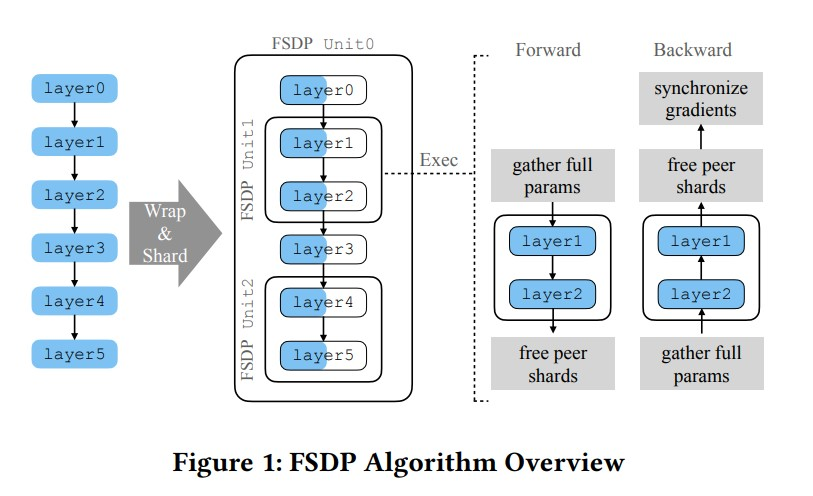

# PyTorch FSDP: Experiences on Scaling Fully Sharded Data Parallel（在完全分片数据并行上的扩展经验）

# 摘要
&nbsp;&nbsp;&nbsp;&nbsp;&nbsp;&nbsp;&nbsp;&nbsp;众所周知，大型模型在各个领域都有潜在的优越性能。尽管机器学习系统研究领域取得了显著进展，使得大型模型的开发和探索成为可能，但**这些能力仍然仅限于少数高级用户和行业领导者**，从而为广大社区访问和利用这些技术设置了一道隐形的技术壁垒。本文介绍了PyTorch完全分片数据并行（FSDP）作为大型模型训练的行业级解决方案。FSDP与PyTorch的几个关键核心组件（包括张量实现、调度系统(dispatcher system)和CUDA内存缓存分配器）密切协同设计，以提供非侵入式(non-intrusive)的用户体验和高效的训练效率。此外，FSDP还原生地融合了一系列技术和设置，以优化各种硬件配置下的资源利用。实验结果表明，FSDP能够在TFLOPS方面实现与**分布式数据并行(DDP)相当的性能**，同时支持显著更大的模型，并具有近线性的可扩展性。 

*(代码：https://github.com/pytorch/pytorch/blob/main/torch/distributed/fsdp/fully_sharded_data_parallel.py/.）*

# 1 引言
&nbsp;&nbsp;&nbsp;&nbsp;&nbsp;&nbsp;&nbsp;&nbsp;神经网络模型的规模正在以前所未有的速度增长，为各个领域的突破提供了便利。在问世之初，具有 1750 亿参数的 GPT-3 [3] 模型在几乎所有自然语言处理任务中创下了新纪录。构建在 GPT 模型之上的产品应用 [23] 迅速展示了它们改变整个行业的潜力。现代大规模推荐模型 [19, 33] 可以超过 1 万亿个参数，其中包括快速增长的密集层组件。这些模型驱动着每天为数十亿用户提供服务的应用程序。随着大型神经网络不断突破科学和技术的限制，一种工业级工具能够以高效的方式简化这些模型的训练，将有助于加快进展的速度。 

&nbsp;&nbsp;&nbsp;&nbsp;&nbsp;&nbsp;&nbsp;&nbsp;近年来，学术界引入并研究了许多先进的方法来扩大神经网络模型。管道并行性 [6, 8, 11, 15, 20] 将一个模型实例划分为多个阶段，并将这些阶段分布在多个设备上，激活值和梯度在阶段之间进行通信。张量并行性 [9, 21, 31, 32] 对模型参数进行分片，对每个设备进行部分计算，并在所需的层边界进行激活值的通信。零冗余并行性 [27, 28, 30] 也对参数进行分片，但按需通信参数以恢复其未分片的形式，并在每个设备上执行模型。上述技术作为实现在各种应用中训练大型神经网络的基本构建块。然而，仍然存在两个挑战。首先，其中一些方法与特定的模型架构紧密集成，限制了它们作为训练大型模型的**通用解决方案**的使用。其次，其中一些技术是基于不断演进的底层机器学习框架的内部接口构建的，这使得它们容易受到框架实现的变化的影响。因此，与机器学习框架的核心功能共同设计一个本地解决方案更加稳健和高效。此外，以**可组合和可定制的方式**构建这样的解决方案还有可能促进学术界未来的创新。 

&nbsp;&nbsp;&nbsp;&nbsp;&nbsp;&nbsp;&nbsp;&nbsp;本文介绍了 PyTorch [24] Fully Sharded Data Parallel (FSDP) 方法，通过对模型参数进行分片，实现了大规模模型的训练。FSDP 算法受到 DeepSpeed 中的 ZeroRedundancyOptimizer [27, 28] 技术的启发，但经过修改设计和实现，与 PyTorch 的其他组件相一致。FSDP 将一个模型实例分解为较小的单元，并对每个单元内的所有参数进行**扁平化和分片**。在计算之前，分片的参数会按需通信和恢复(recovered)，然后立即丢弃(immediately discarded)。这种方法确保 FSDP **一次只需要处理一个单元的参数**，极大地降低了内存消耗。FSDP 的设计和实现面临以下挑战。 

- **用户体验**对于广泛采用至关重要。在开发之前的 PyTorch 分布式训练功能（如 DistributeDataParallel，DDP）[14]时，我们观察到将分布式训练的用户体验与本地训练的体验保持一致可以显著降低学习门槛。像 DDP 这样的技术要求在每个设备上复制模型，这意味着整个模型可以在目标设备上构建。然而，尽管 FSDP 可以很容易地采用 DDP 的 API 设计，但大型模型可能无法适应一个 GPU 设备，因此**无法高效地初始化**。 
- **硬件异构性**常存在于现代 GPU 集群，在每台机器上将互连划分为高带宽岛屿和机器之间的低带宽网状结构。此外，机架(rack)或机柜(pod)级别可能还有进一步的层次结构。因此，FSDP 的设计必须适应这种异构性并进行相应的优化。 
- **资源利用**通常与资本和运营支出紧密相关，特别是对于依赖大型 GPU 集群来驱动关键系统的公司。为了确保在分布式训练期间 GPU 设备保持充分利用，关键是将非计算操作引起的停机时间最小化。 
- **内存规划**在大型模型训练中起着至关重要的作用。PyTorch通过缓存机制，使GPU内存块分配变得高效且透明。频繁的内存碎片整理会显著降低训练速度，尤其在处理大型模型时会更加明显。在这种情况下，从业者通常会尽可能地占用GPU内存，以容纳最大的批次或模型。然而，**接近GPU内存容量会显著增加触发内存碎片整理的可能性**。 

&nbsp;&nbsp;&nbsp;&nbsp;&nbsp;&nbsp;&nbsp;&nbsp;FSDP（Fully Sharded DataParallel）通过多种技术来解决上述挑战。首先，为了改善用户体验，FSDP引入了**延迟初始化(deferred initialization)** 的概念，允许用户在虚拟设备(dummy device)上创建一个模型实例，并记录初始化期间调用(invoked)的操作。然后，可以通过在真实的GPU设备上重新放置记录的操作(replaying the recorded operations)，逐个单元地(unit by unit)初始化和分片(sharded)模型。通过这种技术，FSDP可以提供类似于本地训练的用户体验，同时有效地扩展大型模型。其次，FSDP提供可配置的分片策略，可根据集群的物理互连拓扑结构进行定制(customized)，以处理硬件异构性。第三，虽然参数分片设计不可避免地引入通信，可能会阻塞计算并在执行过程中引入气泡(bubbles)，但FSDP通过操作重排序(operation reordering)和参数预取(parameter prefetching)等丰富的工具，可以通过积极地重叠通信和计算来消除冒泡。最后，FSDP通过谨慎地(prudently)限制为正在进行的未分片参数分配的**块数**，并在必要时挂起(suspending)CPU执行，优化内存使用。 

&nbsp;&nbsp;&nbsp;&nbsp;&nbsp;&nbsp;&nbsp;&nbsp;我们在包括流行的语言模型和推荐系统模型在内的各种模型上评估了FSDP的性能，最多利用了512个80GB A100 GPU。实验证明，FSDP在小型模型上可以达到与DDP相似的性能。此外，FSDP可以显著地支持更大型的模型，并以近线性的可扩展性提供TFLOPS方面的性能。FSDP目前是PyTorch 2.0版本中的一个测试特性(beta feature)，并已经在工业和研究应用中经过了实战测试。 

&nbsp;&nbsp;&nbsp;&nbsp;&nbsp;&nbsp;&nbsp;&nbsp;为了简化表述，本文的剩余部分使用FSDP一词来泛指这些技术，使用FullyShardedDataParallel来表示Python实现。本文的剩余部分组织如下。第2节介绍了一些流行的分布式训练技术的背景。第3节和第4节详细阐述了系统设计和实现细节。第5节介绍了评估结果。第6节对相关工作进行了调研，而第7节讨论了与FSDP相关但不属于FSDP核心的主题。最后，第8节对全文进行了总结。 

# 2 背景
&nbsp;&nbsp;&nbsp;&nbsp;&nbsp;&nbsp;&nbsp;&nbsp;PyTorch [24] 已经成为众多机器学习项目的基石(cornerstone)。PyTorch 使用 Tensor 对象存储值，这些对象是多维数组，具有丰富的数据操作功能。每个 Tensor 对象都有一个关联的存储空间，该存储空间分配在特定的设备上。当 Tensors 仅表示诸如 reshape 和 split 等简单变换时，它们可以共享相同的底层存储空间。每个 Module 描述了从输入到输出值的转换，其在前向传播过程中的行为由其 forward 成员函数指定。这样的模块可以具有 Tensor 对象作为参数，其中 Linear 模块就是一个示例，它包含了权重和偏置参数。在前向传播过程中，Linear 模块将这些参数应用于输入，通过乘法和加法运算分别产生输出。 

&nbsp;&nbsp;&nbsp;&nbsp;&nbsp;&nbsp;&nbsp;&nbsp;随着数据规模和模型复杂性以惊人的速度不断增长，对于基于PyTorch构建的应用程序来说，一个符合工业标准的分布式训练框架的需求变得越来越迫切。本节将阐述PyTorch分布式训练能力的发展轨迹。 

## 2.1 模型复制(Model Replication)
&nbsp;&nbsp;&nbsp;&nbsp;&nbsp;&nbsp;&nbsp;&nbsp;模型复制方法旨在通过在多个设备上进行分布式计算来**解决大规模数据集(不是大模型)**的问题。DistributedDataParallel (DDP) [14] 是PyTorch中属于这一类别的第一个端到端分布式训练功能。DDP的应用范围广泛，涵盖了学术和工业领域。 
&nbsp;&nbsp;&nbsp;&nbsp;&nbsp;&nbsp;&nbsp;&nbsp;DDP在每个设备上维护一个模型副本，并通过在反向传播过程中进行集体AllReduce操作来**同步梯度**，从而确保训练过程中模型副本的一致性。为了加快训练速度，**DDP将梯度通信与反向计算重叠**，以便在不同资源上实现并发工作负载执行。然而，一个明显的限制是DDP要求所有模型参数、梯度和优化器状态都能放入一个GPU设备的内存中。因此，**DDP无法支持大型模型**，而这些模型对于前沿的机器学习突破至关重要。例如，当使用40GB GPU设备训练具有超过10亿个参数的模型时，DDP很可能在每个设备上遇到内存不足的错误。 

## 2.2 模型分区(Partitioning)
&nbsp;&nbsp;&nbsp;&nbsp;&nbsp;&nbsp;&nbsp;&nbsp;随着模型的规模增长，它们可能无法适应单个GPU设备。在这种情况下，一种可行的解决方案是将模型分割为较小的组件，并将它们分布在多个设备上。管道并行性 [8] 和 Tensor RPC [25] 都是朝着这个方向发展的技术。管道并行性(Pipeline parallelism)涉及将一系列层分解为阶段，并以流水线方式将输入馈送到不同的阶段，以优化资源利用率。另一方面，Tensor RPC 提供了一个底层(low-level)工具包，可以在远程设备上执行任意计算。虽然这两种技术都能够在多个设备上扩展大型模型，但它们要么将模型限制为一系列阶段，要么需要**修改模型编写代码以插入远程计算**，这可能对用户采用造成重大障碍。此外，许多工业训练基础设施只支持**单程序多数据**的范式，这就需要一个更简单的入口来处理大型模型。 
*(rpc: https://pytorch.org/docs/stable/rpc.html)*  

## 2.3 模型分片(Sharding)
&nbsp;&nbsp;&nbsp;&nbsp;&nbsp;&nbsp;&nbsp;&nbsp;除了分区之外，对模型参数进行分片也可以帮助减少其内存占用，并支持超出单个GPU设备内存容量的模型。在对模型进行分片后，每个排名（rank）只持有模型参数的一个分片，这使得它**无法**执行与本地训练相同的计算。为了确保正确性，训练过程需要采用以下一种或两种技术： 
- 使用参数分片进行计算，并相应地**通信激活值(activation)**。采用这种方法，rank不需要完全材料化(materialize)任何参数。然而，每次通信都会出现在关键路径中，因为它被插入在两个连续且依赖的计算computation operation之间。因此，除非非依赖的计算或其他迭代中的计算可以被重新排序以与通信重叠，否则这种通信无法轻松地与计算重叠。 
- 在计算之前通过按需**通信参数(weight)** 进行与本地训练相同的计算。由于参数(weight)通信与前面的计算没有任何数据依赖关系，因此它们可以与同一次前向或反向传播中的前面计算重叠。然而，这种方法要求按需通信的参数能够完全材料化(materialize)，并且能够适应单个GPU设备的内存。 

&nbsp;&nbsp;&nbsp;&nbsp;&nbsp;&nbsp;&nbsp;&nbsp;FSDP属于参数通信的第二类别。根据我们的观察和实验，这种方法足以支持当今和不久的将来的绝大多数大型模型应用。值得注意的是，如果完全将每个参数单元在GPU上材料化(materialize)的要求成为一个障碍，我们可以进一步结合这两种技术来支持这样的用例。 

# 3 系统设计
&nbsp;&nbsp;&nbsp;&nbsp;&nbsp;&nbsp;&nbsp;&nbsp;全分片数据并行（FSDP）能够通过对密集参数(parameter)进行分片来扩展(scaling)以适应无法适应单个GPU设备的大型模型。具体而言，FSDP将模型实例分解为较小的单元，并独立处理每个单元。在前向和反向计算过程中，FSDP一次只会重塑(materialize)一个单元的未分片参数和梯度，否则它会保持参数和梯度的分片状态。在整个训练循环中，优化器状态也会被分片保存。FSDP的内存需求与分片模型的大小以及最大完全材料化的FSDP单元的大小成比例。 

&nbsp;&nbsp;&nbsp;&nbsp;&nbsp;&nbsp;&nbsp;&nbsp;图1展示了使用一个简单的六层模型的整体工作流程。假设FSDP将模型分解为三个部分，分别是[layer0, layer3]，[layer1, layer2]和[layer4, layer5]。分解行为可以由用户定义的函数控制。然后，FSDP将这三个部分中的每一个封装成一个FSDP单元，并相应地对参数进行分片。为了确保正确性，在进行相应的计算之前，FSDP需要**恢复未分片的参数**。让我们以包含[layer1, layer2]的FSDP单元1来解释这个过程。在进行前向计算进入layer1之前，FSDP通过从其他同级rank收集分片参数来聚合成layer1和layer2的**未分片参数**。有了未分片的参数，FSDP运行这些层的本地计算，然后释放刚刚收集的同级分片以减少内存占用。因此，在整个前向传递过程中，FSDP一次只需要完全材重塑一个单元，而其他所有单元都可以保持分片状态。类似地，在反向计算过程中，FSDP单元1在反向传播到layer2之前恢复layer1和layer2的未分片参数。当自动求导引擎完成这两个层的反向计算时，FSDP释放同级分片并启动ReduceScatter来减少和分片梯度。因此，在反向计算之后，每个rank只保留参数和梯度的一个分片。 

&nbsp;&nbsp;&nbsp;&nbsp;&nbsp;&nbsp;&nbsp;&nbsp;FSDP提供了广泛的优化和配置(knob)来适应不同的模型结构和硬件能力。本节的其余部分将进一步深入探讨**模型初始化、分片策略、通信优化和内存管理**等方面的复杂性，这些都是FSDP底层设计的关键组成部分。 

## 3.1 模型初始化
&nbsp;&nbsp;&nbsp;&nbsp;&nbsp;&nbsp;&nbsp;&nbsp;在FSDP出现之前，PyTorch要求在一个设备上完全materialize整个模型实例。尽管用户可以将不同的子模块分配给不同的设备，但这需要修改模型源代码，这可能并不可行，特别是如果模型作者和应用程序开发者属于不同的团队。为了实现从本地训练到分布式训练的平稳过渡，FSDP必须有效地帮助materialize和initialize大规模模型，这带来了两个挑战： 
- 如何在不塑造任何张量存储的情况下创建模型实例，将初始化**推迟(postponing)到**将具体设备上的存储器附加到张量上之后。
- 如何确保模型参数的准确初始化与用户的实现保持一致，即使模型太大无法适应单个GPU。
&nbsp;&nbsp;&nbsp;&nbsp;&nbsp;&nbsp;&nbsp;&nbsp;为了克服第一个挑战，我们引入了一种称为**延迟初始化的机制**，其中涉及在模拟设备或“虚拟(fake)”设备上分配模型参数张量。在这个过程中，所有在张量上执行的初始化操作都被**记录**下来。随后，当张量从“虚拟”设备移动到GPU设备时，所有记录的操作都会**自动重新执行**。通过采用这种技术，用户可以从任何第三方库生成模型实例，而**无需分配任何GPU内存块**，同时仍然准确捕获其参数初始化实现。 

&nbsp;&nbsp;&nbsp;&nbsp;&nbsp;&nbsp;&nbsp;&nbsp;如图1所示，一旦FSDP装饰了模型，它将均匀分布在所有GPU上，每个设备在其内存中只保存一个分片。因此，为了解决第二个挑战，每个排名理想情况下只能matierialize和初始化自己拥有的分片。然而，这并不总是实际可行的，因为我们无法预测用户将在模型初始化方法中实现什么样的初始化逻辑。初始化逻辑可能依赖于在设备上有一个未分片的参数，这使得无法对初始化进行分片。因此，FSDP必须在执行张量初始化操作之前**准备未分片的参数，并同时减少内存占用**。鉴于分片初始化是不安全的，FSDP采用了与处理模型前向和反向传递相同的方法，即**一次只初始化一个FSDP单元**，并在转到下一个单元之前对单元进行分片(shard)。当与延迟(deferred)初始化结合使用时，FSDP遍历虚拟设备模型实例，将其分解为FSDP单元，一次将一个单元移动到GPU设备，并为该FSDP单元中的张量重播(replays)记录的初始化操作。 

## 3.2 分片策略
&nbsp;&nbsp;&nbsp;&nbsp;&nbsp;&nbsp;&nbsp;&nbsp;分片策略是FSDP中的一个重要因素，它在确定内存占用(memory footprint)和通信开销方面起着重要作用。FSDP提供了多种分片策略，从完全复制到完全分片都有。为了概括这些分片策略，我们引入了**分片因子𝐹，它表示参数分片的排名数(ranks)**。将分片因子设置为1时，FSDP完全复制模型，并简化为使用AllReduce进行梯度归约的普通数据并行。将分片因子设置为设备数量（即全局大小𝑊）时，FSDP完全分片模型，每个设备只保存模型的1/𝑊部分。当分片因子介于1和𝑊之间时，发生混合分片。本节的其余部分将重点介绍全分片和混合分片，因为完全复制策略类似于现有的DDP [14]。 

### 3.2.1 全分片策略
&nbsp;&nbsp;&nbsp;&nbsp;&nbsp;&nbsp;&nbsp;&nbsp;全分片策略会导致最低的内存占用，但会产生最大的通信开销，例如，如果使用带宽最优的环形算法，全分片的通信开销和DDP相比会增加**1.5倍**。因此，FSDP必须仔细组织通信，以在这种策略下最大限度地提高其效率。 

&nbsp;&nbsp;&nbsp;&nbsp;&nbsp;&nbsp;&nbsp;&nbsp;我们进行了两组实验，以了解**输入大小**对集合通信效率的影响。结果如图2所示，这有助于确定两个效率的要素：
1. **均匀输入大小**：Nvidia NCCL [22]库为all-gather和reduce-scatter提供了高效的集合实现，这要求在rank之间具有均匀的输入张量大小。
2. **更大的输入大小**：对于固定的通信量，应用批处理数据从而发出较少的集合操作，可以通过避免集合操作的启动开销并增加网络带宽利用率来提高性能。

&nbsp;&nbsp;&nbsp;&nbsp;&nbsp;&nbsp;&nbsp;&nbsp;对于（1），NCCL的AllGather API要求**输入张量大小为均等**，并将输出写入一个**单一的张量中**。PyTorch的 **ProcessGroup** 封装了NCCL API，并通过支持rank之间不均匀的输入张量大小以及允许用户提供输出张量列表来**增强它**。这种灵活性会带来效率上的权衡（丢失），如图2(a)所示。我们使用All-Gather Base来表示NCCL的AllGather行为，并使用All-Gather来表示接受一个张量列表作为输出的行为。后者在通信之前和之后，在各个输出张量和合并后的单个大输出张量之间进行**额外的复制**。此外，对于不均匀的输入，ProcessGroup使用**群组广播**来模拟AllGather的行为，这比All-Gather Base更慢。在实验中，我们通过将1个元素和1e6个元素分别从排名1移动到排名0来创建人为的不均匀性。结果显示，具有均匀输入大小的All-Gather Base实现了最高的效率。 
*(注释：NCCL 要求all-gather的张量必须相当，但pytorch 的processGroup不要求，通过其它策略绕过限制)*  
&nbsp;&nbsp;&nbsp;&nbsp;&nbsp;&nbsp;&nbsp;&nbsp;对于（2），图2（b）将总通信量固定为2^30≈1B个FP32元素，并改变每个All-Gather的大小，即较小的AllGather大小意味着更多的AllGather调用。一旦All-Gather大小降低到33M个元素以下，总通信时间开始迅速增加。 

&nbsp;&nbsp;&nbsp;&nbsp;&nbsp;&nbsp;&nbsp;&nbsp;因此，为了实现高效的通信，FSDP将一个FSDP unit中的所有参数组织成一个大的FlatParameter。FlatParameter将其各个参数的通信合并，并在rank之间均匀分片。具体而言，FlatParameter是通过连接𝑝个扁平化的原始参数构建的**一维张量**，并在Tensor右侧填充(padding zero)以实现可被分片因子整除的大小。为了对FlatParameter进行分片，FSDP将其分成相等大小的块，块的数量等于分片因子F，并为每个rank分配一个块。FlatParameter的梯度继承自FlatParameter的未分片和分片形状，而FlatParameter和其梯度(gradient)分别拥有原始参数及其梯度的**底层存储**。图3展示了一个示例，其中我们使用一个FSDP单元将一个4×3的nn.Linear层分片到16个GPU上。在这种情况下，每个GPU只保存FlatParameter中的一个元素，最后一个rank保存填充值(padding value)。

&nbsp;&nbsp;&nbsp;&nbsp;&nbsp;&nbsp;&nbsp;&nbsp;这种扁平化-连接-分块(flatten-concat-chunk)算法允许每个原始参数具有任意形状，同时最小化所需的填充(最多为𝐹-1)，体现了其通用性。此外，在这种算法下，分片和未分片的FlatParameter及其梯度与AllGather和ReduceScatter分别期望的数据布局完全一致。这使得可以在输入张量和输出张量上调用集合操作，而无需进行任何额外的复制操作。

&nbsp;&nbsp;&nbsp;&nbsp;&nbsp;&nbsp;&nbsp;&nbsp;更正式地说，假设对于一个具有Ψ个元素的模型，FSDP构建了𝑁个FlatParameter，其元素数量分别为 $𝜓_{1}, \dots, 𝜓_{𝑁}$ , 其中 ${\sum_{1}}^{N} \psi = \Psi$ . 对于分片因子𝐹，参数内存的峰值贡献为 $O( {\sum_{i=1}}^{N} \frac{\psi_{i}}{F} + {max_{i=1}}^{N} \psi_{i})$ ，因为FSDP始终将每个本地分片的FlatParameter的大小保持为 $\frac{𝜓_{𝑖}}{F}$ ，并且在前向和反向传播过程中必须逐个生成每个未分片的FlatParameter，其大小为 $𝜓_{𝑖}$ 。由于第一个 ${\sum_{i=1}}^{N} \psi_{i}=\Psi$ 是固定的，参数内存的峰值贡献由 ${max_{𝑖=1}}^{𝑁} 𝜓_{𝑖}$ 决定。同时，每次迭代的集合操作**数量为𝑂(𝑁)**。这说明了FSDP的内存吞吐量权衡：细粒度的FlatParameter构建减少了峰值内存，但可能通过需要更多的集合操作来降低吞吐量。用户可以通过指定如何将子模块包装到FSDP单元中来控制这种权衡。 

### 3.2.2 混合分片(Hybrid Sharding)
&nbsp;&nbsp;&nbsp;&nbsp;&nbsp;&nbsp;&nbsp;&nbsp;当分片因子大于1但小于𝑊(gpu 个数)时，我们将其称为混合分片策略，因为它同时结合了分片和复制。对于全局 world 大小(global world size)𝑊和分片因子𝐹，参数在每个组 $𝑆_{1}, \dots, 𝑆_{\frac{𝑊}{𝐹}}$ **内**进行分片，并在每个互补组 $𝑅_{1}, \dots, 𝑅_{𝐹}$ 内进行复制，其中每个𝑆𝑖，𝑅𝑗 ⊆ {1, . . . ,𝑊 }表示分片或复制组中的排名。 
&nbsp;&nbsp;&nbsp;&nbsp;&nbsp;&nbsp;&nbsp;&nbsp;对于梯度归约，所有rank之间的单个Reduce-Scatter变为在每个分片组(sharded groups)内进行Reduce-Scatter，然后在每个复制组(replicated groups)内进行全局归约来reduce分片梯度。这种等效性来自以下分解过程。 

其中， $𝑔_{𝑟}$ 表示rank为𝑟的梯度。 

&nbsp;&nbsp;&nbsp;&nbsp;&nbsp;&nbsp;&nbsp;&nbsp;混合分片可以利用**数据中心的局部性**进行加速训练，并**减少跨主机的流量**，以尽量避免在过度订阅(over-subscribed)的环境中产生竞争。同时，它提供了在内存节省和吞吐降低之间逐渐权衡(trade-off)的选择，这对于那些在完全复制训练时所需的内存占用**略高于**设备容量且不希望进行完全分片的模型特别有帮助。（图4展示了一个示例） 

&nbsp;&nbsp;&nbsp;&nbsp;&nbsp;&nbsp;&nbsp;&nbsp;具体而言，数据中心通常采用具有过度订阅(over-subcription)的Fat-Tree网络拓扑结构[16]，从而具有丰富的局部性可供利用，并且有充分的理由减少跨主机的流量[17]。混合分片可以提供一种自然机制，将设备网格映射到数据中心布局中以利用这种局部性。例如，考虑一个集群，将一个集群视为𝑊个加速器分组成每个主机包含𝐺个加速器的组（同一主机上的加速器之间的通信比跨主机的通信要快得多），我们可以设置 $𝐹 = \frac{𝑊}{𝐺}$ ）*(表示有几个切片组，而不是每个组中有几个切片)*，以限制同一主机内的所有all-gather和Reduce-Scatter操作，并为不同主机之间的相同 local rank的加速器之间创建一个复制组。对于大小为𝑀的模型，在混合设置中，我们可以计算每个GPU的总**跨主机流量**为 $2𝑀\frac{𝑊−1}{𝐺𝑊}$ ，与完全复制的 $2𝑀\frac{𝑊−1}{𝑊}$ 和完全分片的 $3𝑀\frac{𝑊−1}{𝑊}$ 相比，这是一个显著的降低。此外，由于混合分片中使用的AllReduce集合操作在较小的全局规模上运行，经验证明其性能优于在全局规模上调用集合(collective)操作（full replication 和 full sharding的情况下），这是由于滞后者效应和更大的网络干扰所导致的。 

&nbsp;&nbsp;&nbsp;&nbsp;&nbsp;&nbsp;&nbsp;&nbsp;混合分片的另一个重要设计动机是满足中等大小模型的需求。这些模型足够大，当使用完全复制进行训练时可能导致内存不足的问题，但又不足以充分利用加速器内存，而完全分片会导致运行时开销和内存浪费。混合分片策略通过简单调整 𝐹 来创造一个更丰富的内存吞吐权衡空间。 

### 3.2.3 自动求导

&nbsp;&nbsp;&nbsp;&nbsp;&nbsp;&nbsp;&nbsp;&nbsp;FSDP的FlatParameter必须与PyTorch的自动求导引擎进行交互，以确保以下两点：（1）正确的梯度传播和（2）及时的梯度归约。对于（1），需要注意的是FlatParameter及其梯度分别拥有原始参数和它们的梯度的**底层存储**。为了实现这一点，在正向计算之前，FSDP使用autograd可见的torch.split()和torch.view()函数将原始参数设置为其未分片的FlatParameter的视图。然后，自动求导引擎自然地分配未分片的FlatParameter梯度，并将每个原始参数的梯度写入由torch.split()的反向函数定义的适当偏移量。对于（2），FSDP注册了一个梯度钩子，该钩子仅在FlatParameter的梯度最终确定后运行。该钩子代表了后向逻辑，并包括梯度归约。值得注意的是，FSDP的方法是构建在PyTorch的自动求导引擎之上，而不是对其进行修改。因此，FSDP可以自动处理非常规情况，例如在前向传播中没有使用所有参数或者在后向传播之前存在多个前向传播的情况。 

## 3.3 通信优化
&nbsp;&nbsp;&nbsp;&nbsp;&nbsp;&nbsp;&nbsp;&nbsp;FSDP框架结合了一系列本地(native)通信优化技术。本节介绍了四个主要的优化技术：重叠通信、向后预取、向前预取和累积。 

### 3.3.1 重叠通信与计算
&nbsp;&nbsp;&nbsp;&nbsp;&nbsp;&nbsp;&nbsp;&nbsp;PyTorch的c10d库提供了ProcessGroup抽象，表示可以一起运行集合操作(collective operation)的一组进程。对于NCCL后端，ProcessGroupNCCL实现每个设备都有一个**内部的NCCL流**，其中单独的内部流用于与当前流进行异步执行，**当前流通常是运行计算的默认流**。这些异步集合操作返回Work对象，调用Work.wait()会阻塞CPU线程，直到集合操作完成。为了确保正确性，ProcessGroupNCCL在运行集合操作之前会将内部流与当前流进行同步。**DDP利用异步集合操作和等待的方法**，将梯度的全局归约与后向计算进行重叠。然而，与DDP的后向计算将all-reduce与计算重叠的方式不同，**FSDP的前向计算在计算完成后发起all-gather操作(合并weight)**，因为在eager 模式下，FSDP无法事先知道下一个要reorder的FlatParameter。这种 kernel 发出顺序上的差异使得按照异步集体操作和等待的方法对FSDP来说不可行。换句话说，由于ProcessGroupNCCL与当前（默认）流进行同步，all-gather操作将等到与其重叠的计算完成后才会运行。为了解决这个问题，**FSDP使用单独的CUDA流来发起all-gather操作，绕过默认流中对先前计算的错误依赖**，并允许每个all-gather操作进行重叠。因此，**FSDP的collective operation sync操作是针对流而不仅仅是Work对象的**。图5展示了一个示例。请注意，后向传播不包括AG0(见图5) 的 allgather操作，因为FSDP有意将最外层FSDP单元的参数保留在内存中，以避免在前向传播结束时冗余释放，然后重新进行全局聚集操作以开始后向传播。 
*（ProcessGroup：可以进行集合操作的一组进程）*   

### 3.3.2 向后预取(backward prefetching)
&nbsp;&nbsp;&nbsp;&nbsp;&nbsp;&nbsp;&nbsp;&nbsp;FSDP在**每个进程中强制使用单个CUDA设备**，并为All-Gather和Reduce-Scatter使用**单个进程组**，这意味着其集合操作在进程组的内部NCCL流中按顺序运行。在backward pass中，FSDP首先发起当前FlatParameter的Reduce-Scatter操作 *(每个加速器上都会计算出完整的梯度，然后reduce-scatter)* ，然后发起下一个FlatParameter的All-Gather操作。因此，单个NCCL流会导致Reduce-Scatter阻塞下一个All-Gather操作，进而阻塞下一个梯度计算，并可能在关键路径上暴露出来。 
&nbsp;&nbsp;&nbsp;&nbsp;&nbsp;&nbsp;&nbsp;&nbsp;为了避免在backward pass中暴露两个连续的通信调用(communication calls)，FSDP的向后预取在当前Reduce-Scatter之前发起(issues)下一个All-Gather操作。然而，如前所述，对于即时执行(eager execution)来说，一个挑战是知道下一个要进行all-gather的FlatParameter是哪个? FSDP通过将模块的reverse执行顺序记录为其backward pass 执行顺序的代理(proxy)来解决了这个挑战 *(注释：就是前向传播的相反顺序)* 。此外，正向顺序在每次迭代时都会重新记录，这意味着向后预取与迭代之间的动态特性是兼容的。 

### 3.3.3 向前预取(Forward Prefetching)

&nbsp;&nbsp;&nbsp;&nbsp;&nbsp;&nbsp;&nbsp;&nbsp;对于一些具有相对较慢CPU执行的工作负载，CPU线程可能无法及时发起下一个前向all-gather操作以有效填充NCCL流。如果模型在迭代之间遵循静态计算图，那么FSDP可以假设模块的前向执行顺序来自**上一次迭代**，并在前向传播中显式地预取(prefetch)下一个all-gather操作。这种向前(prefetching)预取在当前FSDP单元的**前向计算之前发起下一个全局聚集操作**。 

### 3.3.4 梯度累积
&nbsp;&nbsp;&nbsp;&nbsp;&nbsp;&nbsp;&nbsp;&nbsp;FSDP提供了两种梯度累积的变体(variations)：带通信和不带通信。带通信的梯度累积中，FSDP仍然在各个进程之间进行梯度归约，并且每个进程保存分片的梯度。只需连续运行多个迭代而不清除梯度即可实现这一点。没有通信的梯度累积中，FSDP不会在进程之间进行梯度归约，而是每个进程保存未分片的梯度(unsharded gradients)。后一种变体在增加内存使用的同时减少了通信，这可以增加端到端的吞吐量。 

## 3.4 内存管理
&nbsp;&nbsp;&nbsp;&nbsp;&nbsp;&nbsp;&nbsp;&nbsp;PyTorch使用CUDA缓存分配器作为中间层，为PyTorch程序提供GPU分配和释放请求服务。为了有效管理内存，FSDP使用速率限制器来考虑缓存分配器对使用多个CUDA流和运行快速CPU线程的程序的内存影响。 

