# T5: Text-to-Text Transfer Transformer

- [论文链接](https://link.zhihu.com/?target=https%3A//arxiv.org/pdf/1910.10683.pdf)

# 0. Abstract
&nbsp;&nbsp;&nbsp;&nbsp;&nbsp;&nbsp;&nbsp;&nbsp;迁移学习是一种在进行下游任务的微调之前，首先对模型进行数据丰富(data-rich task)的预训练的技术，在自然语言处理（NLP）中已经成为一种强大的技术。迁移学习的有效性催生了多样化的方法、方法论和实践。在本文中，我们通过引入**一个统一的框架，将所有基于文本的语言问题转化为文本到文本的格式**，来探索NLP中的迁移学习技术的现状。我们的系统研究比较了预训练**目标、架构、无标签数据集、迁移方法**和其他因素在**几十个语言理解任务**上的表现。通过结合我们探索的见解、规模以及我们的新的“巨大干净爬取语料库(Colossal Clean Crawled Corpus)”，我们在涵盖 摘要、问答、文本分类等 多项基准测试中取得了最先进(sota)的结果。为了促进NLP迁移学习的未来工作，我们发布了我们的数据集、预训练模型和代码。 

关键词：迁移学习、自然语言处理、多任务学习、基于注意力的模型、深度学习。

# 1. 简介
&nbsp;&nbsp;&nbsp;&nbsp;&nbsp;&nbsp;&nbsp;&nbsp;在训练自然语言处理（NLP）任务的机器学习模型时，通常需要使模型能够**以适合下游学习的方式处理文本**。这可以宽泛地看作是开发通用知识，使模型能够“理解”文本。这种知识可以从低层次（例如单词的拼写或含义）到高层次（例如大多数背包无法容纳大号音乐喇叭）的范围内。在现代机器学习实践中，提供这种知识很少是显式地完成的；相反，它通常作为辅助任务的一部分进行学习。例如，历史上常见的方法是使用单词向量（Mikolov等人，2013b，a；Pennington等人，2014）将单词映射到连续表示，其中理想情况下，相似的单词映射到相似的向量。这些向量通常是通过鼓励共现的单词在连续空间中靠近位置的目标进行学习的（Mikolov等人，2013b）。

&nbsp;&nbsp;&nbsp;&nbsp;&nbsp;&nbsp;&nbsp;&nbsp;最近，越来越**普遍的做法是在数据丰富的任务上对整个模型进行预训练**。理想情况下，这种预训练使模型能够发展出**通用的能力和知识**，然后可以将其转移到下游任务中。在将迁移学习应用于**计算机视觉中**（Oquab等人，2014；Jia等人，2014；Huh等人，2016；Yosinski等人，2014），**预训练通常通过在大型标记数据集（例如ImageNet）** 上进行**监督学习**来完成（Russakovsky等人，2015；Deng等人，2009）。相比之下，现代NLP中的迁移学习技术通常使用**无监督学习**在无标签数据上进行预训练。最近，这种方法已经在许多常见的NLP基准测试中取得了最先进(sota)的结果（Devlin等人，2018；Yang等人，2019；Dong等人，2019；Liu等人，2019c；Lan等人，2019）。除了其实证的强大性外，对于NLP的**无监督预训练尤其具有吸引力**，因为通过互联网可以轻松获取大量的无标签文本数据，例如，每个月 [Common Crawl](http://commoncrawl.org) 项目会产生约 **20TB** 的从网页中提取的文本数据。这与神经网络非常契合，因为已经证明**神经网络具有出色的可扩展性，即仅通过在更大的数据集上训练更大的模型，通常可以获得更好的性能**（Hestness等人，2017；Shazeer等人，2017；Jozefowicz等人，2016；Mahajan等人，2018；Radford等人，2019；Shazeer等人，2018；Huang等人，2018b；Keskar等人，2019a）。 

&nbsp;&nbsp;&nbsp;&nbsp;&nbsp;&nbsp;&nbsp;&nbsp;这种协同作用在最近的工作中产生了大量的迁移学习方法论，为NLP领域开发了广泛的预训练目标（Howard和Ruder，2018；Devlin等人，2018；Yang等人，2019；Dong等人，2019）、无标签数据集（Yang等人，2019；Liu等人，2019c；Zellers等人，2019）、基准测试（Wang等人，2019b，2018；Conneau和Kiela，2018）、微调方法（Howard和Ruder，2018；Houlsby等人，2019；Peters等人，2019）等等。这个蓬勃发展的领域中进展迅速、技术多样的速度可能会使**不同算法之间的比较、新贡献的影响以及现有迁移学习方法的空间难以理解**。出于对更严格理解的需求，我们**利用一种统一的迁移学习方法，可以系统地研究不同的方法，并推动该领域的当前限制**。 

&nbsp;&nbsp;&nbsp;&nbsp;&nbsp;&nbsp;&nbsp;&nbsp;我们工作的基本思想是**将每个文本处理问题都视为“文本到文本(text-to-text)”问题**，即将文本作为输入，并产生新的文本作为输出。这种方法受到了先前用于NLP任务的统一框架的启发，包括将所有文本问题都视为问答问题（McCann等人，2018）、语言建模（Radford等人，2019）或跨度提取（Keskar等人，2019b）任务。重要的是，**文本到文本的框架允许我们直接将相同的模型、目标、训练过程和解码过程应用于我们考虑的每个任务**。通过在各种基于英语的NLP问题上评估性能，包括问答、文档摘要和情感分类等，我们利用这种灵活性。通过这种统一的方法，我们**可以比较不同迁移学习目标、无标签数据集和其他因素的有效性**，并通过扩展模型和数据集的规模超越以前考虑过的限制，**探索NLP迁移学习的极限**。 

&nbsp;&nbsp;&nbsp;&nbsp;&nbsp;&nbsp;&nbsp;&nbsp;我们强调，**本文的目标不是提出新的方法，而是提供一个全面的视角来了解该领域的现状**。因此，我们的工作主要包括**对现有技术的调查、探索和实证比较**。我们还通过扩展我们系统研究的见解（训练模型达到110亿个参数）来探索当前方法的限制，并在我们考虑的许多任务中获得最先进的结果。为了在这个规模上进行实验，我们引入了“Colossal Clean Crawled Corpus”（C4），这是一个由数百吉字节的干净英语文本组成的数据集，从网络上抓取而来。鉴于**迁移学习的主要用途是在数据稀缺的环境中利用预训练模型**，我们发布了我们的代码、数据集和预训练模型。 

&nbsp;&nbsp;&nbsp;&nbsp;&nbsp;&nbsp;&nbsp;&nbsp;本文的其余部分结构如下：在下一节中，我们讨论了我们的基础模型及其实现，我们**将每个文本处理问题制定为文本到文本任务的过程**，以及我们考虑的任务套件。在第3节中，我们提出了一系列大规模实验，探索NLP迁移学习领域。在该部分的最后一节（第3.7节），我们结合我们系统研究的见解，获得了各种基准测试的最先进结果。最后，我们在第4节中总结了我们的结果，并展望未来。 

# 2 setup
&nbsp;&nbsp;&nbsp;&nbsp;&nbsp;&nbsp;&nbsp;&nbsp;在展示我们大规模实证研究的结果之前，本文回顾了理解我们结果所需的必要背景知识，包括Transformer模型架构和我们评估的下游任务。本文还介绍**将每个问题视为文本到文本任务的方法**，并描述了本文创建的基于Common Crawl的无标签文本数据源——“Colossal Clean Crawled Corpus”（C4）。本文模型和框架称为“Text-to-Text Transfer Transformer”（T5）。 

## 2.1 模型
&nbsp;&nbsp;&nbsp;&nbsp;&nbsp;&nbsp;&nbsp;&nbsp;早期关于NLP迁移学习的结果利用了循环神经网络（Peters等人，2018；Howard和Ruder，2018），但最近更常见的是使用基于“Transformer”架构的模型（Vaswani等人，2017）。Transformer最初被证明对机器翻译非常有效，但随后在各种NLP环境中被广泛应用（Radford等人，2018；Devlin等人，2018；McCann等人，2018；Yu等人，2018）。由于它的广泛应用，**本文研究的所有模型都基于Transformer架构**。除了下面提到的细节和我们在第3.2节中探索的变体之外，我们与最初提出的架构**没有明显偏离**。我们不提供对该模型的全面定义，而是建议有兴趣的读者参考原始论文（Vaswani等人，2017）或后续教程3,4，以获得更详细的介绍。 

&nbsp;&nbsp;&nbsp;&nbsp;&nbsp;&nbsp;&nbsp;&nbsp;**Transformer的主要构建模块是自注意力（Cheng等人，2016）**。自注意力是注意力的一种变体（Graves，2013；Bahdanau等人，2015），通过将每个元素替换为序列中其余元素的加权平均值来处理序列。原始的Transformer由编码器-解码器架构组成，旨在用于序列到序列（Sutskever等人，2014；Kalchbrenner等人，2014）任务。最近，常见的做法也是使用由单个Transformer层堆叠而成的模型，采用不同形式的自注意力来生成适用于语言建模（Radford等人，2018；Al-Rfou等人，2019）或分类和跨度预测任务（Devlin等人，2018；Yang等人，2019）的架构。我们在第3.2节中对这些架构变体进行了实证研究。 

*(跨度预测任务：从文本中预测特定的跨度或片段。)*  

&nbsp;&nbsp;&nbsp;&nbsp;&nbsp;&nbsp;&nbsp;&nbsp;**总体而言，我们的编码器-解码器Transformer实现与最初提出的形式（Vaswani等人，2017）非常接近。首先，将输入的token序列映射为嵌入序列，然后传递到编码器中。编码器由一堆“块”组成，每个块包含两个子组件：自注意力层（self-attention）和一个小的前馈网络（MLP）。对每个子组件的输入应用层归一化（Ba等人，2016）。我们使用简化版本的层归一化，只对激活进行重新缩放，不应用加性偏置。在层归一化之后，将每个子组件的输入添加到其输出中，使用残差跳过连接（He等人，2016）。在前馈网络、跳过连接、注意力权重以及整个堆栈的输入和输出上应用了Dropout（Srivastava等人，2014）。解码器的结构与编码器类似，不同之处在于它在每个自注意力层之后包含一个标准的注意力机制，用于关注编码器的输出。解码器中的自注意机制还使用了一种自回归或因果自注意机制，它只允许模型关注过去的输出。最终解码器块的输出输入到一个具有softmax输出的稠密层中，其权重与输入嵌入矩阵共享。Transformer中的所有注意机制都被分解为独立的“头”，它们的输出在进一步处理之前进行连接**。 

&nbsp;&nbsp;&nbsp;&nbsp;&nbsp;&nbsp;&nbsp;&nbsp;由于自注意力是无序的（即它是集合上的操作），因此通常需要为Transformer提供显式的位置信号。虽然原始的Transformer使用了正弦形式的位置信号或学习的位置嵌入，但最近更常见的做法是使用相对位置嵌入（Shaw等人，2018；Huang等人，2018a）。相对位置嵌入不是为每个位置使用固定的嵌入，而是根据自注意机制中“键”和“查询”之间的偏移量生成不同的学习嵌入。我们使用一种简化的位置嵌入形式，其中每个“嵌入”只是一个标量，添加到用于计算注意力权重的相应逻辑回归中。为了提高效率，我们还在模型的所有层之间共享位置嵌入参数，尽管在给定层内，每个注意头使用不同的学习位置嵌入。通常情况下，学习了一定数量的嵌入，每个嵌入对应一系列可能的键-查询偏移范围。在这项工作中，我们为所有模型学习了32个嵌入，其范围按对数增加到偏移量为128，超过这个范围的所有相对位置都分配到相同的嵌入中。请注意，给定的层对于超过128个标记的相对位置不敏感，但后续层可以通过组合前面层的局部信息来对更大的偏移产生敏感。 

&nbsp;&nbsp;&nbsp;&nbsp;&nbsp;&nbsp;&nbsp;&nbsp;总之，我们的模型与Vaswani等人提出的原始Transformer基本等效（2017），只是在去除了层归一化的偏置、将层归一化放置在残差路径之外，并使用了不同的位置嵌入方案。由于这些架构变化与我们在迁移学习的实证调查中考虑的实验因素无关，我们将留待将来进行对其影响的消融研究。 

&nbsp;&nbsp;&nbsp;&nbsp;&nbsp;&nbsp;&nbsp;&nbsp;作为我们研究的一部分，我们对这些模型的可扩展性进行了实验，即当这些模型具有更多的参数或层时，它们的性能如何变化。训练大型模型可能并不简单，因为它们可能无法适应单台计算机，并且需要大量的计算资源。因此，我们采用了模型并行和数据并行的组合，并在Cloud TPU Pods的“切片”上训练模型。TPU Pod是多机架ML超级计算机，包含1,024个TPU v3芯片，通过高速2D网格互连与支持的CPU主机机器相连。我们利用Mesh TensorFlow库（Shazeer等人，2018）来方便实现模型并行和数据并行（Krizhevsky，2014）。 

## 2.2 庞大的爬取语料库清理
&nbsp;&nbsp;&nbsp;&nbsp;&nbsp;&nbsp;&nbsp;&nbsp;先前关于自然语言处理的迁移学习的许多研究都利用了大规模的无标签数据集进行无监督学习。本文旨在衡量无标签数据的质量、特征和规模对模型的影响。为了生成符合我们需求的数据集，我们利用Common Crawl作为从网络上爬取的文本的数据源。Common Crawl之前已被用作自然语言处理的文本数据源，例如用于训练n-gram语言模型（Buck等，2014），作为常识推理的训练数据（Trinh和Le，2018），用于挖掘机器翻译的平行文本（Smith等，2013），以及作为预训练数据集（Grave等，2018；Zellers等，2019；Liu等，2019c），甚至仅作为测试优化器的巨大文本语料库（Anil等，2019）。 

&nbsp;&nbsp;&nbsp;&nbsp;&nbsp;&nbsp;&nbsp;&nbsp;Common Crawl是一个公开可用的网络存档，提供通过从爬取的HTML文件中删除标记和其他非文本内容而生成的“网络提取文本”。这个过程每个月会产生约20TB的爬取文本数据。不幸的是，其中大部分文本并不是自然语言。相反，它主要由无意义的文字或样板文字组成，例如菜单、错误消息或重复的文本。此外，大量爬取的文本包含的内容对于我们考虑的任何任务来说都不太可能有帮助（包括冒犯性语言、占位符文本、源代码等）。为了解决这些问题，我们使用了以下启发式方法来清理Common Crawl的网络提取文本： 

- 我们只保留以结束标点符号结尾的行（即句号、感叹号、问号或结束引号）。
- 我们丢弃了少于3个句子的页面，并只保留包含至少5个单词的行。
- 我们删除了任何包含“脏话、淫秽话、下流话或其他不良词语列表”中的任何单词的页面。
- 许多爬取的页面包含要求启用Javascript的警告，因此我们删除了包含“Javascript”一词的任何行。
- 一些页面包含占位符的“lorem ipsum”文本；我们删除了任何包含“lorem ipsum”短语的页面。
- 一些页面无意中包含代码。由于花括号“{”在许多编程语言中出现（例如广泛用于Web的Javascript），但在自然文本中不常见，因此我们删除了包含花括号的页面。
- 由于一些爬取的页面来自维基百科并带有引用标记（例如[1]、[citation needed]等），我们删除了这类标记。
- 许多页面包含样板政策通知，因此我们删除了包含“使用条款”、“隐私政策”、“Cookie政策”、“使用Cookies”、“使用Cookie”或“使用Cookies”等字符串的行。
- 为了去重数据集，我们丢弃了数据集中出现超过一次的任何三句连续的部分，只保留其中一次。

&nbsp;&nbsp;&nbsp;&nbsp;&nbsp;&nbsp;&nbsp;&nbsp;此外，由于我们的大部分下游任务侧重于英文文本，我们使用langdetect7来过滤出未被分类为英文的页面，概率至少为0.99。我们的启发式方法受到以往关于使用Common Crawl作为NLP数据源的工作的启发：例如，Grave等人（2018）也使用自动语言检测器过滤文本并丢弃短行，Smith等人（2013）和Grave等人（2018）都进行了行级去重。然而，我们选择创建一个新的数据集，因为先前的数据集使用了更有限的过滤启发式方法，不公开可用，或者在范围上有所不同（例如仅限于新闻数据（Zellers等，2019；Liu等，2019c），仅包含创作共用内容（Habernal等，2016），或者侧重于机器翻译的平行训练数据（Smith等，2013））。 

&nbsp;&nbsp;&nbsp;&nbsp;&nbsp;&nbsp;&nbsp;&nbsp;为了组装我们的基础数据集，我们下载了2019年4月的网络提取文本，并应用了上述过滤方法。这产生了一个文本集合，不仅比大多数用于预训练的数据集大数个数量级（约750GB），而且包含相对清洁和自然的英文文本。我们将此数据集命名为“庞大的清理爬取语料库”（简称C4），并作为TensorFlow Datasets的一部分发布。我们在第3.4节中考虑了使用此数据集的各种替代版本的影响。 

## 2.3 下游任务
&nbsp;&nbsp;&nbsp;&nbsp;&nbsp;&nbsp;&nbsp;&nbsp;在本文中，我们的目标是**衡量通用语言学习能力**。因此，我们研究了多个不同的基准任务的下游性能，包括机器翻译、问答、抽象摘要和文本分类。具体而言，我们衡量了GLUE和SuperGLUE文本分类元基准、CNN/Daily Mail抽象摘要、SQuAD问答以及WMT英德、英法和英罗马尼亚翻译任务的性能。所有数据均来自于TensorFlow Datasets。 

&nbsp;&nbsp;&nbsp;&nbsp;&nbsp;&nbsp;&nbsp;&nbsp;GLUE（Wang等，2018）和SuperGLUE（Wang等，2019b）分别包含一系列文本分类任务，旨在测试通用语言理解能力： 

- 句子可接受性判断（CoLA（Warstadt等，2018））
- 情感分析（SST-2（Socher等，2013））
- 释义/句子相似度（MRPC（Dolan和Brockett，2005）、STS-B（Cer等，2017）、QQP（Iyer等，2017））
- 自然语言推理（MNLI（Williams等，2017）、QNLI（Rajpurkar等，2016）、RTE（Dagan等，2005）、CB（De Marneff等，2019））
- 共指消解（WNLI和WSC（Levesque等，2012））
- 句子补全（COPA（Roemmele等，2011））
- 词义消歧（WIC（Pilehvar和Camacho-Collados，2018））
- 问答（MultiRC（Khashabi等，2018）、ReCoRD（Zhang等，2018）、BoolQ（Clark等，2019））

&nbsp;&nbsp;&nbsp;&nbsp;&nbsp;&nbsp;&nbsp;&nbsp;我们使用GLUE和SuperGLUE基准所提供的数据集。为了简化起见，在微调时，我们将GLUE基准中的所有任务（类似地，对于SuperGLUE也是如此）视为单个任务，通过连接所有组成数据集进行处理。正如Kocijan等人（2019）建议的那样，我们还将Definite Pronoun Resolution（DPR）数据集（Rahman和Ng，2012）包含在组合的SuperGLUE任务中。 

&nbsp;&nbsp;&nbsp;&nbsp;&nbsp;&nbsp;&nbsp;&nbsp;CNN/Daily Mail（Hermann等人，2015）数据集最初被引入作为一个问答任务，但被Nallapati等人（2016）改编为文本摘要任务；我们使用See等人（2017）的非匿名版本作为抽象摘要任务。SQuAD（Rajpurkar等人，2016）是一个常见的问答基准。在我们的实验中，模型会接收问题及其上下文，并逐个生成答案的标记。 

&nbsp;&nbsp;&nbsp;&nbsp;&nbsp;&nbsp;&nbsp;&nbsp;对于WMT英德翻译任务，我们使用与（Vaswani等人，2017）相同的训练数据（即News Commentary v13、Common Crawl、Europarl v7），并使用newstest2013作为验证集（Bojar等人，2014）。对于英法翻译，我们使用2015年的标准训练数据和newstest2014作为验证集（Bojar等人，2015）。对于英罗马尼亚翻译，这是一个标准的资源较少的机器翻译基准，我们使用了来自WMT 2016的训练和验证集（Bojar等人，2016）。请注意，我们只在英文数据上进行预训练，因此为了学会翻译，模型需要学会生成新语言的文本。 

## 2.4 Input and output
&nbsp;&nbsp;&nbsp;&nbsp;&nbsp;&nbsp;&nbsp;&nbsp;为了**在上述多样化的任务集上训练单个模型**，我们将所有考虑的任务转化为“文本到文本”（text-to-text）的格式，即模型接收一些文本作为上下文或条件，并被要求生成一些输出文本。这个框架为预训练和微调提供了一致的训练目标。具体而言，无论任务是什么，模型都使用最大似然目标（使用“teacher forcing”（Williams和Zipser，1989））进行训练。为了指定模型应执行的任务，我们在将原始输入序列输入模型之前，添加了特定于任务的（文本）前缀。 

&nbsp;&nbsp;&nbsp;&nbsp;&nbsp;&nbsp;&nbsp;&nbsp;举个例子，如果要求模型将句子“That is good.”从英语翻译成德语，模型将接收到序列“translate English to German: That is good.”并被训练输出“Das ist gut.”。对于文本分类任务，模型只需预测与目标标签对应的单个词。例如，在MNLI基准测试中（Williams等人，2017），目标是预测前提是否蕴含（“entailment”），与之矛盾（“contradiction”）或两者都不是（“neutral”）。通过我们的预处理，输入序列变为“mnli premise: I hate pigeons. hypothesis: My feelings towards pigeons are filled with animosity.”，相应的目标词为“entailment”。请注意，如果我们的模型在文本分类任务上输出的文本不对应任何可能的标签（例如，如果模型在任务的唯一可能标签是“entailment”、“neutral”或“contradiction”时输出了“hamburger”），那么我们总是将模型的输出视为错误，尽管我们从未观察到我们训练的任何模型出现这种行为。注意，用于给定任务的文本前缀的选择实际上是一个超参数；我们发现更改前缀的确切措辞对结果影响有限，因此没有对不同前缀选择进行大量实验。我们在图1中展示了我们的文本到文本框架，并提供了一些输入/输出示例。在附录D中，我们提供了我们研究的每个任务的预处理输入的完整示例。 

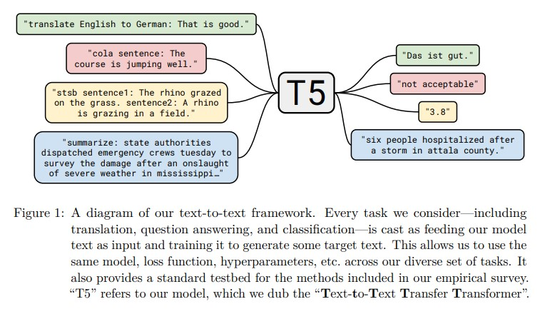

&nbsp;&nbsp;&nbsp;&nbsp;&nbsp;&nbsp;&nbsp;&nbsp;我们的文本到文本框架遵循之前的工作，将多个自然语言处理任务转化为一个通用的格式：McCann等人（2018）提出了“**自然语言十项全能**”（Natural Language Decathlon），这是一个使用一致的问答格式进行十个自然语言处理任务的基准。自然语言十项全能还规定所有模型必须是多任务的，即能够同时处理所有任务。相反，我们允许对每个单独的任务进行单独微调，并使用**简短的任务前缀**而不是明确的问答格式。Radford等人（2019）通过将一些输入作为前缀输入模型，然后自回归地对输出进行采样，评估了语言模型的零样本学习能力。例如，自动摘要是通过输入一个文档，然后输入文本“TL;DR:”（太长，没时间读，常见的缩写）来完成的，然后通过自回归解码来预测摘要。我们主要考虑显式地使用编码器处理输入，然后使用单独的解码器生成输出的模型，并且我们专注于迁移学习而不是零样本学习。最后，Keskar等人（2019b）将许多自然语言处理任务统一为“跨度提取”，其中与可能的输出选择对应的文本附加到输入中，并且模型被训练以提取与正确选择对应的输入跨度。与此相反，我们的框架还允许生成型任务，如机器翻译和抽象摘要，其中不可能列举出所有可能的输出选择。 

&nbsp;&nbsp;&nbsp;&nbsp;&nbsp;&nbsp;&nbsp;&nbsp;我们能够直接将我们考虑的所有任务都转换成文本到文本的格式，只有STS-B是个例外，它是一个回归任务，目标是预测1到5之间的相似度分数。我们发现大多数分数的注释以0.2的增量进行标注，因此我们只需将任何分数四舍五入到最接近的0.2的增量，并将结果转换为数字的字符串表示形式（例如，浮点数值2.57将映射为字符串“2.6”）。在测试时，如果模型输出的字符串对应于1到5之间的数字，我们将其转换为浮点数值；否则，我们将模型的预测视为错误。这有效地将STS-B回归问题转化为一个21类分类问题。 

&nbsp;&nbsp;&nbsp;&nbsp;&nbsp;&nbsp;&nbsp;&nbsp;另外，我们还将Winograd任务（GLUE中的WNLI，SuperGLUE中的WSC以及我们添加到SuperGLUE的DPR数据集）转换为更简单、更适合文本到文本框架的格式。Winograd任务的示例包含一个包含模糊代词的文本段落，该代词可能指的是段落中的多个名词短语之一。例如，段落可能是“市议会拒绝向示威者发放许可证，因为他们担心会发生暴力事件。”，其中包含模糊代词“他们”，可能指的是“市议会”或“示威者”。我们通过在文本段落中突出显示模糊代词，并要求模型预测它所指的名词，将WNLI、WSC和DPR任务转换为文本到文本问题。上面提到的示例将转换为输入“市议会拒绝向示威者发放许可证，因为*他们*担心会发生暴力事件。”，并且模型将被训练以预测目标文本“市议会”。 

&nbsp;&nbsp;&nbsp;&nbsp;&nbsp;&nbsp;&nbsp;&nbsp;对于WSC，示例包含段落、模糊代词、候选名词和一个True/False标签，反映候选名词是否与代词匹配（忽略任何冠词）。我们只训练具有“True”标签的示例，因为对于具有“False”标签的示例，我们不知道正确的名词目标。对于评估，如果模型输出的单词是候选名词短语中单词的子集（或反之亦然），我们分配一个“True”标签，否则分配一个“False”标签。这样大约会删除WSC训练集的一半，但是DPR数据集会增加约1000个代词消解示例。DPR的示例带有正确的指代名词的注释，因此很容易使用该数据集的上述格式。 

&nbsp;&nbsp;&nbsp;&nbsp;&nbsp;&nbsp;&nbsp;&nbsp;WNLI的训练集和验证集与WSC的训练集有很大的重叠。为了避免将验证示例泄漏到训练数据中（在第3.5.2节的多任务实验中是一个特别的问题），因此我们从不在WNLI上进行训练，也不在WNLI验证集上报告结果。由于WNLI验证集相对于训练集是“对抗性”的，即验证示例都是训练示例相反标签的轻微扰动版本，因此省略在WNLI验证集上的结果是标准做法（Devlin等人，2018）。因此，每当我们在验证集上报告结果时（除了在第3.7节中在测试集上呈现结果的情况下），我们不将WNLI包括在平均GLUE得分中。将WNLI示例转换为上述的“指代名词预测”变体稍微复杂一些；我们在附录B中描述了这个过程。 

# 3 实验
&nbsp;&nbsp;&nbsp;&nbsp;&nbsp;&nbsp;&nbsp;&nbsp;最近在NLP领域，迁移学习取得了许多进展，包括新的预训练目标、模型架构、无标签数据集等等。在本节中，我们进行了一项实证调查，希望从中分析它们的贡献和重要性。然后，我们结合所获得的见解，在我们考虑的许多任务中取得了最先进的结果。由于NLP领域的迁移学习是一个快速发展的研究领域，我们不可能在实证研究中涵盖所有可能的技术或思想。关于更广泛的文献综述，我们推荐Ruder等人（2019）最近的一篇综述。 

&nbsp;&nbsp;&nbsp;&nbsp;&nbsp;&nbsp;&nbsp;&nbsp;我们通过采用一个合理的基准线（在第3.1节中描述）并一次改变设置的一个方面来系统地研究这些贡献。例如，在第3.3节中，我们在保持实验流程的其余部分不变的情况下，衡量不同无监督目标的性能。这种“坐标上升”方法可能会忽略二阶效应（例如，某个特定的无监督目标在大于我们基准设置的模型上效果最好），但是对我们研究中的所有因素进行组合性探索将成本过高。在未来的工作中，我们希望更全面地考虑我们研究的方法的组合可能会取得有益的成果。 

&nbsp;&nbsp;&nbsp;&nbsp;&nbsp;&nbsp;&nbsp;&nbsp;我们的目标是在尽可能保持尽可能多的**因素固定**的情况下，比较各种不同方法在**多样化的任务集**上的表现。为了达到这个目标，在某些情况下，我们并没有完全复制现有的方法。例如，“仅编码器”模型（如BERT）（Devlin等，2018）的设计初衷是针对每个输入token产生单个预测或对整个输入序列产生单个预测。这使得它们适用于**分类或跨度预测**等任务，但并**不适用于翻译或生成式摘要**等生成任务。因此，我们考虑的模型架构都不完全与BERT相同，也不仅由编码器结构组成。相反，我们测试的方法在精神上类似——例如，在第3.3节中，我们考虑了类似于BERT的“掩码语言建模”目标，而在第3.2节中，我们考虑了在文本分类任务上与BERT类似的模型架构。 

&nbsp;&nbsp;&nbsp;&nbsp;&nbsp;&nbsp;&nbsp;&nbsp;在接下来的小节中，我们概述了我们的base实验设置，然后对模型架构（第3.2节）、无监督目标（第3.3节）、预训练数据集（第3.4节）、迁移方法（第3.5节）和扩展规模（第3.6节）进行了实证比较。在本节的最后，我们将我们研究的见解与规模的结合，获得了我们考虑的许多任务中的最先进结果（第3.7节）。 

## 3.1 基准线
&nbsp;&nbsp;&nbsp;&nbsp;&nbsp;&nbsp;&nbsp;&nbsp;我们的基准线旨在反映典型的现代实践。我们使用一个标准的Transformer模型（在第2.1节中描述）进行预训练，使用简单的去噪目标，然后分别在每个下游任务上进行微调。我们在以下小节中描述了这个实验设置的细节。 

### 3.1.1 模型
&nbsp;&nbsp;&nbsp;&nbsp;&nbsp;&nbsp;&nbsp;&nbsp;我们使用了Vaswani等人（2017）提出的标准编码器-解码器Transformer模型作为我们的模型。尽管许多现代的NLP迁移学习方法使用了仅包含单个“堆叠”（例如用于语言建模（Radford等，2018；Dong等，2019）或分类和跨度预测（Devlin等，2018；Yang等，2019））的Transformer架构，但我们发现使用标准的编码器-解码器结构在生成和分类任务上都能取得良好的结果。我们在第3.2节中探讨了不同模型架构的性能。 

&nbsp;&nbsp;&nbsp;&nbsp;&nbsp;&nbsp;&nbsp;&nbsp;我们的基准线模型的编码器和解码器都与“BERTBASE”（Devlin等，2018）的堆叠大小和配置类似。具体而言，编码器和解码器都由12个块组成（每个块包括自注意力、可选的编码器-解码器注意力和前馈网络）。每个块中的前馈网络由一个输出维度为 $d_{ff} = 3072$ 的稠密层、一个ReLU非线性激活函数和另一个稠密层组成。所有注意力机制的“键”和“值”矩阵的内部维度为 $d_{kv} = 64$ ，并且所有注意力机制都有12个头部。所有其他子层和嵌入的维度为 $d_{model} = 768$ 。总体而言，这个模型大约有2.2亿个参数。这大约是BERTBASE参数数量的两倍，因为我们的基准线模型包含了两个层堆叠而不是一个。为了正则化，我们在模型中应用dropout的地方使用了0.1的丢弃概率。 

### 3.1.2 训练
&nbsp;&nbsp;&nbsp;&nbsp;&nbsp;&nbsp;&nbsp;&nbsp;如第2.4节所述，所有任务都被制定为文本到文本任务。这使得我们始终可以使用标准的最大似然进行训练，即使用教师强制（Williams和Zipser，1989）和交叉熵损失。我们使用AdaFactor（Shazeer和Stern，2018）进行优化。在测试时，我们使用贪婪解码（即在每个时间步选择最高概率的logit）。

&nbsp;&nbsp;&nbsp;&nbsp;&nbsp;&nbsp;&nbsp;&nbsp;在微调之前，我们在C4数据集上对每个模型进行2^19 = 524,288步的预训练。我们使用最大序列长度为512，批量大小为128个序列。在可能的情况下，我们将多个序列“打包”到批次的每个条目中，以便我们的批次包含大约2^16 = 65,536个标记。总体而言，这个批量大小和步数的预训练相当于在2^35 ≈ 340B个标记上进行预训练。这比BERT（Devlin等，2018）使用的大约137B个标记少得多，或者RoBERTa（Liu等，2019c）使用的大约2.2T个标记少得多。使用仅2^35个标记可以在合理的计算预算内提供足够的预训练来达到可接受的性能。在第3.6节和第3.7节中，我们考虑了进行更多预训练步骤的影响。请注意，2^35个标记仅覆盖了整个C4数据集的一部分，因此我们在预训练期间不会重复任何数据。 

&nbsp;&nbsp;&nbsp;&nbsp;&nbsp;&nbsp;&nbsp;&nbsp;在预训练过程中，我们使用了一个“倒数平方根”学习率调度： $\frac {1} {\sqrt{max(n, k)}}$ ,其中n是当前的训练迭代次数，k是预热步数（在我们的所有实验中设置为104）。这将学习率在前104步设置为0.01的常数值，然后以指数方式衰减学习率，直到预训练结束。我们还尝试了使用三角形学习率（Howard和Ruder，2018），这产生了稍微更好的结果，但需要事先知道总的训练步数。由于我们在一些实验中会改变训练步数，我们选择了更通用的倒数平方根调度。 

&nbsp;&nbsp;&nbsp;&nbsp;&nbsp;&nbsp;&nbsp;&nbsp;我们的模型在所有任务上进行了2^18 = 262,144步的微调。这个值是在高资源任务（即具有大型数据集的任务）和低资源任务（较小的数据集）之间进行权衡选择的，高资源任务受益于额外的微调，而低资源任务则很快过拟合。在微调过程中，我们继续使用128个长度为512的序列的批次（即每个批次2^16个标记）。在微调时，我们使用恒定的学习率0.001。我们每隔5,000步保存一个检查点，并报告验证性能最佳的模型检查点的结果。对于在多个任务上进行微调的模型，我们独立选择每个任务的最佳检查点。除了第3.7节的实验之外，我们在验证集上报告结果，以避免在测试集上进行模型选择。 

### 3.1.3 词汇表
&nbsp;&nbsp;&nbsp;&nbsp;&nbsp;&nbsp;&nbsp;&nbsp;我们使用SentencePiece（Kudo和Richardson，2018）将文本编码为WordPiece标记（Sennrich等，2015；Kudo，2018）。在所有实验中，我们使用32,000个WordPiece标记的词汇表。由于我们最终对英语进行德语、法语和罗马尼亚语的翻译微调，我们还要求我们的词汇表包括这些非英语语言。为了解决这个问题，我们将C4中用于分类的Common Crawl抓取的页面分类为德语、法语和罗马尼亚语。然后，我们在10份英语C4数据的混合数据中，每部分添加了分类为德语、法语或罗马尼亚语的数据，对我们的SentencePiece模型进行训练。这个词汇表在我们模型的输入和输出中共享。请注意，我们的词汇表使得我们的模型只能处理预定的、固定的一组语言。 

### 3.1.4 无监督目标
&nbsp;&nbsp;&nbsp;&nbsp;&nbsp;&nbsp;&nbsp;&nbsp;利用无标签数据进行预训练需要一个不需要标签的目标，但（粗略地说）能够教给模型具有泛化能力的知识，这些知识在下游任务中将会有用。之前的工作在将预训练和微调应用于自然语言处理问题时，使用了因果语言建模目标进行预训练（Dai和Le，2015；Peters等，2018；Radford等，2018；Howard和Ruder，2018）。然而，最近的研究表明，“去噪”目标（Devlin等，2018；Taylor，1953）（也称为“掩码语言建模”）能够产生更好的性能，因此它们迅速成为了标准。在去噪目标中，模型被训练来预测输入序列中缺失或受损的标记。受BERT的“掩码语言建模”目标和“词丢弃”正则化技术（Bowman等，2015）的启发，我们设计了一个目标，该目标随机选择并丢弃输入序列中15%的标记。所有连续的丢弃标记段被一个特殊的标记替代。每个特殊标记被赋予一个在序列中唯一的标记ID。这些特殊标记是添加到我们的词汇表中的特殊标记，不对应任何WordPiece标记。目标对应于所有丢弃的标记段，由输入序列中使用的相同特殊标记界定，并添加一个最后的特殊标记来标记目标序列的结尾。我们选择掩盖连续的标记段并仅预测丢弃的标记，是为了降低预训练的计算成本。我们在第3.3节对预训练目标进行了详细研究。图2示例展示了应用该目标后的转换结果。我们在第3.3节中经验性地将该目标与其他许多变体进行了比较。 

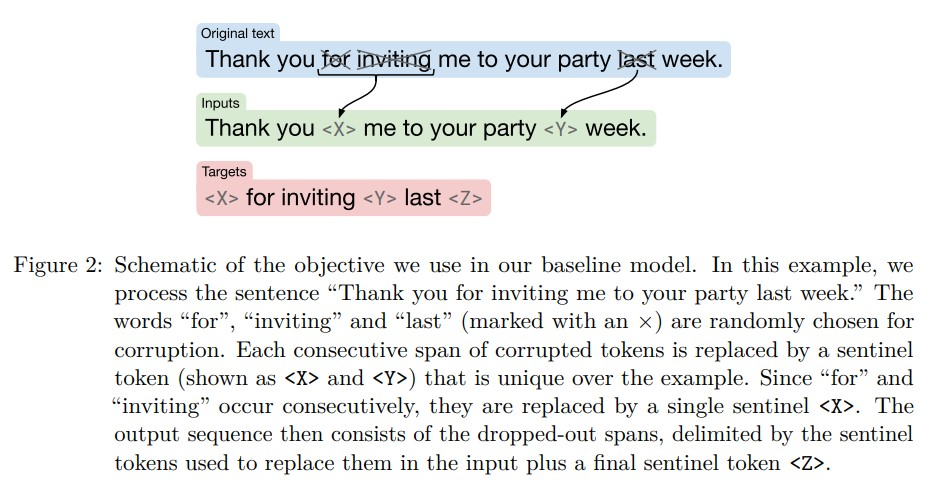

3.1.5 基准性能(Base performance)
&nbsp;&nbsp;&nbsp;&nbsp;&nbsp;&nbsp;&nbsp;&nbsp;在这一节中，我们使用上述基准实验流程的结果来了解在我们的一系列下游任务中可以期待什么样的性能。理想情况下，我们会对我们的研究中的每个实验重复多次，以获得结果的置信区间。不幸的是，由于我们运行的实验数量庞大，这将非常昂贵。作为一种更经济的替代方案，我们从头开始训练我们的基准模型10次（即使用不同的随机初始化和数据集洗牌），并假设这些运行中基准模型的方差也适用于每个实验变体。我们不认为我们所做的大多数改变会对运行间方差产生显著影响，因此这应该能够合理地指示不同改变的显著性。另外，我们还测量了在所有下游任务上对我们的模型进行2^18个步骤的训练（与我们用于微调的步骤数相同），但没有进行预训练。这使我们对预训练在基准设置下对模型的好处有了一个概念。 

&nbsp;&nbsp;&nbsp;&nbsp;&nbsp;&nbsp;&nbsp;&nbsp;在正文中报告结果时，我们只报告了所有基准测试中的一部分得分，以节省空间并便于解释。对于GLUE和SuperGLUE，我们报告所有子任务的平均得分（按照官方基准的规定）在“GLUE”和“SGLUE”标题下。对于所有的翻译任务，我们报告由SacreBLEU v1.3.0（Post，2018）提供的BLEU分数（Papineni等，2002），并采用“exp”平滑和“intl”分词。我们分别将WMT英语到德语、英语到法语和英语到罗马尼亚语的分数称为EnDe、EnFr和EnRo。对于CNN/Daily Mail，我们发现模型在ROUGE-1-F、ROUGE-2-F和ROUGE-L-F指标上的表现高度相关，因此我们只报告ROUGE-2-F分数，在“CNNDM”标题下。类似地，对于SQuAD，我们发现“exact match”得分和“F1”得分高度相关，因此我们只报告“exact match”得分。在附录E的表16中提供了所有实验中在所有任务上获得的每个得分。 

&nbsp;&nbsp;&nbsp;&nbsp;&nbsp;&nbsp;&nbsp;&nbsp;我们的结果表格的格式是每一行对应于特定的实验配置，列给出了每个基准测试的得分。在大多数表格中，我们将包括基线配置的平均性能。在基线配置出现的地方，我们将用⋆标记它（如表1的第一行）。我们还会将在给定实验中与最大值（最佳值）的两个标准差之内的得分加粗显示。我们的基准结果如表1所示。总体而言，我们的结果与类似规模的现有模型相当。例如，BERTBASE在SQuAD上取得了80.8的“exact match”得分和84.4的MNLI匹配准确率，而我们分别取得了80.88和84.24的得分（见表16）。 

&nbsp;&nbsp;&nbsp;&nbsp;&nbsp;&nbsp;&nbsp;&nbsp;请注意，我们不能直接将我们的基准与BERTBASE进行比较，因为我们的模型是一个编码器-解码器模型，并且进行了大约1/4步的预训练。毫不奇怪，我们发现预训练在几乎所有基准测试中都带来了显著的收益。唯一的例外是WMT英语到法语，这是一个足够大的数据集，预训练的收益往往是边际的。我们在实验中包括这个任务是为了测试在高资源范围内的迁移学习行为。由于我们通过选择最佳表现的检查点来进行早停止，我们的基准和“无预训练”之间的巨大差距强调了预训练在数据有限任务上提高性能的程度。虽然本文中我们并未明确衡量数据效率的改进，但我们强调这是迁移学习范式的主要优势之一。 

&nbsp;&nbsp;&nbsp;&nbsp;&nbsp;&nbsp;&nbsp;&nbsp;至于运行间方差，我们发现对于大多数任务，各次运行之间的标准差小于该任务基线得分的1%。CoLA、CB和COPA是GLUE和SuperGLUE基准测试中的低资源任务，它们是例外。例如，在CB任务上，我们的基线模型平均F1得分为91.22，标准差为3.237（见表16），这可能部分原因是CB的验证集只包含56个示例。请注意，GLUE和SuperGLUE分数是计算每个基准测试中任务得分的平均值。因此，我们要注意CoLA、CB和COPA的高运行间方差可能会使仅仅使用GLUE和SuperGLUE分数来比较模型更加困难。 

## 3.2 架构
&nbsp;&nbsp;&nbsp;&nbsp;&nbsp;&nbsp;&nbsp;&nbsp;尽管Transformer最初是以编码器-解码器架构引入的，但现代NLP领域的许多迁移学习工作使用了其他架构。在本节中，我们将回顾和比较这些架构变体。 

### 3.2.1 模型结构
&nbsp;&nbsp;&nbsp;&nbsp;&nbsp;&nbsp;&nbsp;&nbsp;不同架构的一个重要区别因素是模型中不同注意机制使用的“掩码”。回想一下，Transformer中的自注意操作将一个序列作为输入，并输出相同长度的新序列。输出序列的每个元素都是通过计算输入序列元素的加权平均值得到的。具体而言，设 $y_{i}$ 表示输出序列的第i个元素， $x_{j}$ 表示输入序列的第j个条目。 $y_{i}$ 被计算为 $\sum_{j} w_{i, j} x_{j}$ ,其中 $w_{i,j}$ 是自注意机制作为 $x_{i}$ 和 $x_{j}$ 的函数产生的标量权重。然后使用注意掩码将某些权重置零，以限制在给定输出时间步长上可以关注输入的哪些条目。我们将考虑的掩码的示意图如图3所示。例如，因果掩码（图3的中间）如果j > i，则将 $w_{i,j}$ 设为零。 

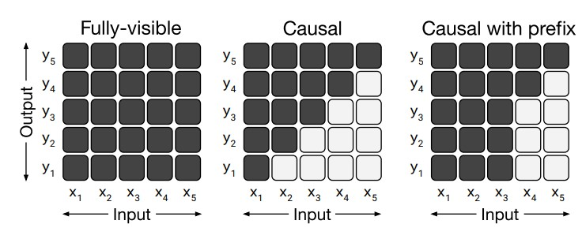

&nbsp;&nbsp;&nbsp;&nbsp;&nbsp;&nbsp;&nbsp;&nbsp;我们首先考虑的模型结构是编码器-解码器Transformer，它由两个层堆栈组成：编码器接收输入序列，解码器生成新的输出序列。这种架构变体的示意图如图4的左侧面板所示。 

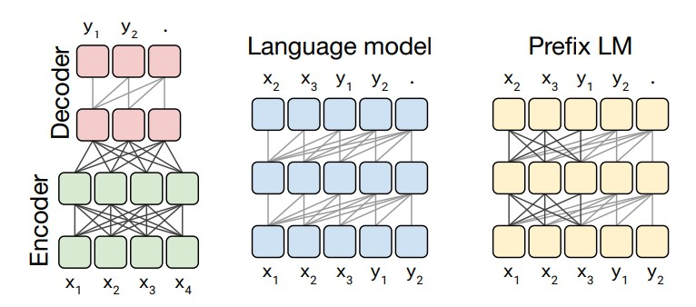

&nbsp;&nbsp;&nbsp;&nbsp;&nbsp;&nbsp;&nbsp;&nbsp;编码器使用“完全可见”注意掩码。完全可见的掩码允许自注意机制在生成输出的每个条目时关注输入的任何条目。我们在图3的左侧可视化了这种掩码模式。这种掩码形式适用于在“前缀”上进行关注，即为模型提供一些上下文，以后在进行预测时会用到。BERT（Devlin等，2018）也使用了完全可见的掩码模式，并在输入中附加了一个特殊的“分类”标记。然后，BERT在对应于分类标记的时间步上的输出用于对输入序列进行分类预测。 

&nbsp;&nbsp;&nbsp;&nbsp;&nbsp;&nbsp;&nbsp;&nbsp;Transformer解码器中的自注意操作使用“因果”掩码模式。在生成输出序列的第i个条目时，因果掩码防止模型关注输入序列的第j个条目（其中j > i）。这在训练过程中使用，以使模型在生成输出时不能“看到未来”。这种掩码模式的注意矩阵如图3的中间所示。 

&nbsp;&nbsp;&nbsp;&nbsp;&nbsp;&nbsp;&nbsp;&nbsp;在编码器-解码器Transformer中，解码器用于自回归地生成输出序列。换句话说，在每个输出时间步长，从模型的预测分布中采样一个标记，并将样本反馈到模型中，以生成下一个输出时间步长的预测，以此类推。因此，Transformer解码器（不带编码器）可以用作语言模型（LM），即仅用于下一步预测的模型（Liu等，2018；Radford等，2018；Al-Rfou等，2019）。这构成了我们考虑的第二种模型结构。这种架构的示意图如图4的中间所示。事实上，早期的NLP迁移学习工作使用了这种架构作为预训练方法，并以语言建模目标进行训练（Radford等，2018）。 

&nbsp;&nbsp;&nbsp;&nbsp;&nbsp;&nbsp;&nbsp;&nbsp;语言模型通常用于压缩或序列生成（Graves，2013）。然而，它们也可以在文本到文本框架中使用，只需将输入和目标连接起来。以英语到德语的翻译为例：如果我们有一个训练数据点，输入句子为“That is good.”，目标为“Das ist gut.”，我们只需在连接的输入序列“translate English to German: That is good. target: Das ist gut.”上进行下一步预测的训练。如果我们想获得模型对此示例的预测，模型将被提供前缀“translate English to German: That is good. target:”，并要求自回归地生成序列的剩余部分。通过这种方式，模型可以在给定输入的情况下预测输出序列，满足文本到文本任务的需求。最近的研究表明，语言模型可以在无监督的情况下学习执行一些文本到文本任务（Radford等，2019）。 

&nbsp;&nbsp;&nbsp;&nbsp;&nbsp;&nbsp;&nbsp;&nbsp;在文本到文本的设置中使用语言模型的一个基本且经常引用的缺点是因果掩码强制模型对输入序列的第i个条目的表示仅依赖于i之前的条目。为了理解为什么这可能是不利的，考虑一下文本到文本框架，其中模型在被要求进行预测之前会提供一个前缀/上下文（例如，前缀是一个英文句子，模型被要求预测德文翻译）。使用完全因果掩码时，模型对前缀状态的表示只能依赖于前缀的先前条目。因此，在预测输出的条目时，模型将仅关注一个被限制得不必要的前缀表示。类似的论点也被用来反对在序列到序列模型中使用单向递归神经网络编码器（Bahdanau等，2015）。 

&nbsp;&nbsp;&nbsp;&nbsp;&nbsp;&nbsp;&nbsp;&nbsp;在基于Transformer的语言模型中，可以通过改变掩码模式来避免这个问题。在序列的前缀部分，我们使用完全可见的掩码而不是因果掩码。这种掩码模式以及由此产生的“前缀LM”（我们考虑的第三种模型结构）的示意图分别在图3和图4的最右侧面板中进行了说明。在上述提到的英语到德语翻译示例中，完全可见的掩码将应用于前缀“translate English to German: That is good. target:”，而在训练中将使用因果掩码来预测目标“Das ist gut.”。在文本到文本框架中使用前缀LM最初是由Liu等人提出的（2018）。最近，Dong等人（2019）证明了这种架构在各种文本到文本任务上的有效性。这种架构类似于一个编码器-解码器模型，其中编码器和解码器共享参数，并且编码器-解码器注意力被替换为对输入和目标序列的全局注意力。 

&nbsp;&nbsp;&nbsp;&nbsp;&nbsp;&nbsp;&nbsp;&nbsp;我们注意到，当按照我们的文本到文本框架进行操作时，前缀LM架构与BERT（Devlin等人，2018）的分类任务非常相似。为了理解这一点，考虑一下MNLI基准测试中的一个例子，其中前提是“I hate pigeons.”，假设是“My feelings towards pigeons are filled with animosity.”，正确的标签是“entailment”。为了将这个例子输入到语言模型中，我们将其转换为序列“mnli premise: I hate pigeons. hypothesis: My feelings towards pigeons are filled with animosity. target: entailment”。在这种情况下，完全可见的前缀将对应于直到单词“target:”的整个输入序列，可以看作是类似于BERT中使用的“classification”标记。因此，我们的模型将对整个输入序列有完全的可见性，然后通过输出单词“entailment”来进行分类。对于模型来说，在给定任务前缀（在这种情况下是“mnli”）的情况下，很容易学会输出其中一个有效的类别标签。因此，前缀LM和BERT架构之间的主要区别在于前缀LM中的分类器简单地集成到Transformer解码器的输出层中。 

&nbsp;&nbsp;&nbsp;&nbsp;&nbsp;&nbsp;&nbsp;&nbsp;为了在实验中比较这些架构变体，我们希望我们考虑的每个模型在某种有意义的方式上是等效的。我们可以说，如果两个模型具有相同数量的参数或者它们在处理给定的（输入序列，目标序列）对时需要大致相同的计算量，那么它们是等效的。不幸的是，不可能同时根据这两个标准来比较编码器-解码器模型和语言模型架构（由单个Transformer堆叠组成）。为了理解为什么，首先请注意，具有L层编码器和L层解码器的编码器-解码器模型的参数数量大致与具有2L层的语言模型相同。然而，相同的L + L编码器-解码器模型的计算成本大致与仅具有L层的语言模型相同。这是因为语言模型中的L层必须应用于输入和输出序列，而编码器只应用于输入序列，解码器只应用于输出序列。请注意，这些等价性是近似的——由于编码器-解码器注意力，解码器中有一些额外的参数，并且注意力层中的一些计算成本与序列长度的平方成正比。然而，在实际操作中，我们观察到L层语言模型和L + L层编码器-解码器模型的步骤时间几乎相同，表明它们具有大致相同的计算成本。此外，对于我们考虑的模型大小，编码器-解码器注意力层中的参数数量约占总参数数量的10%，因此我们做出简化假设，即L + L层编码器-解码器模型与2L层语言模型具有相同数量的参数。 

&nbsp;&nbsp;&nbsp;&nbsp;&nbsp;&nbsp;&nbsp;&nbsp;为了提供一个合理的比较手段，我们考虑了编码器-解码器模型的多个配置。我们将L和P分别表示为BERTBASE大小的层堆栈中的层数和参数数量。我们将使用M来表示处理给定输入-目标对所需的L + L层编码器-解码器模型或仅具有L层解码器的模型的浮点操作数（FLOPs）数量。总之，我们将比较以下内容： 

- 一个编码器-解码器模型，编码器有L层，解码器也有L层。该模型具有2P个参数和计算成本为M FLOPs。

- 一个等效的模型，但是编码器和解码器共享参数，结果是P个参数和计算成本为M FLOPs。

- 一个编码器-解码器模型，编码器和解码器各有L/2层，参数为P，计算成本为M/2 FLOPs。

- 一个仅有解码器的语言模型，有L层和P个参数，计算成本为M FLOPs。

- 一个仅有解码器的前缀语言模型，具有相同的架构（因此具有相同数量的参数和计算成本），但在输入上具有完全可见的自注意力。

### 3.2.3 目标
&nbsp;&nbsp;&nbsp;&nbsp;&nbsp;&nbsp;&nbsp;&nbsp;作为无监督的目标，我们将考虑基本的语言建模目标，以及我们在第3.1.4节中描述的基准去噪目标。我们包括语言建模目标是因为它在历史上被用作预训练目标（Dai和Le，2015；Ramachandran等，2016；Howard和Ruder，2018；Radford等，2018；Peters等，2018），并且与我们考虑的语言模型架构非常契合。对于在进行预测之前接受前缀的模型（编码器-解码器模型和前缀LM），我们从无标签数据集中随机选择一段文本，并选择一个随机点将其分割为前缀和目标部分。对于标准语言模型，我们训练模型从开头到结尾预测整个文本段落。我们的无监督去噪目标是为了适用于文本到文本模型；为了将其适应语言模型的使用，我们按照第3.2.1节中描述的方法将输入和目标连接起来。 

&nbsp;&nbsp;&nbsp;&nbsp;&nbsp;&nbsp;&nbsp;&nbsp;在表2中显示了我们比较的每种架构所达到的得分。对于所有任务来说，具有去噪目标的编码器-解码器架构表现最好。这种变体具有最高的参数数量（2P），但与P参数的仅解码器模型具有相同的计算成本。令人惊讶的是，我们发现在编码器和解码器之间共享参数的性能几乎与最佳表现相当。相比之下，将编码器和解码器堆栈的层数减半会显著降低性能。同时进行的研究（Lan等，2019）还发现，在Transformer块之间共享参数可以有效地降低总参数数量而不会牺牲太多性能。XLNet也与具有去噪目标的共享编码器-解码器方法有一些相似之处（Yang等，2019）。我们还注意到，共享参数的编码器-解码器优于仅有解码器的前缀LM，这表明明确的编码器-解码器注意力的添加是有益的。最后，我们证实了一个广泛认可的观念，即与语言建模目标相比，使用去噪目标总是能够取得更好的下游任务性能。这个观察结果之前已经被Devlin等人（2018）、Voita等人（2019）和Lample和Conneau（2019）等人提出过。在接下来的章节中，我们将对无监督目标进行更详细的探索。 

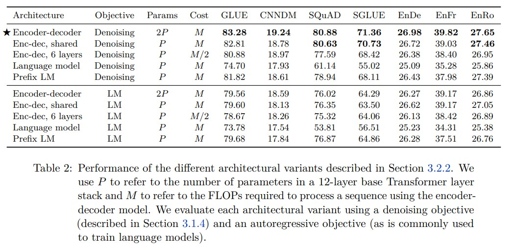

## 3.3 无监督目标
&nbsp;&nbsp;&nbsp;&nbsp;&nbsp;&nbsp;&nbsp;&nbsp;选择无监督目标非常重要，因为它提供了模型获取通用知识并应用于下游任务的机制。这导致了各种各样的预训练目标的发展（Dai和Le，2015；Ramachandran等，2016；Radford等，2018；Devlin等，2018；Yang等，2019；Liu等，2019b；Wang等，2019a；Song等，2019；Dong等，2019；Joshi等，2019）。在本节中，我们对无监督目标的空间进行了程序化的探索。在许多情况下，我们不会完全复制现有的目标，有些目标会被修改以适应我们的文本到文本编码器-解码器框架，而在其他情况下，我们会使用结合了多种常见方法概念的目标。 

&nbsp;&nbsp;&nbsp;&nbsp;&nbsp;&nbsp;&nbsp;&nbsp;总体而言，我们的所有目标都会接受一系列与我们的无标签文本数据集中的标记化文本段相对应的标记ID序列。标记序列经过处理，生成一个（有错误的）输入序列和相应的目标序列。然后，按照最大似然的方式训练模型来预测目标序列。我们在表3中提供了我们考虑的许多目标的示例说明。 

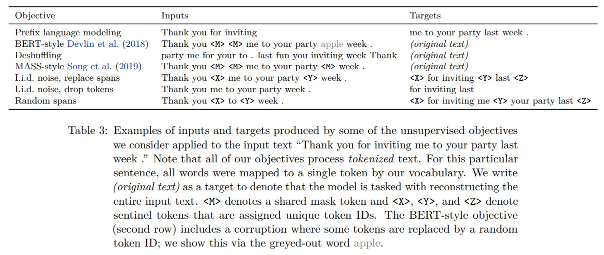

### 3.3.1 不同的高级方法
&nbsp;&nbsp;&nbsp;&nbsp;&nbsp;&nbsp;&nbsp;&nbsp;首先，我们比较三种受常用目标启发但在方法上有明显差异的技术。首先，我们包括一个基本的“前缀语言建模”目标，就像在3.2.3节中使用的那样。这种技术将文本段分成两个部分，一个用作编码器的输入，另一个用作由解码器预测的目标序列。其次，我们考虑了一种受BERT（Devlin等，2018）中使用的“掩码语言建模”（MLM）目标启发的目标。MLM接受一个文本段并破坏其中15%的标记。破坏的标记中，90%被特殊的掩码标记替换，10%被随机标记替换。由于BERT是一个仅编码器模型，在预训练期间其目标是在编码器的输出中重构掩码标记。在编码器-解码器情况下，我们简单地使用整个未破坏的序列作为目标。请注意，这与我们的基准目标不同，基准目标仅使用破坏的标记作为目标；我们在3.3.2节中比较了这两种方法。最后，我们还考虑了一种基本的重排目标，如（Liu等，2019a）中所使用的方式，该方式被应用于去噪的序列自编码器。该方法接受一系列标记，将其进行重排，然后使用原始的未重排序列作为目标。我们在表3的前三行提供了这三种方法的输入和目标的示例。 

&nbsp;&nbsp;&nbsp;&nbsp;&nbsp;&nbsp;&nbsp;&nbsp;这三种目标的性能显示在表4中。总体而言，我们发现BERT风格的目标表现最好，尽管前缀语言建模目标在翻译任务上达到了类似的性能。实际上，BERT目标的动机是超越基于语言模型的预训练。重排目标的性能比前缀语言建模和BERT风格的目标要差得多。 

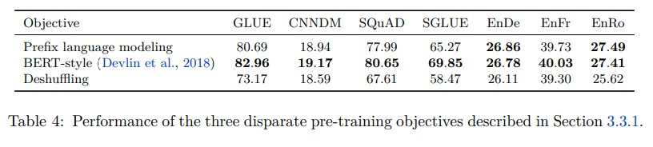

### 3.3.2 简化的BERT目标
&nbsp;&nbsp;&nbsp;&nbsp;&nbsp;&nbsp;&nbsp;&nbsp;基于前一节的结果，我们现在将重点放在探索对BERT风格的去噪目标进行修改上。该目标最初被提出作为一个仅编码器模型的预训练技术，用于分类和跨度预测。因此，我们可能可以修改它，使其在我们的编码器-解码器文本到文本设置中表现更好或更高效。 

&nbsp;&nbsp;&nbsp;&nbsp;&nbsp;&nbsp;&nbsp;&nbsp;首先，我们考虑一种简单的BERT风格目标的变体，其中不包括随机标记交换步骤。得到的目标只是将输入中的15%标记替换为掩码标记，并训练模型重构原始的未破坏序列。Song等人（2019）使用了类似的掩码目标，被称为“MASS”，因此我们将这个变体称为“MASS风格”目标。其次，我们有兴趣看看是否有可能避免预测整个未破坏的文本段，因为这需要解码器对长序列进行自注意力。我们考虑了两种策略来实现这一点：首先，我们不是用掩码标记替换每个破坏标记，而是用一个唯一的掩码标记替换每个连续的破坏标记序列的全部。然后，目标序列变为“破坏”序列的连接，每个序列前缀都是用于替换输入中的该序列的掩码标记。这是我们在基准目标中使用的预训练目标，详见3.1.4节。其次，我们还考虑了一种变体，即完全从输入序列中删除破坏的标记，并要求模型按顺序重构丢失的标记。这些方法的示例显示在表3的第五行和第六行中。 

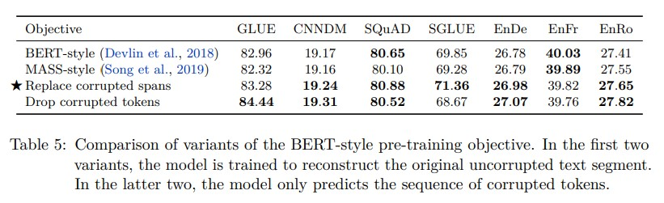

&nbsp;&nbsp;&nbsp;&nbsp;&nbsp;&nbsp;&nbsp;&nbsp;在表5中展示了原始BERT风格目标与这三种替代方案的实证比较。在我们的设置中，我们发现所有这些变体的表现都相似。唯一的例外是完全删除破坏的标记在GLUE分数上产生了小幅改善，这要归功于CoLA上显著更高的分数（60.04，相比我们基准的平均分数53.84，请参见表16）。这可能是因为CoLA涉及对给定句子的语法和句法可接受性进行分类，而能够确定标记是否丢失与检测可接受性密切相关。然而，在SuperGLUE上，完全删除标记的表现不如用特殊标记替换它们。两种不需要预测完整原始序列的变体（"replace corrupted spans"和"drop corrupted spans"）都有潜力，因为它们使目标序列变短，从而加快了训练速度。下一步，我们将探索一些变体，其中我们用特殊标记替换破坏的序列，并且只预测破坏的标记（与我们基准目标相同）。 

### 3.3.3 改变破坏率
&nbsp;&nbsp;&nbsp;&nbsp;&nbsp;&nbsp;&nbsp;&nbsp;到目前为止，我们一直在破坏15%的标记，这是BERT（Devlin等，2018）中使用的值。再次强调，由于我们的文本到文本框架与BERT的不同，我们有兴趣看看是否对我们来说不同的破坏率效果更好。我们在表6中比较了10%、15%、25%和50%的破坏率。总体而言，我们发现破坏率对模型的性能影响有限。唯一的例外是我们考虑的最大破坏率（50%）导致GLUE和SQuAD上性能显著下降。使用更高的破坏率还会导致目标更长，这可能会减慢训练速度。基于这些结果和BERT的历史先例，我们将继续使用15%的破坏率。 

### 3.3.4 破坏跨度
&nbsp;&nbsp;&nbsp;&nbsp;&nbsp;&nbsp;&nbsp;&nbsp;现在我们转向通过预测更短的目标来加快训练的目标。到目前为止，我们使用的方法是针对每个输入标记做出独立的决策，即是否破坏该标记。当连续的多个标记被破坏时，它们被视为一个“span”，并使用单个唯一的掩码标记替换整个span。用单个标记替换整个span会将未标记的文本数据处理为较短的序列。由于我们使用的是独立决策的破坏策略，并不总是出现大量连续破坏的标记。因此，通过特意破坏标记的span而不是以独立决策方式破坏单个标记，可能会获得额外的加速效果。破坏span也在之前作为BERT的预训练目标中考虑过，并发现它能够提高性能（Joshi等人，2019）。 

&nbsp;&nbsp;&nbsp;&nbsp;&nbsp;&nbsp;&nbsp;&nbsp;为了测试这个想法，我们考虑了一个特定的目标，即破坏连续的、随机间隔的标记span。这个目标可以通过破坏的标记比例和总的破坏span数量进行参数化。然后，span的长度是随机选择的，以满足这些指定的参数。例如，如果我们正在处理一个包含500个标记的序列，并且我们指定15%的标记应该被破坏，并且总共应该有25个span，那么破坏的总标记数将是500×0.15 = 75，平均span长度将为75/25 = 3。请注意，根据原始序列长度和破坏率，我们可以通过平均span长度或总span数来等价地参数化这个目标。 

&nbsp;&nbsp;&nbsp;&nbsp;&nbsp;&nbsp;&nbsp;&nbsp;我们在表7中将span破坏目标与独立决策破坏目标进行了比较。在所有情况下，我们使用了15%的破坏率，并比较了平均span长度为2、3、5和10的情况。同样地，我们发现这些目标之间存在有限的差异，尽管平均span长度为10的版本在某些情况下稍微表现欠佳。我们还特别发现，使用平均span长度为3的情况在大多数非翻译基准测试中略微（但显著）优于独立决策破坏目标。幸运的是，与独立决策噪声方法相比，span破坏目标在训练过程中提供了一定的加速，因为平均而言，span破坏会产生较短的序列。 

### 3.3.5 discussion
&nbsp;&nbsp;&nbsp;&nbsp;&nbsp;&nbsp;&nbsp;&nbsp;图5显示了我们在探索无监督目标过程中所做选择的流程图。总体而言，我们观察到的最显著的性能差异是去噪目标在预训练中优于语言建模和打乱目标。我们并没有观察到我们探索的许多去噪目标的显著差异。然而，不同的目标（或目标的参数化）可能导致不同的序列长度，从而导致不同的训练速度。这意味着在我们考虑的去噪目标之间的选择应主要根据它们的计算成本来进行。我们的结果还表明，对于我们考虑的任务和模型来说，进一步探索类似于我们在这里考虑的目标可能不会带来显著的收益。相反，探索完全不同的利用无标签数据的方法可能是偶然的。 

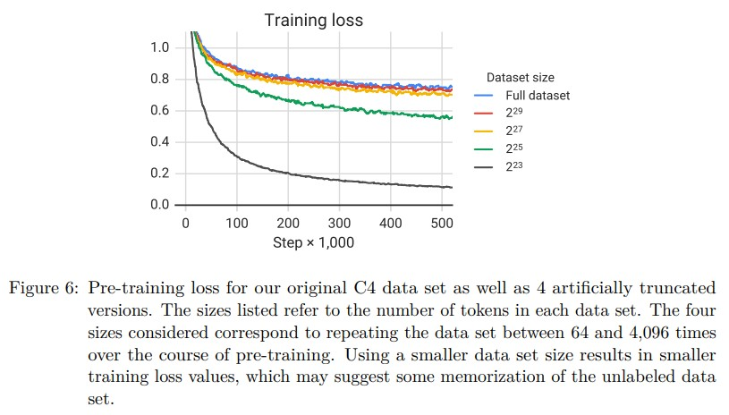

## 3.4 预训练数据集
&nbsp;&nbsp;&nbsp;&nbsp;&nbsp;&nbsp;&nbsp;&nbsp;与无监督目标类似，预训练数据集本身是迁移学习流程中的关键组成部分。然而，与目标和基准不同，新的预训练数据集通常不被视为独立的重要贡献，并且通常不会与预训练模型和代码一起发布。相反，它们通常在介绍新方法或模型的过程中被引入。因此，对不同的预训练数据集进行比较相对较少，并且缺乏用于预训练的“标准”数据集。最近的一些值得注意的例外情况（Baevski等人，2019; Liu等人，2019c; Yang等人，2019）比较了在新的大型（通常是从Common Crawl获取的）数据集上进行预训练与使用较小的现有数据集（通常是维基百科）进行预训练的情况。为了更深入地探索预训练数据集对性能的影响，在本节中，我们比较了我们的C4数据集的不同变体以及其他潜在的预训练数据来源。我们将考虑的所有C4数据集的变体都作为TensorFlow Datasets的一部分发布。 

### 3.4.1 无标签数据集
&nbsp;&nbsp;&nbsp;&nbsp;&nbsp;&nbsp;&nbsp;&nbsp;在创建C4数据集时，我们开发了各种启发式方法来过滤来自Common Crawl的网络提取文本（请参见第2.2节进行描述）。除了将其与其他过滤方法和常见的预训练数据集进行比较，我们还有兴趣衡量这种过滤是否会改善下游任务的性能。为此，我们比较了在以下数据集上进行预训练后，我们基准模型的性能： 

**C4** 作为基准，我们首先考虑在我们在第2.2节中描述的无标签数据集上进行预训练。 

**未经过滤的 C4** 为了衡量我们在创建 C4 时使用的启发式过滤方法（去重、去除不良词汇、仅保留句子等）的效果，我们还生成了另一个版本的 C4，其中不使用这些过滤方法。需要注意的是，我们仍然使用 langdetect 来提取英文文本。因此，我们的“未经过滤”变体仍包括一些过滤，因为 langdetect 有时对非自然英文文本赋予较低的概率。 

**类RealNews** 最近的研究使用从新闻网站提取的文本数据（Zellers 等人，2019; Baevski 等人，2019）。为了与这种方法进行比较，我们通过对 C4 进行额外的过滤，只保留来自“RealNews”数据集（Zellers 等人，2019）中的一个域的内容，生成了另一个无标签数据集。需要注意的是，为了便于比较，我们保留了 C4 中使用的启发式过滤方法；唯一的区别是我们明显省略了任何非新闻内容。 

**类WebText** 同样，WebText 数据集（Radford 等人，2019）仅使用提交给内容聚合网站 Reddit 并获得至少 3 分的网页内容。Reddit 上提交的网页的分数是根据支持（点赞）或反对（踩）该网页的用户比例计算的。使用 Reddit 分数作为质量信号的想法是，网站的用户只会点赞高质量的文本内容。为了生成一个可比较的数据集，我们首先尝试删除所有不是来自 OpenWebText 项目准备的 URL 列表中的 URL 的 C4 内容。然而，这导致了相对较少的内容 - 只有约 2 GB，因为大多数页面从未出现在 Reddit 上。请记住，C4 是基于一个月的 Common Crawl 数据创建的。为了避免使用过小的数据集，我们因此从 2018 年 8 月到 2019 年 7 月下载了 12 个月的 Common Crawl 数据，应用了用于 C4 的启发式过滤，然后应用了 Reddit 过滤。这产生了一个大小与原始的 40GB WebText 数据集（Radford 等人，2019）相当的 17 GB 的类似 WebText 数据集。 

**维基百科** 网站维基百科由数百万篇百科全书文章协作撰写而成。该网站上的内容受到严格的质量准则限制，因此被视为可靠的干净和自然文本的来源。我们使用来自 TensorFlow Datasets 的英文维基百科文本数据，其中省略了文章中的任何标记或参考部分。 

**维基百科 + 多伦多图书语料库** 使用维基百科的预训练数据的一个缺点是它仅代表自然文本的一个可能领域（百科全书文章）。为了减轻这个问题，BERT（Devlin 等人，2018）将维基百科的数据与多伦多图书语料库（TBC）（Zhu 等人，2015）相结合。TBC 包含从电子书中提取的文本，代表了不同领域的自然语言。BERT 的流行导致维基百科 + TBC 的组合在许多后续工作中被使用。 

&nbsp;&nbsp;&nbsp;&nbsp;&nbsp;&nbsp;&nbsp;&nbsp;在每个数据集上进行预训练后取得的结果如表8所示。首先显而易见的结论是，去除C4的启发式过滤会统一降低性能，并使未经过滤的变体在每个任务中表现最差。除此之外，我们发现在某些情况下，具有更受限制领域的预训练数据集的性能优于多样化的C4数据集。例如，使用维基百科 + TBC语料库产生了73.24的SuperGLUE分数，超过了基线（使用C4）的71.36分。这几乎完全归因于在MultiRC的Exact Match分数上性能的提升，从25.78（基线，C4）提高到50.93（维基百科 + TBC）（见表16）。MultiRC是一个阅读理解数据集，其中最大的数据来源是小说书籍，而这正是TBC所涵盖的领域。类似地，使用类似RealNews的数据集进行预训练，将ReCoRD的Exact Match分数从68.16提高到73.72，ReCoRD是一个衡量新闻文章阅读理解的数据集。最后一个例子，使用维基百科的数据在SQuAD上产生了显著的（但不那么明显）收益，SQuAD是一个问题回答数据集，其中的段落来自维基百科。先前的研究也得出了类似的观察，例如Beltagy等人（2019）发现，在研究论文的文本上进行BERT的预训练可以提高其在科学任务上的性能。这些发现的主要教训是，在域内的无标签数据上进行预训练可以提高下游任务的性能。这并不令人意外，但如果我们的目标是预训练一个能够快速适应任意领域语言任务的模型，这也是不令人满意的。刘等人（2019c）也观察到，在更多样化的数据集上进行预训练可以改善下游任务的性能。这个观察也激发了关于自然语言处理领域适应性的平行研究线，有关该领域的综述请参见Ruder（2019）；Li（2012）。 

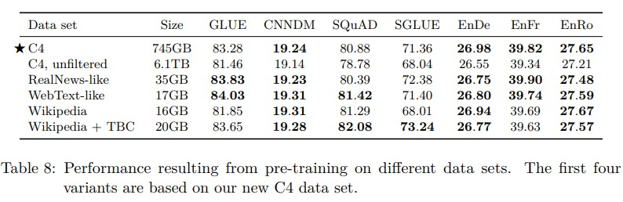

&nbsp;&nbsp;&nbsp;&nbsp;&nbsp;&nbsp;&nbsp;&nbsp;仅在单一领域进行预训练的缺点是，生成的数据集通常要小得多。类似地，在我们的基准设置中，WebText样式的变体在性能上与C4数据集相当或更好，但Reddit的过滤生成的数据集比C4小约40倍，尽管它基于Common Crawl提供的数据量增加了12倍。然而，请注意，在我们的基准设置中，我们只对大约34B个令牌进行预训练，这仅比我们考虑的最小预训练数据集大约8倍。我们将在下一节中调查使用较小的预训练数据集何时成为一个问题。 

### 3.4.2 预训练数据集大小
&nbsp;&nbsp;&nbsp;&nbsp;&nbsp;&nbsp;&nbsp;&nbsp;我们用于创建C4的流程旨在创建非常大的预训练数据集。拥有如此多的数据让我们能够在预训练模型时避免重复示例。目前尚不清楚在预训练期间重复示例对下游性能是有益还是有害的，因为我们的预训练目标本身是随机的，并且可以帮助防止模型多次看到完全相同的数据。 

&nbsp;&nbsp;&nbsp;&nbsp;&nbsp;&nbsp;&nbsp;&nbsp;为了测试有限无标签数据集大小的影响，我们在人为截断的C4版本上对基准模型进行了预训练。回想一下，我们在大约 34B (2^{35})个令牌上对基准模型进行预训练（这只是C4总大小的一小部分）。我们考虑在C4的截断变体上进行训练，包含2^29、2^27、2^25和2^23个令牌。这些大小分别相当于在预训练过程中将数据集重复64次、256次、1,024次和4,096次。 

&nbsp;&nbsp;&nbsp;&nbsp;&nbsp;&nbsp;&nbsp;&nbsp;下游任务的结果如表9所示。正如预期的那样，随着数据集大小的缩小，性能会下降。我们怀疑这可能是因为模型开始记忆预训练数据集。为了衡量这一点是否正确，我们在图6中绘制了每个数据集大小的训练损失。确实，随着预训练数据集的缩小，模型的训练损失显著降低，这表明可能存在记忆现象。Baevski等人（2019）也观察到，在截断预训练数据集的大小时，可能会降低下游任务的性能。 

&nbsp;&nbsp;&nbsp;&nbsp;&nbsp;&nbsp;&nbsp;&nbsp;我们注意到，当预训练数据集仅重复64次时，这些影响是有限的。这表明一定程度上的预训练数据重复可能并不会有害。然而，鉴于额外的预训练可能是有益的（正如我们将在第3.6节中展示的那样），而获取额外的无标签数据是廉价且容易的，我们建议尽可能使用大型的预训练数据集。我们还注意到，这种效应在更大的模型尺寸下可能更明显，即更大的模型可能更容易过拟合到较小的预训练数据集上。 

## 3.5 训练策略
&nbsp;&nbsp;&nbsp;&nbsp;&nbsp;&nbsp;&nbsp;&nbsp;到目前为止，我们已经考虑了在模型的所有参数在进行监督任务的微调之前，在无监督任务上进行预训练的设置。虽然这种方法很直接，但也提出了各种不同的替代方法，用于在下游/监督任务上训练模型。在本节中，我们将比较不同的微调模型方案，以及同时在多个任务上训练模型的方法。 

### 3.5.1 微调方法
&nbsp;&nbsp;&nbsp;&nbsp;&nbsp;&nbsp;&nbsp;&nbsp;有人认为微调模型的所有参数可能导致次优的结果，尤其是在资源有限的任务上（Peters等人，2019）。早期对于文本分类任务的迁移学习的研究结果提倡仅微调由固定预训练模型生成的句子嵌入向量输入的小型分类器的参数（Subramanian等人，2018；Kiros等人，2015；Logeswaran和Lee，2018；Hill等人，2016；Conneau等人，2017）。然而，这种方法对于我们的编码器-解码器模型的适用性较低，因为整个解码器必须被训练以输出给定任务的目标序列。相反，我们专注于两种替代的微调方法，只更新我们的编码器-解码器模型的部分参数。 

&nbsp;&nbsp;&nbsp;&nbsp;&nbsp;&nbsp;&nbsp;&nbsp;第一种方法是“适配器层”（Houlsby等人，2019；Bapna等人，2019），其目标是在微调时保持大部分原始模型固定。适配器层是额外的密集-ReLU-密集块，添加在Transformer的每个块中的每个现有前馈网络之后。这些新的前馈网络被设计成其输出维度与其输入维度相匹配。这样它们可以在网络中插入，而无需对结构或参数进行额外的更改。在微调时，仅更新适配器层和层归一化参数。该方法的主要超参数是前馈网络的内部维度d，它改变了添加到模型中的新参数的数量。我们尝试了各种d的取值。 

&nbsp;&nbsp;&nbsp;&nbsp;&nbsp;&nbsp;&nbsp;&nbsp;我们考虑的第二种替代微调方法是“渐进解冻”（Howard和Ruder，2018）。在渐进解冻中，模型的更多参数会随着时间的推移进行微调。渐进解冻最初应用于由单个层堆叠组成的语言模型架构。在这种设置下，在微调开始时，只有最后一层的参数被更新，然后在进行了一定数量的更新训练后，也包括倒数第二层的参数，以此类推，直到整个网络的参数都在进行微调。为了适应我们的编码器-解码器模型，我们同时逐渐解冻编码器和解码器中的层，从顶部开始。由于我们的输入嵌入矩阵和输出分类矩阵的参数是共享的，我们在整个微调过程中更新它们。回想一下，我们的基准模型在编码器和解码器中各有12层，并进行 $2^{18}$ 步的微调。因此，我们将微调过程分为12个周期，每个周期进行 $\frac {2^{18}} {12}$ 步的训练，从第12-n层到第12层的每个周期中进行训练。我们注意到，Howard和Ruder（2018）建议在每个训练周期后微调一个额外的层。然而，由于我们的监督数据集在大小上差异很大，并且由于我们的一些下游任务实际上是许多任务的混合（GLUE和SuperGLUE），我们选择了更简单的策略，在每 $\frac {2^{18}} {12}$ 步之后微调一个额外的层。 

&nbsp;&nbsp;&nbsp;&nbsp;&nbsp;&nbsp;&nbsp;&nbsp;这些微调方法的性能比较如表10所示。对于适配器层，我们报告了使用内部维度d为32、128、512、2048时的性能。根据过去的结果（Houlsby等人，2019；Bapna等人，2019），我们发现像SQuAD这样的低资源任务在较小的d值下表现良好，而较高资源的任务则需要较大的维度才能达到合理的性能。这表明，只要将维度适当地缩放到任务的大小，适配器层可以成为在较少参数上进行微调的一种有前景的技术。请注意，在我们的情况下，我们将GLUE和SuperGLUE视为单个“任务”，通过连接它们的组成数据集，因此尽管它们包含一些低资源数据集，但合并后的数据集足够大，需要较大的d值。我们发现渐进解冻在所有任务中都导致了轻微的性能下降，尽管在微调过程中提供了一定的加速。通过更仔细地调整解冻计划，可能可以获得更好的结果。 

### 3.5.2 多任务学习
&nbsp;&nbsp;&nbsp;&nbsp;&nbsp;&nbsp;&nbsp;&nbsp;到目前为止，我们一直在将模型在进行微调之前，先在单个无监督学习任务上进行预训练。另一种方法被称为“多任务学习”（Ruder，2017；Caruana，1997），它是在同时训练模型上多个任务。这种方法通常的目标是训练一个单一的模型，它可以同时执行多个任务，也就是说，模型和大部分参数在所有任务之间是共享的。我们稍微放松了这个目标，而是研究了同时训练多个任务的方法，以便最终产生在每个单独任务上表现良好的单独参数设置。例如，我们可以在许多任务上训练一个单一模型，但在报告性能时，我们可以为每个任务选择一个不同的检查点。这使得多任务学习框架相对于我们之前考虑的预训练-微调方法更加灵活。我们还注意到，在我们的统一文本到文本框架中，“多任务学习”简单地对应于将数据集混合在一起。因此，当使用多任务学习时，我们仍然可以在无标签数据上进行训练，将无监督任务视为要混合在一起的任务之一。相比之下，大多数将多任务学习应用于NLP的方法添加了特定于任务的分类网络或使用不同的损失函数对每个任务进行建模（Liu等人，2019b）。 

&nbsp;&nbsp;&nbsp;&nbsp;&nbsp;&nbsp;&nbsp;&nbsp;正如Arivazhagan等人（2019）指出的，多任务学习中一个非常重要的因素是模型应该训练多少来自每个任务的数据。我们的目标是不要过度或不足地训练模型，也就是说，我们希望模型能够看到足够的来自给定任务的数据，以便它能够良好地执行该任务，但不要看到太多的数据以至于它记住了训练集。如何设置来自每个任务的数据比例可以取决于各种因素，包括数据集的大小，学习任务的“难度”（即模型在能够有效执行任务之前必须看到多少数据），正则化等。另一个问题是“任务干扰”或“负迁移”的可能性，在这种情况下，在一个任务上取得良好的性能可能会妨碍另一个任务的性能。考虑到这些问题，我们首先探索了设置来自每个任务的数据比例的各种策略。Wang等人（2019a）也进行了类似的探索。 

**样例比例混合** 模型过拟合给定任务的速度主要取决于任务的数据集大小。因此，一种自然的设置混合比例的方法是按照每个任务数据集的大小进行采样。这相当于将所有任务的数据集连接起来，然后从组合数据集中随机采样示例。然而，请注意，我们包括了无监督的去噪任务，该任务使用的数据集比其他任务的数据集大几个数量级。因此，如果我们简单地按照每个数据集的大小进行采样，模型看到的绝大部分数据将是无标签的，并且在所有监督任务上的训练不足。即使没有无监督任务，一些任务（例如WMT英法翻译）的规模也很大，它们同样会占据大部分批次。为了解决这个问题，在计算比例之前，我们对数据集大小设置了一个人为的“限制”。具体而言，如果我们的N个任务中每个任务的示例数为en，其中n ∈ {1, . . . , N}，那么我们将在训练过程中从第m个任务采样的概率设置为 $r_{m}= min (e_{m}, K) / \sum min(e_{n}, K)$ , 其中K是人为的数据集大小限制。 

**温度缩放混合** 缓解数据集大小之间巨大差异的另一种方法是调整混合率的“温度”。多语言BERT使用了这种方法，以确保模型在资源稀缺的语言上得到充分训练。为了实现温度缩放，使用温度T，我们将每个任务的混合率 $r_{m}$ 提升至 1/T 的幂，并对比例进行重新归一化，使它们的总和为1。当T = 1时，该方法等同于例子比例混合，随着T的增加，比例越来越接近均等混合。我们保留数据集大小限制K（在温度缩放之前应用于获得rm），但将其设置为较大的值 $K = 2^{21}$ 。我们使用较大的K值，因为增加温度将降低最大数据集的混合率。 

**均等混合** 在这种情况下，我们以相等的概率从每个任务中采样示例。具体而言，每个批次中的每个示例都是从我们进行训练的数据集中均匀随机采样的。这很可能是一种次优策略，因为模型会很快在资源稀缺的任务上过拟合，并在资源丰富的任务上欠拟合。我们主要将其作为参考，以了解在比例设置不佳时可能出现的问题。 

&nbsp;&nbsp;&nbsp;&nbsp;&nbsp;&nbsp;&nbsp;&nbsp;为了将这些混合策略与我们的基准预训练-微调结果进行公平比较，我们以相同的总步数训练多任务模型： $2^{19} + 2^{18} = 786,432$ 步。结果如表11所示。 

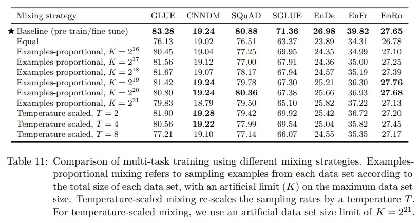

&nbsp;&nbsp;&nbsp;&nbsp;&nbsp;&nbsp;&nbsp;&nbsp;总体而言，我们发现多任务训练在大多数任务上的表现不如先进行预训练再进行微调。特别是，“均等”混合策略导致性能显著下降，可能是因为低资源任务过拟合，高资源任务没有看到足够的数据，或者模型没有看到足够的无标签数据来学习通用语言能力。对于例子比例混合，我们发现对于大多数任务，存在一个K的“最佳点”，在这个点上模型获得最佳性能，而较大或较小的K值往往导致性能更差。例外情况（在我们考虑的K值范围内）是WMT英法翻译，这是一个高资源任务，它总是受益于较高的混合比例。最后，我们注意到，温度缩放混合也可以在大多数任务中获得合理的性能，其中T = 2在大多数情况下表现最佳。之前的研究已经观察到多任务模型的表现不如对每个单独任务进行训练的单独模型，例如Arivazhagan等人（2019）和McCann等人（2018），尽管已经证明多任务设置可以在非常相似的任务之间带来好处，如Liu等人（2019b）和Ratner等人（2018）。在接下来的部分，我们将探索缩小多任务训练和预训练-微调方法之间差距的方法。 

### 3.5.3 将多任务学习与微调相结合
&nbsp;&nbsp;&nbsp;&nbsp;&nbsp;&nbsp;&nbsp;&nbsp;回想一下，我们正在研究一种宽松版本的多任务学习，其中我们在混合任务上训练单个模型，但允许使用不同的参数设置（检查点）来评估性能。我们可以通过考虑以下情况来扩展这种方法：模型一次性在所有任务上进行预训练，然后在各个监督任务上进行微调。这是“MT-DNN”（Liu等人，2015年，2019b年）使用的方法，当被引入时，在GLUE和其他基准测试中取得了最先进的性能。我们考虑了这种方法的三个变体：首先，我们简单地在例子比例混合的情况下对模型进行预训练，设置人为的数据集大小限制为K = 2^19，然后在每个单独的下游任务上进行微调。这有助于衡量在预训练期间将监督任务与无监督目标一起包含的效果，以便模型在早期暴露于下游任务时获得一些有益的经验。我们还希望，在许多监督来源的混合中，预训练模型可以获得一组更通用的“技能”（宽泛地说），然后再适应于各个任务。为了直接衡量这一点，我们考虑了第二个变体，其中我们在相同的例子比例混合（K = 2^19）上对模型进行预训练，但在这个预训练混合中省略了一个下游任务。然后，我们在预训练期间被省略的任务上对模型进行微调。我们对我们考虑的每个下游任务都重复这个过程。我们将这种方法称为“留一法”多任务训练。这模拟了现实世界中的情况，即对于预训练期间未见过的任务进行微调。请注意，多任务预训练提供了多样化的监督任务混合。由于其他领域（例如计算机视觉（Oquab等，2014年；Jia等，2014年；Huh等，2016年；Yosinski等，2014年））在预训练中使用了有监督数据集，我们有兴趣看到省略多任务预训练混合中的无监督任务是否仍然产生良好的结果。因此，对于我们的第三个变体，我们在考虑的所有监督任务的例子比例混合上进行预训练，设置K = 2^19。在所有这些变体中，我们按照标准程序进行预训练2^19步，然后进行微调2^18步。 

&nbsp;&nbsp;&nbsp;&nbsp;&nbsp;&nbsp;&nbsp;&nbsp;在表12中，我们对这些方法的结果进行了比较。为了比较，我们还包括了我们的基准结果（预训练然后微调）以及在例子比例混合（K = 2^19）上进行标准多任务学习（不进行微调）的结果。我们发现，在多任务预训练之后进行微调可以获得与基准相当的性能。这表明，在多任务学习之后使用微调可以帮助减轻3.5.2节中描述的不同混合率之间的某些权衡。有趣的是，“留一法”训练的性能只稍微差一些，这表明在多个任务上进行训练的模型仍然可以适应新的任务（即多任务预训练可能不会导致显著的任务干扰）。最后，除了翻译任务之外，监督多任务预训练在每种情况下的表现都明显较差。这可能表明翻译任务对（英语）预训练的受益较小，而无监督预训练在其他任务中是一个重要因素。 

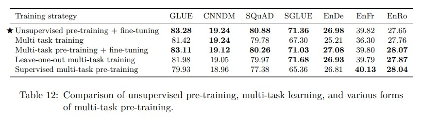

## 3.6 扩展
&nbsp;&nbsp;&nbsp;&nbsp;&nbsp;&nbsp;&nbsp;&nbsp;机器学习研究中的“苦涩教训”认为，能够利用额外计算的通用方法最终胜过依赖人类专业知识的方法（Sutton，2019；Hestness等，2017；Shazeer等，2017；Jozefowicz等，2016；Mahajan等，2018；Shazeer等，2018, 2017；Huang等，2018b；Keskar等，2019a）。最近的结果表明，这个观点在自然语言处理中的迁移学习中也成立（Liu等，2019c；Radford等，2019；Yang等，2019；Lan等，2019），即多次实验证明，与更加精心设计的方法相比，扩展模型可以获得更好的性能。然而，有多种可能的扩展方式，包括使用更大的模型，训练更多的步骤和集成方法。在本节中，我们通过回答以下前提来比较这些不同的方法：“你刚刚获得了4倍的计算资源，你应该如何使用它？”  

&nbsp;&nbsp;&nbsp;&nbsp;&nbsp;&nbsp;&nbsp;&nbsp;我们从基准模型开始，该模型具有2.2亿个参数，并分别进行了 $2^{19}$ 和 $2^{18}$ 步的预训练和微调。编码器和解码器的大小与“BERTBASE”类似。为了尝试增加模型大小，我们遵循“BERTLARGE”Devlin等人（2018）的指南，使用 $d_{ff} = 4096, d_{model} = 1024, d_{kv} = 64$ 和16头的注意力机制。然后，我们生成了两个变体，分别在编码器和解码器中具有16层和32层，产生的模型比我们原始模型的参数多2倍和4倍。这两个变体的计算成本也分别大约是原始模型的2倍和4倍。使用我们的基准模型和这两个更大的模型，我们考虑了以下四倍计算资源的三种使用方式：训练多4倍的步骤，使用两倍大的模型进行两倍的步骤训练，以及使用四倍大的模型进行“基准”步骤数的训练。为了简化起见，当我们增加训练步骤时，同时扩展预训练步骤和微调步骤。需要注意的是，在增加预训练步骤的数量时，由于C4数据集非常庞大，即使训练 $2^{23}$ 步，我们也无法完成对数据的一次遍历，因此实际上相当于包含了更多的预训练数据。 

&nbsp;&nbsp;&nbsp;&nbsp;&nbsp;&nbsp;&nbsp;&nbsp;模型看到4倍数据的另一种替代方式是将批量大小增加4倍。这可能会导致更快的训练速度，因为并行化效率更高。然而，使用4倍较大的批量大小进行训练可能会产生与训练4倍步骤不同的结果（Shallue等，2018）。为了比较这两种情况，我们进行了一个额外的实验，使用4倍较大的批量大小训练我们的基准模型。 

&nbsp;&nbsp;&nbsp;&nbsp;&nbsp;&nbsp;&nbsp;&nbsp;在我们考虑的许多基准测试中，通过使用多个模型进行训练和评估来获得额外的性能是常见的做法。这提供了一种使用额外计算的独立方式。为了将其他扩展方法与集成方法进行比较，我们还测量了4个单独预训练和微调模型的集成性能。在将其输入到输出softmax非线性函数之前，我们对集成模型的logits进行平均，以获得聚合预测结果。与预训练4个单独模型不同，一种更廉价的替代方法是使用单个预训练模型生成4个单独的微调版本。尽管这并没有使用完整的4倍计算预算，但我们也将这种方法包括在内，以查看它是否能够产生与其他扩展方法相竞争的性能。 

&nbsp;&nbsp;&nbsp;&nbsp;&nbsp;&nbsp;&nbsp;&nbsp;应用这些不同的扩展方法后所达到的性能如表13所示。毫不意外地，增加训练时间和/或模型大小始终改善了基准性能。在训练4倍步骤和使用4倍较大的批量大小之间没有明显的优劣之分，两者都是有益的。总体而言，与仅增加训练时间或批量大小相比，增加模型大小进一步提升了性能。在我们研究的任何任务中，我们没有观察到训练一个2倍大的模型时间加倍和训练一个4倍大的模型之间有很大的差异。这表明增加训练时间和增加模型大小可以是改善性能的互补手段。我们的结果还表明，通过集成提供了一种正交且有效的扩展手段来提高性能。在一些任务（CNN/DM，WMT英德翻译和WMT英罗翻译）中，对4个完全独立训练的模型进行集成明显优于其他扩展方法。对于一起预训练但分别微调的模型进行集成也显著提高了基准性能，这表明了一种更廉价的性能改进手段。唯一的例外是SuperGLUE任务，在该任务中，无论是哪种集成方法都没有明显超过基准性能。 

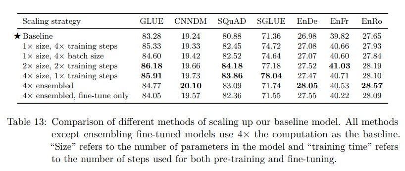

&nbsp;&nbsp;&nbsp;&nbsp;&nbsp;&nbsp;&nbsp;&nbsp;我们注意到，不同的扩展方法除了性能之外还有不同的权衡考虑。例如，使用更大的模型可能会使下游的微调和推理更加昂贵。相反，如果将更长时间的预训练应用于许多下游任务，那么预训练一个较小的模型的成本将有效地分摊。另外，我们注意到，将N个单独模型进行集成的成本与使用计算成本高N倍的模型类似。因此，在选择扩展方法时，对模型最终使用的考虑是很重要的。 

## 3.7 综合考虑
&nbsp;&nbsp;&nbsp;&nbsp;&nbsp;&nbsp;&nbsp;&nbsp;我们现在利用我们系统性研究的见解，确定我们在流行的NLP基准测试中能够推进性能的程度。我们还对通过在大量数据上训练更大的模型来探索NLP转移学习的当前限制感兴趣。我们从我们的基准训练方法开始，并进行以下更改： 

**目标：** 我们在基准模型中将独立同分布的去噪目标替换为第3.3.4节中描述的跨度破坏目标，该目标受到了SpanBERT (Joshi等，2019)的启发。具体而言，我们使用平均跨度长度为3，并破坏原始序列的15%。我们发现，这个目标产生了略微更好的性能（表7），同时由于目标序列长度较短，计算效率稍高。 

**更长的训练：** 我们的基准模型使用了相对较少的预训练数据（相当于BERT (Devlin等，2018)的1/4，XLNet (Yang等，2019)的1/16，RoBERTa (Liu等，2019c)的1/64等）。幸运的是，C4数据集足够大，我们可以进行更长时间的训练，而不会重复数据（如第3.4.2节所示，这可能会有害）。我们在第3.6节中发现，额外的预训练确实是有帮助的，并且增加批量大小和增加训练步骤都可以带来这种好处。因此，我们在批量大小为2的情况下进行100万步的预训练，每个步骤使用512长度的序列，总共约有1万亿个预训练标记（比我们的基准多32倍）。在第3.4.1节中，我们展示了在一些下游任务中，对RealNews-like、WebText-like和Wikipedia + TBC数据集进行预训练优于在C4上进行预训练。然而，这些数据集变体的规模相对较小，在进行1万亿个标记的预训练过程中将会重复数百次。由于我们在第3.4.2节中表明这种重复可能会有害，我们选择继续使用C4数据集。 

**模型大小：** 在第3.6节中，我们还展示了如何通过增加基准模型的大小来提高性能。然而，在计算资源有限的情况下，使用较小的模型可以在微调或推理环境中很有帮助。基于这些因素，我们训练了各种大小的模型： 
&nbsp;&nbsp;&nbsp;&nbsp;&nbsp;&nbsp;&nbsp;&nbsp;**基准模型（Base）：** 这是我们的基准模型，其超参数在第3.1.1节中描述。它大约有2.2亿个参数。 
&nbsp;&nbsp;&nbsp;&nbsp;&nbsp;&nbsp;&nbsp;&nbsp;**较小模型（Small）：** 我们考虑了一个较小的模型，通过将基准模型缩小，使用dmodel = 512，dff = 2,048，8个头的注意力机制，并且编码器和解码器中每个仅有6层。这个变体大约有6000万个参数。 
&nbsp;&nbsp;&nbsp;&nbsp;&nbsp;&nbsp;&nbsp;&nbsp;**较大模型（Large）：** 由于我们的基准模型使用了与BERTLARGE大小的编码器和解码器，我们还考虑了一个变体，其中编码器和解码器在大小和结构上都类似于BERTLARGE。具体而言，这个变体使用dmodel = 1,024，dff = 4,096，dkv = 64，16个头的注意力机制，并且编码器和解码器各有24层，总共约有7.7亿个参数。 
&nbsp;&nbsp;&nbsp;&nbsp;&nbsp;&nbsp;&nbsp;&nbsp;**3B和11B：** 为了进一步探索使用更大模型时可能达到的性能水平，我们考虑了另外两个变体。在两种情况下，我们使用dmodel = 1024，24层的编码器和解码器，以及dkv = 128。对于“3B”变体，我们使用dff = 16,384和32个头的注意力机制，大约有28亿个参数；对于“11B”，我们使用dff = 65,536和128个头的注意力机制，生成了大约110亿个参数的模型。我们选择增加dff的大小，特别是因为现代加速器（例如我们训练模型所使用的TPU）对Transformer的前馈网络中的大规模稠密矩阵乘法最有效。 

**多任务预训练：** 在第3.5.3节中，我们展示了在微调之前，在无监督和有监督任务的多任务混合中进行预训练的效果与仅在无监督任务上进行预训练的效果相当。这是“MT-DNN”（Liu等，2015，2019b）提倡的方法。它还具有实际的好处，可以在整个训练过程中监控“下游”性能，而不仅仅是在微调期间。因此，在我们的最终实验中，我们使用了多任务预训练。我们假设，经过更长时间训练的较大模型可能会受益于更大比例的无标签数据，因为它们更有可能过拟合于较小的训练数据集。然而，我们也注意到，第3.5.3节的结果表明，在多任务预训练之后进行微调可以减轻由选择次优无标签数据比例引起的一些问题。基于这些想法，我们在使用标准的示例比例混合（在第3.5.2节中描述）之前，用以下人工数据集大小替换了我们的无标签数据：Small为710,000个，Base为2,620,000个，Large为8,660,000个，3B为33,500,000个，11B为133,000,000个。对于所有模型变体，在预训练期间，我们还将WMT英法和WMT英德数据集的有效数据集大小限制为1M个示例。 

**针对GLUE和SuperGLUE的微调：** 到目前为止，在GLUE和SuperGLUE上进行微调时，我们已经将每个基准中的所有数据集连接起来，这样我们只需对GLUE进行一次微调，对SuperGLUE进行一次微调。这种方法使我们的研究在逻辑上更简单，但我们发现与单独对每个任务进行微调相比，在某些任务上会损失一小部分性能。在单独对任务进行微调时可能会出现的一个潜在问题（否则可以通过同时在所有任务上进行训练来缓解）是我们可能会迅速过拟合到低资源任务上。例如，我们大型批量大小的 $2^{11}$ 个长度为512的序列将导致许多低资源GLUE和SuperGLUE任务的每个批次中整个数据集多次出现。因此，在每个GLUE和SuperGLUE任务的微调期间，我们使用较小的批量大小为8个长度为512的序列。我们还将检查点保存间隔从每5,000个步骤更改为每1,000个步骤，以确保我们在过拟合之前可以访问模型的参数。 

**束搜索（Beam search）：** 我们之前的所有结果都是使用贪婪解码进行报告的。对于输出序列较长的任务，我们发现使用束搜索（Sutskever等，2014）可以提高性能。具体而言，我们在WMT翻译和CNN/DM摘要任务中使用4个束宽和长度惩罚参数α = 0.6（Wu等，2016）。 

**测试集：** 由于这是我们的最终实验，我们报告的结果是在测试集上而不是验证集上得到的。对于CNN/Daily Mail任务，我们使用数据集中分发的标准测试集。对于WMT任务，这对应于使用newstest2014进行英德翻译，newstest2015进行英法翻译，以及newstest2016进行英罗马尼亚翻译。对于GLUE和SuperGLUE，我们使用基准评估服务器来计算官方的测试集分数。对于SQuAD，评估测试集需要在基准服务器上运行推断。不幸的是，该服务器的计算资源不足以获得我们最大模型的预测结果。因此，我们仍然报告SQuAD验证集上的性能。幸运的是，在SQuAD测试集上表现最好的模型也在验证集上报告了结果，因此我们仍然可以与表面上的最先进模型进行比较。 

&nbsp;&nbsp;&nbsp;&nbsp;&nbsp;&nbsp;&nbsp;&nbsp;除了上述提到的更改外，我们在基准线（AdaFactor优化器、预训练的反平方根学习率调度、微调的恒定学习率、Dropout正则化、词汇表等）中使用相同的训练过程和超参数。这些细节在第2节中有描述。 

&nbsp;&nbsp;&nbsp;&nbsp;&nbsp;&nbsp;&nbsp;&nbsp;这组最终实验的结果如表14所示。总体而言，在我们考虑的24个任务中，我们在18个任务中取得了最先进的性能。如预期，我们最大的（110亿参数）模型在所有任务中的模型大小变体中表现最佳。我们的T5-3B模型变体在一些任务中确实超过了先前的最先进模型，但将模型大小扩展到110亿参数对于实现最佳性能是最重要的因素。我们现在分析每个单独基准的结果。 

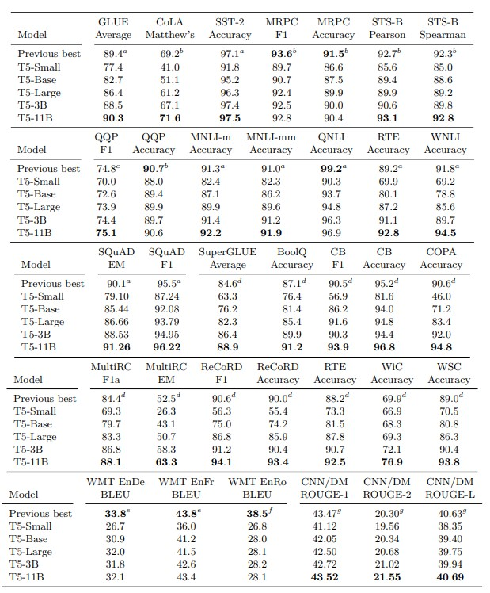

&nbsp;&nbsp;&nbsp;&nbsp;&nbsp;&nbsp;&nbsp;&nbsp;我们在GLUE平均分上取得了90.3的最先进成绩。值得注意的是，我们的性能在自然语言推理任务MNLI、RTE和WNLI方面显著优于先前的最先进成绩。RTE和WNLI是历史上机器性能落后于人类性能的任务之一，人类性能分别为93.6和95.9（Wang等，2018）。就参数数量而言，我们的11B模型变体是提交给GLUE基准的最大模型。然而，大多数得分最高的提交在产生预测时使用了大量的集成和计算。例如，ALBERT（Lan等，2019）的最佳变体使用了与我们的3B变体大小和架构类似的模型（虽然由于巧妙的参数共享而参数数量大大减少）。为了在GLUE上取得卓越的性能，ALBERT的作者使用了“从6到17”个模型进行集成，具体取决于任务。这可能导致使用ALBERT集成产生预测的计算成本比使用T5-11B更高。 

&nbsp;&nbsp;&nbsp;&nbsp;&nbsp;&nbsp;&nbsp;&nbsp;对于SQuAD，我们在精确匹配得分上超过了先前的最先进成绩（ALBERT（Lan等，2019））超过一个百分点。SQuAD是一个长期存在的基准，在三年前创建，最近的改进只能将最先进成绩提高了几个百分点。我们注意到，当在测试集上报告结果时，通常基于模型的集成和/或利用外部数据集（例如TriviaQA（Joshi等，2017）或NewsQA（Trischler等，2016））来增加SQuAD训练集的规模。SQuAD上的人类表现被估计为精确匹配和F1指标分别为82.30和91.22（Rajpurkar等，2016），因此不清楚进一步改进该基准是否具有意义。 

&nbsp;&nbsp;&nbsp;&nbsp;&nbsp;&nbsp;&nbsp;&nbsp;对于SuperGLUE，我们大幅度提高了最先进成绩（从平均得分84.6（Liu等，2019c）提高到88.9）。SuperGLUE的设计目的是包含那些“超出当前最先进系统范围，但大多数受过大学教育的英语使用者可以解决的任务”（Wang等，2019b）。我们的成绩几乎与人类表现相匹配，人类表现为89.8（Wang等，2019b）。有趣的是，在阅读理解任务（MultiRC和ReCoRD）中，我们的成绩远远超过人类表现，这表明用于这些任务的评估指标可能对机器生成的预测存在偏差。另一方面，人类在COPA和WSC上的准确率达到100%，远远优于我们模型的性能。这表明对于我们的模型来说，仍然存在难以完全掌握的语言任务，尤其是在资源匮乏的环境中。 

&nbsp;&nbsp;&nbsp;&nbsp;&nbsp;&nbsp;&nbsp;&nbsp;我们在任何WMT翻译任务中都没有达到最先进的性能。这部分原因可能是我们使用了仅限英语的无标签数据集。我们还注意到，这些任务中大多数最佳结果使用了反向翻译（Edunov等，2018；Lample和Conneau，2019），这是一种复杂的数据增强方案。在资源匮乏的英罗马尼亚翻译基准上，最先进的方法还使用了其他形式的跨语言无监督训练（Lample和Conneau，2019）。我们的结果表明，规模和英语预训练可能不足以匹配这些更复杂方法的性能。更具体地说，英德newstest2014数据集上的最佳结果使用了来自WMT 2018的更大训练集（Edunov等，2018），这使得与我们的结果进行直接比较变得困难。 

&nbsp;&nbsp;&nbsp;&nbsp;&nbsp;&nbsp;&nbsp;&nbsp;最后，在CNN/Daily Mail数据集上，我们达到了最先进的性能，尽管仅在ROUGE-2-F分数上有明显提高。已经证明，改进ROUGE分数不一定对应更连贯的摘要（Paulus等，2017）。此外，虽然CNN/Daily Mail被视为一个抽象摘要化基准，但纯粹的抽取式方法也表现出良好的效果（Liu，2019）。有人认为，使用最大似然训练的生成模型容易产生重复的摘要（See等，2017）。尽管存在这些潜在问题，我们发现我们的模型生成的摘要连贯且大部分正确。我们在附录C中提供了一些没有选择性挑选的验证集示例。 

&nbsp;&nbsp;&nbsp;&nbsp;&nbsp;&nbsp;&nbsp;&nbsp;为了取得强大的结果，T5结合了我们实验研究的见解和前所未有的规模。请注意，在第3.6节中，我们发现增加基准模型的预训练量或大小可以获得显著的收益。鉴于此，我们有兴趣衡量我们引入T5时所做的“非扩展”更改对其强大性能的贡献。因此，我们进行了最后一次实验，比较了以下三种配置：首先，标准基准模型，它在大约235≈340亿标记上进行了预训练；其次，基准模型改为大约1万亿标记的预训练（即T5使用的相同预训练量），我们将其称为“baseline-1T”；第三，T5-Base。请注意，baseline-1T和T5-Base之间的差异包括我们设计T5时所做的“非扩展”更改。因此，比较这两个模型的性能可以明确衡量我们系统研究的见解的影响。 

&nbsp;&nbsp;&nbsp;&nbsp;&nbsp;&nbsp;&nbsp;&nbsp;这三种模型配置的性能显示在表15中。与第3.6节的发现一致，我们发现额外的预训练可以提高基准模型的性能。尽管如此，T5-Base在所有下游任务中明显优于baseline-1T。这表明规模并不是T5成功的唯一因素。我们假设更大的模型不仅受益于它们的增加尺寸，还受益于这些非扩展因素。 

# 4. 反思
&nbsp;&nbsp;&nbsp;&nbsp;&nbsp;&nbsp;&nbsp;&nbsp;完成我们的系统研究后，我们首先回顾一些最重要的发现。我们的结果为我们提供了一些高层次的视角，可以判断哪些研究方向可能更有前途。最后，我们概述了一些我们认为可能为该领域进一步发展提供有效方法的主题。 

## 4.1 主要发现
**文本到文本：** 我们的文本到文本框架提供了一种简单的方法，可以使用相同的损失函数和解码过程在各种文本任务上训练单个模型。我们展示了这种方法如何成功应用于生成任务，如抽象摘要，分类任务，如自然语言推理，甚至回归任务，如STS-B。尽管它很简单，但我们发现文本到文本框架在与规模相结合时获得了与任务特定架构相媲美的性能，并最终产生了最先进的结果。 

**架构：** 虽然一些自然语言处理的迁移学习研究考虑了Transformer的不同变体，但我们发现在我们的文本到文本框架中，原始的编码器-解码器形式效果最好。尽管编码器-解码器模型使用的参数是“仅编码器”（例如BERT）或“仅解码器”（语言模型）架构的两倍，但其计算成本相似。我们还展示了在编码器和解码器中共享参数不会导致性能显著下降，同时将总参数数量减半。 

**无监督目标：** 总体而言，在文本到文本的设置中，我们发现大多数“去噪”目标（训练模型以重建随机损坏的文本）的表现相似。因此，我们建议使用产生短目标序列的目标，以使无监督预训练更具计算效率。 

**数据集：** 我们引入了“巨大干净爬取语料库”（C4），其中包含从Common Crawl网页转储中经过启发式清洗的文本。当将C4与使用额外过滤的数据集进行比较时，我们发现在一些下游任务中，使用领域内无标签数据进行训练可以提升性能。然而，限制为单个领域通常会导致较小的数据集。我们还单独展示了当无标签数据集足够小，以至于在预训练过程中重复多次时，性能可能会下降。这促使我们在通用语言理解任务中使用像C4这样大而多样的数据集。 

**训练策略：** 我们发现，在微调期间更新预训练模型的所有参数的基本方法优于仅更新少量参数的方法，尽管更新所有参数是最昂贵的。我们还尝试了在多个任务上同时训练模型的各种方法，在我们的文本到文本设置中，这仅仅意味着在构建批次时混合来自不同数据集的示例。多任务学习中的主要问题是设置每个任务的训练比例。最终，我们没有找到一种设置混合比例的策略，其性能与无监督预训练后进行监督微调的基本方法相匹配。然而，我们发现在多个任务的混合预训练后进行微调可以产生与无监督预训练相媲美的性能。 

**扩展：** 我们比较了利用额外计算资源的各种策略，包括训练更多数据的模型、训练更大的模型以及使用模型集合。我们发现每种方法都显著提升了性能，尽管在训练更多数据的较小模型通常被训练步骤较少的更大模型超越。我们还展示了模型集合可以比单个模型提供更好的结果，这提供了一种利用额外计算的独立手段。尽管从相同基础预训练模型微调的模型集合表现较差，但仅微调的模型集合仍然显著优于单个模型。 

**突破极限：** 我们结合以上见解，训练了规模更大的模型（高达110亿个参数），在我们考虑的许多基准测试中实现了最先进的结果。对于无监督训练，我们从C4数据集中提取文本，并应用了一种破坏连续标记序列的去噪目标。我们在多任务混合上进行了预训练，然后在各个任务上进行了微调。总体而言，我们的模型训练了超过1万亿个标记。为了促进我们结果的复制、扩展和应用，我们将我们的代码、C4数据集以及每个T5变体的预训练模型权重发布出来。 

## 4.2 展望
**大型模型的不便之处：** 我们研究中一个不足为奇但重要的结果是，较大的模型往往表现更好。运行这些模型的硬件不断变得更便宜和更强大，这表明扩大规模可能会继续成为实现更好性能的有前途的途径（Sutton，2019）。然而，总会存在一些应用和场景，使用较小或更便宜的模型是有帮助的，例如在进行客户端推理或联合学习时（Konečn`y等，2015年，2016年）。相关地，迁移学习的一个有益应用是在低资源任务上实现良好性能的可能性。低资源任务通常发生在（根据定义）缺乏标记更多数据的资源的环境中。由此可见，低资源应用通常也对计算资源的访问有限，这可能会产生额外的成本。因此，我们主张研究能够用更便宜的模型实现更强性能的方法，以便将迁移学习应用于具有最大影响的领域。目前在这方面进行的一些工作包括蒸馏（Hinton等，2015年；Sanh等，2019年；Jiao等，2019年）、参数共享（Lan等，2019年）和条件计算（Shazeer等，2017年）。 

**更高效的知识提取：** 回顾一下，预训练的目标之一（宽泛地说）是为模型提供通用的“知识”，以提高其在下游任务上的性能。我们在这项工作中使用的方法，目前是常见的做法，是训练模型以去噪受损的文本片段。我们怀疑这种简单的技术可能不是一种非常高效的教授模型通用知识的方式。更具体地说，如果我们不需要先在1万亿个标记的文本上训练我们的模型，而能够获得良好的微调性能，那将是非常有用的。在这方面，一些同时进行的工作通过预训练模型来区分真实文本和机器生成的文本，提高了效率（Clark等，2020年）。 

**形式化任务之间的相似性：** 我们观察到，在领域内无标签数据上进行预训练可以提高下游任务的性能（第3.4节）。这一发现主要依赖于基本观察，比如SQuAD是使用维基百科的数据创建的。因此，有必要更严格地定义预训练任务和下游任务之间的“相似性”，以便我们能够更有原则地选择使用哪种无标签数据源。在计算机视觉领域已经进行了一些早期的实证工作，以此为基础（Huh等，2016年；Kornblith等，2018年；He等，2018年）。更好地定义任务的相关性也有助于选择有监督的预训练任务，这已经被证明对GLUE基准测试很有帮助（Phang等，2018年）。 

**与语言无关的模型：** 我们对发现仅限于英语的预训练并没有在我们研究的翻译任务上取得最先进的结果感到失望。我们还对避免需要事先指定词汇表可以编码的语言的后勤困难很感兴趣。为了解决这些问题，我们有兴趣进一步研究与语言无关的模型，即能够以良好的性能执行给定的自然语言处理任务，无论文本的语言如何。这一问题尤为重要，因为英语并非世界大多数人的母语。 

&nbsp;&nbsp;&nbsp;&nbsp;&nbsp;&nbsp;&nbsp;&nbsp;本文的动机是近期关于自然语言处理的迁移学习的激增研究。在我们开始这项工作之前，这些进展已经在尚未证明基于学习的方法有效的领域取得了突破。我们很高兴能够延续这一趋势，例如在SuperGLUE基准测试中几乎达到人类水平的性能，这是一个专门设计为现代迁移学习管道具有挑战性的任务。我们的结果源于一个直观而统一的文本到文本框架，我们的新C4数据集以及我们系统研究的见解。此外，我们还提供了该领域的实证概述和现状展望。我们对看到继续使用迁移学习来实现通用语言理解目标的工作感到兴奋。 

