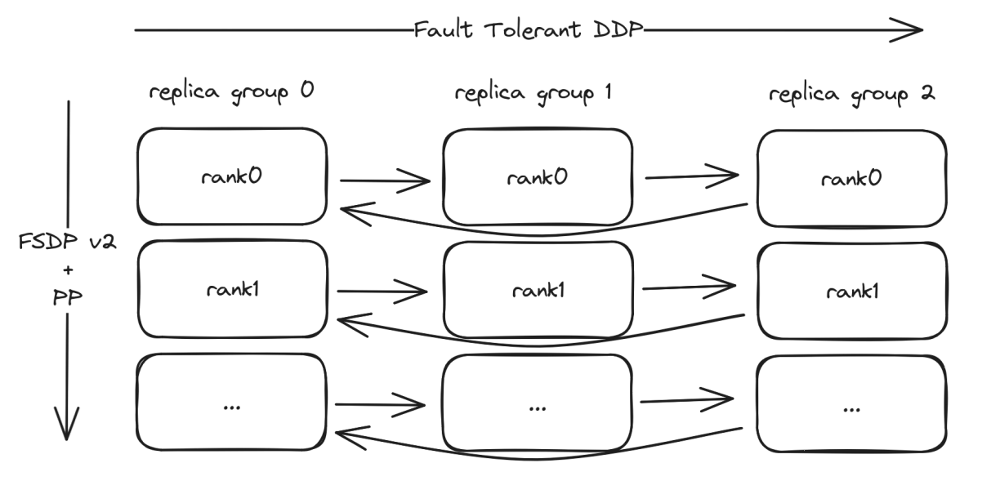
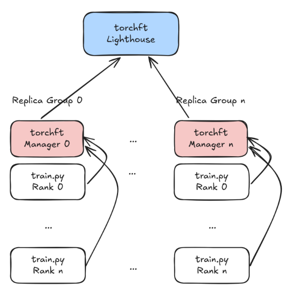
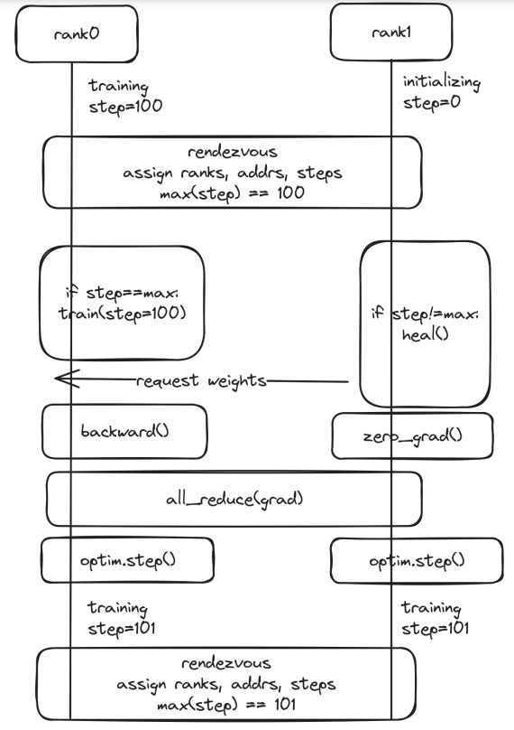
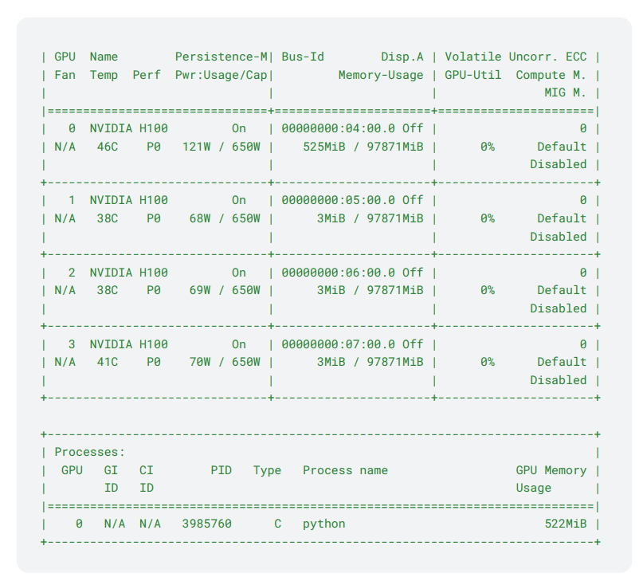
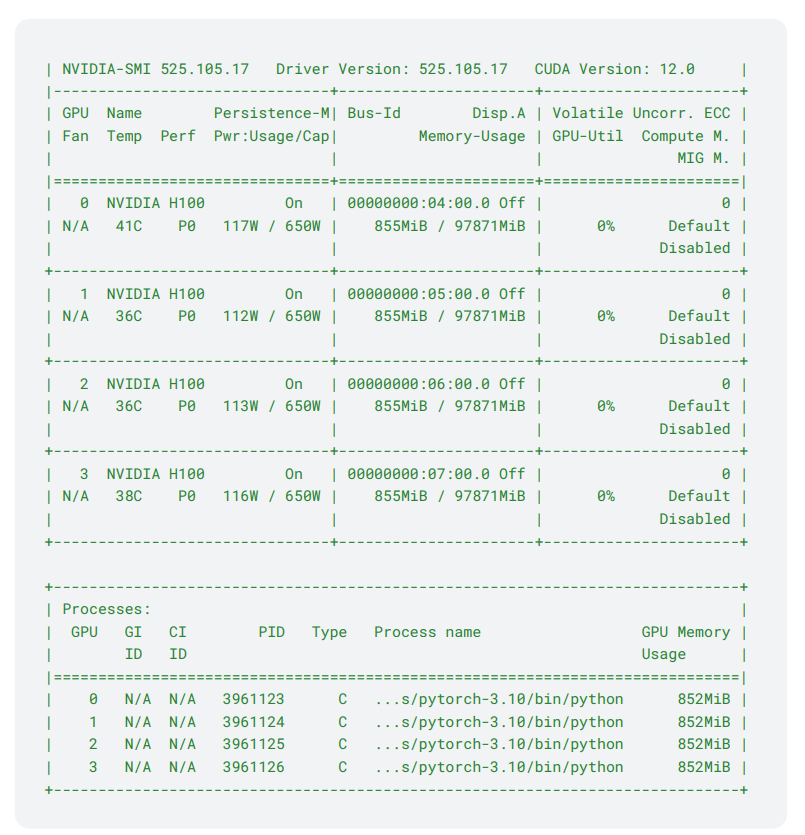
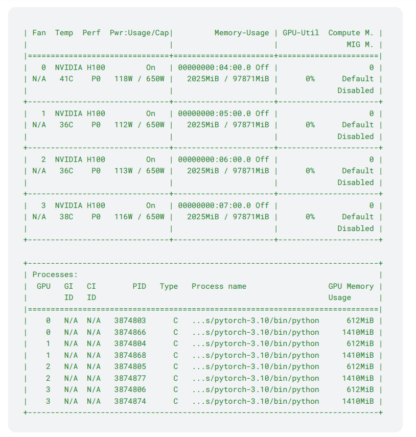

# torchft – Fault Tolerance DDP/HSDP in OSS

# 1 背景
&nbsp;&nbsp;&nbsp;&nbsp;&nbsp;&nbsp;&nbsp;&nbsp;这是torchft的设计文档，torchft是PyTorch开源社区（OSS）中实现的一种每步容错（**per step** fault tolerance）机制，其设计重点在于灵活性和与现有模型及库的兼容性。在最近的2024年PyTorch大会上，我们的实验性容错**高可扩展性分布式处理**（HSDP，Highly Scalable Distributed Processing）项目引起了广泛关注。许多不同公司都表示对使用类似机制非常感兴趣，因此，这是一份全新的、仅针对开源社区的设计和实现方案。<br>



&nbsp;&nbsp;&nbsp;&nbsp;&nbsp;&nbsp;&nbsp;&nbsp;我们希望同时支持通用的分布式数据并行（DDP）以及**高性能可扩展分布式参数服务器**（HSDP），因此我们的初步目标是支持多达约1000个副本组。<br>

# 2 OverView
&nbsp;&nbsp;&nbsp;&nbsp;&nbsp;&nbsp;&nbsp;&nbsp;为了确定法定人数(quorum)，我们使用一个单独的节点“lighthouse”来协调各个副本组(replica)，并为每个组配备一个“manager”来管理工作节点。灯塔节点(lighthouse node)将采用一种非常简单的法定人数(quorum)算法，因为它不需要被复制。管理器(manager)将在其所属的副本组内做出所有决策，并将这些决策广播给所有工作节点，同时还负责进行**节点IP的发现**。<br>



# 3 术语(Terminology)
- 灯塔（Lighthouse）– 一种服务，用于跟踪活动的副本组replica groups（此术语借自[Nebula的Lighthouse](https://nebula.defined.net/docs/guides/quick-start/#lighthouse)），并为每个step确定法定人数(quorum)。使副本组能够**相互找到对方**（因此得名灯塔）。<br>
- 管理器（Manager）– 每个副本组运行一个此服务，用于管理副本组中的所有工作节点，并与灯塔(lighthouse)通信以决定该组(grpoup)是否为法定人数(quorum)的一部分。<br>
- 副本组(Replica Group)– a group of worker nodes that make up one slice of the job。训练在replica之间是数据并行的。每个秩（rank）n都拥有模型的相同分片，并在副本组之间进行复制。<br>
- torchelastic agent代理 : 在每个worker host运行的agent，负责启动副本组中的工作进程，并在发生error时重启它们。<br>

$ 4 Service APIs 服务端api
&nbsp;&nbsp;&nbsp;&nbsp;&nbsp;&nbsp;&nbsp;&nbsp;以下是每个服务的RPC（远程过程调用）定义。<br>

*(RPC，全称Remote Procedure Call，即远程过程调用，是一种计算机通信协议。它允许一个计算机程序通过网络调用另一个计算机程序中的子程序（也就是远程过程），并获取返回值。RPC是分布式计算的重要基础，使得分布式计算应用更加方便和高效。)* <br>

## 4.1 Lighthouse
```c++
message QuorumMember {
  string replica_id = 1;
  string address = 2;
  string store_address = 3;
  int64 step = 4;
  uint64 world_size = 5;
}
message Quorum {
  int64 quorum_id = 1;
  repeated QuorumMember participants = 2;
  google.protobuf.Timestamp created = 3;
}
message LighthouseQuorumRequest {
  QuorumMember requester = 1;
}
message LighthouseQuorumResponse {
  Quorum quorum = 1;
}
message LighthouseHeartbeatRequest {
  string replica_id = 1;
}
message LighthouseHeartbeatResponse {}
service LighthouseService {
  rpc Quorum (LighthouseQuorumRequest) returns (LighthouseQuorumResponse);
  rpc Heartbeat (LighthouseHeartbeatRequest) returns
(LighthouseHeartbeatResponse);
}
```

## 4.2 Agent
```c++
message ManagerQuorumRequest {
 int64 rank = 1;
 int64 step = 2;
 string checkpoint_server_addr = 3;
}
message ManagerQuorumResponse {
 int64 quorum_id = 1;
 string address = 2;
 string store_address = 3;
 // These are information for the replicas which are at the max step.
 int64 max_step = 4;
 optional int64 max_rank = 5;
 int64 max_world_size = 6;
 // These are information for all replicas including behind replicas.
 int64 replica_rank = 7;
 int64 replica_world_size = 8;
 bool heal = 9;
}
message CheckpointAddressRequest {
 int64 rank = 1;
}
message CheckpointAddressResponse {
 string checkpoint_server_address = 1;
}
message ShouldCommitRequest {
 bool should_commit = 1;
 int64 rank = 2;
 int64 step = 3;
}
message ShouldCommitResponse {
 bool should_commit = 1;
}
message KillRequest {
 string msg = 1;
}
message KillResponse {}

service ManagerService {
 rpc Quorum (ManagerQuorumRequest) returns (ManagerQuorumResponse);
 rpc CheckpointAddress(CheckpointAddressRequest) returns
(CheckpointAddressResponse);
 rpc ShouldCommit(ShouldCommitRequest) returns (ShouldCommitResponse);
 rpc Kill(KillRequest) returns (KillResponse);
}
```

# 5 User Facing API (用户侧API)
&nbsp;&nbsp;&nbsp;&nbsp;&nbsp;&nbsp;&nbsp;&nbsp;大部分所需的复杂性都可以隐藏在一个类似于现有优化器step模式的API之后，而无需对用户模型进行任何更改。<br>

## 5.1 Manager
&nbsp;&nbsp;&nbsp;&nbsp;&nbsp;&nbsp;&nbsp;&nbsp;manager class实现了PAFT算法的**核心逻辑**，负责与manager server管理服务器（从而与lighthouse/quorum）进行通信，管理进程组(processgroup)，并处理checkpoint/recovery操作。<br>

- [manager code](https://github.com/pytorch-labs/torchft/blob/main/torchft/manager.py)

&nbsp;&nbsp;&nbsp;&nbsp;&nbsp;&nbsp;&nbsp;&nbsp;这里有几个关键方法：<br>
1. step
   - 获取新的仲裁节点(quorum)，并根据需要保存/加载检查点。
3. allreduce
   - called to **reduce the gradients** across nodes. (跨节点进行 reduce)
5. should_commit
   - 调用此函数以确定是否发生任何错误以及优化器是否需要step。
  
```python
class FaultToleranceManager:
 """
 This manages all fault tolerance within the worker.
 """
 def __init__(self, save_state_dict: Callable[[], Dict], load_state_dict:
Callable[[Dict], None]) -> None:
   """
   Args:
   save_state_dict: callback to run to save the current node
  state_dict
   load_state_dict: callback to run to load a remote state_dict
   """
   self.lighthouse_address = os.environ["TORCH_LIGHTHOUSE"]
   self.save_state_dict = save_state_dict
   self.load_state_dict = load_state_dict
   if rank == 0:
   # run the manager on rank0 node, address can be shared via tcpstore
   # for bootstrapping within the group
   self.manager = new_manager(...)
   self.client = new_client(...)
   self.checkpoint_server = new_server(self.save_state_dict)

 def step(self, step: int) -> None:
   """
   This must be called at the start of each step with the step
   matching the currently loaded checkpoint.
   This will get the new quorum and load/save any checkpoints as necessary
   to maintain quorum.
   This will run the quroum and checkpoint load asynchronously.
   """
   quorum = self.client.quorum(...)
   max_step = max(g.step for g in quorum.members)
   if step != max_step:
   self.load_state_dict(...)
   if changed(quorum):
   # restart the process group
   self.pg.kill()
   self.pg.start()

  def allreduce(self, gradients: torch.Tensor) -> None:
     """
     This will block until the quorum is available and then do the all
     reduce.
     The reduced tensors will be scaled by the number of active
     participants.
     """
    ...
  def should_commit(self) -> bool:
     """
     Whether the allreduces were completed safely and we should step the
     optimizer.
     """
     ...
```

## 5.2 Wrapping the Optimizer + DistributedDataParallel
&nbsp;&nbsp;&nbsp;&nbsp;&nbsp;&nbsp;&nbsp;&nbsp;由于我们的钩子与优化器和DistributedDataParallel辅助工具中的现有步骤相当吻合，我们可以只用轻量级的包装器来包装现有概念，必要时调用torchft钩子。<br>

- [optimizer wrapper](https://github.com/pytorch-labs/torchft/blob/main/torchft/optim.py)

```python
class OptimizerWrapper(Optimizer):
"""
    This wraps any provided optimizer and in conjunction with the manager will
  provide fault tolerance.
    zero_grad() must be called at the start of the forwards pass and step()
  must be called at the end of the backwards pass.
   Depending on the state of the manager, the optimizer will either commit the
   gradients to the wrapped optimizer or ignore them.
 """
 def __init__(self, manager: "Manager", optim: Optimizer) -> None:
   self.optim = optim
   self.manager = manager
 def zero_grad(self, set_to_none: bool = True) -> None:
   self.manager.step()
   self.optim.zero_grad(set_to_none)
 def step(self, closure: Optional[object] = None) -> None:
   assert closure is None, "optimizers that use closures are not
  supported"
   if self.manager.should_commit():
   self.optim.step()
 ...
```

- [DDP Wrapper](https://github.com/pytorch-labs/torchft/blob/main/torchft/ddp.py)

```python
class DistributedDataParallel(parallel.DistributedDataParallel):
  """
  This is a patched DistributedDataParallel implementation that makes it
  compatible with torchft.
  Important notes:
  * This requires states to be synced on step 0 using an external mechanism
  rather than an internal broadcast (torchft.Manager will do this).
   * Using non-basic features of the DDP may cause your model to catch fire as
   they haven't been tested with torchft.
   * This doesn't any sanity checks such as verifying parameter sizes are the
   same across workers.
  """

  def __init__(self, manager: "Manager", module: nn.Module, **kwargs: object)
-> None:
     # use a dummy PG to soak up the init all reduce, actual comms will go
     # through the comm_hook.
     pg = ProcessGroupDummy(0, 1)
     super().__init__(
     module,
     process_group=pg,
     # pyre-fixme[6]: got object
     **kwargs,
     )
     self.register_comm_hook(manager, self._comm_hook)

   @staticmethod
   def _comm_hook(
   state: "Manager", bucket: dist.GradBucket
   ) -> torch.futures.Future[torch.Tensor]:
   return state.allreduce_grad(bucket.buffer())
```

## 5.3 Wrapping ProcessGroups
&nbsp;&nbsp;&nbsp;&nbsp;&nbsp;&nbsp;&nbsp;&nbsp;对于其他库，我们可以使用一种**容错版本的ProcessGroup**。这种扩展的可重配置ProcessGroup会**吞掉(swallow)所有错误**，而不是将它们暴露给模型代码。这使我们能够以最小的更改干净地与FSDP等库集成。<br>

&nbsp;&nbsp;&nbsp;&nbsp;&nbsp;&nbsp;&nbsp;&nbsp;在最简单的情况下，通过吞掉(swallowing)所有错误并始终向模型代码报告成功，底层库无需进行任何代码更改，并且我们可以在训练循环结束时决定是否提交优化器的更改。<br>

**所需的库约定(contract)：**
- 当使用动态批量大小时，**库需要能够容忍ProcessGroup的全局大小变化**，并在通信钩子中检查PG.world_size并相应地进行缩放。<br>
- 库需要能够容忍ProcessGroup **在出错时返回的“默认/零”值张量**，因为此时真实值未知。<br>
- 库的通信模式必须完全确定且无状态。即，不在第一个批量时进行广播，并且在模型的每个step中进行相同的集体调用。<br>

- [Wrapping processGroups](https://github.com/pytorch-labs/torchft/blob/main/torchft/process_group.py#L443-L468
)

# 6 Example Train Loop
- [完整expample](https://github.com/pytorch-labs/torchft/blob/main/train_ddp.py)

```python
model = resnet18()

dataloader = ...

manager = FaultToleranceManager(model.state_dict, model.load_state_dict)

optimizer = OptimizerWrapper(manager, optim.SGD())

model = DistributedDataParallel(manager, model)

for inputs, labels in dataloader:
 # must be called at the beginning of each train loop
 # Quorum computation is triggered here but only needed in the backwards pass.
 optimizer.zero_grad()
 out = m(inputs)
 loss = criterion(out, labels)
 # Gradient allreduce overlaps with the backwards pass.
 loss.backward()
 # must be called at the end of the train loop
 # This may not actually step the optimizer if an error occured during grad allreduce.
 optimizer.step()
 if manager.current_step() >= 10000:
   # complete training
   break
```

# 7 Lighthouse – Quorum(法定人数) Algorithm
&nbsp;&nbsp;&nbsp;&nbsp;&nbsp;&nbsp;&nbsp;&nbsp;由于每个法定人数（quorum）都可以通过使用时间窗口来计算而无需了解过去的step，因此我们不需要任何重复的状态。这使得算法非常简单，并且只需稍作调整即可在没有成员变化的情况下进行优化。<br>

1. A manager requeset quorum : <br>
- a. 这将启动一个计时器，其持续时间取决于工作节点是否参与了前一个quorum，以便在启动期间允许**额外的时间**。
2. 如果计时器到期且有足够的节点加入： <br>
- a. 新的quorum将被广播
3. 如果计时器到期但没有足够的节点加入: <br>
- a. 我们将延长计时器
4.（快速路径）如果前一个quorum中的所有组都已加入 <br>
- a. 我们可以跳过计时器，直接广播新的quorum

&nbsp;&nbsp;&nbsp;&nbsp;&nbsp;&nbsp;&nbsp;&nbsp;这个算法应该很容易实现，并且由于Lighthouse是一个单一进程来做出所有quorum的决策，因此也易于调试和推理。<br>

&nbsp;&nbsp;&nbsp;&nbsp;&nbsp;&nbsp;&nbsp;&nbsp;如果由于任何原因**新的quorum不合适**，training step将会失败，manager将会请求一个新的quorum。这消除了quorum算法中的大部分复杂性，因为我们只关心最新的状态。<br>

&nbsp;&nbsp;&nbsp;&nbsp;&nbsp;&nbsp;&nbsp;&nbsp;这种算法应该比其他quorum算法具有更好的扩展性(scale)，因为它没有复制开销，并且单个节点在必要时应该能够处理数千个组(group)，以满足DDP应用的需求。<br>

# 8 Lighthouse – Fault Tolerance
&nbsp;&nbsp;&nbsp;&nbsp;&nbsp;&nbsp;&nbsp;&nbsp;我们假设单个节点故障的可能性太小，不值得担心。然而，如果这确实成了一个问题，我们可以采取一些简单的措施，比如准备一个按顺序尝试的lighthouse列表（假设一个节点对所有人来说要么处于运行状态，要么处于宕机状态），或者采取更复杂的措施，让lighthouse使用复制的Raft状态机。<br>

&nbsp;&nbsp;&nbsp;&nbsp;&nbsp;&nbsp;&nbsp;&nbsp;我们还预计，在开源软件（OSS）使用中，一个lighthouse可以管理多个jobs。<br>

# 9 Data Plane – Fault Tolerance: Baby NCCL
&nbsp;&nbsp;&nbsp;&nbsp;&nbsp;&nbsp;&nbsp;&nbsp;**NCCL在发生error以及调用NCCL comm abort时容易(prone)陷入死锁**。在开源版本中，其中一些问题已经得到了修复，但目前还不清楚修复到了什么程度，因为我还没有广泛使用过。此外，听说NVIDIA正在努力使NCCL更安全，但它还没有完全准备好。<br>

&nbsp;&nbsp;&nbsp;&nbsp;&nbsp;&nbsp;&nbsp;&nbsp;使用NCCL错误处理的一种替代方法是简单地**在子进程中运行它**。这个子进程可以**由父进程管理**，当发生错误或仲裁变化时，在所有节点上终止并重新创建该子进程。<br>

&nbsp;&nbsp;&nbsp;&nbsp;&nbsp;&nbsp;&nbsp;&nbsp;我已经编写了一个原型来测试这一行为: [地址](https://gist.github.com/d4l3k/63e9ba2204fb59b7347b662476557c5d)

**性能考虑：** <br>
- CUDA张量可以通过CUDA IPC在进程之间共享，因此性能影响应该很小;
- 每个进程需要自己的CUDA上下文，这会增加一些开销。根据简单测试，大约1GB;
- 原型(protoType)使用CPU同步，我们应该改为从一个进程传递一个CUDA Event到另一个进程来等待，这样可以**避免阻塞GPU**;
- torch的多进程处理**使用子进程的引用计数**——如果我们终止子进程，可能无法释放内存，从而导致内存泄漏。我们需要一个额外的机制来**强制torch在终止子进程时释放内存**.

# 10 ProcessGroup Bootstrap(引导)
&nbsp;&nbsp;&nbsp;&nbsp;&nbsp;&nbsp;&nbsp;&nbsp;进程组需要一个存储(store)来进行引导(Bootstrap)。我们希望尽可能并行化初始化过程，因此我们想使用多个TCP存储。为了分散存储的负载，我们可以根据rank信息确定性地选择一个存储。<br>

*(TCPStores可能指的是基于TCP协议实现的存储服务或存储系统，这些服务或系统通常用于在网络环境中存储和检索数据。在分布式系统和并行计算中，TCPStores可以作为一个关键组件，用于在不同的计算节点之间共享数据。)* <br>

&nbsp;&nbsp;&nbsp;&nbsp;&nbsp;&nbsp;&nbsp;&nbsp;我们有几个选项——最简单的是每个manager一个TCPStore，但如果性能成为瓶颈，我们可以改用每个进程（或rank）一个TCPStore。<br>

## 10.1 Per Manager TCPStore(每个管理器一个TCPStore)
&nbsp;&nbsp;&nbsp;&nbsp;&nbsp;&nbsp;&nbsp;&nbsp;运行每个manager一个TCPStore是理想的选择，因为它简化了部署模型，并且我们应该能够获得足够的性能。
&nbsp;&nbsp;&nbsp;&nbsp;&nbsp;&nbsp;&nbsp;&nbsp;以10个replica groups和8k的global size为例，每个存储只需要与8k个workers进程通信。TCPStore已经测试过可以达到约200k QPS（每秒查询数），因此，对于2*8k的操作，我们应该能够在一秒内完成初始化。<br>

## 10.2 Per Node TCPStore (less preferred 非首选)
&nbsp;&nbsp;&nbsp;&nbsp;&nbsp;&nbsp;&nbsp;&nbsp;这需要在每台机器/副本(replica)上运行一个存储(store)服务，这意味着每台主机上都需要额外部署一个服务。<br>

&nbsp;&nbsp;&nbsp;&nbsp;&nbsp;&nbsp;&nbsp;&nbsp;为了**解析IP地址**，我们需要联系指定的(specified)副本组中的rank0 torchft服务器。为了减轻负载，我们可以采用轮询方式选择活动的存储服务，以减少对每个副本组的查找请求数量。<br>

```python
# Algorithm for determining active TCPStore
replica_groups, quorum_id = get_quorum_for_step(step)
replica_groups = sorted(replica_groups)
# We want to round robin pick which replica group is the leader for every node
to minimize load on any rank0 replica group for IP address resolution.
store_replica_group = replica_group[rank % len(replica_groups)]
store_address = torchft.get_ip_address(store_replica_group, rank)
store = TCPStore(store_address, master=False)
store = PrefixStore(store, f"/{quorum_id}/{rank}") # stores are shared so
isolate via prefix
init_process_group(store)
```

## 10.3 Checkpoint Restore
&nbsp;&nbsp;&nbsp;&nbsp;&nbsp;&nbsp;&nbsp;&nbsp;在大多数情况下，我们会直接从另一个工作节点的状态进行恢复。这需要与该副本组的管理器进行通信，以获取**检查点服务器**的地址。这些请求也可以在各个manager之间进行负载均衡，以避免在地址交换过程中出现任何瓶颈。<br>

&nbsp;&nbsp;&nbsp;&nbsp;&nbsp;&nbsp;&nbsp;&nbsp;每个manager获取rank，作为quorum的一部分, 并将其缓存。 这样如果未来的副本replica需要该地址，它们可以直接向manager请求。<br>

&nbsp;&nbsp;&nbsp;&nbsp;&nbsp;&nbsp;&nbsp;&nbsp;如下图表是从另一张海报中提取的，其中“rank”的术语与本文档其他部分的术语并不完全一一对应。<br>




# 11 DDP – Composability 可组合性
&nbsp;&nbsp;&nbsp;&nbsp;&nbsp;&nbsp;&nbsp;&nbsp;我们当前的DDP封装具有一些初始状态同步功能，这可能会导致死锁，因为**并非所有副本(replica)都会同时启动**。我们可以轻松地将FaultToleranceManager封装在一个PG中，这样除了启动过程外，大部分功能都将兼容。<br>

- [Example of sync in DDP](https://github.com/pytorch/pytorch/blob/76b044d7cb987081aaaf5b381b74c93543023f7f/torch/nn/parallel/distributed.py#L827-L829)

&nbsp;&nbsp;&nbsp;&nbsp;&nbsp;&nbsp;&nbsp;&nbsp;我们应该保持API兼容性，但可能需要为torchft（即torchft.DistributedDataParallel）提供一个自定义的入口点。<br>

# 12 FSDPv2 – Composability
&nbsp;&nbsp;&nbsp;&nbsp;&nbsp;&nbsp;&nbsp;&nbsp;对于开源的FSDP（Fully Sharded Data Parallel），我们很可能可以通过在FSDPv2中对**HSDP**（Hybrid Sharded Data Parallel）的支持，传入一个带有我们自定义参数组（PG）的DeviceMesh，以实现数据并行维度。<br>

[FSDP](https://github.com/pytorch/pytorch/blob/main/torch/distributed/fsdp/fully_sharded_data_parallel.py/#L1187-L1192)

# 13 Appendix

## 13.1 Baby-NCCL Overhead Tests(baby-nccl 开销测试)
&nbsp;&nbsp;&nbsp;&nbsp;&nbsp;&nbsp;&nbsp;&nbsp;内存开销似乎约为1GB——尚不清楚为什么**BabyNCCL子进程使用的内存比在主进程中运行所有内容要多**。这可能是由于缓冲区(buffers)等在主进程中未初始化，因为这是一个非常简化的测试。<br>

- pytorch 但卡运行显存


- multi-threads 显存占用


- subprocess with nccl 显存占用

