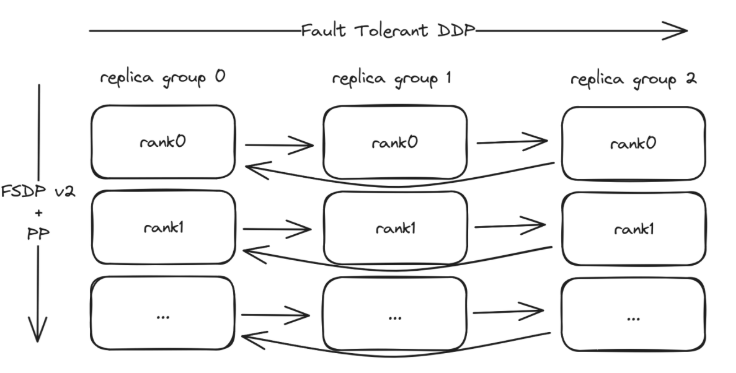

# torchft – Fault Tolerance DDP/HSDP in OSS

# 1 背景
&nbsp;&nbsp;&nbsp;&nbsp;&nbsp;&nbsp;&nbsp;&nbsp;这是torchft的设计文档，torchft是PyTorch开源社区（OSS）中实现的一种每步容错（**per step** fault tolerance）机制，其设计重点在于灵活性和与现有模型及库的兼容性。在最近的2024年PyTorch大会上，我们的实验性容错**高可扩展性分布式处理**（HSDP，Highly Scalable Distributed Processing）项目引起了广泛关注。许多不同公司都表示对使用类似机制非常感兴趣，因此，这是一份全新的、仅针对开源社区的设计和实现方案。<br>



&nbsp;&nbsp;&nbsp;&nbsp;&nbsp;&nbsp;&nbsp;&nbsp;我们希望同时支持通用的分布式数据并行（DDP）以及**高性能可扩展分布式参数服务器**（HSDP），因此我们的初步目标是支持多达约1000个副本组。<br>

# 2 OverView
&nbsp;&nbsp;&nbsp;&nbsp;&nbsp;&nbsp;&nbsp;&nbsp;为了确定法定人数(quorum)，我们使用一个单独的节点“lighthouse”来协调各个副本组(replica)，并为每个组配备一个“manager”来管理工作节点。灯塔节点(lighthouse node)将采用一种非常简单的法定人数(quorum)算法，因为它不需要被复制。管理器(manager)将在其所属的副本组内做出所有决策，并将这些决策广播给所有工作节点，同时还负责进行**节点IP的发现**。<br>


# 3 术语(Terminology)
- 灯塔（Lighthouse）– 一种服务，用于跟踪活动的副本组replica groups（此术语借自[Nebula的Lighthouse](https://nebula.defined.net/docs/guides/quick-start/#lighthouse)），并为每个step确定法定人数(quorum)。使副本组能够**相互找到对方**（因此得名灯塔）。<br>
- 管理器（Manager）– 每个副本组运行一个此服务，用于管理副本组中的所有工作节点，并与灯塔(lighthouse)通信以决定该组(grpoup)是否为法定人数(quorum)的一部分。<br>
- 副本组(Replica Group)– a group of worker nodes that make up one slice of the job。训练在replica之间是数据并行的。每个秩（rank）n都拥有模型的相同分片，并在副本组之间进行复制。<br>
- torchelastic agent代理 : 在每个worker host运行的agent，负责启动副本组中的工作进程，并在发生error时重启它们。<br>

$ 4 Service APIs 服务端api
&nbsp;&nbsp;&nbsp;&nbsp;&nbsp;&nbsp;&nbsp;&nbsp;以下是每个服务的RPC（远程过程调用）定义。<br>

*(RPC，全称Remote Procedure Call，即远程过程调用，是一种计算机通信协议。它允许一个计算机程序通过网络调用另一个计算机程序中的子程序（也就是远程过程），并获取返回值。RPC是分布式计算的重要基础，使得分布式计算应用更加方便和高效。)* <br>

## 4.1 Lighthouse
```c++
message QuorumMember {
  string replica_id = 1;
  string address = 2;
  string store_address = 3;
  int64 step = 4;
  uint64 world_size = 5;
}
message Quorum {
  int64 quorum_id = 1;
  repeated QuorumMember participants = 2;
  google.protobuf.Timestamp created = 3;
}
message LighthouseQuorumRequest {
  QuorumMember requester = 1;
}
message LighthouseQuorumResponse {
  Quorum quorum = 1;
}
message LighthouseHeartbeatRequest {
  string replica_id = 1;
}
message LighthouseHeartbeatResponse {}
service LighthouseService {
  rpc Quorum (LighthouseQuorumRequest) returns (LighthouseQuorumResponse);
  rpc Heartbeat (LighthouseHeartbeatRequest) returns
(LighthouseHeartbeatResponse);
}
```

## 4.2 Agent
```c++
message ManagerQuorumRequest {
 int64 rank = 1;
 int64 step = 2;
 string checkpoint_server_addr = 3;
}
message ManagerQuorumResponse {
 int64 quorum_id = 1;
 string address = 2;
 string store_address = 3;
 // These are information for the replicas which are at the max step.
 int64 max_step = 4;
 optional int64 max_rank = 5;
 int64 max_world_size = 6;
 // These are information for all replicas including behind replicas.
 int64 replica_rank = 7;
 int64 replica_world_size = 8;
 bool heal = 9;
}
message CheckpointAddressRequest {
 int64 rank = 1;
}
message CheckpointAddressResponse {
 string checkpoint_server_address = 1;
}
message ShouldCommitRequest {
 bool should_commit = 1;
 int64 rank = 2;
 int64 step = 3;
}
message ShouldCommitResponse {
 bool should_commit = 1;
}
message KillRequest {
 string msg = 1;
}
message KillResponse {}
service ManagerService {
 rpc Quorum (ManagerQuorumRequest) returns (ManagerQuorumResponse);
 rpc CheckpointAddress(CheckpointAddressRequest) returns
(CheckpointAddressResponse);
 rpc ShouldCommit(ShouldCommitRequest) returns (ShouldCommitResponse);
 rpc Kill(KillRequest) returns (KillResponse);
}

# 5 User Facing API (用户侧API)
&nbsp;&nbsp;&nbsp;&nbsp;&nbsp;&nbsp;&nbsp;&nbsp;大部分所需的复杂性都可以隐藏在一个类似于现有优化器step模式的API之后，而无需对用户模型进行任何更改。<br>


