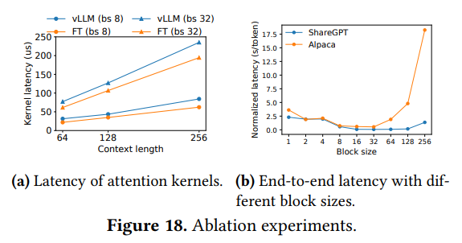

# Efficient Memory Management for Large Language Model Serving with PagedAttention
- [论文链接](https://arxiv.org/pdf/2309.06180)

# 0 摘要
&nbsp;&nbsp;&nbsp;&nbsp;&nbsp;&nbsp;&nbsp;&nbsp;对大型语言模型（LLMs）进行高吞吐量的服务需要一次性批量处理足够多的请求。然而，现有系统存在困难，因为每个请求的键-值缓存（KV缓存）内存很大并且会动态增长和收缩。当管理效率低下时，这种内存可能会因碎片化和冗余复制而被显著浪费，从而限制批处理大小。为了解决这个问题，我们提出了PagedAttention，这是一种受**传统虚拟内存和分页技术**启发的注意力算法，类似于操作系统中的技术。在此基础上，我们构建了vLLM，一个LLM服务系统，实现了（1）在KV缓存内存中几乎零浪费和（2）在请求内部和跨请求之间灵活共享KV缓存，以进一步减少内存使用。我们的评估显示，与现有的state-of-the-art系统（如FasterTransformer和Orca）相比，vLLM将流行的LLMs的吞吐量提高了2-4倍，并且具有相同水平的延迟。这种改进在序列更长、模型更大和更复杂的解码算法下更加明显。vLLM的源代码可以在https://github.com/vllm-project/vllm 公开获取。 

# 1 

# 2 

## 2.2 LLM服务与自回归生成
&nbsp;&nbsp;&nbsp;&nbsp;&nbsp;&nbsp;&nbsp;&nbsp;一旦训练完成，LLMs通常作为**条件生成服务**而部署（例如，完成API [34]或聊天机器人 [19, 35]）。向LLM服务发送请求时，会提供一组输入提示标记（𝑥1, . . . , 𝑥𝑛），LLM服务根据方程式1生成一组输出标记（𝑥𝑛+1, . . . , 𝑥𝑛+𝑇）。我们将提示和输出列表的串联称为序列。 
&nbsp;&nbsp;&nbsp;&nbsp;&nbsp;&nbsp;&nbsp;&nbsp;由于方程式1的分解，LLM只能**逐个样本化和生成新的标记**，每个新标记的生成过程取决于该序列中所有先前标记，特别是它们的key和value向量。在这个顺序生成过程中，现有标记的键和值向量通常被缓存以生成未来的标记，称为KV缓存。请注意，**一个标记的KV缓存取决于其所有先前标记**。这意味着出现在序列中不同位置的相同标记的KV缓存将不同。 
&nbsp;&nbsp;&nbsp;&nbsp;&nbsp;&nbsp;&nbsp;&nbsp;考虑到一个请求提示，LLM服务中的生成计算可以分解为两个阶段： 

&nbsp;&nbsp;&nbsp;&nbsp;&nbsp;&nbsp;&nbsp;&nbsp;提示阶段以整个用户提示（𝑥1, . . . , 𝑥𝑛）作为输入，并计算第一个新标记的概率 𝑃 (𝑥𝑛+1 | 𝑥1, . . . , 𝑥𝑛)。在此过程中，还会生成key 向量 𝑘1, . . . , 𝑘𝑛 和 value 向量 𝑣1, . . . , 𝑣𝑛。由于提示token 𝑥1, . . . , 𝑥𝑛 都是已知的，提示阶段的计算可以使用矩阵-矩阵乘法操作并行化。因此，这个阶段可以有效地利用GPU中固有的并行性。 

&nbsp;&nbsp;&nbsp;&nbsp;&nbsp;&nbsp;&nbsp;&nbsp;自回归生成阶段按顺序生成剩余的新token。在第 𝑡 次迭代中，模型将一个token 𝑥𝑛+𝑡 作为输入，并使用key向量 𝑘1, . . . , 𝑘𝑛+𝑡 和value向量 𝑣1, . . . , 𝑣𝑛+𝑡 计算概率 𝑃 (𝑥𝑛+𝑡+1 | 𝑥1, . . . , 𝑥𝑛+𝑡)。请注意，在位置 1 到 𝑛 + 𝑡 - 1 处的键和值向量在前几次迭代中被缓存，此时仅计算新的key 和 value向量 𝑘𝑛+𝑡 和 𝑣𝑛+𝑡。这个阶段会在序列达到最大长度（由用户指定或由LLMs限制）或者发出序列结束符（<eos>）标记时完成。由于数据依赖性，**不同迭代的计算无法并行化**，通常使用矩阵-向量乘法，效率较低。因此，这个阶段严重未充分利用GPU计算，演变成memory-bound，单一请求latency的主因。 

## 2.3 LLM的批处理技术
&nbsp;&nbsp;&nbsp;&nbsp;&nbsp;&nbsp;&nbsp;&nbsp;通过对多个请求进行批处理(batching multiple request)，可以提高为LLMs提供服务时的计算利用率。由于这些请求共享相同的模型权重，将权重移动的开销在一个批次中分摊，当批处理大小足够大时，计算开销将压倒权重移动的开销。然而，将请求批处理到LLM服务中并非易事，原因有两点。首先，**请求可能在不同时间到达**。一个简单的批处理策略要么会让较早的请求等待较晚的请求，要么会延迟新到的请求，直到较早的请求完成，从而导致显著的排队延迟。其次，这些请求的输入和输出长度可能相差甚远（见图11）。一个直接的批处理技术会填充请求的输入和输出以使它们的**长度相等，浪费GPU计算和内存**。 
&nbsp;&nbsp;&nbsp;&nbsp;&nbsp;&nbsp;&nbsp;&nbsp;为解决这个问题，提出了**细粒度(fine-grained)批处理机制，例如细胞批处理[16]和迭代级别调度[60]**。与传统方法在请求级别工作不同，这些技术在迭代级别操作。在每次迭代后，已完成的请求从批处理中移除，新请求被添加进来。因此，一个新请求可以在等待一个迭代后被处理，而不需要等待整个批次完成。此外，利用特殊的GPU核心，这些技术消除了填充输入和输出的需求。通过减少排队延迟和填充带来的低效率，细粒度批处理机制显著提高了LLM服务的吞吐量。 

# 3 在LLM服务中的3个内存挑战
&nbsp;&nbsp;&nbsp;&nbsp;&nbsp;&nbsp;&nbsp;&nbsp;尽管细粒度批处理减少了计算浪费，并使请求能够以更灵活的方式进行批处理，但可以批量处理的请求数量仍受限于GPU内存容量，特别是用于存储KV缓存的空间。换句话说，服务系统的吞吐量受到内存限制。要克服这种内存限制，需要解决内存管理中的以下挑战： 

&nbsp;&nbsp;&nbsp;&nbsp;&nbsp;&nbsp;&nbsp;&nbsp;Large KV Cache。随着请求数量的增加，KV Cache的大小迅速增长。以13B参数OPT模型[62]为例，单个token的KV缓存需要800 KB的空间，计算方法为 2(键和值向量）× 5120（隐藏状态大小）× 40（层数）× 2（每个FP16的字节）。由于OPT可以生成长达**2048个token**的序列，存储一个请求的KV Cache所需的内存可能高达1.6GB。并发GPU的存储容量在数十GB。即使将所有可用内存分配给KV Cache，也只能容纳少数**几十个请求**。此外，低效的内存管理还会进一步减小批处理大小，如图2所示。此外，考虑到当前的趋势，**GPU的计算速度增长快于内存容量[17]**。例如，从NVIDIA A100到H100，FLOPS增加了超过2倍，但GPU内存最大保持在80GB。因此，我们认为**内存将成为一个日益显著的瓶颈**。 

&nbsp;&nbsp;&nbsp;&nbsp;&nbsp;&nbsp;&nbsp;&nbsp;**复杂的解码算法。** LLM服务提供一系列供用户选择的解码算法，每种算法对内存管理复杂性都有不同的影响。例如，当用户从**单个输入提示中请求多个随机样本时**，这是程序建议中的典型用例[18]，在我们的实验中，该提示部分(prompt part)的KV缓存占总KV Cache内存的**12%（§6.3）**，可以共享以最小化内存使用。另一方面，在自回归生成阶段，由于不同的样本结果及其对上下文和位置的依赖性，KV缓存应保持不共享。KV缓存共享的程度取决于所采用的具体解码算法。在像束搜索[49]这样更复杂的算法中，不同的请求束可以共享更大比例的KV缓存（最多可节省**55%内存**，见§6.3），并且共享模式随着解码过程的推进而演变。 

&nbsp;&nbsp;&nbsp;&nbsp;&nbsp;&nbsp;&nbsp;&nbsp;**未知输入和输出长度的调度**。对LLM服务的请求在其输入和输出长度上表现出变化。这要求内存管理系统能够适应各种提示长度。此外，随着请求的输出长度在解码过程中增长，其KV缓存所需的内存也会扩大，可能会耗尽可用于新请求或现有提示的生成的内存。系统需要做出调度决策，例如从GPU内存中删除或交换出某些请求的KV缓存。 

## 3.1 现有系统中的内存管理
&nbsp;&nbsp;&nbsp;&nbsp;&nbsp;&nbsp;&nbsp;&nbsp;由于当前深度学习框架中的大多数操作符[33, 39]要求张量在连续内存中存储，先前的LLM服务系统[31, 60]也将一个请求的KV缓存存储为一个跨不同位置的连续张量。由于LLM的输出长度是不可预测的，它们会根据请求的**最大可能序列长度静态分配一块内存**，而不考虑请求的实际输入或最终输出长度。 

&nbsp;&nbsp;&nbsp;&nbsp;&nbsp;&nbsp;&nbsp;&nbsp;图3展示了两个请求：请求A的最大可能序列长度为2048，请求B的最大长度为512。现有系统中的块预分配方案存在三个主要的内存浪费来源：
1.为未来token预留的**槽位(slots)**;
2.由于为潜在的最大序列长度提供过多空间而导致的**内部碎片化**;
3.以及来自内存分配器（如伙伴分配器）的**外部碎片化**。
&nbsp;&nbsp;&nbsp;&nbsp;&nbsp;&nbsp;&nbsp;&nbsp;外部碎片永远不会用于生成的token，这在提供请求之前就已知。内部碎片也保持未使用，但这只有在请求完成抽样后才会意识到。它们都是纯粹的内存浪费。尽管保留的内存最终会被使用，但为整个请求的持续时间保留这些空间，特别是当保留的空间很大时，会占据本来可以用来处理其他请求的空间。我们在图2中可视化了我们实验中内存浪费的平均百分比，揭示了**以前系统中实际有效内存可能低至20.4%**。 

&nbsp;&nbsp;&nbsp;&nbsp;&nbsp;&nbsp;&nbsp;&nbsp;尽管压缩[54]已被提出作为解决碎片化问题的潜在方案，但在对性能敏感的LLM服务系统中执行压缩是不切实际的，因为存在大量的KV缓存。即使进行了压缩，每个请求的预分配块空间也会阻止现有内存管理系统中特定于解码算法的内存共享。 

# 4 方法
&nbsp;&nbsp;&nbsp;&nbsp;&nbsp;&nbsp;&nbsp;&nbsp;在这项工作中，我们开发了一种**新的注意力算法:PagedAttention**，并构建了一个LLM服务引擎 vLLM，以解决第3节中概述的挑战。vLLM 的架构如图4所示。vLLM 采用了一个**集中式调度器来协调分布式GPU工作节点的执行**。KV缓存管理器以分页方式有效地管理KV缓存，由PagedAttention 实现。具体来说，**KV缓存管理器**通过**集中式调度器发送的指令来管理GPU工作节点上的物理KV缓存内存**。 

&nbsp;&nbsp;&nbsp;&nbsp;&nbsp;&nbsp;&nbsp;&nbsp;接下来，我们在第4.1节中描述PagedAttention算法。随后，在第4.2节中展示KV缓存管理器的设计以及它如何分别在第4.3节中促进PagedAttention。然后，我们展示这种设计如何促进各种解码方法的有效内存管理（第4.4节）并处理可变长度的输入和输出序列（第4.5节）。最后，我们展示了vLLM的系统设计如何在分布式设置中运作（第4.6节）。 

## 4.1 PagedAttention
&nbsp;&nbsp;&nbsp;&nbsp;&nbsp;&nbsp;&nbsp;&nbsp;为了解决第3节中的内存挑战，我们引入了PagedAttention，这是一种受传统操作系统中paging[25]概念启发的注意力算法。与传统的注意力算法不同，PagedAttention允许在非连续内存空间中存储连续的键和值。具体来说，PagedAttention将每个序列的KV缓存分成KV block。每个block包含了一定数量的token的key和value向量，我们将其表示为KV块大小（𝐵）。将key block 表示为 $𝐾_{𝑗} = (𝑘_{(𝑗−1)𝐵+1}, . . . , 𝑘_{𝑗𝐵})$ ，value block 表示为 $𝑉_{𝑗} = (𝑣{(𝑗−1)𝐵+1}, . . . , 𝑣_{𝑗𝐵})$ 。方程式4中的注意力计算可以转换为以下block wise 计算： 

其中, $𝐴_{𝑖𝑗} = (𝑎_{𝑖,(𝑗−1)𝐵+1}, . . . , 𝑎_{𝑖,𝑗𝐵})$ 是第𝑗个KV块上的注意力分数的行向量。 

&nbsp;&nbsp;&nbsp;&nbsp;&nbsp;&nbsp;&nbsp;&nbsp;在注意力计算过程中，PagedAttention内核分别**识别和提取不同的KV block**。我们在图5中展示了PagedAttention的一个示例：key和value向量分布在三个块中，这三个块在物理内存上不是连续的。在每个时间点，内核将查询token（“forth”）的查询向量 $𝑞_{𝑖}$ 与一个块中的key向量 $𝐾_{𝑗}$ 进行乘积运算（例如，“Four score and seven”块0的键向量）以计算注意力分数 𝐴𝑖𝑗，然后将 𝐴𝑖𝑗 与一个块中的值向量 𝑉𝑗 进行乘积运算，得出最终的注意力输出 $𝑜_{𝑖}$。 

&nbsp;&nbsp;&nbsp;&nbsp;&nbsp;&nbsp;&nbsp;&nbsp;总之，PagedAttention算法允许将KV块存储在非连续的物理内存中，从而在vLLM中实现了更灵活的分页内存管理。 

## 4.2 KV缓存管理器
&nbsp;&nbsp;&nbsp;&nbsp;&nbsp;&nbsp;&nbsp;&nbsp;vLLM内存管理器背后的关键思想类似于操作系统中的虚拟内存[25]。操作系统将内存分成固定大小的页面，并将用户程序的逻辑页面映射到物理页面。**连续的逻辑页面可以对应于非连续的物理内存页面**，使用户程序可以访问内存，就像它是连续的一样。此外，物理内存空间无需提前完全保留，这使得操作系统能够根据需要动态分配物理页面。vLLM利用虚拟内存(virtual memory)背后的思想来管理LLM服务中的KV Cache。借助PagedAttention的支持，我们将KV Cache组织成固定大小的KV block，就像虚拟内存中的pages一样。 

&nbsp;&nbsp;&nbsp;&nbsp;&nbsp;&nbsp;&nbsp;&nbsp;请求的KV Cache被表示为一系列**逻辑KV block**，从左到右填充，随着新的token及其KV Cache的生成。最后一个KV block的未填充位置被保留供将来使用。在GPU工作节点上，块引擎分配一块连续的GPU DRAM，并将其划分为物理KV块（这也适用于CPU RAM进行交换；参见第4.5节）。KV块管理器还维护**block-table** - 每个请求的逻辑和物理KV块之间的映射。每个block table item **记录逻辑块的相应物理块以及填充位置的数量**。分离逻辑和物理KV块使得vLLM能够动态增长KV缓存内存，而无需提前为所有位置保留，这消除了现有系统中大部分的内存浪费，如图2所示。 

## 4.3 使用PagedAttention和vLLM进行解码
&nbsp;&nbsp;&nbsp;&nbsp;&nbsp;&nbsp;&nbsp;&nbsp;接下来，我们通过一个示例（如图6所示）来演示vLLM在单个输入序列的解码过程中如何执行PagedAttention并管理内存： 
1.类似于操作系统的vitrual memory，vLLM在初始阶段**不需要为可能生成的最大序列长度保留内存**。相反，它仅保留了足够容纳在提示计算期间生成的KV缓存所需的KV块。在这种情况下，提示包含7个token，因此vLLM将第1个和第2个logical KV block（分别为0和1）映射到2个physical KV block（分别为7和1）。在prefill步骤中，vLLM使用传统的自注意力算法（例如[13]）生成prompt和第一个输出token的KV缓存。然后，vLLM将前4个token的KV cache存储在逻辑块0中，接下来的3个token存储在逻辑块1中。剩余的slot保留供后续自回归生成阶段使用。 
2.在第一次自回归解码步骤中，vLLM使用物理块7和1上的PagedAttention算法生成新令牌。由于最后一个逻辑块中还有一个空余插槽，新生成的KV缓存存储在那里，并更新block table中的填充记录数。 
3.在第二次解码步骤中，由于最后一个逻辑块已满，vLLM将新生成的KV缓存存储在一个**新的逻辑块**中；vLLM为其分配一个**新的物理块(物理块3)** 并将此映射存储在块表中。 

&nbsp;&nbsp;&nbsp;&nbsp;&nbsp;&nbsp;&nbsp;&nbsp;在全局范围内，对于每个decoding iteration，vLLM首先选择一组候选序列进行**批处理**（更多内容请参见第4.5节），并为新需求的逻辑块分配物理块。然后，vLLM将当前迭代的所有输入token（即提示阶段请求的所有令牌和生成阶段请求的最新令牌）连接为一个序列，并将其馈送到LLM中。在LLM的计算过程中，vLLM使用PagedAttention kenel访问以logical KV block形式存储的 previous KV cache，并将新生成的KV cache保存到物理KV block中。在KV-block中存储**多个token（块大小>1）使得PagedAttention内核能够并行处理更多位置上的KV缓存**，从而提高硬件利用率并减少latency。然而，较大的块大小也会增加内存碎片化。我们在第7.2节中研究了块大小的影响。 

&nbsp;&nbsp;&nbsp;&nbsp;&nbsp;&nbsp;&nbsp;&nbsp;继续分析：随着生成更多token及其KV cache，vLLM动态地为逻辑块分配新的物理块。由于所有块都是从左到右填充的，只有在所有先前的块都填满时才会分配新的物理块，**vLLM将一个请求的所有内存浪费限制在一个块内**，因此可以有效地利用所有内存，如图2所示。这允许更多请求适应内存以进行批处理，从而提高吞吐量。一旦一个请求完成生成，其KV块可以被释放以存储其他请求的KV缓存。在图7中，我们展示了vLLM为两个序列管理内存的示例。这两个序列的logical block 被映射到GPU工作节点中块引擎保留的空间中的不同物理块。这两个序列的相邻逻辑块在物理GPU内存中不需要是连续的，**物理块的空间可以被两个序列**有效利用。 

## 4.4 应用于其他解码场景
&nbsp;&nbsp;&nbsp;&nbsp;&nbsp;&nbsp;&nbsp;&nbsp;第4.3节展示了PagedAttention和vLLM如何处理**基本解码算法，例如贪婪解码和采样/还有核采样**，这些算法以一个用户提示作为输入，并生成单个输出序列。在许多成功的LLM应用中[18, 34]，LLM服务必须提供更复杂的解码场景，展现出复杂的访问模式和更多的内存共享机会。我们在本节展示了vLLM在这些场景中的一般适用性。 

&nbsp;&nbsp;&nbsp;&nbsp;&nbsp;&nbsp;&nbsp;&nbsp;**并行采样**。在基于LLM的程序助手中，LLM会为单个输入提示生成多个采样输出；用户可以从**多个候选项中选择一个喜欢的输出**。到目前为止，我们隐含地假设一个请求生成一个单独的序列。在本文的其余部分中，我们假设一种更一般的情况，即一个请求生成多个序列。在并行采样中，一个请求包括多个共享相同输入提示的样本，允许共享提示的KV缓存。通过其PagedAttention和分页内存管理(paged memory management)，vLLM可以轻松实现这种共享并节省内存。 

&nbsp;&nbsp;&nbsp;&nbsp;&nbsp;&nbsp;&nbsp;&nbsp;图8展示了两个输出的并行解码示例。由于两个输出**共享相同的提示**，我们在提示阶段仅为提示的状态保留一份副本；两个序列的提示的逻辑块被映射到相同的物理块：两个序列的逻辑块0和1分别映射到物理块7和1。由于单个物理块可以映射到多个逻辑块，我们为**每个物理块引入一个引用计数**。在这种情况下，物理块7和1的引用计数均为2。在生成阶段，这两个输出会采样不同的输出token，并需要单独存储KV缓存。vLLM在需要多个序列修改的物理块粒度(granularity)上实现了一种**写时复制机制**，类似于操作系统virtual memory中的写时复制技术（例如，在分叉进程时）。具体来说，在图8中，当样本A1需要写入其最后一个逻辑块（逻辑块1）时，vLLM意识到相应物理块（物理块1）的引用**计数大于1**；它会分配一个新的物理块（物理块3），指示块引擎从物理块1复制信息，并将引用计数减少为1。接下来，当样本A2写入物理块1时，引用计数已经减少为1；因此A2直接将其新生成的KV缓存写入物理块1。 

&nbsp;&nbsp;&nbsp;&nbsp;&nbsp;&nbsp;&nbsp;&nbsp;总之，vLLM实现了跨多个输出样本共享存储提示的KV缓存所使用的大部分空间，除了最终的逻辑块，由复制写入机制管理。通过在多个样本之间共享物理块，内存使用量可以大大减少，尤其对于长输入提示而言。 

&nbsp;&nbsp;&nbsp;&nbsp;&nbsp;&nbsp;&nbsp;&nbsp;**Beam Search**. 在像机器翻译这样的LLM任务中，用户期望LLM输出top-k的最合适的翻译结果。Beam search被广泛用于从LLM中解码出最可能的输出序列，因为它减轻了完全遍历样本空间的计算复杂度。该算法依赖于beam width parameters 𝑘，该参数决定了每一步保留的前𝑘个顶级候选人数。在解码过程中，Beam search通过考虑所有可能的标记来扩展束中的每个候选序列，使用LLM计算它们各自的概率，并保留𝑘·|𝑉|个候选人中概率最高的前𝑘个序列，其中|𝑉|是词汇表的大小。 

&nbsp;&nbsp;&nbsp;&nbsp;&nbsp;&nbsp;&nbsp;&nbsp;与并行解码不同，Beam search **不仅** 便利在不同候选者之间共享初始提示块，还便利在整个解码过程中动态变化的其他块的共享模式，类似于由复合分叉创建的操作系统中的进程树。图9展示了vLLM如何管理带有𝑘 = 4的Beam search示例的KV块。在作为虚线的迭代之前，每个候选序列都使用了4个完整的逻辑块。所有Beam候选者共享第一个块0（即提示）。候选者3从第二块开始偏离其他候选者。候选者0-2共享前3个块，并在第四块分叉。在后续迭代中，前4个可能的候选者都源自候选者1和2。由于原始的候选者0和3不再是前几名的候选者，它们的**逻辑块被释放，相应物理块的引用计数减少**。vLLM释放所有引用计数达到0的物理块（块2、4、5、8）。然后，vLLM为存储新候选者的新KV缓存分配新的物理块（块9-12）。现在，所有候选者共享块0、1、3；候选者0和1共享块6，候选者2和3进一步共享块7。 

&nbsp;&nbsp;&nbsp;&nbsp;&nbsp;&nbsp;&nbsp;&nbsp;以往的LLM服务系统需要在Beam候选者之间频繁进行**KV缓存的内存拷贝**。例如，在图9所示的情况中，虚线之后，候选者3需要复制候选者2的大部分KV缓存以继续生成。vLLM的物理块共享显著减少了这种频繁的内存拷贝开销。在vLLM中，不同Beam候选者的大部分块可以共享。只有当新生成的标记位于旧共享块中时，才会应用写入时复制机制，就像并行解码一样。这只涉及复制一块数据。 

&nbsp;&nbsp;&nbsp;&nbsp;&nbsp;&nbsp;&nbsp;&nbsp;**共享前缀(Shared prefix)**。通常情况下，LLM用户会提供一个（较长的）任务描述，包括说明、示例输入和输出，也被称为系统提示。该描述与实际任务输入连接起来形成请求的提示。LLM基于完整提示生成输出。图10展示了一个示例。此外，通过提示工程，可以进一步调整共享前缀，以提高下游任务的准确性。 

&nbsp;&nbsp;&nbsp;&nbsp;&nbsp;&nbsp;&nbsp;&nbsp;对于这种类型的应用程序，许多用户提示共享一个前缀，因此LLM服务提供商可以提前存储前缀的KV缓存，以减少在前缀上花费的冗余计算。在vLLM中，LLM服务提供商可以通过为一组预定义的共享前缀保留一组物理块来方便地实现这一点，就像操作系统处理进程间共享库一样。具有共享前缀的用户输入提示可以简单地将其逻辑块映射到缓存的物理块（最后一个块标记为写入时复制）。提示阶段的计算只需要在用户的任务输入上执行》.  

&nbsp;&nbsp;&nbsp;&nbsp;&nbsp;&nbsp;&nbsp;&nbsp;**混合解码方法**。先前讨论的解码方法展示了各种不同的内存共享和访问模式。然而，vLLM便利了同时处理具有不同解码偏好的请求，而现有系统无法高效实现。这是因为vLLM通过一个通用映射层隐藏了不同序列之间复杂的内存共享，**将逻辑块转换为物理块**。LLM及其执行kernel只看到每个序列的一组**物理块ID**，并且无需处理跨序列的共享模式。与现有系统相比，这种方法扩大了具有不同采样要求的请求的批处理机会，最终提高了系统的整体吞吐量。 

## 4.5 调度和抢占(schedule and Preemption)
&nbsp;&nbsp;&nbsp;&nbsp;&nbsp;&nbsp;&nbsp;&nbsp;当请求流量超过系统容量时，vLLM必须对一部分请求进行优先级排序。在vLLM中，我们采用先到先服务（FCFS）调度策略处理所有请求，确保公平性并防止饥饿现象。当vLLM需要抢占请求时，它确保最早到达的请求优先服务，最晚到达的请求首先被抢占。 

&nbsp;&nbsp;&nbsp;&nbsp;&nbsp;&nbsp;&nbsp;&nbsp;LLM服务面临着一个独特的挑战：LLM的输入提示在长度上可能有显著差异，由此产生的**输出长度事先不可知**，取决于输入提示和模型。随着请求数量和它们的输出增长，vLLM可能会耗尽GPU的物理块来存储新生成的KV缓存。在这种情况下，vLLM需要回答两个经典问题： 
-（1）应该驱逐哪些块？
-（2）如果需要再次使用，如何恢复被驱逐的块？

通常，驱逐策略使用**启发式方法**来预测哪个块将在将来被访问最远，并将该块驱逐。由于在我们的情况下，我们知道一个序列的所有块是一起访问的，因此我们实现了一种**全有或全无的驱逐策略**，即要么全部要么不要序列的所有块。此外，在一个请求中有多个序列（例如，在一个Beam搜索请求中的Beam候选者）被作为序列组进行集中调度。序列组内的序列由于可能跨序列共享内存，因此总是一起被抢占或重新调度。为了回答如何恢复一个被驱逐块的第二个问题，我们考虑了两种技术： 

&nbsp;&nbsp;&nbsp;&nbsp;&nbsp;&nbsp;&nbsp;&nbsp;**交换(swap)**。这是大多数虚拟内存实现中使用的经典技术，它将被驱逐的页面复制到磁盘上的交换空间(其实就是offload)。在我们的情况下，我们将被驱逐的块复制到CPU内存。如图4所示，在GPU块分配器之外，vLLM还包括一个CPU块 allocator，用于管理交换到CPU RAM的物理块。当vLLM耗尽了用于新token的空闲物理块时，它**选择一组序列进行驱逐(而不是一个block)，并将它们的KV缓存传输到CPU**。一旦它抢占一个序列并驱逐其blocks，vLLM就会停止接受新请求，直到所有被抢占的序列完成。一旦一个请求完成，其块将从内存中释放，被抢占序列的块被重新引入以继续处理该序列。需要注意的是，通过这种设计，交换到CPU RAM的块数量永远不会超过GPU RAM中总物理块的数量，因此CPU RAM上的交换空间受限于为KV缓存分配的GPU内存。 

&nbsp;&nbsp;&nbsp;&nbsp;&nbsp;&nbsp;&nbsp;&nbsp;**重计算**。在这种情况下，当**被抢占的序列重新调度时**，我们简单地重新计算KV缓存。需要注意的是，重新计算的延迟可以显著低于原始延迟，因为在解码时生成的token可以与原始用户提示连接在一起作为新提示，它们在所有位置的KV缓存可以在一个提示阶段迭代中生成。交换和重新计算的性能取决于CPU RAM和GPU内存之间的带宽以及GPU的计算能力。我们将在第7.3节中检验交换和重新计算的速度。 

## 4.6 分布式执行
&nbsp;&nbsp;&nbsp;&nbsp;&nbsp;&nbsp;&nbsp;&nbsp;许多LLM的参数大小超过了单个GPU的容量[5, 9]。因此，有必要将它们分布在多个GPU上，并以模型并行的方式执行它们[28, 63]。这需要一个能够处理分布式内存的内存管理器。vLLM在分布式环境中表现出色，通过支持在Transformers上广泛使用的Megatron-LM风格的张量模型并行策略[47]。该策略遵循SPMD（单程序多数据）执行计划，其中线性层被分区以执行分块矩阵乘法，**GPU通过allreduce操作不断同步中间结果**。具体而言，注意力操作符在注意力头维度上进行拆分，每个SPMD进程负责多头注意力中一部分注意力头。 

&nbsp;&nbsp;&nbsp;&nbsp;&nbsp;&nbsp;&nbsp;&nbsp;我们观察到，即使使用模型并行执行，每个模型分片仍然处理相同的输入令牌集，因此需要相同位置的KV缓存。因此，vLLM在中央调度器中具有一个单一的KV缓存管理器，如图4所示。不同的GPU工作器共享该管理器，以及从逻辑块到物理块的映射。这种共享映射允许GPU工作器使用调度器为每个输入请求提供的物理块来执行模型。尽管每个GPU工作器具有相同的物理块ID，但每个工作器**仅为其对应的注意力头存储部分KV缓存**。 

&nbsp;&nbsp;&nbsp;&nbsp;&nbsp;&nbsp;&nbsp;&nbsp;在每一步中，调度器首先为批处理中的每个请求准备包含输入令牌ID和每个请求的block-table的控制消息。接下来，调度器将这个控制消息广播给GPU worker。然后，GPU工作器开始使用输入令牌ID执行模型。在注意力层中，GPU工作器根据控制消息中的block-table读取KV缓存。在执行过程中，GPU工作器使用allreduce通信原语同步中间结果，无需调度器的协调，就像[47]中所述。最后，GPU工作器将本次迭代的抽样token发送回调度器。总而言之，GPU woker无需在内存管理上进行同步，因为它们只需要在每个解码迭代的开始时接收所有的内存管理信息以及步骤输入。 

# 5 实现(Implementation)
&nbsp;&nbsp;&nbsp;&nbsp;&nbsp;&nbsp;&nbsp;&nbsp;vLLM是一个端到端的服务系统，具有一个基于FastAPI [15]的前端和基于GPU的推理引擎。前端扩展了OpenAI API [34]接口，允许用户为每个请求自定义抽样参数，例如最大序列长度和波束宽度 𝑘。vLLM引擎由8.5K行Python代码和2K行C++/CUDA代码编写而成。我们在Python中开发了与控制相关的组件，包括调度器和块管理器，同时为关键操作（如PagedAttention）开发了自定义CUDA核。对于模型执行器，我们使用PyTorch [39]和Transformers [58]实现了流行的LLM模型，如GPT [5]、OPT [62]和LLaMA [52]。我们在分布式GPU工作器之间使用NCCL [32]进行张量通信。 

## 5.1 kernel 级优化
&nbsp;&nbsp;&nbsp;&nbsp;&nbsp;&nbsp;&nbsp;&nbsp;由于PagedAttention引入了现有系统不支持的内存访问模式，我们为其开发了几个GPU内核进行优化。 
1. **fused reshape and block write**。在每个Transformer层中，新的KV缓存被分割成块，reshape为 针对块读取进行优化的内存布局，然后保存在block-table指定的位置。为了最小kernel launch开销，我们将它们融合成一个单一的kernel;
2. **Fusing block read and attention**。我们改编了FasterTransformer [31]中的attention kernel，根据block-table读取KV缓存，并实时执行注意力操作。为确保合并内存访问，我们分配一个GPU线程束来读取每个块。此外，我们为请求批次内的**可变序列长度**增加了支持;
3. 融合块复制。通过**写时复制机制**发出的块复制操作可能在不连续的块上操作。如果使用cudaMemcpyAsync API，这可能导致大量小数据移动的调用。为了减少开销，我们实现了一个kernel，将不同块的复制操作批量处理成单个内核启动。 

## 5.2 支持各种解码算法
&nbsp;&nbsp;&nbsp;&nbsp;&nbsp;&nbsp;&nbsp;&nbsp;vLLM使用三种关键方法实现各种解码算法：fork、append和free。fork方法从现有序列创建一个新序列。append方法向序列追加一个新令牌。最后，free方法删除序列。例如，在并行抽样(parallel sampling)中，vLLM使用fork方法从单个输入序列创建多个输出序列。然后，它在每次迭代中向这些序列添加新令牌，使用append，并使用free删除满足停止条件的序列。vLLM还在beam search和prefix sharing中应用相同策略。我们相信未来的解码算法也可以通过结合这些方法来支持。 

# 7  消融研究(Ablation Studies)
&nbsp;&nbsp;&nbsp;&nbsp;&nbsp;&nbsp;&nbsp;&nbsp;在本节中，我们对vLLM的各个方面进行研究，并通过消融实验评估我们所做的设计选择。 

## 7.1 内核微基准测试
&nbsp;&nbsp;&nbsp;&nbsp;&nbsp;&nbsp;&nbsp;&nbsp;PagedAttention中的**动态块映射(dynamic block mapping)** 影响涉及存储的KV缓存的GPU操作性能，即块读/写和注意力操作。与现有系统相比，我们的GPU kernel（§5）涉及访问block-table、执行额外分支和处理可变序列长度的额外开销。如图18a所示，与高度优化的FasterTransformer实现相比，这导致注意力kernel lantency增加了20-26%。我们认为这种额外开销很小，因为它只影响注意力操作符，而不影响模型中的其他操作符，如Linear。尽管存在额外开销，PagedAttention使得vLLM在端到端性能上明显优于FasterTransformer（§6）。

## 7.2 块大小的影响
&nbsp;&nbsp;&nbsp;&nbsp;&nbsp;&nbsp;&nbsp;&nbsp;**Block size的选择对vLLM的性能有重大影响**。如果块大小过小，vLLM可能无法充分利用GPU的并行性来读取和处理KV cache。如果块大小过大，内部碎片增加，共享的概率降低。 

## 7.3 比较重计算和交换(swapping)
&nbsp;&nbsp;&nbsp;&nbsp;&nbsp;&nbsp;&nbsp;&nbsp;vLLM支持重计算和交换作为其恢复机制。为了了解这两种方法之间的权衡，我们评估它们的端到端性能并对它们的**额外开销**进行微基准测试，如图19所示。我们的结果显示，**swapping在小块大小下产生过多的开销**。这是因为小块大小通常导致CPU和GPU之间大量小数据传输，从而限制了有效的PCIe带宽。相比之下，重计算的开销在不同块大小下保持恒定，因为重计算不使用KV块。因此，**当块大小较小时，重计算更有效率，而当块大小较大时，swapping更有效率**，尽管重计算的开销永远不会高于交换的延迟的20%。对于**从16到64的中等块大小，这两种方法表现出可比较的端到端性能**。 

&nbsp;&nbsp;&nbsp;&nbsp;&nbsp;&nbsp;&nbsp;&nbsp;在图18b中，我们使用ShareGPT和Alpaca跟踪数据，在固定请求速率下评估了不同块大小下vLLM的性能，使用基本抽样。在ShareGPT跟踪数据中，Block size从16到128导致最佳性能。在Alpaca跟踪数据中，尽管块大小16和32效果良好，但较大的块大小显著降低了性能，因为序列变短于块大小。在实践中，我们发现块大小16足够大，可以有效利用GPU，并且足够小，以避免在大多数工作负载中出现显著的内部碎片。因此，**vLLM将其默认块大小设置为16**。 

# 8 讨论
&nbsp;&nbsp;&nbsp;&nbsp;&nbsp;&nbsp;&nbsp;&nbsp;将虚拟内存和分页技术应用于其他GPU工作负载。虚拟内存和分页技术在LLM服务中管理KV缓存方面是有效的，因为该工作负载需要动态内存分配（因为输出长度事先未知），并且其性能受限于GPU内存容量。然而，**并非每个GPU工作负载都适用这一概念**。例如，在DNN训练中，张量形状通常是静态的，因此内存分配可以提前进行优化。再举一个例子，在为非LLM的DNN提供服务时，提高内存效率可能不会带来性能改进，因为性能主要受计算限制。在这种情况下，引入vLLM的技术可能会由于内存间接和非连续块内存的额外开销而导致性能下降。然而，我们很乐意看到vLLM的技术被应用于具有类似特性的其他工作负载。 

&nbsp;&nbsp;&nbsp;&nbsp;&nbsp;&nbsp;&nbsp;&nbsp;LLM特定的优化在应用虚拟内存和分页时。vLLM通过利用特定于应用程序的语义重新解释和增强了虚拟内存和分页的概念。一个例子是vLLM的全有或全无换出策略，该策略利用了一个事实，即处理请求需要将其所有对应的token状态存储在GPU内存中。另一个例子是重计算方法，用于恢复被替换的块，这在操作系统中是不可行的。此外，vLLM通过将用于内存访问操作的GPU kernel与用于其他操作（如注意力）的kernel融合，从而减轻了分页中内存间接的开销。 

# 10 参考链接
- [csdn blog](https://blog.csdn.net/yjw123456/article/details/141090361)
- [vllm blog](https://blog.vllm.ai/2023/06/20/vllm.html)
