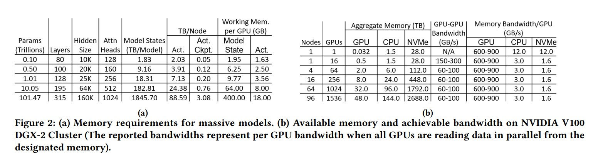

# zero-infinity：打破极端规模(scale)深度学习模型的内存墙

# 摘要
&nbsp;&nbsp;&nbsp;&nbsp;&nbsp;&nbsp;&nbsp;&nbsp;在过去的三年里，最大的密集(dense)深度学习模型的规模增长了1000倍以上，达到了数千亿个参数，而GPU内存只增长了5倍（从16GB到80GB）。因此，模型规模的增长主要是通过系统创新来支持的，这些创新使得大型模型可以适应多个GPU的总体内存。然而，我们正在接近GPU内存的极限。为了训练一个**万亿参数的模型，需要800个NVIDIA V100 GPU**，而这样的集群对大多数数据科学家来说根本无法实现。此外，以这样的规模训练模型需要复杂的并行技术组合，给数据科学家增加了重构模型的巨大负担。 
&nbsp;&nbsp;&nbsp;&nbsp;&nbsp;&nbsp;&nbsp;&nbsp;在本论文中，我们提出了一种名为ZeRO-Infinity的新型异构系统技术，它利用GPU、CPU和NVMe内存，在有限资源下实现了**前所未有**的模型规模扩展，而无需对模型代码进行重构。同时，它实现了出色的训练吞吐量和可扩展性，不受限于有限的CPU或NVMe带宽。ZeRO-Infinity可以在当前一代GPU集群上容纳数**万亿甚至数百万亿个参数**的模型进行训练。它可以用于在单个NVIDIA DGX-2节点上微调万亿参数模型，使大型模型更易于使用。在训练吞吐量和可扩展性方面，它在512个NVIDIA V100 GPU上可以维持超过25 petaflops的性能（达到峰值的40%），同时还展示了超线性的可扩展性。ZeRO-Infinity的开源实现可通过DeepSpeed获得。
*注释：NVMe代表非易失性内存扩展（Non-Volatile Memory Express），是一种高性能、低延迟的存储接口协议。NVMe利用并行性和高带宽特性，提供了更高的I/O性能和更低的延迟。这使得NVMe成为处理大规模数据和高性能计算应用的理想选择，尤其在需要快速数据读写和响应时间的场景中。*  
*注释：DeepSpeed（https://www.deepspeed.ai/）是一个旨在使分布式训练变得简单、高效和有效的深度学习优化库。DeepSpeed已经被深度学习社区广泛采用。*

# 1 背景(EXTENDED)介绍
&nbsp;&nbsp;&nbsp;&nbsp;&nbsp;&nbsp;&nbsp;&nbsp;近年来，深度学习在取得巨大(tremendous)进展，使其成为我们生活中不可或缺的一部分，从为搜索引擎提供动力到智能家居虚拟助手。这些进展的核心在于模型规模的增加[1-3]，而多项研究表明这一趋势将会持续下去[4, 5]。因此，人们已经大量投资于训练庞大的模型。 
&nbsp;&nbsp;&nbsp;&nbsp;&nbsp;&nbsp;&nbsp;&nbsp;在过去的三年中，深度学习中最大的训练密集模型的规模增长了1000倍，从一亿个参数（ELMo [6]）增长到超过一千亿个参数（GPT-3 [4]）。相比之下，单个GPU的内存仅增加了5倍（从16GB到80GB）。因此，模型规模的增长主要通过系统技术的进步来实现大规模深度学习模型的训练，其中包括模型并行化 [7]、流水线并行化 [8-10] 和 ZeRO [11, 12] 等并行技术，正在为训练更大、更强大的模型铺平道路. 
&nbsp;&nbsp;&nbsp;&nbsp;&nbsp;&nbsp;&nbsp;&nbsp;当前大模型训练技术的sota技术是三维并行化(3D parallelism [13, 14])，它将模型（张量切片）并行化、流水线并行化和数据并行化相结合，有效地将深度学习训练扩展到数万亿个参数，并在数百或数千个GPU上进行。例如，DeepSpeed实现的三维并行化可以利用集群的GPU内存，使得在**800个NVIDIA V100 GPU上可以扩展到超过一万亿个参数的规模** [15]。 
&nbsp;&nbsp;&nbsp;&nbsp;&nbsp;&nbsp;&nbsp;&nbsp;尽管三维并行化(3D parallelism)在大型模型训练方面具有很大的能力，但我们现在正面临GPU内存墙的挑战 [16]。**集群的GPU内存简单地不足以支持模型规模的增长**。即使使用最新的NVIDIA A100 GPU，其具有80GB的内存，为了训练一个万亿参数的模型，三维并行化需要320个GPU才能容纳，而要扩展到未来百万亿参数级别的模型，则需要超过6K个GPU，即使我们假设未来几年GPU内存增加5倍。我们无法再依靠GPU内存作为瓶颈来维持模型规模的持续增长。 
&nbsp;&nbsp;&nbsp;&nbsp;&nbsp;&nbsp;&nbsp;&nbsp;GPU 内存墙也限制了数据科学家甚至无法访问当今的大型模型，特别是用于微调。大型模型首先在大量的通用数据上进行预训练，通过微调，同一模型可以针对各种应用进行专门优化。虽然对一个拥有数千亿个参数的模型进行预训练可能需要数百万个GPU计算小时，但进行微调的成本要低得多，只需要较少的GPU计算小时，并且可以在单个计算节点(不是单个gpu)上完成，使用少量的GPU。虽然许多企业和用户可以获得此类计算资源，但不幸的是，它们受限于计算节点上可用的内存，这进而限制了可以进行微调的模型规模。这使得**大型模型的微调对于大多数没有大规模GPU集群资源的研究人员和公司来说是无法实现的**。例如，即使单个DGX-2节点（16个GPU）具备足够的计算能力在合理的时间内对GPT-3进行微调，但要将模型适应于训练，需要超过8个DGX-2节点（128个GPU）并使用三维并行化。 
&nbsp;&nbsp;&nbsp;&nbsp;&nbsp;&nbsp;&nbsp;&nbsp;除了GPU内存墙外，用于训练大规模模型的最新技术在可用性和灵活性方面也存在限制。如上所述，三维并行化需要以复杂的方式将数据并行化、模型并行化和流水线并行化相结合，才能达到数千亿或数万亿个参数的规模。虽然这样的系统可能非常高效，但它要求数据科学家进行重大的模型代码重构，将单个GPU运算符替换为张量切片版本，并将模型分割成负载平衡的流水线阶段。这也使得三维并行化在支持的模型类型方面缺乏灵活性。具有复杂依赖关系的模型不能轻易转换为负载平衡的流水线结构。 
&nbsp;&nbsp;&nbsp;&nbsp;&nbsp;&nbsp;&nbsp;&nbsp;给定大型模型训练的现状，我们提出了三个问题： 
- 展望未来，我们如何支持模型规模的下一次1000倍增长，从拥有1750亿参数的模型（如GPT-3）到拥有数万亿参数的模型？ 
- 我们如何让当今的大型模型对更多没有数百个GPU资源的数据科学家可用？ 
- 我们能否通过消除模型重构和多种形式的并行化(parallelism)的需求，使大型模型训练更加简单？ 
在本论文中，我们从三维并行化迈出了一大步，提出了ZeRO-Infinity，这是一种新颖的系统，能够解决大型模型训练的所有上述挑战。 
&nbsp;&nbsp;&nbsp;&nbsp;&nbsp;&nbsp;&nbsp;&nbsp;**前所未有的模型规模**：ZeRO-Infinity通过新颖的异构内存访问技术——**无限卸载引擎（infinity offload engine）**，扩展了ZeRO技术家族[11, 12]。这使得ZeRO-Infinity能够利用CPU和NVMe内存同时支持有限的GPU资源上的大规模模型。此外，ZeRO-Infinity还引入了一种称为**内存中心平铺（memory-centric tiling）的新颖GPU内存优化技术**，以支持那些即使逐层单独加载也无法适应GPU内存的**极大尺寸的单个层**。通过无限卸载引擎和内存中心平铺技术，ZeRO-Infinity不仅支持模型规模的下一次1000倍增长，而且还使得拥有有限GPU资源的数据科学家能够使用大型模型。 
&nbsp;&nbsp;&nbsp;&nbsp;&nbsp;&nbsp;&nbsp;&nbsp;出色的训练效率：ZeRO-Infinity引入了一种新颖的数据分区策略，利用(leveraging)所有设备的聚合(aggregate)内存带宽，我们称之为**带宽中心分区(bandwidth-centric partitioning)**，并将其与**强大的通信重叠设计**以及在**无限卸载引擎**中进行**高性能NVMe访问**的优化相结合。尽管将数据卸载到CPU或NVMe，但ZeRO-Infinity提供了出色的训练效率，不受它们有限带宽的限制。 
&nbsp;&nbsp;&nbsp;&nbsp;&nbsp;&nbsp;&nbsp;&nbsp;**易于使用**：有了ZeRO-Infinity，数据科学家不再需要根据三维并行化等多种并行化形式来调整他们的模型。这是由上面讨论的ZeRO-Infinity中的**内存中心平铺技术(memory-centric tiling)实现的**，该技术旨在减少单个大型层(layer)所需的GPU内存，否则需要模型并行化（张量切片）来适应GPU内存。此外，ZeRO-Infinity通过一种启发式易于实现的方法，自动化了训练任意模型架构所需的所有通信和数据分区，从而消除了手动模型代码重构的需要，即使在扩展到数万亿个参数时也是如此。 
&nbsp;&nbsp;&nbsp;&nbsp;&nbsp;&nbsp;&nbsp;&nbsp; 本文的主要贡献如下： 
- 大型模型训练的内存和性能特征描述了不同组成部分的内存需求（第3节）以及训练的带宽需求（第4节），以确保训练的高效性。 
- ZeRO-Infinity（第5、6和第7节）是一种新颖的深度学习训练系统技术，包括五项创新技术，以解决内存和带宽需求，提供前所未有的模型规模，并且易于使用，同时实现出色的训练效率：**i) 无限卸载引擎**：充分利用现代集群上的异构架构，同时利用GPU、CPU和NVMe内存以及GPU和CPU计算能力。**ii) 内存中心平铺(memory-centric tiling)**：处理大规模运算符(超大数据层)，无需模型并行化。**iii) 带宽中心分区(bandwidth-centric partitioning)**：利用所有并行设备的聚合内存带宽。**iv) 重叠中心设计(overlap-centric design)**：将计算和通信重叠，提高效率。**v) 启发式实现**：避免模型代码重构，简化使用过程。 
- ZeRO-Infinity经过广泛(extensive)的评估，展示了以下内容：i) 在32个NVIDIA DGX-2节点（512个V100 GPU）上运行32万亿参数的前所未有的规模；ii) 在相同硬件上实现出色的训练效率，吞吐量超过25 petaflops( $10^{15}$ 一千万亿); iii) 兆(万亿)参数模型的超线性可扩展性；iv) 可访问性和易用性：在单个DGX-2节点上对万亿参数模型进行微调，无需使用任何模型并行化或模型代码重构；v) ZeRO-Infinity中不同技术对模型规模和效率的影响（第8节）。 
- 论文讨论了ZeRO-Infinity及其对未来硬件系统设计的潜在影响(在第9节)。
- 在DeepSpeed2中有一个ZeRO-Infinity的开源实现，DeepSpeed(https://www.deepspeed.ai/)是一个深度学习优化库，旨在使分布式训练变得简单、高效和有效，已经在深度学习社区广泛采用。 

# 2 背景和相关工作
&nbsp;&nbsp;&nbsp;&nbsp;&nbsp;&nbsp;&nbsp;&nbsp;**数据、模型、流水线和3D并行化** 并行化是在大规模训练中训练大型模型的重要策略。对于适合设备内存进行训练的模型，可以使用数据并行化（DP）将训练扩展到多个设备。当模型无法适合(fit)设备内存时，可以使用模型并行化（MP）[7, 17, 18]和流水线并行化（PP）[7–9]将模型在进程之间进行垂直和水平分割。3D并行化[14, 15]结合了数据、模型和流水线并行化的优点，使其能够高效地扩展到数万亿个参数。虽然3D并行化可以非常高效，但它需要：i）对模型进行重构，将模型分割为模型和流水线并行组件；ii）具有复杂依赖关系图的模型难以表达为负载平衡的流水线阶段；iii）模型大小受限于可用的GPU内存总量。我们建议读者参考Ben-Nun和Hoefler [19]的详尽调查报告，了解深度学习中的并行化技术。 
*注释：在本文中，我们区分了模型并行化和流水线并行化，其中前者具体指基于张量切片的方法，并不包括流水线并行化。*  
&nbsp;&nbsp;&nbsp;&nbsp;&nbsp;&nbsp;&nbsp;&nbsp;**ZeRO(Zero Redundancy Optimizer)** ZeRO[11]通过在数据并行进程之间分割三个模型状态（即优化器状态、梯度和参数）而不是复制它们，消除了数据并行进程之间的内存冗余。通过这样做，与传统的数据并行化相比，它提高了内存效率，同时保持了计算粒度和通信效率。ZeRO有三个阶段，对应于三个模型状态：第一阶段（ZeRO-1）仅分割优化器状态，第二阶段（ZeRO-2）分割优化器状态和梯度，最后阶段（ZeRO-3）分割所有三个模型状态。在ZeRO-3中，模型每一层的参数归属于唯一的数据并行进程。在训练过程中，ZeRO-3确保在运算符执行之前，通过从所有者进程发出广播通信集合，提供前向或后向传递操作所需的参数。在运算符执行之后，ZeRO-3还会**移除参数**，因为它们在下一个运算符的前向或后向传递之前不再需要。此外，在训练的参数更新阶段，ZeRO-3确保每个数据并行进程只更新其所拥有的参数对应的优化器状态。因此，除了即时计算所需的参数外，ZeRO-3可以在整个训练过程中保持所有模型状态的**分割状态**。 
&nbsp;&nbsp;&nbsp;&nbsp;&nbsp;&nbsp;&nbsp;&nbsp;**异构训练方法**，基于CPU内存的多种异构方法[20-26]中，ZeRO-Offload [12] 是用于多GPU的大型模型训练的最先进技术。ZeRO-Offload建立在ZeRO-2(2 means stage 2)的基础上，将梯度(grad)和优化器状态(optim states)存储在CPU内存中。在GPU设备不足以存储优化器状态和梯度时，ZeRO-Offload利用CPU内存。然而，它仍然需要将参数(parameters)存储在GPU内存中，并在所有设备之间进行复制。因此，ZeRO-Offload的模型规模受限于单个GPU设备内存可以容纳的参数总数。由于子优化(suboptimal)的数据划分和有限的PCIe带宽，ZeRO-Offload还需要较大的批量大小以保持高效。我们通过ZeRO-Infinity解决了ZeRO-Offload的这些限制。在基于NVMe的方法方面，Zhao等人 [27] 使用分层参数服务器设计将稀疏参数卸载到SSD上，以创建一个庞大规模的DL广告系统。相比之下，ZeRO-Infinity旨在成为一个通用的DL系统，用于训练庞大的**稠密模型**。 
&nbsp;&nbsp;&nbsp;&nbsp;&nbsp;&nbsp;&nbsp;&nbsp;**减少激活内存** 激活是在前向传播过程中产生的中间结果，需要保留以计算后向传播中的梯度。通过压缩[28]、激活检查点[29, 30]或实时分析[31]等多种方法，已经进行了多项努力来**减少激活所需的内存**。ZeRO-Infinity与激活检查点结合使用，以减少激活内存。 
&nbsp;&nbsp;&nbsp;&nbsp;&nbsp;&nbsp;&nbsp;&nbsp;**Adam Optimizer和混合精度训练** 自适应优化方法 [32-35] 对于有效地训练大型模型以实现最先进的性能和准确性至关重要。与SGD相比，它通过在每个模型参数和梯度上维护细粒度的一阶和二阶统计信息，以显著的内存开销为代价。Adam [33] 是在大型模型训练中最常用的优化器。 
&nbsp;&nbsp;&nbsp;&nbsp;&nbsp;&nbsp;&nbsp;&nbsp;通常情况下，大型模型的训练采用混合精度训练的方式，其中前向传播和反向传播使用FP16进行计算，而参数更新则使用FP32进行计算 [36]。这利用了现代GPU上可用的张量核心单元的性能加速 [37]。 

# 3 内存需求
&nbsp;&nbsp;&nbsp;&nbsp;&nbsp;&nbsp;&nbsp;&nbsp;本节描述了深度学习训练的内存需求。虽然我们的方法是通用的，但我们将具体分析重点放在基于Transformer [38] 的架构上，因为所有超过十亿参数的最先进模型都遵循该架构。我们的分析假设使用Adam优化器进行混合精度训练，因为这是训练基于Transformer模型的事实上的标准方法。 
&nbsp;&nbsp;&nbsp;&nbsp;&nbsp;&nbsp;&nbsp;&nbsp;训练所需的内存可以分为两个组成部分：i) **模型状态，包括优化器状态、梯度和模型参数**；ii) **残差状态主要指激活内存**。为了研究在异构资源上的训练，我们还对GPU的工作内存进行了描述，描述了GPU上必须可用的最小内存量以支持训练，假设模型和残差状态可以成功地从GPU内存中卸载。 
&nbsp;&nbsp;&nbsp;&nbsp;&nbsp;&nbsp;&nbsp;&nbsp;模型状态的内存：模型状态由优化器状态、梯度和参数组成。对于使用Adam优化器的混合精度训练，参数和梯度以FP16格式存储，而优化器状态由FP32的动量、方差、参数和梯度组成。每个参数需要**20字节**的内存。基于Transformer的模型中的参数总数主要取决于隐藏维度 (ℎ𝑑) 和Transformer层数 (𝑛𝑙)。一个Transformer块中几乎所有的参数来自于每个块内的四个线性层，其大小分别为：(ℎ𝑑, 3ℎ𝑑)、(ℎ𝑑, ℎ𝑑)、(ℎ𝑑, 4ℎ𝑑)和(4ℎ𝑑, ℎ𝑑)。因此，可以近似计算基于Transformer的模型的总参数数目为： 
$$12 \times n l \times h d^{2} \ldots\ldots(1)$$
所需的总内存大小为： 
$$240 \times n l \times h d^{2} \ldots\ldots(2)$$
字节，来存储模型状态。 

&nbsp;&nbsp;&nbsp;&nbsp;&nbsp;&nbsp;&nbsp;&nbsp;根据图2a第5列所示，存储类似于GPT-3的基于Transformer的模型的模型状态所需的内存，其参数数量从1000亿到1万亿不等，这是通过变化隐藏维度和层数得到的。为了将内存需求放入上下文中，图2b第3列显示了单个NVIDIA V100 DGX-2盒子以及DGX2 SuperPOD集群中可用的总GPU内存。请注意，仅为了适应**1000亿参数模型的模型状态需要64个GPU**。适应**1万亿参数模型需要超过512个GPU**，而拥有**10万亿参数模型甚至超出了一个庞大的1536个GPU集群的范围**。 

&nbsp;&nbsp;&nbsp;&nbsp;&nbsp;&nbsp;&nbsp;&nbsp;**残差状态的内存**：残差状态主要包括激活内存，其大小取决于模型架构、批次大小 (𝑏𝑠𝑧) 和序列长度 (𝑠𝑒𝑞)，可能会非常大。从积极的一面来看，可以通过激活检查点 [29] 显著减少激活所需的内存，但这会以**0.33倍**的额外计算为代价，换取激活内存的减少。例如，Turing-NLG 17.2B和GPT-3 175B等大型模型都是使用**激活检查点**进行训练的。存储激活检查点所需的内存(bytes)估计为： 
$$2 \times bsz \times seq \times h d \times nl / ci \ldots\ldots(3)$$
&nbsp;&nbsp;&nbsp;&nbsp;&nbsp;&nbsp;&nbsp;&nbsp;其中，𝑐𝑖是两个激活检查点之间的Transformer块数量，𝑏𝑠𝑧 × 𝑠𝑒𝑞 × ℎ𝑑是每个Transformer块的输入大小。图2a的第7列显示了存储激活检查点所需的内存，假设批次大小为32，序列长度为1024，并**假设我们在每个Transformer块中存储一个激活**。许多现代GPU集群每个节点有8-16个GPU，因此我们选择每个GPU的批次大小为2-4，从而保守地估计每个节点中的激活批次大小为32。虽然生成的激活检查点(第7列)比完整的激活集合（第6列）小几个数量级，但在超过一万亿参数的情况下，对于考虑的批次大小和序列长度，它们仍然变得太大，无法适应GPU内存中。 

&nbsp;&nbsp;&nbsp;&nbsp;&nbsp;&nbsp;&nbsp;&nbsp; **模型状态(不考虑激活)工作内存(MSWM)** 是在所有模型状态已经卸载到CPU或NVMe后，在模型中执行前向或反向传播所需的GPU内存的最小数量。这**大致等于模型中最大单个运算符的参数和梯度的大小**，因为**至少需要足够的内存来保存参数及其梯度用于反向传播**。对于基于Transformer的模型，最大的运算符是将隐藏状态从ℎ𝑑变换为4ℎ𝑑的线性层。该线性层的参数和梯度的大小(以字节为单位)为： 
$$4 \times hd \times 4hd \ldots\ldots(4)$$
&nbsp;&nbsp;&nbsp;&nbsp;&nbsp;&nbsp;&nbsp;&nbsp;请注意，MSWM(model states working memory)(图2a的第8列)在超过1,000亿个参数时显著增长，需要多个连续内存中的多个GB，这可能导致在训练过程中由于缺乏足够的连续内存来满足这些要求而耗尽内存。3D并行性等最先进的方法通过**模型并行性**来解决这个问题，通过将单个运算符分割到多个GPU上。在第5.1.3节中，我们将讨论一种新颖的方法来解决这种大规模模型状态工作内存(working memory)的问题，而无需使用模型并行性。 
&nbsp;&nbsp;&nbsp;&nbsp;&nbsp;&nbsp;&nbsp;&nbsp;**激活工作内存(AWM)** 是在执行实际的反向传播之前，用于重新计算激活的反向传播过程中所需的内存。它表示两个连续激活检查点之间的激活大小。例如，如果我们在每个Transformer块创建一个激活检查点，那么**内存大小由每个Transformer块的总激活大小决定**。这个大小以字节为单位，可以近似(approximately)表示为:
$$bsz \times seq \times ci \times\left(16 \times hd+2 \times attn-heads \times seq\right) \ldots\ldots(4)$$
图2a的第8列显示，即使在𝑐𝑖 = 1的情况下，AWM在超过10万亿个参数时也会变得很大。与只包含单个参数和梯度的MSWM不同，AWM由几十个激活组成，并且只要总的AWM可以适应GPU内存，就不会因为缺乏连续内存而导致内存问题。 

# 4. 带宽需求
&nbsp;&nbsp;&nbsp;&nbsp;&nbsp;&nbsp;&nbsp;&nbsp;将模型状态(model states)卸载到CPU和NVMe内存的一个关键问题是它们有限的带宽是否会影响训练效率。本节将描述带宽对训练效率的影响。
&nbsp;&nbsp;&nbsp;&nbsp;&nbsp;&nbsp;&nbsp;&nbsp;我们首先定义一个效率度量指标。假设工作负载在没有任何计算和通信重叠的情况下执行，我们可以使用峰值计算吞吐量( $𝑝𝑒𝑎𝑘_{𝑡𝑝}$ )、数据移动带宽（𝑏𝑤）以及其算术强度(intensity)(𝑎𝑖𝑡)来估算训练效率。 
&nbsp;&nbsp;&nbsp;&nbsp;&nbsp;&nbsp;&nbsp;&nbsp;工作负载的算术强度（AIT）是**总计算量与计算所需数据之间的比值**。它描述了每个数据移动所需的计算量。较高的算术强度意味着对数据移动带宽的要求较低，因为对于每个加载的数据，加速器可以执行更多的计算。效率度量指标可以如下计算：
$$computed-time = \frac {total-computation}{peak_{tp}}$$
$$𝑎𝑖𝑡 = \frac{𝑡𝑜𝑡𝑎𝑙-𝑐𝑜𝑚𝑝𝑢𝑡𝑎𝑡𝑖𝑜𝑛}{𝑡𝑜𝑡𝑎𝑙-𝑑𝑎𝑡𝑎-𝑚𝑜𝑣𝑒𝑚𝑒𝑛}$$
$$𝑐𝑜𝑚𝑚𝑢𝑛𝑖𝑐𝑎𝑡𝑖𝑜𝑛-𝑡𝑖𝑚𝑒 = \frac{𝑡𝑜𝑡𝑎𝑙-𝑑𝑎𝑡𝑎-𝑚𝑜𝑣𝑒𝑚𝑒𝑛𝑡}{b} = \frac{total-computation}{𝑎𝑖𝑡 \times 𝑏}$$

