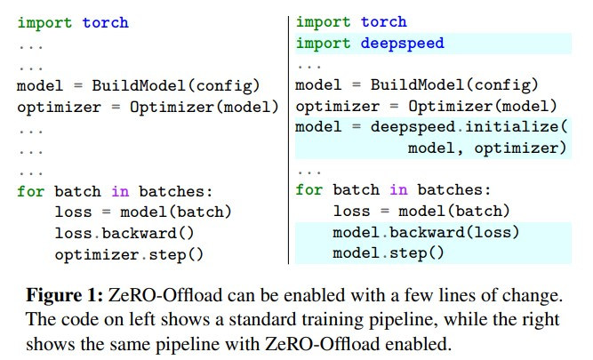
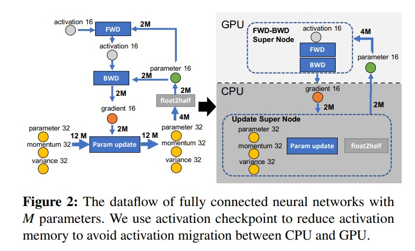
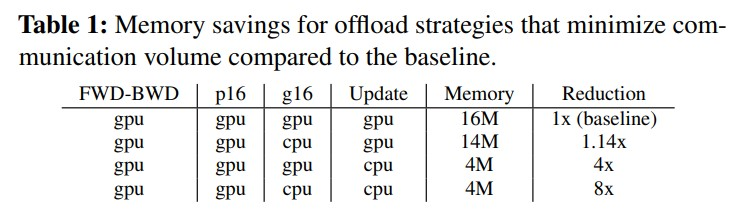
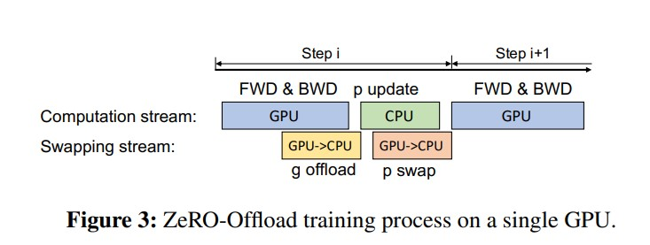
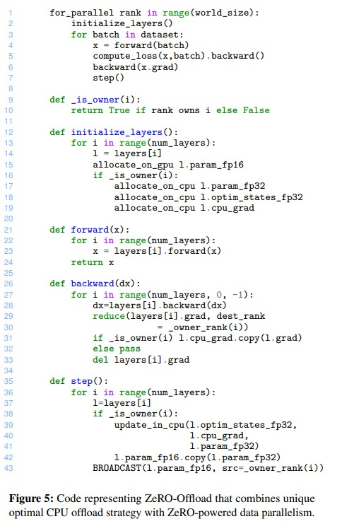

# ZeRO-Offload：普及十亿级模型训练

# 摘要
&nbsp;&nbsp;&nbsp;&nbsp;&nbsp;&nbsp;&nbsp;&nbsp;大规模模型训练一直是少数用户的专属领域，因为它通常需要进行复杂的模型重构，并且需要使用价格昂贵的GPU集群。ZeRO-Offload通过使大规模模型训练对几乎所有人都可用，改变了大模型训练的格局。**它可以在单个GPU上训练具有超过130亿参数的模型**，与流行框架如PyTorch相比，模型规模增加了10倍，并且在不需要数据科学家进行任何模型更改或牺牲计算效率(?)的情况下实现了这一点。 
&nbsp;&nbsp;&nbsp;&nbsp;&nbsp;&nbsp;&nbsp;&nbsp;ZeRO-Offload通过将数据和计算卸载到CPU上，实现了大规模模型训练。为了保持计算效率，它被设计为最小化与GPU之间的数据移动，并减少CPU计算时间，同时最大限度地节省GPU上的内存。因此，相对于仅使用PyTorch训练一个**14亿参数**模型（在GPU上不会内存溢出的最大模型），ZeRO-Offload在单个NVIDIA V100 GPU上可以实现每秒**40 TFlops**的计算能力，而**PyTorch仅为30 TFlops**。当有多个GPU可用时，ZeRO-Offload还可以进行多GPU扩展，最多支持128个GPU的近线性加速。此外，它还可以与模型并行性一起工作，在单个DGX-2机器上训练具有超过700亿&nbsp;&nbsp;&nbsp;&nbsp;&nbsp;&nbsp;&nbsp;&nbsp;参数的模型，相比之下,相对于仅使用模型并行增加了4.5倍的规模。 
通过将计算和内存效率与易用性相结合，ZeRO-Offload使大规模模型训练普及化，即使是只有单个GPU访问权限的数据科学家也可以使用。 

## 引言（Introduction）
&nbsp;&nbsp;&nbsp;&nbsp;&nbsp;&nbsp;&nbsp;&nbsp;自从2017年注意力机制的深度学习模型问世以来，我们见证了深度学习模型规模的指数级增长，这得益于这些基于注意力机制的模型在参数数量增加时所能提供的显著质量提升。例如，2017年，文献中最大的语言模型仅有不到1亿个参数。到了2018年，随着BERT的问世，这个数字增长到了超过3亿。而到了2019年，随着GPT-2、T5、Megatron-LM和Turing-NLG等模型的出现，模型规模增长到了数十亿级别。如今，最大的语言模型GPT-3拥有惊人的1750亿个参数。自2017年以来，模型规模增长了三个数量级，模型的准确度也随着模型规模的增加而提高。事实上，最近的研究表明，对于给定的准确度目标，较大的模型比较小的模型更具有资源效率。因此，我们预计未来模型的规模将继续增长。 
&nbsp;&nbsp;&nbsp;&nbsp;&nbsp;&nbsp;&nbsp;&nbsp;然而，由于当前系统技术的本质，大规模模型训练的可访问性严重受限。这些技术使得进入大规模模型训练领域成本高昂。具体来说，深度学习分布式并行训练技术，如管道并行化[10]、模型并行化[28]和ZeRO（零冗余优化器）[21]，通过将模型状态（参数、梯度和优化器状态）分布到多个GPU设备上，突破了单个GPU/加速器设备的内存限制，实现了原本无法适应单个GPU内存的大规模模型。所有破纪录的大型模型，如GPT-2、Megatron-LM、Turing-NLG和GPT-3，**都是使用上述技术的组合进行训练的**。然而，所有这些深度学习并行技术都需要足够数量的GPU设备，以便聚合的GPU内存可以容纳训练所需的模型状态(GPUS 显存之和要大于 模型状态所需显存)。例如，高效地训练一个具有100亿个参数的模型需要使用16个NVIDIA V100显卡的DGX-2等效节点，其成本超过10万美元，这已经超出了许多数据科学家、学术机构和工业机构的承受范围。 
&nbsp;&nbsp;&nbsp;&nbsp;&nbsp;&nbsp;&nbsp;&nbsp;异构深度学习训练是一种有希望的方法，通过利用CPU内存来减少GPU内存需求。在这个方向上已经做出了许多努力[8, 9, 11, 17, 23, 24, 32–34]。几乎所有这些努力都针对基于CNN的模型，其中激活内存是内存瓶颈，模型大小相对较小（小于500M）。然而，最近基于注意力机制的大规模模型训练的主要内存瓶颈是模型状态(model state)，而不是激活内存(activation)。现有文献中缺乏对于异构深度学习训练中这些工作负载的研究。此外，现有的异构训练方法在两个重要方面存在限制：i）几乎所有方法都利用CPU内存，但不利用CPU计算，而我们展示了**利用CPU计算可以显著减少CPU-GPU通信开销**；ii）它们大多数是为单个GPU设计和评估的[9, 11, 23, 34]，而在多个GPU上高效扩展的明确路径并不清晰，这对于大规模模型训练至关重要。 
&nbsp;&nbsp;&nbsp;&nbsp;&nbsp;&nbsp;&nbsp;&nbsp;针对上述限制，我们试图通过开发ZeRO-Offload来使大规模模型训练普及化，这是一种专门针对大规模模型训练的新型异构(heterogeneous)深度学习训练技术。ZeRO-Offload利用CPU内存和计算进行卸载(offload)，同时通过与基于ZeRO的数据并行技术[21]合作，提供了在多个GPU上高效扩展的明确路径。此外，我们的首要原则分析表明，ZeRO-Offload为大规模模型训练提供了一种优化的、唯一的最佳解决方案，可以在最大限度地节省内存的同时，最小化通信开销和CPU计算开销。 
&nbsp;&nbsp;&nbsp;&nbsp;&nbsp;&nbsp;&nbsp;&nbsp;ZeRO-Offload的设计基于三个主要支柱：**i) 效率，ii) 可扩展性，和 iii) 可用性**。 
&nbsp;&nbsp;&nbsp;&nbsp;&nbsp;&nbsp;&nbsp;&nbsp;**效率**：ZeRO-Offload中的卸载(offload)策略旨在实现与最先进的非卸载策略相当的计算效率，但适用于规模显著更大的模型。为了实现这个目标，我们依靠首要原则分析(principle analysis)来确定CPU和GPU设备之间的独特的最佳计算和数据分区策略。这个策略在三个关键方面是最优的：i) 与GPU相比，它在CPU上需要数量级更少的计算，防止CPU计算成为性能瓶颈；ii) 最小化CPU和GPU之间的通信量，防止通信成为瓶颈；iii) 可证明地在GPU上实现最大的内存节省，同时实现最小的通信量。 
&nbsp;&nbsp;&nbsp;&nbsp;&nbsp;&nbsp;&nbsp;&nbsp;我们的分析显示，在上述方面达到最优时，我们必须将**梯度、优化器状态和优化器计算卸载到CPU上**，同时保持**参数以及前向和反向计算在GPU上进行**。这种策略可以使模型大小增加10倍，同时实现最小的通信量和有限的CPU计算。这使得我们可以在单个NVIDIA V100 GPU上以40 TFLOPS的速度训练130亿个参数，而在相同的GPU上以12亿个参数只能达到30 TFLOPS，这是无需任何CPU卸载就能训练的最大模型。 
&nbsp;&nbsp;&nbsp;&nbsp;&nbsp;&nbsp;&nbsp;&nbsp;卸载优化器计算需要CPU执行O(M)的计算，而在GPU上执行O(MB)的计算(GPU上有分布式)，其中M和B分别是模型大小和批量大小。在大多数情况下，批量大小较大，CPU计算不是瓶颈，但对于小批量大小，CPU计算可能成为瓶颈。我们通过两种优化来解决这个问题：i) 一种高效的CPU优化器，比最先进的方法快6倍；ii) 一步延迟参数更新，允许将CPU优化器步骤与GPU计算重叠，同时保持准确性。它们共同确保了ZeRO-Offload即使在小批量大小下也能保持效率。 
&nbsp;&nbsp;&nbsp;&nbsp;&nbsp;&nbsp;&nbsp;&nbsp;**可扩展性**：良好的可扩展性对于利用可能可用的**多个GPU**非常重要，这对于一些数据科学家来说至关重要。在深度学习社区中，数据并行通常被用作将深度学习训练扩展到多个GPU的事实标准[5, 26, 35]。然而，它并不是设计用于与异构训练配合使用，并且由于数据并行训练中数据和计算的复制，它面临着可扩展性方面的挑战。数据并行训练复制所有的模型状态，如优化器状态、参数和梯度，并且在每个GPU上复制优化器计算。因此，将模型状态或优化器计算卸载到CPU，并与数据并行结合使用，将导致大量的通信和CPU计算复制：CPU内存需求与数据并行程度成比例增加，同时由于增加的通信而限制吞吐量的可扩展性。 
*注释：上述cpu 指的是 多个数据并行模型副本*
&nbsp;&nbsp;&nbsp;&nbsp;&nbsp;&nbsp;&nbsp;&nbsp;为了解决(address)这些挑战，ZeRO-Offload将独特的最佳卸载策略(optimal offload strategy)与基于ZeRO的数据并行相结合，而不是传统的数据并行。这种共生关系使得ZeRO-Offload能够在不考虑数据并行度的情况下，在CPU内存上维护优化器状态的**单个副本**。此外，它保持了GPU和CPU之间的总通信量以及CPU总计算的恒定，而不考虑数据并行性，使得ZeRO-Offload能够有效利用随着数据并行度增加而线性增加的CPU计算能力。因此，ZeRO-Offload在最多128个GPU上实现了出色的可扩展性。 
&nbsp;&nbsp;&nbsp;&nbsp;&nbsp;&nbsp;&nbsp;&nbsp;除了与基于ZeRO的数据并行相结合外，当有多个GPU可用时，ZeRO-Offload还可以与模型并行相结合[27, 28]，以实现更高的内存节省。 

&nbsp;&nbsp;&nbsp;&nbsp;&nbsp;&nbsp;&nbsp;&nbsp;**可用性**：ZeRO-Offload作为开源PyTorch库DeepSpeed的一部分提供（www.deepspeed.ai）。与第2节讨论的大多数策略不同，ZeRO-Offload不需要对模型进行重构即可工作。实际上，PyTorch用户可以通过**对现有训练流程进行少量代码更改来启用ZeRO-Offload**，如图1所示，轻松训练10倍大的模型。 
&nbsp;&nbsp;&nbsp;&nbsp;&nbsp;&nbsp;&nbsp;&nbsp;**贡献**：据我们所知，ZeRO-Offload是第一个完全分布式、基于CPU内存和计算资源的训练框架，用于训练大规模模型。我们总结其贡献如下： 
- 一种独特的异构大模型训练在GPU + CPU系统上的最佳卸载策略(offload)，使单个GPU能够容纳10倍大的模型而不损失效率（第3节和第4.1节）。  
- 通过以下两个方面实现高度可扩展的多GPU设计：i) 将卸载策略与使用ZeRO提供的数据并行性(zero1)相结合，实现ZeRO-Offload的近线性可扩展性（第4.2节），以及ii) 与模型并行(MP)训练[28]的无缝集成，使得可以训练比仅使用ZeRO-Offload或模型并行更大的模型（第4.2节）。
- 用pytorch实现的 zero-offload 开源代码
- 广泛的评估结果表明：i) 模型规模：在单个GPU上可以将模型大小增加10倍，最高可达到13B；与模型并行相比，模型大小增加了4倍，在DGX-2节点上可以达到70B参数。ii) 效率：在单个NVIDIA V100上，对于一个包含10B参数的模型，性能达到40 TFLOPS，而相同GPU上包含1.4B参数的模型只能达到30 TFLOPS，这是在没有进行任何CPU卸载的情况下可以训练的最大模型；在单个GPU上，性能超过两个最先进的异构深度学习训练框架分别达到22%和37%。iii) 可扩展性：对于一个包含10B参数的模型，在128个GPU上实现了接近完美的线性可扩展性。iv) 通过我们的ADAM实现，减少了CPU开销，相比于PyTorch优化器，速度提高了6倍；通过延迟参数更新优化，**端到端吞吐量提高了1.5倍**（第6节）。 

# 2 背景和相关工作
&nbsp;&nbsp;&nbsp;&nbsp;&nbsp;&nbsp;&nbsp;&nbsp;大模型训练中的内存消耗。在深度学习模型训练过程中，内存消耗可以分为两部分：i) 模型状态和ii) 残余状态[21]。模型状态包括参数、梯度和优化器状态（如Adam中的动量和方差）；残余状态包括激活值、临时缓冲区和无法使用的碎片化内存。 
&nbsp;&nbsp;&nbsp;&nbsp;&nbsp;&nbsp;&nbsp;&nbsp;模型状态是大模型训练中内存瓶颈的主要来源。我们考虑了由于模型状态而导致的内存消耗，针对诸如Megatron-LM（80亿）[28]、T5（110亿）[20]和Turing-NLG [25]（172亿）等大型Transformer模型。它们采用了浮点16位混合精度训练[16]和Adam优化器[13]进行训练。 
&nbsp;&nbsp;&nbsp;&nbsp;&nbsp;&nbsp;&nbsp;&nbsp;混合精度训练通常会保留两份参数副本，一份是浮点16位（fp16），另一份是浮点32位（fp32）。梯度以fp16存储。除了参数和梯度之外，Adam优化器还会跟踪梯度的动量和方差。这些优化器状态以fp32存储。因此，使用Adam优化器进行混合精度训练至少需要每个fp16参数和梯度占用2个字节的内存，每个fp32参数以及每个梯度的动量和方差占用4个字节的内存。总体而言，一个具有M个参数的模型需要占用16×M字节的内存。因此，Megatron-LM、T5和Turing-NLG的模型状态分别需要128 GB、176 GB和284 GB的内存，这显然超出了当前旗舰型号的NVIDIA A100 GPU的80 GB内存容量。 
&nbsp;&nbsp;&nbsp;&nbsp;&nbsp;&nbsp;&nbsp;&nbsp;近年来，已经进行了大量的工作，以实现大模型训练，这需要比单个GPU可用的内存更多，以适应这些模型和残余状态。这些工作可以广泛地分为两类：i) 分布式训练和ii) 单机扩展训练的方法。我们将对它们进行讨论。 
&nbsp;&nbsp;&nbsp;&nbsp;&nbsp;&nbsp;&nbsp;&nbsp;**分布式(scale-out)大模型训练**。分布式训练利用多个GPU的聚合内存来满足大模型训练的内存需求。分布式训练的两个重要示例是模型并行[5, 28]和流水线并行[7, 10]，它们都将模型状态和残余状态分割到多个GPU上。模型并行[5, 28]将模型垂直分割，并将模型分区分配到多个GPU设备上以训练大型模型。另一方面，流水线并行[7, 10]通过在层之间进行水平分割，将模型训练并行化。这两种方法都需要改变用户模型以使其工作，因此可能会限制可用性。 
&nbsp;&nbsp;&nbsp;&nbsp;&nbsp;&nbsp;&nbsp;&nbsp;最近的一个工作，ZeRO [21]，提供了一种训练大型模型的替代方案，它不同于模型并行和流水线并行。ZeRO将训练批次分配到多个GPU上，类似于数据并行训练 [5, 26, 35]，但与数据并行训练不同的是，它不会在每个GPU上复制所有的模型状态，而是将它们分割到所有的GPU上，并使用通信集合(communication collectives)在训练过程中根据需要收集各个参数。ZeRO不需要对用户模型进行更改，因此比模型或流水线并行训练更通用。它还提供更好的计算效率和可扩展性。 
&nbsp;&nbsp;&nbsp;&nbsp;&nbsp;&nbsp;&nbsp;&nbsp;尽管模型并行、流水线并行和ZeRO等方法能够训练大型模型，但它们都需要多个GPU，以使聚合GPU内存能够容纳用于训练大型模型的模型状态和残余状态(model and residual states)。相比之下，ZeRO-Offload的设计目的是通过将模型状态卸载到CPU内存中来适应更大的模型，并且可以在单个GPU上训练比原来大10倍的模型，而不会牺牲效率。当有多个GPU可用时，ZeRO-Offload被设计为与ZeRO一起工作，以提供出色的可扩展性，或与模型并行(MP)结合使用，以适应甚至比ZeRO-Offload或单独的模型并行更大的模型尺寸。 
&nbsp;&nbsp;&nbsp;&nbsp;&nbsp;&nbsp;&nbsp;&nbsp;**扩展(scale up)大型模型训练**。现有的工作通过三种主要方法在单个GPU上扩展模型大小。第一种方法通过从检查点重新计算来交换计算与激活（残余内存）的内存节省 [4]。第二种方法使用压缩技术，例如使用低精度或混合精度 [16] 进行模型训练，从而节省模型状态和激活的内存。第三种方法使用外部内存，例如CPU内存作为GPU内存的扩展，在训练过程中增加内存容量 [8, 9, 11, 17, 23, 24, 33]。 
*注释：混合精度介绍 https://developer.nvidia.com/automatic-mixed-precision*  
&nbsp;&nbsp;&nbsp;&nbsp;&nbsp;&nbsp;&nbsp;&nbsp;我们的工作ZeRO-Offload属于第三种方法。与ZeRO-Offload不同，上述工作只是将数据卸载到CPU而不是计算，并且它们使用较小的模型进行训练。此外，上述工作中没有一个是通信最优的，导致CPU和GPU之间产生额外的通信，影响训练吞吐量。相比之下，最近的一项名为L2L [18] 的工作可以通过逐层管理GPU内存使用情况来实现数百亿参数的训练。特别是，L2L会将下一层需要的张量同步移动到GPU内存进行计算，并将其余的张量保存在CPU内存中以节省内存。与ZeRO-Offload相比，它的效率有限，由于额外的通信开销，它无法在设备间进行扩展，并且需要对模型进行重构，使得使用起来更加困难。 
&nbsp;&nbsp;&nbsp;&nbsp;&nbsp;&nbsp;&nbsp;&nbsp;ZeRO 强化的数据并行训练。ZeRO-Offload 与 ZeRO 协同工作，将深度学习训练扩展到多个GPU。ZeRO 有三个阶段，分别是 ZeRO-1、ZeRO-2 和 ZeRO-3，对应于三种不同的模型状态(model state)、优化器状态(optimizer state)、梯度(grad)和参数(parameters)的分区。ZeRO-1 仅对优化器状态进行分区，而 ZeRO-2 除了优化器状态外，还对梯度进行分区，而 ZeRO-3 对所有模型状态进行分区。ZeRO-Offload 与 ZeRO-2 协同(symbiotically)工作，因此我们进一步讨论它。 
&nbsp;&nbsp;&nbsp;&nbsp;&nbsp;&nbsp;&nbsp;&nbsp;在 ZeRO-2 中，每个 GPU 存储所有参数(parameters)的副本，但在每个训练步骤结束时，只更新其中互斥(mutually)的一部分参数。由于每个 GPU 仅更新部分参数，它们仅存储更新参数(parameters)**所需的优化器状态和梯度**。更新完成后，每个 GPU 使用全局聚集(all-gather)通信集合(communicate collectives)将其更新后的参数部分发送给所有其他 GPU。ZeRO-2 的计算和通信进度如下： 
&nbsp;&nbsp;&nbsp;&nbsp;&nbsp;&nbsp;&nbsp;&nbsp;在前向传播过程中，每个 GPU 对不同的小批量样本(mini-batch)计算损失。在反向传播过程中，每计算一个梯度，都会使用一个 reduce 运算符对拥有该梯度或梯度部分的 GPU/GPUs 进行平均。在反向传播完成后，每个 GPU 使用对应部分的**平均梯度**更新其参数和优化器状态。之后，执行全局聚集(all-gather)操作以接收其他 GPU 计算的参数更新的其余部分。 

# 3 独特的最优卸载策略(Unique Optimal Offload Strategy)
&nbsp;&nbsp;&nbsp;&nbsp;&nbsp;&nbsp;&nbsp;&nbsp;ZeRO-Offload旨在通过在训练过程中将一些模型状态从GPU卸载(offload)到CPU内存，实现在单个或多个GPU上高效训练大型模型。正如第2节所讨论的，模型状态(model states)包括参数(Parameters)、梯度(grad)和优化器状态(optimizer state)，是大型模型训练中内存瓶颈的主要来源。通过将其中一些模型状态卸载到CPU上，ZeRO-Offload可以实现训练规模显著更大的模型。然而，确定最佳的卸载策略并不容易。有许多将模型状态卸载到CPU内存的方法，每种方法在CPU计算和GPU-CPU通信方面都存在不同的权衡，这两者都可能限制训练效率。 
*注释：ZeRO-Offload仅卸载模型状态。卸载激活内存等次要的内存瓶颈源超出了我们卸载策略的范围。鉴于它们明显比模型状态小得多，我们在分析目的上忽略了它们。此外，第2节中描述的第一（检查点重计算）和第二种方法（低精度或混合精度）可以与ZeRO-Offload结合使用，以减少激活内存。*
&nbsp;&nbsp;&nbsp;&nbsp;&nbsp;&nbsp;&nbsp;&nbsp;为了确定最佳的卸载策略，ZeRO-Offload将深度学习训练建模为数据流图，并使用第一原理分析来高效地在CPU和GPU设备之间对这个图进行分区。ZeRO-Offload在三个关键方面对图进行分区(partitions)，以实现最优化：i) 相较于GPU，它在CPU上需要数量级更少的计算，避免了CPU成为性能瓶颈(第3.1节); ii) 它保证了CPU和GPU内存之间通信量的最小化(第3.3节);iii) 它可以证明在最大程度减少内存使用的同时实现最小的通信量(第3.4节)。事实上，ZeRO-Offload在训练期间可以达到与非卸载训练相媲美的高效率，并且**它是独特的最优解**，意味着**没有其他解决方案可以在不增加通信量或增加CPU计算的情况下提供更好的内存节省**。 
&nbsp;&nbsp;&nbsp;&nbsp;&nbsp;&nbsp;&nbsp;&nbsp;在本节中，我们将讨论我们独特最优卸载策略的推导(derivation)过程。我们的策略**专门针对混合精度训练和Adam优化器进行设计**，大型模型训练事实上大都依赖Adam优化器。

## 3.1 将深度学习训练视为数据流图

 

*注释：具有M个参数的全连接神经网络的数据流。我们使用激活检查点来减少激活内存，以避免在CPU和GPU之间进行激活迁移。*  

&nbsp;&nbsp;&nbsp;&nbsp;&nbsp;&nbsp;&nbsp;&nbsp;深度学习训练工作负载(workload)可以表示为一个加权有向图(directed graph)，其中包含数据和计算，如图2所示。图中的圆形节点表示模型状态(parameter16、gradient16、parameter32、momentum32、variance32)，矩形节点表示计算（forward、backward、param update）。图中的边表示节点之间的数据流动，边的权重是在任何给定的训练迭代期间通过该边流动的总数据量（以字节为单位）。对于具有M个参数的模型，图中边的权重可以是2M（当源节点生成fp16模型状态）或4M（当源节点生成fp32模型状态）。 
&nbsp;&nbsp;&nbsp;&nbsp;&nbsp;&nbsp;&nbsp;&nbsp;GPU和CPU之间的卸载策略可以使用该图的双向分区来表示，其中分区中的计算节点将在拥有该分区的设备上执行，而分区中的数据节点将存储在拥有该分区的设备上。通过运行跨越两个分区的边的权重，可以确定在GPU和CPU之间必须进行通信的总数据量(2M + 2M)。 
&nbsp;&nbsp;&nbsp;&nbsp;&nbsp;&nbsp;&nbsp;&nbsp;有许多方法可以对这个图进行分区。在接下来的几节中，我们使用第一性原则来简化数据流图，以减少基于三个不同的效率指标的可能选择数量：i) CPU计算开销，ii) 通信开销，和 iii) 内存节省。

## 3.2 限制CPU计算
&nbsp;&nbsp;&nbsp;&nbsp;&nbsp;&nbsp;&nbsp;&nbsp;与GPU计算吞吐量相比，CPU计算吞吐量慢了几个数量级。因此，将大型计算图卸载到CPU上会严重限制训练效率。因此，我们**必须避免将计算密集型组件卸载到CPU上**。  
&nbsp;&nbsp;&nbsp;&nbsp;&nbsp;&nbsp;&nbsp;&nbsp;深度学习训练每次迭代(iter)的**计算复杂度**通常为O(MB)，其中M是模型大小，B是有效批量大小。为避免CPU计算成为瓶颈，只有那些计算复杂度低于O(MB)的计算才应该被卸载到CPU上。这意味着前向传播和反向传播都具有O(MB)的计算复杂度，必须在GPU上完成，而其他计算，如**范数计算、权重更新等，其复杂度为O(M)，可以卸载到CPU上**。 
&nbsp;&nbsp;&nbsp;&nbsp;&nbsp;&nbsp;&nbsp;&nbsp;基于这个简单的观察，我们将数据流图中的前向传播和反向传播节点合并为一个超级节点（FWD-BWD）并分配给GPU。 

## 3.3 最小化通信量
&nbsp;&nbsp;&nbsp;&nbsp;&nbsp;&nbsp;&nbsp;&nbsp;CPU内存带宽至少比CPU和GPU之间的PCI-E带宽快一个数量级(an order of), 而GPU内存比CPU内存甚至快一个数量级。因此，我们必须最小化CPU和GPU内存之间的通信量，以防止PCI-E带宽成为训练性能瓶颈。为此，我们必须首先确定模型状态卸载策略的理论最小通信量。 
&nbsp;&nbsp;&nbsp;&nbsp;&nbsp;&nbsp;&nbsp;&nbsp;任何模型状态卸载策略的最小通信量由4M给出。请注意，在3.2节中讨论的将前向传播和反向传播合并为一个超级节点之后，我们数据流图中的每个节点都是一个循环的一部分。因此，对这个图进行任何分区都需要切断至少两条边，每条边的权重至少为2M，从而导致至少4M的总通信量。 
*请注意，通过仅卸载部分模型状态，可以进一步减少通信量。为简化起见，我们假设模型状态的卸载意味着我们卸载整个模型状态。即使我们卸载部分模型状态，我们对通信量的内存节省的分析仍然成立。*  
&nbsp;&nbsp;&nbsp;&nbsp;&nbsp;&nbsp;&nbsp;&nbsp;如果我们选择将通信量限制在这个最低限度上，我们可以极大地简化我们的数据流图，并将分区策略的数量减少到只有几个：创建fp32超级节点。请注意，任何不将fp32模型状态与其生产者和消费者节点共享的分区策略都无法实现最小的通信量4M。这样的分区必须至少切断一条权重为4M的边和另一条至少2M的边，从而导致至少6M的通信量。因此，为了实现最小的通信量，所有的**卸载策略都必须将fp32模型状态与其生产者和消费者操作符共享**，即fp32模型状态（momentum32、variance32和parameter32）必须与**参数更新和float2half计算共享位置**。 
&nbsp;&nbsp;&nbsp;&nbsp;&nbsp;&nbsp;&nbsp;&nbsp;这个约束条件使得我们可以将数据流图中所有提到的fp32数据和计算节点视为一个称为"Update Super"的单个超级节点。我们在图2中展示了这个简化后的数据流图，它只包含四个节点：FWD-BWD超级节点、p16数据节点、g16数据节点和Update Super节点。 
&nbsp;&nbsp;&nbsp;&nbsp;&nbsp;&nbsp;&nbsp;&nbsp;**p16赋值**. 为了实现最小的通信量，p16必须与FWD-BWD Super节点共享位置，因为这两个节点之间的边权重为4M。如果将这两个节点分开，通信量将增加到6M（即4M + 2M）。由于我们已经将节点FWD-BWD Super分配给GPU以限制在CPU上的计算，p16也必须分配给GPU。 
## 3.4 最大化GPU内存节省
&nbsp;&nbsp;&nbsp;&nbsp;&nbsp;&nbsp;&nbsp;&nbsp;在简化数据流图以最小化通信量之后，只剩下g16和Update Super需要进行分配(assigned)。请注意，在这一点上，所有的分区都将导致最小的通信量，因此我们可以进一步剪枝选择，以最大化在GPU上的内存节省。表1显示了所有有效的最小化通信量的分区策略的内存节省情况。通过**将g16和Update Super都卸载到CPU上，可以实现最大的8倍内存节省**。  

 

## 3.5 独特且最优(Optimal)的卸载策略(Offload strategy)
&nbsp;&nbsp;&nbsp;&nbsp;&nbsp;&nbsp;&nbsp;&nbsp;ZeRO-Offload将所有的fp32模型状态和fp16梯度分配到CPU内存中，并在CPU上计算参数更新。fp16参数(parameter)保留在GPU上，并且正向和反向计算也在GPU上进行。 
&nbsp;&nbsp;&nbsp;&nbsp;&nbsp;&nbsp;&nbsp;&nbsp;通过简化我们的数据流图并消除所有其他分区策略，我们得出了这个卸载策略。因为其他分区(partitioning)策略不限制CPU计算、最小化通信量或最大化内存节省。因此，ZeRO-Offload不仅在上述指标上是最优的(optimal)，而且是独特的(unique)；没有其他策略可以在不增加**CPU计算复杂度**或产生额外的**GPU-CPU通信量**的情况下提供比ZeRO-Offload更多的内存节省。 

# 4 ZeRO-Offload调度
&nbsp;&nbsp;&nbsp;&nbsp;&nbsp;&nbsp;&nbsp;&nbsp;在本节中，我们将讨论在基于我们的卸载策略的单GPU系统上实现ZeRO-Offload的具体计算和通信调度。然后，我们将展示如何将这个调度有效地扩展到多GPU系统上，通过将我们的卸载策略与ZeRO数据并行和模型并行相结合。 

## 4.1 单GPU调度
&nbsp;&nbsp;&nbsp;&nbsp;&nbsp;&nbsp;&nbsp;&nbsp;如第3节所讨论的，ZeRO-Offload对数据进行分区，将fp16参数存储在GPU中，而将fp16梯度和所有优化器状态(如fp32动量、方差和参数(parameters))存储在CPU中。
&nbsp;&nbsp;&nbsp;&nbsp;&nbsp;&nbsp;&nbsp;&nbsp;在训练过程中，我们首先通过前向传播计算损失。由于fp16参数已经存在于GPU上，因此在这部分计算中不需要进行CPU通信。在反向传播过程中，不同参数的梯度在反向计算的不同时间点上被计算出来。ZeRO-Offload可以**立即将这些梯度逐个或小组地**传输到CPU内存中。因此，在将梯度传输到CPU内存之前，GPU内存只需要**暂时**存储少量的梯度。此外，每个梯度传输可以与反向图中剩余部分的反向传播重叠，使**ZeRO-Offload能够隐藏大部分通信成本**。 

 

&nbsp;&nbsp;&nbsp;&nbsp;&nbsp;&nbsp;&nbsp;&nbsp;在反向传播之后，ZeRO-Offload直接在CPU上更新fp32参数和剩余的优化器状态（如动量和方差），并将更新后的fp32参数从CPU内存复制到GPU内存中的fp16参数。图3以示意图的形式展示了ZeRO-Offload每个步骤中的计算和通信过程，图5以伪代码的形式展示了具体的调度。 

 

## 4.2 扩展到多个GPU
&nbsp;&nbsp;&nbsp;&nbsp;&nbsp;&nbsp;&nbsp;&nbsp;ZeRO-Offload的整体是ZeRO-Offload策略（在第3节中描述）和ZeRO支持的数据并行（在第2节中讨论）的共生集成，使得ZeRO-Offload能够高效地扩展到数百个GPU。ZeRO-Offload保留了ZeRO Stage-2(优化器状态和梯度分区)的模型状态分区策略，同时将分区的梯度、优化器状态和相应的参数更新卸载到CPU上。 
&nbsp;&nbsp;&nbsp;&nbsp;&nbsp;&nbsp;&nbsp;&nbsp;**在卸载之前进行这种分区**的关键好处是，对于具有多个GPU的系统，每个数据并行进程只负责更新参数的子集。从所有数据并行GPU到CPU的聚合通信量保持不变，并且CPU资源被并行使用来共同计算单个权重更新。因此，随着数据并行性的增加，总的CPU更新时间减少，因为CPU计算资源随计算节点数量的增加而线性增加。这使得ZeRO-Offload能够实现非常好的可扩展性，因为跨GPU的通信开销被CPU优化器步骤的减少所抵消。 
