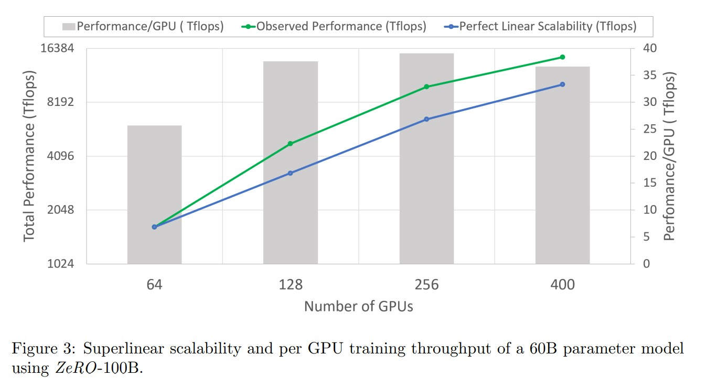

# ZeRO：面向训练万亿参数模型的内存优化

# 摘要
&nbsp;&nbsp;&nbsp;&nbsp;&nbsp;&nbsp;&nbsp;&nbsp;大型深度学习模型提供了显著的准确性提升，但训练数十亿到数万亿参数是具有挑战性的。现有的解决方案，如数据并行和模型并行，在将这些模型适应有限设备内存方面存在根本的限制，同时也无法实现计算、通信和开发的高效性。我们开发了一种新的解决方案，Zero Redundancy Optimizer（ZeRO），用于优化内存，大大提高训练速度，并增加可以高效训练的模型规模。ZeRO在数据并行和模型并行训练中消除了内存冗余，同时保持低通信量和高计算粒度，使我们能够将模型规模与设备数量成比例地扩展，并保持持续的高效性。我们对内存需求和通信量的分析表明：ZeRO有潜力在现有硬件上扩展到超过1万亿个参数的规模。 
&nbsp;&nbsp;&nbsp;&nbsp;&nbsp;&nbsp;&nbsp;&nbsp;我们实现并评估了ZeRO：它在400个GPU上以超线性的加速度训练超过1000亿参数的大型模型，实现了15 Petaflops的吞吐量。这代表了模型规模增加了8倍，性能提升了10倍，达到了最先进水平。从可用性的角度来看，ZeRO可以训练多达130亿参数的大型模型（例如，比Megatron GPT 8.3B和T5 11B还要大），而无需使用对科研人员来说更难应用的模型并行(model parallel)技术。最后但同样重要的是，研究人员利用ZeRO的系统突破创造了世界上最大的语言模型（170亿参数），并且取得了创纪录的准确性。 
# 1. 扩展介绍
&nbsp;&nbsp;&nbsp;&nbsp;&nbsp;&nbsp;&nbsp;&nbsp;深度学习模型正在变得越来越大，而模型规模的增加带来了显著的准确性提升。在自然语言处理（NLP）领域，Transformer模型为Bert-large（0.3B）[1]、GPT-2（1.5B）[2]、Megatron-LM（8.3B）[3]、T5（11B）[4]等大型模型铺平了道路。为了实现模型规模从数十亿到数万亿参数的持续增长，我们面临着训练这些模型的挑战 - 它们显然无法适应单个设备（例如GPU或TPU）的内存，而仅仅增加更多设备也无法帮助扩展训练。 
&nbsp;&nbsp;&nbsp;&nbsp;&nbsp;&nbsp;&nbsp;&nbsp;基本的数据并行（DP）不能减少每个设备的内存占用，在当前一代具有32 GB内存的GPU上，对于1.4B以上参数的模型，内存会耗尽。其他现有的解决方案，如管道并行（PP）、模型并行（MP）、CPU卸载等，在功能、可用性以及内存、计算/通信效率之间做出了权衡(trade-offs)，而这些都对于实现高速度和大规模训练至关重要。 
&nbsp;&nbsp;&nbsp;&nbsp;&nbsp;&nbsp;&nbsp;&nbsp;在训练大型模型的不同现有解决方案中，模型并行（Model Parallel）可能是最有前景的。目前文献中最大的模型，包括11B的T5模型[4]和8.3B的Megatron-LM模型[3]，都是通过模型并行(model parallel)实现的，分别使用了Mesh-Tensorflow[5]和Megatron-LM[3]。然而，模型并行在这些模型规模之外的扩展性有限。模型并行将模型垂直划分，将每层的计算和参数分配到多个设备中，需要在每层之间进行大量的通信。因此，在GPU之间的通信带宽较高的单个节点内，它们可以很好地工作，但在超过单个节点之后，效率会迅速降低[3]。我们使用Megatron-LM在两个DGX-2节点上测试了一个具有40B参数的模型，并观察到每个V100 GPU的性能约为5 T flops（不到硬件峰值的5%）。 
&nbsp;&nbsp;&nbsp;&nbsp;&nbsp;&nbsp;&nbsp;&nbsp;那么，我们如何克服现有解决方案的限制，更高效地训练大型模型呢？为了回答这个问题，我们首先分析了现有系统在模型训练中的内存消耗的全景(full spectrum)，并将其分为两个部分：1）对于大型模型，大部分内存被模型状态(model states)所占用，包括优化器状态（如Adam中的动量和方差[6]）、梯度和参数。2）剩余的内存被激活值、临时缓冲区和不可用的碎片化内存所消耗，我们统称为残余状态(residual states)。我们开发了Zero Redundancy Optimizer（ZeRO）来同时优化这两部分的内存效率，并实现高计算和通信效率。由于这两个部分面临不同的挑战，我们相应地开发和讨论它们的解决方案。 
&nbsp;&nbsp;&nbsp;&nbsp;&nbsp;&nbsp;&nbsp;&nbsp;**优化模型状态内存**:在训练过程中，模型状态通常占用最多的内存，但是现有的方法如数据并行（DP）和模型并行（MP）并没有提供令人满意的解决方案。DP在计算/通信效率方面表现良好，但在内存效率方面较差，而MP可能在计算/通信效率方面表现较差。具体而言，DP在所有数据并行进程中复制整个模型状态，导致冗余的内存消耗；而MP通过对这些状态进行分区以获得较高的内存效率，但通常会导致过于细粒度的计算和昂贵的通信，从而降低了扩展效率。此外，所有这些方法都静态地保留了整个训练过程中所需的所有模型状态，即使在训练过程中并不始终需要所有模型状态。基于这些观察结果，我们开发了ZeRO-DP，即基于ZeRO的数据并行方法，它既实现了DP的计算/通信效率，又实现了MP的内存效率。ZeRO-DP**通过对模型状态进行分区而不是复制**来消除数据并行进程中的内存状态冗余，并通过在训练过程中使用**动态通信调度**来保持DP的计算粒度和通信量，从而保持了计算/通信效率。 
&nbsp;&nbsp;&nbsp;&nbsp;&nbsp;&nbsp;&nbsp;&nbsp;ZeRO-DP有三个主要的优化阶段（如图1所示），分别对应于优化器状态、梯度和参数的分区(partitioning)。如下分类，这些阶段被渐进地启用：
1. 优化器状态分区( $P_{os}$ )：内存减少4倍，与DP相同的通信量；
2. 添加梯度分区( $P_{os+g}$ )：内存减少8倍，与DP相同的通信量；
3. 添加参数分区( $P_{os+g+p}$ )：内存减少与DP的数量 $N_{d}$ 线性相关。例如，将其分割成64个GPU( $N_{d} = 64$ )，将使内存减少64倍。通信量略有增加，约为50%。 
*注释：os: optimizer state; g: gradient; p: parameter* 
&nbsp;&nbsp;&nbsp;&nbsp;&nbsp;&nbsp;&nbsp;&nbsp;ZeRO-DP消除了内存冗余，并使整个集群的完整聚合内存容量可用。在启用了所有三个阶段的情况下，ZeRO可以在仅使用1024个NVIDIA GPU上训练一万亿参数的模型。带有Adam [6]等优化器的一万亿参数模型在16位精度下需要大约16太字节（TB）的内存来存储优化器状态、梯度和参数。16TB除以1024等于16GB，这在GPU上是一个合理的范围内（例如，具有32GB的设备内存）。 

&nbsp;&nbsp;&nbsp;&nbsp;&nbsp;&nbsp;&nbsp;&nbsp;**优化剩余状态内存**在ZeRO-DP提升了模型状态的内存效率之后，由激活值、临时缓冲区和无法使用的内存碎片所消耗的剩余内存可能成为次要的内存瓶颈。为了优化这三个因素所消耗的剩余内存，我们开发了ZeRO-R。 
1. 对于激活值（在前向传播中存储以进行反向传播），我们注意到检查点技术（checkpointing）有所帮助，但对于大型模型仍然不足。因此，ZeRO-R通过激活值分区(partitioning)来优化激活值内存，通过识别并消除现有模型并行（MP）方法中的激活值复制。当适当时，它还将激活值转移到CPU上进行处理。
2. ZeRO-R为临时缓冲区定义了适当的大小，以在内存和计算效率之间取得平衡。
3. 我们观察到在训练过程中存在着内存碎片化，这是由于不同张量的生命周期变化导致的。由于碎片化导致的非连续内存可能导致内存分配失败，即使有足够的空闲内存。ZeRO-R根据张量的不同生命周期主动管理内存，防止内存碎片化。 
ZeRO-DP和ZeRO-R的结合共同形成了一种强大的深度学习训练内存优化系统，我们统称为ZeRO。

**ZeRO和MP（模型并行）**：由于ZeRO消除了DP中的内存效率问题，自然而然地会问：我们是否仍然需要MP，以及何时需要？ZeRO如何与MP协同工作？使用ZeRO后，MP在仅用于适应大型模型方面变得不再那么吸引人。在减少每个设备内存占用方面，ZeRO-DP至少与MP一样有效，有时甚至比MP更有效，尤其是当MP无法均匀分割模型时。它还具有可比较或更好的扩展效率。此外，数据并行性非常易于使用，适用于不同的工作负载，而现今的MP方法通常需要模型开发人员对模型进行修改，系统开发人员解决分布式算子的问题，而现有的工作如Megatron-LM仅支持有限的算子和模型。

话虽如此，仍然存在一些情况我们希望利用MP（模型并行）：
1. 当与ZeRO-R结合使用时，MP可以减少非常大模型的激活值内存占用。
2. 对于较小的模型，激活值内存不是一个问题，但当仅使用DP时聚合批量大小(batch size)过大以至于无法获得良好的收敛性时，MP也可以带来好处。 
*注释：之前的研究[8]表明，非常大的批量大小可能会减慢收敛速度。对于给定的模型和数据，存在一个临界批量大小的度量指标，进一步增加批量大小会导致收敛速度变慢。详细讨论这个话题超出了本文的范围。*
在这些情况下，可以将ZeRO与MP结合使用，以适应具有可接受的聚合批量大小的模型。 

&nbsp;&nbsp;&nbsp;&nbsp;&nbsp;&nbsp;&nbsp;&nbsp;我们展示了ZeRO可以与MP结合使用，每个设备的DP度为 $N_{d}$ ,MP度为 $N_{m}$ ，最大理论内存减少为 $N_{d} \times N_{m}$ 倍。这使得我们可以在1024个GPU上使用16路模型并行（在每个DGX2节点内）和64路数据并行(数据并行跨节点)来适应具有一万亿参数的模型，并且可以使用适度的批量大小高效地运行该模型！

&nbsp;&nbsp;&nbsp;&nbsp;&nbsp;&nbsp;&nbsp;&nbsp;**实施和评估**
ZeRO中完整的一系列优化措施使我们能够在当前高端硬件集群上（例如，使用1K个V100 GPU）运行具有一万亿参数的模型，然而，硬件计算能力仍然非常有限，训练时间可能过长（超过1年）而不切实际。因此，我们在此实现中的重点是在当前硬件的计算能力范围内，高效地支持比现有最先进（SOTA）模型参数多10倍（约1000亿参数）的模型。我们实施并评估了ZeRO中的一部分优化措施，称为ZeRO-100B — ZeRO-DP的 $P_{os+g}$ 和 ZeRO-R — 它使我们能够实现这一目标。结果显示： 

**模型规模**: 结合MP，ZeRO-100B可以高效地运行具有1700亿参数的模型，而仅使用Megatron等现有系统在超过400亿参数时无法有效扩展，如图2所示。与最先进的方法相比，模型大小增加了8倍以上。
**速度**: 提升的内存效率增加了吞吐量和更快的训练速度。正如图2所示，ZeRO在一个由400个Nvidia V100 GPU组成的集群上运行100B参数模型，每个GPU的性能超过38 TFlops，并且总体性能达到15 Petaflops。这相较于相同模型大小的SOTA模型，在训练速度上提升了超过10倍。 
**可扩展性**：我们观察到在64至400个GPU的范围内，性能呈现超线性加速，当GPU数量翻倍时，性能增加超过两倍。这是ZeRO-DP的特点，随着DP（数据并行）程度的增加，它减少了模型状态的内存占用，使我们能够在每个GPU上容纳更大的批量大小，从而获得更好的性能。我们预计随着GPU数量超过400，这种行为将进一步持续下去。
**大型模型训练的民主化**：ZeRO-100B使数据科学家能够训练具有多达13B参数的模型，而无需进行任何需要对模型进行重构的MP（模型并行）或PP（流水线并行）操作，其中13B参数比文献中最大的模型（具有11B参数的T5模型）还要多。数据科学家因此可以自由地尝试大型模型，而不用担心并行性。相比之下，现有的系统（例如PyTorch Distributed Data Parallel）在处理具有1.4B参数的模型时会出现内存不足的情况。
**新的SOTA模型**：ZeRO以其具有170亿参数和创纪录的准确性而成为最大的语言模型，名为Turing-NLG [9]。 
我们将ZeRO作为我们开源的深度学习训练优化库DeepSpeed2的一部分来与大家分享。我们计划在2020年5月底发布本文中描述的所有实现，并进一步扩展其功能，通过启用ZeRO-DP阶段3的参数分区（Pos+g+p）来支持1万亿个参数。我们计划使ZeRO完全开放给深度学习社区，促进大规模大型模型训练的演进和民主化。
*注释：https://github.com/microsoft/deepspeed* 

# 2. 相关工作
## 2.1 数据、模型和流水线并行性
&nbsp;&nbsp;&nbsp;&nbsp;&nbsp;&nbsp;&nbsp;&nbsp;并行化是在大规模训练大型模型时的关键策略。对于适合设备内存进行训练的模型，使用数据并行（DP）来将训练扩展到多个设备。在DP中，模型参数被复制到每个设备上。在每个步骤中，一个小批量数据均匀地分配给所有数据并行进程，使得每个进程在不同的数据子集上执行前向和反向传播，并使用跨进程的平均梯度来局部更新模型。 
&nbsp;&nbsp;&nbsp;&nbsp;&nbsp;&nbsp;&nbsp;&nbsp;当模型不适合设备内存时，模型并行（MP）[5, 3]和流水线并行（PP）[10, 11]将模型垂直和水平地分割到进程之间。第1节讨论了ZeRO与DP和MP的关系。现在我们讨论PP及其与降低内存消耗的关系。 
&nbsp;&nbsp;&nbsp;&nbsp;&nbsp;&nbsp;&nbsp;&nbsp;PP将模型水平地分割到不同设备上的各个层，并使用微批量（micro-batching）来隐藏流水线气泡[10, 11]。由于水平分割和微批量，很难实现模型功能，如权重共享和批量归一化。流行的PP实现，如G-pipe [10]，对模型参数和总激活进行分区，但需要与流水线分区数量成比例的批量大小来隐藏流水线气泡。大批量大小可能会影响收敛速度，同时还需要大量内存来存储激活值。PipeDream [12]中的PP的不同实现方式是保留多个过时参数的副本，以隐藏流水线气泡，而不会显著增加批量大小，使其在内存效率上较低。此外，该实现与标准的深度学习训练不等价，并对训练收敛性产生影响。相比之下，ZeRO获得与PP相同或更好的内存效率，而不会带来PP的功能、性能和收敛相关的限制。 
